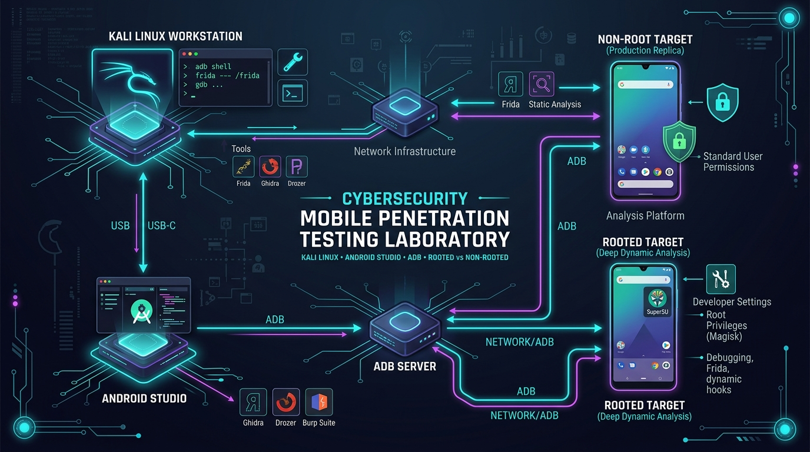
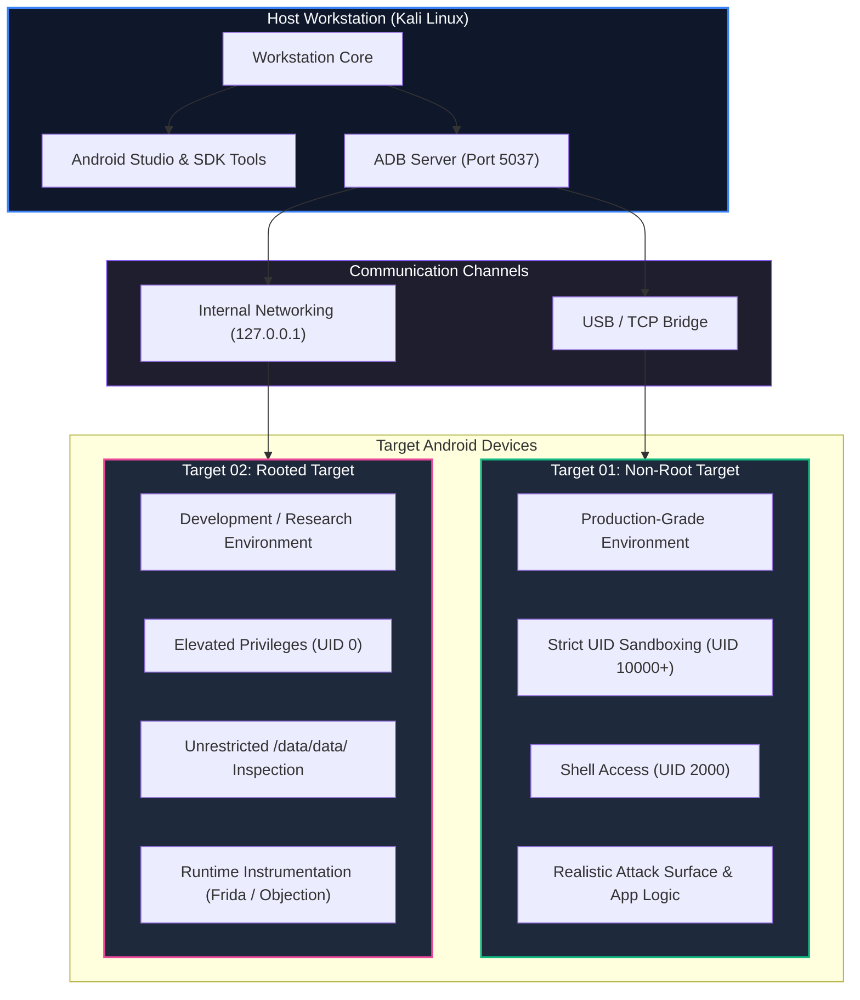
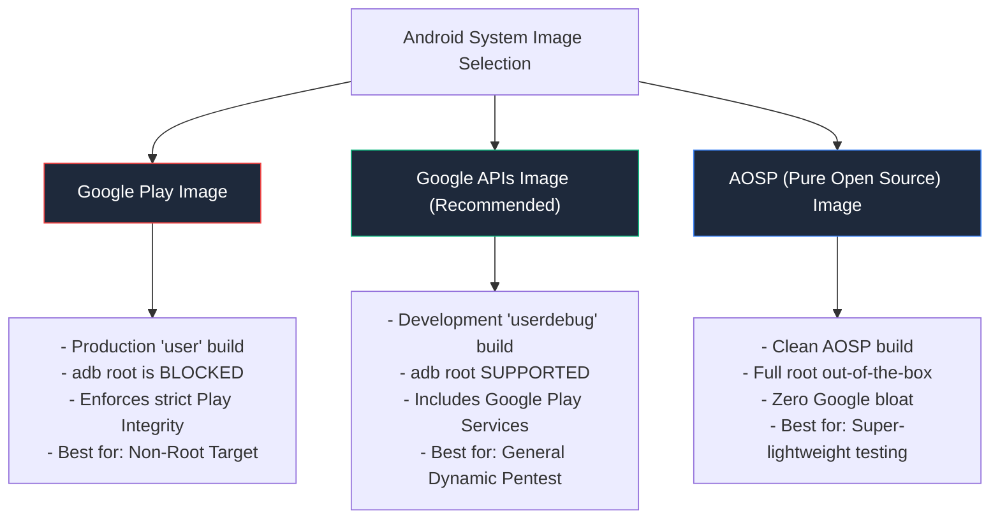
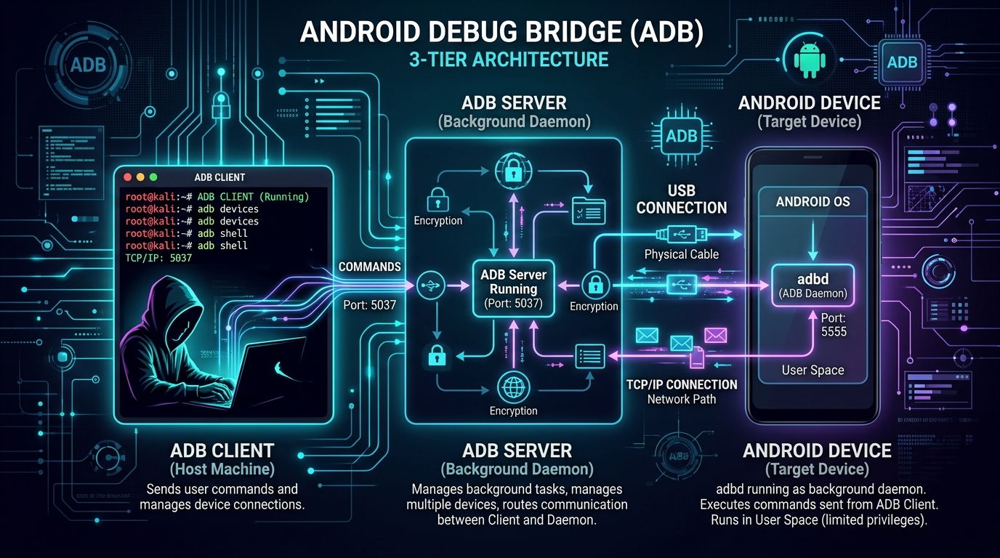
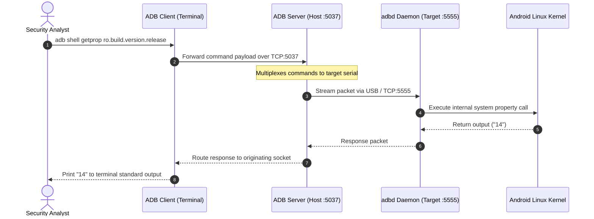
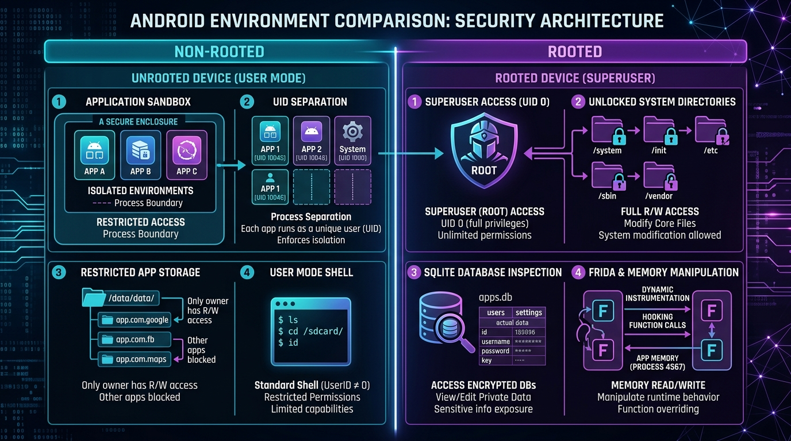
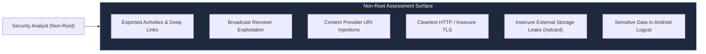
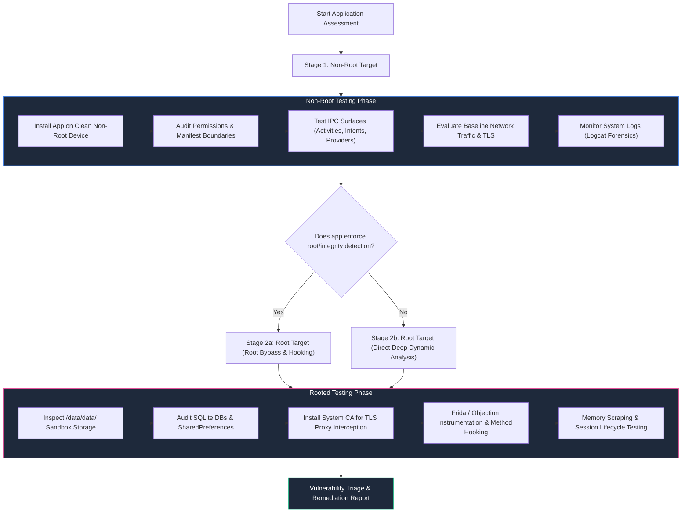
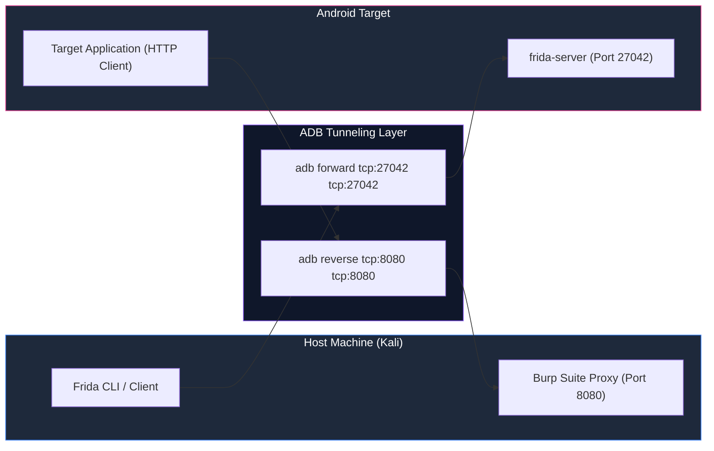
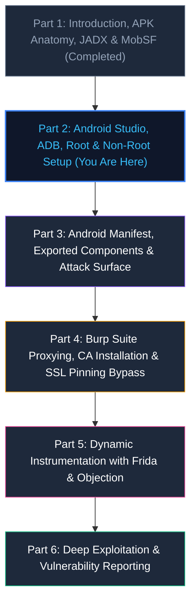

# Android Pentesting — Part 2: Android Studio, ADB, Root & Non-Root Lab Setup

> **Category:** Mobile Application Security | **Series:** Android Pentesting 101 | **Level:** Beginner to Intermediate

---

## Executive Overview

Setting up a robust, scalable, and isolated testing laboratory is the single most critical prerequisite for successful Android mobile application penetration testing. Static code auditing alone (covered in [Part 1](../Introduction,%20APK%20Analysis,%20JADX%20&%20MobSF/Android_pentest_part-1.MD)) cannot expose runtime vulnerabilities, authorization bypasses, dynamic data leakage, or cryptographic flaws during execution.

To perform professional mobile security evaluations, a security engineer requires a synchronized ecosystem consisting of a **penetration testing workstation (Kali Linux)**, a **virtualization & device orchestration suite (Android Studio & AVD)**, a **low-level hardware/software communication bridge (ADB)**, and **dual-target testing environments (Rooted & Non-Rooted)**.



```text
+-----------------------------------------------------------------------------------------------+
|                            Android Security Testing Lab Matrix                                |
+--------------------------+------------------------------------+-------------------------------+
|  Workstation Host        |  Non-Root Target (Production)      |  Rooted Target (Research)     |
|  - Kali Linux Workstation|  - Production Security Sandbox     |  - Superuser Privileges (UID 0)|
|  - Android Studio IDE    |  - Enforces Linux UID Isolation    |  - Full /data/data/ Access    |
|  - Android SDK Platform  |  - Realistic Attack Surface        |  - Frida & Objection Hooking  |
|  - ADB Server Daemon     |  - Client-Side Controls Validation |  - System-Level CA Store Edit |
+--------------------------+------------------------------------+-------------------------------+
```

> [!IMPORTANT]
> **Legal & Ethical Notice:** The techniques, configurations, and tools demonstrated in this guide are provided strictly for authorized security assessments, defensive research, and educational development. Never test applications or devices without explicit, documented permission from the asset owner.

---

# 1. Android Pentesting Lab Architecture

A common pitfall among novice security researchers is testing exclusively on a rooted device. While root access is essential for deep inspection, modern Android applications often behave differently under root, disable critical features, or crash entirely due to runtime integrity checks. 

A production-grade laboratory maintains **both** non-root and rooted environments side-by-side:



### Lab Component Responsibilities

| Component | Role in Laboratory | Primary Use Case |
| :--- | :--- | :--- |
| **Kali Linux Host** | Testing workstation & command center | Hosts security tools, proxies, decompilers, and scripts |
| **Android Studio** | Virtualization suite & SDK manager | Creates and runs Android Virtual Devices (AVD), updates SDKs |
| **ADB Platform Tools** | Bridge between host and Android device | Application deployment, device shell, logcat, filesystem transfer |
| **Non-Root Target** | Realistic production baseline | Verifying permissions, exported components, deep links, IPC flaws |
| **Rooted Target** | Deep inspection & dynamic analysis | Hooking with Frida, dumping memory, bypassing SSL pinning, database audits |

---

# 2. Installing Android Studio on Kali Linux

Android Studio provides the official Android Virtual Device (AVD) manager, system images, and SDK platform binaries needed to run high-performance emulated devices on Linux.

### Step 2.1: Verify Hardware Virtualization (KVM)

Hardware virtualization is required for Android emulators to run with near-native CPU acceleration on Linux:

```bash
# Check if your CPU supports virtualization
egrep -c '(vmx|svm)' /proc/cpuinfo
```

*If the returned number is greater than `0`, virtualization is enabled in your BIOS/UEFI.*

Next, ensure your user account has permission to access `/dev/kvm`:

```bash
# Install KVM utilities
sudo apt update && sudo apt install -y qemu-kvm libvirt-daemon-system libvirt-clients bridge-utils

# Add current user to kvm group
sudo usermod -aG kvm $USER
```

> [!TIP]
> After adding your user to the `kvm` group, log out and log back in (or run `newgrp kvm`) so group permission changes take effect.

---

### Step 2.2: Install Java OpenJDK & 32-bit Compatibility Libraries

Android Studio and the underlying build toolchain require a compatible Java Development Kit (JDK 17 or JDK 21) along with 32-bit runtime libraries:

```bash
sudo apt update
sudo apt install -y openjdk-17-jdk libc6:i386 libncurses5:i386 libstdc++6:i386 lib32z1 libbz2-1.0:i386
```

Verify Java installation:

```bash
java -version
```

---

### Step 2.3: Download and Install Android Studio

1. Download the latest Linux tarball from the official Android developer portal:
   - **Download Link:** [developer.android.com/studio](https://developer.android.com/studio)

2. Extract the archive and move it to `/opt`:

```bash
cd ~/Downloads
tar -xvzf android-studio-*-linux.tar.gz
sudo mv android-studio /opt/
```

3. Launch the Android Studio setup wizard:

```bash
/opt/android-studio/bin/studio.sh
```

---

### Step 2.4: Initial Setup Wizard Walkthrough

During the first run of the setup wizard:

```text
Welcome Screen ──────> Select "Do not import settings"
      │
      ▼
Installation Type ───> Select "Standard" (installs SDK, platform tools & emulator)
      │
      ▼
Verify Settings ─────> Confirm SDK path: ~/Android/Sdk
      │
      ▼
License Agreement ───> Accept "android-sdk-license" & "android-sdk-arm-dbt-license"
      │
      ▼
Finish ──────────────> Android Studio downloads and extracts the core SDK packages
```

---

### Step 2.5: Create Desktop Launcher & Global Terminal Shortcut

To avoid typing the full path every time, create a convenient command-line symlink and desktop shortcut:

```bash
# Create global terminal shortcut
sudo ln -sf /opt/android-studio/bin/studio.sh /usr/local/bin/studio

# Create desktop entry
cat << 'EOF' > ~/.local/share/applications/android-studio.desktop
[Desktop Entry]
Version=1.0
Type=Application
Name=Android Studio
Comment=Android Development & Emulation Suite
Exec=/opt/android-studio/bin/studio.sh %f
Icon=/opt/android-studio/bin/studio.svg
Terminal=false
StartupNotify=true
Categories=Development;IDE;Security;
EOF
```

You can now start Android Studio simply by executing `studio` from any terminal or opening it from your Kali application menu.

---

# 3. Android Platform Tools & SDK Configuration

The Android SDK contains several modular toolsets. The most critical for security analysts is **`platform-tools`**, which houses `adb` and `fastboot`.

```text
~/Android/Sdk/
├── build-tools/        # Compilers, zipalign, apksigner, d8/r8
├── cmdline-tools/      # sdkmanager, avdmanager
├── emulator/           # QEMU-based hypervisor engine
├── platform-tools/     # adb, fastboot, etc. (PRIMARY PENTEST TOOLS)
├── platforms/          # android.jar API definitions (API 31, 33, 34...)
└── system-images/      # AVD OS disk images (Google APIs, AOSP)
```

---

### Step 3.1: Configure Persistent Environment Variables

By default, the platform tools and emulator binaries are not added to Kali's global `$PATH`. Add them permanently to your shell configuration (`~/.bashrc` or `~/.zshrc`):

```bash
# Append Android SDK paths to ~/.bashrc and ~/.zshrc
cat << 'EOF' >> ~/.bashrc

# Android SDK Platform Tools & Emulator
export ANDROID_HOME=$HOME/Android/Sdk
export PATH=$PATH:$ANDROID_HOME/platform-tools
export PATH=$PATH:$ANDROID_HOME/emulator
export PATH=$PATH:$ANDROID_HOME/cmdline-tools/latest/bin
EOF

# If Kali uses Zsh as the default shell:
cat << 'EOF' >> ~/.zshrc

# Android SDK Platform Tools & Emulator
export ANDROID_HOME=$HOME/Android/Sdk
export PATH=$PATH:$ANDROID_HOME/platform-tools
export PATH=$PATH:$ANDROID_HOME/emulator
export PATH=$PATH:$ANDROID_HOME/cmdline-tools/latest/bin
EOF
```

Apply the changes to your current terminal session:

```bash
source ~/.bashrc
# Or if on zsh:
# source ~/.zshrc
```

---

### Step 3.2: Verify SDK Configuration

Verify that Kali Linux can locate and run the tools from any working directory:

```bash
# Verify ANDROID_HOME path
echo $ANDROID_HOME
# Expected: /home/<user>/Android/Sdk

# Verify ADB
adb --version
# Expected: Android Debug Bridge version 1.0.41 (or higher)

# Verify Emulator engine
emulator -version
# Expected: Android emulator version 34.x.x
```

---

# 4. Virtual Device Architecture & System Image Selection

When creating an Android Virtual Device (AVD), selecting the **proper system image type** is the difference between having full pentesting capabilities or running into road blocks.



### System Image Comparison Matrix

| System Image Type | Build Tag | `adb root` Allowed? | Google Play Store | Recommended Use Case |
| :--- | :---: | :---: | :---: | :--- |
| **Google Play** | `user` | ❌ **No** | ✅ Yes | **Target 01 (Non-Root):** Realistic end-user sandbox testing |
| **Google APIs** | `userdebug` | ✅ **Yes** | ❌ App Store (APIs only) | **Target 02 (Rooted):** Default pentesting environment (Frida, proxying, root access) |
| **AOSP (No APIs)** | `userdebug` | ✅ **Yes** | ❌ None | **Ultra-lightweight root testing** without Google background telemetry |

> [!WARNING]
> If you select a **Google Play** system image, running `adb root` will fail with:  
> `adbd cannot run as root in production builds`.  
> Always select **Google APIs** or **AOSP** if you need `adb root` or system partition modification capabilities.

---

### Step 4.1: Creating Target 01 — Non-Root AVD (GUI Method)

1. Launch Android Studio and open **Tools → Device Manager**.
2. Click **Create Device**.
3. Select a device hardware profile (e.g., **Pixel 7** or **Pixel 6a**).
4. In the **System Image** selection tab:
   - Select the **Release Name** (e.g., **Android 14 (UpsideDownCake) - API 34**).
   - Look under the column **Target**: Choose **Google Play**.
5. Click **Download** if the image is not already cached locally.
6. Name the AVD: `Pentest_NonRoot_API34`.
7. Click **Finish**.

---

### Step 4.2: Creating Target 02 — Root-Capable AVD (GUI Method)

1. Click **Create Device** again.
2. Select the same hardware profile (e.g., **Pixel 7**).
3. In the **System Image** tab:
   - Navigate to the **x86 Images** or **Recommended** tab.
   - Choose **Android 13 (Tiramisu) - API 33** or **Android 14 - API 34**.
   - **CRITICAL:** Ensure the target says **Google APIs** (without the Play Store icon).
4. Click **Download** and proceed.
5. Name the AVD: `Pentest_Rooted_API34`.
6. Under **Advanced Settings**, allocate at least `4096 MB` (4 GB) of RAM and `16 GB` of Internal Storage.
7. Click **Finish**.

---

### Step 4.3: Creating and Launching Emulators via Command Line (CLI)

Security professionals frequently manage emulators headless or directly from the terminal without opening Android Studio:

```bash
# List available system images for download
sdkmanager --list | grep system-images

# Download Google APIs system image for API 34
sdkmanager "system-images;android-34;google_apis;x86_64"

# Create the AVD via command line
avdmanager create avd \
  -n "Pentest_Lab_Root" \
  -k "system-images;android-34;google_apis;x86_64" \
  -d "pixel_7"

# List configured AVDs
emulator -list-avds
```

Launch the emulator directly from terminal:

```bash
# Launch with hardware acceleration and writable system partition
emulator -avd Pentest_Lab_Root -writable-system -no-snapshot-load
```

---

# 5. Deep Dive into ADB (Android Debug Bridge)

The **Android Debug Bridge (ADB)** is the ubiquitous client-server control plane used to communicate with Android devices. Understanding its internal architecture is crucial when troubleshooting connection issues, configuring proxy listeners, and orchestrating multiple target environments.



### The 3-Tier Architecture

ADB is composed of three interconnected architectural entities:

1. **ADB Client:**  
   The command-line program (`adb`) executed by the security analyst on Kali Linux. Whenever you run a command such as `adb shell` or `adb install`, you are interacting with the client. The client communicates with the background server over **TCP port 5037**.

2. **ADB Server:**  
   A background background daemon running on the host workstation. It manages communication between the client and all active Android device instances (both physical USB connections and TCP emulators). If an ADB server is not already active, the client automatically starts one.

3. **ADB Daemon (`adbd`):**  
   A background process running directly within the Android operating system on the target device. It listens for incoming commands from the host ADB server, executes them within the device's Linux kernel user space, and returns standard output/error back across the bridge.

---

### ADB Command Execution Sequence



---

### Verifying Device Connectivity

Start the target emulator, wait for the home screen to finish booting, and execute:

```bash
adb devices -l
```

**Expected Standard Output:**

```text
List of devices attached
emulator-5554          device product:husky model:Pixel_7 device:husky transport_id:1
```

If the state displays as `offline` or `unauthorized`, refer to [Section 12: Troubleshooting Guide](#12-troubleshooting-guide).

---

# 6. Android Sandbox & Privilege Model

To understand why both Non-Root and Rooted environments are mandatory, we must examine the **Android Security Model**.

Android is built on top of a modified Linux kernel. Unlike traditional desktop Linux distributions where all desktop applications run under the same user UID (e.g., UID 1000), Android treats **every installed application as a distinct Linux user**:

```text
Android Application Sandboxing Architecture:

+-----------------------------------------------------------------------------------+
|                            Linux Kernel Boundaries                                |
+------------------------------------+----------------------------------------------+
|  Application A (com.bank.app)      |  Application B (com.malicious.app)           |
|  - Assigned UID: u0_a185 (10185)   |  - Assigned UID: u0_a204 (10204)             |
|  - Private Directory:              |  - Private Directory:                        |
|    /data/data/com.bank.app/        |    /data/data/com.malicious.app/             |
|    (Mode: 700 / drwx------)        |    (Mode: 700 / drwx------)                  |
|  - Cannot read App B's data        |  - Kernel blocks access to App A's data      |
+------------------------------------+----------------------------------------------+
                                  ▲
                                  │ Enforced by Kernel DAC & SELinux
+---------------------------------+-------------------------------------------------+
|  Shell User (ADB Default)       |  Superuser (Root)                               |
|  - Assigned UID: shell (2000)   |  - Assigned UID: root (0)                       |
|  - Can access /sdcard/ & system |  - Overrides DAC file permissions               |
|  - Cannot read /data/data/ app  |  - Can inspect every app sandbox & memory space |
+---------------------------------+-------------------------------------------------+
```

### Key Privilege Levels

| Identity | UID / GID | Capabilities & Boundary Restrictions |
| :--- | :---: | :--- |
| **Root** | `0` | Absolute system control. Can read/write any file, inject into any process, modify `/system`, and inspect memory. |
| **System** | `1000` | Core OS services (`system_server`). Manages package management, telephony, and window layout. |
| **Shell** | `2000` | Default privilege level when executing `adb shell`. Can install apps, read logcat, and inspect global properties, but **cannot** enter an app's private `/data/data/<package>` directory. |
| **Application** | `10000+` (`u0_a...`) | Isolated application sandbox. Confined to its private directories and explicitly declared permissions. |

---

# 7. Target 01: Non-Root Testbed (Production Replica)

The **Non-Root target** represents the authentic operational environment experienced by normal users and production devices.



### Why Non-Root Testing is Crucial

Testing exclusively on root introduces dangerous false positives and blind spots:
1. **Root Detection Masking:** If an app detects root and shuts down or enters a hardened decoy mode, you cannot evaluate its authentic business logic.
2. **Attacker Privilege Assumption:** Real-world attackers exploiting a vulnerable application from another installed app or an untrusted Wi-Fi network do **not** inherently have root on the victim's device.
3. **Privilege Boundary Realism:** You must verify whether an application's client-side protections (e.g., biometric authentication, SharedPreferences flags, IPC component permissions) hold up when running in an unprivileged sandbox.

---

### Verifying Non-Root Privileges

Connect to the non-root emulator and inspect the environment:

```bash
adb -s emulator-5554 shell
```

Inside the Android shell:

```bash
# Check current user and groups
id
# Output: uid=2000(shell) gid=2000(shell) groups=2000(shell),1004(input),1007(log)...

# Attempt to switch to root
su
# Output: /system/bin/sh: su: inaccessible or not found
```

---

### Non-Root Security Assessment Surface

When operating against the non-root target, focus on the **externally accessible attack surface**:



* **Exported Components:** Can a malicious third-party app trigger sensitive internal screens (`Activities`) or services without authentication?
* **Deep Links & Intent Filters:** Does opening a custom URL schema (`myapp://reset-password?token=...`) expose confidential tokens or execute unauthorized actions?
* **Shared Storage Leaks:** Does the app write cached invoices, unencrypted session tokens, or personal identifiers to publicly readable storage (`/sdcard/` or `/storage/emulated/0/`)?
* **Logcat Leakage:** Does the application dump sensitive secrets, cryptographic keys, or PII into system-wide logs?

---

# 8. Target 02: Rooted Testbed (Deep Dynamic Analysis)

The **Rooted target** removes operating system boundaries, providing the security researcher with complete visibility into the application's runtime state.

### Capabilities Unlocked by Root Access

1. **Private Sandbox Auditing:** Direct access to `/data/data/<package_name>/`, including SQLite databases, plaintext cache files, and XML SharedPreferences.
2. **Dynamic Instrumentation (Frida & Objection):** Injecting custom JavaScript into the running Dalvik/ART process to hook functions, alter execution flow, and bypass security controls.
3. **Custom CA Certificate Injection:** Installing self-signed Burp Suite or OWASP ZAP CA certificates into Android's trusted system certificate store (`/system/etc/security/cacerts/`) to intercept TLS traffic across modern Android versions (API 24+).
4. **Memory Dumping:** Extracting encryption keys, unencrypted passwords, and session tokens directly from active process RAM.

---

### Elevating ADB to Root

On a development image (**Google APIs** or **AOSP**), elevating to root is instantaneous:

```bash
# Restart the ADB daemon with root privileges
adb root
# Expected: restarting adbd as root

# Verify elevation
adb shell id
# Expected: uid=0(root) gid=0(root) groups=0(root)...

adb shell whoami
# Expected: root
```

---

### Exploring the Target's Private Application Sandbox

With root privileges established, you can navigate directly into the private application storage directory that is otherwise blocked by Linux DAC permissions:

```bash
# Enter root shell
adb shell

# Navigate to application private directory
cd /data/data/com.example.targetapp/

# Inspect directory structure
ls -la
```

**Standard Sandbox Layout:**

```text
/data/data/com.example.targetapp/
├── app_flutter/        # Hybrid Flutter asset bundles
├── cache/              # Temporary cached HTTP responses & images
├── code_cache/         # JIT/AOT compiled code artifacts
├── databases/          # SQLite databases (.db, .sqlite, .db-wal)
├── files/              # Custom written application data files
└── shared_prefs/       # Key-value XML files (tokens, settings, credentials)
```

---

### Inspecting Local Databases & SharedPreferences

Examine unencrypted settings and credentials saved locally:

```bash
# Dump SharedPreferences XML files
cat /data/data/com.example.targetapp/shared_prefs/*.xml

# Query SQLite database tables directly using sqlite3
sqlite3 /data/data/com.example.targetapp/databases/user_data.db ".tables"
sqlite3 /data/data/com.example.targetapp/databases/user_data.db "SELECT * FROM users;"
```

---

# 9. Root vs. Non-Root Decision Matrix & Testing Strategy

To maximize efficiency and simulate real-world attack vectors accurately, adopt a **phased progression**:



### Side-by-Side Comparison Matrix

| Testing Vector | Non-Root Target | Rooted Target | Analytical Rationale |
| :--- | :---: | :---: | :--- |
| **Realistic Threat Simulation** | ⭐⭐⭐⭐⭐ | ⭐⭐ | Confirms if unprivileged adversaries can exploit flaws without device compromise. |
| **Root Detection Analysis** | ⭐⭐⭐⭐⭐ | ⭐⭐⭐ | Non-root verifies standard behavior; root lets you analyze detection mechanics. |
| **Sandbox Data Auditing** | ❌ Blocked | ⭐⭐⭐⭐⭐ | Must be root to inspect protected `/data/data/` databases and XML configs. |
| **System CA Injection** | ❌ Blocked | ⭐⭐⭐⭐⭐ | Android 7+ ignores user certs by default; root is needed to write to `/system/etc/security/cacerts/`. |
| **Runtime Hooking (Frida)** | ⭐ Limited | ⭐⭐⭐⭐⭐ | Non-root requires manual APK repackaging with `frida-gadget.so`; root allows direct server attachment. |
| **Memory Extraction** | ❌ Blocked | ⭐⭐⭐⭐⭐ | Requires kernel ptrace or memory access permissions reserved for root. |

---

# 10. Managing Multiple Android Devices in Practice

A professional lab setup frequently runs multiple emulators and physical devices concurrently. When more than one target is connected, bare `adb` commands will fail with:

```text
error: more than one device/emulator
```

---

### Step 10.1: Listing Active Devices with Detailed Identifiers

```bash
adb devices -l
```

**Example Output:**

```text
List of devices attached
emulator-5554          device product:husky model:Pixel_7 device:husky transport_id:1
emulator-5556          device product:cheetah model:Pixel_7_Pro device:cheetah transport_id:2
192.168.1.105:5555     device product:aosp model:Physical_Test_Phone transport_id:3
```

---

### Step 10.2: Targeting Specific Devices with the `-s` Flag

Always specify the **serial number** (`-s <serial>`) to route commands explicitly:

```bash
# Execute shell on the Non-Root target (emulator-5554)
adb -s emulator-5554 shell id
# Output: uid=2000(shell)

# Execute shell on the Rooted target (emulator-5556)
adb -s emulator-5556 root
adb -s emulator-5556 shell id
# Output: uid=0(root)

# Install APK to a specific target
adb -s emulator-5554 install target_app.apk
```

---

### Step 10.3: Port Forwarding and Reverse Tunneling

ADB provides robust port redirection capabilities for communicating with mobile testing frameworks and proxies:



#### Forwarding Host Port to Device (Frida / Remote Debugging):

```bash
# Forward host port 27042 to device port 27042 (Frida default)
adb -s emulator-5556 forward tcp:27042 tcp:27042
```

#### Reverse Tunneling Device Port to Host (Proxying Traffic):

```bash
# Route traffic hitting port 8080 on the Android device back to Burp Suite on Kali
adb -s emulator-5554 reverse tcp:8080 tcp:8080
```

*This enables the Android device to route HTTP requests directly to `http://127.0.0.1:8080`, completely avoiding Wi-Fi network routing conflicts.*

---

# 11. The Pentester's ADB Command Arsenal (Cheat Sheet)

This section compiles high-yield ADB commands utilized during security assessments, complete with contextual rationale and expected output.

---

### 11.1 Target Reconnaissance & Property Extraction

```bash
# 1. Retrieve Android OS version (e.g., "14")
adb shell getprop ro.build.version.release

# 2. Retrieve Android API SDK level (e.g., "34")
adb shell getprop ro.build.version.sdk

# 3. Retrieve CPU architecture / ABI (Crucial for selecting Frida server binary!)
adb shell getprop ro.product.cpu.abi
# Common values: x86_64, arm64-v8a, armeabi-v7a

# 4. Retrieve device model and manufacturer
adb shell getprop ro.product.manufacturer
adb shell getprop ro.product.model

# 5. Check build type (user vs userdebug)
adb shell getprop ro.build.type
# user = Production / Non-root | userdebug = Developer / Root-capable
```

---

### 11.2 Package & Binary Management

```bash
# Install an APK onto the target device
adb install app.apk

# Reinstall an existing APK while retaining application user data
adb install -r app.apk

# Install allowing downgrade (useful for testing patch regressions)
adb install -r -d app.apk

# Install targeting a test/debug APK
adb install -t app.apk

# Uninstall an application completely
adb uninstall com.example.targetapp

# List all installed 3rd-party user applications (excludes system apps)
adb shell pm list packages -3

# Search for a specific package name
adb shell pm list packages | grep -i target

# Extract the APK filesystem path on the device
adb shell pm path com.example.targetapp
# Output: package:/data/app/~~u1h8e3==/com.example.targetapp-1/base.apk

# Pull the installed APK binary directly from the device to Kali
adb pull /data/app/~~u1h8e3==/com.example.targetapp-1/base.apk ./extracted_target.apk
```

---

### 11.3 Component & Configuration Auditing (`dumpsys`)

The `dumpsys` utility dumps diagnostic system services and package definitions:

```bash
# Dump comprehensive package details (Permissions, Activities, Services, Signatures)
adb shell dumpsys package com.example.targetapp > package_dump.txt

# Extract only granted runtime permissions
adb shell dumpsys package com.example.targetapp | grep -A 20 "runtime permissions:"

# Find the currently active/focused foreground Activity
adb shell dumpsys window | grep -E "mCurrentFocus|mFocusedApp"
```

---

### 11.4 Process Launching & Component Execution

```bash
# Launch the main launcher Activity using the monkey testing tool
adb shell monkey -p com.example.targetapp -c android.intent.category.LAUNCHER 1

# Launch a specific exported Activity directly via Activity Manager (am)
adb shell am start -n com.example.targetapp/.ui.admin.AdminPanelActivity

# Launch an Activity while passing Intent parameters (Testing Intent Injection)
adb shell am start -n com.example.targetapp/.ui.DebugActivity \
  --es "auth_token" "DEBUG_TEST_TOKEN" \
  --ez "is_admin" true

# Send a custom Broadcast Intent to test an exported receiver
adb shell am broadcast -a com.example.targetapp.action.TRIGGER_SYNC
```

---

### 11.5 Bidirectional File Transfers

```bash
# Push a custom CA certificate or Frida script to the device's shared storage
adb push burp_cacert.der /sdcard/burp_cacert.der

# Pull an exported database or local cache file to Kali for offline auditing
adb pull /sdcard/Download/exported_report.pdf ./evidence/

# Pull protected database (when running adb root)
adb pull /data/data/com.example.targetapp/databases/app_database.db ./app_database.db
```

---

### 11.6 Logcat Security Telemetry & Forensics

Android Logcat records system-wide messages, exceptions, and developer debug statements. Improper logging often results in critical vulnerabilities (**CWE-532: Insertion of Sensitive Information into Log File**).

```bash
# 1. Clear existing log buffer before beginning a test case
adb logcat -c

# 2. Stream logs formatted with precise timestamps
adb logcat -v time

# 3. Stream logs exclusively for a specific application PID
adb logcat --pid=$(adb shell pidof -s com.example.targetapp)

# 4. Search for sensitive tokens, passwords, or keys in real-time
adb logcat | grep -iE "password|token|bearer|api_key|secret|jwt|auth"

# 5. Search for crashes and unhandled Java/Kotlin exceptions
adb logcat | grep -iE "fatal|exception|crash|androidruntime"

# 6. Save a complete diagnostic capture to disk for reporting evidence
adb logcat -d -v threadtime > complete_session_logcat.log
```

---

### 11.7 Screen Capture & Video Evidence Recording

```bash
# Capture a screenshot directly to your Kali current working directory
adb exec-out screencap -p > poc_screenshot.png

# Record an MP4 video of an exploit flow (e.g., authentication bypass)
adb shell screenrecord /sdcard/exploit_demo.mp4
# (Press Ctrl+C when finished, then pull to host:)
adb pull /sdcard/exploit_demo.mp4 ./exploit_proof_of_concept.mp4
```

---

# 12. Troubleshooting Guide

Common issues encountered when setting up the lab, along with actionable resolutions:

### Issue 1: `adb: device unauthorized`

```text
List of devices attached
emulator-5554    unauthorized
```

* **Root Cause:** The Android device has not accepted the RSA host authentication key from the Kali workstation.
* **Resolution:**
  1. Unlock the Android emulator screen.
  2. Look for the prompt: **"Allow USB debugging? Always allow from this computer"**.
  3. Check the box and click **Allow**.
  4. If the prompt does not appear, restart ADB on Kali:
     ```bash
     adb kill-server
     rm -rf ~/.android/adbkey ~/.android/adbkey.pub
     adb start-server
     adb devices
     ```

---

### Issue 2: `adbd cannot run as root in production builds`

```text
$ adb root
adbd cannot run as root in production builds
```

* **Root Cause:** The virtual device was provisioned using a **Google Play** system image (a sealed `user` build).
* **Resolution:**
  1. Open Android Studio **Device Manager**.
  2. Create a new AVD.
  3. Select an image labeled **Google APIs** or **AOSP** (under the `x86 Images` tab).
  4. Boot the new AVD and execute `adb root`.

---

### Issue 3: Hardware Acceleration Error (`/dev/kvm permission denied`)

```text
emulator: ERROR: KVM is not installed or available
```

* **Root Cause:** The current Linux user lacks read/write permissions to the `/dev/kvm` character device.
* **Resolution:**
  ```bash
  # Check current permissions
  ls -la /dev/kvm
  # Add user to kvm group
  sudo usermod -aG kvm $USER
  # Apply group update without reboot
  newgrp kvm
  ```

---

### Issue 4: Port Conflict on ADB Server (`port 5037 already in use`)

* **Root Cause:** A rogue background process or secondary virtualization software is binding port 5037.
* **Resolution:**
  ```bash
  # Identify process binding port 5037
  sudo lsof -i :5037
  # Terminate and restart cleanly
  sudo killall adb
  adb start-server
  ```

---

# 13. Summary & Roadmap

You now have a fully operational, multi-device Android security assessment laboratory built on Kali Linux!

```text
Lab Milestone Checklist:
 [✓] Kali Linux Host Workstation Configured
 [✓] Android Studio & Virtualization Environment Running
 [✓] Android Platform Tools & Persistent PATH Variables Configured
 [✓] Target 01: Non-Root Production Baseline AVD Operational
 [✓] Target 02: Root-Capable Deep Dynamic AVD Configured
 [✓] ADB Client-Server-Daemon Architecture Mastered
 [✓] Bidirectional File Transfer & Telemetry Logging Verified
```

---

### The Android Pentesting Series Roadmap

With our lab fully established, we are ready to move into hands-on testing phases:



* **Part 1:** [Introduction, APK Analysis, JADX & MobSF](../Introduction,%20APK%20Analysis,%20JADX%20&%20MobSF/Android_pentest_part-1.MD)
* **Part 2:** Android Studio, ADB, Root & Non-Root Lab Setup *(Current Guide)*
* **Part 3:** Deconstructing AndroidManifest.xml: Exported Components & IPC Attack Surface
* **Part 4:** Traffic Interception: Burp Suite, Network Security Configs & SSL Pinning Bypass
* **Part 5:** Dynamic Instrumentation: Runtime Method Hooking with Frida & Objection
* **Part 6:** Exploitation Walkthrough: Content Providers, Insecure Storage & Final Reporting
