# Android Pentesting — Part 1: Introduction, APK Analysis, JADX & MobSF

> **Category:** Mobile Application Security | **Series:** Android Pentesting 101 | **Level:** Beginner to Intermediate

---

## Executive Overview

Android applications are cornerstone endpoints in modern enterprise architectures. Because they handle critical operations—ranging from biometric authentication and session persistence to high-value financial transactions and proprietary API orchestration—they constitute a high-value attack surface.

```
+-----------------------------------------------------------------------------------+
|                           Mobile Threat Vector Surface                            |
+-------------------------+-------------------------+-------------------------------+
|  Client-Side Storage    |  Inter-Process Comms    |  Transport & Network Layer    |
|  - SharedPreferences    |  - Exported Activities  |  - Insecure TLS Validation    |
|  - SQLite Databases     |  - Broadcast Hijacking  |  - Cleartext HTTP Fallbacks   |
|  - Insecure Keystore    |  - Content Provider SQLi|  - Hardcoded API Gateways     |
+-------------------------+-------------------------+-------------------------------+
```

**Android penetration testing** is the methodical evaluation of an Android application, its IPC boundaries, local data handling, and backend communication channels to expose exploitable flaws under an authorized scope of work.

> [!IMPORTANT]
> **Legal & Ethical Notice:** All security evaluations, decompilation workflows, and instrumentation described in this series must be conducted exclusively against assets for which you have explicit, documented authorization.

---

# 1. Android Pentesting Methodology

A structured assessment methodology prevents blind spots by combining static reconnaissance with runtime validation.

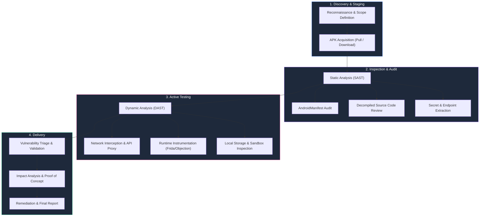

### Phase Breakdown

| Assessment Phase | Primary Objective | Primary Tools |
| :--- | :--- | :--- |
| **Reconnaissance** | Identify app variants, environments, target servers | Google Play, OSINT |
| **APK Acquisition** | Extract target package binaries and split APKs | `adb`, APK downloaders |
| **Static Analysis** | Audit manifest, logic flows, hardcoded secrets | JADX, MobSF, APKTool |
| **Dynamic Analysis** | Monitor live behavior, filesystem modifications, logs | Android Emulator, `adb logcat` |
| **Network & API** | Intercept traffic, bypass pinning, test endpoints | Burp Suite, Caido, Mitmproxy |
| **Runtime Analysis** | Hook methods, alter control flow, dump memory | Frida, Objection |
| **Validation** | Confirm reproducibility and eliminate false positives | Custom Python / Bash PoCs |

---

# 2. Anatomy of an Android Application (APK)

An **APK (Android Package)** file is fundamentally a ZIP archive packaged with standard directories and pre-compiled bytecode.

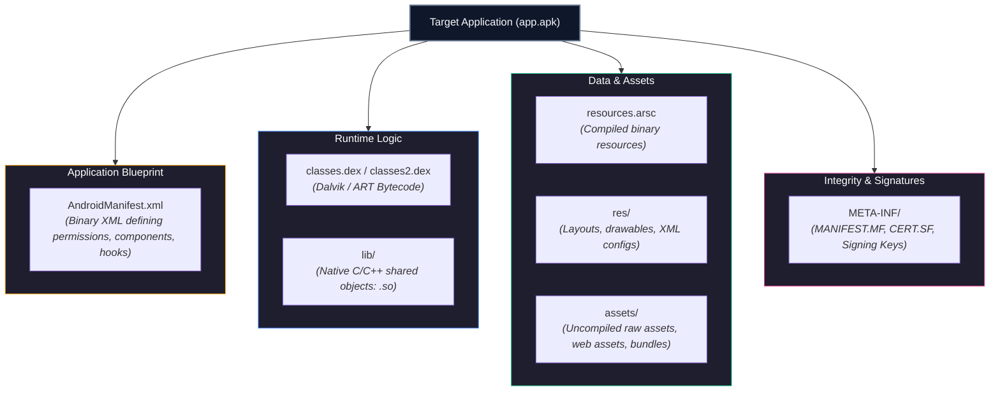

### Directory & Component Breakdown

```text
app.apk
│
├── AndroidManifest.xml   <-- Application schema, permissions, exported components
├── classes.dex           <-- Primary Dalvik bytecode (methods, business logic)
├── classes2.dex          <-- Additional dex files (multidex support)
├── resources.arsc        <-- Precompiled resource table (strings, IDs)
├── res/                  <-- App layouts, menus, and asset declarations
│   ├── layout/
│   ├── values/
│   └── xml/              <-- network_security_config.xml, file_paths.xml
├── assets/               <-- Raw bundled files, hybrid JS/HTML code, certificates
├── lib/                  <-- Native architectures
│   ├── arm64-v8a/        <-- 64-bit ARM (.so binaries)
│   ├── armeabi-v7a/      <-- 32-bit ARM (.so binaries)
│   └── x86_64/           <-- 64-bit Intel/AMD (Emulator binaries)
└── META-INF/             <-- Cryptographic certificates and archive manifests
```

---

# 3. APK Acquisition via ADB

Before performing static inspection, retrieve the installation binary directly from the target test device or emulator using the **Android Debug Bridge (ADB)**.

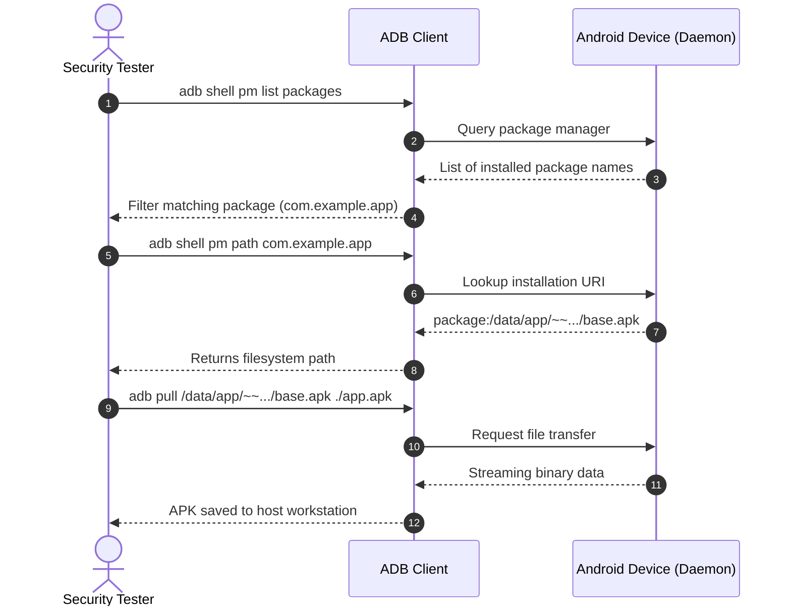

### Execution Commands

1. **Locate the Package:**
   ```bash
   adb shell pm list packages -3 | grep target
   ```
   *(The `-3` flag isolates 3rd-party user-installed packages from OEM system apps).*

2. **Retrieve the Installation Path:**
   ```bash
   adb shell pm path com.target.app
   ```
   *Expected standard output:*
   ```text
   package:/data/app/~~abC123xYz==/com.target.app-1/base.apk
   ```

3. **Pull Binary to Local Machine:**
   ```bash
   adb pull /data/app/~~abC123xYz==/com.target.app-1/base.apk ./target_app.apk
   ```

> [!TIP]
> **Handling Split APKs (App Bundles):**
> If `pm path` returns multiple lines (e.g., `base.apk`, `split_config.arm64_v8a.apk`, `split_config.xxhdpi.apk`), pull all pieces into an extraction folder:
> ```bash
> for p in $(adb shell pm path com.target.app | cut -d: -f2); do adb pull $p .; done
> ```

---

# 4. JADX: DEX to Java Decompiler

## What is JADX?

**JADX (Java Android Decompiler)** converts Android DEX files into human-readable Java-like syntax while maintaining cross-references and resource IDs.

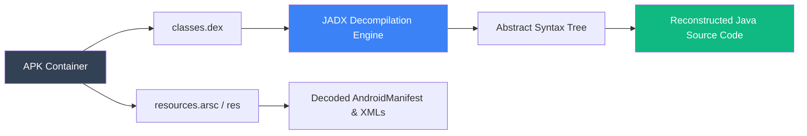

---

# 5. Installing & Tuning JADX

### Package Manager Installation

```bash
# Debian / Kali / Ubuntu
sudo apt update && sudo apt install jadx -y

# macOS (Homebrew)
brew install jadx
```

### Direct GitHub Release (Recommended)

When working with obfuscated code or modern Android targets, repository packages may be outdated. Download the latest binaries directly:

```bash
# Verify Java 11+ is present
java -version

# Check version
jadx --version
```

> [!NOTE]
> **Memory Allocation for Large APKs:**
> Complex commercial apps often trigger Out-Of-Memory exceptions during decompilation. Export extended heap memory before execution:
> ```bash
> export JADX_OPTS="-Xmx8g -XX:+UseG1GC"
> ```

---

# 6. Decompiling an APK with JADX

### Command Line Interface (CLI)

```bash
# Basic decompilation with destination folder
jadx -d extracted_app target_app.apk

# Decompile without renaming ambiguous identifiers
jadx --no-replace-consts -d extracted_app target_app.apk

# Export resources and decompiled code simultaneously
jadx -e -d ./decompiled target_app.apk
```

Output Directory Structure:

```text
extracted_app/
├── resources/
│   ├── AndroidManifest.xml    <-- Decoded plain-text XML
│   ├── assets/
│   └── res/
└── sources/
    └── com/
        └── target/
            └── app/
                ├── MainActivity.java
                ├── api/
                └── utils/
```

### Graphical Interface (GUI)

The GUI mode provides an interactive IDE experience:

```bash
jadx-gui target_app.apk
```

```
+-----------------------------------------------------------------------------------+
|  JADX GUI - Key Features for Security Auditors                                    |
+-----------------------------------------------------------------------------------+
|  1. Text Search (Ctrl + Shift + F)   -> Global search across strings, methods, code|
|  2. Class Navigation (Ctrl + N)      -> Jump directly to class declaration        |
|  3. Find Usage (Press 'X')           -> Find all references calling a given method|
|  4. Deobfuscation Mode (Toggle 'D')  -> Replaces obfuscated a, b, c with IDs       |
+-----------------------------------------------------------------------------------+
```

---

# 7. Targeted Static Reconnaissance (What to Search)

Static analysis requires focused pattern matching across the decompiled source tree:

```mermaid
mindmap
  root((Static Code Recon))
    Credentials & Secrets
      "api_key" / "apiKey"
      "Bearer"
      "aws_secret"
      "Authorization"
      "private_key"
    Data Storage & Cache
      "SharedPreferences"
      "SQLiteOpenHelper"
      "RoomDatabase"
      "getFilesDir()"
      "MODE_WORLD_READABLE"
    Cryptography
      "Cipher.getInstance"
      "SecretKeySpec"
      "DES" / "AES/ECB"
      "MessageDigest"
    Network & Transport
      "http://"
      "X509TrustManager"
      "HostnameVerifier"
      "SSLSocketFactory"
    Dynamic Execution
      "DexClassLoader"
      "System.loadLibrary"
      "Runtime.getRuntime().exec"
      "WebView.addJavascriptInterface"
```

### High-Value Pattern Matrix

| Category | High-Value Grep Patterns | Risk / Exploit Vector |
| :--- | :--- | :--- |
| **Secrets & Keys** | `"apiKey"`, `"secret"`, `"private_key"`, `"Authorization"` | Hardcoded third-party API tokens, cloud access keys |
| **Cleartext Web** | `http://`, `android:usesCleartextTraffic="true"` | MitM eavesdropping, lack of network encryption |
| **Crypto Misuse** | `"AES/ECB"`, `DES`, `MD5`, `new SecretKeySpec("..."` | Weak cryptographic protection, static encryption keys |
| **Insecure Storage** | `MODE_WORLD_READABLE`, `MODE_WORLD_WRITEABLE` | Other apps reading local sensitive application files |
| **WebViews** | `setJavaScriptEnabled(true)`, `addJavascriptInterface` | Cross-Site Scripting (XSS), Local File Inclusion (LFI) |
| **Insecure TLS** | `checkServerTrusted(`, `ALLOW_ALL_HOSTNAME_VERIFIER` | Flawed custom trust managers allowing TLS bypass |

---

# 8. AndroidManifest.xml Deep Dive

`AndroidManifest.xml` dictates an application's root attack surface. It defines all entry points, required permissions, and runtime security flags.

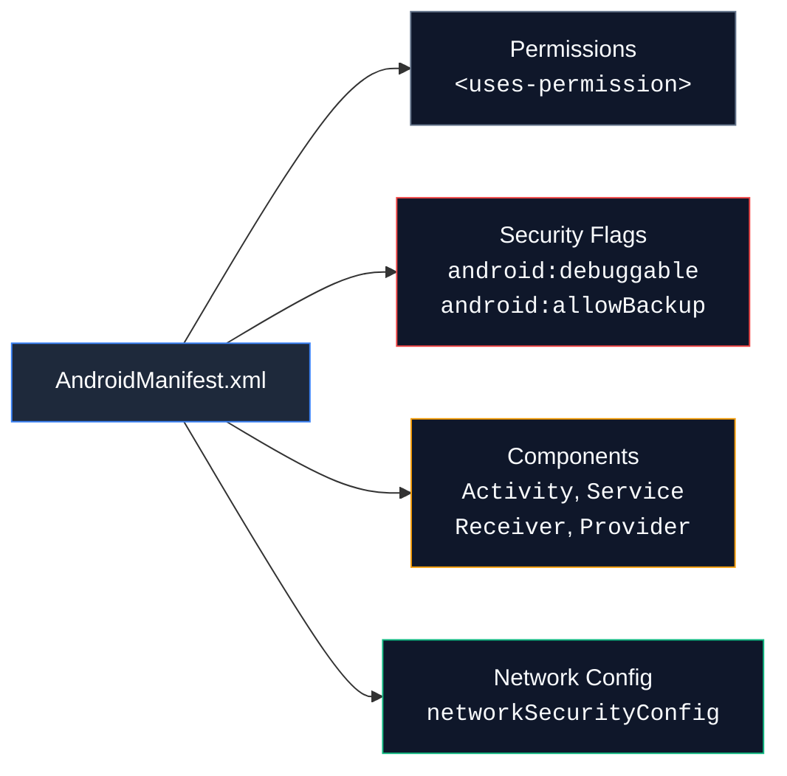

### Critical Flag Audit

```xml
<application
    android:allowBackup="true"
    android:debuggable="true"
    android:usesCleartextTraffic="true"
    android:networkSecurityConfig="@xml/network_security_config">
```

| Manifest Attribute | Secure Default | Risky Setting | Security Implications |
| :--- | :--- | :--- | :--- |
| `android:debuggable` | `false` | `true` | Allows debugging via `gdb`/`jdb`. Attackers can hook process and dump memory. |
| `android:allowBackup` | `false` | `true` | Enables extraction of application private sandbox data via `adb backup`. |
| `android:usesCleartextTraffic` | `false` | `true` | Permits plain HTTP traffic, exposing data to man-in-the-middle attacks. |
| `networkSecurityConfig` | Defined & Pinning | Undefined / Cleared | Missing custom certificate pinning or allows user-installed CAs. |

---

# 9. Component Exposure & Attack Surface

The four fundamental Android components define how the OS routes messages between distinct applications:

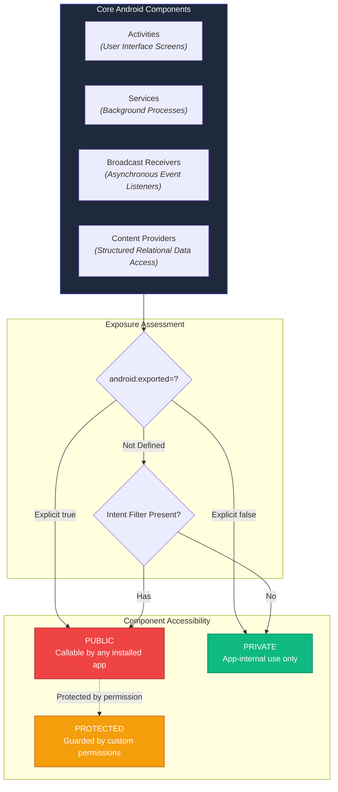

> [!CAUTION]
> **Exported Component Rule of Thumb:**
> If a component contains an `<intent-filter>` and **omits** `android:exported`, Android versions prior to API 31 (Android 12) default to **`exported="true"`**. From API 31+, developers are forced to explicitly declare this value.

### Vulnerability Mechanics: The Insecure Intent

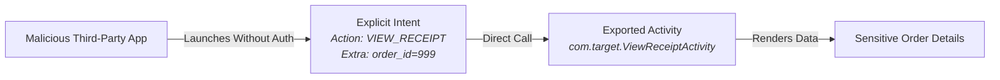

If an activity handles privileged business logic without evaluating caller identity or custom permissions, unauthorized local applications can invoke it directly via ADB:

```bash
adb shell am start -n com.target.app/.ViewReceiptActivity --ei "order_id" 999
```

---

# 10. MobSF (Mobile Security Framework)

## What is MobSF?

**MobSF (Mobile Security Framework)** is an automated, all-in-one mobile security testing platform capable of static analysis (SAST), dynamic analysis (DAST), and web API testing for Android, iOS, and Windows binaries.

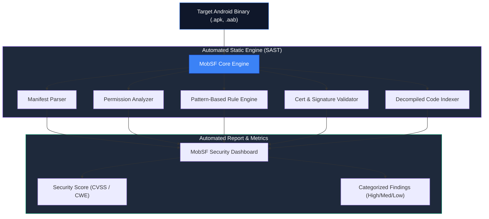

---

# 11. MobSF Static Analysis Capabilities

When you upload an APK to MobSF, the static engine completes a comprehensive check:

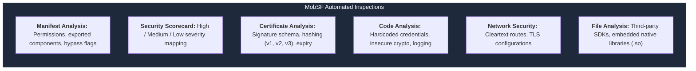

### MobSF Quick Start (Docker)

```bash
# Pull and start the official MobSF container
docker pull opensecurity/mobsf:latest

docker run -it --rm -p 8000:8000 opensecurity/mobsf:latest
```

*Access the web interface at `http://127.0.0.1:8000` to upload and analyze targets.*

---

# 12. Dynamic Analysis: Static vs. Runtime Comparison

Static analysis tells you what *could* happen based on code syntax. Dynamic analysis reveals what *actually* happens during process execution.

```mermaid
flowchart LR
    subgraph Static["Static Analysis (At Rest)"]
        S1["Decompiled Classes"]
        S2["Manifest XML"]
        S3["Extracted Constants"]
    end

    subgraph Dynamic["Dynamic Analysis (In Motion)"]
        D1["Runtime Memory State"]
        D2["Real-Time Network Calls"]
        D3["IPC / Binder Payloads"]
        D4["File & DB Read/Writes"]
    end

    Static -.->|Identifies Target Functions| Dynamic
    Dynamic -.->|Confirms Practical Impact| Validation["Vulnerability Validated"]

    style Static fill:#1e293b,stroke:#3b82f6,color:#fff
    style Dynamic fill:#1e293b,stroke:#ec4899,color:#fff
    style Validation fill:#10b981,stroke:#047857,color:#fff
```

### Static vs. Dynamic Testing Matrix

| Testing Dimension | Static Analysis (SAST) | Dynamic Analysis (DAST) |
| :--- | :--- | :--- |
| **Execution State** | Application is at rest (offline) | Application is running in a live VM/device |
| **Code Requirement**| Operates on raw APK / Decompiled Source | Requires installed package on compatible ABI |
| **Obfuscation Impact**| Impeded by ProGuard, DexGuard, R8 | Bypasses naming obfuscation via hooks |
| **Primary Strength**| Comprehensive coverage of dead code & secrets | Observes actual runtime state & server replies |
| **Weakness** | High rate of false positives | Limited to the specific user journeys tested |

---

# 13. Security Tooling Matrix

No single tool provides end-to-end coverage. An efficient tester combines tools across different layers of the platform:

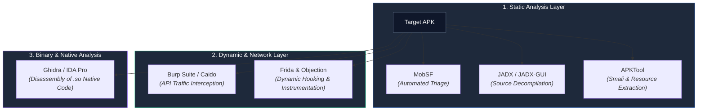

### Tool Comparison Matrix

| Tool | Category | Primary Focus | Best Used For |
| :--- | :--- | :--- | :--- |
| **JADX** | Static / Decompiler | Smali $\to$ Java source translation | Manual code review, logic analysis |
| **MobSF** | Automated Framework | Fast SAST/DAST report generation | Baseline triage, initial sweep |
| **APKTool** | Static / Disassembler | Smali byte assembly & disassembly | Modifying APKs, editing resources, repackaging |
| **Burp Suite** | Network / Proxy | HTTP/S request-response manipulation | API security, authentication bypasses |
| **Frida** | Dynamic / Instrumentation | In-process JavaScript injection | SSL Pinning bypass, root detection bypass |
| **Ghidra** | Binary Analysis | Decompiling C/C++ `.so` libraries | Reverse engineering native JNI functions |

---

# 14. Step-by-Step Android Pentesting Workflow

Follow this battle-tested, 10-step assessment blueprint:

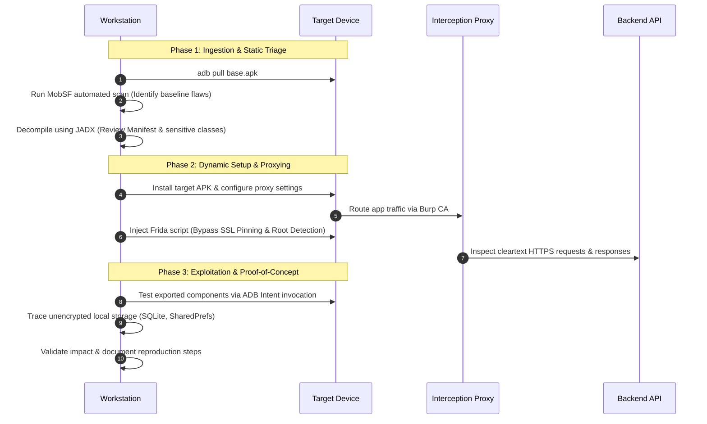

### Execution Checklist

- [ ] **Step 1:** Pull the APK and all split packages using `adb pull`.
- [ ] **Step 2:** Ingest binary into MobSF to map baseline metrics and high-risk flags.
- [ ] **Step 3:** Decompile with JADX-GUI; analyze `AndroidManifest.xml` components.
- [ ] **Step 4:** Search for leaked credentials, private keys, and backend endpoints.
- [ ] **Step 5:** Install on rooted lab device/emulator running Magisk / Genymotion.
- [ ] **Step 6:** Launch `adb logcat` filter to catch cleartext credentials in logs:
  ```bash
  adb logcat | grep -iE "token|password|auth"
  ```
- [ ] **Step 7:** Route device traffic through Burp Suite; inject Frida SSL unpinning scripts.
- [ ] **Step 8:** Intercept and test API endpoints for IDOR, Broken Object Level Auth, and injection.
- [ ] **Step 9:** Probe exported activities, broadcast receivers, and content providers via `am` and `appops`.
- [ ] **Step 10:** Document findings with complete proof-of-concept steps and remediation paths.

---

# 15. Triage: Eliminating False Positives

Automated scanners like MobSF flag potential issues based on syntax patterns. Professional testers must validate whether an issue carries real exploitability.

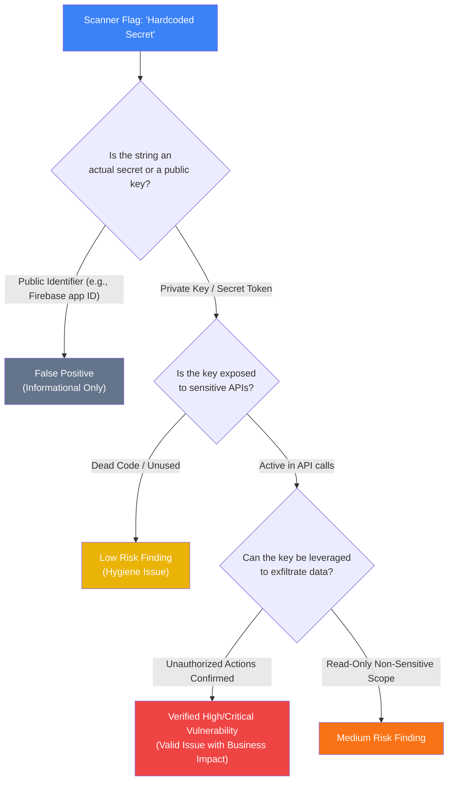

### Common False Positive Traps

1. **Google Maps API Keys (`AIzaSy...`):**
   * *Scanner Status:* High Severity (Leaked Secret).
   * *Actual Impact:* Often intended to be client-facing. Unless it lacks HTTP referrer restrictions or allows access to billable APIs (Directions, Geocoding), it is an informational finding.
2. **`android:allowBackup="true"`:**
   * *Scanner Status:* High / Medium Severity.
   * *Actual Impact:* Requires physical device access or adb-authorized USB debugging. Not exploitable remotely by another application.

---

# 16. Recommended Android Pentesting Toolkit

```
+------------------------------------------------------------------------------------+
|                         Android Security Testing Arsenal                           |
+--------------------------+----------------------------+----------------------------+
|  Static Analysis         |  Dynamic & Runtime Hooking |  Network & Proxy           |
|  - JADX / JADX-GUI       |  - Frida Core & CLI        |  - Burp Suite Professional |
|  - MobSF                 |  - Objection               |  - Project Caido           |
|  - APKTool               |  - Xposed / LSPosed        |  - Mitmproxy               |
|  - Ghidra                |  - Magisk + Root Cloaking  |  - HttpCanary              |
+--------------------------+----------------------------+----------------------------+
|  Hardware & Environment  |  Command-Line Utilities    |  Local Inspection          |
|  - Google Pixel (Physical)| - ADB (Platform Tools)     |  - SQLite3 Database CLI    |
|  - Genymotion Cloud/Local|  - APKiD                   |  - Drozer                  |
|  - Android Studio AVD    |  - Scrcpy                  |  - Pidcat                  |
+--------------------------+----------------------------+----------------------------+
```

---

# 17. Key Takeaways & Series Roadmap

A comprehensive Android penetration test connects static observations to runtime exploitation:

```
Decompiled Code Logic  ===>  Runtime IPC Manipulation  ===>  Backend API Exploitation
```

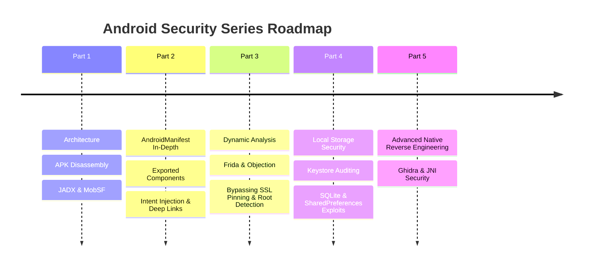

## What's Next in Part 2

In **Part 2: Deep Component Analysis & Intent Exploitation**, we transition from static review into active component attacks:
* Exploiting unprotected **Exported Activities** via `am start`.
* Hijacking **Broadcast Receivers** and eavesdropping on system events.
* Querying and dumping private databases via **Content Provider SQL Injection**.
* Weaponizing **Deep Links** and App Links for client-side account takeover.
