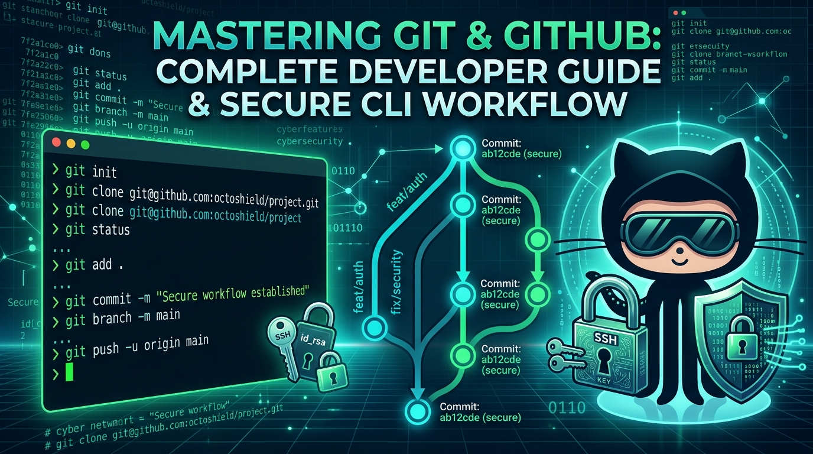
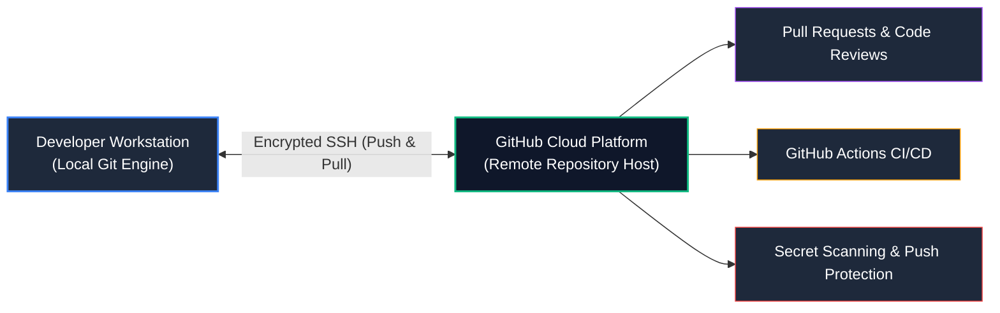
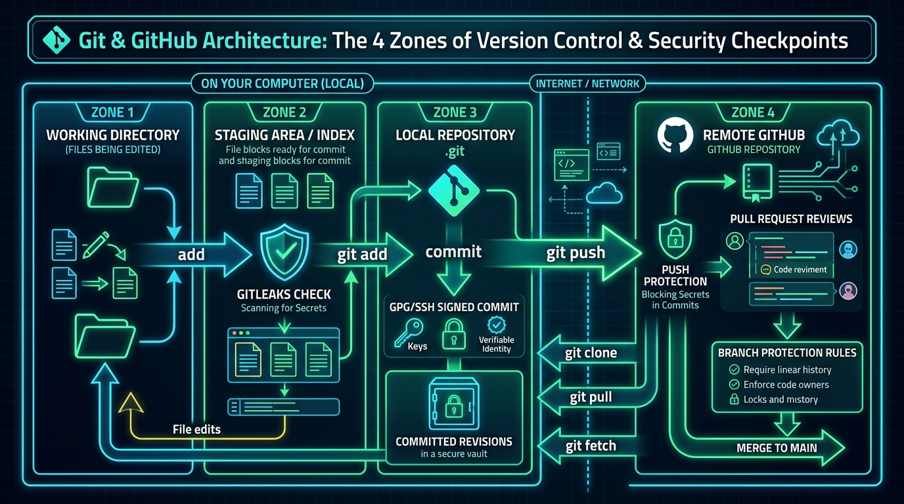
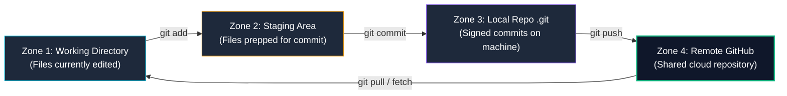
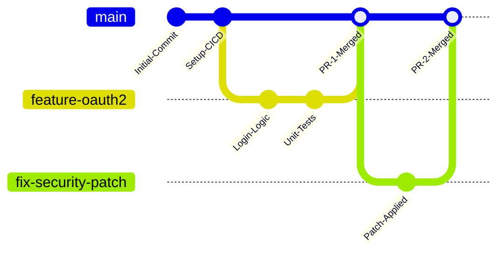

# How to Use Git & GitHub Securely — The Complete Developer Guide & CLI Mastery

> **Category:** Version Control & DevSecOps | **Level:** Complete Beginner → Production Professional
>
> **Core Objective:** Master everyday Git & GitHub workflows, the GitHub CLI (`gh`), team collaboration practices, and essential commands—while embedding security into every commit, branch, and pull request.

---

<div align="center">



# 🚀 Mastering Git & GitHub: Complete Guide & Secure CLI Workflow 🚀
### Essential Commands • GitHub CLI (`gh`) • Secure Authentication • Branching • Disaster Recovery

[](https://git-scm.com/)
[-24292e?style=for-the-badge&logo=github)](https://cli.github.com/)
[](https://www.openssh.com/)
[](https://git-scm.com/book/en/v2/Git-Tools-Signing-Your-Work)

</div>

---

# Table of Contents

1. [Git vs. GitHub: Mental Model & Architecture](#1-git-vs-github-mental-model--architecture)
2. [The 4 Zones of Version Control](#2-the-4-zones-of-version-control)
3. [First-Time Secure Setup: Zero Trust from Day One](#3-first-time-secure-setup-zero-trust-from-day-one)
4. [Essential Daily Git Commands: Step-by-Step](#4-essential-daily-git-commands-step-by-step)
5. [Mastering the GitHub CLI (`gh`)](#5-mastering-the-github-cli-gh)
6. [Branching Strategies & The Secure GitHub Flow](#6-branching-strategies--the-secure-github-flow)
7. [Cryptographic Commit Signing (SSH & GPG)](#7-cryptographic-commit-signing-ssh--gpg)
8. [Preventing Accidental Secret Leaks in Daily Workflows](#8-preventing-accidental-secret-leaks-in-daily-workflows)
9. [Emergency Recovery: The "I Messed Up" Playbook](#9-emergency-recovery-the-i-messed-up-playbook)
10. [The Ultimate Git & GitHub Command Reference Matrix](#10-the-ultimate-git--github-command-reference-matrix)

---

# 1. Git vs. GitHub: Mental Model & Architecture

Before running commands, it is crucial to understand the fundamental distinction between **Git** and **GitHub**:

| Feature | **Git** | **GitHub** |
| :--- | :--- | :--- |
| **What is it?** | A distributed command-line version control tool installed on your computer. | A cloud-hosted platform built on top of Git for collaboration and CI/CD. |
| **Where does it run?** | Locally on your workstation (`.git` folder). | In the cloud (accessible via browser or API). |
| **Internet Required?** | ❌ No. You can commit, branch, and log offline. | ✅ Yes. Required to push, pull, create PRs, and trigger actions. |
| **Key Functions** | Tracking file diffs, commit history, merges, branches. | Pull requests, issue tracking, secret scanning, CI/CD pipelines. |



---

# 2. The 4 Zones of Version Control

Every Git command moves files between **four discrete states**. Understanding this mental model prevents mistakes:





1. **Working Directory:** The actual files on your hard drive you see in VS Code.
2. **Staging Area (Index):** A holding area that gathers files before taking a snapshot. **Security Checkpoint:** This is where tools like Gitleaks inspect files before they enter commit history.
3. **Local Repository (`.git`):** The internal database storing your committed snapshots. Commits here are cryptographically signed.
4. **Remote GitHub:** The remote copy hosted in the cloud. **Security Checkpoint:** Guarded by GitHub Push Protection, Branch Rulesets, and PR Reviews.

---

# 3. First-Time Secure Setup: Zero Trust from Day One

Setting up Git securely ensures you never use cleartext passwords, prevents commit spoofing, and keeps credentials out of the cloud.

### Step 1: Configure Author Identity
```bash
# Set your real name and verified GitHub email address
git config --global user.name "Your Name"
git config --global user.email "your_email@example.com"

# Set modern default branch name to 'main'
git config --global init.defaultBranch main
```

---

### Step 2: Generate High-Security Ed25519 SSH Keys
Avoid using HTTPS with static passwords or Personal Access Tokens (PATs) saved in plaintext on your disk. Use **Ed25519 elliptic-curve SSH keys**:

```bash
# Generate modern Ed25519 SSH key with a strong passphrase
ssh-keygen -t ed25519 -C "your_email@example.com" -f ~/.ssh/id_ed25519

# Start the SSH agent in the background
eval "$(ssh-agent -s)"

# Add your private key to the agent
ssh-add ~/.ssh/id_ed25519
```

#### Upload SSH Key to GitHub:
```bash
# View and copy your public key (NEVER share your private key!)
cat ~/.ssh/id_ed25519.pub

# Or upload it instantly using GitHub CLI:
gh ssh-key add ~/.ssh/id_ed25519.pub --title "Dev Workstation (Ed25519)"
```

Test your secure SSH connection:
```bash
ssh -T git@github.com
# Expected output: Hi username! You've successfully authenticated...
```

---

### Step 3: Establish a Global `.gitignore`
Accidentally committing `.env` files or API keys is the #1 cause of cloud breaches. Create a system-wide ignore file:

```bash
# Create global gitignore
touch ~/.gitignore_global

# Tell Git to use it everywhere
git config --global core.excludesfile ~/.gitignore_global
```

Add the following essential rules to `~/.gitignore_global`:
```gitignore
# Environment & Secret files
.env
.env.*
*.pem
*.key
*.p12
*.id_rsa
credentials.json
secrets.yaml

# System & IDE artifacts
.DS_Store
Thumbs.db
.idea/
.vscode/
*.swp

# Language dependencies
node_modules/
__pycache__/
*.pyc
venv/
.venv/
```

---

# 4. Essential Daily Git Commands: Step-by-Step

### Initializing & Cloning Repositories
```bash
# 1. Turn an existing local folder into a Git repository
git init

# 2. Clone an existing repository over secure SSH (DO NOT use HTTPS)
git clone git@github.com:username/repository.git

# 3. Clone into a specific folder name
git clone git@github.com:username/repository.git my-project
```

---

### Checking Status & Inspecting Changes
```bash
# Check modified, staged, and untracked files
git status

# Inspect unstaged line-by-line diffs
git diff

# Inspect changes currently in the staging area (Index)
git diff --staged

# View compact, visual commit graph
git log --oneline --graph --decorate -n 10
```

---

### Staging & Committing (The Safe Way)

> [!WARNING]
> **Avoid Blind `git add .`:** Running `git add .` or `git add -A` blindly stages every file in your folder, including temporary tokens, `.env` files, or local keys.

```bash
# ❌ DANGEROUS: Blindly stages all files including accidental secrets
git add .

# ✅ SECURE: Stage only specific files intentionally
git add src/index.js src/components/Header.jsx

# ✅ PRO TIP: Interactive staging (Review every single code chunk before staging)
git add -p
```

#### Committing with Clear Conventional Commit Messages:
```bash
# Format: <type>(<scope>): <short description>
git commit -m "feat(auth): implement JWT token rotation"
git commit -m "fix(api): sanitize user input in search query"
git commit -m "docs(readme): update setup and security instructions"
```

---

### Branching & Switching
Branches allow you to build features or fix bugs in complete isolation without breaking the working production branch (`main`).

```bash
# Create and switch to a new feature branch (Modern syntax)
git switch -c feature/login-page

# View all branches (local and remote)
git branch -a

# Switch back to the main branch
git switch main

# Delete a feature branch after it has been safely merged
git branch -d feature/login-page
```

---

### Synchronizing with Remote GitHub

```bash
# 1. Set upstream and push a new branch for the first time
git push -u origin feature/login-page

# 2. Subsequent pushes to the same branch
git push

# 3. Pull latest changes from remote using rebase (avoids messy merge commits)
git pull --rebase origin main

# 4. Fetch all remote updates without modifying your local working files
git fetch --all --prune
```

---

### Saving Work In Progress (`git stash`)
Need to switch branches urgently without committing unfinished code?

```bash
# Temporarily shelve uncommitted changes
git stash save "WIP: redesigning navbar"

# Switch branches, do emergency work, then return:
git switch feature/my-work

# Restore your shelved changes
git stash pop

# List all existing stashes
git stash list
```

---

# 5. Mastering the GitHub CLI (`gh`)

The **GitHub CLI (`gh`)** brings the full power of GitHub into your terminal, allowing you to manage repositories, review Pull Requests, and set secrets without switching to a web browser.

```text
+----------------------------------------------------------------------------------------------------+
|                                    GitHub CLI (gh) Quick Reference                                 |
+--------------------------+-------------------------------------------------------------------------+
| Command                  | Operational Action                                                      |
+--------------------------+-------------------------------------------------------------------------+
| gh auth login            | Authenticate securely using browser OAuth or token                      |
| gh repo create           | Create a new remote repository directly from the terminal               |
| gh pr create             | Open a Pull Request from your active feature branch                     |
| gh pr checkout <num>     | Pull down and test a teammate's Pull Request locally                     |
| gh pr review --approve   | Review and officially approve a Pull Request                            |
| gh pr merge --squash     | Merge PR and delete the feature branch automatically                    |
| gh secret set <NAME>     | Store an encrypted secret in GitHub repository settings                 |
+--------------------------+-------------------------------------------------------------------------+
```

### Essential `gh` Command Examples:

```bash
# 1. Authenticate with GitHub
gh auth login -p ssh -w

# 2. Create a new private repository on GitHub and link local repo
gh repo create my-cyber-project --private --source=. --remote=origin --push

# 3. Create a Pull Request with interactive prompts
gh pr create --title "feat(crypto): add AES-GCM encryption helper" --body "Closes #42"

# 4. Check out a teammate's PR to test it locally
gh pr checkout 15

# 5. Review and approve PR
gh pr review 15 --approve --comment "Clean implementation, unit tests passing."

# 6. Merge the PR and delete the remote branch
gh pr merge 15 --squash --delete-branch

# 7. Add an encrypted secret for GitHub Actions (Without opening the browser!)
gh secret set PRODUCTION_API_URL --body "https://api.internal.corp"
```

---

# 6. Branching Strategies & The Secure GitHub Flow

For teams of all sizes, the **GitHub Flow** (Trunk-Based Development) is the industry standard for secure, reliable delivery:



### The 5 Steps of GitHub Flow:
1. **Branch from `main`:** Always create descriptive branches (`feature/...`, `fix/...`, `docs/...`).
2. **Make Small, Focused Commits:** Commit often with clear messages.
3. **Open a Pull Request (PR):** Propose changes, triggering automated CI tests and CodeQL scans.
4. **Peer Review & Feedback:** At least one teammate reviews the code for security and quality.
5. **Merge & Delete:** Merge into `main` using **Squash and Merge** to maintain a clean linear commit history.

---

# 7. Cryptographic Commit Signing (SSH & GPG)

Git does not verify who actually wrote a commit. Anyone can forge a commit using Linus Torvalds' or your CEO's email address unless **commit signing** is enforced.

### Signing Commits with Your Existing SSH Key (Recommended)
You do not need complex GPG setups; modern Git supports signing directly with your SSH key:

```bash
# 1. Configure Git to use SSH for signing
git config --global gpg.format ssh

# 2. Point to your public SSH key
git config --global user.signingkey ~/.ssh/id_ed25519.pub

# 3. Tell Git to automatically sign EVERY commit
git config --global commit.gpgsign true

# 4. Tell Git to automatically sign EVERY tag
git config --global tag.gpgsign true
```

#### Add Your Key as a Signing Key on GitHub:
1. Go to **GitHub Settings -> SSH and GPG keys**.
2. Click **New SSH Key**.
3. Select Key type: **Signing Key**.
4. Paste your public key (`cat ~/.ssh/id_ed25519.pub`).

Now every commit you push will display the green **`Verified`** badge on GitHub:

```text
commit 4a9f82d (HEAD -> main) [Verified: SSH Key ED25519]
Author: Your Name <your_email@example.com>
Date:   Fri Oct 2 09:30:00 2026

    feat(security): enforce cryptographic commit signatures
```

---

# 8. Preventing Accidental Secret Leaks in Daily Workflows

### 1. Setting Up Gitleaks Pre-Commit Hook
Prevent secrets from ever entering your local staging area:

```bash
# Install Gitleaks using Go or package manager
# Windows: winget install Gitleaks.Gitleaks
# macOS: brew install gitleaks
# Linux: sudo apt install gitleaks

# Run an immediate audit on your repository
gitleaks detect --verbose --redact
```

### 2. Enable GitHub Server-Side Push Protection
Ensure your organization or personal account blocks pushes containing recognized secrets:
* Open your repository on GitHub.
* Navigate to **Settings -> Code security and analysis**.
* Enable **Secret scanning** and check **Push protection**.

---

# 9. Emergency Recovery: The "I Messed Up" Playbook

Everyone makes mistakes in Git. Here is how to fix common errors safely:

### Scenario 1: "I made a typo in my last commit message"
```bash
git commit --amend -m "fix(auth): correct typo in commit message"
```

### Scenario 2: "I accidentally committed before adding a file"
```bash
git add forgotten_file.py
git commit --amend --no-edit
```

### Scenario 3: "I accidentally staged a file I didn't want to commit"
```bash
# Unstage the file without losing your local edits
git restore --staged secret_config.json
```

### Scenario 4: "I made unwanted edits and want to revert the file back to the last commit"
```bash
# Discard local changes in a specific file
git restore broken_file.py
```

### Scenario 5: "I need to undo an already-pushed commit on `main` safely"
Never use `git reset --hard` on shared branches. Use **`git revert`**, which creates a new commit that safely reverses the changes:
```bash
git revert <commit-hash>
git push origin main
```

### Scenario 6: "I deleted a branch by accident! Help!"
Git rarely deletes anything immediately. Use **`git reflog`** to locate lost commit hashes:
```bash
# View all recent HEAD movements
git reflog

# Locate the commit hash of your deleted branch and recover it:
git switch -c recovered-branch 4a9f82d
```

---

# 10. The Ultimate Git & GitHub Command Reference Matrix

| Category | Command | Syntax / Usage | Operational Purpose |
| :--- | :--- | :--- | :--- |
| **Setup** | `git config` | `git config --global user.name "Name"` | Set global author identity |
| **Setup** | `git config` | `git config --global commit.gpgsign true` | Enforce cryptographic commit signing |
| **Setup** | `ssh-keygen` | `ssh-keygen -t ed25519 -C "email"` | Generate modern elliptic-curve SSH key |
| **Inspection** | `git status` | `git status -s` | View short, clean status of working tree |
| **Inspection** | `git diff` | `git diff --staged` | Review staged diffs before committing |
| **Inspection** | `git log` | `git log --graph --oneline --decorate` | Visual ASCII branch history graph |
| **Staging** | `git add` | `git add -p` | Interactive staging by chunk (prevents accidental secrets) |
| **Staging** | `git restore` | `git restore --staged <file>` | Unstage a file from the index |
| **Committing** | `git commit` | `git commit -S -m "message"` | Create a cryptographically signed commit |
| **Committing** | `git commit` | `git commit --amend --no-edit` | Add staged files to previous commit |
| **Branching** | `git switch` | `git switch -c <name>` | Create and switch to a new branch |
| **Branching** | `git branch` | `git branch -d <name>` | Safely delete a merged local branch |
| **Syncing** | `git pull` | `git pull --rebase origin main` | Pull remote changes cleanly via rebase |
| **Syncing** | `git push` | `git push -u origin <branch>` | Push branch and link upstream tracking |
| **Undoing** | `git revert` | `git revert <hash>` | Safely invert an existing commit |
| **Undoing** | `git reflog` | `git reflog` | View history of HEAD movements to recover lost commits |
| **GitHub CLI** | `gh repo` | `gh repo create <name> --private` | Create remote repository from terminal |
| **GitHub CLI** | `gh pr` | `gh pr create --title "..." --body "..."` | Create a Pull Request via CLI |
| **GitHub CLI** | `gh pr` | `gh pr merge <num> --squash` | Merge PR and delete remote branch |
| **GitHub CLI** | `gh secret` | `gh secret set <NAME> --body "..."` | Set encrypted Actions secret securely |

---

# 📚 Recommended Next Steps
* Read the [**GitHub Security & Hardening Masterclass**](./GitHub_Security_and_Hardening_Masterclass.md) to understand real-world case studies (Uber, Toyota, Codecov) and enterprise CI/CD pipeline defense.
* Configure [**Gitleaks Pre-Commit Hooks**](./GitHub_Security_and_Hardening_Masterclass.md#6-layer-2-secret-prevention-scanning--oidc-cloud-federation) to guarantee zero hardcoded secrets in your projects.
* Enforce [**Branch Protection Rulesets**](./GitHub_Security_and_Hardening_Masterclass.md#7-layer-3-branch-protection-rulesets--cryptographic-attestation) on all production repositories.
