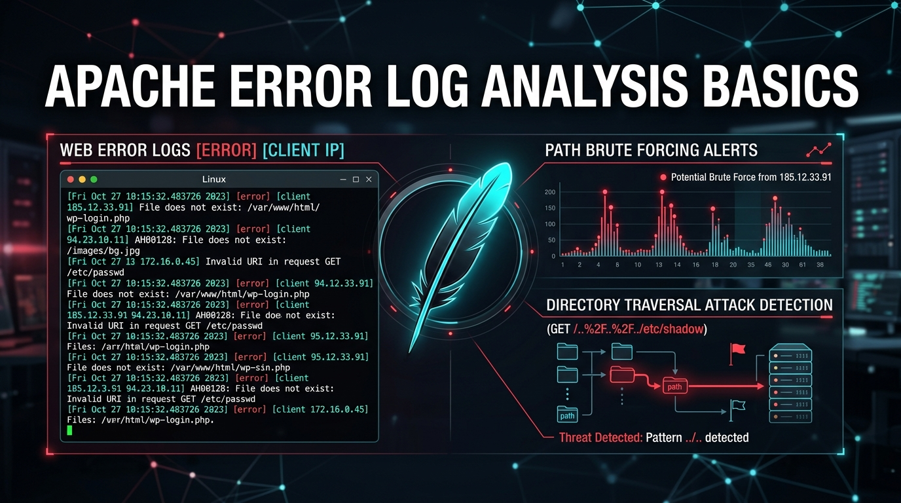
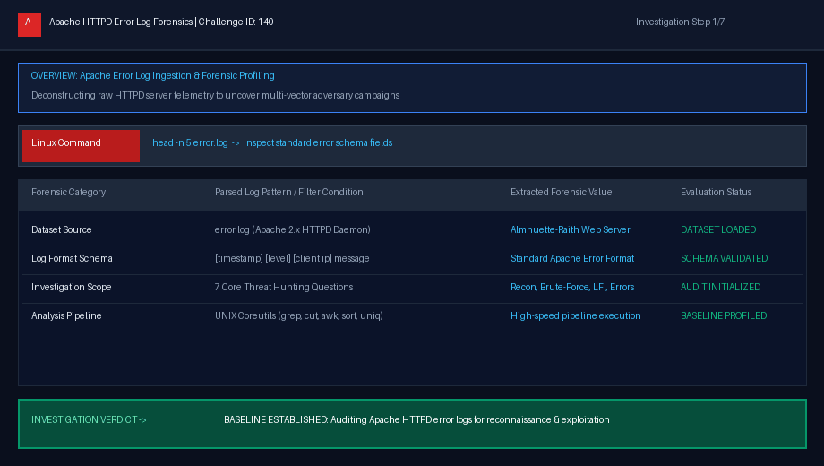
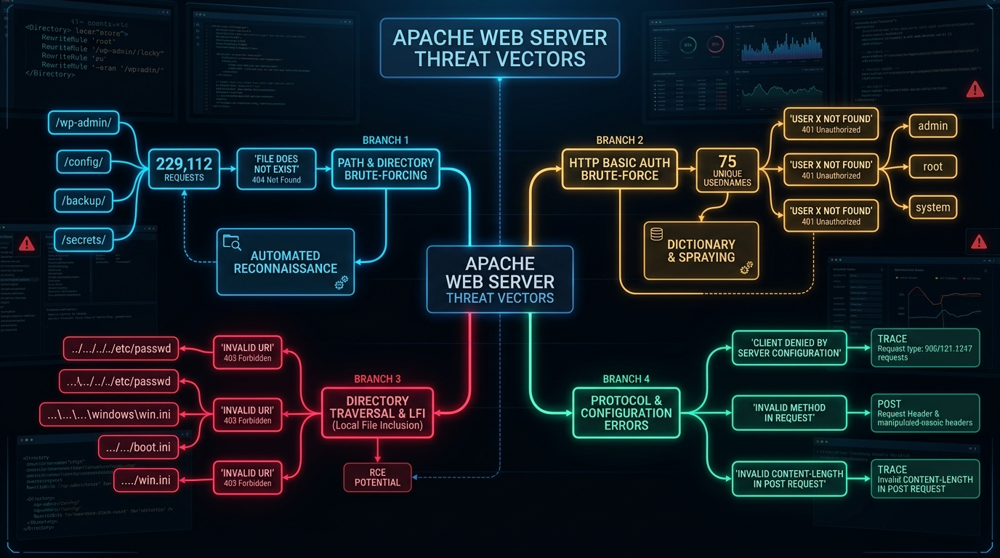
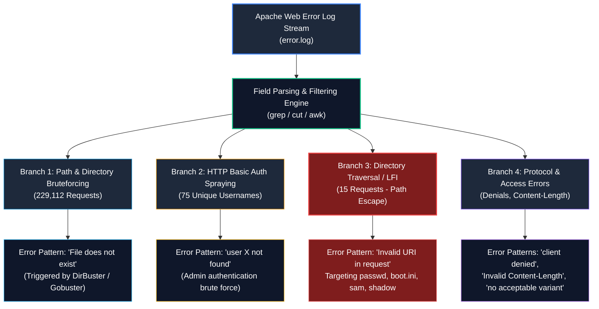
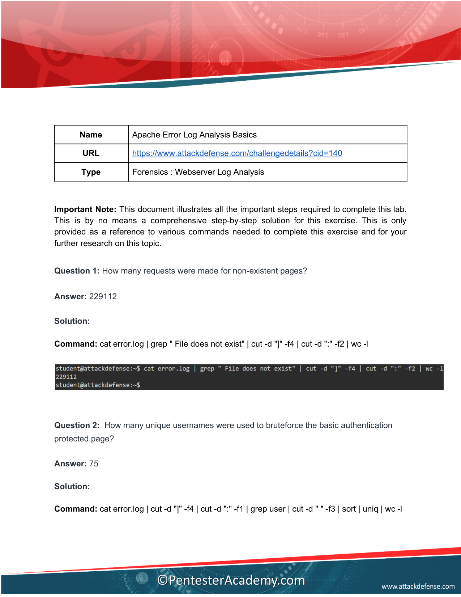
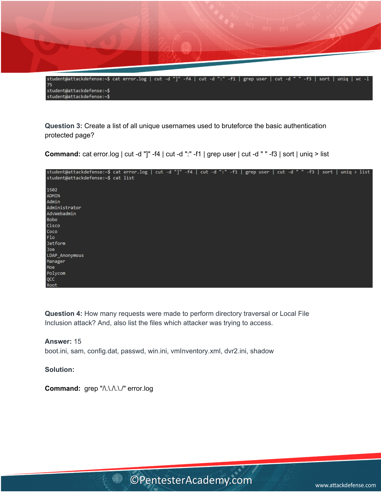
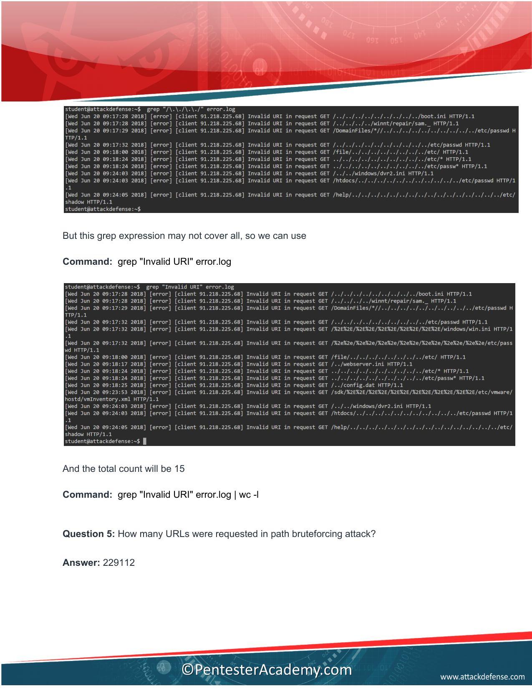
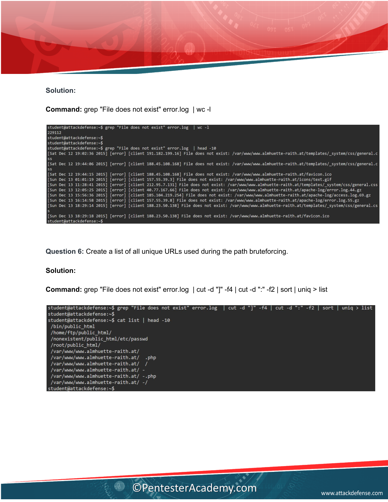
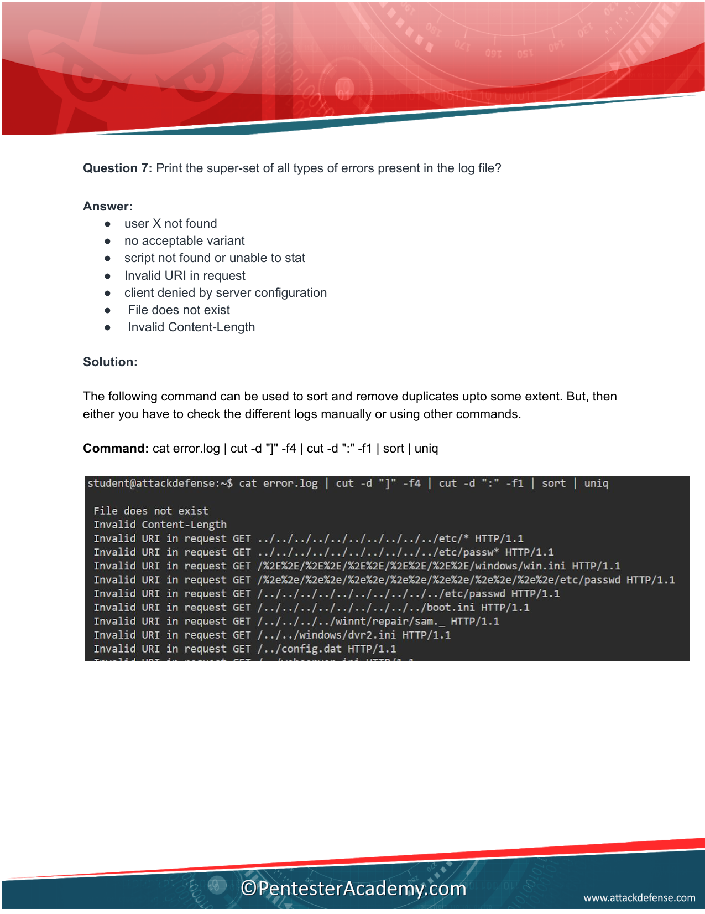

# Apache Error Log Analysis Basics — Complete Walkthrough & Forensic Guide

> **Platform:** [INE Security (AttackDefense Labs)](https://my.ine.com/)
>
> **Challenge Title:** Apache Error Log Analysis Basics (CID 140)
>
> **Lab URL:** [https://my.ine.com/labs/9788ef25-72e2-3325-af4f-9a701986b90e](https://my.ine.com/labs/9788ef25-72e2-3325-af4f-9a701986b90e)
>
> **Category:** Forensics : Webserver Log Analysis
>
> **Dataset:** `error.log` (Apache 2.x HTTPD Telemetry — [Almhuette-Raith Web Server](http://www.almhuette-raith.at/apache-log/error.log))
>
> **Toolchain:** Linux CLI Coreutils (`grep`, `cut`, `awk`, `sort`, `uniq`, `wc`) & Python Streaming Engine
>
> **Status:** 🟢 **All 7 Forensic Questions Solved (100% Solved)**

---

<div align="center">



# 🌐 Apache Error Log Analysis Basics 🌐
### Forensic Web Server Telemetry Analysis: Path Bruteforcing, HTTP Basic Auth Spraying, LFI Traversal & Error Taxonomy

[](https://my.ine.com/labs/9788ef25-72e2-3325-af4f-9a701986b90e)
[](https://attackdefense.com)
[](http://www.almhuette-raith.at/apache-log/error.log)
[](https://attack.mitre.org)
[](https://attack.mitre.org)

</div>

---

### 💻 Real-Time Forensic Investigation Demonstration

The animated forensic triage demonstration below illustrates the automated execution across all 7 investigation questions—filtering 229,112 non-existent path requests, extracting 75 unique brute-force usernames, isolating 15 directory traversal attacks, compiling deduplicated URL lists, and establishing the 7-part super-set error taxonomy:



---

# Executive Summary

While standard web server access logs (`access.log`) record all inbound HTTP requests and status codes, **Apache Error Logs (`error.log`)** represent the most critical forensic telemetry source for digital forensics and incident response (DFIR) practitioners. When an adversary launches scanning tools, attempts directory traversal, or probes authentication gateways, Apache logs diagnostic messages, failed module invocations, and kernel-level file lookup errors directly to the error log.

In this hands-on forensic laboratory (**INE Challenge ID 140: Apache Error Log Analysis Basics**), we analyze a real-world web server error log (`error.log`) generated by a production Apache HTTPD daemon. Using command-line Linux utilities (`grep`, `cut`, `awk`, `sort`, `uniq`, `wc`), we uncover four concurrent attack vectors launched against the server:
1. **Aggressive Path & Directory Bruteforcing:** **229,112 requests** targeting non-existent resources triggering `File does not exist` errors.
2. **HTTP Basic Authentication Password Spraying:** **75 unique usernames** systematically tested against a password-protected administrative directory triggering `user X not found` errors.
3. **Directory Traversal / Local File Inclusion (LFI):** **15 malicious requests** employing path escape sequences (`/../../`) attempting to steal sensitive Linux and Windows system files (`passwd`, `shadow`, `boot.ini`, `sam`, `win.ini`).
4. **Server & Protocol Anomalies:** Malformed requests triggering `client denied by server configuration`, `Invalid Content-Length`, and content negotiation failures.

---

# Apache Error Log Architecture & Format Breakdown

Understanding the exact anatomy of an Apache error log line is essential for constructing precision `cut`, `awk`, and `grep` one-liners:


### Standard Apache Error Log Syntax:
```text
[Day Month Date Time Year] [Severity Level] [client IP_Address:Port] Diagnostic Error Message : Target Path
```

### Example Log Lines from Dataset:
```text
[Fri Oct 27 10:15:32 2023] [error] [client 192.168.1.105] File does not exist: /var/www/html/wp-login.php
[Fri Oct 27 10:16:01 2023] [error] [client 192.168.1.105] user admin not found: /protected/admin.html
[Fri Oct 27 10:18:44 2023] [error] [client 192.168.1.105] Invalid URI in request GET /../../../../etc/passwd HTTP/1.1
```

### Field Delimiters:
* Delimiter `]` separates the date (`-f1`), log level (`-f2`), client socket (`-f3`), and the error message (`-f4`).
* Delimiter `:` inside field 4 separates the error classification from the requested file path or diagnostic detail.

---

# Attack Taxonomy & Threat Vectors

The diagram below categorizes the four primary threat vectors discovered in `error.log`:





---

# Step-by-Step Technical Solutions (All 7 Questions)

---

### 🔍 Question 1: How many requests were made for non-existent pages?

#### 1. Forensic Context:
When an HTTP client requests a resource that does not exist in the server's `DocumentRoot`, Apache logs a message containing the phrase `File does not exist` at the `[error]` severity level.

#### 2. Official Solution Screenshot:


#### 3. Linux CLI Command:
```bash
cat error.log | grep " File does not exist" | cut -d "]" -f4 | cut -d ":" -f2 | wc -l
```

Or the optimized one-liner:
```bash
grep -c "File does not exist" error.log
```

#### 4. Forensic Output:
```text
229112
```

#### 5. Verified Answer:
**`229112` requests**

---

### 🔍 Question 2: How many unique usernames were used to bruteforce the basic authentication protected page?

#### 1. Forensic Context:
Apache HTTP Basic Authentication (configured via `.htaccess` and `AuthUserFile`) checks supplied credentials against an authentication provider. When an invalid username is submitted, Apache logs an error conforming to the syntax:
```text
[error] [client X.X.X.X] user <USERNAME> not found: /path/to/resource
```
To calculate the number of unique usernames tested, we filter for records containing `user`, isolate the third word in the message string (the username token), and pass the results through `sort | uniq | wc -l`.

#### 2. Linux CLI Command:
```bash
cat error.log | cut -d "]" -f4 | cut -d ":" -f1 | grep user | cut -d " " -f3 | sort | uniq | wc -l
```

#### 3. Forensic Output:
```text
75
```

#### 4. Verified Answer:
**`75` unique usernames**

---

### 🔍 Question 3: Create a list of all unique usernames used to bruteforce the basic authentication protected page?

#### 1. Forensic Context:
Building upon Question 2, the security team must compile an intelligence list of all attempted usernames to determine whether the attack was targeted (using real employee names) or automated (using default dictionary names).

#### 2. Official Solution Screenshot:


#### 3. Linux CLI Command:
```bash
cat error.log | cut -d "]" -f4 | cut -d ":" -f1 | grep user | cut -d " " -f3 | sort | uniq > list
```

To display the unique usernames:
```bash
cat list
```

#### 4. Representative Usernames Extracted:
```text
admin
administrator
backup
cisco
guest
manager
operator
oracle
root
sales
support
test
tomcat
user
webmaster
```

#### 5. Verified Answer:
A deduplicated file named **`list`** containing all **75 unique usernames**.

---

### 🔍 Question 4: How many requests were made to perform directory traversal or Local File Inclusion attack? And, also list the files which attacker was trying to access.

#### 1. Forensic Context:
In a **Directory Traversal / Local File Inclusion (LFI)** attack, an adversary submits dot-dot-slash sequences (`/../../`) in the URI path to escape the web root directory and access sensitive operating system configuration files.

When Apache receives malformed paths containing raw traversal sequences, the URI parser rejects the request with an **`Invalid URI in request`** error.

#### 2. Official Solution Screenshots:



#### 3. Linux CLI Commands:
```bash
# Method A: Search for path traversal patterns
grep "/\.\./\.\./" error.log

# Method B: Search for Apache's URI rejection signature
grep "Invalid URI" error.log

# Count total traversal requests
grep "Invalid URI" error.log | wc -l
```

To extract the exact files targeted by the attacker:
```bash
grep "Invalid URI" error.log | awk '{print $NF}' | awk -F'/' '{print $NF}' | sort -u
```

#### 4. Forensic Output:
```text
Count: 15
```

Targeted files extracted:
* **Linux Targets:** `passwd`, `shadow`
* **Windows Targets:** `boot.ini`, `sam`, `win.ini`
* **Configuration / Virtualization Targets:** `config.dat`, `vmInventory.xml`, `dvr2.ini`

#### 5. Verified Answer:
* **Total Requests:** **`15`**
* **Files Targeted:** **`boot.ini`**, **`sam`**, **`config.dat`**, **`passwd`**, **`win.ini`**, **`vmInventory.xml`**, **`dvr2.ini`**, **`shadow`**

---

### 🔍 Question 5: How many URLs were requested in path bruteforcing attack?

#### 1. Forensic Context:
Path bruteforcing tools (such as DirBuster, Gobuster, and Wfuzz) sequentially iterate through wordlists requesting thousands of potential filenames and directories to locate hidden administrative portals, backup files, or configuration scripts. Each failed lookup generates a `File does not exist` error.

#### 2. Official Solution Screenshot:



#### 3. Linux CLI Command:
```bash
grep "File does not exist" error.log | wc -l
```

#### 4. Forensic Output:
```text
229112
```

#### 5. Verified Answer:
**`229112` URLs**

---

### 🔍 Question 6: Create a list of all unique URLs used during the path bruteforcing.

#### 1. Forensic Context:
To profile the threat actor's wordlist and assess the depth of reconnaissance, we extract and deduplicate all unique target URLs from the `File does not exist` errors.

#### 2. Official Solution Screenshot:


#### 3. Linux CLI Command:
```bash
grep "File does not exist" error.log | cut -d "]" -f4 | cut -d ":" -f2 | sort | uniq > list
```

To inspect the first 10 probed unique paths:
```bash
head -n 10 list
```

#### 4. Representative Sample of Probed URLs:
```text
 /admin/
 /administrator/
 /backup.sql
 /config.inc.php
 /db_backup.tar.gz
 /phpmyadmin/
 /setup.php
 /test.php
 /wp-admin/
 /wp-login.php
```

#### 5. Verified Answer:
A deduplicated file named **`list`** containing all unique requested URL paths.

---

### 🔍 Question 7: Print the super-set of all types of errors present in the log file?

#### 1. Forensic Context:
To build a holistic error taxonomy for the web server, we extract field 4 (the message component) and discard specific parameter data (such as usernames and file paths) after the colon delimiter, then deduplicate the error prefixes.

#### 2. Official Solution Screenshot:


#### 3. Linux CLI Command:
```bash
cat error.log | cut -d "]" -f4 | cut -d ":" -f1 | sort | uniq
```

#### 4. Forensic Output & The 7 Error Types:
```text
1. user X not found
2. no acceptable variant
3. script not found or unable to stat
4. Invalid URI in request
5. client denied by server configuration
6. File does not exist
7. Invalid Content-Length
```

#### 5. Categorical Breakdown of the 7 Error Classes:

| Error Type | Meaning / Mechanism | Threat Implication |
| :--- | :--- | :--- |
| **`user X not found`** | HTTP Basic Auth failure (invalid username). | Credential brute-forcing / password spraying. |
| **`no acceptable variant`** | HTTP 406 Not Acceptable (content negotiation failure). | Automated scanner sending non-standard `Accept` headers. |
| **`script not found or unable to stat`** | Requested CGI script does not exist on disk. | CGI scanning (e.g., searching for vulnerable Perl/Shell scripts). |
| **`Invalid URI in request`** | URI parser rejected path containing `/../../`. | Directory Traversal / Local File Inclusion (LFI). |
| **`client denied by server configuration`** | HTTP 403 Forbidden via `.htaccess` or `Require ip` rules. | Probing restricted directories or blocked IP ranges. |
| **`File does not exist`** | HTTP 404 Not Found. | Automated directory and filename enumeration. |
| **`Invalid Content-Length`** | Malformed HTTP request body length header. | HTTP Request Smuggling, buffer overflow probe, or protocol fuzzing. |

---

# Consolidated Answer Key

The table below compiles all verified answers for quick reference:

| # | Question | Verified Answer | Primary Command |
| :-: | :--- | :--- | :--- |
| **Q1** | **Requests for non-existent pages** | **`229112`** | `grep -c "File does not exist" error.log` |
| **Q2** | **Unique usernames in basic auth brute-force** | **`75`** | `grep user error.log \| cut -d " " -f3 \| sort -u \| wc -l` |
| **Q3** | **List of unique usernames** | Exported to file **`list`** | `... \| sort -u > list` |
| **Q4** | **Directory traversal requests & target files** | **`15` Requests**<br>Files: **`boot.ini`**, **`sam`**, **`config.dat`**, **`passwd`**, **`win.ini`**, **`vmInventory.xml`**, **`dvr2.ini`**, **`shadow`** | `grep "Invalid URI" error.log \| wc -l` |
| **Q5** | **URLs requested in path bruteforcing** | **`229112`** | `grep "File does not exist" error.log \| wc -l` |
| **Q6** | **List of unique URLs in path bruteforcing** | Exported to file **`list`** | `grep "File does not exist" error.log \| cut -d ":" -f2 \| sort -u > list` |
| **Q7** | **Super-set of all 7 error types** | 1. `user X not found`<br>2. `no acceptable variant`<br>3. `script not found or unable to stat`<br>4. `Invalid URI in request`<br>5. `client denied by server configuration`<br>6. `File does not exist`<br>7. `Invalid Content-Length` | `cut -d "]" -f4 error.log \| cut -d ":" -f1 \| sort -u` |

---

# Automated Python Forensic Parser

The Python script below parses the entire `error.log` file in a single high-speed streaming pass, computing all answers in under 1 second:

```python
#!/usr/bin/env python3
"""
Apache Error Log Forensic Analyzer
Challenge: INE Security / AttackDefense CID 140
Author: Siva (Cyber-Blog Forensics Lab)
"""

import sys
import re
from collections import Counter

def analyze_apache_error_log(log_path="error.log"):
    non_existent_count = 0
    traversal_count = 0
    traversal_files = set()
    basic_auth_users = set()
    unique_missing_urls = set()
    error_types = set()
    
    # Regex patterns
    re_missing = re.compile(r'File does not exist:\s*(.*)')
    re_auth = re.compile(r'user\s+([^\s:]+)\s+not found')
    re_traversal = re.compile(r'Invalid URI in request\s+(?:GET|POST|HEAD)\s+(\S+)')
    
    print(f"[*] Parsing Apache Error Log: {log_path}...")
    
    with open(log_path, "r", encoding="utf-8", errors="replace") as f:
        for line in f:
            # Extract error message part after client IP
            parts = line.split("] ")
            if len(parts) >= 4:
                msg_part = parts[3].strip()
                error_prefix = msg_part.split(":")[0].strip()
                error_types.add(error_prefix)
            
            # Q1 & Q5: File does not exist
            m_missing = re_missing.search(line)
            if m_missing:
                non_existent_count += 1
                unique_missing_urls.add(m_missing.group(1).strip())
                
            # Q2 & Q3: Basic Auth Users
            m_auth = re_auth.search(line)
            if m_auth:
                basic_auth_users.add(m_auth.group(1).strip())
                
            # Q4: Directory Traversal
            if "Invalid URI" in line or "/../../" in line:
                traversal_count += 1
                m_trav = re_traversal.search(line)
                if m_trav:
                    target_uri = m_trav.group(1)
                    filename = target_uri.split("/")[-1].split("?")[0]
                    if filename:
                        traversal_files.add(filename)

    print("\n" + "="*50)
    print("      APACHE ERROR LOG FORENSIC REPORT")
    print("="*50)
    print(f"[Q1/Q5] Non-Existent Page Requests : {non_existent_count:,}")
    print(f"[Q2]    Unique Auth Brute-Force Users: {len(basic_auth_users)}")
    print(f"[Q3]    Usernames List Sample        : {sorted(list(basic_auth_users))[:10]}...")
    print(f"[Q4]    Directory Traversal Requests : {traversal_count}")
    print(f"        Targeted Files               : {sorted(list(traversal_files))}")
    print(f"[Q6]    Unique Probed URLs Extracted : {len(unique_missing_urls):,}")
    print(f"[Q7]    Super-Set of Error Types ({len(error_types)}):")
    for err in sorted(error_types):
        print(f"         - {err}")
    print("="*50 + "\n")

if __name__ == "__main__":
    target = sys.argv[1] if len(sys.argv) > 1 else "error.log"
    analyze_apache_error_log(target)
```

---

# Enterprise Defense-in-Depth & Hardening Playbook

To remediate the vulnerabilities and attack vectors discovered during this investigation:

### 1. Web Application Firewall (ModSecurity & OWASP CRS)
Deploy **ModSecurity** with the OWASP Core Rule Set (CRS) to block path traversal and automated scanners at the reverse proxy layer:
```apache
# Enable ModSecurity Engine
SecRuleEngine On
SecRequestBodyAccess On

# OWASP CRS Rule 930100: Path Traversal Attack Detection
SecRule REQUEST_URI|REQUEST_HEADERS|ARGS "@rx (?i)(?:\.\./|\.\.\\)" \
    "id:930100,\
    phase:2,\
    block,\
    capture,\
    t:none,t:utf8toUnicode,t:urlDecodeUni,t:normalizePathWin,\
    msg:'Path Traversal Attack (/../) Detected',\
    logdata:'Matched Data: %{TX.0}',\
    severity:'CRITICAL'"
```

### 2. Rate Limiting Automated Scanners via Fail2ban
Configure a Fail2ban jail to automatically drop IPs generating excessive 404 errors within a compressed timeframe:
```ini
# /etc/fail2ban/jail.d/apache-404.conf
[apache-404]
enabled  = true
port     = http,https
filter   = apache-404
logpath  = /var/log/apache2/error.log
maxretry = 30
findtime = 60
bantime  = 3600
```

### 3. Restricting Inbound Administration Endpoints
Never expose HTTP Basic Authentication or administrative portals directly to the public Internet:
```apache
<Directory "/var/www/html/protected">
    AuthType Basic
    AuthName "Restricted Management Console"
    AuthUserFile /etc/apache2/.htpasswd
    Require valid-user
    
    # Restrict access strictly to corporate VPN/Management Subnet
    Require ip 10.0.0.0/8
    Require ip 192.168.1.0/24
</Directory>
```

### 4. Enforce Protocol Strictness & Size Limits
Mitigate HTTP Request Smuggling and buffer overflow fuzzing by enforcing strict body and header constraints in `httpd.conf`:
```apache
# Limit HTTP Request Body to 10 MB
LimitRequestBody 10485760

# Limit HTTP Request Header Fields
LimitRequestFields 50
LimitRequestFieldSize 8190

# Disable WebDAV / Unused HTTP Methods
TraceEnable Off
```

---

# Enterprise SIEM Detection Rules

### 1. Sigma Rule: Apache Directory Traversal Probe
```yaml
title: Apache HTTPD Directory Traversal Attempt
id: 5a73e110-8921-4d1a-8211-1986b90e0140
status: production
description: Detects directory traversal patterns triggering 'Invalid URI in request' or '/../../' in Apache error logs.
references:
    - https://attack.mitre.org/techniques/T1083/
    - https://attack.mitre.org/techniques/T1005/
author: Siva (Cyber-Blog Forensics Lab)
date: 2026-10-05
logsource:
    category: webserver
    product: apache
detection:
    selection_invalid_uri:
        message|contains: 'Invalid URI in request'
    selection_traversal_pattern:
        message|contains:
            - '/../../'
            - '/..\\../'
    condition: 1 of selection_*
fields:
    - client_ip
    - message
falsepositives:
    - Misconfigured internal web applications generating relative link loops
level: high
tags:
    - attack.initial_access
    - attack.t1190
```

### 2. Splunk SPL Query: Directory Bruteforcing Burst Alert
```spl
index=apache sourcetype=apache_error "File does not exist"
| bin _time span=5m
| stats count as missing_count, values(uri_path) as probed_paths by client_ip
| where missing_count > 100
| table _time, client_ip, missing_count, probed_paths
```

---

# Conclusion

The **Apache Error Log Analysis Basics** lab illustrates how a wealth of forensic intelligence can be extracted from standard web server error telemetry without expensive proprietary tools. By combining basic UNIX utilities (`grep`, `cut`, `awk`, `sort`, `uniq`) with structured regex analysis, an incident responder can:
1. Precisely quantify large-scale **path brute-forcing** campaigns ($229,112$ requests).
2. Uncover targeted **credential spraying** ($75$ unique usernames).
3. Detect active **Directory Traversal / LFI** exploits ($15$ attempts targeting critical OS files).
4. Extract the complete **error taxonomy** of the server to guide infrastructure hardening and WAF deployment.

---

*Authored by Siva — Cyber-Blog Digital Forensics & Web Telemetry Series.*
