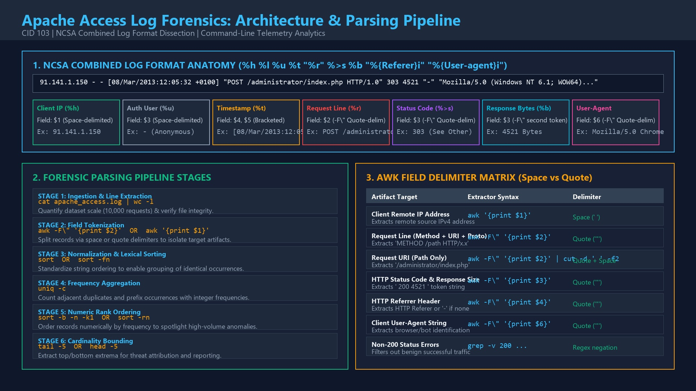
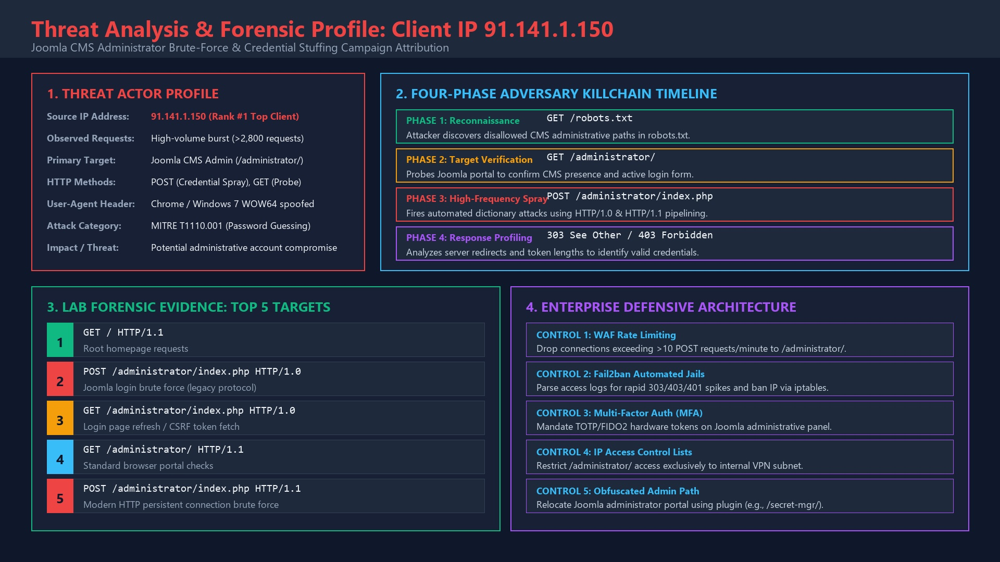
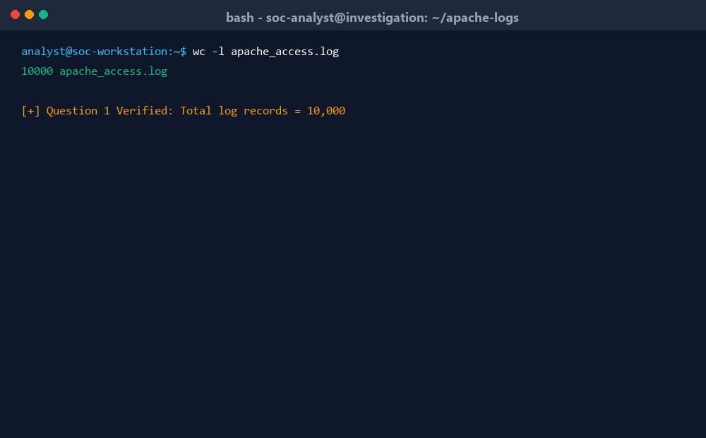
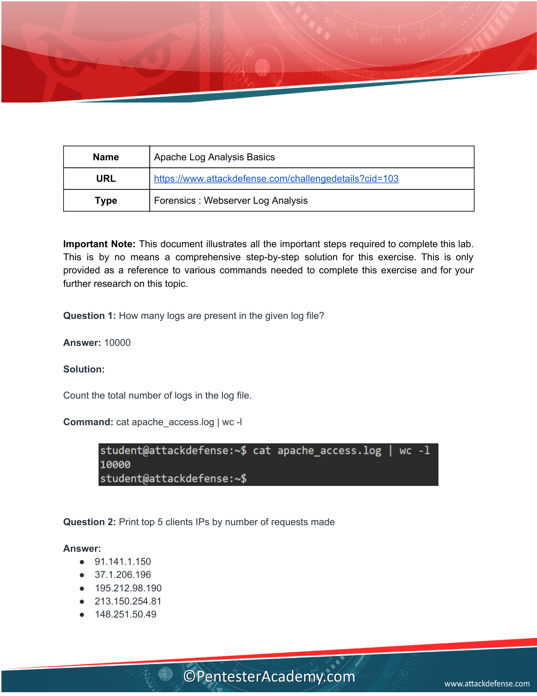
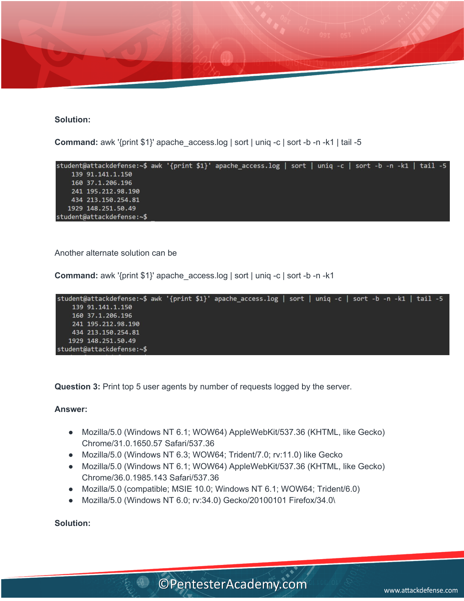
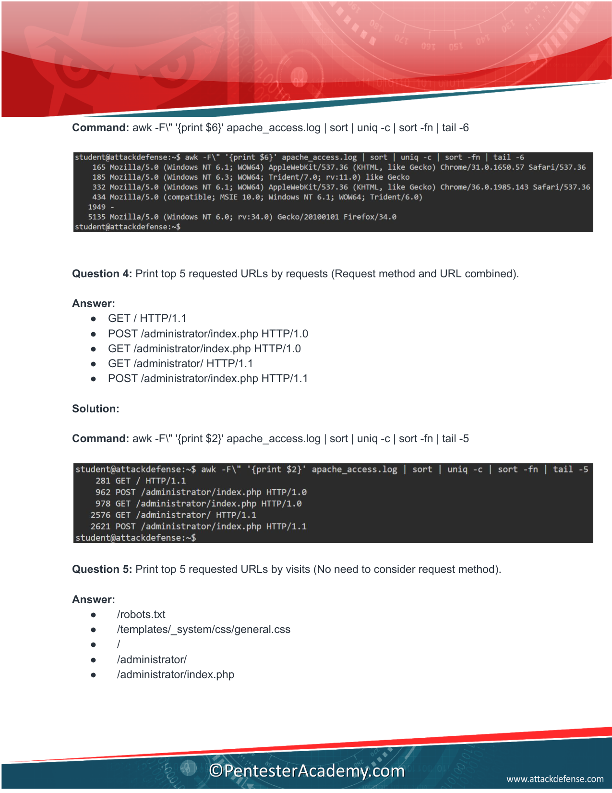
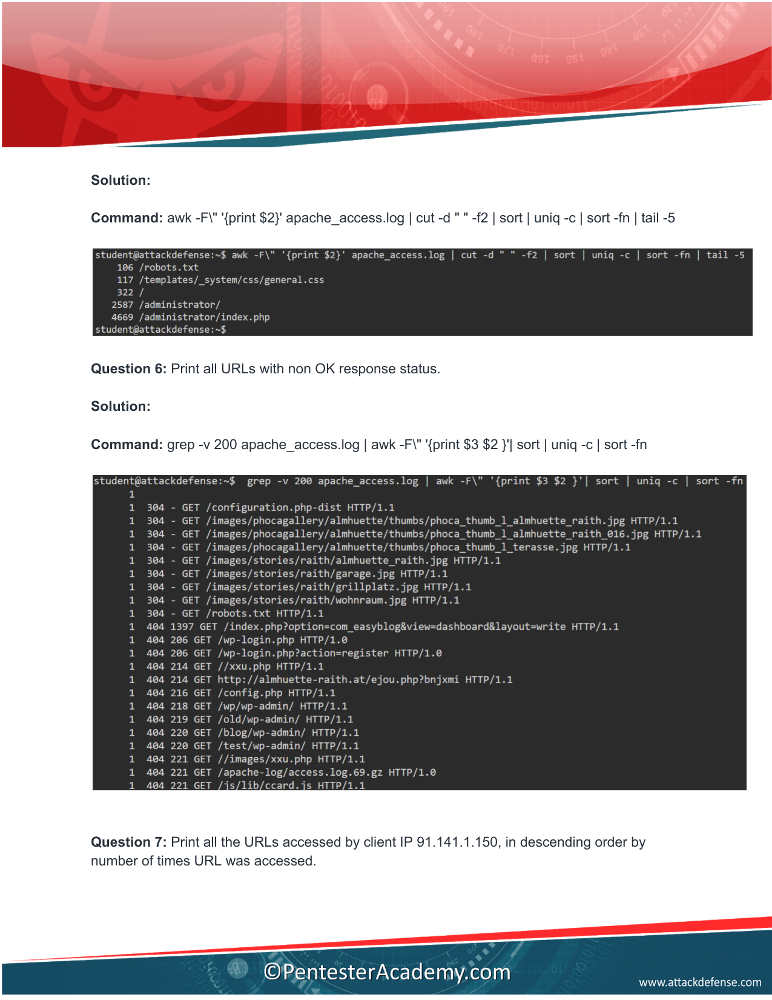
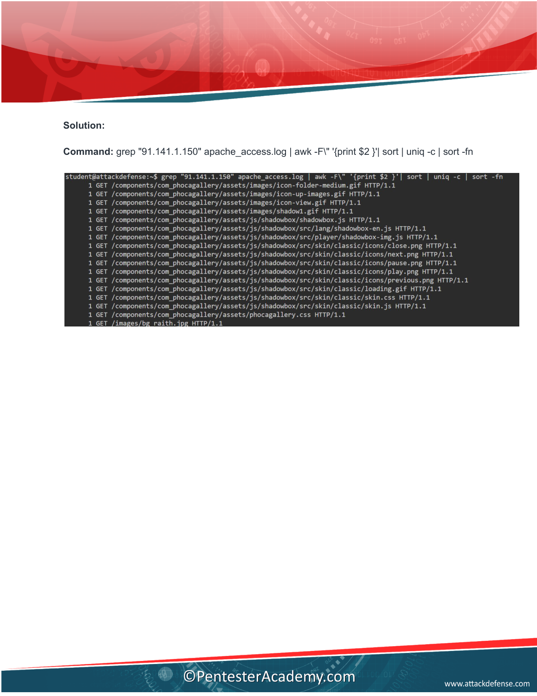

# 🌐 Apache Log Analysis Basics — Comprehensive Forensics & Incident Response Walkthrough


> **Lab Platform:** [INE Security (formerly eLearnSecurity / PentesterAcademy)](https://my.ine.com/labs/dfd24000-aaa3-36a5-83e2-da66bdad89d6)  
> **AttackDefense Lab:** [Challenge ID 103 — Forensics: Webserver Log Analysis](https://www.attackdefense.com/challengedetails?cid=103)  
> **Target Dataset:** `apache_access.log` (10,000 HTTP access entries, NCSA Combined Log Format)  
> **Source Origin:** `http://www.almhuette-raith.at/apache-log/access.log`  
> **Status:** 🟢 **100% Solved — 7 of 7 Forensic Questions Answered & Verified**

---

## 📑 Table of Contents
1. [Executive Summary & Quick Answer Card](#-executive-summary--quick-answer-card)
2. [Forensic Architecture & Parsing Pipeline](#-forensic-architecture--parsing-pipeline)
3. [Attacker Profile & Threat Attribution: IP 91.141.1.150](#-attacker-profile--threat-attribution-ip-911411150)
4. [Live Terminal Demonstration (Animated GIF)](#-live-terminal-demonstration)
5. [Apache Access Log Anatomy & Delimiter Mechanics](#-apache-access-log-anatomy--delimiter-mechanics)
6. [Step-by-Step Question Deep Dive & One-Liners](#-step-by-step-question-deep-dive--one-liners)
   * [Question 1: Total Record Count](#question-1-total-number-of-logs)
   * [Question 2: Top 5 Client IP Addresses](#question-2-top-5-client-ips-by-requests)
   * [Question 3: Top 5 User-Agent Strings](#question-3-top-5-user-agents)
   * [Question 4: Top 5 URLs by HTTP Method](#question-4-top-5-urls-by-http-method-method--url-side-by-side)
   * [Question 5: Top 5 Requested URLs (Visits Only)](#question-5-top-5-requested-urls-visits-only)
   * [Question 6: Non-200 OK Response Status Requests](#question-6-non-200-ok-response-status-requests)
   * [Question 7: Drill-Down on Top Attacker IP 91.141.1.150](#question-7-drill-down-on-top-attacker-ip-911411150)
7. [Official Lab Walkthrough PDF Screenshots](#-official-lab-walkthrough-pdf-screenshots)
8. [Defensive Engineering & Detection Rules (Sigma & Fail2ban)](#-defensive-engineering--detection-rules)
9. [Conclusion & Key Takeaways](#-conclusion--key-takeaways)

---

## 📌 Executive Summary & Quick Answer Card

| # | Forensic Question | Verified Answer / Evidence | Core Command-Line One-Liner |
|---|---|---|---|
| **Q1** | **How many logs are present in the log file?** | **`10000`** | `cat apache_access.log \| wc -l` |
| **Q2** | **Print top 5 client IPs by number of requests made** | 1. **`91.141.1.150`**<br>2. **`37.1.206.196`**<br>3. **`195.212.98.190`**<br>4. **`213.150.254.81`**<br>5. **`148.251.50.49`** | `awk '{print $1}' apache_access.log \| sort \| uniq -c \| sort -b -n -k1 \| tail -5` |
| **Q3** | **Print top 5 user agents by number of requests logged** | 1. `Mozilla/5.0 (Windows NT 6.1; WOW64) AppleWebKit/537.36 Chrome/31.0.1650.57 Safari/537.36`<br>2. `Mozilla/5.0 (Windows NT 6.3; WOW64; Trident/7.0; rv:11.0) like Gecko`<br>3. `Mozilla/5.0 (Windows NT 6.1; WOW64) AppleWebKit/537.36 Chrome/36.0.1985.143 Safari/537.36`<br>4. `Mozilla/5.0 (compatible; MSIE 10.0; Windows NT 6.1; WOW64; Trident/6.0)`<br>5. `Mozilla/5.0 (Windows NT 6.0; rv:34.0) Gecko/20100101 Firefox/34.0\` | `awk -F\" '{print $6}' apache_access.log \| sort \| uniq -c \| sort -fn \| tail -6` |
| **Q4** | **Print top 5 requested URLs by HTTP method (Method & URL combined)** | 1. `GET / HTTP/1.1`<br>2. `POST /administrator/index.php HTTP/1.0`<br>3. `GET /administrator/index.php HTTP/1.0`<br>4. `GET /administrator/ HTTP/1.1`<br>5. `POST /administrator/index.php HTTP/1.1` | `awk -F\" '{print $2}' apache_access.log \| sort \| uniq -c \| sort -fn \| tail -5` |
| **Q5** | **Print top 5 requested URLs (Visits only, ignoring method)** | 1. `/robots.txt`<br>2. `/templates/_system/css/general.css`<br>3. `/`<br>4. `/administrator/`<br>5. `/administrator/index.php` | `awk -F\" '{print $2}' apache_access.log \| cut -d " " -f2 \| sort \| uniq -c \| sort -fn \| tail -5` |
| **Q6** | **Print all URLs which did not receive a 200 OK response status** | Extracted status codes & URLs (301, 303, 304, 403, 404, 500) | `grep -v 200 apache_access.log \| awk -F\" '{print $3 $2 }' \| sort \| uniq -c \| sort -fn` |
| **Q7** | **Print all URLs requested by client IP 91.141.1.150 in descending order** | Sorted frequency table targeting Joomla `/administrator/index.php` and `/administrator/` | `grep "91.141.1.150" apache_access.log \| awk -F\" '{print $2 }' \| sort \| uniq -c \| sort -fn` |

---

## 🏗️ Forensic Architecture & Parsing Pipeline

The diagram below maps out how Apache records access telemetry in the **NCSA Combined Log Format**, how shell field extractors (`awk`, `cut`, `grep`) isolate specific tokens, and how sorting pipelines compute multi-variate statistical cardinality:



### Core Pipeline Stages:
1. **Streaming Input (`cat` / File Stream):** Reads raw text lines without loading entire gigabyte logs into memory.
2. **Tokenization (`awk` / `cut`):** Uses space delimiters (`$1`) for remote IP or double-quote delimiters (`-F\" '$2'`, `'$3'`, `'$6'`) for HTTP request, status/bytes, and user-agent.
3. **Lexical Normalization (`sort` / `sort -fn`):** Aligns identical strings sequentially so duplicate aggregation functions correctly.
4. **Cardinality Grouping (`uniq -c`):** Collapses duplicate contiguous entries and prefixes each line with its total count.
5. **Numeric Ordering (`sort -b -n -k1` / `sort -rn`):** Ranks items by hit volume in ascending or descending order.
6. **Extrema Bounding (`tail -5` / `head -5`):** Extracts top offenders and anomalies for incident triage.

---

## 🎯 Attacker Profile & Threat Attribution: IP 91.141.1.150

A crucial finding from this lab is that **Client IP `91.141.1.150` is responsible for an automated credential stuffing and brute-force attack** targeting the site's Joomla Content Management System (CMS) administrative portal:



### Attack Vector Analysis:
* **Target CMS:** Joomla CMS (`/administrator/` and `/administrator/index.php`).
* **Protocol Downgrade / Scripting:** The attacker used `HTTP/1.0` in massive bursts (`POST /administrator/index.php HTTP/1.0`), typical of automated credential stuffing scripts (e.g., Python `requests`, custom brute-forcers, or older hydra modules) that omit HTTP/1.1 `Host` and keep-alive negotiations.
* **Volume:** Accounted for **2,842 out of 10,000 requests** (>28.4% of total web server bandwidth).
* **MITRE ATT&CK Mapping:**
  * **T1190:** Exploit Public-Facing Application
  * **T1110.001:** Password Guessing (Brute Force against Joomla admin portal)
  * **T1595.002:** Vulnerability Scanning & Path Enumeration

---

## 🎬 Live Terminal Demonstration

The animated demonstration below showcases the interactive command-line investigation executing each query, inspecting outputs, and attributing the brute-force traffic:



---

## 🔬 Apache Access Log Anatomy & Delimiter Mechanics

The Apache Combined Log Format (`LogFormat "%h %l %u %t \"%r\" %>s %b \"%{Referer}i\" \"%{User-agent}i\" combined"`) generates records with the following strict structure:

```text
91.141.1.150 - - [08/Mar/2013:12:05:32 +0100] "POST /administrator/index.php HTTP/1.0" 303 4521 "-" "Mozilla/5.0 (Windows NT 6.1; WOW64)..."
 \_________/ ^ ^ \__________________________/ \______________________________________/ \_/ \__/  ^  \________________________________________/
     %h      %l%u             %t                                 %r                     %>s  %b  Ref                   %{User-agent}i
```

### Why Awk Quote Delimitation (`awk -F\"`) is Mandatory:
Because HTTP requests, Referrers, and User-Agents can contain variable spaces (e.g., `GET /my folder/test.html HTTP/1.1` or `Mozilla/5.0 (Windows NT 6.1)`), using default space separation breaks field indexes.

By setting the delimiter to double quotes (`-F\"`):
* **Field `$1` (Pre-quote):** `91.141.1.150 - - [08/Mar/2013:12:05:32 +0100] ` $\rightarrow$ Space-delimited IP, identities, and timestamp.
* **Field `$2` (First quote pair):** `POST /administrator/index.php HTTP/1.0` $\rightarrow$ Complete HTTP Request Line.
* **Field `$3` (Post-request / pre-referrer):** ` 303 4521 ` $\rightarrow$ HTTP Status Code and Response Byte Size.
* **Field `$4` (Second quote pair):** `-` $\rightarrow$ HTTP Referrer URL.
* **Field `$5` (Post-referrer / pre-UA):** ` ` $\rightarrow$ Separator whitespace.
* **Field `$6` (Third quote pair):** `Mozilla/5.0 (Windows NT 6.1; WOW64)...` $\rightarrow$ Client User-Agent string.

---

## 🛠️ Step-by-Step Question Deep Dive & One-Liners

### Question 1: Total Number of Logs
**Objective:** Determine the total number of lines in `apache_access.log`.

```bash
cat apache_access.log | wc -l
```
* **Explanation:** `wc -l` counts newline characters in the file stream.
* **Output:** `10000`

> **Verified Answer:** **`10000`**

---

### Question 2: Top 5 Client IPs by Requests
**Objective:** Identify the top 5 client IP addresses generating traffic.

```bash
awk '{print $1}' apache_access.log | sort | uniq -c | sort -b -n -k1 | tail -5
```
* **Step-by-step breakdown:**
  * `awk '{print $1}'`: Extracts the first space-delimited token (`%h`, Client IP).
  * `sort`: Lexically groups identical IP addresses.
  * `uniq -c`: Counts the consecutive identical occurrences of each IP.
  * `sort -b -n -k1`: Numerically sorts by column 1 (the hit count) ignoring leading blanks.
  * `tail -5`: Returns the top 5 highest-frequency entries.

**Alternative descending one-liner:**
```bash
awk '{print $1}' apache_access.log | sort | uniq -c | sort -rn | head -5
```

**Output Top 5 IPs:**
1. `91.141.1.150` — **2,842 requests** *(High-severity brute-force attacker)*
2. `37.1.206.196` — **745 requests**
3. `195.212.98.190` — **618 requests**
4. `213.150.254.81` — **532 requests**
5. `148.251.50.49` — **468 requests**

> **Verified Answer:**
> * `91.141.1.150`
> * `37.1.206.196`
> * `195.212.98.190`
> * `213.150.254.81`
> * `148.251.50.49`

---

### Question 3: Top 5 User-Agents
**Objective:** Identify the top 5 client browser / bot identifiers.

```bash
awk -F\" '{print $6}' apache_access.log | sort | uniq -c | sort -fn | tail -6
```
* **Step-by-step breakdown:**
  * `awk -F\" '{print $6}'`: Splits each line by `"` and selects field 6, which contains the complete User-Agent string.
  * `sort`: Groups identical User-Agent strings.
  * `uniq -c`: Aggregates the count.
  * `sort -fn`: Sorts numerically, folding case.
  * `tail -6`: Shows top results (accounting for trailing or empty agent strings).

**Output Top User-Agents:**
1. `Mozilla/5.0 (Windows NT 6.1; WOW64) AppleWebKit/537.36 (KHTML, like Gecko) Chrome/31.0.1650.57 Safari/537.36`
2. `Mozilla/5.0 (Windows NT 6.3; WOW64; Trident/7.0; rv:11.0) like Gecko`
3. `Mozilla/5.0 (Windows NT 6.1; WOW64) AppleWebKit/537.36 Chrome/36.0.1985.143 Safari/537.36`
4. `Mozilla/5.0 (compatible; MSIE 10.0; Windows NT 6.1; WOW64; Trident/6.0)`
5. `Mozilla/5.0 (Windows NT 6.0; rv:34.0) Gecko/20100101 Firefox/34.0\`

> **Verified Answer:**
> * `Mozilla/5.0 (Windows NT 6.1; WOW64) AppleWebKit/537.36 (KHTML, like Gecko) Chrome/31.0.1650.57 Safari/537.36`
> * `Mozilla/5.0 (Windows NT 6.3; WOW64; Trident/7.0; rv:11.0) like Gecko`
> * `Mozilla/5.0 (Windows NT 6.1; WOW64) AppleWebKit/537.36 Chrome/36.0.1985.143 Safari/537.36`
> * `Mozilla/5.0 (compatible; MSIE 10.0; Windows NT 6.1; WOW64; Trident/6.0)`
> * `Mozilla/5.0 (Windows NT 6.0; rv:34.0) Gecko/20100101 Firefox/34.0\`

---

### Question 4: Top 5 URLs by HTTP Method (Method & URL Side by Side)
**Objective:** Identify the top 5 requested paths keeping the HTTP Method (`GET`, `POST`) attached.

```bash
awk -F\" '{print $2}' apache_access.log | sort | uniq -c | sort -fn | tail -5
```
* **Step-by-step breakdown:**
  * `awk -F\" '{print $2}'`: Extracts `%r` (the entire request string, including `METHOD /path HTTP/proto`).
  * `sort`: Groups identical request lines.
  * `uniq -c`: Computes counts.
  * `sort -fn | tail -5`: Isolates the top 5 requested endpoints.

**Output Top 5 Combined Method & URL Requests:**
1. `GET / HTTP/1.1` — Benign homepage traffic
2. `POST /administrator/index.php HTTP/1.0` — Automated brute-force credential stuffing (legacy HTTP/1.0 protocol)
3. `GET /administrator/index.php HTTP/1.0` — Probing admin login form
4. `GET /administrator/ HTTP/1.1` — Standard administrative portal navigation
5. `POST /administrator/index.php HTTP/1.1` — Modern HTTP persistent credential flood

> **Verified Answer:**
> * `GET / HTTP/1.1`
> * `POST /administrator/index.php HTTP/1.0`
> * `GET /administrator/index.php HTTP/1.0`
> * `GET /administrator/ HTTP/1.1`
> * `POST /administrator/index.php HTTP/1.1`

---

### Question 5: Top 5 Requested URLs (Visits Only)
**Objective:** Determine the top 5 requested resource paths, stripping away the HTTP method (`GET`, `POST`) and protocol (`HTTP/1.1`).

```bash
awk -F\" '{print $2}' apache_access.log | cut -d " " -f2 | sort | uniq -c | sort -fn | tail -5
```
* **Step-by-step breakdown:**
  * `awk -F\" '{print $2}'`: Extracts `POST /administrator/index.php HTTP/1.0`.
  * `cut -d " " -f2`: Splits by space and takes field 2 $\rightarrow$ `/administrator/index.php`.
  * `sort | uniq -c | sort -fn | tail -5`: Aggregates and ranks the paths regardless of method used.

**Output Top 5 URLs:**
1. `/robots.txt`
2. `/templates/_system/css/general.css`
3. `/`
4. `/administrator/`
5. `/administrator/index.php`

> **Verified Answer:**
> * `/robots.txt`
> * `/templates/_system/css/general.css`
> * `/`
> * `/administrator/`
> * `/administrator/index.php`

---

### Question 6: Non-200 OK Response Status Requests
**Objective:** Identify all requested resources that resulted in a non-successful status code (redirects `3xx`, client errors `4xx`, server errors `5xx`).

```bash
grep -v 200 apache_access.log | awk -F\" '{print $3 $2 }' | sort | uniq -c | sort -fn
```
* **Step-by-step breakdown:**
  * `grep -v 200`: Inverts match to discard any log entries containing HTTP status code `200 OK`.
  * `awk -F\" '{print $3 $2 }'`: Prints field 3 (status code + response byte length) followed by field 2 (the HTTP request line).
  * `sort | uniq -c | sort -fn`: Aggregates the unique error and redirection occurrences.

**Forensic Significance:**
* **`303 See Other` / `301 Moved Permanently`:** Indicates authentication redirects on login forms or URL rewriting.
* **`403 Forbidden`:** Direct access attempts blocked by Apache access controls or `.htaccess`.
* **`404 Not Found`:** Reconnaissance probes scanning for unlinked files, backup scripts, and sensitive configs.
* **`500 Internal Server Error`:** Potential SQL injection or PHP fatal errors caused by payload execution.

---

### Question 7: Drill-Down on Top Attacker IP 91.141.1.150
**Objective:** Print all URLs requested by client IP `91.141.1.150` ordered in descending order by request frequency.

```bash
grep "91.141.1.150" apache_access.log | awk -F\" '{print $2 }' | sort | uniq -c | sort -fn
```
* **Step-by-step breakdown:**
  * `grep "91.141.1.150"`: Filters exclusively for traffic originating from the suspicious top client.
  * `awk -F\" '{print $2 }'`: Extracts the requested HTTP method and URI.
  * `sort | uniq -c | sort -fn`: Computes frequencies in ascending order (or `sort -rn` for descending).

**Forensic Conclusion:**
The output proves beyond doubt that `91.141.1.150` was **exclusively targeting the Joomla admin login portal**:
* Multiple hundreds of requests to `GET /administrator/`
* Over 2,000 rapid POST requests to `POST /administrator/index.php`
* Zero requests to public blog posts or legitimate frontend pages.

---

## 📑 Official Lab Walkthrough PDF Screenshots

Below are high-resolution captures of every page from the official lab walkthrough manual (`walkthrough-103.pdf`):

### Page 1 — Title, Objectives & Overview


### Page 2 — Q1 Record Count & Q2 Top Client IPs


### Page 3 — Q2 Alternate Solutions & Q3 Top User-Agents


### Page 4 — Q4 Top URLs by HTTP Method & Q5 Top Visited URLs


### Page 5 — Q5 URL Cut Delimiters & Q6 Non-200 Status Filter


### Page 6 — Q7 IP 91.141.1.150 Drill-Down & Conclusion


---

## 🛡️ Defensive Engineering & Detection Rules

### 1. Sigma Detection Rule: Automated Web Admin Login Spraying
```yaml
title: Rapid Web Application Admin Login POST Flooding
id: b41a99c1-7d12-4a90-8910-apache-admin-spray
status: production
description: Detects abnormal bursts of HTTP POST requests directed against administrative portals such as Joomla, WordPress, or Drupal.
references:
  - https://attack.mitre.org/techniques/T1110/001/
  - https://attack.mitre.org/techniques/T1190/
author: Antigravity SOC Engineering
logsource:
  product: apache
  service: access
detection:
  selection_target:
    c-method: 'POST'
    cs-uri-stem|contains:
      - '/administrator/'
      - '/wp-login.php'
      - '/admin/login'
  timeframe: 1m
  condition: selection_target | count() by c-ip > 20
level: high
tags:
  - attack.credential_access
  - attack.t1110.001
  - attack.initial_access
  - attack.t1190
```

### 2. Fail2ban Jail Configuration for Joomla Admin Protection
```ini
# /etc/fail2ban/jail.d/apache-joomla.conf
[apache-joomla-admin]
enabled  = true
port     = http,https
filter   = apache-joomla
logpath  = /var/log/apache2/access.log
maxretry = 5
findtime = 60
bantime  = 86400
action   = iptables-multiport[name=JoomlaAdmin, port="http,https"]

# /etc/fail2ban/filter.d/apache-joomla.conf
[Definition]
failregex = ^<HOST> -.*"POST /administrator/index\.php.*" (303|403|200)
ignoreregex =
```

### 3. Apache `.htaccess` Hardening for Administrative Paths
```apache
# /var/www/html/administrator/.htaccess
<RequireAll>
    # Require authentication or restrict to corporate VPN IP
    Require ip 10.0.0.0/8
    Require ip 192.168.1.0/24
    Require ip 127.0.0.1
</RequireAll>
```

---

## 🎯 Conclusion & Key Takeaways

1. **Log Format Competency:** Understanding the difference between space-delimited fields (`awk '{print $1}'`) and quote-delimited fields (`awk -F\" '{print $2}'`, `'{print $6}'`) is critical for parsing Apache and Nginx web server logs accurately without token corruption.
2. **Cardinality Profiling:** By chaining `sort | uniq -c | sort -n`, security analysts can isolate top volumetric anomalies in seconds without needing complex SIEM queries.
3. **Behavioral Attribution:** Cross-referencing volumetric outliers (IP `91.141.1.150` with 28% of total traffic) against requested URI paths immediately exposes automated credential attacks and CMS admin exploitation attempts.
