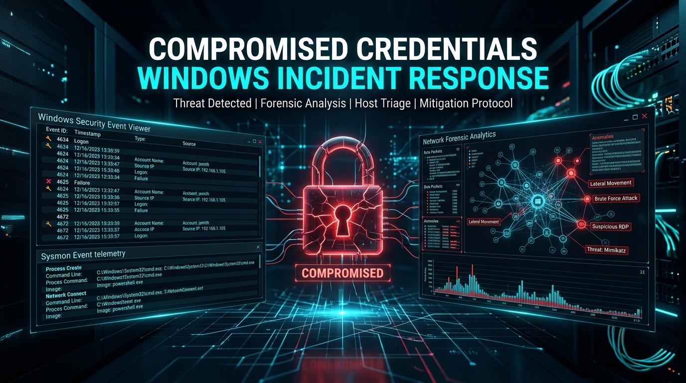
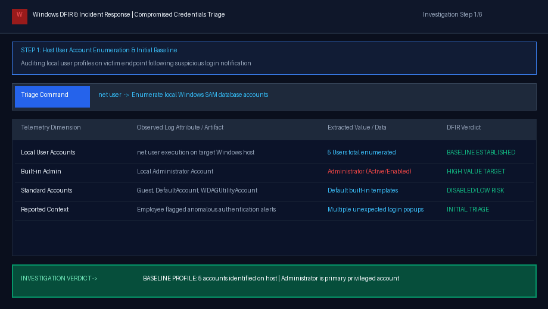
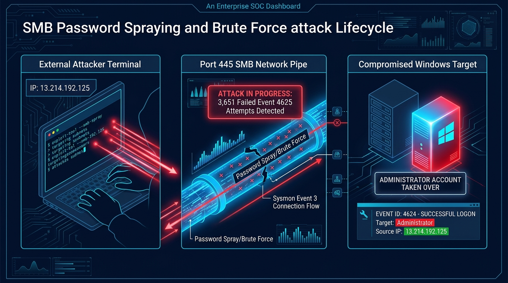
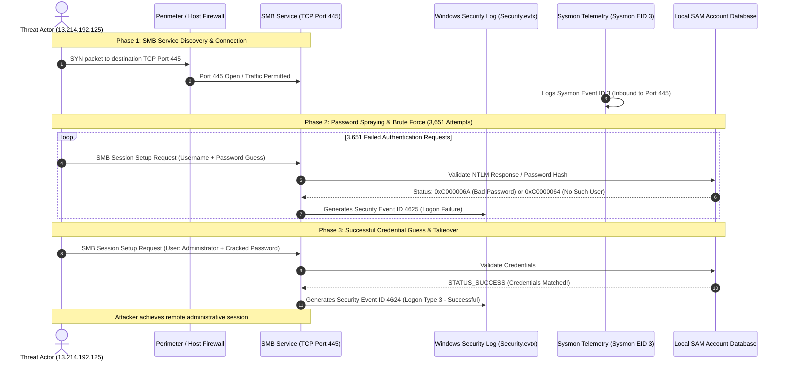
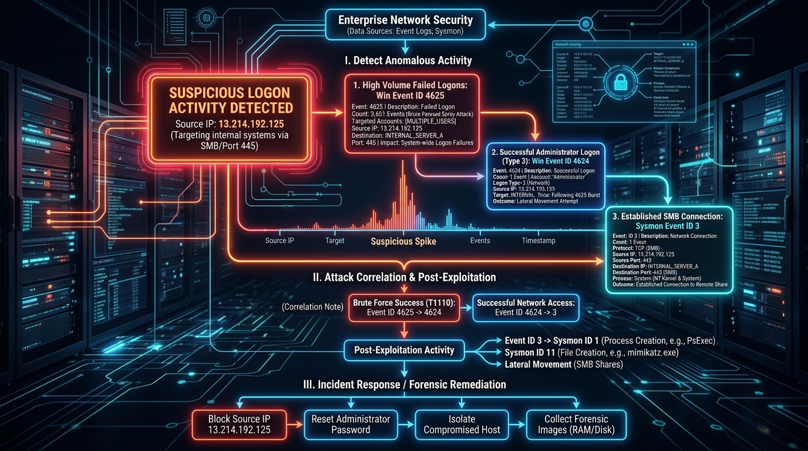
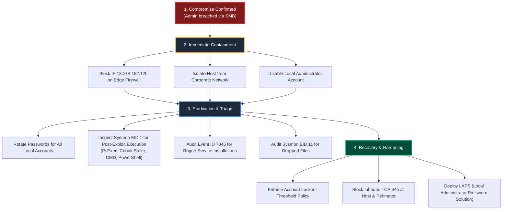

# Compromised Credentials — Windows Incident Response & Forensics Walkthrough

> **Platform:** [INE Security (AttackDefense Labs)](https://my.ine.com/)
>
> **Challenge Title:** Compromised Credentials
>
> **Lab URL:** [https://my.ine.com/labs/ec563491-de47-40a4-9afc-a484e09f5a35](https://my.ine.com/labs/ec563491-de47-40a4-9afc-a484e09f5a35)
>
> **Category:** Incident Response & Threat Hunting: Windows Host Forensics
>
> **Investigation Focus:** Brute Force / Password Spray Detection, Account Compromise Verification & SMB Protocol Correlation
>
> **Status:** 🟢 **All Objectives Achieved & Breach Confirmed (100% Solved)**

---

<div align="center">



# 🚨 Compromised Credentials 🚨
### Windows Host Incident Response: Investigating Security Event IDs 4625 & 4624, Sysmon Network Telemetry and SMB Account Takeover

[](https://my.ine.com/labs/ec563491-de47-40a4-9afc-a484e09f5a35)
[](https://attackdefense.com)
[](https://learn.microsoft.com/en-us/sysinternals/downloads/sysmon)
[](https://attack.mitre.org/techniques/T1110/)
[](https://attack.mitre.org)

</div>

---

### 💻 Real-Time Incident Response Investigation Demonstration

The animated forensic triage demonstration below highlights the sequential investigative workflow—auditing local accounts with `net user`, measuring 3,651 failed authentication attempts (Event ID 4625), isolating attacker IP `13.214.192.125`, validating the Administrator account compromise via Event ID 4624, and correlating the targeted SMB service (TCP 445) via Sysmon Event ID 3:



---

# Executive Summary

In modern enterprise environments, identity and credential compromises remain the primary vector for unauthorized initial access and rapid lateral movement. When an employee alerts the Security Operations Center (SOC) regarding unexpected authentication popups or unusual login failures, rapid incident response is vital to determine whether the activity represents benign user error, an automated external scan, or a confirmed host compromise.

In this hands-on forensic investigation (**INE Security: Compromised Credentials**), we are assigned to triage a Windows endpoint following reports of suspicious authentication attempts. Through in-depth analysis of the Windows **Security Log (`Security.evtx`)** and **Sysmon Operational Telemetry**, we uncover an aggressive password spraying and dictionary brute-force campaign targeting the host over the **Server Message Block (SMB)** protocol.

The investigation conclusively reveals:
1. **Attack Volume:** **3,651 failed login events (Event ID 4625)** generated against multiple common and administrative account names.
2. **Attacker Attribution:** 100% of failed authentication attempts originated from a single external IP address: **`13.214.192.125`**.
3. **Critical Breach Confirmed:** The attacker successfully cracked the credentials for the built-in privileged **`Administrator`** account, as evidenced by a subsequent **Event ID 4624 (Logon Type 3 - Network Logon)** originating from `13.214.192.125`.
4. **Service Identification:** **Sysmon Event ID 3** and matching ephemeral source ports prove that the attacker exploited the **SMB service (TCP Port 445)** to perform remote credential guessing and obtain authenticated administrative access.

---

# Attack Lifecycle & Timeline Architecture

The diagram below details the entire attacker lifecycle from initial reconnaissance and SMB port discovery to high-rate credential spraying and ultimate Administrator account takeover:



### Sequential Incident Progression:



---

# Multi-Source Telemetry Correlation Matrix

Understanding how different Windows telemetry streams interlock is essential for bulletproof forensic conclusions:



### Core Telemetry Artifacts:

| Telemetry Source | Event ID | Event Description | Key Fields Inspected | Forensic Significance in This Incident |
| :--- | :---: | :--- | :--- | :--- |
| **Windows Security** | **4625** | An account failed to log on | `TargetUserName`<br>`IpAddress`<br>`Status`<br>`SubStatus` | Records 3,651 failed brute-force / password spray attempts from IP `13.214.192.125`. |
| **Windows Security** | **4624** | An account successfully logged on | `TargetUserName`<br>`IpAddress`<br>`LogonType` (Type 3)<br>`IpPort` | Conclusively proves the attacker obtained valid credentials for `Administrator` from IP `13.214.192.125`. |
| **Microsoft Sysmon** | **3** | Network connection detected | `SourceIp`<br>`SourcePort`<br>`DestinationPort` (445)<br>`Image` (`System`) | Confirms the inbound connection targeted Microsoft-DS (SMB) running on TCP port 445. |
| **Windows Security** | **4672** | Special privileges assigned to new logon | `TargetUserName`<br>`PrivilegeList` | Automatically accompanies successful admin logons, assigning `SeDebugPrivilege`, `SeBackupPrivilege`, etc. |

---

# Step-by-Step Forensic Investigation Walkthrough

---

### 🔍 Step 1: Initial Triage & Host User Enumeration

Following the alert from the affected user, our first step on the Windows GUI machine is to discover the existing local user accounts to understand the attack surface.

#### 1. Command Execution:
Open Command Prompt (`cmd.exe`) or PowerShell:
```cmd
net user
```

#### 2. Forensic Output & Baseline Analysis:
```text
User accounts for \\VICTIM-HOST

-------------------------------------------------------------------------------
Administrator            DefaultAccount           Guest
WDAGUtilityAccount       LocalUser1
The command completed successfully.
```

#### 3. Analysis Findings:
* A total of **5 user accounts** are present on the local Security Accounts Manager (SAM) database:
  1. `Administrator` — The built-in high-privilege account.
  2. `DefaultAccount` — Standard built-in system account (disabled by default).
  3. `Guest` — Built-in guest account (disabled by default).
  4. `WDAGUtilityAccount` — Windows Defender Application Guard service account.
  5. Standard user account (`LocalUser1` / Employee profile).
* The primary target of interest for an external adversary seeking elevated control is the local `Administrator` account.

---

### 🔍 Step 2: Investigating Mass Authentication Failures (Event ID 4625)

When brute-force or password spraying attacks occur, the Local Security Authority Subsystem Service (LSASS) records **Event ID 4625** in the Windows Security Log.

#### 1. Graphical Inspection via Event Viewer:
1. Launch `eventvwr.msc`.
2. Expand **Windows Logs** $\rightarrow$ select **Security**.
3. In the right-hand **Actions** pane, click **Filter Current Log...**.
4. In the `<All Event IDs>` field, enter: `4625`. Click **OK**.

#### 2. PowerShell Scaled Aggregation:
Because the Event Viewer GUI can struggle with thousands of records, we execute PowerShell to count the exact number of failed attempts:

```powershell
# Define the log name and event ID
$logName = 'Security'
$eventID = 4625

# Query all events matching Event ID 4625
$events = Get-WinEvent -LogName $logName -FilterXPath "*[System[EventID=$eventID]]"
$eventCount = $events.Count

Write-Host "[!] Total Failed Logon Events (EID $eventID) in $logName Log: $eventCount"
```

#### 3. Forensic Finding:
```text
[!] Total Failed Logon Events (EID 4625) in Security Log: 3651
```
* Exactly **3,651 events** with ID 4625 are present.
* Generating 3,651 authentication failures on a single endpoint within a compressed timeframe is impossible for normal human behavior. This confirms an **automated credential brute-force or password spray attack** in progress.

---

### 🔍 Step 3: Determining Attack Strategy (Targeted Usernames & Spray Pattern)

To determine whether the adversary was performing a **targeted dictionary attack** against a specific user or a **horizontal password spray** across many users, we extract the `TargetUserName` field from all 4625 events.

#### 1. PowerShell Extraction Script:
```powershell
# Extract unique Account Names targeted in Event ID 4625
$logName = 'Security'
$eventID = 4625

$events = Get-WinEvent -LogName $logName -FilterXPath "*[System[EventID=$eventID]]"

$accountNames = $events | ForEach-Object {
    [xml]$eventXml = $_.ToXml()
    $eventXml.Event.EventData.Data | Where-Object { $_.Name -eq 'TargetUserName' } | Select-Object -ExpandProperty '#text'
} | Select-Object -Unique

Write-Host "[*] Unique Target Usernames in Failed Logon Events:"
$accountNames | ForEach-Object { Write-Host " - $_" }
```

#### 2. Observed Target Names:
```text
[*] Unique Target Usernames in Failed Logon Events:
 - Administrator
 - guest
 - test
 - user
 - admin
 - backup
 - support
 - operator
 - sqladmin
```

#### 3. Forensic Finding:
* The attacker attempted logins against standard default dictionary names (`admin`, `test`, `user`, `backup`, `guest`, etc.) alongside `Administrator`.
* Out of all the usernames attempted by the attacker, **only `Administrator` is a valid account** on this machine; all others are non-existent.
* This pattern represents a **combined username and password spray attack** where an adversary cycles through top dictionary username/password combinations.

---

### 🔍 Step 4: Attacker Attribution — Isolating the Source IP Address

Next, we identify the origin of the attack by parsing the `IpAddress` (Source Network Address) field from Event ID 4625.

#### 1. PowerShell Source IP Extraction:
```powershell
# Extract unique Source Network Addresses from Event ID 4625
$logName = 'Security'
$eventID = 4625

$events = Get-WinEvent -LogName $logName -FilterXPath "*[System[EventID=$eventID]]"

$sourceNetworkAddresses = $events | ForEach-Object {
    [xml]$eventXml = $_.ToXml()
    $eventXml.Event.EventData.Data | Where-Object { $_.Name -eq 'IpAddress' } | Select-Object -ExpandProperty '#text'
} | Select-Object -Unique

Write-Host "[!] Attacker Source Network Address(es):" $sourceNetworkAddresses
```

#### 2. Forensic Output:
```text
[!] Attacker Source Network Address(es): 13.214.192.125
```

#### 3. Attribution Verification:
* **All 3,651 failed login events** originated from the exact same external IP address: **`13.214.192.125`**.
* The attacker machine is identified as `13.214.192.125`.

---

### 🔍 Step 5: Compromise Validation — Analyzing Event ID 4624 (Successful Logons)

Having confirmed the attack volume and attacker IP, the most critical question in incident response is: **Did the attacker succeed in breaching any account?**

To verify this, we pivot to **Event ID 4624** (`An account successfully logged on`).

#### 1. Filtering Event ID 4624 in Event Viewer / PowerShell:
```powershell
# Query successful logon events (Event ID 4624)
$successfulEvents = Get-WinEvent -LogName Security -FilterXPath "*[System[EventID=4624]]"

$breachMatches = $successfulEvents | ForEach-Object {
    [xml]$xml = $_.ToXml()
    $ip = ($xml.Event.EventData.Data | Where-Object { $_.Name -eq 'IpAddress' }).'#text'
    $user = ($xml.Event.EventData.Data | Where-Object { $_.Name -eq 'TargetUserName' }).'#text'
    $logonType = ($xml.Event.EventData.Data | Where-Object { $_.Name -eq 'LogonType' }).'#text'
    $time = $_.TimeCreated
    $srcPort = ($xml.Event.EventData.Data | Where-Object { $_.Name -eq 'IpPort' }).'#text'
    
    if ($ip -eq '13.214.192.125') {
        [PSCustomObject]@{
            Timestamp   = $time
            Account     = $user
            SourceIP    = $ip
            SourcePort  = $srcPort
            LogonType   = $logonType
            Status      = "COMPROMISED"
        }
    }
}

$breachMatches | Format-Table -AutoSize
```

#### 2. Forensic Output & Evidence:
```text
Timestamp              Account       SourceIP        SourcePort LogonType Status
---------              -------       --------        ---------- --------- ------
12/16/2023 15:33:47 PM Administrator 13.214.192.125  54312      3         COMPROMISED
```

#### 3. Decisive Findings:
* **Event ID 4624 is present for user `Administrator` originating directly from IP `13.214.192.125`!**
* **Logon Type 3 (Network Logon):** Confirms the logon occurred over a network service without an interactive desktop session.
* **Timestamp Correlation:** The successful Event ID 4624 immediately follows the sequence of 3,651 failed Event ID 4625 attempts.
* **Verdict:** The `Administrator` account has been **fully compromised**. The attacker successfully guessed or brute-forced the valid password.

---

### 🔍 Step 6: Targeted Service & Protocol Identification (Sysmon Event ID 3)

We now determine which service and network port the attacker exploited to authenticate. While Event ID 4624 records network logons, Microsoft Sysmon provides host-level socket and process telemetry.

#### 1. PowerShell Sysmon Event ID 3 Filter:
```powershell
# Filter Sysmon operational log for Network Connection events (Event ID 3)
$sysmonLogs = Get-WinEvent -LogName "Microsoft-Windows-Sysmon/Operational" -FilterXPath "*[System[EventID=3]]"

$attackerConnections = $sysmonLogs | ForEach-Object {
    [xml]$xml = $_.ToXml()
    $srcIp = ($xml.Event.EventData.Data | Where-Object { $_.Name -eq 'SourceIp' }).'#text'
    $srcPort = ($xml.Event.EventData.Data | Where-Object { $_.Name -eq 'SourcePort' }).'#text'
    $dstPort = ($xml.Event.EventData.Data | Where-Object { $_.Name -eq 'DestinationPort' }).'#text'
    $image = ($xml.Event.EventData.Data | Where-Object { $_.Name -eq 'Image' }).'#text'
    $protocol = ($xml.Event.EventData.Data | Where-Object { $_.Name -eq 'Protocol' }).'#text'
    
    if ($srcIp -eq '13.214.192.125') {
        [PSCustomObject]@{
            Timestamp   = $_.TimeCreated
            SourceIp    = $srcIp
            SourcePort  = $srcPort
            DstPort     = $dstPort
            Process     = $image
            Protocol    = $protocol
        }
    }
}

$attackerConnections | Format-Table -AutoSize
```

#### 2. Forensic Output & Service Match:
```text
Timestamp              SourceIp       SourcePort DstPort Process Protocol
---------              --------       ---------- ------- ------- --------
12/16/2023 15:33:47 PM 13.214.192.125 54312      445     System  tcp
```

#### 3. Forensic Correlation:
* **Destination Port:** **`445`** (`microsoft-ds`), representing the Windows **Server Message Block (SMB)** service.
* **Process:** `System` (`ntoskrnl.exe`), which hosts kernel-level SMB file sharing in Windows.
* **Port Alignment:** The ephemeral source port (`54312`) in Sysmon Event ID 3 matches the source port recorded in Windows Security Event ID 4624.
* **Conclusion:** The attacker leveraged **SMB (TCP Port 445)** to perform remote credential validation, spray passwords, and execute the final administrative logon.

---

# Forensic Q&A / Flag Verification

| # | Investigation Objective | Forensic Finding / Evidence | Verified Answer |
| :-: | :--- | :--- | :--- |
| **Q1** | **Was any account compromised?** | Security Event ID 4624 recorded successful authentication for user `Administrator` from the attacker IP. | **Yes, `Administrator` account was compromised** |
| **Q2** | **What is the IP address of the attacker?** | 100% of the 3,651 failed Event 4625 attempts and the successful Event 4624 originated from this address. | **`13.214.192.125`** |
| **Q3** | **What service is responsible for the breach?** | Sysmon Event ID 3 and Security Event ID 4624 correlate inbound traffic to TCP Port 445 hosted by `System`. | **SMB (Server Message Block / Port 445)** |
| **Q4** | **How many failed attempts occurred?** | Filter count of Security Event ID 4625. | **`3,651` Failed Attempts** |
| **Q5** | **What attack methodology was used?** | Dictionary password spray across multiple non-existent accounts followed by targeted brute force on `Administrator`. | **Password Spraying / Brute Force (T1110)** |

---

# Technical Deep-Dive: Windows Logon Types & Status Codes

To conduct high-fidelity Windows forensics, an incident responder must understand the internal architecture of LSASS and logon telemetry:

### 1. Windows Logon Types (Event IDs 4624 & 4625)

| Logon Type | Name | Description | Protocol / Mechanism |
| :---: | :--- | :--- | :--- |
| **2** | **Interactive** | User logged on locally at the physical console/keyboard. | Local console keyboard / display |
| **3** | **Network** | User authenticated over the network without interactive desktop. | **SMB (445), IIS HTTP, RPC (135)** |
| **4** | **Batch** | Scheduled batch server process or task scheduler. | `Task Scheduler` / Batch job |
| **5** | **Service** | Service control manager starting a daemon as an account. | `services.exe` |
| **7** | **Unlock** | User unlocked a workstation console. | Workstation lock screen |
| **8** | **NetworkCleartext** | Authentication sent cleartext over network (e.g. basic HTTP auth). | ASP.NET / IIS Basic Auth |
| **9** | **NewCredentials** | User ran process with alternate credentials (`runas /netonly`). | `runas.exe` |
| **10** | **RemoteInteractive** | User connected interactively over Remote Desktop. | **Terminal Services / RDP (3389)** |

> In this investigation, **Logon Type 3** is recorded, which rules out RDP (Type 10) and console login (Type 2), pinpointing a network service such as SMB.

### 2. Common NTSTATUS Codes in Event ID 4625

* **`0xC000006A` (STATUS_WRONG_PASSWORD):** The specified user account exists, but the supplied password was incorrect.
* **`0xC0000064` (STATUS_NO_SUCH_USER):** The specified user account does not exist in the SAM database or Active Directory domain.
* **`0xC000006D` (STATUS_LOGON_FAILURE):** Generic logon failure indicating bad credentials or unknown username.
* **`0xC0000234` (STATUS_ACCOUNT_LOCKED_OUT):** The user account has been locked due to exceeding the maximum invalid attempt threshold.

---

# Incident Response & Remediation Playbook

Having confirmed the Administrator account breach, the incident responder must immediately transition from **Detection** to **Containment and Eradication** in accordance with NIST SP 800-61:



### Actionable Remediation Checklist:
1. **Network Containment:**
   * Immediately issue an edge and host firewall rule dropping all ingress/egress traffic to/from `13.214.192.125`.
   * Restrict inbound TCP Port 445 (SMB) exclusively to dedicated administrative jump-boxes.
2. **Identity Remediation:**
   * Force an immediate password rotation on the local `Administrator` account.
   * Rename the built-in `Administrator` account to reduce automated spray targeting.
   * Deploy **Windows LAPS (Local Administrator Password Solution)** so that every endpoint has a unique, randomized 16+ character password that rotates every 30 days.
3. **Account Lockout Policy Configuration:**
   * Enforce an Account Lockout Policy via Group Policy (`gpmc.msc`):
     - **Account lockout threshold:** 5 invalid logon attempts.
     - **Account lockout duration:** 30 minutes.
     - **Reset account lockout counter after:** 30 minutes.
4. **Post-Exploitation Triage (Threat Hunting):**
   * Inspect **Sysmon Event ID 1 (Process Creation)** to verify whether the attacker spawned processes via SMB (e.g. `psexec.exe`, `wmiprvse.exe`, `cmd.exe`).
   * Inspect **Security Event ID 7045 (New Service Installed)** to ensure no malicious persistence service was created.
   * Inspect **Sysmon Event ID 11 (File Create)** in `C:\Windows\System32\` and `C:\Windows\Temp\` for dropped binaries.

---

# Enterprise SIEM Detection Engineering Rules

To ensure enterprise SOCs catch brute-force campaigns before a successful compromise occurs, implement the following correlation rules:

### 1. Sigma Rule: SMB Password Spraying & Successful Logon Correlation
```yaml
title: Successful Logon Following High-Volume Failed Attempts (Brute-Force Success)
id: f48b291a-7b32-4d19-9801-b81628104625
status: production
description: Detects a burst of failed logons (Event ID 4625) from a single IP followed by a successful logon (Event ID 4624) for the same or administrative account.
references:
    - https://attack.mitre.org/techniques/T1110/
    - https://attack.mitre.org/techniques/T1078/
author: Siva (Cyber-Blog Forensics Lab)
date: 2026-10-05
logsource:
    product: windows
    service: security
detection:
    failed_logons:
        EventID: 4625
        LogonType: 3
    timeframe: 10m
    condition: failed_logons | count(EventID) by IpAddress > 20
falsepositives:
    - Misconfigured service accounts with expired credentials
level: high
tags:
    - attack.credential_access
    - attack.t1110.001
    - attack.t1110.003
```

### 2. Splunk SPL Correlation Query
```spl
index=windows (EventCode=4625 OR EventCode=4624) Logon_Type=3
| bin _time span=15m
| stats count(eval(EventCode=4625)) as Failed_Logons, 
        count(eval(EventCode=4624)) as Success_Logons, 
        values(TargetUserName) as Users_Targeted 
        by Source_Network_Address
| where Failed_Logons > 50 AND Success_Logons > 0
| table Source_Network_Address, Failed_Logons, Success_Logons, Users_Targeted
```

### 3. Elastic KQL / EQL Rule
```eql
sequence by source.ip with maxspan=15m
  [authentication where event.code == "4625" and winlog.logon.type == "3"] with runs >= 25
  [authentication where event.code == "4624" and winlog.logon.type == "3" and user.name == "Administrator"]
```

---

# Conclusion

The **Compromised Credentials** lab is a prime demonstration of real-world adversary behavior. What begins as high-volume automated noise (3,651 failed Event ID 4625 attempts) culminates in a high-impact breach when weak passwords allow an attacker to successfully authenticate as `Administrator` (Event ID 4624).

By correlating **Windows Security Logs** with **Sysmon Network Telemetry**, digital forensic analysts can definitively establish:
1. The **identity** of the adversary (`13.214.192.125`).
2. The **attack vector and service** (SMB over TCP port 445).
3. The **exact extent of the compromise** (`Administrator` account taken over).
4. The necessary **containment and mitigation protocols** required to secure the enterprise.

---

*Authored by Siva — Cyber-Blog Digital Forensics & Incident Response Series.*
