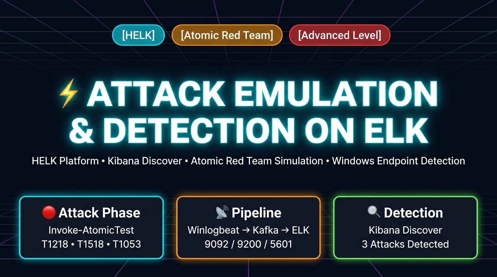

<div align="center">



# ⚡ Attack Emulation & Detection on ELK Stack

[](.)
[](https://attack.mitre.org/)
[](.)

</div>

---

## 📖 About This Lab

**Attack Emulation and Detection on ELK Stack** is an advanced threat detection lab where you:

1. **Configure** a Winlogbeat → Kafka → Elasticsearch → Kibana pipeline on the HELK (Hunting ELK) platform
2. **Simulate** three MITRE ATT&CK techniques using the Atomic Red Team framework
3. **Detect** all attacks in Kibana's Discover interface

| Field | Details |
| :--- | :--- |
| **Platform** | INE Security — Defender Labs |
| **Difficulty** | 🔴 Advanced |
| **Environment** | Windows Target + Ubuntu SOC (HELK) + Kali Attack |
| **Techniques** | T1218.010 (Regsvr32) · T1518.001 (Sysmon Discovery) · T1053.005 (Scheduled Task) |
| **Result** | ✅ 3/3 Attacks Detected |

---

## 📂 Lab Files

| File | Description |
| :--- | :--- |
| [`Attack_Emulation_Detection_ELK_Stack_Walkthrough.md`](./Attack_Emulation_Detection_ELK_Stack_Walkthrough.md) | 📄 **Full walkthrough** — complete step-by-step guide with all 21 screenshots, Mermaid diagrams, and forensic analysis |
| `images/elk_attack_detection_banner.jpg` | 🖼️ Lab hero banner |
| `images/elk_helk_architecture_pipeline.jpg` | 🏗️ HELK architecture infographic |
| `images/elk_lab_live_demo.gif` | 🎬 9-frame animated terminal demo |
| `image/` | 📸 21 official lab screenshots |

---

## 🔍 Quick Reference

### HELK Pipeline
```
Windows Sysmon Events
      ↓ Winlogbeat :9092
  Kafka Broker
      ↓ Consumer
  Elasticsearch :9200
      ↓ Index: logs-endpoint-winevent-*
  Kibana :5601 (helk/hunting)
      ↓ Discover
  SOC Analyst
```

### Attack Techniques Emulated

| # | MITRE ID | Technique | Command | Detection |
|:---:|:---:|:---|:---|:---:|
| 1 | **T1218.010** | Regsvr32 Proxy Exec | `Invoke-AtomicTest T1218.010-1` | ✅ |
| 2 | **T1518.001** | Sysmon Discovery | `Invoke-AtomicTest T1518.001-5` | ✅ |
| 3 | **T1053.005** | Scheduled Task | `Invoke-AtomicTest T1053.005-2` | ✅ |

---

**[👉 Read Full Walkthrough](./Attack_Emulation_Detection_ELK_Stack_Walkthrough.md)**
