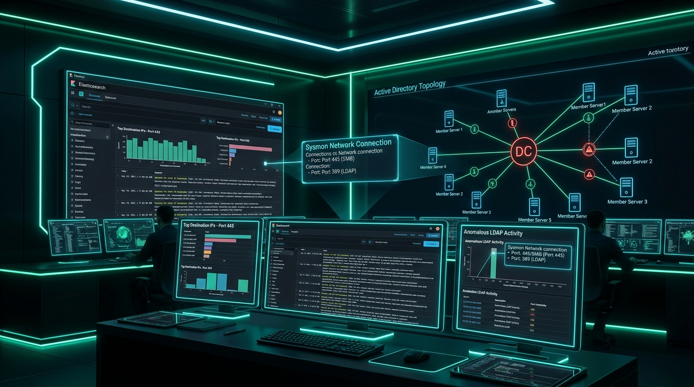
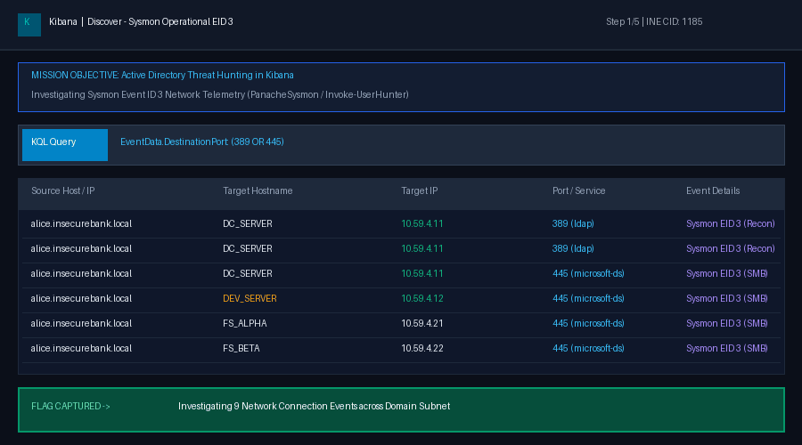
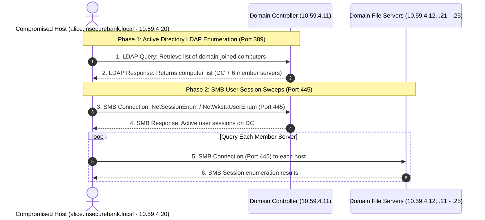
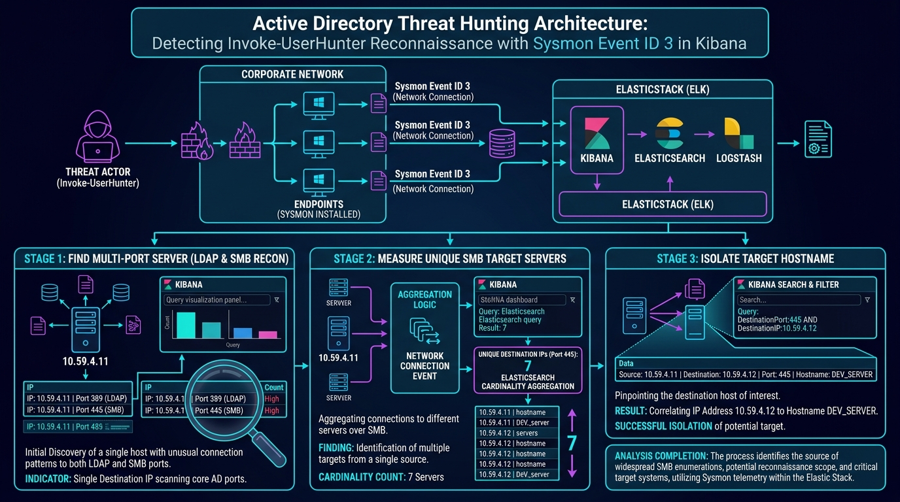
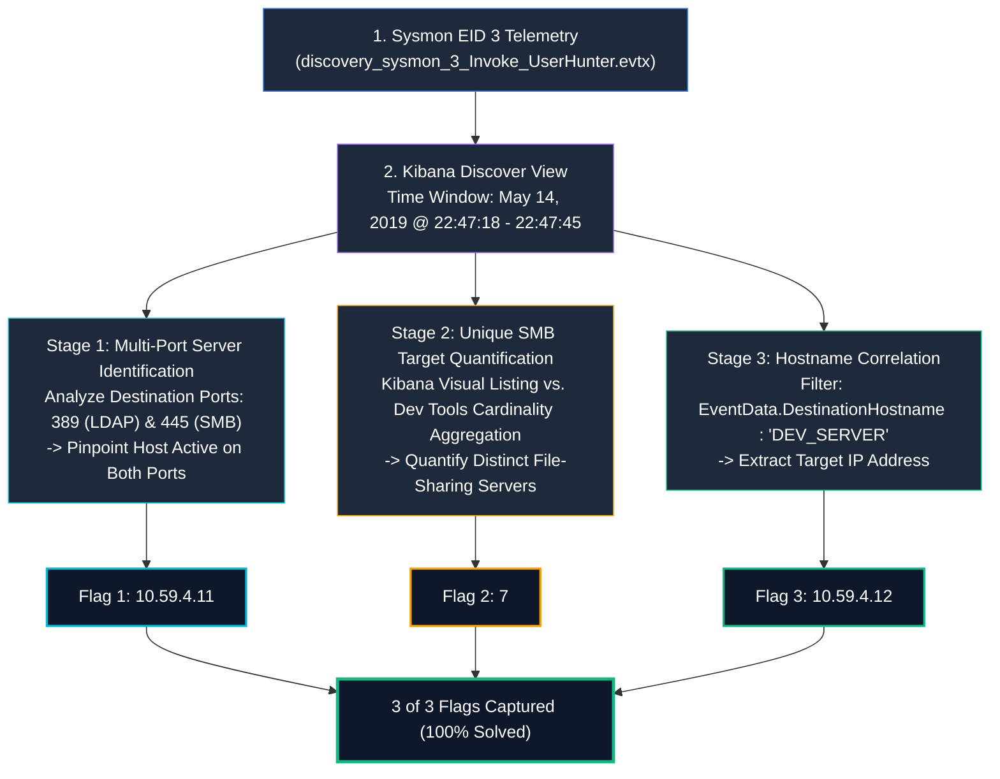
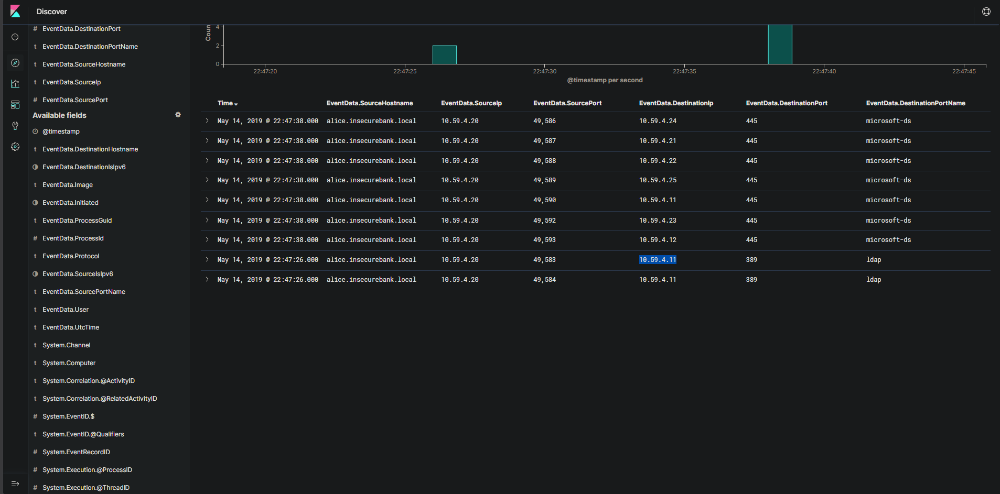
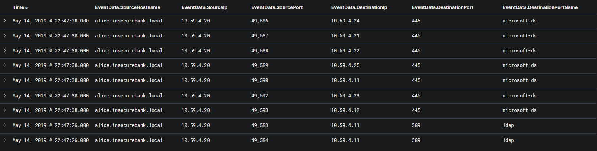
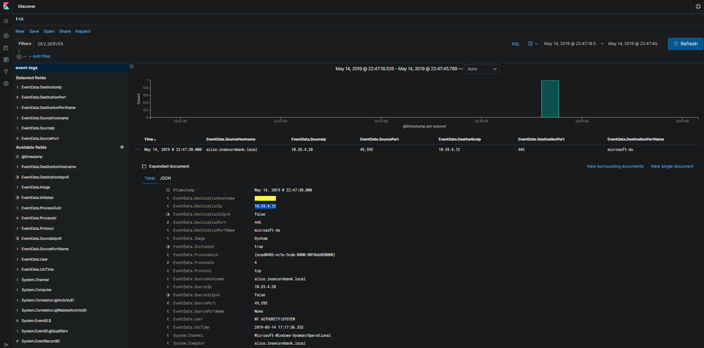

# Kibana : Windows Event Logs II — Complete Walkthrough & Threat Hunting Analysis

> **Platform:** [INE Security (Cybersecurity Hands-on Labs)](https://my.ine.com/)
>
> **Lab Link:** [https://my.ine.com/labs/c477b534-df2a-3f90-bcd4-e71222a4d208](https://my.ine.com/labs/c477b534-df2a-3f90-bcd4-e71222a4d208)
>
> **Challenge Title:** Kibana : Windows Event Logs II (CID 1185)
>
> **Category:** Log Analysis & Threat Hunting: Windows Event Logs
>
> **Dataset Source:** [`discovery_sysmon_3_Invoke_UserHunter_SourceMachine.evtx`](https://github.com/sbousseaden/EVTX-ATTACK-SAMPLES/blob/master/Discovery/discovery_sysmon_3_Invoke_UserHunter_SourceMachine.evtx) (by Samir Bousseaden)
>
> **Status:** 3 of 3 Flags Captured (100% Solved)

---

<div align="center">



# 🔍 Kibana: Windows Event Logs II 🔍
### SOC Threat Hunting & Forensic Analysis of Active Directory `Invoke-UserHunter` Reconnaissance (Sysmon EID 3)

[](https://my.ine.com/labs/c477b534-df2a-3f90-bcd4-e71222a4d208)
[](https://www.elastic.co/)
[](https://learn.microsoft.com/en-us/sysinternals/downloads/sysmon)
[](https://attack.mitre.org/)

</div>

---

### 💻 Real-Time Investigation Demonstration

The animated visual recording below illustrates the end-to-end investigation workflow inside Kibana Discover and Dev Tools—inspecting destination ports, identifying dual-service nodes, calculating unique target servers using Elasticsearch cardinality aggregation, and isolating target hostnames:



---

# Executive Summary

In enterprise Windows environments, post-compromise lateral reconnaissance often relies on native domain query protocols rather than noisy port scanners. Adversaries leverage tools like PowerView (`Invoke-UserHunter`), BloodHound / SharpHound, and PowerSploit to discover where high-privilege users (such as Domain Admins) are logged on across domain-joined machines.

This lab investigates a security event log dataset generated during an **`Invoke-UserHunter`** reconnaissance attack, captured via **Microsoft Sysmon Event ID 3 (Network Connection Detected)** and ingested into an **Elasticsearch & Kibana (ELK)** cluster.

As SOC threat hunters, our objective is to analyze the connection patterns originating from the compromised endpoint `alice.insecurebank.local` (`10.59.4.20`), differentiate Active Directory directory enumeration from file-sharing sweeps, count distinct target servers using both visual analysis and Elasticsearch aggregations, and correlate IP addresses with specific domain hostnames.

---

# Technical Background: The Mechanics of `Invoke-UserHunter`

Understanding the underlying attack mechanics is essential for high-fidelity threat hunting:



### Forensic Indicators in Sysmon Event ID 3:
1. **LDAP Queries (Port 389):** The source machine queries the Domain Controller (`10.59.4.11`) twice over LDAP to extract the roster of domain computer objects.
2. **SMB Queries (Port 445):** The source machine then initiates rapid sequential TCP connections over port 445 (`microsoft-ds`) to each enumerated computer to query the Windows NetAPI (`NetSessionEnum` / `NetWkstaUserEnum`), determining which users hold open SMB sessions.
3. **Multi-Port Node:** Because the Domain Controller is both a Directory Server (LDAP port 389) and a File Sharing server (SMB port 445), it is the only destination that accepts connections on both ports.

---

# Threat Hunting Workflow Architecture

The investigation methodology proceeds through the following structured stages:





---

# 🚩 Flag Capture Summary Matrix

| # | Investigation Objective | Protocol & Port | Threat Hunting Query / Method | Captured Flag / Answer |
| :---: | :--- | :--- | :--- | :--- |
| **Q1** | IP address of machine listening on two different ports (389 & 445) | **LDAP (389)** & **SMB (445)** | Filter `EventData.DestinationPort: 389` & intersect with `445` | **`10.59.4.11`** |
| **Q2** | Number of distinct file sharing servers connected to by host | **SMB (445)** | Dev Tools Cardinality Aggregation / Manual Unique Count | **`7`** |
| **Q3** | IP address of file sharing machine with hostname `DEV_SERVER` | **SMB (445)** | Filter `EventData.DestinationHostname : "DEV_SERVER"` | **`10.59.4.12`** |

---

# Detailed Step-by-Step Walkthrough

## Setup & Time-Window Configuration

1. Log into the Kibana web interface.
2. In the left navigation panel, click on **Discover**.
3. Verify that the active index pattern is set to **`event-logs`**.
4. Adjust the global time-picker in the top-right corner to cover the event dataset:
   - **Start Time:** `May 14, 2019 @ 22:47:18.526`
   - **End Time:** `May 14, 2019 @ 22:47:45.789`
5. From the **Available fields** sidebar on the left, add the following fields to your **Selected fields** table for clear visibility:
   - `EventData.SourceHostname`
   - `EventData.SourceIp`
   - `EventData.SourcePort`
   - `EventData.DestinationIp`
   - `EventData.DestinationPort`
   - `EventData.DestinationPortName`

---

## 🚩 Question 1: Multi-Port File Sharing Server

### Objective
> *A set of machines have been configured to run a file sharing service. One of the machines listened on two different ports to provide access to its files and directories. What was the IP address of that machine?*

### Threat Hunting Analysis

1. In the **Selected fields** section on the left panel, locate **`EventData.DestinationPort`**.
2. Kibana reveals that across all 9 records in the dataset, there are only two distinct destination ports:
   - **`445`** (`microsoft-ds` - SMB File Sharing): **7 records (77.8%)**
   - **`389`** (`ldap` - Lightweight Directory Access Protocol): **2 records (22.2%)**
3. Click the zoom-in / filter icon next to port **`389`** (or enter `EventData.DestinationPort: 389` in the search bar):
   - Two records are returned, both occurring at `May 14, 2019 @ 22:47:26.000`.
   - The destination IP address for both port 389 events is **`10.59.4.11`**.
4. Now remove the port 389 filter and inspect port **`445`**:
   - Among the records connecting to port 445 at `May 14, 2019 @ 22:47:38.000`, one of the entries connects to **`10.59.4.11`** (Source Port 49590 -> Destination Port 445).
5. Comparing the destination IPs between both ports confirms that **`10.59.4.11`** is the only machine listening on both port 389 and port 445.

### Answer / Flag
```text
10.59.4.11
```

### Verified Evidence Screenshot


> [!NOTE]
> **Forensic Context:** In a Windows Active Directory domain, the primary Domain Controller always runs both Active Directory Domain Services (LDAP on TCP 389) and the Server Service (SMB on TCP 445 for SYSVOL / NETLOGON shares).

---

## 🚩 Question 2: Distinct File Sharing Servers Count

### Objective
> *How many distinct file-sharing servers did the host machine connected to?*

### Threat Hunting Analysis

There are two equally valid and accurate approaches to answer this question:

#### Approach 1: Elasticsearch Dev Tools Aggregation (Enterprise SOC Methodology)
When dealing with massive event streams containing thousands of events, SOC analysts avoid manual counting by executing cardinality aggregations directly in the Elasticsearch console.

1. Click on **Dev Tools** in the left navigation sidebar.
2. Enter the following query to calculate the unique cardinality of destination IP addresses:

```json
GET event-logs/_search
{
  "size": 0,
  "aggs": {
    "ip_count": {
      "cardinality": {
        "field": "EventData.DestinationIp.keyword"
      }
    }
  }
}
```

3. Click the green **Run (Play)** button. Elasticsearch returns:

```json
{
  "took": 4,
  "timed_out": false,
  "_shards": {
    "total": 1,
    "successful": 1,
    "skipped": 0,
    "failed": 0
  },
  "hits": {
    "total": {
      "value": 9,
      "relation": "eq"
    },
    "max_score": null,
    "hits": []
  },
  "aggregations": {
    "ip_count": {
      "value": 7
    }
  }
}
```

The aggregation specifically returns `"value": 7`.

#### Approach 2: Direct Log Table Inspection
Since this lab dataset contains 9 total events, we can also enumerate the distinct destination IPs directly from the Kibana Discover table:

| # | Event Timestamp | Source IP | Source Port | Destination IP | Destination Port | Service Name |
| :-: | :--- | :--- | :-: | :--- | :-: | :--- |
| 1 | May 14, 2019 @ 22:47:38.000 | 10.59.4.20 | 49586 | **10.59.4.24** | 445 | microsoft-ds |
| 2 | May 14, 2019 @ 22:47:38.000 | 10.59.4.20 | 49587 | **10.59.4.21** | 445 | microsoft-ds |
| 3 | May 14, 2019 @ 22:47:38.000 | 10.59.4.20 | 49588 | **10.59.4.22** | 445 | microsoft-ds |
| 4 | May 14, 2019 @ 22:47:38.000 | 10.59.4.20 | 49589 | **10.59.4.25** | 445 | microsoft-ds |
| 5 | May 14, 2019 @ 22:47:38.000 | 10.59.4.20 | 49590 | **10.59.4.11** | 445 | microsoft-ds |
| 6 | May 14, 2019 @ 22:47:38.000 | 10.59.4.20 | 49592 | **10.59.4.23** | 445 | microsoft-ds |
| 7 | May 14, 2019 @ 22:47:38.000 | 10.59.4.20 | 49593 | **10.59.4.12** | 445 | microsoft-ds |
| 8 | May 14, 2019 @ 22:47:26.000 | 10.59.4.20 | 49583 | 10.59.4.11 | 389 | ldap |
| 9 | May 14, 2019 @ 22:47:26.000 | 10.59.4.20 | 49584 | 10.59.4.11 | 389 | ldap |

Extracting the unique destination IP list connected to file-sharing port 445:
- `10.59.4.11`
- `10.59.4.12`
- `10.59.4.21`
- `10.59.4.22`
- `10.59.4.23`
- `10.59.4.24`
- `10.59.4.25`

Total unique file-sharing target servers: **7**.

### Answer / Flag
```text
7
```

### Verified Evidence Screenshot


---

## 🚩 Question 3: IP Address of Hostname 'DEV_SERVER'

### Objective
> *A file-sharing service was running on a machine with the hostname 'DEV_SERVER'. What was the IP address of that machine?*

### Threat Hunting Analysis

1. Return to the **Discover** view in Kibana.
2. In the search bar, filter for events where the target hostname equals `DEV_SERVER`:

```text
EventData.DestinationHostname : "DEV_SERVER"
```

3. Press **Enter** or click **Update**.
4. Exactly **1 hit** matches this search filter:
   - **Timestamp:** `May 14, 2019 @ 22:47:38.000`
   - **Source Hostname:** `alice.insecurebank.local`
   - **Source IP:** `10.59.4.20`
   - **Source Port:** `49593`
   - **Destination Port:** `445` (`microsoft-ds`)
5. Expanding the document reveals the full Sysmon telemetry:
   - **`EventData.DestinationHostname`**: `DEV_SERVER`
   - **`EventData.DestinationIp`**: **`10.59.4.12`**
   - **`EventData.Image`**: `System`
   - **`EventData.ProcessId`**: `4` (Windows NT Kernel)
   - **`EventData.User`**: `NT AUTHORITY\SYSTEM`

### Answer / Flag
```text
10.59.4.12
```

### Verified Evidence Screenshot


---

# 🛡️ Detection Engineering & Defensive Playbook

When threat actors execute `Invoke-UserHunter` or BloodHound in an Active Directory environment, their connection patterns create distinct anomalies in network and endpoint telemetry.

### 1. Sigma Detection Rule: Anomalous High-Frequency SMB Sweeps
```yaml
title: Rapid Multi-Host SMB Session Enumeration (UserHunter Activity)
id: d76b5e02-45a8-4c64-9f2d-8b01a1c3e120
status: experimental
description: Detects a single endpoint initiating sequential SMB connections (Port 445) across multiple distinct internal hosts in a short time-window, indicative of Invoke-UserHunter or BloodHound.
logsource:
    category: network_connection
    product: windows
detection:
    selection:
        EventID: 3
        DestinationPort: 445
    timeframe: 1m
    condition: selection | count(DestinationIp) by SourceIp > 5
level: high
tags:
    - attack.discovery
    - attack.t1087.002
    - attack.t1018
    - attack.t1069.002
```

### 2. Sigma Detection Rule: LDAP Computer Object Enumeration Followed by SMB
```yaml
title: Sequence of LDAP Computer Enumeration Followed by SMB Connections
id: 3c914e41-2a10-4bfb-88a4-0994f71a0077
status: experimental
description: Identifies an endpoint querying the Domain Controller over LDAP (port 389) immediately followed by SMB connections to multiple workstations.
logsource:
    category: network_connection
    product: windows
detection:
    ldap_query:
        EventID: 3
        DestinationPort: 389
    smb_query:
        EventID: 3
        DestinationPort: 445
    condition: ldap_query and smb_query
level: medium
tags:
    - attack.discovery
    - attack.t1087
```

### 3. Enterprise Hardening & Prevention Measures
* **Restrict Remote SAM & NetAPI Calls:** Implement Group Policy to restrict anonymous and non-admin calls to SAM functions via `Network access: Restrict clients allowed to make remote calls to SAM` (`RestrictRemoteSAM` introduced in Windows 10 / Server 2016).
* **Enable Host-Based Firewall Rules:** Block workstation-to-workstation SMB (TCP 445) traffic via Windows Defender Firewall. Workstations should only connect to designated file servers and domain controllers.
* **Privileged Access Workstations (PAWs):** Enforce Tiered Administrative Models (Tier 0 / Tier 1 / Tier 2) so Domain Admins never log into standard user workstations, neutralizing the value of User Hunter reconnaissance.

---

# 📚 References
* [INE Security Lab: Kibana Windows Event Logs II](https://my.ine.com/labs/c477b534-df2a-3f90-bcd4-e71222a4d208)
* [AttackDefense Challenge Details (CID 1185)](https://attackdefense.com/challengedetails?cid=1185)
* [Samir Bousseaden EVTX-ATTACK-SAMPLES Repository](https://github.com/sbousseaden/EVTX-ATTACK-SAMPLES/blob/master/Discovery/discovery_sysmon_3_Invoke_UserHunter_SourceMachine.evtx)
* [MITRE ATT&CK T1087: Account Discovery](https://attack.mitre.org/techniques/T1087/)
* [MITRE ATT&CK T1018: Remote System Discovery](https://attack.mitre.org/techniques/T1018/)
* [PowerView / PowerSploit Documentation: Invoke-UserHunter](https://powersploit.readthedocs.io/en/latest/Recon/Invoke-UserHunter/)
* [Elasticsearch Cardinality Aggregation Documentation](https://www.elastic.co/guide/en/elasticsearch/reference/current/search-aggregations-metrics-cardinality-aggregation.html)
