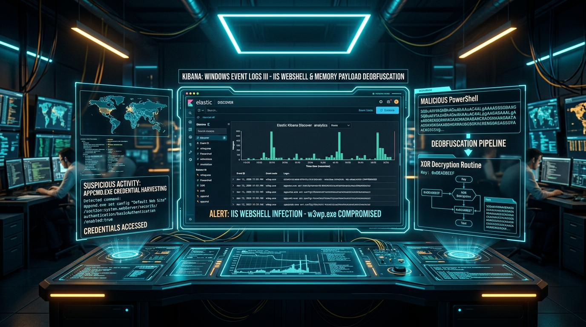
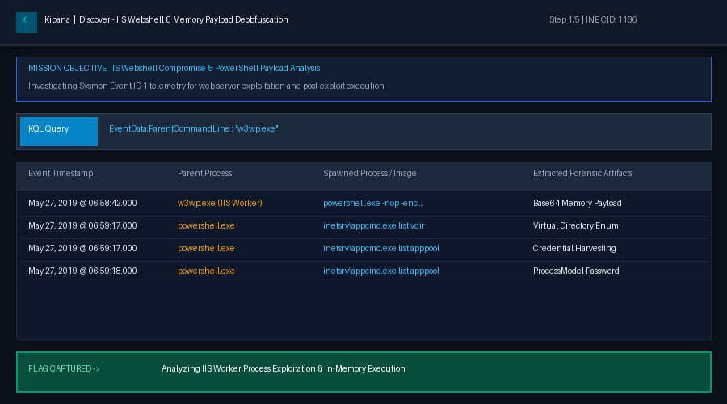
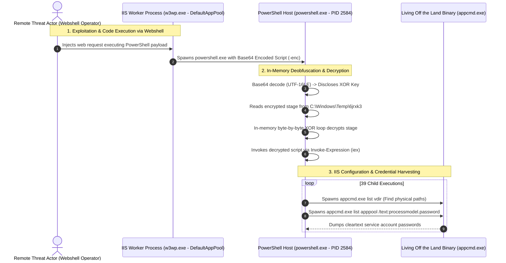
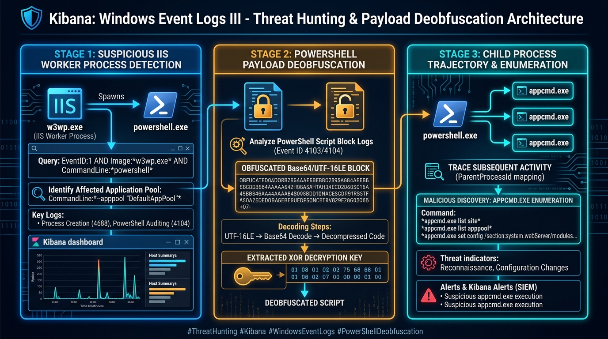
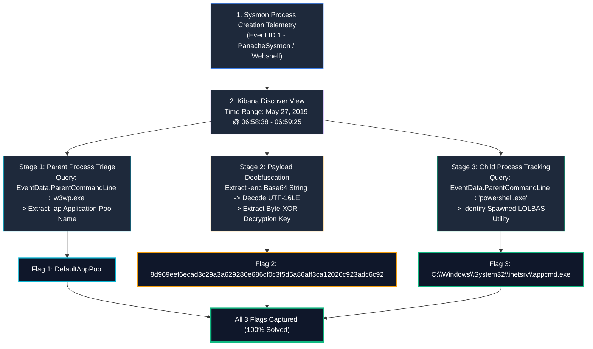
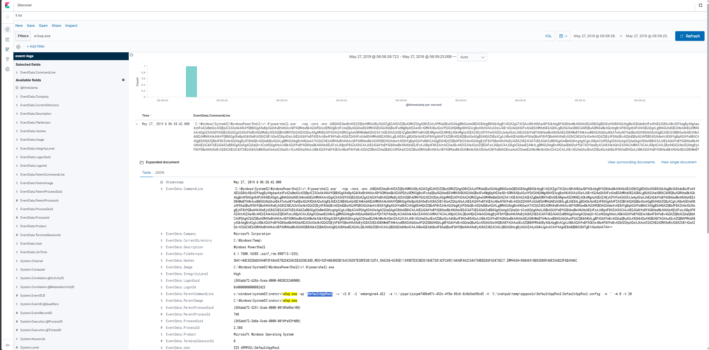

# Kibana : Windows Event Logs III — Complete Walkthrough & Threat Hunting Analysis

> **Platform:** [INE Security (Cybersecurity Hands-on Labs)](https://my.ine.com/)
>
> **Challenge Title:** Kibana : Windows Event Logs III (CID 1186)
>
> **Category:** Log Analysis & Threat Hunting: Windows Event Logs
>
> **Telemetry Source:** [`PanacheSysmon_vs_AtomicRedTeam / EVTX-ATTACK-SAMPLES`](https://github.com/sbousseaden/EVTX-ATTACK-SAMPLES) (by Samir Bousseaden)
>
> **Status:** 3 of 3 Flags Captured (100% Solved)

---

<div align="center">



# 🔍 Kibana: Windows Event Logs III 🔍
### SOC Threat Hunting & Forensic Deobfuscation: IIS Webshell Execution, In-Memory Decryption & LOLBAS `appcmd.exe`

[](https://attackdefense.com/challengedetails?cid=1186)
[](https://www.elastic.co/)
[](https://learn.microsoft.com/en-us/sysinternals/downloads/sysmon)
[](https://attack.mitre.org/)

</div>

---

### 💻 Real-Time Investigation Demonstration

The animated demonstration below showcases the entire forensic analysis workflow—isolating the compromised IIS worker process (`w3wp.exe`), decoding the Base64/UTF-16LE PowerShell script block to extract the XOR decryption key, and tracking malicious child process spawning of `appcmd.exe`:



---

# Executive Summary

In enterprise environments, web servers running Microsoft Internet Information Services (IIS) are primary entry points for threat actors. Following the exploitation of a web application vulnerability or file upload flaw, adversaries commonly drop a **webshell** to gain remote interactive execution.

Because modern endpoint defenses flag suspicious command execution, attackers frequently execute commands directly under the IIS worker process (`w3wp.exe`), leverage obfuscated PowerShell scripts running in-memory with XOR encryption, and abuse legitimate administrative utilities like **`appcmd.exe`** (Living Off the Land Binaries / LOLBAS) to dump credentials and virtual directory structures.

In this hands-on lab, we analyze Windows Sysmon Event ID 1 (Process Creation) logs ingested into **Elasticsearch & Kibana (ELK)** to trace an IIS web server compromise, decode an obfuscated payload, and identify post-exploitation reconnaissance.

---

# Attack Anatomy & Timeline

Understanding the attacker lifecycle in this incident:



---

# 5-Stage Threat Hunting Architecture





---

# 🚩 Flag Capture Summary Matrix

| # | Investigation Objective | MITRE ATT&CK Technique | Kibana Filter / Analysis Method | Captured Flag / Answer |
| :---: | :--- | :--- | :--- | :--- |
| **Q1** | Name of Application Pool associated with worker process `w3wp.exe` | **T1505.003** (Webshell) | Filter `EventData.ParentCommandLine : "w3wp.exe"` & check `-ap` flag | **`DefaultAppPool`** |
| **Q2** | Decryption key used for decoding the Base64/XOR payload | **T1027** (Obfuscated Files/Info) | Base64 decode `-enc` payload with UTF-16LE charset & extract `$key` | **`8d969eef6ecad3c29a3a629280e686cf0c3f5d5a86aff3ca12020c923adc6c92`** |
| **Q3** | Image name associated with processes spawned by the malicious payload | **T1003** / **T1082** (LOLBAS) | Filter `EventData.ParentCommandLine : "powershell.exe"` & read `EventData.Image` | **`C:\Windows\System32\inetsrv\appcmd.exe`** |

---

# Detailed Step-by-Step Walkthrough

## Setup & Time-Window Configuration
1. Open the Kibana dashboard and navigate to the **Discover** tab.
2. Select index pattern: **`event-logs`**.
3. Set the global time range filter:
   - **Start Time:** `May 27, 2019 @ 06:58:38.723`
   - **End Time:** `May 27, 2019 @ 06:59:25.068`
4. Add the following fields to your **Selected fields** panel:
   - `EventData.Image`
   - `EventData.CommandLine`
   - `EventData.ParentImage`
   - `EventData.ParentCommandLine`
   - `EventData.User`

---

## 🚩 Question 1: IIS Worker Application Pool Identification

### Objective
> *A base64 encoded malicious payload was executed on the server. What was the name of the application pool associated with the worker process which executed the payload, provided that the worker process was manually spawned using the 'w3wp.exe'?*

### Threat Hunting Analysis
When a web shell executes code, the parent process is the IIS worker process `w3wp.exe`.

1. In the Kibana search bar, filter for events where the parent command-line contains `w3wp.exe`:

```text
EventData.ParentCommandLine : "w3wp.exe"
```

2. Exactly **1 hit** is returned at `May 27, 2019 @ 06:58:42.000`:
   - **`EventData.Image`**: `C:\Windows\System32\WindowsPowerShell\v1.0\powershell.exe`
   - **`EventData.ParentImage`**: `C:\Windows\System32\inetsrv\w3wp.exe`
3. Expanding the document reveals the exact command line of the parent worker process:

```text
c:\windows\system32\inetsrv\w3wp.exe -ap "DefaultAppPool" -v 'v2.0' -l 'webengine4.dll' -a \\.\pipe\iisipm7486e07c-453c-4f8e-85c6-8c8e3be98cd5 -h 'C:\inetpub\temp\apppools\DefaultAppPool\DefaultAppPool.config' -w '' -m 0 -t 20
```

4. The **`-ap`** parameter specifies the IIS Application Pool name: **`DefaultAppPool`**.

### Answer / Flag
```text
DefaultAppPool
```

### Verified Evidence Screenshot


> [!NOTE]
> **Forensic Context (MITRE T1505.003):** Under normal operations, `w3wp.exe` processes HTTP/HTTPS requests. An IIS worker process spawning `cmd.exe` or `powershell.exe` is a high-confidence indicator of a webshell compromise or remote code execution (RCE).

---

## 🚩 Question 2: Base64 Decoding & XOR Decryption Key Extraction

### Objective
> *Decode the base64 encoded payload and provide the key used for further decrypting the payload before it gets executed on the server.*

### Threat Hunting Analysis

1. From the single hit identified in Question 1, examine `EventData.CommandLine`:

```cmd
'C:\Windows\System32\WindowsPowerShell\v1.0\powershell.exe' -nop -noni -enc JABQAHIAbwBnAHIAZQBzAHMAUAByAGUAZgBlAHIAZQBuAGMAZQA...[TRUNCATED]...
```

* **`-nop`** (`-NoProfile`): Prevents loading user PowerShell profiles.
* **`-noni`** (`-NonInteractive`): Suppresses interactive prompts.
* **`-enc`** (`-EncodedCommand`): Accepts a Base64-encoded UTF-16LE (Unicode) script block.

2. Copy the entire Base64 payload string.
3. Open a deobfuscation tool like **CyberChef** or `https://www.base64decode.org/`:
   - Set source character set to **UTF-16LE** (or use CyberChef recipe: `From Base64` -> `Decode text: UTF-16LE`).
4. The decoded PowerShell script reveals an in-memory staging and decryption routine:

```powershell
$ProgressPreference = "SilentlyContinue";
$path_in_module="C:\Windows\Temp\6jrxk3\gfg9i";
$path_in_app_code="C:\Windows\Temp\6jrxk3\nja9t64rrlu8";
$key=[System.Text.Encoding]::UTF8.GetBytes('8d969eef6ecad3c29a3a629280e686cf0c3f5d5a86aff3ca12020c923adc6c92');
$enc_module=[System.IO.File]::ReadAllBytes($path_in_module);
$enc_app_code=[System.IO.File]::ReadAllBytes($path_in_app_code);
$dec_module=New-Object Byte[] $enc_module.Length;
$dec_app_code=New-Object Byte[] $enc_app_code.Length;
for ($i = 0; $i -lt $enc_module.Length; $i++) {
    $dec_module[$i] = $enc_module[$i] -bxor $key[$i % $key.Length]
};
for ($i = 0; $i -lt $enc_app_code.Length; $i++) {
    $dec_app_code[$i] = $enc_app_code[$i] -bxor $key[$i % $key.Length]
};
$dec_module=[System.Text.Encoding]::UTF8.GetString($dec_module);
$dec_app_code=[System.Text.Encoding]::UTF8.GetString($dec_app_code);
$($dec_module+$dec_app_code)|iex;
Remove-Item -Path $path_in_app_code -Force 2>&1 | Out-Null;
```

### Forensic Dissection of the Script:
1. **Suppression:** Sets `$ProgressPreference = "SilentlyContinue"` to conceal output.
2. **Staged Files:** Loads two encrypted payload files from `C:\Windows\Temp\6jrxk3\`:
   - `gfg9i` (module payload)
   - `nja9t64rrlu8` (application code)
3. **Decryption Key:** Converts the ASCII key string into raw bytes:
   ```text
   8d969eef6ecad3c29a3a629280e686cf0c3f5d5a86aff3ca12020c923adc6c92
   ```
4. **XOR Loop:** Executes bitwise XOR (`-bxor`) byte-by-byte using `$key[$i % $key.Length]`.
5. **Execution:** Pipes the decrypted script directly into memory via `iex` (`Invoke-Expression`).
6. **Anti-Forensics:** Deletes the temporary staged file with `Remove-Item -Force`.

### Answer / Flag
```text
8d969eef6ecad3c29a3a629280e686cf0c3f5d5a86aff3ca12020c923adc6c92
```

---

## 🚩 Question 3: Image Name Associated with Processes Spawned by Payload

### Objective
> *What was the image name associated with the processes spawned by the payload?*

### Threat Hunting Analysis

1. In Question 2, we confirmed that the payload was executed by `powershell.exe`.
2. To find the processes spawned by this malicious PowerShell script, query for events where the parent process command line is `powershell.exe`:

```text
EventData.ParentCommandLine : "powershell.exe"
```

3. Kibana returns **39 hits** starting at `May 27, 2019 @ 06:59:17.000`.
4. Inspecting the command lines of these 39 events:
   - `'C:\Windows\System32\inetsrv\appcmd.exe'  list vdir /text:physicalpath`
   - `'C:\Windows\System32\inetsrv\appcmd.exe'  list apppools /text:name`
   - `'C:\Windows\System32\inetsrv\appcmd.exe'  list apppool 'ERROR...' /text:processmodel.username`
   - `'C:\Windows\System32\inetsrv\appcmd.exe'  list apppool 'ERROR...' /text:processmodel.password`
5. Inspecting the field **`EventData.Image`** across these records confirms:

```text
C:\Windows\System32\inetsrv\appcmd.exe
```

### Forensic Dissection of `appcmd.exe` Abuse:
* **What is `appcmd.exe`?** It is Microsoft’s built-in command-line administration tool for managing IIS 7+ web servers.
* **Why did the attacker run it?**
  1. **Virtual Directory Enumeration:** `list vdir /text:physicalpath` maps out the website document roots and web application structure.
  2. **Credential Harvesting:** `list apppool /text:processmodel.password` extracts cleartext passwords stored in IIS configuration files (`applicationHost.config`) for service accounts running worker processes.

### Answer / Flag
```text
C:\Windows\System32\inetsrv\appcmd.exe
```

---

# 🛡️ Detection Engineering & Defensive Playbook

### 1. Sigma Detection Rule: IIS Worker Spawning Shells
```yaml
title: IIS Worker Process Spawning Shell / Script Host
id: 82747192-3bc1-447a-8d76-59124409bb61
status: production
description: Detects the IIS worker process (w3wp.exe) spawning cmd.exe, powershell.exe, or other scripting engines, indicative of webshell execution.
logsource:
    category: process_creation
    product: windows
detection:
    selection:
        ParentImage|endswith: '\w3wp.exe'
        Image|endswith:
            - '\cmd.exe'
            - '\powershell.exe'
            - '\pwsh.exe'
            - '\wscript.exe'
            - '\cscript.exe'
    condition: selection
level: critical
tags:
    - attack.persistence
    - attack.defense_evasion
    - attack.t1505.003
```

### 2. Sigma Detection Rule: Suspicious `appcmd.exe` Execution
```yaml
title: Suspicious IIS Configuration or Credential Dumping via AppCmd
id: e4617da9-911b-4171-8bc4-1629c488109a
status: experimental
description: Detects execution of appcmd.exe attempting to dump IIS application pools, virtual directories, or processmodel passwords.
logsource:
    category: process_creation
    product: windows
detection:
    selection:
        Image|endswith: '\inetsrv\appcmd.exe'
        CommandLine|contains:
            - 'processmodel.password'
            - 'processmodel.username'
            - 'list apppool'
            - 'list vdir'
    condition: selection
level: high
tags:
    - attack.credential_access
    - attack.t1003
    - attack.discovery
```

### 3. Hardening & Prevention Best Practices
* **Disable Child Process Spawning from IIS:** Use Windows Defender Exploit Guard (Attack Surface Reduction / ASR) rules to block child processes spawned by Office and server applications.
* **Encrypt IIS Configuration Credentials:** Never store plain passwords in application pools; leverage Managed Service Accounts (gMSAs) or encrypted configuration sections (`aspnet_regiis -pe`).
* **Deploy Web Application Firewall (WAF):** Block webshell uploads and path traversal requests at the perimeter before they hit the IIS application.

---

# 📚 References
* [AttackDefense Challenge Details (CID 1186)](https://attackdefense.com/challengedetails?cid=1186)
* [Samir Bousseaden EVTX-ATTACK-SAMPLES Repository](https://github.com/sbousseaden/EVTX-ATTACK-SAMPLES)
* [MITRE ATT&CK T1505.003: Server Software Component - Web Shell](https://attack.mitre.org/techniques/T1505/003/)
* [MITRE ATT&CK T1059.001: PowerShell](https://attack.mitre.org/techniques/T1059/001/)
* [Microsoft Learn: AppCmd.exe Command Reference](https://learn.microsoft.com/en-us/iis/get-started/getting-started-with-iis/getting-started-with-appcmdexe)
