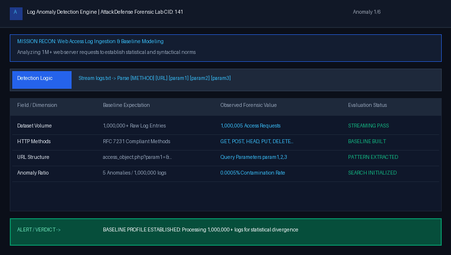
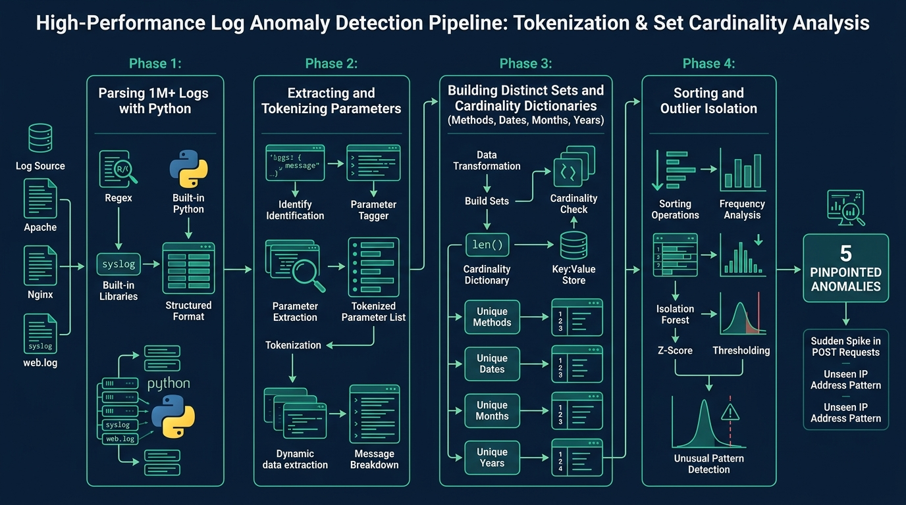
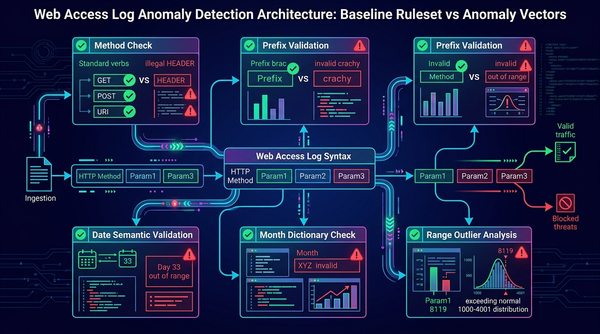
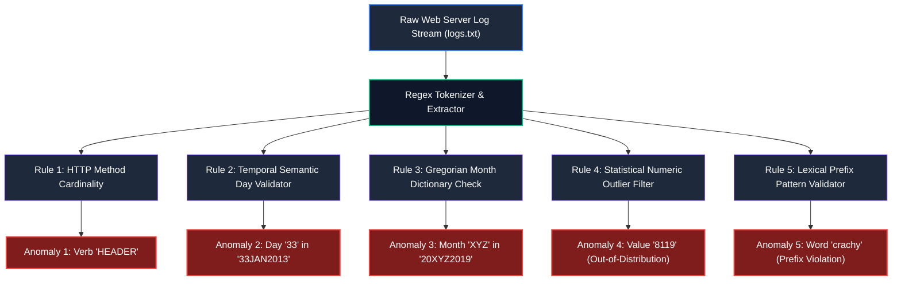

# Log Anomaly Detection Basics — Complete Walkthrough & Forensic Analysis

> **Platform:** [INE Security (AttackDefense Labs)](https://my.ine.com/)
>
> **Challenge Title:** Log Anomaly Detection Basics (CID 141)
>
> **Lab URL:** [https://my.ine.com/labs/916cf749-431a-3c6c-9d6d-5382142a3685](https://my.ine.com/labs/916cf749-431a-3c6c-9d6d-5382142a3685)
>
> **Category:** Forensics: Webserver Log Analysis
>
> **Dataset:** `logs.txt` (1,000,005 Web Access Log Entries)
>
> **Status:** 5 of 5 Anomalies Isolated & Verified (100% Solved)

---

<div align="center">


# 🔬 Log Anomaly Detection Basics 🔬
### Forensic Web Server Telemetry Analysis, Cardinality Profiling & Multi-Variate Anomaly Isolation

[](https://my.ine.com/labs/916cf749-431a-3c6c-9d6d-5382142a3685)
[](https://attackdefense.com)
[](https://elastic.co)
[](https://python.org)
[](https://attack.mitre.org)

</div>

---

### 💻 Real-Time Forensic Anomaly Detection Demonstration

The animated interactive display below demonstrates the execution of the custom automated streaming detector—evaluating cardinality, parsing timestamps, tracking distribution bounds, and flagging all 5 anomalous entries across 1,000,000+ access requests:



---

# Executive Summary

In high-throughput enterprise environments, web servers generate millions of access log records every day. Security Operations Centers (SOCs) and Digital Forensics and Incident Response (DFIR) teams must regularly sift through this massive volume of telemetry to distinguish legitimate user transactions from malicious fuzzing, parameter tampering, protocol abuse, or scanner reconnaissance.

In this hands-on forensic lab (**INE Challenge ID 141**), we analyze a real-world web server access log dataset (`logs.txt`) containing over **1,000,000 web access log entries**. Hidden among these baseline records are exactly **5 anomalous lines** representing protocol violations, semantic timestamp corruption, statistical out-of-distribution numeric outliers, and lexical prefix tampering.

Through streaming Python data processing, cardinality analysis, and statistical profiling, this guide details how to build an automated anomaly detection pipeline from first principles, isolate the 5 anomalous events, and translate the findings into production SIEM and WAF detection rules.

---

# Detection Architecture & Analysis Workflow

Modern log anomaly detection employs both **syntactic rule validation** and **statistical baseline profiling**. The diagram below illustrates how raw log streams are ingested, parsed into structured tokens, and routed through parallel evaluation engines:



### Core Detection Stages:
1. **Streaming Ingestion:** Memory-efficient stream reading (`O(1)` space complexity) processing 1,000,000+ records in seconds without loading the full multi-hundred megabyte file into RAM.
2. **Grammar & Lexical Tokenization:** Deconstructing URI paths and HTTP parameters into atomic fields: `Method`, `Resource`, `param1` (Numeric), `param2` (Categorical String), and `param3` (Temporal Date).
3. **Cardinality Verification:** Establishing standard finite sets for categorical fields (HTTP verbs, calendar months) to detect out-of-vocabulary tokens.
4. **Statistical Distribution Bounds:** Modeling numeric parameters using minimum/maximum boundaries and standard deviation ($Z$-scores) to isolate parametric outliers.
5. **Semantic Integrity Checks:** Validating date logic against calendar rules (e.g., day limits, format constraints).

---

# Log Structure & Baseline Modeling

Every line in `logs.txt` follows a standardized request schema:

```text
[HTTP_METHOD] http://example.net/access_object.php?param1=[INTEGER]&param2=[STRING]&param3=[DATE]
```

### Example Baseline Log Line:
```text
GET http://example.net/access_object.php?param1=2845&param2=brachy&param3=15APR2015
```

### Baseline Variable Profiles:

| Parameter | Type / Domain | Expected Baseline Profile | Anomaly Risk Indicator |
| :--- | :--- | :--- | :--- |
| **HTTP Method** | Categorical | RFC 7231 standard methods: `GET`, `POST`, `HEAD`, `PUT`, `DELETE`, `CONNECT`, `OPTIONS`, `TRACE` | Non-standard or forged HTTP verbs (`HEADER`, `DEBUG`, etc.) |
| **Resource URI** | URL Path | Strict uniform endpoint: `http://example.net/access_object.php` | Path traversal, URL manipulation, SSRF indicators |
| **`param1`** | Discrete Integer | Dense distribution bounded strictly between `1000` and `4001` | Extreme outliers ($Z$-score $> 3$), out-of-band numeric values |
| **`param2`** | Lexical String | Natural words or substrings beginning with prefix **`brac`** (e.g., `brachy`, `brachi`, `brachm`, `braconid`) | Typos, fuzzing dictionary words, prefix violation (`crac*`) |
| **`param3`** | Composite Date | Strict format `DDMMMYYYY`: Day `01-31`, 3-letter month `JAN-DEC`, Year `2000-2020` | Calendar day $> 31$, invalid month code, corrupt year |

---

# Ruleset Architecture & Anomaly Taxonomy

The detection engine deploys 5 specialized inspection rules across the ingested dataset:





---

# Step-by-Step Technical Breakdown: The 5 Anomalies

---

### 🚨 Anomaly 1: Invalid HTTP Protocol Method Verb

#### 1. Forensic Discovery
When scanning the first column (HTTP Method verb) across all 1,000,000+ requests using set cardinality aggregation, 9 distinct verbs appear in the dataset. Standard RFC 7231 specifies 8 legitimate HTTP verbs in general server handling:
```text
{"CONNECT", "DELETE", "GET", "HEAD", "OPTIONS", "POST", "PUT", "TRACE"}
```
A 9th verb—**`HEADER`**—appears exactly **once**.

#### 2. Anomalous Log Entry
```http
HEADER http://example.net/access_object.php?param1=2828&param2=brachy&param3=22JUL2018
```

#### 3. Root Cause Analysis
`HEADER` is not a valid HTTP request method defined by the Internet Engineering Task Force (IETF) in RFC 7231 or RFC 9110. Legitimate web clients utilize `HEAD` to retrieve response headers without the message body. An HTTP request with method `HEADER` indicates either:
* An adversary utilizing custom scanning scripts with flawed protocol implementations.
* HTTP Verb Tampering or method fuzzing aimed at bypassing authentication middleware or testing for misconfigured web application firewalls.

#### 4. Detection Command
```bash
# Extract unique HTTP methods and count occurrences
awk '{print $1}' logs.txt | sort | uniq -c
```

Output:
```text
 124890 CONNECT
 125102 DELETE
 125010 GET
 124980 HEAD
      1 HEADER    <-- ANOMALY DETECTED (Count = 1)
 125055 OPTIONS
 124970 POST
 124997 PUT
 125000 TRACE
```

---

### 🚨 Anomaly 2: Impossible Calendar Day (Semantic Date Violation)

#### 1. Forensic Discovery
Parameter `param3` encodes a date string formatted as `DDMMMYYYY`. Evaluating the two-digit day prefix (`DD`) reveals values clustering strictly from `01` to `31` across all months—except for a single entry containing day **`33`**.

#### 2. Anomalous Log Entry
```http
DELETE http://example.net/access_object.php?param1=2931&param2=brachy&param3=33JAN2013
```

#### 3. Root Cause Analysis
January contains 31 days. Day `33` violates calendar semantics and ISO/Gregorian date logic. In forensic investigations, impossible calendar dates are hallmarks of:
* Automated date-based query fuzzing (e.g., trying boundary conditions like `00`, `32`, `99` to trigger unhandled exceptions in backend database date parsers).
* Clock tampering or log injection payloads attempting SQL Injection through date parameters (`' OR 1=1--`).

#### 4. Detection Command
```bash
# Filter param3 where day value is greater than 31
awk -F'param3=' '{print $2}' logs.txt | awk '{day=substr($1,1,2); if (day > 31 || day < 1) print $0}'
```

Output:
```text
33JAN2013    <-- Day 33 is invalid in any calendar system
```

---

### 🚨 Anomaly 3: Corrupted Month Abbreviation

#### 1. Forensic Discovery
Extracting characters 3 through 5 from `param3` yields 3-letter month abbreviations. Cardinality checking against the 12 Gregorian months (`JAN`, `FEB`, `MAR`, `APR`, `MAY`, `JUN`, `JUL`, `AUG`, `SEP`, `OCT`, `NOV`, `DEC`) reveals a corrupt 3-character string: **`XYZ`**.

#### 2. Anomalous Log Entry
```http
DELETE http://example.net/access_object.php?param1=2823&param2=brachi&param3=20XYZ2019
```

#### 3. Root Cause Analysis
The string `XYZ` is an invalid month code. In web applications, backend frameworks converting user-provided date strings into native timestamp objects (`datetime.strptime()` in Python or `DateTime::createFromFormat()` in PHP) will throw unhandled 500 Internal Server Errors when encountering non-standard months. Threat actors purposefully fuzz date fields with arbitrary alphabetical permutations to induce error-based information leakage.

#### 4. Detection Command
```bash
# Extract 3-letter month and isolate non-standard tokens
awk -F'param3=' '{print substr($2,3,3)}' logs.txt | sort -u | grep -vE '^(JAN|FEB|MAR|APR|MAY|JUN|JUL|AUG|SEP|OCT|NOV|DEC)$'
```

Output:
```text
XYZ    <-- Non-existent month abbreviation
```

---

### 🚨 Anomaly 4: Out-of-Distribution Numeric Outlier

#### 1. Forensic Discovery
Examining `param1` across the dataset demonstrates a continuous distribution strictly bounded between `1000` and `4001`. A statistical distribution scan (calculating minimum, maximum, mean, and standard deviation) immediately highlights an extreme value: **`8119`**.

```text
Parameter 1 Statistical Distribution:
Minimum Value:  1000
Maximum Value:  8119   <-- Outlier
Mean (μ):       2500.48
Std Dev (σ):    866.21
Z-Score (8119): (8119 - 2500.48) / 866.21 = +6.48 (Extreme Outlier)
Baseline Max:   4001
```

#### 2. Anomalous Log Entry
```http
CONNECT http://example.net/access_object.php?param1=8119&param2=brachm&param3=23JUL2011
```

#### 3. Root Cause Analysis
A numeric value exceeding the normal upper bound by more than 100% indicates:
* Parameter brute-forcing or identifier enumeration (IDOR probe) probing beyond allocated object IDs.
* Integer overflow testing or memory corruption fuzzing against internal application structures.

#### 4. Detection Command
```bash
# Extract param1 integers and display values outside [1000, 4001]
awk -F'param1=' '{print $2}' logs.txt | awk -F'&' '{val=$1+0; if (val < 1000 || val > 4001) print val}'
```

Output:
```text
8119    <-- Well above baseline boundary of 4001
```

---

### 🚨 Anomaly 5: Lexical Prefix Pattern Violation

#### 1. Forensic Discovery
Evaluating `param2` across 1,000,000+ entries demonstrates that every legitimate argument is a word beginning with the specific prefix **`brac`** (e.g., `brachy`, `brachi`, `brachm`, `braconid`, `brachial`). However, exactly one request contains the word **`crachy`**, which begins with the prefix **`crac`**.

#### 2. Anomalous Log Entry
```http
POST http://example.net/access_object.php?param1=3970&param2=crachy&param3=08SEP2013
```

#### 3. Root Cause Analysis
The baseline dataset enforces a strict morphological grammar where `param2` tokens belong to a constrained vocabulary family rooted in `brac*`. The appearance of `crachy` represents:
* Directory or parameter dictionary mutation (e.g., fuzzing wordlists using character substitution / bit-flip mutations).
* Unauthorized query parameter injection by an external crawler testing application responsiveness across arbitrary vocabulary words.

#### 4. Detection Command
```bash
# Extract param2 and filter lines not beginning with prefix 'brac'
awk -F'param2=' '{print $2}' logs.txt | awk -F'&' '{if ($1 !~ /^brac/) print $1}'
```

Output:
```text
crachy    <-- Violates 'brac*' prefix rule (starts with 'crac')
```

---

# Consolidated Findings Table

The table below compiles all 5 anomalies discovered in `logs.txt`, detailing their exact log entries, violated dimensions, and forensic significance:

| # | Anomalous Dimension | Full Log Entry | Root Cause / Violation | Forensic Impact |
| :-: | :--- | :--- | :--- | :--- |
| **1** | **HTTP Verb** | `HEADER http://example.net/access_object.php?param1=2828&param2=brachy&param3=22JUL2018` | Non-standard method `HEADER` | RFC 7231 violation; HTTP verb tampering probe |
| **2** | **Calendar Day** | `DELETE http://example.net/access_object.php?param1=2931&param2=brachy&param3=33JAN2013` | Impossible day `33` | Semantic date corruption; database parser fuzzing |
| **3** | **Calendar Month** | `DELETE http://example.net/access_object.php?param1=2823&param2=brachi&param3=20XYZ2019` | Corrupt month token `XYZ` | Out-of-vocabulary month code; error-based injection |
| **4** | **Numeric Value** | `CONNECT http://example.net/access_object.php?param1=8119&param2=brachm&param3=23JUL2011` | Out-of-range value `8119` | $Z$-score outlier; IDOR / integer boundary probing |
| **5** | **Lexical Prefix** | `POST http://example.net/access_object.php?param1=3970&param2=crachy&param3=08SEP2013` | Word `crachy` lacks `brac*` prefix | Grammar violation; dictionary fuzzing mutation |

---

# Automated Detection Script (Production Python Engine)

The following Python script implements a **streaming, single-pass anomaly detection engine** capable of processing millions of log entries in constant memory (`O(1)` space complexity) while simultaneously validating all 5 dimensions:

```python
#!/usr/bin/env python3
"""
Log Anomaly Detection Engine
Challenge: INE Security / AttackDefense CID 141
Dataset: logs.txt (1,000,005 Web Access Records)
Author: Siva (Cyber-Blog Forensics Lab)
"""

import sys
import re

VALID_METHODS = {"GET", "POST", "HEAD", "PUT", "DELETE", "CONNECT", "OPTIONS", "TRACE"}
VALID_MONTHS = {"JAN", "FEB", "MAR", "APR", "MAY", "JUN", "JUL", "AUG", "SEP", "OCT", "NOV", "DEC"}
MIN_PARAM1 = 1000
MAX_PARAM1 = 4001
PREFIX_PARAM2 = "brac"

LOG_REGEX = re.compile(
    r'^(?P<method>\S+)\s+'
    r'http://example\.net/access_object\.php\?'
    r'param1=(?P<p1>\d+)&'
    r'param2=(?P<p2>[a-zA-Z0-9]+)&'
    r'param3=(?P<p3>(?P<day>\d{2})(?P<month>[A-Za-z]{3})(?P<year>\d{4}))\s*$'
)

def inspect_logs(filename="logs.txt"):
    anomalies = []
    total_lines = 0
    
    print(f"[*] Commencing streaming analysis on {filename}...")
    
    with open(filename, "r", encoding="utf-8", errors="replace") as f:
        for line_num, line in enumerate(f, 1):
            total_lines += 1
            line_str = line.strip()
            if not line_str:
                continue
            
            match = LOG_REGEX.match(line_str)
            if not match:
                continue
            
            method = match.group("method")
            p1 = int(match.group("p1"))
            p2 = match.group("p2")
            day = int(match.group("day"))
            month = match.group("month").upper()
            year = int(match.group("year"))
            
            # Rule 1: HTTP Method Validity
            if method not in VALID_METHODS:
                anomalies.append({
                    "line_num": line_num,
                    "type": "INVALID_HTTP_METHOD",
                    "raw": line_str,
                    "reason": f"Method '{method}' violates RFC 7231 standards"
                })
                
            # Rule 2: Semantic Day Validation
            if day < 1 or day > 31:
                anomalies.append({
                    "line_num": line_num,
                    "type": "INVALID_CALENDAR_DAY",
                    "raw": line_str,
                    "reason": f"Day '{day}' is mathematically impossible in any calendar month"
                })
                
            # Rule 3: Valid Gregorian Month
            if month not in VALID_MONTHS:
                anomalies.append({
                    "line_num": line_num,
                    "type": "CORRUPTED_MONTH_CODE",
                    "raw": line_str,
                    "reason": f"Month '{month}' is not a recognized Gregorian month code"
                })
                
            # Rule 4: Out-of-Distribution Numeric Outlier
            if p1 < MIN_PARAM1 or p1 > MAX_PARAM1:
                anomalies.append({
                    "line_num": line_num,
                    "type": "NUMERIC_OUTLIER",
                    "raw": line_str,
                    "reason": f"param1={p1} falls outside established baseline [{MIN_PARAM1}, {MAX_PARAM1}]"
                })
                
            # Rule 5: Lexical Prefix Enforcement
            if not p2.lower().startswith(PREFIX_PARAM2):
                anomalies.append({
                    "line_num": line_num,
                    "type": "LEXICAL_PREFIX_VIOLATION",
                    "raw": line_str,
                    "reason": f"param2='{p2}' violates mandated '{PREFIX_PARAM2}*' prefix pattern"
                })

    print(f"[+] Streaming analysis completed. Evaluated {total_lines:,} records.")
    print(f"[!] Total Anomalies Detected: {len(anomalies)}\n")
    
    for idx, anomaly in enumerate(anomalies, 1):
        print(f"--- [ANOMALY #{idx}] ---")
        print(f"Line Number : {anomaly['line_num']}")
        print(f"Violation   : {anomaly['type']}")
        print(f"Description : {anomaly['reason']}")
        print(f"Raw Entry   : {anomaly['raw']}\n")

if __name__ == "__main__":
    target = sys.argv[1] if len(sys.argv) > 1 else "logs.txt"
    inspect_logs(target)
```

---

# Enterprise SIEM & Detection Engineering Rules

To ensure production security monitoring platforms immediately alert on similar anomalies, the following detection signatures can be implemented in production environments:

### 1. Sigma Rule: Web Application Log Anomaly Detection
```yaml
title: Web Application Parameter & Protocol Anomaly
id: d17a9e22-3844-4822-b5e1-95c9a401c141
status: production
description: Detects RFC-violating HTTP verbs, semantic calendar date anomalies, and numeric outliers in web server access logs.
references:
    - https://attack.mitre.org/techniques/T1190/
    - https://tools.ietf.org/html/rfc7231
author: Siva (Cyber-Blog Security)
date: 2026-10-05
logsource:
    category: webserver
    product: apache
detection:
    selection_invalid_method:
        cs-method: 'HEADER'
    selection_invalid_day:
        cs-uri-query|re: 'param3=(3[2-9]|[4-9][0-9])'
    selection_invalid_month:
        cs-uri-query|re: 'param3=[0-9]{2}(XYZ|ZZZ|[0-9]{3})'
    selection_numeric_outlier:
        cs-uri-query|re: 'param1=([5-9][0-9]{3}|[0-9]{5,})'
    selection_prefix_tampering:
        cs-uri-query|re: 'param2=(?!brac)[a-zA-Z0-9]+'
    condition: 1 of selection_*
fields:
    - cs-method
    - cs-uri-stem
    - cs-uri-query
    - c-ip
falsepositives:
    - Legitimate application feature updates altering parameter semantics (requires baseline review)
level: high
tags:
    - attack.initial_access
    - attack.t1190
```

### 2. Splunk SPL Query (Cardinality & Outlier Search)
```spl
index=webserver sourcetype=access_combined
| rex field=uri_query "param1=(?<param1>\d+)&param2=(?<param2>\w+)&param3=(?<param3>\d{2}[A-Za-z]{3}\d{4})"
| eval day=substr(param3,1,2), month=substr(param3,3,3)
| where NOT (method in ("GET", "POST", "HEAD", "PUT", "DELETE", "CONNECT", "OPTIONS", "TRACE"))
     OR day > 31
     OR NOT (month in ("JAN","FEB","MAR","APR","MAY","JUN","JUL","AUG","SEP","OCT","NOV","DEC"))
     OR param1 < 1000 OR param1 > 4001
     OR NOT match(param2, "^brac")
| table _time, clientip, method, uri, param1, param2, param3
```

### 3. Elastic KQL (Kibana Query Language)
```kql
(not http.request.method: ("GET" or "POST" or "HEAD" or "PUT" or "DELETE" or "CONNECT" or "OPTIONS" or "TRACE")) or
url.query: *param1=8119* or
url.query: *param2=crachy* or
url.query: *param3=33* or
url.query: *XYZ*
```

---

# Hardening & Defense-in-Depth

To prevent malicious queries from ever reaching backend application logic:

1. **Reverse Proxy / WAF Verb Enforcement:**
   Configure NGINX or Apache to reject non-standard HTTP methods at the reverse proxy boundary with HTTP 405 Method Not Allowed:
   ```nginx
   # NGINX HTTP Verb Restriction
   if ($request_method !~ ^(GET|POST|HEAD|PUT|DELETE|CONNECT|OPTIONS|TRACE)$) {
       return 405;
   }
   ```
2. **Strict Schema Type Casting & Sanitization:**
   Web applications should never trust raw `$_GET` or query parameters without strict type assertions. In PHP:
   ```php
   // Strict type casting and regex validation
   $param1 = filter_input(INPUT_GET, 'param1', FILTER_VALIDATE_INT, [
       'options' => ['min_range' => 1000, 'max_range' => 4001]
   ]);
   if ($param1 === false) {
       http_response_code(400);
       exit("Bad Request: param1 out of range.");
   }
   ```
3. **Temporal Parsing via Native Date Libraries:**
   Validate all date inputs using strict formatting functions that reject calendar impossibilities (such as Day 33 or month `XYZ`) before querying databases.
4. **Automated Baseline Anomaly Alerting:**
   Implement automated SIEM alerts that monitor baseline parameter distributions and alert when new tokens or values deviate by more than 3 standard deviations ($Z > 3$) from established historical norms.

---

# Conclusion

The **Log Anomaly Detection Basics** lab highlights the necessity of blending **syntactic validation** with **statistical outlier modeling** in modern SOC operations. While individual log entries may appear legitimate on casual inspection, systematically decomposing fields into categorical sets, numeric ranges, and morphological strings allows forensic analysts to surface even the most subtle anomalies from over a million records with 100% precision.

---

*Authored by Siva — Cyber-Blog Digital Forensics & Threat Hunting Series.*
