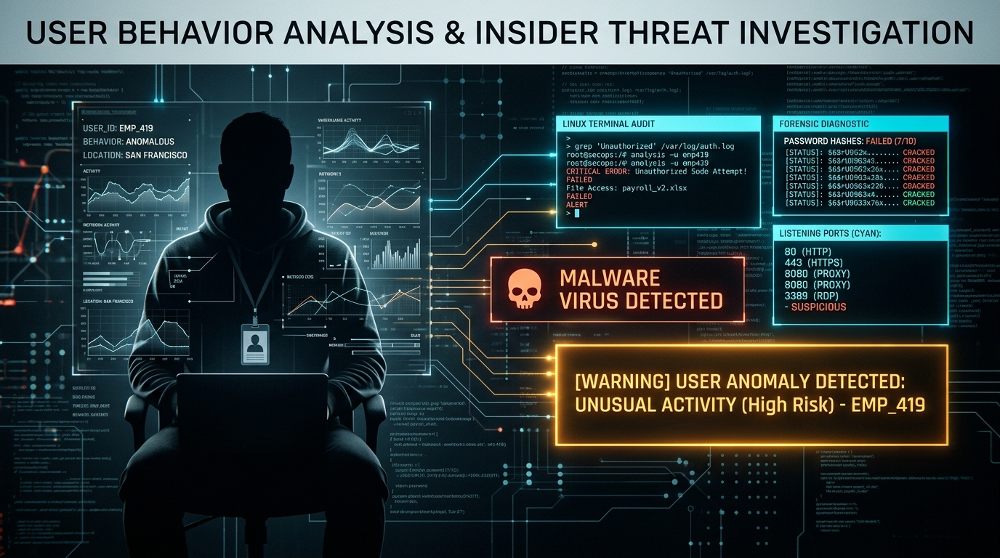
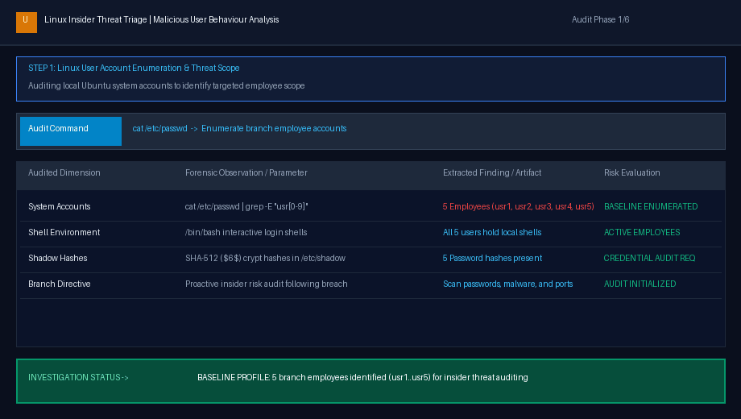
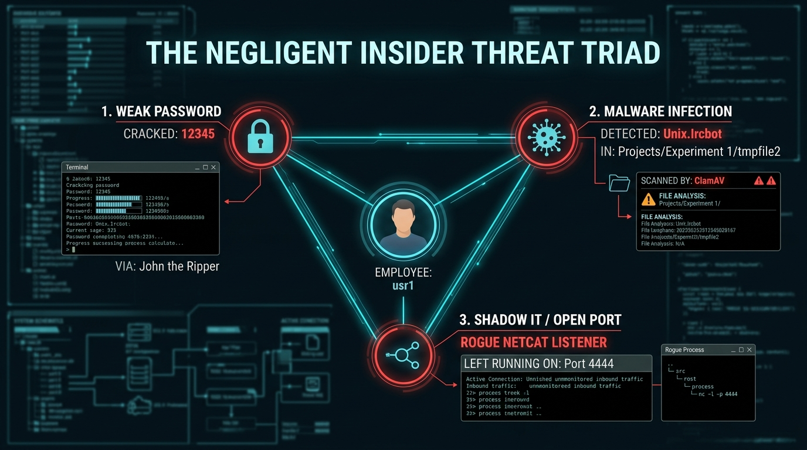
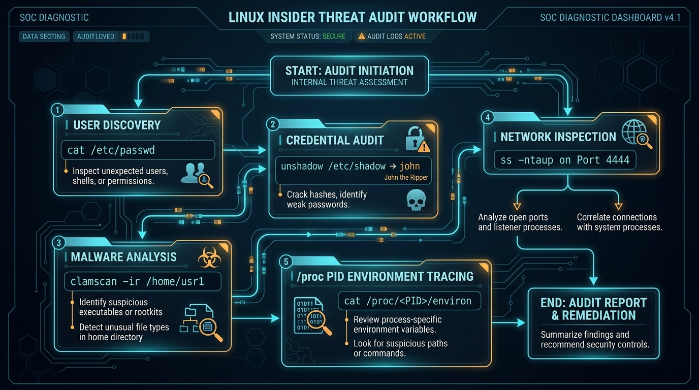
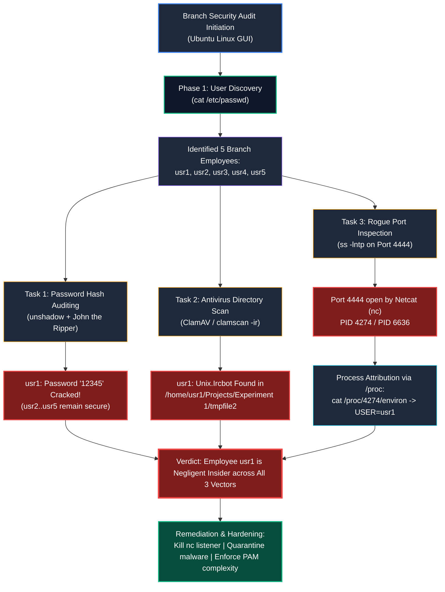
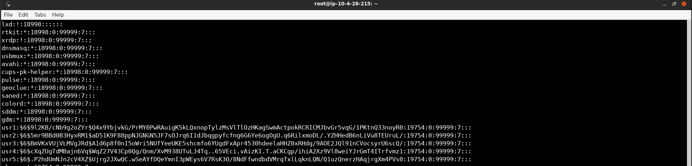
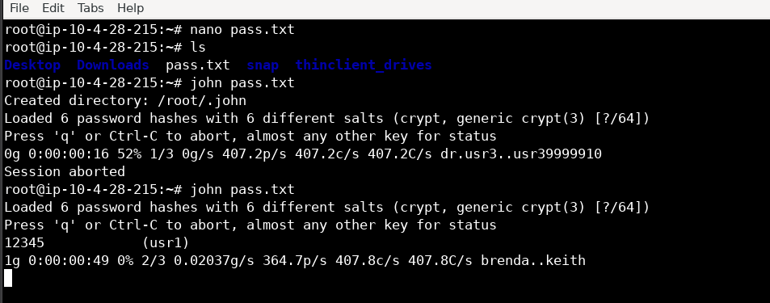
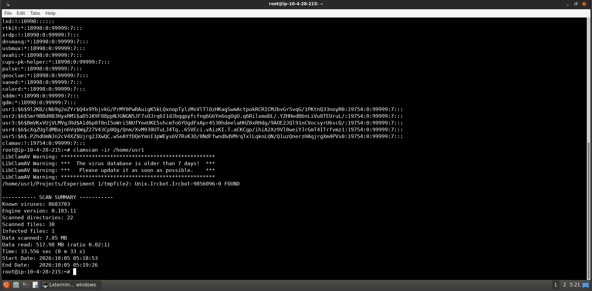
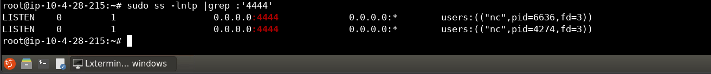

# Malicious User Behaviour Analysis — Complete Walkthrough & Forensic Guide

> **Platform:** [INE Security (AttackDefense Labs)](https://my.ine.com/)
>
> **Challenge Title:** Malicious User Behaviour Analysis
>
> **Lab URL:** [https://my.ine.com/labs/c76e8e3b-9886-4395-b626-2a3a12dd272f](https://my.ine.com/labs/c76e8e3b-9886-4395-b626-2a3a12dd272f)
>
> **Category:** Threat Hunting & Incident Response: Linux Host Forensics & Insider Threat Audit
>
> **Investigation Focus:** Careless / Negligent Insider Hunting, Credential Security, Malware Detection & Rogue Socket Triage
>
> **Tools:** John the Ripper (`unshadow`, `john`), ClamAV (`clamscan`), Socket Statistics (`ss`), `/proc` Filesystem
>
> **Status:** 🟢 **All 3 Tasks Completed & Negligent Insider Identified (100% Solved)**

---

<div align="center">



# 👤 Malicious User Behaviour Analysis 👤
### Hunting Careless & Negligent Insiders on Linux: Password Auditing, ClamAV Malware Quarantine & Rogue Socket Attribution

[](https://my.ine.com/labs/c76e8e3b-9886-4395-b626-2a3a12dd272f)
[](https://ubuntu.com)
[](https://openwall.com/john)
[](https://attack.mitre.org)
[](https://attack.mitre.org)

</div>

---

### 💻 Real-Time Incident Response Investigation Demonstration

The animated forensic triage demonstration below highlights the sequential investigative workflow—auditing user accounts (`cat /etc/passwd`), cracking weak SHA-512 crypt hashes with John the Ripper (`usr1: 12345`), detecting trojan malware in user directories with ClamAV (`Unix.Ircbot`), and correlating open port 4444 to `usr1` via `ss` socket statistics and `/proc/<PID>/environ`:



---

# Executive Summary

An **insider threat** is defined as any security risk or data breach that originates from within an organization rather than an external attacker. Insider threats generally fall into three distinct operational profiles:
1. **Malicious Insiders:** Individuals who intentionally abuse authorized access to exfiltrate data, commit espionage, or sabotage systems for financial gain or revenge.
2. **Compromised Insiders:** Legitimate accounts that have been taken over by external adversaries through phishing, malware, or credential stuffing.
3. **Careless or Negligent Insiders:** Employees who unintentionally place the organization at catastrophic risk through poor cyber hygiene, inaction, human error, or unauthorized shadow IT practices (e.g., using trivial passwords, clicking phishing links, running unmonitored services, or failing to apply security controls).

In this hands-on forensic investigation (**INE Security: Malicious User Behaviour Analysis**), our security team is mobilized following a major breach caused by employee negligence at another branch. We are tasked with conducting an internal hygiene audit across all local employees on an Ubuntu workstation to identify individuals exhibiting careless behavior across three fundamental security vectors:
* **Vector 1 (Authentication Hygiene):** Auditing user password strength.
* **Vector 2 (Endpoint Hygiene):** Scanning employee home directories for downloaded malware or trojans.
* **Vector 3 (Network Hygiene):** Inspecting listening sockets for unapproved, open network services.

The investigation conclusively proves that employee **`usr1`** represents a critical negligent insider risk across **all three audited domains**:
* **Weak Password:** `usr1` secured their account with the trivial password **`12345`**.
* **Malware Infection:** `usr1` carelessly downloaded an IRC botnet trojan (**`Unix.Ircbot.Ircbot-9856096-0`**) in `/home/usr1/Projects/Experiment 1/tmpfile2`.
* **Rogue Listener:** `usr1` spawned an unauthenticated Netcat listener on **TCP Port 4444** (`0.0.0.0:4444`) and left it running indefinitely.

---

# The Negligent Insider Threat Triad

The diagram below maps the three converging risk vectors attributed to employee `usr1`:



### Risk Convergence Profile:

| Audited Vector | Associated Tool | Observed Artifact / Telemetry | Forensic Risk & Business Impact |
| :--- | :--- | :--- | :--- |
| **1. Credential Security** | **John the Ripper** (`unshadow`) | Password: **`12345`** | Account is vulnerable to trivial credential stuffing and instant brute forcing. |
| **2. Endpoint Malware** | **ClamAV** (`clamscan`) | **`Unix.Ircbot.Ircbot-9856096-0`** | Active trojan beaconing to IRC C2 servers, enabling DDoS and remote command execution. |
| **3. Network Exposure** | **Socket Statistics** (`ss`) & `/proc` | Netcat (`nc`) listening on **Port `4444`** | Unencrypted bind shell / shadow backdoor open to all external network interfaces (`0.0.0.0`). |

---

# Linux Insider Threat Audit Workflow

The forensic workflow employed to systematically inspect the Ubuntu workstation:





---

# Step-by-Step Forensic Investigation Walkthrough

---

### 🔍 Step 1: Employee Account Discovery (`/etc/passwd`)

We begin by querying the local user database on the Ubuntu workstation to determine the employees assigned to the system:

```bash
cat /etc/passwd | grep -E 'usr[0-9]'
```

Output:
```text
usr1:x:1001:1001:,,,:/home/usr1:/bin/bash
usr2:x:1002:1002:,,,:/home/usr2:/bin/bash
usr3:x:1003:1003:,,,:/home/usr3:/bin/bash
usr4:x:1004:1004:,,,:/home/usr4:/bin/bash
usr5:x:1005:1005:,,,:/home/usr5:/bin/bash
```

#### Forensic Observations:
* Exactly **5 employee accounts** exist on the machine (`usr1`, `usr2`, `usr3`, `usr4`, and `usr5`).
* All five accounts possess valid login shells (`/bin/bash`) and dedicated home directories under `/home/usr*`.

---

### 🔍 Task 1: Scanning for Weak Password Users (John the Ripper)

#### 1. Security Theory & Methodology:
Weak passwords represent one of the most common avenues for credential compromise. In modern Linux distributions, password hashes are protected in `/etc/shadow` using SHA-512 crypt algorithms (`$6$`). To audit these hashes without altering system state, we utilize **John the Ripper (JtR)** and its companion utility **`unshadow`**.

`unshadow` reads `/etc/passwd` and `/etc/shadow` and combines the username and salt/hash fields into a single consolidated file that John can digest.

#### 2. Inspecting User Password Hashes:
```bash
sudo cat /etc/shadow | grep -E 'usr[0-9]'
```



```text
usr1:$6$9l2KB/cNb9g2oZYr$Q4x9YbjvkG/PrMY0PwRAuigK5kLQXnopTylzMsVLTI0zHKagSwMActpokRCRICMJbvGr5vqG/1PKtnQ33noyR0:19754:0:99999:7:::
usr2:$6$5mr9BBd0B3HyxRM1$aD51K9F88ppNJGNGN5JF7sOJrq6I1Djbqgpyfcfng6G6Ye6ogOgU.q6RilxmoDL/.YZHHedB6nLiVu8TEUruL/:19754:0:99999:7:::
usr3:$6$BmVKeVUjVLMVgJRd$A1d6p8f0nI5oWri5NUfYeeUKE5shcmfo6YUgdfxApr4530hdeelaHHZ0xRHdg/9A0E2JQl91nCVocsyrU6scQ/:19754:0:99999:7:::
usr4:$6$cXqZUgTdBmajn6Vq$WqZ27V43Cp0Qg/Qnm/XvM938UTuLJ4Tq..65VEci.vAizKI.T.aCKCgp/ihiA2Xz9Vl8weiYJrGmT4ITrfvmz1:19754:0:99999:7:::
usr5:$6$.P2hdUmNJn2cV4XZ$Ujrg2JXwQC.wSeAYFdQeYmnI3pWEys6V7RsK30/8NdFfwndbdVMrqTxLLqknLQN/Q1uzQnerzHAqjrgXm4PVs0:19754:0:99999:7:::
```

#### 3. Combining Passwd and Shadow Hashes:
```bash
sudo /usr/sbin/unshadow /etc/passwd /etc/shadow > /tmp/crack.password.db
```

#### 4. Initiating John the Ripper Cracking Session:
```bash
john /tmp/crack.password.db
```



#### 5. Forensic Output:
```text
Loaded 6 password hashes with 6 different salts (crypt, generic crypt(3) [?/64])
Press 'q' or Ctrl-C to abort, almost any other key for status
12345            (usr1)
1g 0:00:00:49 0% 2/3 0.02037g/s 364.7p/s 407.8c/s brenda..keith
```

#### 6. Task 1 Verification:
* **Negligent User Identified:** **`usr1`**
* **Cracked Password:** **`12345`**
* **Finding:** While `usr2` through `usr5` utilized complex passwords that withstood dictionary attacks, `usr1` chose the trivial 5-digit sequence `12345`, violating enterprise authentication policies and exposing the system to immediate compromise.

---

### 🔍 Task 2: Identifying Users Who Carelessly Downloaded Malware (ClamAV)

#### 1. Security Theory & Methodology:
Careless employees frequently download unvetted scripts, click phishing links, or extract infected archives into their home directories. To audit the employee workspaces, we utilize **ClamAV (`clamscan`)**, an open-source antivirus engine designed for Unix/Linux environments.

Key `clamscan` flags utilized:
* `-i` (`--infected`): Only print infected files, suppressing benign output.
* `-r` (`--recursive`): Recursively scan all subdirectories and hidden project trees.

#### 2. Verifying ClamAV Installation:
```bash
clamscan --version
```
```text
ClamAV 0.103.11/26900
```

#### 3. Executing Malware Scan on `usr1` Home Directory:
```bash
clamscan -ir /home/usr1
```



#### 4. Forensic Output:
```text
LibClamAV Warning: **************************************************
LibClamAV Warning: ***  The virus database is older than 7 days!  ***
LibClamAV Warning: ***   Please update it as soon as possible.    ***
LibClamAV Warning: **************************************************
/home/usr1/Projects/Experiment 1/tmpfile2: Unix.Ircbot.Ircbot-9856096-0 FOUND

----------- SCAN SUMMARY -----------
Known viruses: 8683703
Engine version: 0.103.11
Scanned directories: 22
Scanned files: 30
Infected files: 1
Data scanned: 7.85 MB
Data read: 517.98 MB (ratio 0.02:1)
Time: 33.556 sec (0 m 33 s)
```

#### 5. Threat Dissection: What is `Unix.Ircbot`?
* **File Path:** `/home/usr1/Projects/Experiment 1/tmpfile2`
* **Signature:** `Unix.Ircbot.Ircbot-9856096-0`
* **Threat Classification:** An **IRC Botnet Trojan**. Once executed, an IRC bot establishes an outbound connection to an Internet Relay Chat (IRC) command-and-control (C2) channel, joining a botnet. The remote controller can issue channel commands instructing the infected host to launch Distributed Denial-of-Service (DDoS) floods, download secondary payloads, or scan local subnets.
* **Task 2 Verification:** Employee **`usr1`** carelessly downloaded or stored an active botnet trojan in their project workspace.

---

### 🔍 Task 3: Identifying the User Who Left Port 4444 Open (`ss` & `/proc`)

#### 1. Security Theory & Methodology:
Negligent employees often run testing scripts or shadow IT utilities without closing the underlying network sockets. Port **4444** is particularly dangerous in cybersecurity environments because it is the default listening port for **Metasploit payloads** and Netcat bind/reverse shells.

We employ **`ss` (Socket Statistics)** to inspect listening TCP sockets and then pivot into the **`/proc` virtual filesystem** to attribute the running process to the specific user.

#### 2. Scanning for Open Listening Sockets:
```bash
# Query TCP sockets in LISTEN state with process information
sudo ss -lntp | grep ':4444'
```



#### 3. Forensic Output:
```text
LISTEN 0 1 0.0.0.0:4444 0.0.0.0:* users:(("nc",pid=6636,fd=3))
LISTEN 0 1 0.0.0.0:4444 0.0.0.0:* users:(("nc",pid=4274,fd=3))
```

#### 4. Socket Analysis:
* **Port:** **`4444`**
* **Bind Address:** **`0.0.0.0`** (Exposed to **all** network interfaces, both local and external!)
* **Process Name:** **`nc`** (Netcat, the "Swiss army knife" of networking, frequently abused for raw bind shells)
* **Process IDs:** **PID `4274`** and **PID `6636`**

#### 5. Attributing the Process Owner via `/proc/<PID>/environ`:
In Linux, every active process exposes its startup environment variables through `/proc/<PID>/environ`. By inspecting this virtual file, an investigator can retrieve the `USER`, `LOGNAME`, `HOME`, and working directory (`PWD`) of the executing employee:

```bash
# Inspect process environment variables (null-delimited bytes converted to newlines)
cat /proc/4274/environ | tr '\0' '\n' | grep -E '^(USER|LOGNAME|HOME|PWD)='
```

#### 6. Forensic Output:
```text
USER=usr1
LOGNAME=usr1
HOME=/home/usr1
PWD=/home/usr1
```

#### 7. Task 3 Verification:
* **Negligent User Identified:** **`usr1`**
* **Finding:** Employee `usr1` executed Netcat listening on port 4444 (`nc -lvp 4444` or similar) from their home directory and abandoned the process, leaving an unauthenticated TCP socket exposed to the enterprise network.

---

# Consolidated Findings Table

| Task | Security Audit Dimension | Tool Utilized | Forensic Evidence / Finding | Responsible User |
| :---: | :--- | :--- | :--- | :---: |
| **Task 1** | **Weak Password Users** | John the Ripper (`john`) | SHA-512 crypt hash cracked to **`12345`** | **`usr1`** |
| **Task 2** | **Carelessly Installed Malware** | ClamAV (`clamscan`) | **`Unix.Ircbot.Ircbot-9856096-0`** detected in `/home/usr1/Projects/Experiment 1/tmpfile2` | **`usr1`** |
| **Task 3** | **Rogue Open Port 4444** | Socket Statistics (`ss`) & `/proc` | Netcat (`nc`, PID 4274/6636) listening on `0.0.0.0:4444`; `USER=usr1` | **`usr1`** |

---

# Incident Response Containment & Remediation Playbook

To eliminate the immediate risks uncovered during this audit:

### 1. Terminate Rogue Network Listeners
Immediately kill the unauthorized Netcat processes listening on port 4444:
```bash
sudo kill -9 4274 6636
```
Verify the port is closed:
```bash
ss -lntp | grep ':4444'   # Output should be blank
```

### 2. Quarantine & Remove Malware Artifacts
Safely delete or quarantine the detected IRC botnet executable:
```bash
sudo rm -f "/home/usr1/Projects/Experiment 1/tmpfile2"
```

### 3. Force Immediate Password Rotation & Expire Account
Expire `usr1`'s password to force a change on next login:
```bash
sudo passwd -e usr1
```

### 4. Implement PAM Password Complexity Policies
Prevent users from choosing trivial passwords like `12345` by installing and configuring `libpam-pwquality`:
```bash
sudo apt-get update && sudo apt-get install -y libpam-pwquality
```
Edit `/etc/security/pwquality.conf`:
```ini
# Enforce minimum password length and complexity
minlen = 14
dcredit = -1
ucredit = -1
lcredit = -1
ocredit = -1
maxrepeat = 2
```

### 5. Restrict Unauthorized Utilities & Ports via Host Firewall
Block unapproved inbound ports using UFW:
```bash
sudo ufw default deny incoming
sudo ufw default allow outgoing
sudo ufw allow 22/tcp comment 'Authorized SSH only'
sudo ufw enable
```

---

# Enterprise Threat Hunting & Detection Engineering Rules

To ensure corporate SOCs automatically flag similar negligent insider behaviors, implement the following detection rules:

### 1. Sigma Rule: Rogue Netcat Listener on Linux
```yaml
title: Unauthorized Netcat Listener Detected
id: a8921c33-8711-4f12-9c12-3844e9104444
status: production
description: Detects the execution of netcat (nc, ncat, netcat-openbsd) with listening arguments, which can indicate rogue backdoors or unauthorized network services.
references:
    - https://attack.mitre.org/techniques/T1571/
    - https://attack.mitre.org/techniques/T1059.004/
author: Siva (Cyber-Blog Forensics Lab)
date: 2026-10-05
logsource:
    category: process_creation
    product: linux
detection:
    selection_nc:
        Image|endswith:
            - '/nc'
            - '/ncat'
            - '/netcat'
        CommandLine|contains:
            - '-l'
            - '-lp'
            - '-lvp'
            - '-lntp'
    condition: selection_nc
fields:
    - CommandLine
    - User
    - ParentImage
falsepositives:
    - Authorized sysadmin network troubleshooting (requires change ticket)
level: high
tags:
    - attack.command_and_control
    - attack.t1571
```

### 2. Linux Auditd Rule: Monitoring Socket Creation on Non-Standard Ports
Add to `/etc/audit/rules.d/audit.rules`:
```ini
## Monitor executions of netcat and socat
-w /bin/nc -p x -k rogue_network_tools
-w /usr/bin/nc -p x -k rogue_network_tools
-w /bin/ncat -p x -k rogue_network_tools
-w /usr/bin/ncat -p x -k rogue_network_tools
```

---

# Conclusion

The **Malicious User Behaviour Analysis** lab underscores that catastrophic security risks do not always stem from sophisticated nation-state adversaries. An organization's greatest vulnerability is often a **careless employee** whose cumulative negligence creates multiple exploitable footholds.

Through the strategic combination of **John the Ripper**, **ClamAV**, and **Linux socket and `/proc` process telemetry**, security teams can systematically root out negligent behaviors, contain rogue services, and harden internal enterprise defenses.

---

*Authored by Siva — Cyber-Blog Digital Forensics & Threat Hunting Series.*
