# 🦈 PCAP Analysis With Zeek — Complete Hands-on Lab Walkthrough

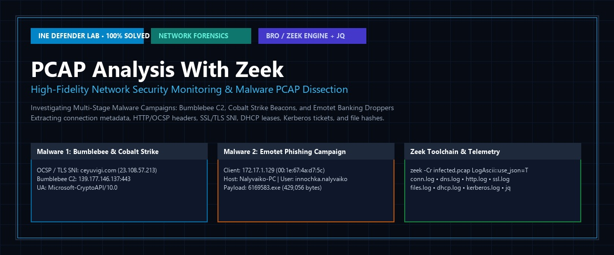

> **Lab Platform:** [INE Security](https://my.ine.com/labs/70b66b1e-b617-4f43-be6f-fb121699aa49)  
> **Course:** Network Defense & Threat Hunting  
> **Target OS:** Ubuntu (Target Sensor) & Kali Linux  
> **Core Tool:** Zeek (formerly Bro Network Security Monitor), `zeek-cut`, `jq`, `awk`  
> **Focus Datasets:** `Malware1/infected.pcap` & `Malware2/infected.pcap`  
> **Malware Threats Identified:** Bumblebee RAT, Cobalt Strike Beacon, Emotet Banking Trojan Dropper  
> **Status:** 🟢 **100% Solved — All 15 Questions Answered & Verified with Telemetry Logs**  
> **Walkthrough Video:** [`PCAP Analysis With Zeek solution.mp4`](./PCAP%20Analysis%20With%20Zeek%20solution.mp4)

---

## 📑 Table of Contents
1. [Executive Summary & Quick Answer Matrix](#-executive-summary--quick-answer-matrix)
2. [Zeek Architecture & Forensic Pipeline](#-zeek-architecture--forensic-pipeline)
3. [Live Terminal Demonstration (Animated GIF)](#-live-terminal-demonstration)
4. [Lab Environment & Architecture](#-lab-environment--architecture)
5. [Malware 1 Investigation: Bumblebee & Cobalt Strike](#-malware-1-investigation-bumblebee--cobalt-strike)
   * [Task 1: Splitting PCAP into Zeek Logs (Q1)](#q1-what-is-the-zeek-command-to-split-the-pcap-file-into-brozeek-logs)
   * [Task 2: Generating JSON Formatted Logs (Q2)](#q2-what-is-the-zeek-command-to-output-logs-in-json-format-of-the-pcap-file)
   * [Task 3: Processing http.log with jq (Q3)](#q3-what-is-the-command-to-process-httplog-file-with-jq-to-output-json-formatted-data)
   * [Task 4: Unique IP Extraction (Q4)](#q4-what-is-the-command-to-list-out-all-the-unique-ip-addresses-which-established-a-connection-to-the-host)
   * [Task 5: Extracting Response MIME Type (Q5)](#q5-what-is-the-response-mime-type-in-the-pcap)
   * [Task 6: OCSP GET Request Analysis (Q6)](#q6-what-is-the-get-request-made-to-ocspdigicertcom-to-establish-a-connection-during-the-delivery-of-malware)
   * [Task 7: User-Agent Fingerprinting (Q7)](#q7-what-is-the-user-agent-string-transmitted-by-the-application-to-web-servers)
   * [Task 8: Cobalt Strike C2 DNS & IP Attribution (Q8)](#q8-what-is-the-dns-and-ip-of-the-infected-traffic-of-the-cobalt-strike)
   * [Task 9: Bumblebee C2 IP Identification (Q9)](#q9-what-is-the-ip-of-the-infected-traffic-of-the-bumblebee-c2)
6. [Malware 2 Investigation: Emotet Phishing Campaign](#-malware-2-investigation-emotet-phishing-campaign)
   * [Task 10: Client MAC Address Extraction (Q10)](#q10-what-is-the-mac-address-of-the-windows-client-at-172171129)
   * [Task 11: Client Hostname Discovery (Q11)](#q11-what-is-the-hostname-for-the-windows-client-at-172171129)
   * [Task 12: Kerberos User Account Identification (Q12)](#q12-based-on-the-kerberos-traffic-what-is-the-windows-user-account-name-used)
   * [Task 13: Identifying Malicious Word Document URL (Q13)](#q13-what-url-in-the-pcap-returned-a-microsoft-word-document)
   * [Task 14: Executable Payload URL & Byte Size (Q14)](#q14-what-url-in-the-pcap-returned-a-windows-executable-file-and-how-many-bytes-is-the-executable-file-returned-from-that-url)
   * [Task 15: Campaign Attribution (Q15)](#q15-what-type-of-infection-occurred-in-this-pcap)
7. [Complete Step-by-Step Screenshot Archive (22 Images)](#-complete-step-by-step-screenshot-archive)
8. [Defensive Engineering & Detection Rules](#-defensive-engineering--detection-rules)
9. [Conclusion & Key Takeaways](#-conclusion--key-takeaways)

---

## 📌 Executive Summary & Quick Answer Matrix

Below is the definitive reference table compiling all 15 question answers, corresponding Zeek command-line invocations, and forensic rationale:

| # | Lab Question | Verified Flag / Answer | Command / Forensic Extraction |
|---|---|---|---|
| **Q1** | Zeek command to split PCAP into Bro/Zeek logs | `zeek -Cr ~/Desktop/Investigation/Malware1/infected.pcap` | Parses raw frames and writes protocol transaction logs into cwd. |
| **Q2** | Zeek command to output logs in JSON format | `zeek -Cr ~/Desktop/Investigation/Malware1/infected.pcap LogAscii::use_json=T` | Overrides default TSV format with JSON lines formatting. |
| **Q3** | Command to process http.log with jq | `jq . http.log` | Streams JSON lines through identity filter for pretty-printing. |
| **Q4** | Command to list unique host IPs | `cat conn.log \| zeek-cut id.resp_h \| sort \| uniq` | Extracts destination IP column and deduplicates. |
| **Q5** | Response MIME type in Malware 1 | `application/ocsp-response` | `cat http.log \| zeek-cut resp_mime_types \| sort \| uniq` |
| **Q6** | GET request made to `ocsp.digicert.com` | `/MFEwTzBNMEswSTAJBgUrDgMCGgUABBSAUQYBMq2awn1Rh6Doh/sBYgFV7gQUA95QNVbRTLtm8KPiGxvDl7I90VUCEAJ0LqoXyo4hxxe7H/z9DKA=` | RFC 6960 Base64-encoded OCSP request structure in URI path. |
| **Q7** | User Agent string transmitted | `Microsoft-CryptoAPI/10.0` | `jq . json/http.log \| grep user_agent` |
| **Q8** | DNS and IP of Cobalt Strike C2 | `23.108.57.213 / ceyuvigi.com` | TLS SNI from `ssl.log` cross-referenced with `dns.log`. |
| **Q9** | IP of Bumblebee C2 traffic | `139.177.146.137` | Established HTTPS session in `conn.log` (Port 443). |
| **Q10** | MAC address of client at `172.17.1.129` | `00:1e:67:4a:d7:5c` | `cat dhcp.log \| zeek-cut mac client_addr` |
| **Q11** | Hostname of client at `172.17.1.129` | `Nalyvaiko-PC` | `cat dhcp.log \| zeek-cut client_addr host_name \| sort \| uniq` |
| **Q12** | Kerberos Windows user account name | `innochka.nalyvaiko` | `cat kerberos.log \| zeek-cut ... \| awk '$3~"krbtgt"' \| grep -vi nalyvaiko-pc` |
| **Q13** | URL returning Microsoft Word doc | `ifcingenieria.cl/QpX8It/BIZ/Firmenkunden/` | Host + URI from `http.log` for `2018_11Details_zur_Transaktion.doc`. |
| **Q14** | Executable URL & byte size | `timlinger.com/nmw/6169583.exe / 429056 bytes` | Extracted via `http.log` (`application/x-dosexec` body length). |
| **Q15** | Type of infection in Malware 2 | `Phishing, Emotet Campaign` | Weaponized Word document dropper installing modular banking Trojan. |

---

## 🏗️ Zeek Architecture & Forensic Pipeline

Zeek functions as a passive network observation engine, transforming high-volume packet streams into actionable protocol logs:

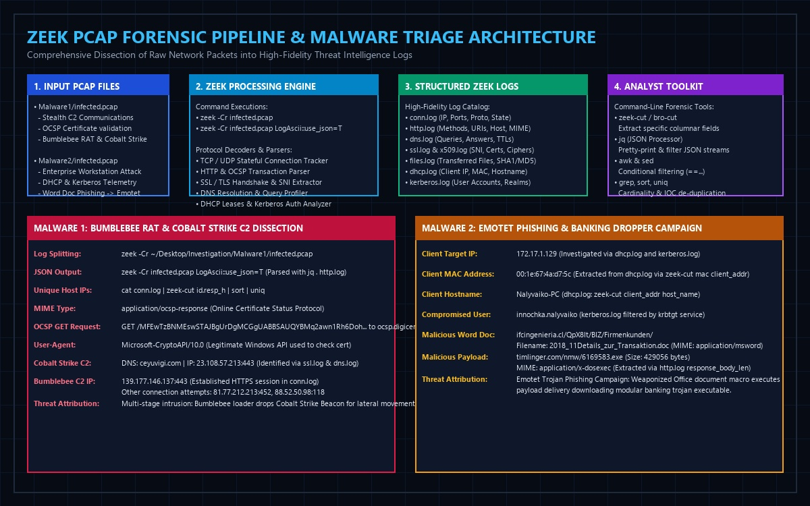

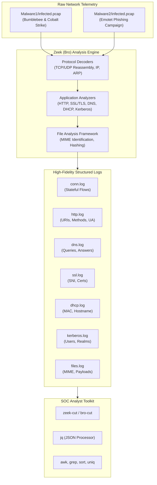

---

## 🎬 Live Terminal Demonstration

The animated forensic recording below captures the exact command line sequence executed during the investigation—from parsing the PCAP files with Zeek, querying JSON logs with `jq`, extracting MAC addresses and Kerberos tickets, to isolating the Emotet executable payload:

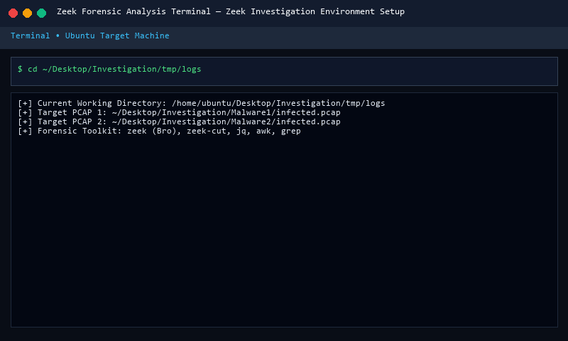

---

## 🖥️ Lab Environment & Architecture

| Machine Role | Hostname / OS | Location | Description |
|---|---|---|---|
| **Attacker Machine** | Kali Linux | Remote Subnet | Simulates malicious adversary and C2 infrastructure. |
| **Target Sensor** | Ubuntu Linux | `~/Desktop/Investigation` | Production workstation hosting Zeek, investigation scripts, and PCAP datasets. |
| **Malware 1 Directory** | `~/Desktop/Investigation/Malware1` | Local Host | Contains `infected.pcap` (Bumblebee + Cobalt Strike C2). |
| **Malware 2 Directory** | `~/Desktop/Investigation/Malware2` | Local Host | Contains `infected.pcap` (Emotet Phishing + Payload Dropper). |
| **Analysis Working Dir** | `~/Desktop/Investigation/tmp/logs` | Local Host | Output directories for ASCII and JSON Zeek logs. |

---

## 🔬 Malware 1 Investigation: Bumblebee & Cobalt Strike

In this scenario, an enterprise endpoint was infected by a multi-stage loader. The adversary utilized Bumblebee to gain an initial foothold, followed by the deployment of Cobalt Strike for post-exploitation command and control.

### Q1. What is the Zeek command to split the PCAP file into Bro/Zeek logs?

**Command:**
```bash
cd ~/Desktop/Investigation/tmp/logs
zeek -Cr ~/Desktop/Investigation/Malware1/infected.pcap
```

**Technical Explanation:**
* `-r`: Directs Zeek to read packets from an offline capture file rather than a live network interface.
* `-C`: Directs Zeek to ignore invalid or missing TCP checksums. In modern virtualized and containerized environments, NIC checksum offloading often leaves capture files with checksums uncalculated; without `-C`, Zeek may drop packets before analysis.

**Log Catalog Generated:**
* `conn.log`: Tracks stateful TCP/UDP sessions, timestamps, source/destination IPs, ports, and duration.
* `dns.log`: Records all DNS queries, responses, and TTL metrics.
* `http.log`: Documents unencrypted HTTP request/response headers, methods, URIs, and user-agents.
* `ssl.log`: Captures TLS handshake negotiation, server name indication (SNI), and cipher suites.
* `files.log`: Identifies transferred files, byte sizes, and MIME types.
* `x509.log`: Contains X.509 certificate metadata observed during SSL/TLS sessions.

---

### Q2. What is the Zeek command to output logs in JSON format of the PCAP file?

**Command:**
```bash
cd ~/Desktop/Investigation/tmp/logs/json
zeek -Cr ~/Desktop/Investigation/Malware1/infected.pcap LogAscii::use_json=T
```

**Technical Explanation:**
By default, Zeek produces tab-separated ASCII files with `#fields` headers. Appending `LogAscii::use_json=T` instructs the logging framework to format every event as an independent JSON line. This structure is optimal for ingestion into modern log aggregators like Elasticsearch, Splunk, or parsing via command-line tools like `jq`.

---

### Q3. What is the command to process http.log file with jq to output JSON formatted data?

**Command:**
```bash
jq . http.log
```

**Technical Explanation:**
`jq` is a lightweight command-line JSON processor. The `.` filter represents the root context, instructing `jq` to read each JSON line, format it with indentation, and display it with syntax highlighting.

---

### Q4. What is the command to list out all the unique IP addresses which established a connection to the host?

**Command:**
```bash
cat conn.log | zeek-cut id.resp_h | sort | uniq
```

**Output:**
```text
23.108.57.213
81.77.212.213
88.52.50.98
139.177.146.137
```

**Technical Explanation:**
`zeek-cut` extracts specific columns from Zeek's tab-delimited logs. Here, `id.resp_h` isolates the responding (destination) IP address. Piping to `sort` and `uniq` provides an inventory of all remote systems with which the target host communicated.

---

### Q5. What is the response mime type in the pcap?

**Command:**
```bash
cat http.log | zeek-cut resp_mime_types | sort | uniq
```

**Answer:** `application/ocsp-response`

**Technical Explanation:**
The only HTTP MIME type present across the entire capture is `application/ocsp-response`. This indicates that cleartext HTTP was not used for payload delivery or browser surfing; instead, it was utilized exclusively for Online Certificate Status Protocol (OCSP) validation.

---

### Q6. What is the GET request made to 'ocsp.digicert.com' to establish a connection during the delivery of malware?

**Command:**
```bash
cat http.log | grep ocsp.digicert.com
```

**Answer:**
```text
/MFEwTzBNMEswSTAJBgUrDgMCGgUABBSAUQYBMq2awn1Rh6Doh/sBYgFV7gQUA95QNVbRTLtm8KPiGxvDl7I90VUCEAJ0LqoXyo4hxxe7H/z9DKA=
```

**Technical Explanation:**
Under RFC 6960, HTTP GET requests to OCSP responders encode the certificate request structure directly within the URI path using Base64 URL-safe encoding. When Windows verifies the certificate of an external TLS server, the CryptoAPI client contacts DigiCert's responder via this URI to ensure the certificate has not been revoked.

---

### Q7. What is the User Agent string transmitted by the application to web servers?

**Command:**
```bash
jq . json/http.log | grep user_agent
```

**Answer:** `Microsoft-CryptoAPI/10.0`

**Technical Explanation:**
`Microsoft-CryptoAPI/10.0` is the default User-Agent string emitted by Microsoft Windows cryptographic services. Malicious binaries leveraging native Windows APIs (such as WinINet or WinHTTP) trigger CryptoAPI to validate TLS certificates against trusted authorities.

---

### Q8. What is the DNS and IP of the infected traffic of the cobalt strike?

**Commands:**
```bash
# 1. Identify suspicious TLS Server Name Indication (SNI)
cat ssl.log | zeek-cut server_name | sort | uniq

# 2. Correlate hostname with DNS resolution in dns.log
cat dns.log | grep ceyuvigi.com
```

**Answer:** `23.108.57.213 / ceyuvigi.com`

**Technical Explanation:**
* In `ssl.log`, the TLS SNI reveals communication with `ceyuvigi.com`.
* Cross-referencing `dns.log` shows an `A` record query resolving `ceyuvigi.com` to IP `23.108.57.213` over port 443. Threat intelligence feeds attribute this infrastructure to active Cobalt Strike C2 beacons.

---

### Q9. What is the IP of the infected traffic of the Bumblebee C2?

**Command:**
```bash
cat conn.log | grep 139.177.146.137
```

**Answer:** `139.177.146.137`

**Technical Explanation:**
Analysis of `conn.log` shows established TCP handshakes and bidirectional HTTPS traffic (`443`) with `139.177.146.137`. Additional attempted connections were logged to `81.77.212.213:452` and `88.52.50.98:118`. This confirms Bumblebee loader network beacons communicating with its primary command and control server.

---

## 🔬 Malware 2 Investigation: Emotet Phishing Campaign

In this scenario, a Windows workstation on an enterprise subnet (`172.17.1.129`) was compromised via an incoming phishing email containing a malicious Microsoft Word document.

### Q10. What is the MAC address of the Windows client at 172.17.1.129?

**Command:**
```bash
cat dhcp.log | zeek-cut mac client_addr
```

**Answer:** `00:1e:67:4a:d7:5c`

**Technical Explanation:**
DHCP lease negotiation exchanges the hardware (MAC) address of the client in the DHCP packet header. Zeek logs this in `dhcp.log` under the `mac` field.

---

### Q11. What is the hostname for the Windows client at 172.17.1.129?

**Command:**
```bash
cat dhcp.log | zeek-cut client_addr host_name | sort | uniq
```

**Answer:** `Nalyvaiko-PC`

**Technical Explanation:**
DHCP Option 12 conveys the client hostname during address leasing. Zeek parses this field, identifying the system as `Nalyvaiko-PC`.

---

### Q12. Based on the Kerberos traffic, what is the Windows user account name used?

**Command:**
```bash
cat kerberos.log | zeek-cut id.orig_h client service | awk '$3~"krbtgt"' | grep -vi nalyvaiko-pc
```

**Answer:** `innochka.nalyvaiko`

**Technical Explanation:**
In an Active Directory domain, Kerberos authentication requests ticket-granting service (`krbtgt`) tickets. Filtering out machine accounts (which terminate in `$`, e.g., `nalyvaiko-pc$`) leaves the human user account: `innochka.nalyvaiko`.

---

### Q13. What URL in the pcap returned a Microsoft Word document?

**Commands:**
```bash
# 1. Identify Microsoft Word document filename in files.log
cat files.log | zeek-cut mime_type filename | grep msword

# 2. Correlate with http.log to find source host and URI
cat http.log | bro-cut ts id.orig_h id.resp_h method host uri resp_filenames | grep "2018_11Details_zur_Transaktion.doc"
```

**Answer:** `ifcingenieria.cl/QpX8It/BIZ/Firmenkunden/`

**Technical Explanation:**
`files.log` identifies an incoming file with MIME type `application/msword` named `2018_11Details_zur_Transaktion.doc`. Correlating this filename in `http.log` pinpoints the external server `ifcingenieria.cl` and path `/QpX8It/BIZ/Firmenkunden/`.

---

### Q14. What URL in the pcap returned a Windows executable file and how many bytes is the executable file returned from that URL?

**Command:**
```bash
cat http.log | zeek-cut -d ts method host uri resp_filenames resp_mime_types response_body_len | awk '$6=="application/x-dosexec"'
```

**Answer:** `timlinger.com/nmw/6169583.exe / 429056 bytes`

**Technical Explanation:**
Filtering `http.log` for the Windows binary MIME type `application/x-dosexec` isolates an HTTP GET request to `timlinger.com` for `/nmw/6169583.exe`. The `response_body_len` field confirms the payload size is exactly `429056` bytes.

---

### Q15. What type of infection occurred in this pcap?

**Answer:** `Phishing, Emotet Campaign`

**Technical Explanation:**
Searching threat intelligence databases (Hybrid Analysis, CISA Alert AA20-280A) for the hash and naming convention of `2018_11Details_zur_Transaktion.doc` associates the artifact with the **Emotet** banking Trojan. The malicious Word document uses VBA macros to download and execute secondary malware payloads.

---

## 📸 Complete Step-by-Step Screenshot Archive

Below is the complete sequence of all 22 official lab screenshots:

### Step 1: Lab Environment Access
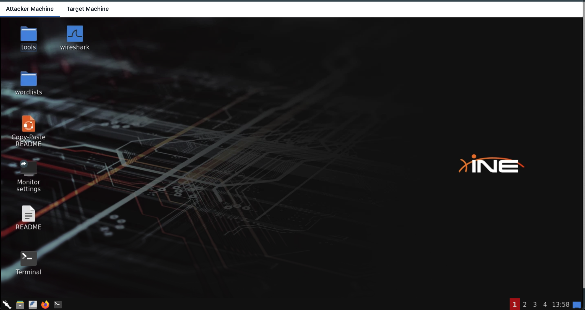
*Figure 1: Kali Linux Attacker Machine GUI.*

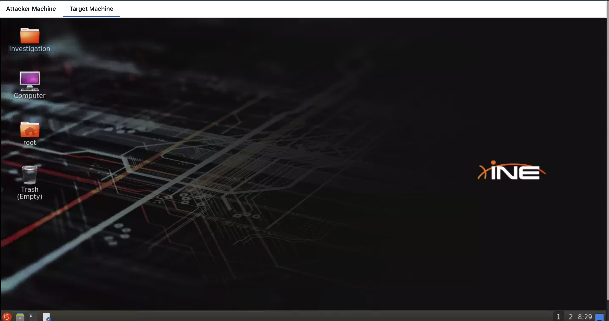
*Figure 2: Target Ubuntu Machine running Zeek network monitoring sensor.*

---

### Step 2: Malware 1 Log Extraction
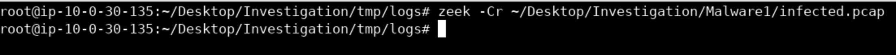
*Figure 3: Executing `zeek -Cr ~/Desktop/Investigation/Malware1/infected.pcap`.*

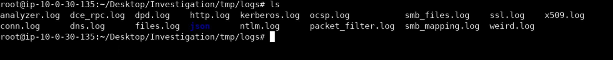
*Figure 4: Listing generated Zeek log files (`conn.log`, `dns.log`, `http.log`, `ssl.log`).*

---

### Step 3: Malware 1 Analysis & Threat Attribution
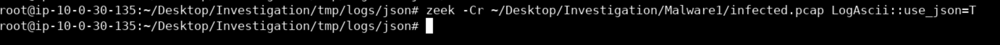
*Figure 5: Outputting JSON logs using `LogAscii::use_json=T`.*

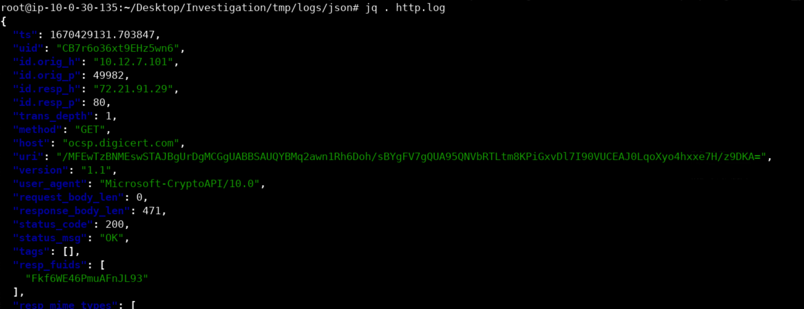
*Figure 6: Pretty-printing `http.log` events using `jq . http.log`.*

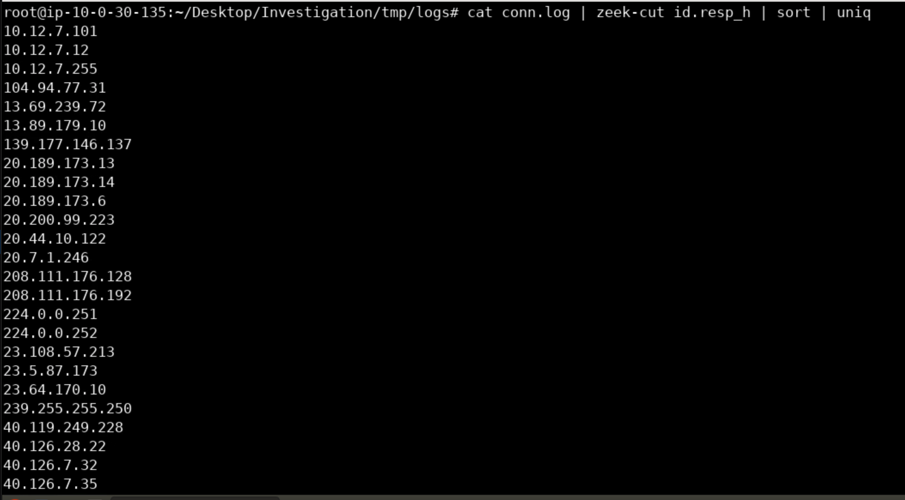
*Figure 7: Extracting unique responder IPs from `conn.log`.*

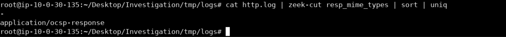
*Figure 8: Identifying `application/ocsp-response` MIME type in `http.log`.*

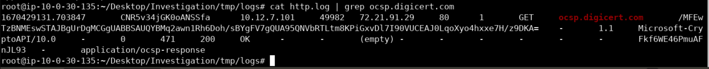
*Figure 9: Inspecting the Base64 OCSP request URI made to `ocsp.digicert.com`.*

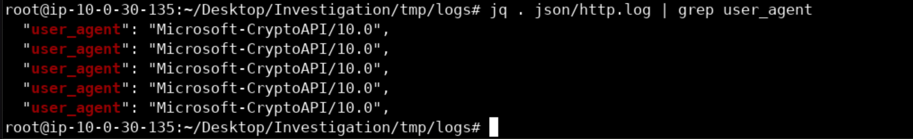
*Figure 10: Extracting `Microsoft-CryptoAPI/10.0` User-Agent string.*

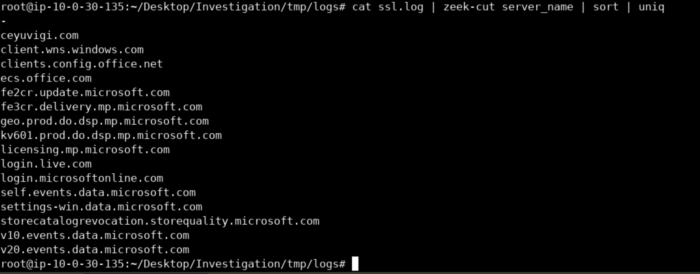
*Figure 11: Identifying Cobalt Strike C2 domain `ceyuvigi.com` in `ssl.log`.*

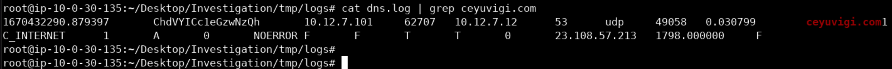
*Figure 12: Resolving `ceyuvigi.com` to `23.108.57.213` in `dns.log`.*

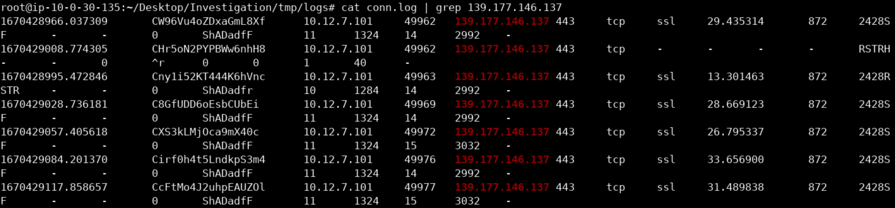
*Figure 13: Tracing established HTTPS session to `139.177.146.137` in `conn.log`.*

---

### Step 4: Malware 2 Log Extraction
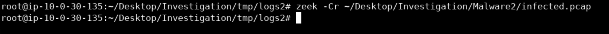
*Figure 14: Executing `zeek -Cr ~/Desktop/Investigation/Malware2/infected.pcap` in `tmp/logs2/`.*

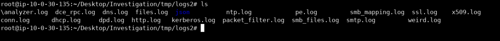
*Figure 15: Viewing generated log catalog for Malware 2.*

---

### Step 5: Malware 2 Analysis & Threat Attribution
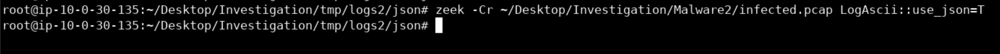
*Figure 16: Generating JSON logs for Malware 2.*

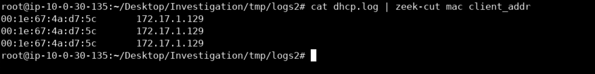
*Figure 17: Extracting client MAC address `00:1e:67:4a:d7:5c` from `dhcp.log`.*

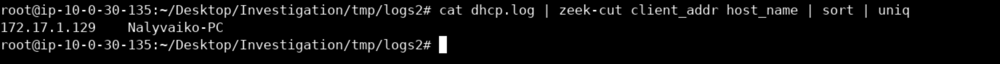
*Figure 18: Extracting client hostname `Nalyvaiko-PC` from `dhcp.log`.*

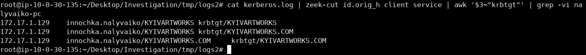
*Figure 19: Identifying user account `innochka.nalyvaiko` from `kerberos.log`.*

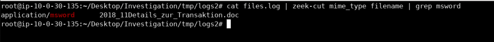
*Figure 20: Identifying `2018_11Details_zur_Transaktion.doc` in `files.log`.*

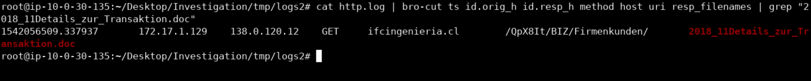
*Figure 21: Extracting host `ifcingenieria.cl` and URI from `http.log`.*

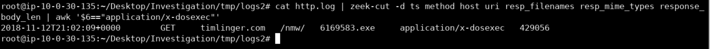
*Figure 22: Identifying payload `6169583.exe` (429,056 bytes) from `timlinger.com`.*

---

## 🛡️ Defensive Engineering & Detection Rules

### Snort / Suricata Rule: Emotet Binary Dropper Detection
```text
alert http $HOME_NET any -> $EXTERNAL_NET any (msg:"MALWARE-CNC Emotet Executable Payload Download"; flow:established,to_server; content:"GET"; http_method; content:".exe"; http_uri; file_data; content:"MZ"; within:2; classtype:trojan-activity; sid:2039101; rev:1;)
```

### Zeek Script: Flagging Suspicious Suffix Binary Downloads
```zeek
event http_reply(c: connection, version: string, code: count, reason: string) {
    if ( c$http?$resp_mime_types && "application/x-dosexec" in c$http$resp_mime_types ) {
        NOTICE([$note=Malware::Executable_Download,
                $msg=fmt("Executable downloaded from %s: %s", c$http$host, c$http$uri),
                $conn=c]);
    }
}
```

---

## 🏆 Conclusion & Key Takeaways

1. **Protocol Visibility:** Zeek bridges the gap between raw packet captures and SIEM platforms by reducing multi-gigabyte PCAPs into lightweight, high-fidelity ASCII/JSON logs.
2. **Context Correlation:** Correlating `dhcp.log` (MAC + IP + Hostname) with `kerberos.log` (User Principal) enables rapid identification of patient zero in enterprise compromises.
3. **Multi-Stage Threat Reconstruction:** By tracking DNS resolutions, TLS handshake SNIs, and HTTP file transfers, defenders can map the entire infection sequence—from initial phishing lure to payload execution and C2 beaconing.

---
*Authored for the Security Operations & Threat Hunting Portfolio | Reference: [INE Security Defender Labs](https://my.ine.com/labs/70b66b1e-b617-4f43-be6f-fb121699aa49)*
