<div align="center">

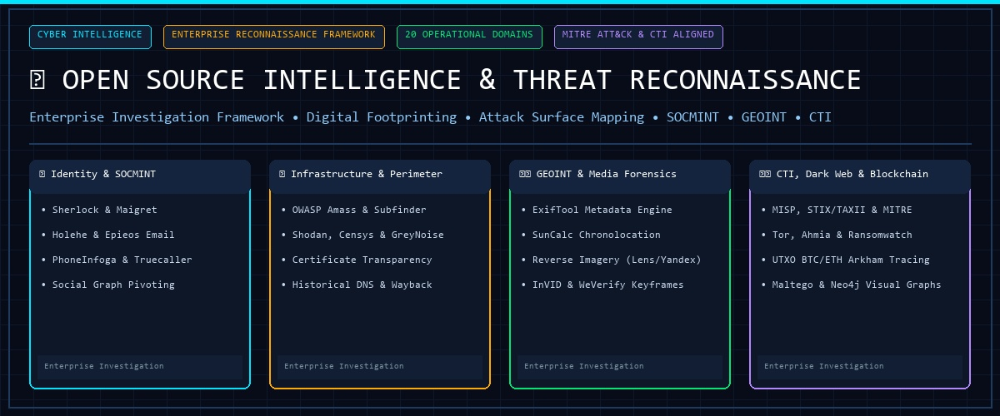

# 🔎 Open Source Intelligence (OSINT) & Cyber Threat Reconnaissance
### The Definitive Field Operations Manual, Technical Tool Directory & Investigation Playbook

[](https://osintframework.com/)
[](https://csrc.nist.gov/)
[](https://www.misp-project.org/)
[](.)

<p align="center">
  <b>A comprehensive, production-grade technical manual for Cyber Threat Intelligence (CTI) analysts, SOC investigators, penetration testers, purple team operators, and digital forensic researchers.</b>
</p>

[🏛️ Investigation Lifecycle](#investigation-lifecycle--pivot-architecture) • [⚡ Investigation Pipeline](#operational-reconnaissance-pipeline-demonstration) • [📋 107-Section Directory](#107-section-investigation-directory)

<div align="center">

[🧭 Module 1: Framework & OPSEC](#module-1-operational-frameworks-methodology-and-opsec) • [👤 Module 2: Identity & SOCMINT](#module-2-identity-social-media-and-alias-profiling) • [🌐 Module 3: Attack Surface](#module-3-domain-network-and-attack-surface-reconnaissance)

[🛡️ Module 4: CTI & Dark Web](#module-4-cyber-threat-intelligence-dark-web-and-crypto) • [🏢 Module 5: Corporate & Legal](#module-5-corporate-records-legal-and-public-data) • [🛰️ Module 6: GEOINT & Operations](#module-6-geospatial-intelligence-media-forensics-and-global-operations)

</div>

</div>

---

## 🏛️ Investigation Lifecycle & Pivot Architecture

Modern intelligence operations do not rely on passive web searches. Professional OSINT is an **iterative, multi-stage engineering discipline** structured across the standardized Intelligence Cycle:

<div align="center">

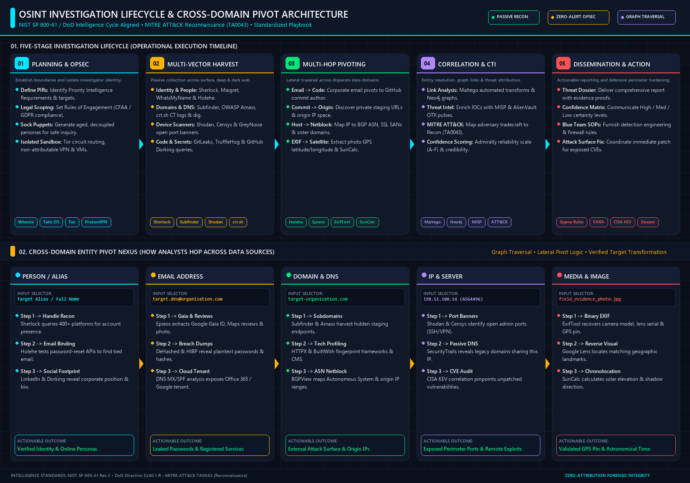

*Figure 1.1: Enterprise OSINT Investigation Lifecycle — 5-Phase End-to-End Operational Pipeline.*

</div>

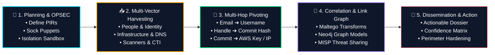
```mermaid

flowchart LR
    P["🎯 1. Planning & OPSEC<br>• Define PIRs<br>• Sock Puppets<br>• Isolation Sandbox"]
    --> C["📥 2. Multi-Vector Harvesting<br>• People & Identity<br>• Infrastructure & DNS<br>• Scanners & CTI"]
    --> PV["🔄 3. Multi-Hop Pivoting<br>• Email ➔ Username<br>• Handle ➔ Commit Hash<br>• Commit ➔ AWS Key / IP"]
    --> A["🧠 4. Correlation & Link Graph<br>• Maltego Transforms<br>• Neo4j Graph Models<br>• MISP Threat Sharing"]
    --> D["📑 5. Dissemination & Action<br>• Actionable Dossier<br>• Confidence Matrix<br>• Perimeter Hardening"]

    style P fill:#0f172a,stroke:#00e5ff,stroke-width:2px,color:#fff
    style C fill:#0f172a,stroke:#ffab00,stroke-width:2px,color:#fff
    style PV fill:#0f172a,stroke:#00e676,stroke-width:2px,color:#fff
    style A fill:#0f172a,stroke:#b388ff,stroke-width:2px,color:#fff
    style D fill:#0f172a,stroke:#ff5252,color:#fff
```

---

## ⚡ Operational Reconnaissance Pipeline Demonstration

The interactive investigation dashboard below simulates an end-to-end authorized threat reconnaissance engagement—progressing through environment isolation, passive subdomain harvesting, certificate transparency queries, Shodan port correlation, developer secret recovery via GitLeaks, EXIF chronolocation, breach correlation, and final intelligence dossier generation:

<div align="center">

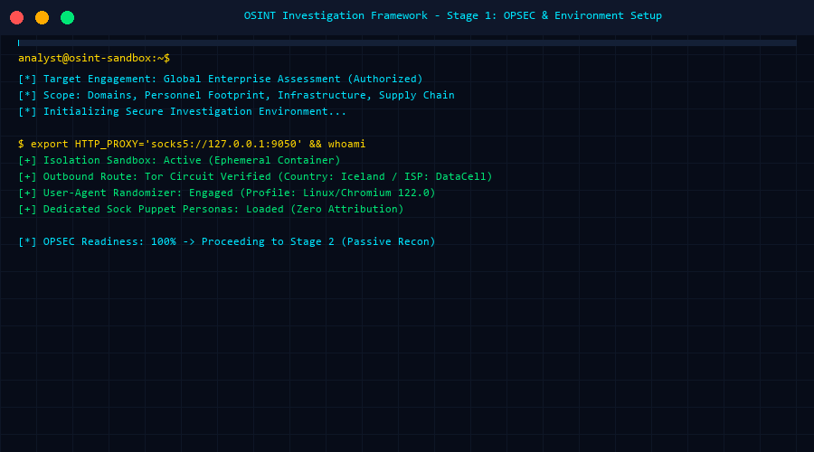

*Figure 1.2: Modern SaaS Multi-Stage Reconnaissance Pipeline — Cycling dynamically through all 5 phases from alias discovery to executive threat dossier.*

</div>

---

## 📋 107-Section Investigation Directory

| # | Section Title | Primary Focus & Domain |
| :-: | :--- | :--- |
| **01** | [OSINT Frameworks & Master Toolkits](#1-osint-frameworks--master-toolkits) | Frameworks, Curated Directories & Training Platforms  |
| **02** | [Search Engines (General, Specialized & Aggregators)](#2-search-engines) | Indexing Engines, Deep Web Crawlers & Metasearch Engines  |
| **03** | [Google Dorking & GHDB](#3-google-dorking) | Advanced Boolean Operators, GHDB & Sensitive Asset Mining  |
| **04** | [Username OSINT & Cross-Platform Alias Profiling](#4-username-osint) | Sherlock, Maigret, WhatsMyName & Handle Tracking  |
| **05** | [Email OSINT & Address Footprinting](#5-email-osint) | Holehe, Epieos, Hunter.io, Gravatar & Service Binding  |
| **06** | [Email Header Forensics & Authentication Analysis](#6-email-header-analysis) | RFC Headers, Hop Routing, SPF, DKIM, DMARC & MTAs  |
| **07** | [Phone Number OSINT & Telecom Reconnaissance](#7-phone-number-osint) | PhoneInfoga, Truecaller, E.164 Specs & Carrier Metadata  |
| **08** | [Domain OSINT & Registrar Intelligence](#8-domain-osint) | WHOIS, RDAP, History, SecurityTrails & Attack Surface  |
| **09** | [DNS OSINT & Query Protocols](#9-dns-osint) | Dig, Nslookup, DNSDumpster, DNSViz & Zone Transfers  |
| **10** | [Subdomain Enumeration (Passive & Semi-Passive)](#10-subdomain-enumeration) | OWASP Amass, Subfinder, Assetfinder & Chaos  |
| **11** | [IP Address OSINT & Autonomous System Telemetry](#11-ip-address-osint) | BGPView, IPinfo, AbuseIPDB, Hurricane Electric & RIRs  |
| **12** | [Shodan: Internet-Wide Device Scanning](#12-shodan) | Banner Mining, Filters, Exposed Services & Vulnerabilities  |
| **13** | [Censys: Attack Surface & Certificate Analysis](#13-censys) | IPv4 Scans, TLS Certificate Fingerprints & Host Assets  |
| **14** | [Certificate Transparency (CT) Log Mining](#14-certificate-transparency) | Crt.sh, CertSpotter, Wildcard SANs & Subdomain Trails  |
| **15** | [Website Technology Profiling](#15-website-technology-osint) | Wappalyzer, BuiltWith, WhatRuns & CMS Fingerprinting  |
| **16** | [URL Analysis & Sandbox Scanners](#16-url-analysis) | Urlscan.io, VirusTotal, OpenPhish & Hybrid Analysis  |
| **17** | [Malware & Cyber Threat Intelligence Platforms](#17-malware--cyber-threat-intelligence-osint) | Abuse.ch, ThreatFox, MalwareBazaar, URLhaus & VX-Underground  |
| **18** | [Cryptographic Hash OSINT](#18-hash-osint) | MD5, SHA1, SHA256 Lookup & Malware Hash Attribution  |
| **19** | [Social Media Intelligence (SOCMINT)](#19-social-media-intelligence-socmint) | Multi-Platform Monitoring, Sentiment & Bot Detection  |
| **20** | [Instagram OSINT & Media Archaeology](#20-instagram-osint) | Profile Scraping, Visual Footprinting & Stories History  |
| **21** | [LinkedIn OSINT & Corporate Hierarchy Mapping](#21-linkedin-osint) | Org Chart Recon, Employee Enumeration & Email Patterning  |
| **22** | [GitHub OSINT & Secret Exposure Hunting](#22-github-osint) | Code Dorking, GitLeaks, TruffleHog & Commit History Mining  |
| **23** | [GitLab OSINT & Project Footprinting](#23-gitlab-osint) | Public Repositories, Snippets, Commits & Pipeline Logs  |
| **24** | [Paste & Text Dump Reconnaissance](#24-paste--text-dump-osint) | Pastebin, GitHub Gists, PrivateBin & Intelligence X  |
| **25** | [Breach & Credential Exposure Intelligence](#25-breach--credential-exposure-intelligence) | Have I Been Pwned, DeHashed, Hudson Rock & Stealer Logs  |
| **26** | [Dark Web & Tor (.onion) Intelligence](#26-dark-web--tor-onion-intelligence) | Ahmia, OnionSearch, Ransomwatch & Extortion Portals  |
| **27** | [Cryptocurrency & Blockchain Forensics](#27-cryptocurrency--blockchain-forensics) | Bitcoin UTXO, Ethereum Accounts, Mempool, Etherscan & Arkham  |
| **28** | [Corporate & Business Entity OSINT](#28-corporate--business-entity-osint) | OpenCorporates, SEC EDGAR, Companies House & ImportYeti  |
| **29** | [Government Open Data & Public Records](#29-government-open-data--public-records) | USAspending, SEC, PACER, CERT-In, MCA & Public Portals  |
| **30** | [Legal & Court Docket Intelligence](#30-legal--court-docket-intelligence) | CourtListener, PACER, RECAP, Justia & Indian Kanoon  |
| **31** | [Image OSINT & Reverse Visual Engines](#31-image-osint) | Google Lens, Yandex, TinEye, PimEyes & FotoForensics  |
| **32** | [EXIF & Hardware Metadata Forensics](#32-exif--metadata) | ExifTool Commands, Camera Sensors, Timestamps & GPS  |
| **33** | [Image Geolocation (GEOINT)](#33-image-geolocation) | Google Earth, Mapillary, SunCalc, PeakVisor & Overpass Turbo  |
| **34** | [Satellite Imagery & Remote Sensing](#34-satellite-imagery) | Sentinel Hub, Copernicus, NASA Worldview, Landsat & Planet  |
| **35** | [Mapping Platforms & Geospatial Databases](#35-maps) | OpenStreetMap, Google Earth Pro, ArcGIS, QGIS & Wikimapia  |
| **36** | [Geolocation Heuristics & Visual Clues](#36-geolocation-techniques) | Architecture, Vegetation, Road Markings & Infrastructure  |
| **37** | [Street View & Ground-Level Telemetry](#37-street-view) | Google Street View, Mapillary, KartaView & Yandex Panoramas  |
| **38** | [Flight Tracking & ADS-B Intelligence](#38-flight-osint) | FlightRadar24, ADS-B Exchange, OpenSky Network & Callsigns  |
| **39** | [Maritime & AIS Ship Tracking](#39-maritime--ship-osint) | MarineTraffic, VesselFinder, FleetMon, MMSI & IMO Lookups  |
| **40** | [Weather & Meteorological Verification](#40-weather-osint) | NOAA, NASA, Windy, Meteoblue & Historical Weather APIs  |
| **41** | [Historical Web & Digital Archives](#41-historical-web--archives) | Wayback Machine, Archive.today, Memento & Common Crawl  |
| **42** | [Website Change Monitoring & Webhooks](#42-website-change-monitoring) | Changedetection.io, Visualping, Distill.io & Versionista  |
| **43** | [PDF & Document Metadata Extraction](#43-pdf--document-osint) | PDFInfo, Apache Tika, FOCA, Metagoofil & Strings  |
| **44** | [Automated Metadata Harvesting Engines](#44-metadata-osint) | Multi-File Batch Extraction, Revision History & Authors  |
| **45** | [People OSINT: Holistic Investigation Path](#45-people-osint-holistic-investigation-path) | Cross-Domain Identity Pivots (Name ➔ Username ➔ Infrastructure)  |
| **46** | [Username to Email Pivoting Heuristics](#46-username-to-email-pivoting) | Correlation Engines, Gravatar Hashing & Epieos  |
| **47** | [Email to Username Pivoting Heuristics](#47-email-to-username-pivoting) | Prefix Decomposition, Social Registrations & Leaks  |
| **48** | [Username to Domain & Infrastructure Pivoting](#48-username-to-domain--infrastructure-pivoting) | Code Repositories, Domain Registrations & Nameservers  |
| **49** | [Maltego Link Analysis Platform](#49-maltego) | Entities, Transforms, Graph Topologies & Visual Correlation  |
| **50** | [SpiderFoot Attack Surface Automation](#50-spiderfoot) | OSINT Target Automation, Modules & Threat Correlation  |
| **51** | [Recon-ng Framework](#51-recon-ng) | Metasploit-Style Modular Recon, Workspaces & API Keys  |
| **52** | [theHarvester Perimeter Harvester](#52-theharvester) | Passive Email, Subdomain, IP & Employee Harvesting  |
| **53** | [OWASP Amass Attack Surface Mapper](#53-amass-owasp) | Graph-Based Asset Discovery, ASN Mapping & DNS Parsing  |
| **54** | [FinalRecon Web Reconnaissance Suite](#54-finalrecon) | Header Audits, SSL, Crawling, Directory & DNS Checks  |
| **55** | [Passive Reconnaissance Core Suite](#55-passive-recon-tools-suite) | Multi-Tool Aggregated Passive Footprinting Pipeline  |
| **56** | [Threat Actor Profiling & CTI Feeds](#56-threat-actor-osint) | MITRE ATT&CK, AlienVault OTX, CISA, Mandiant & Talos  |
| **57** | [MITRE ATT&CK Framework Mapping](#57-mitre-attck-framework) | TTP Attribution, Campaign Chains & Detection Alignment  |
| **58** | [MISP Threat Sharing Platform](#58-misp-malware-information-sharing-platform) | Threat Events, Attributes, Warninglists & Communities  |
| **59** | [STIX 2.1 & TAXII 2.1 Threat Data Models](#59-stix--taxii) | Standardized SDOs, SROs & Automated Threat Feeds  |
| **60** | [Vulnerability OSINT & Exploit Repositories](#60-vulnerability-osint) | NVD, CVE.org, CISA KEV, Exploit-DB & OSV.dev  |
| **61** | [National Vulnerability Database (NVD) Analysis](#61-national-vulnerability-database-nvd) | CVSS v3.1/v4.0 Metrics, CPE Dictionary & CWE Mapping  |
| **62** | [CISA KEV Catalog Prioritization](#62-cisa-known-exploited-vulnerabilities-kev-catalog) | Actively Exploited Vulnerabilities vs Theoretical Risk  |
| **63** | [Username & Identity Discovery Suites](#63-username--account-discovery-suites) | Sherlock, Maigret, Blackbird, WhatsMyName & Namechk  |
| **64** | [Facial Recognition & Biometric Search Engines](#64-facial-recognition--biometric-search-engines) | PimEyes, FaceCheck.ID, Yandex Visual & Ethical Limits  |
| **65** | [Audio Forensics & Acoustic Intelligence](#65-audio-forensics--acoustic-intelligence) | Shazam, ACRCloud, Audacity, FFmpeg & Whisper AI  |
| **66** | [Video OSINT & Verification Workflow](#66-video-osint--verification-workflow) | Video Preservation, Keyframes, Chronolocation & Hashes  |
| **67** | [InVID / WeVerify Verification Suite](#67-invid--weverify-verification-suite) | Keyframe Splitting, Reverse Image Lookups & Context  |
| **68** | [YouTube OSINT & Channel Telemetry](#68-youtube-osint) | Video Data API, YouTube DataViewer & Yt-dlp Metadata  |
| **69** | [Reddit OSINT & Thread Archaeology](#69-reddit-osint) | PullPush, Pushshift, Reddit Investigator & Google Dorks  |
| **70** | [Telegram OSINT & Threat Actor Channel Scraping](#70-telegram-osint) | Public Channels, TGStat, Telemetr & Bot Automation  |
| **71** | [Discord OSINT & Guild Reconnaissance](#71-discord-osint) | Guild Lookup, Widget APIs, Invite Analysis & Bot Infrastructure  |
| **72** | [Mastodon & Fediverse Intelligence](#72-mastodon--fediverse-intelligence) | ActivityPub Protocol, Instance Scraping & Fediverse DBs  |
| **73** | [Bluesky & AT Protocol Intelligence](#73-bluesky--at-protocol-intelligence) | AT Protocol Public APIs, DIDs & Post Firehoses  |
| **74** | [X / Twitter Advanced Intelligence Gathering](#74-x--twitter-advanced-intelligence-gathering) | Search Operators, Historical Feeds, Hoaxy & Botometer  |
| **75** | [Social Graph & Entity Relationship Analysis](#75-social-graph-analysis) | Node Clustering, Inter-Entity Ties & Centrality Metrics  |
| **76** | [Network Graph Visualization Engines](#76-network-graph-visualization-engines) | Gephi Modularity Algorithms & Neo4j Cypher Property Graphs  |
| **77** | [Essential Browser OSINT Extensions](#77-essential-browser-osint-extensions) | Wappalyzer, BuiltWith, SingleFile, Wayback & HackTools  |
| **78** | [Web Scraping Architecture for Intelligence](#78-web-scraping-architecture-for-intelligence) | BeautifulSoup, Scrapy, Playwright, Selenium & Requests  |
| **79** | [Command-Line OSINT Toolkit for Linux/Kali](#79-command-line-osint-toolkit-for-linuxkali) | Core Unix Pipeline (`curl`, `dig`, `jq`, `grep`, `awk`, `exiftool`)  |
| **80** | [Web Crawlers & Attack Surface Spiders](#80-web-crawlers--attack-surface-spiders) | Katana, Hakrawler, GoSpider, Photon & OWASP ZAP  |
| **81** | [Archive Investigation & Temporal Reconstruction](#81-archive-investigation--temporal-reconstruction) | Wayback CDX API, Archive.today & Common Crawl WARC  |
| **82** | [Breach Monitoring & Enterprise Credential Exposure](#82-breach-monitoring--enterprise-credential-exposure) | HIBP Enterprise, SpyCloud, Searchlight Cyber & Dark Web  |
| **83** | [Dark-Web Monitoring & Ransomware Tracking](#83-dark-web-monitoring--ransomware-tracking) | Recorded Future, Flashpoint, DarkOwl, KELA & Ransomwatch  |
| **84** | [Brand Monitoring & Digital Risk Protection (DRP)](#84-brand-monitoring--digital-risk-protection) | Google Alerts, Talkwalker, Brand24 & Mention  |
| **85** | [News Intelligence & Global Event Monitoring](#85-news-osint--global-event-monitoring) | GDELT Project, MediaCloud, Event Registry & Factiva  |
| **86** | [Disinformation Analysis & Media Verification](#86-disinformation-analysis--media-verification) | Verification Handbooks, InVID, ELA & Source Validation  |
| **87** | [Fact-Checking Consortia & Open Databases](#87-fact-checking-consortia--open-databases) | Google Fact Check Explorer, Snopes, PolitiFact & Bellingcat  |
| **88** | [Language Intelligence & Translation Engines](#88-language-intelligence--translation-engines) | DeepL, Google Translate, Yandex Translate & Linguistics  |
| **89** | [Optical Character Recognition (OCR) for OSINT](#89-optical-character-recognition-ocr-for-osint) | Tesseract CLI, Google Lens, PaddleOCR & EasyOCR  |
| **90** | [Deep Web Academic Repositories & Document Engines](#90-deep-web-academic-repositories--document-engines) | Google Books, Internet Archive, HathiTrust, JSTOR & arXiv  |
| **91** | [Academic OSINT & Scholarly Intelligence](#91-academic-osint--scholarly-intelligence) | Semantic Scholar, OpenAlex, PubMed, CORE & ResearchGate  |
| **92** | [Infrastructure Relationship Mapping Workflow](#92-infrastructure-relationship-mapping-workflow) | End-to-End DNS ➔ BGP ➔ Server ➔ Hosting Pivot Chain  |
| **93** | [Cybersecurity Attack Surface Reconnaissance Matrix](#93-cybersecurity-osint-attack-surface) | Enterprise Inventory Architecture (Domains, Cloud, Code)  |
| **94** | [Cloud Storage OSINT & Bucket Discovery](#94-cloud-storage-osint--bucket-discovery) | AWS S3, Azure Blob, GCP Storage; CloudEnum & S3Scanner  |
| **95** | [SecurityTrails Historical DNS & WHOIS](#95-securitytrails) | Historical A/NS/MX Changes, Domain Mutations & IP Trails  |
| **96** | [VirusTotal Multi-Hop Graph Analysis](#96-virustotal-multi-hop-graph-analysis) | Files, IPs, Domains, URLs, Certificates & Malware Relations  |
| **97** | [urlscan.io Deep Network & DOM Telemetry](#97-urlscanio) | Requests, TLS Handshakes, Scripts, DOM Trees & Screenshots  |
| **98** | [GreyNoise Intelligence for Threat Analysts](#98-greynoise-intelligence) | Mass Internet Scanners, Benign Actors vs Targeted Worms  |
| **99** | [AbuseIPDB IP Reputation & Malicious Scoring](#99-abuseipdb) | Malicious Confidence Percentage, Abuse Categories & Reports  |
| **100** | [AlienVault Open Threat Exchange (OTX)](#100-alienvault-open-threat-exchange-otx) | Threat Pulses, Community Indicators & API Integration  |
| **101** | [Intelligence X Search Engine & Archive](#101-intelligence-x) | Darknet Portals, Paste Dumps, Historical IP & Document Index  |
| **102** | [OSINT Automation Frameworks & Pipelines](#102-osint-automation-frameworks) | Autonomous Harvesters (SpiderFoot, theHarvester, sn0int)  |
| **103** | [The 8-Stage OSINT Investigation Lifecycle](#103-the-8-stage-osint-investigation-lifecycle) | Requirement ➔ Collection ➔ Pivoting ➔ Correlation ➔ Report  |
| **104** | [End-to-End Enterprise Security Case Study](#104-end-to-end-enterprise-security-case-study) | Real-World Investigation Walkthrough on `example.com`  |
| **105** | [The OSINT Pivot Mindset & Cross-Domain Hopping](#105-the-osint-pivot-mindset) | Mastering Email, Domain & Media Cross-Domain Jumps  |
| **106** | [Tiered OSINT Toolkit Recommendations](#106-tiered-osint-toolkit-recommendations) | Tier 1 (Foundations) to Tier 6 (Advanced Enterprise CTI)  |
| **107** | [The Unified OSINT Tool & Relationship Map](#107-the-unified-osint-tool--relationship-map) | Comprehensive Categorical Architecture Diagram & The Top 10  |

---

---

---

## Module 1: Operational Frameworks, Methodology and OPSEC

> **Core Focus:** Establishing intelligence requirements (PIRs), non-attributable sock puppet infrastructure, and foundational search indexing mechanics.

## 1. OSINT Frameworks & Master Toolkits

Open Source Intelligence (OSINT) practitioners do not reinvent the wheel for every investigation. Master toolkits and curated frameworks provide structured taxonomies that organize tools around specific intelligence requirements, target pivot points, and legal methodologies.

### Primary Frameworks & Collections:

| Framework / Resource | Maintainer / Organization | Primary Purpose & Analytical Role | Access / Reference |
| :--- | :--- | :--- | :--- |
| **OSINT Framework** | Justin Nordine | Interactive web-based tree organizing hundreds of tools by data pivot (Username, Email, Domain, IP, Public Records, Telephone) | [osintframework.com](https://osintframework.com/) |
| **Bellingcat Online Investigation Toolkit** | Bellingcat Research Team | Battle-tested, practitioner-reviewed investigative toolkit covering satellite imagery, geolocation, social media verification, and conflict tracking | [bellingcat.gitbook.io/toolkit](https://bellingcat.gitbook.io/toolkit) |
| **OSINT Dojo** | OSINT Dojo Community | Structured gamified methodology, certifications, training pathways, and resource index for intelligence analysts | [osintdojo.com/resources](https://www.osintdojo.com/resources/) |
| **Awesome OSINT** | Jivoi & Community | Massive, continuously updated GitHub repository listing thousands of categorized OSINT tools, libraries, and APIs | [github.com/jivoi/awesome-osint](https://github.com/jivoi/awesome-osint) |
| **OSINT Combine** | OSINT Combine Pty Ltd | Enterprise operational utilities, Academy training, and specialized web scrapers for global investigations | [osintcombine.com](https://www.osintcombine.com/) |
| **OSINT Techniques** | Hatless1der / OSINT Techniques | Practical investigative methodologies, workflow guides, and categorized search resources | [osinttechniques.com](https://osinttechniques.com/) |
| **IntelTechniques** | Michael Bazzell | The industry gold standard for privacy, personal security, and structured digital reconnaissance workflows | [inteltechniques.com](https://inteltechniques.com/) |
| **Sector035 (Week in OSINT)** | Sector035 | Weekly intelligence newsletter compiling new investigative tools, articles, community discoveries, and case techniques | [sector035.nl](https://sector035.nl/) |
| **Nixintel OSINT Resource List** | Nixintel | Extensive curated guide detailing operational links across domains, social networks, and imagery | [nixintel.info](https://nixintel.info/) |
| **OSINT.Link** | OSINT.Link Directory | Fast-access categorized bookmark directory for investigators covering corporate, social, and technical sources | [osint.link](https://osint.link/) |
| **OSINT4All** | Community Project | Open resource catalogue mapping digital investigation utilities across borders | [osint4all.com](https://osint4all.com/) |
| **Trace Labs** | Trace Labs (Non-Profit) | Crowdsourced intelligence platform crowdsourcing missing persons search operations using ethical OSINT | [tracelabs.org](https://www.tracelabs.org/) |
| **The OSINT Curious Project** | OSINT Curious Community | Educational podcasts, blogs, video tutorials, and technical deep-dives into modern investigative tradecraft | [osintcurio.us](https://osintcurio.us/) |

> **Operational Tip:** The **OSINT Framework** is uniquely powerful because it visually structures your research around pivots. If you only possess an email address, expanding the `Email Address` branch immediately yields search utilities, breach checkers, reputation engines, and mail exchanger diagnostics.

---

## 2. Search Engines

Search engines serve as the foundational indexing layer of the World Wide Web. However, relying on a single engine introduces severe cognitive bias, as search algorithms tailor results based on geography, advertising models, and filtering algorithms.

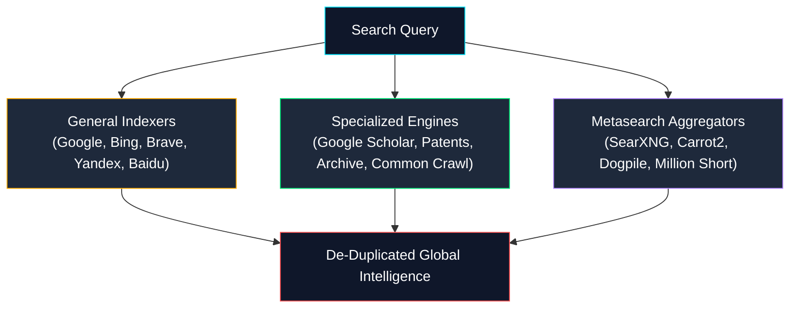
```mermaid

flowchart TD
    Q["Search Query"] --> GE["General Indexers<br>(Google, Bing, Brave, Yandex, Baidu)"]
    Q --> SE["Specialized Engines<br>(Google Scholar, Patents, Archive, Common Crawl)"]
    Q --> SA["Metasearch Aggregators<br>(SearXNG, Carrot2, Dogpile, Million Short)"]

    GE --> D["De-Duplicated Global Intelligence"]
    SE --> D
    SA --> D

    style Q fill:#0f172a,stroke:#00e5ff,color:#fff
    style GE fill:#1e293b,stroke:#ffab00,color:#fff
    style SE fill:#1e293b,stroke:#00e676,color:#fff
    style SA fill:#1e293b,stroke:#b388ff,color:#fff
    style D fill:#0f172a,stroke:#ff5252,color:#fff
```

### 2.1 General Crawlers & Search Engines:
* **Google:** The largest global web index (>50 billion pages). Exceptional algorithm for natural language understanding and real-time indexing.
* **Bing:** Powers Yahoo and DuckDuckGo backends. Features strong document search capabilities and distinct image indexing algorithms.
* **Brave Search:** Operates an independent index independent of Google or Microsoft, preserving search privacy and uncurated web rankings.
* **DuckDuckGo:** Privacy-focused proxy querying multiple upstream APIs while eliminating personalization bubbles and tracking telemetry.
* **Yahoo:** Legacy search engine utilizing Bing syndication alongside historical content partnerships.
* **Yandex:** Leading engine in Eastern Europe and Russia. Exceptional algorithmic capabilities in reverse image search and facial matching.
* **Baidu:** The primary search engine for the Chinese internet, indexing platforms unreachable behind the Great Firewall.
* **Mojeek:** Truly independent UK-based crawler building its own independent index without scraping secondary providers.
* **Startpage:** Delivers Google search results via an anonymizing privacy proxy that strips tracking headers and IP logs.
* **Swisscows:** Family-friendly, Swiss-based privacy engine using semantic data analysis and zero data storage.
* **Qwant:** European privacy engine based in France adhering strictly to GDPR compliance.
* **SearXNG:** Self-hosted, open-source metasearch engine combining results from over 70 search services without tracking user queries.
* **Kagi:** High-signal, paid search engine completely free from advertisements, affiliate spam, and SEO-optimized clickbait.
* **Yep:** Independent web crawler created by Ahrefs that indexes pages directly and shares ad revenue with creators.

### 2.2 Specialized Search Engines:
* **Google Scholar:** Comprehensive index of peer-reviewed academic literature, patents, theses, legal opinions, and court dockets.
* **Google Books:** Full-text searchable database of millions of digitized books, historic literature, and out-of-print magazines.
* **Google News:** Real-time aggregator indexing thousands of regional and international news publishers with temporal filtering.
* **Google Patents:** Search interface covering patent applications and grant documents from 100+ global patent offices.
* **Google Finance:** Real-time financial markets, corporate entity affiliations, executive rosters, and equity tracking.
* **WolframAlpha:** Computational knowledge engine answering factual questions by processing structured algorithms rather than indexing raw HTML.
* **Internet Archive:** Digital library maintaining billions of web captures, digitized books, audio records, and television broadcasts.
* **Common Crawl:** Open repository of web crawl data containing petabytes of raw web page data collected over 15+ years.
* **Marginalia:** Custom non-commercial search engine prioritizing early web text documents and independent blogs over modern commercial sites.
* **Wiby:** Search engine designed exclusively for classical, lightweight, text-only web pages and legacy web directory designs.

### 2.3 Search Aggregators & Metasearch Engines:
* **Carrot2:** Organizes search results into thematic topic clusters, visually highlighting related themes and concepts.
* **Dogpile:** Classic metasearch engine combining results from Google, Yahoo, Bing, and secondary directories into a unified stream.
* **Boardreader:** Search engine specifically dedicated to indexing public forums, message boards, Reddit, and bulletin boards.
* **Searchcode:** Deep search engine indexing over 75 billion lines of open-source software code across GitHub, Bitbucket, and GitLab.
* **Million Short:** Enables researchers to exclude the top 100, 1,000, 10,000, or 1,000,000 most popular commercial websites to discover obscure pages.
* **SearchMySite:** Non-profit independent search engine focusing on open web blogs, personal sites, and digital gardens.

---

## 3. Google Dorking

Google Dorking (also known as **Google Hacking**) utilizes advanced search engine operators to filter through Google's index to uncover exposed configuration files, database dumps, unindexed admin portals, and sensitive corporate credentials.

### 3.1 Essential Search Operators:

| Operator | Syntax | Purpose & Analytical Mechanics |
| :--- | :--- | :--- |
| `site:` | `site:example.com` | Restricts queries exclusively to a specific domain, subdomain, or top-level domain (`.gov`, `.edu`) |
| `filetype:` / `ext:` | `filetype:pdf` | Limits search results to specific file extensions (`sql`, `env`, `log`, `docx`, `xml`, `json`) |
| `intitle:` | `intitle:"Dashboard"` | Searches for specific keywords within the HTML `<title>` element of indexed web pages |
| `allintitle:` | `allintitle:admin login` | Restricts results to pages where ALL specified keywords appear in the HTML title |
| `inurl:` | `inurl:admin/login.php` | Matches character strings located anywhere within the URL path or query string |
| `allinurl:` | `allinurl:wp-content uploads`| Matches pages where all keywords appear within the URL path |
| `intext:` | `intext:"confidential"` | Searches for specific keywords within the visible body text of indexed pages |
| `allintext:` | `allintext:password username`| Enforces that all specified terms must appear within the body text |
| `before:` / `after:` | `after:2025-01-01` | Restricts indexed results to documents indexed before or after a specific calendar date (ISO 8601) |
| `cache:` | `cache:example.com` | Renders Google's cached snapshot of a page (useful for recently deleted pages) |
| `related:` | `related:example.com` | Identifies web pages that Google's algorithm considers structurally or topically similar |
| `""` | `"exact phrase"` | Enforces literal verbatim phrase matching, disabling algorithmic synonyms |
| `-` (Hyphen) | `site:example.com -www` | Boolean NOT operator; excludes specific keywords, subdomains, or file extensions |
| `OR` / `\|` | `ext:sql OR ext:bak` | Boolean OR operator; matches either the left or right search condition |

### 3.2 High-Impact Cybersecurity Dorking Examples:

<div align="center">

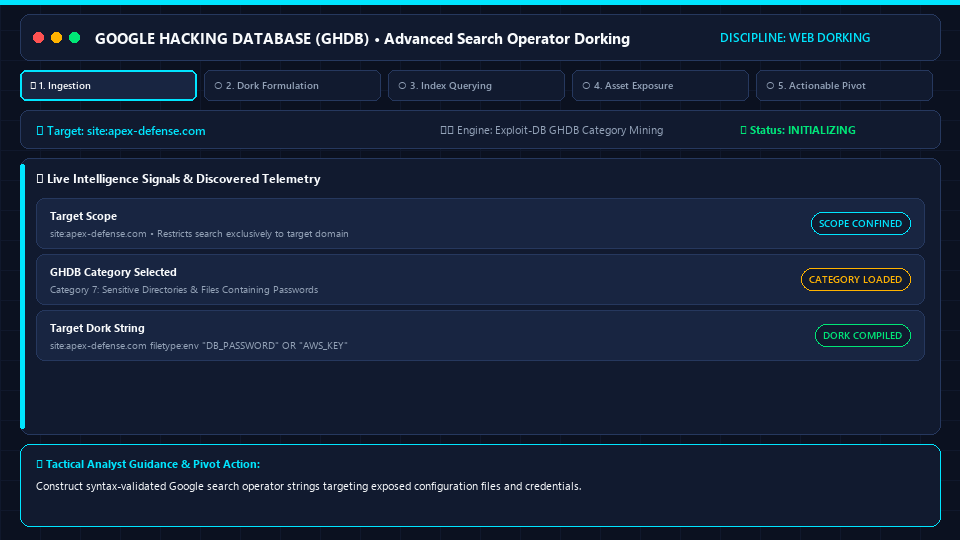

*Figure 3.1: Automated syntax parsing and sensitive configuration file discovery using Google Hacking Database (GHDB) operators.*

</div>

#### Step-by-Step Analytical Breakdown:
1. **Target Ingestion & Category Selection:** The query restricts scope strictly to the target apex domain (`site:apex-defense.com`) while isolating administrative paths (`-www`).
2. **Operator Combination:** Pairs `filetype:env` with sensitive strings (`"DB_PASSWORD"`, `"AWS_KEY"`) to isolate configuration dotfiles inadvertently crawled by search spiders.
3. **SERP Parsing & Credential Exposure:** Inspects indexed title and snippet metadata to recover database connection strings, Stripe API keys, and internal IP addresses.
4. **Historical Cache Audit:** Leverages `cache:` operators and Wayback Machine CDX endpoints to determine historical exposure duration.
5. **Mitigation Pivot:** Immediate revocation of exposed secrets and submission of Google Search Console URL removal requests.

```text
# 1. Directory Listings & Exposed Server Roots (Finding Open Directories)
site:example.com intitle:"index of /" OR intitle:"index of /admin"
site:example.com intitle:"index of" "parent directory"
site:example.com intitle:"index of /" "dcim"

# 2. Exposed Database Dumps & Configuration Files
site:example.com filetype:sql OR filetype:db OR filetype:sqlite OR filetype:mdb
site:example.com filetype:env "DB_PASSWORD" OR "AWS_SECRET_ACCESS_KEY"
site:example.com inurl:wp-config.php OR inurl:configuration.php OR inurl:settings.py

# 3. Sensitive Corporate Documents & PII Leaks
site:example.com filetype:xls OR filetype:xlsx "salary" OR "budget" OR "confidential"
site:example.com filetype:pdf "not for public distribution" OR "proprietary" OR "strictly private"
site:example.com filetype:doc OR filetype:docx "internal use only" "security policy"

# 4. Exposed Log Files & Debug Telemetry
site:example.com filetype:log intext:"error" OR intext:"password" OR intext:"token"
site:example.com inurl:phpinfo.php OR inurl:info.php "PHP Version"
site:example.com filetype:json intext:"client_secret" OR intext:"api_key"

# 5. Cloud Storage Leaks (AWS S3, Azure Blob, Google Cloud Storage)
site:s3.amazonaws.com "example.com"
site:blob.core.windows.net "example.com"
site:storage.googleapis.com "example.com"
```

> ⚠️ **Legal & Ethical Notice:** Utilize dorking queries strictly against infrastructure and corporate assets you are authorized to assess. Accessing exposed administrative portals or downloading confidential database dumps without authorization violates the Computer Fraud and Abuse Act (CFAA) and equivalent international statutes.

### 3.3 Authoritative Dorking Repositories:
* **Exploit-DB Google Hacking Database (GHDB):** The definitive public index of thousands of community-submitted dorks organized into categories (Vulnerable Servers, Sensitive Directories, Files Containing Passwords).
* **DorkSearch:** Web application providing high-speed autocomplete and indexing over GHDB dorks with single-click query generation.
* **DorkGPT:** LLM-powered natural language prompt generator converting plain English queries into syntax-validated Google dork strings.

---

---

## Module 2: Identity, Social Media and Alias Profiling

> **Core Focus:** Cross-platform username resolution, email service binding, phone number telemetry, and social media entity archaeology.

## 4. Username OSINT

Adversaries, targets, and investigators frequently reuse aliases and usernames across online platforms, gaming networks, development forums, and social media. Username reconnaissance builds comprehensive behavioral footprints from a single digital handle.

### 4.1 Automated CLI Toolchain:

#### 1. Sherlock
The industry standard Python CLI utility scanning over 400 social platforms via HTTP status codes and signature detection:

<div align="center">

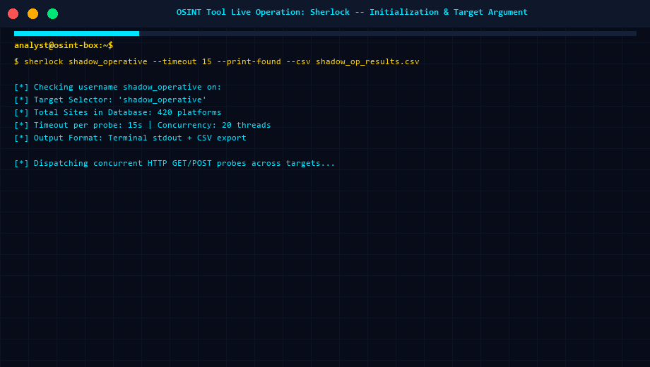

*Figure 4.1: High-concurrency username discovery across 400+ platforms utilizing Sherlock.*

</div>

```bash
# Installation
sudo apt update && sudo apt install -y sherlock

# Scan target username across all 400+ indexed sites
sherlock username123 --print-found

# Scan multiple candidate usernames and output to folder
sherlock user1 user2 user3 --folderoutput ./sherlock_results/
```

##### 🔍 Detailed Operational Walkthrough & Output Analysis:
1. **Target Initialization (`analyst@osint-box:~$ sherlock shadow_operative ...`)**:
   - The investigator passes the target alias (`shadow_operative`) to the Sherlock CLI engine.
   - The `--timeout 15` parameter ensures that slow, hanging, or tarpitted web servers do not stall the scan.
   - The `--print-found` flag filters terminal noise by outputting only confirmed active accounts rather than printing hundreds of 404/Not Found lines.
   - The `--csv shadow_op_results.csv` flag exports structured telemetry for forensic documentation and automated ingestion into graph analysis tools (such as Maltego or Gephi).

2. **Under-the-Hood Detection Mechanics**:
   - Sherlock maintains a curated JSON database of regex endpoint patterns (e.g., `https://github.com/{}` or `https://twitter.com/{}`).
   - It issues asynchronous HTTP GET requests and evaluates responses using three distinct detection strategies:
     * **HTTP Status Code:** A `200 OK` indicates an active user, while a `404 Not Found` indicates an unclaimed handle.
     * **Response Body Signatures:** Certain platforms return `200 OK` even for non-existent profiles but include specific DOM text (e.g., *"This account does not exist"* or *"User not found"*). Sherlock compares the returned HTML against predefined error strings.
     * **Response Redirection:** Platforms that redirect unregistered handles to a generic login or home page (e.g., `302 Found` to `/login`) are flagged as absent.

3. **Interpreting Discovered Assets in the GIF**:
   - **Developer & Technical Repositories:** Confirmed accounts on `GitHub`, `GitLab`, and `Docker Hub` suggest a technical professional, software developer, or DevOps engineer.
   - **Offensive Security & CTF Presence:** Verified accounts on `HackerOne`, `HackTheBox`, and `TryHackMe` indicate the target has offensive security skills and actively participates in bug bounty or penetration testing programs.
   - **Communications & Social Presence:** Discovered profiles on `Telegram`, `Mastodon`, and `Reddit` provide targets for message analysis and community interactions.

4. **Forensic Pivoting Next Steps**:
   - **Pivot to Email:** Inspect the target's public GitHub repositories. Append `.patch` to any commit URL (e.g., `https://github.com/shadow_operative/repo/commit/<hash>.patch`) to reveal the committer's real name and unmasked email address from the Git Author header.
   - **Pivot to Cryptography & Identities:** Query Keybase (`keybase.io/shadow_operative`) to extract public PGP keys, verified social proofs, and linked Bitcoin/Zcash wallet addresses.

#### 2. Maigret
Advanced fork of Sherlock that extracts user profile metadata (real names, bio, avatars, locations) and parses web pages for secondary links:

<div align="center">

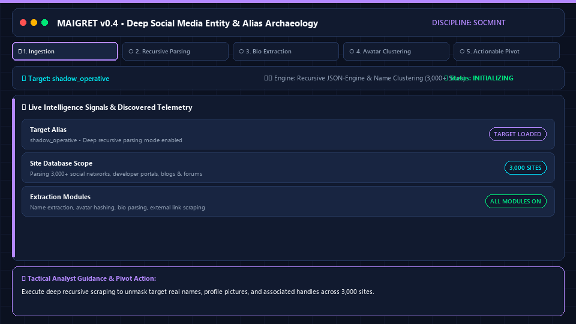

*Figure 4.2: Recursive social profile scraping, bio tokenization, and avatar perceptual hash clustering utilizing Maigret.*

</div>

#### Step-by-Step Analytical Breakdown:
1. **Target Handle Ingestion:** Loads the identified handle (`shadow_operative`) and activates deep recursive parsing across 3,000+ social and developer sites.
2. **Real Name & Bio Unmasking:** Extracts employee real names (`S. Vance`), corporate locations (`Reston, VA`), and career specialties from developer bios.
3. **Secondary Alias Recovery:** Parses external links in bios to recover secondary handles (`@svance_dev`) and personal portfolio domains.
4. **Avatar pHash Clustering:** Computes perceptual image hashes to mathematically prove that identical avatars are shared across disparate accounts.
5. **Infrastructure Pivot:** Pivots discovered domains and secondary handles into WHOIS and DNS history databases.

```bash
# Installation via pipx
pipx install maigret

# Deep search with metadata parsing and report export
maigret username123 -a --parse-all --html --json
```

#### 3. WhatsMyName
High-speed Python engine querying the curated WhatsMyName JSON signature database (maintained by WebBreacher):

```bash
git clone https://github.com/WebBreacher/WhatsMyName.git
cd WhatsMyName
pip3 install -r requirements.txt
python3 whatsmyname.py -u username123
```

#### 4. Blackbird
Fast async OSINT tool written in Python that searches for accounts by username across 570+ websites with low false-positive rates:

```bash
git clone https://github.com/p1ngul1n0/blackbird
cd blackbird
pip install -r requirements.txt
python blackbird.py -u username123
```

### 4.2 Web-Based Username Portals:
* **WhatsMyName Web (`whatsmyname.app`):** Web client interface for rapid querying across 600+ platforms.
* **KnowEm / Namechk / NameCheckup:** Brand protection and domain availability lookup engines that verify handle availability across major registries.
* **UserSearch (`usersearch.org`):** Deep search engine for usernames, dating profiles, gaming accounts, and crypto forums.
* **Instant Username Search:** Real-time JavaScript search engine checking username availability across 100+ social networks simultaneously.

---

## 5. Email OSINT

Email addresses (`user@example.com`) are unique digital identifiers. Investigating an email address enables analysts to pivot across enterprise domains, breach records, social media profiles, and cloud services.

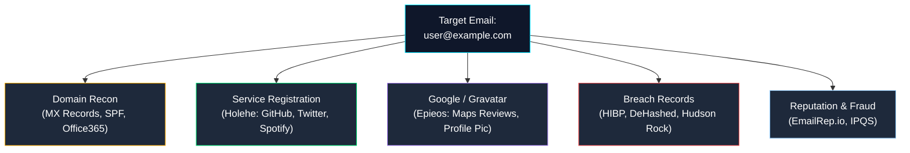
```mermaid

flowchart TD
    E["Target Email:<br>user@example.com"]
    E --> D["Domain Recon<br>(MX Records, SPF, Office365)"]
    E --> H["Service Registration<br>(Holehe: GitHub, Twitter, Spotify)"]
    E --> G["Google / Gravatar<br>(Epieos: Maps Reviews, Profile Pic)"]
    E --> B["Breach Records<br>(HIBP, DeHashed, Hudson Rock)"]
    E --> R["Reputation & Fraud<br>(EmailRep.io, IPQS)"]

    style E fill:#0f172a,stroke:#00e5ff,color:#fff
    style D fill:#1e293b,stroke:#ffab00,color:#fff
    style H fill:#1e293b,stroke:#00e676,color:#fff
    style G fill:#1e293b,stroke:#b388ff,color:#fff
    style B fill:#1e293b,stroke:#ff5252,color:#fff
    style R fill:#1e293b,stroke:#90caf9,color:#fff
```

### 5.1 Automated Tooling:

#### 1. Holehe
Checks if an email is registered on over 120 services (Twitter, Instagram, GitHub, Discord, Adobe, Office365) by leveraging password reset and signup endpoints without alerting the target:

<div align="center">

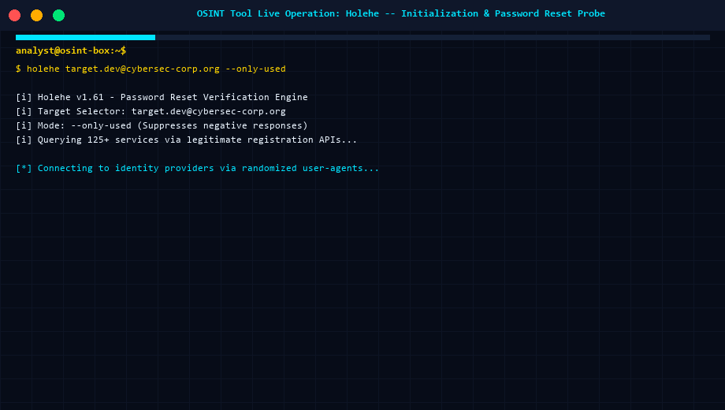

*Figure 5.1: Non-intrusive service registration verification across 120+ platforms utilizing Holehe.*

</div>

```bash
# Installation
pipx install holehe

# Execute non-intrusive service enumeration
holehe user@example.com
```

##### 🔍 Detailed Operational Walkthrough & Output Analysis:
1. **Target Initialization (`analyst@osint-box:~$ holehe target.dev@cybersec-corp.org --only-used`)**:
   - The investigator supplies a corporate or personal email address (`target.dev@cybersec-corp.org`).
   - The `--only-used` parameter suppresses hundreds of negative results, displaying only platforms where the target email is actively registered.

2. **Under-the-Hood Detection Mechanics**:
   - Traditional credential checking requires entering a password, which triggers intrusion alerts, two-factor authentication (2FA) prompts, or account lockouts.
   - **Zero-Intrusion Password Reset Probing:** Holehe queries the legitimate *forgot password* or *account creation* APIs of 120+ web services.
   - When an email is queried against a platform (e.g., Twitter or Spotify), the server response differentiates between:
     * *"An email has been sent to reset your password"* $\implies$ Account **EXISTS** (`[+]`).
     * *"No account found with this email address"* $\implies$ Account **DOES NOT EXIST** (`[-]`).
   - No notification or security email is triggered to the target's inbox on modern JSON endpoint checks, preserving absolute investigator OPSEC.

3. **Interpreting Discovered Assets in the GIF**:
   - **Enterprise Identity Disclosure:** Confirmed Microsoft / Office 365 registration reveals the underlying Azure AD Tenant ID and confirms corporate employment at `cybersec-corp.org`.
   - **Google Gaia ID Extraction:** The Google account binding returns the internal Gaia ID (`10492849182740182`). This unique numeric identifier links directly to public Google Maps reviews, posted photos, and Google Calendar scheduling links.
   - **Telephone Number Mask Clues:** The PayPal and Twitter endpoints return masked phone hints (e.g., `+1 (***) ***-1284`). This reduces the search space for phone number intelligence from 10 digits down to a handful of known area codes.

4. **Forensic Pivoting Next Steps**:
   - **Pivot to Phone OSINT:** Cross-reference the last 4 digits (`1284`) against corporate employee directories, LinkedIn contact cards, and PhoneInfoga scans.
   - **Pivot to Breach Records:** Submit the email address to DeHashed and HaveIBeenPwned to discover historical plaintext passwords, salted hashes, and compromised account databases.

#### 2. Epieos (`epieos.com`)
Pioneering web service that inspects Google account metadata tied to an email address. Uncovers linked Google Reviews, Google Maps location edits, profile avatars, and calendar availability.

#### 3. EmailRep (`emailrep.io`)
Queries community telemetry and risk databases to assess whether an email address is suspicious, has been involved in malicious campaigns, is a disposable address, or has active social presence:

```bash
# Query EmailRep API via curl
curl -s "https://emailrep.io/user@example.com" | jq .
```

#### 4. Corporate Email Harvesting:
* **Hunter.io:** Analyzes corporate email structures (e.g., `{first}.{last}@company.com`) and indexes publicly visible corporate addresses.
* **Phonebook.cz:** Free intelligence portal powered by Intelligence X containing billions of indexed email addresses, URLs, and domains.
* **VoilaNorbert / Snov.io / RocketReach / Clearbit:** Enterprise lead verification platforms mapping employee roles and direct email routes.

---

## 6. Email Header Analysis

In phishing, Business Email Compromise (BEC), and spoofing investigations, the visible `From:` address in an email client is easily forged. Dissecting raw RFC 5322 headers reveals the true cryptographic routing chain and originating infrastructure.

### 6.1 Anatomical Dissection of Email Headers:

```text
Received: from mail-relay.attacker.com (mail-relay.attacker.com [198.51.100.45])
    by mx.google.com with ESMTPS id a12-20020a056...
    for <victim@example.com>; Mon, 14 Sep 2026 10:14:22 -0700 (PDT)
Authentication-Results: mx.google.com;
    dkim=pass header.i=@legitimate-bank.com;
    spf=fail (google.com: domain of alert@attacker.com does not designate 198.51.100.45 as permitted sender)
Return-Path: <bounce@attacker.com>
Message-ID: <20260914171422.12345@attacker.com>
From: Security Alert <alert@legitimate-bank.com>
Reply-To: credential-harvest@phishing-relay.org
X-Originating-IP: [203.0.113.88]
```

### 6.2 Key Header Fields to Inspect:
1. **`Received:` (Bottom to Top):** Trace the path of Mail Transfer Agents (MTAs). The bottom-most `Received:` line represents the original sending mail server or originating client.
2. **`Authentication-Results:`:** Shows whether the message passed **SPF**, **DKIM**, and **DMARC** validation checks at the destination mail gateway.
3. **`SPF (Sender Policy Framework):`** Checks whether the sending IP address is listed in the sender domain's DNS `v=spf1` TXT record.
4. **`DKIM (DomainKeys Identified Mail):`** Uses cryptographic public-key cryptography to verify that the message body was not altered in transit.
5. **`DMARC (Domain-based Message Authentication, Reporting, and Conformance):`** Tells receiving servers how to handle failures (`p=none`, `p=quarantine`, `p=reject`).
6. **`X-Originating-IP:`:** Exposes the true client IP address behind webmail gateways (Outlook Web Access, Roundcube).

### 6.3 Header Analysis Engines:
* **MXToolbox Header Analyzer:** Parses raw email headers into structured tables with hop delay timings and DNS checks.
* **Google Admin Toolbox Messageheader:** Visualizes delivery hops and latency across Google infrastructure.
* **Microsoft Message Header Analyzer (MHA):** Official tool for parsing Exchange and Office 365 routing telemetry.
* **Mailheader.org / CentralOps:** Instant online header parsers highlighting IP geolocation and authentication failures.

---

## 7. Phone Number OSINT

Phone numbers adhere to international telecommunication standards (ITU E.164). While a lookup result should never be treated as conclusive legal proof of identity without corroboration, telecom OSINT reveals carrier routing, line types, and public associations.

### 7.1 Key Telecommunication Pivot Metrics:
* **Number Format:** E.164 standard (`+[Country Code][Subscriber Number]`), RFC 3966 URI formatting.
* **Line Type:** Distinguishes fixed line (landline), mobile cellular, and **VoIP (Voice over IP)**. VoIP numbers (Twilio, Google Voice, Skype) indicate virtual or temporary burner numbers.
* **Original Network Operator (MNO) vs. Current Carrier:** Identifies Mobile Number Portability (MNP) mutations where a user transferred their number to a new carrier.
* **HLR (Home Location Register) Status:** Verifies whether the SIM card is currently active, connected to a tower, or roaming.

### 7.2 Core Tooling:

#### 1. PhoneInfoga
Advanced Python and Go utility scanning phone numbers using international numbering plan databases, search engine footprints, and NumVerify APIs:

```bash
# Installation
curl -sSL https://raw.githubusercontent.com/sundowndev/phoneinfoga/master/support/scripts/install | bash
sudo mv ./phoneinfoga /usr/local/bin/

# CLI Scan on international number
phoneinfoga scan -n "+14155552671"

# Launch local investigative web interface
phoneinfoga serve -p 8080
```

#### 2. Caller ID Crowdsourced Portals:
* **Truecaller / Whoscall / Sync.ME:** Crowdsourced address book databases that reveal registered subscriber names and spam ratings.
* **NumVerify / Veriphone / AbstractAPI:** REST APIs providing carrier name, country code, line type, and telecom validation.
* **ThatsThem / NumLookup:** Reverse phone directories querying public phonebooks and marketing registries.

---

---

## Module 3: Domain, Network and Attack Surface Reconnaissance

> **Core Focus:** Passive DNS aggregation, Certificate Transparency mining, Internet-wide port scanning (Shodan/Censys), and code leak excavation.

## 8. Domain OSINT

Domain names (`example.com`) are the central anchors of internet infrastructure. Investigating a domain reveals DNS servers, registrar details, historical hosting providers, linked email servers, and corporate subsidiaries.

### 8.1 Primary Domain Investigation Utilities:
* **WHOIS / RDAP:** Queries top-level registrars for ownership, administrative contacts, creation dates, and status codes (`clientTransferProhibited`).
* **SecurityTrails:** The industry benchmark for historical DNS data, recording past A, AAAA, MX, and NS records spanning over a decade.
* **ViewDNS.info:** Swiss Army knife providing reverse IP lookups, reverse WHOIS, DNS record auditing, and port scans.
* **DNSDumpster:** Free domain research tool generating graphical network topology diagrams of discovered subdomains and mail servers.
* **crt.sh:** Search engine parsing public Certificate Transparency logs for SSL/TLS certificates issued to any domain or wildcard.
* **DomainTools / RiskIQ (Microsoft Defender EASM):** Enterprise threat infrastructure mapping correlating shared SSL certificates and IP blocks.

---

## 9. DNS OSINT

The Domain Name System (DNS) translates human-readable hostnames into machine-routable IP addresses. Querying authoritative nameservers provides critical passive and semi-passive intelligence regarding enterprise architecture.

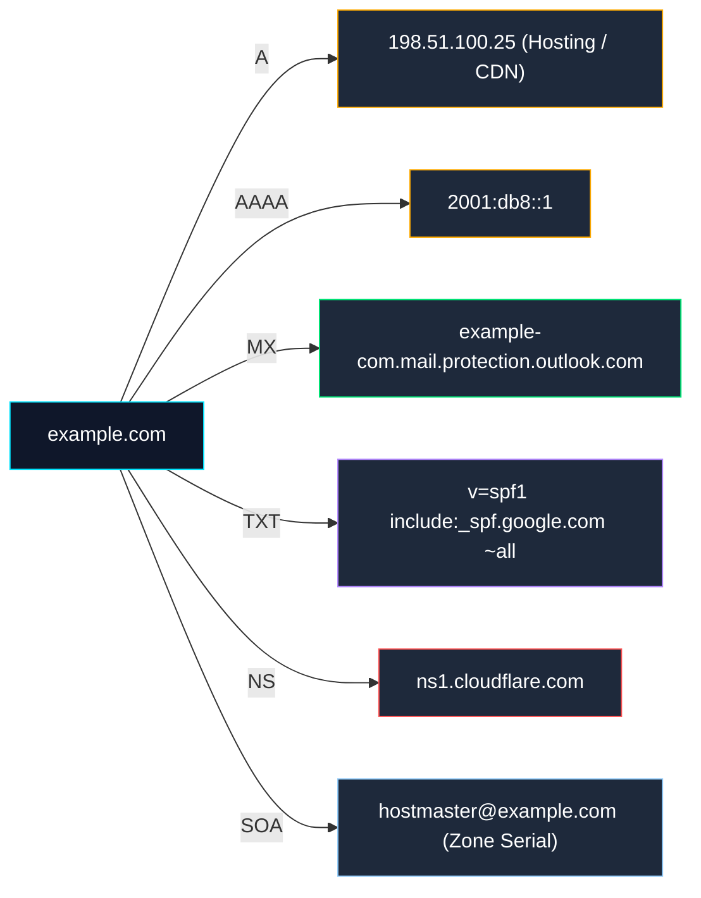
```mermaid

flowchart LR
    Target["example.com"]
    Target -->|"A"| IPv4["198.51.100.25 (Hosting / CDN)"]
    Target -->|"AAAA"| IPv6["2001:db8::1"]
    Target -->|"MX"| Mail["example-com.mail.protection.outlook.com"]
    Target -->|"TXT"| SPF["v=spf1 include:_spf.google.com ~all"]
    Target -->|"NS"| Nameserver["ns1.cloudflare.com"]
    Target -->|"SOA"| Admin["hostmaster@example.com (Zone Serial)"]

    style Target fill:#0f172a,stroke:#00e5ff,color:#fff
    style IPv4 fill:#1e293b,stroke:#ffab00,color:#fff
    style IPv6 fill:#1e293b,stroke:#ffab00,color:#fff
    style Mail fill:#1e293b,stroke:#00e676,color:#fff
    style SPF fill:#1e293b,stroke:#b388ff,color:#fff
    style Nameserver fill:#1e293b,stroke:#ff5252,color:#fff
    style Admin fill:#1e293b,stroke:#90caf9,color:#fff
```

### 9.1 Standard DNS CLI Commands:

```bash
# 1. Query IPv4 (A) and IPv6 (AAAA) records
dig +short A example.com
dig +short AAAA example.com

# 2. Query Mail Exchange (MX) records (Reveals email provider: Google, Microsoft, Proofpoint)
dig +short MX example.com

# 3. Query Authoritative Nameservers (NS)
dig +short NS example.com

# 4. Query TXT records (Extracts SPF, domain verification tokens, DMARC pointers)
dig +short TXT example.com
dig +short TXT _dmarc.example.com

# 5. Query Start of Authority (SOA) (Reveals primary master nameserver and admin email)
dig +short SOA example.com

# 6. Test for Misconfigured DNS Zone Transfer (AXFR)
dig axfr @ns1.example.com example.com
```

### 9.2 DNS Diagnostics Portals:
* **DNSViz (`dnsviz.net`):** Visualizes the entire cryptographic DNSSEC chain of trust, highlighting broken parent-child delegation chains.
* **IntoDNS:** Rapid health checker validating NS record consistency, SOA serial numbers, and mail exchange responsiveness.
* **HackerTarget DNS Tools:** Free API suite for fast reverse DNS lookups, ASNs, and shared DNS servers.

---

## 10. Subdomain Enumeration

Organizations rarely expose vulnerabilities on their primary corporate web homepage (`example.com`). Instead, compromises occur through forgotten development testbeds, staging servers, obsolete VPN portals, and internal documentation sites (`dev-api.example.com`, `vpn-legacy.example.com`, `jira.corp.example.com`).

<div align="center">

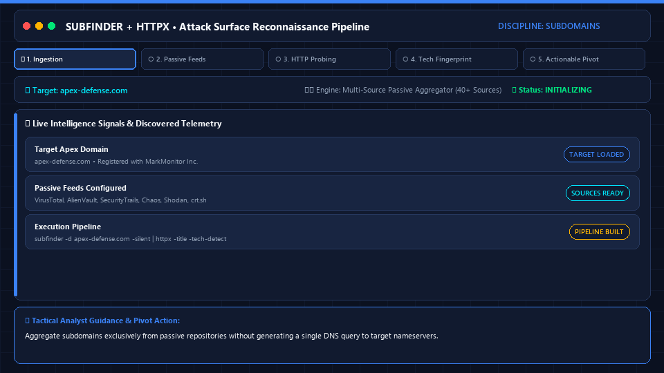

*Figure 10.1: Chaining passive subdomain discovery into high-speed active HTTP probing.*

</div>

### 10.1 Passive Subdomain Toolchain:

#### 1. OWASP Amass
The industry benchmark for attack surface mapping and asset discovery:

```bash
# Passive enumeration without sending packets to target
amass enum -passive -d example.com -o amass_subs.txt
```

#### 2. Subfinder (ProjectDiscovery)
Blazing-fast passive subdomain discovery tool querying over 40 passive data sources (Chaos, Shodan, Censys, OTX):

```bash
# Passive scan across all passive sources
subfinder -d example.com -all -silent -o subfinder_subs.txt
```

#### 3. Assetfinder
Lightweight Go utility designed to find domains and subdomains related to a given domain:

```bash
assetfinder --subs-only example.com > assetfinder_subs.txt
```

#### 4. Findomain
High-speed Rust binary querying multiple public APIs and web archives:

```bash
findomain -t example.com -u findomain_subs.txt
```

##### 🔍 Detailed Operational Walkthrough & Output Analysis:
1. **Pipeline Invocation (`subfinder -d megacorp-defense.com -all -silent | httpx ...`)**:
   - **Subfinder** passively queries over 40 distinct data sources (including Certificate Transparency logs via `crt.sh`, AlienVault OTX, Chaos ProjectDiscovery, and historical web archives).
   - The `-silent` flag strips ANSI banners and status output, streaming clean domain hostnames directly down the Unix pipe (`|`).
   - **HTTPX** consumes the stream in real-time, executing high-concurrency HTTP/HTTPS connection probes with automated TLS handshakes.
   - Parameters `-title`, `-status-code`, `-tech-detect`, and `-follow-redirects` enrich every responding host with HTTP response codes, page titles, and fingerprinted technologies.

2. **Interpreting Discovered Endpoints in the GIF**:
   - **`[200 OK] vpn.megacorp-defense.com [Pulse Connect Secure]`**: Identifies an external SSL-VPN access portal. VPN appliances are prime targets for threat actors seeking Initial Access (MITRE ATT&CK T1190).
   - **`[403 FOR] jenkins.internal.megacorp-defense.com`**: Discovers an internal continuous integration portal that leaked onto the public DNS zone. Even though it returns HTTP 403 Forbidden, the server banner reveals `Jenkins 2.387`, allowing the analyst to verify if known authorization bypass vulnerabilities exist.
   - **`[200 OK] staging.megacorp-defense.com [PHP 8.1, Laravel]`**: Development and staging environments frequently run in debug mode (`APP_DEBUG=true`) and often lack the web application firewall (WAF) protections applied to the main production domain.
   - **`[200 OK] grafana.telemetry.megacorp-defense.com [Grafana v9.4.1]`**: Unauthenticated metrics and monitoring dashboards provide operational topology, internal IP schemes, and server performance data.

3. **Attack Surface Management Next Steps**:
   - **Direct Origin IP Identification:** Compare the IP addresses of staging subdomains against the cloud CDN (e.g., Cloudflare) protecting the root domain to bypass CDN filtering.
   - **Automated Vulnerability Scanning:** Pipe the live targets into Nuclei (`cat live_hosts.txt | nuclei -t cves/ -severity critical,high`) to immediately test for critical unpatched vulnerabilities.

#### 5. Unified Passive Aggregation Pipeline:

```bash
# Combine and de-duplicate across all passive tools
cat amass_subs.txt subfinder_subs.txt assetfinder_subs.txt findomain_subs.txt | sort -u > all_subdomains.txt

# Probe for live HTTP/HTTPS services using httpx
cat all_subdomains.txt | httpx -silent -status-code -title -o live_services.txt
```

---

## 11. IP Address OSINT

Given a raw IPv4 or IPv6 address (e.g., `8.8.8.8` or `198.51.100.14`), investigators determine ownership, hosting provider, Autonomous System Number (ASN), geographical location, reputation, and exposed services.

### 11.1 Key Investigative Questions:
1. **Who owns this IP?** Which Organization, ISP, or Hosting Provider holds the allocation?
2. **Which ASN (Autonomous System Number) routes this prefix?**
3. **What is the IP's physical jurisdiction and registration country?**
4. **What services, ports, and software daemons are exposed to the public internet?**
5. **Has this IP address been flagged for malicious activity (brute-forcing, malware C2, spam)?**
6. **What SSL/TLS certificates have been observed on this address?**
7. **What historical domains resolved to this IP address?**

### 11.2 Core IP Telemetry Engines:
* **BGPView (`bgpview.io`):** The definitive portal for Autonomous System (AS) and BGP prefix routing, upstream providers, and IXP peers.
* **Hurricane Electric BGP Toolkit (`bgp.he.net`):** Comprehensive routing visualization, DNS records, and IP WHOIS.
* **IPinfo.io:** High-accuracy IP geolocation, ASN assignment, company ownership, and VPN/Tor/Proxy detection flags.
* **AbuseIPDB:** Crowdsourced database where system administrators report malicious IPs engaged in attacks.
* **Spur (`spur.us`):** Specialized intelligence provider tracking commercial VPN services, residential proxies, and bulletproof hosting.
* **Regional Internet Registries (RIRs):** Querying authoritative registries directly:
  * **ARIN:** North America & parts of the Caribbean
  * **RIPE NCC:** Europe, Central Asia, and the Middle East
  * **APNIC:** Asia-Pacific region
  * **AFRINIC:** African continent
  * **LACNIC:** Latin America and the Caribbean

---

## 12. Shodan

Shodan is the world's first search engine for Internet-connected devices. Rather than crawling web pages, Shodan continuously sends probes across the entire IPv4 address space, interrogating ports 1 through 65535 and indexing raw banners returned by daemons, web servers, industrial control systems (ICS/SCADA), IoT cameras, and database services.

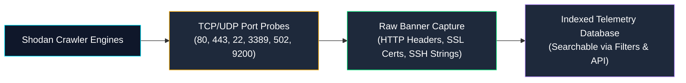
```mermaid

flowchart LR
    S["Shodan Crawler Engines"] --> P["TCP/UDP Port Probes<br>(80, 443, 22, 3389, 502, 9200)"]
    P --> B["Raw Banner Capture<br>(HTTP Headers, SSL Certs, SSH Strings)"]
    B --> I["Indexed Telemetry Database<br>(Searchable via Filters & API)"]

    style S fill:#0f172a,stroke:#00e5ff,color:#fff
    style P fill:#1e293b,stroke:#ffab00,color:#fff
    style B fill:#1e293b,stroke:#00e676,color:#fff
    style I fill:#1e293b,stroke:#b388ff,color:#fff
```

### 12.1 High-Yield Shodan Search Filters:

| Filter | Example Query | Purpose & Analytical Mechanics |
| :--- | :--- | :--- |
| `net:` | `net:198.51.100.0/24` | Scans all discovered banners across a specific CIDR subnetwork block |
| `org:` | `org:"Target Corporation"` | Filters hosts by the registered BGP organization name |
| `hostname:` | `hostname:example.com` | Matches systems whose reverse DNS matches a specific domain string |
| `ssl:` | `ssl:"example.com"` | Matches hosts presenting certificates containing the target domain |
| `ssl.cert.subject.cn:` | `ssl.cert.subject.cn:example.com` | Matches the Common Name (CN) field of leaf SSL/TLS certificates |
| `port:` | `port:3389,8080,445` | Restricts search results to specific open network ports |
| `product:` | `product:"Apache httpd"` | Identifies hosts running specific server software daemons |
| `version:` | `version:"2.4.49"` | Identifies hosts running specific software versions (useful for CVE triage) |
| `has_vuln:true` | `has_vuln:true org:"Target"` | Surfaces hosts with confirmed unpatched CVE vulnerabilities |
| `http.title:` | `http.title:"Dashboard"` | Searches HTML `<title>` strings returned on web ports |

### 12.2 Shodan CLI Workflow:

<div align="center">

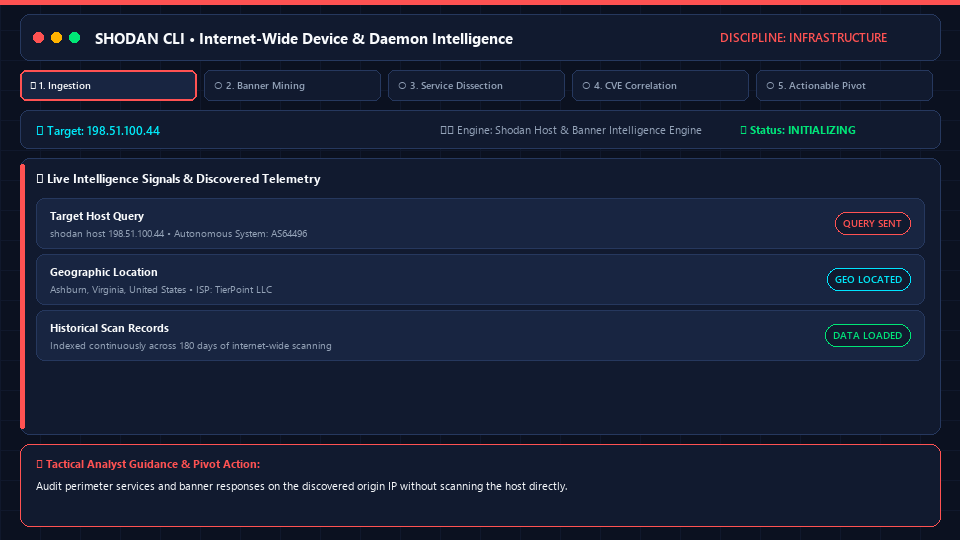

*Figure 12.1: Discovering perimeter assets, exposed services, and unpatched CVEs via the Shodan CLI.*

</div>

```bash
# Initialize Shodan API Key
shodan init YOUR_SHODAN_API_KEY

# Query all exposed ports and banners for a single IP address
shodan host 198.51.100.14

# Search for open ElasticSearch instances lacking authentication
shodan search "port:9200 json:"cluster_name"" --fields ip_str,port,org

# Count total global exposures of an unpatched CVE
shodan count "vuln:CVE-2021-44228"
```

##### 🔍 Detailed Operational Walkthrough & Output Analysis:
1. **Target Query (`shodan search --fields ip_str,port,org,hostnames 'org:"Megacorp Defense" ...'`)**:
   - Queries Shodan's global repository of 4.2+ billion scanned IPv4 addresses for systems registered to the target organization.
   - Specifying `--fields ip_str,port,org,hostnames` yields clean, tabular intelligence without unstructured banner clutter.

2. **Host Telemetry Dissection (`shodan host 198.51.100.14`)**:
   - Interrogates all stored telemetry for the discovered IP address `198.51.100.14` (`vpn.megacorp-defense.com`).
   - Retrieves geographic geolocation (Ashburn, VA), ASN (AS64496), open listening ports (80, 443, 8443), and the complete X.509 SSL Certificate chain.

3. **Vulnerability Correlation & Exploit Assessment**:
   - Shodan automatically correlates detected service banners against the National Vulnerability Database (NVD) and the CISA Known Exploited Vulnerabilities (KEV) catalog.
   - **`CVE-2019-11510` (CVSS 10.0):** An unpatched Pulse Secure SSL-VPN path traversal flaw allowing unauthenticated remote attackers to read arbitrary files, including `/etc/passwd` and plaintext VPN session caches containing active corporate credentials.
   - **`CVE-2023-46805` (CVSS 8.2):** An authentication bypass vulnerability affecting Ivanti Connect Secure gateways.

4. **Defensive Remediation Actions**:
   - Immediately alert the client's Security Operations Center (SOC) to isolate IP `198.51.100.14` at the perimeter firewall.
   - Revoke all active session tokens and emergency-patch the VPN appliance firmware to the latest vendor release.

---

## 13. Censys

<div align="center">

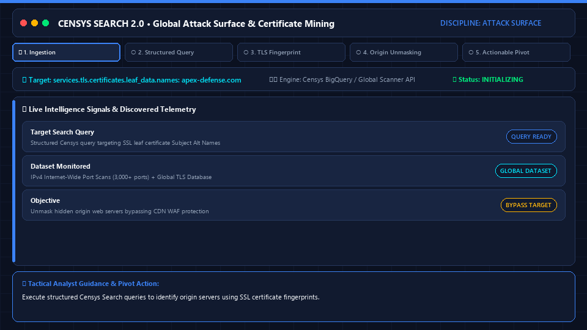

*Figure 13.1: Global TLS leaf certificate pivoting and origin web server unmasking utilizing Censys Search 2.0.*

</div>

#### Step-by-Step Analytical Breakdown:
1. **Structured TLS Querying:** Uses `services.tls.certificates.leaf_data.names: apex-defense.com` to match all servers presenting the organization's SSL certificate.
2. **Origin Server Unmasking:** Distinguishes between Cloudflare/Akamai edge proxies and naked origin IP addresses hosting identical certificates.
3. **Protocol & Port Audit:** Dissects exposed services on discovered origin hosts, identifying active debuggers (Python Werkzeug on port 8080) and SSH daemons.
4. **JARM Fingerprint Pivoting:** Extracts cryptographic TLS client/server JARM hashes to locate sibling test servers across the provider's IP netblock.
5. **Mitigation Blueprint:** Restricts port 8080/443 ingress at the network firewall exclusively to authorized CDN proxy IP ranges.

Censys provides deep attack surface management and internet scanning capabilities. Created by researchers at the University of Michigan, Censys performs continuous protocol dissections across millions of hosts and certificates.

### 13.1 Key Capabilities:
* **Host & Service Profiling:** Performs protocol-level handshakes on dozens of application protocols (HTTP, TLS, SSH, SMB, Telnet, RDP).
* **Certificate Discovery:** Maintains the world's most exhaustive repository of X.509 certificates, enabling analysts to trace enterprise infrastructure through shared TLS certificates.
* **Censys Search Query Syntax:**
  ```text
  services.service_name: "HTTP" and services.banner: "nginx"
  services.tls.certificates.leaf_data.subject.common_name: "example.com"
  location.country: "United States" and autonomous_system.asn: 15169
  ```

---

## 14. Certificate Transparency

Certificate Transparency (CT) is an open cryptographic framework designed to audit and monitor the issuance of SSL/TLS certificates. Whenever any Certificate Authority (CA) issues a certificate, it must cryptographically log the certificate to public append-only CT logs.

### 14.1 Investigative Value:
* **Real-Time Discovery:** Internal development servers, staging environments, and subsidiary domains (`staging-auth.example.com`, `vpn-us-west.example.com`) are logged publicly the instant an SSL certificate is generated.
* **Historical Certificate Mining:** Reveals historical hostnames, retired infrastructure, and shared cryptographic keys.

### 14.2 Querying CT Logs:
* **crt.sh:** The primary web and API interface for querying CT logs:
  ```bash
  # Query crt.sh API via curl and parse unique hostnames with jq
  curl -s "https://crt.sh/?q=%.example.com&output=json" |     jq -r '.[].name_value' |     sed 's/\*\.//g' |     sort -u > ct_subdomains.txt
  ```
* **CertSpotter / SSLMate:** Real-time CT log monitoring alerting administrators the moment a certificate is issued for their domain.

---

## 15. Website Technology OSINT

Fingerprinting the technology stack powering a target web application reveals underlying frameworks, CMS engines, analytics scripts, and hosting infrastructure—highlighting known vulnerabilities.

### 15.1 Core Tooling:
* **Wappalyzer:** Software profiler detecting over 2,500 web technologies (CMS, web frameworks, e-commerce platforms, JavaScript libraries, server software):
  ```bash
  # CLI execution
  wappalyzer https://example.com
  ```
* **BuiltWith (`builtwith.com`):** Comprehensive historical technology profiler tracking tracking codes, CDN usage, advertising tags, and historical tech migrations.
* **WhatRuns:** Lightweight browser extension and analysis tool detailing frameworks, fonts, and WordPress plugins.
* **SecurityHeaders (`securityheaders.com`):** Audits HTTP security response headers (`Content-Security-Policy`, `Strict-Transport-Security`, `X-Frame-Options`).
* **WhatCMS (`whatcms.org`):** Accurately identifies over 400 content management systems (WordPress, Drupal, Joomla, Ghost).

---

## 16. URL Analysis

Analyzing suspicious URLs without exposing your own infrastructure is critical during phishing, fraud, and malware investigations.

### 16.1 Automated URL Sandboxes:
* **urlscan.io:** Submits URLs to a sandboxed headless browser, recording outbound HTTP requests, loaded DOM resources, JavaScript executions, TLS handshakes, and capturing a full-page screenshot.
  ```bash
  # Submit URL to urlscan.io via API
  curl -s -X POST "https://urlscan.io/api/v1/scan/"     -H "Content-Type: application/json"     -H "API-Key: $URLSCAN_API_KEY"     -d '{"url": "https://suspicious-domain.com", "visibility": "public"}'
  ```
* **VirusTotal:** Aggregates URL reputation data across 70+ antivirus and web categorization scanners.
* **Google Safe Browsing:** Authoritative database flagging malware, social engineering, and unwanted software distribution.
* **PhishTank / OpenPhish:** Real-time community feeds tracking active phishing landing pages.
* **Hybrid Analysis / ANY.RUN:** Interactive malware sandboxes executing suspicious URLs in live virtual machines to record second-stage payload drops.

---

---

## Module 4: Cyber Threat Intelligence, Dark Web and Crypto

> **Core Focus:** Malware IoC correlation, Tor (.onion) extortion monitoring, cryptocurrency ledger tracing, and MITRE ATT&CK / MISP alignment.

## 17. Malware & Cyber Threat Intelligence OSINT

Cyber Threat Intelligence (CTI) platforms correlate technical Indicators of Compromise (IOCs)—such as IPs, domains, hashes, and mutexes—to identify threat actors, campaigns, and malware families.

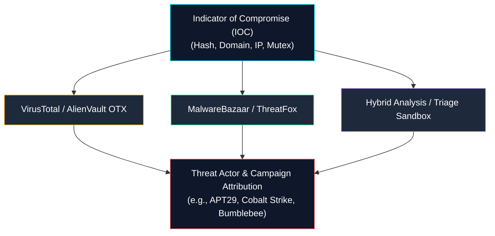
```mermaid

flowchart TD
    IOC["Indicator of Compromise (IOC)<br>(Hash, Domain, IP, Mutex)"]
    IOC --> VT["VirusTotal / AlienVault OTX"]
    IOC --> MB["MalwareBazaar / ThreatFox"]
    IOC --> HA["Hybrid Analysis / Triage Sandbox"]
    
    VT --> CORR["Threat Actor & Campaign Attribution<br>(e.g., APT29, Cobalt Strike, Bumblebee)"]
    MB --> CORR
    HA --> CORR

    style IOC fill:#0f172a,stroke:#00e5ff,color:#fff
    style VT fill:#1e293b,stroke:#ffab00,color:#fff
    style MB fill:#1e293b,stroke:#00e676,color:#fff
    style HA fill:#1e293b,stroke:#b388ff,color:#fff
    style CORR fill:#0f172a,stroke:#ff5252,color:#fff
```

### 17.1 Major Threat Intelligence Platforms:
* **Abuse.ch Ecosystem:**
  * **MalwareBazaar:** Open repository for sharing and analyzing verified malware samples.
  * **ThreatFox:** Real-time database for sharing technical IOCs (C2 IPs, domains, botnet controllers).
  * **URLhaus:** Focused on tracking malicious URLs distributing malware payloads.
* **AlienVault OTX (Open Threat Exchange):** Global crowd-sourced computer-aided threat intelligence platform providing community "pulses."
* **VX-Underground:** The largest collection of malware source code, samples, and historical papers on the internet.
* **ThreatMiner / Pulsedive:** CTI search engines correlating domains, whois data, and malware hashes.

---

## 18. Hash OSINT

Cryptographic hashes (MD5, SHA1, SHA256) serve as unique mathematical fingerprints of malicious binaries, scripts, and documents.

### 18.1 Key Hash Algorithms:
* **MD5 (128-bit):** Legacy algorithm prone to collisions, but widely indexed across older threat databases.
* **SHA1 (160-bit):** Deprecated for digital signatures, but universal across legacy antivirus logs.
* **SHA256 (256-bit):** The modern cybersecurity standard for immutable file identification.

### 18.2 Investigation Workflow:
Querying a hash across VirusTotal, MalwareBazaar, or Intezer reveals:
1. First and last seen submission timestamps.
2. Original compiled file name and portable executable (PE) headers.
3. Antivirus detection names (e.g., `Trojan.Bumblebee`, `Win64.CobaltStrike`).
4. Outbound C2 network connections made during sandbox execution.

---

## 19. Social Media Intelligence (SOCMINT)

Social Media Intelligence (SOCMINT) involves collecting, analyzing, and verifying information from social platforms (X/Twitter, LinkedIn, Reddit, Facebook, Telegram, Discord, TikTok, Instagram).

### 19.1 Primary SOCMINT Utilities:
* **Social Searcher:** Real-time search engine monitoring keywords and user sentiments across multiple social networks simultaneously.
* **Social Blade:** Analyzes statistical growth, follower anomalies, and engagement metrics on YouTube, Twitter, and Instagram.
* **Twemex / Twiiit:** Focused tools for parsing X/Twitter timelines and historical high-engagement posts.
* **Hoaxy / Botometer:** Academic tools measuring bot activity, coordinated inauthentic behavior, and disinformation propagation.

---

## 20. Instagram OSINT

Instagram investigations present unique challenges due to strict API restrictions and aggressive anti-scraping mechanisms.

### 20.1 Practical Investigation Heuristics:
1. **Google & Bing Advanced Dorking:**
   ```text
   site:instagram.com "Target Full Name" OR "Target Alias"
   site:instagram.com inurl:p/ "Target Keyword"
   ```
2. **Web Viewer Proxies:** Platforms like Picuki and Imginn allow viewing public posts, reels, and stories without authenticating via a personal Instagram account.
3. **Visual Reverse Pivots:** Download high-resolution profile avatars and feed photographs, then submit them to **Yandex Images** or **FaceCheck.ID** to discover secondary accounts across VK, LinkedIn, and dating apps.

---

## 21. LinkedIn OSINT

LinkedIn provides rich corporate and human organizational intelligence. Mapping an enterprise on LinkedIn reveals internal reporting hierarchies, administrative roles, technology stacks, and direct employee targets for authorized security assessments.

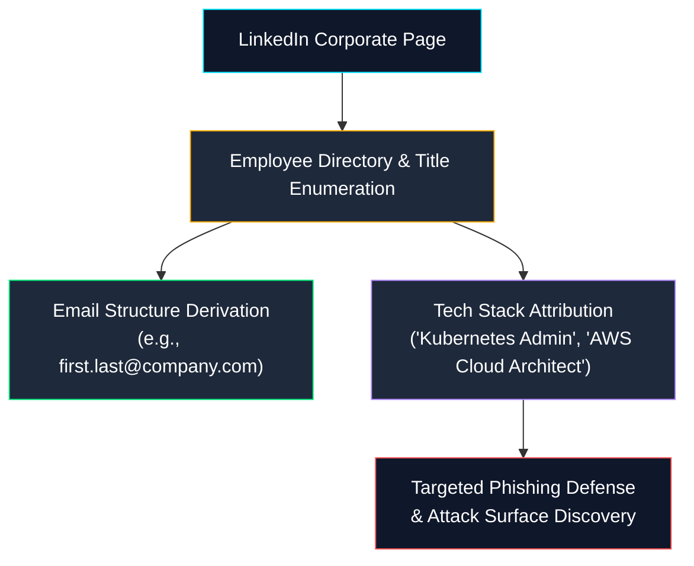
```mermaid

flowchart TD
    LI["LinkedIn Corporate Page"] --> EMP["Employee Directory & Title Enumeration"]
    EMP --> PAT["Email Structure Derivation<br>(e.g., first.last@company.com)"]
    EMP --> ROLES["Tech Stack Attribution<br>('Kubernetes Admin', 'AWS Cloud Architect')"]
    ROLES --> SEC["Targeted Phishing Defense<br>& Attack Surface Discovery"]

    style LI fill:#0f172a,stroke:#00e5ff,color:#fff
    style EMP fill:#1e293b,stroke:#ffab00,color:#fff
    style PAT fill:#1e293b,stroke:#00e676,color:#fff
    style ROLES fill:#1e293b,stroke:#b388ff,color:#fff
    style SEC fill:#0f172a,stroke:#ff5252,color:#fff
```

### 21.1 Core Investigation Flow:
1. **Search Dorking to Bypass LinkedIn Rate-Limits:**
   ```text
   site:linkedin.com/in/ "Target Corporation" "DevOps Engineer"
   site:linkedin.com/in/ "Target Corporation" "CISO" OR "Security Analyst"
   ```
2. **Pivoting to Corporate Footprints:**
   * Combining LinkedIn profile data with **Epieos**, **RocketReach**, **Hunter.io**, and **Apollo** correlates personal names with active corporate email inboxes and direct telephone numbers.
   * Mapping job descriptions often exposes internal tooling (e.g., "Responsible for maintaining internal Jira on AWS EC2, Splunk SIEM, and Fortinet Firewalls").

---

## 22. GitHub OSINT

Software developers frequently upload production secrets, private keys, database connection strings, and internal hostnames to public repositories. GitHub reconnaissance is one of the highest-yield activities during authorized red-team and purple-team engagements.

### 22.1 High-Yield GitHub Code Search Dorks:

```text
"example.com" filename:.env
"example.com" filename:wp-config.php
"example.com" extension:pem "PRIVATE KEY"
"example.com" "password =" OR "api_key ="
"example.com" "AWS_SECRET_ACCESS_KEY"
org:target-company "Authorization: Bearer"
```

### 22.2 Automated Secret Hunting Utilities:

#### 1. GitLeaks
Blazing-fast Go tool for auditing git repositories, commit histories, and pull requests for exposed secrets:

```bash
# Installation
sudo apt install -y gitleaks

# Scan remote public repository commit history
gitleaks detect --source https://github.com/developer/repo --verbose
```

#### 2. TruffleHog
Advanced secret scanner featuring active verification engines that test discovered API keys against upstream cloud providers to confirm if they are live:

```bash
# Scan git repository with active key verification
trufflehog git https://github.com/developer/repo --json
```

#### 3. Gitrob / Octosuite
* **Octosuite:** Comprehensive OSINT framework for gathering intelligence on GitHub users, organizations, and repositories.
* **Gitrob:** Classical command-line tool that scans organizations for files matching sensitive file patterns.

---

## 23. GitLab OSINT

Like GitHub, self-hosted and public GitLab instances host private and public codebases, CI/CD pipeline definitions (`.gitlab-ci.yml`), and issue discussions.

### 23.1 Key Vectors:
* **Public Snippets:** Developers frequently post temporary scripts containing hardcoded credentials as public snippets.
* **GitLab Public API:** Querying `/api/v4/projects` and `/api/v4/users` reveals public repositories, commit histories, and deployment tokens.
* **CI/CD Job Logs:** Misconfigured pipelines often output sensitive environment variables into public build logs.

---

## 24. Paste & Text Dump OSINT

Text paste repositories (Pastebin, Ghostbin, PrivateBin) are frequently used by threat actors and insiders to publish stolen data dumps, leak lists, database samples, and developer credentials.

### 24.1 Key Portals & Search Vectors:
* **Pastebin Search:** Utilizing specialized search aggregators or Google dorking:
  ```text
  site:pastebin.com "example.com"
  site:pastebin.com "example.com" password
  ```
* **Intelligence X (`intelx.io`):** Continuously archives paste sites, darknet sites, and public document dumps, allowing temporal historical queries.
* **GitHub Gists:** Searching public gists for hardcoded API keys and internal infrastructure scripts.

---

## 25. Breach & Credential Exposure Intelligence

When third-party web platforms suffer database compromises, threat actors harvest the resulting credential dumps to execute automated **Credential Stuffing** attacks against corporate portals and employee single sign-on (SSO) gateways.

### 25.1 Breach Telemetry Platforms:
* **Have I Been Pwned (HIBP):** Created by Troy Hunt, indexing billions of breached accounts and hashes.
* **DeHashed (`dehashed.com`):** Comprehensive search engine indexing parsed breaches, providing cross-referencing between email addresses, usernames, IP addresses, cleartext passwords, and password hashes.
* **Hudson Rock (`hudsonrock.com`):** Specialized cybercrime intelligence database indexing billions of credentials compromised specifically by **Infostealer malware** (RedLine, Vidar, Lumma, Racoon).
* **Intelligence X / Snusbase / LeakCheck:** Secondary breach search aggregators utilized by enterprise threat intelligence teams.

> ⚠️ **Defensive Rule:** Never use breached credentials discovered in intelligence databases to authenticate to systems without explicit legal authorization.

---

## 26. Dark Web & Tor (.onion) Intelligence

The Tor (The Onion Router) network hosts hidden services operating on the `.onion` top-level domain. Threat actors utilize Tor hidden services for ransomware leak showcases, illicit marketplaces, and underground hacking forums.

### 26.1 Investigative Infrastructure & Safety:
* **Tor Browser:** Official Mozilla-based browser routing traffic through encrypted volunteer relays.
* **OnionSearch / Ahmia (`ahmia.fi`):** Clearnet-accessible search engines indexing public `.onion` portals.
* **Ransomwatch (`ransomwatch.telemetry.ltd`) / Ransomware.live:** Automated trackers monitoring ransomware gang extortion portals in real time, alerting defenders if a corporate name or subsidiary appears on a victim list.

---

## 27. Cryptocurrency & Blockchain Forensics

<div align="center">

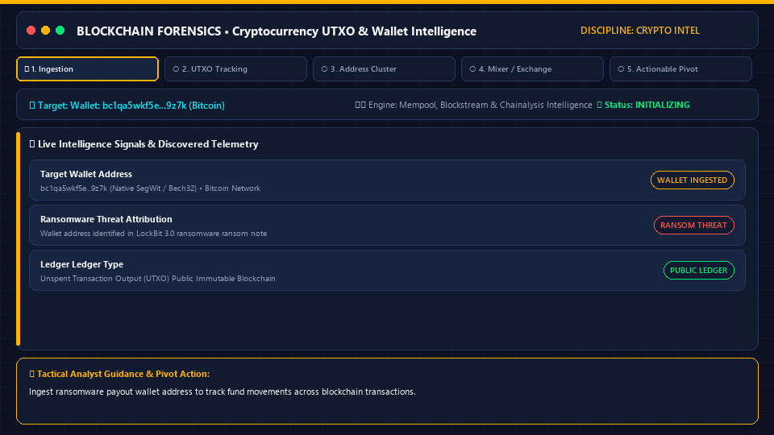

*Figure 27.1: UTXO transaction ledger tracking, wallet address clustering, and mixer detection utilizing blockchain forensic analytics.*

</div>

#### Step-by-Step Analytical Breakdown:
1. **Extortion Wallet Ingestion:** Ingests ransomware ransom note Bitcoin address (`bc1q...`) to initialize immutable ledger tracking.
2. **UTXO Ledger Traversal:** Confirms transaction confirmation blocks, unmasks payment amounts (14.25 BTC), and traces downstream unspent outputs.
3. **Address Clustering & Peeling Chains:** Applies Common Input Ownership heuristics to identify affiliate wallet clusters and peeling chain fee dissipation.
4. **Mixer & Bridge Detection:** Flags CoinJoin mixing attempts (Wasabi/Tornado) and cross-chain decentralized swaps into Monero (XMR).
5. **Exchange Subpoena Vector:** Tracks deposit transactions into centralized KYC exchanges (Binance, OKX) to enable law enforcement asset freezing.

Public blockchains (Bitcoin, Ethereum, Polygon) operate as immutable, decentralized public ledgers. Every transaction, fee, timestamp, sender, and recipient address is permanently recorded and visible to investigators.

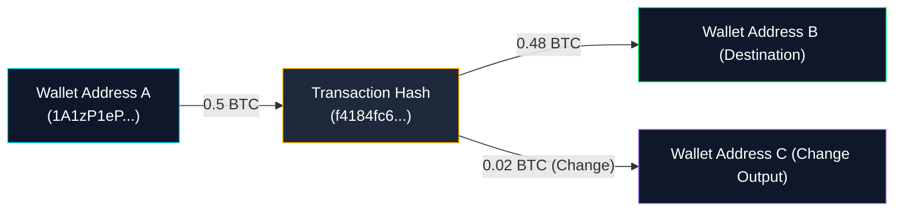
```mermaid

flowchart LR
    W1["Wallet Address A<br>(1A1zP1eP...)"] -->|0.5 BTC| TX["Transaction Hash<br>(f4184fc6...)"]
    TX -->|0.48 BTC| W2["Wallet Address B (Destination)"]
    TX -->|"0.02 BTC (Change)"| W3["Wallet Address C (Change Output)"]

    style W1 fill:#0f172a,stroke:#00e5ff,color:#fff
    style TX fill:#1e293b,stroke:#ffab00,color:#fff
    style W2 fill:#0f172a,stroke:#00e676,color:#fff
    style W3 fill:#0f172a,stroke:#b388ff,color:#fff
```

### 27.1 Blockchain Explorers & Tools:
* **Mempool.space:** The premier visual explorer for the Bitcoin blockchain, displaying unconfirmed transactions, memory pool congestion, and UTXO trees.
* **Etherscan.io:** Comprehensive explorer for Ethereum smart contracts, token transfers (ERC-20/ERC-721), and contract bytecode.
* **Blockchair / Blockchain.com:** Universal multi-chain search engines querying transactions across BTC, ETH, BCH, LTC, and Doge.
* **Arkham Intelligence (`arkhamintelligence.com`):** Entity deanonymization platform attributing crypto wallet addresses to real-world exchanges, hedge funds, mixers, and threat actors.
* **Breadcrumbs (`breadcrumbs.app`):** Visual graph analytics platform for mapping fund flows and transaction clustering.

---

---

## Module 5: Corporate Records, Legal and Public Data

> **Core Focus:** Business registry auditing, regulatory filings, SEC EDGAR disclosures, government procurement, and court docket records.

## 28. Corporate & Business Entity OSINT

Corporate records reveal legal structures, holding companies, beneficial owners, executive leadership, international trade, and registered office addresses.

### 28.1 Key Public Registries:
* **OpenCorporates (`opencorporates.com`):** The world's largest open database of corporate entities (>220 million companies). Maps registered directors, active corporate standing, and corporate parent/subsidiary relationships.
* **SEC EDGAR (United States):** Public corporate filings for publicly traded entities:
  * **Form 10-K:** Annual comprehensive financial report detailing corporate structure, cloud hosting dependencies, physical facilities, and risk disclosures.
  * **Form 8-K:** Material unscheduled corporate events (such as mandatory SEC Form 8-K Item 1.05 cybersecurity breach disclosures).
* **Companies House (UK):** Free public registry detailing corporate accounts, director appointments, and persons with significant control (PSC).
* **ImportYeti (`importyeti.com`):** Searches ocean freight bill-of-lading shipment records, mapping international supply chains, vendors, and logistics routes.

---

## 29. Government Open Data & Public Records

Government databases provide authoritative, legally verified public information regarding contracts, corporate filings, and regulatory compliance.

### 29.1 Primary Portals:
* **United States:**
  * **USAspending.gov:** Official open data source tracking federal spending, government defense contracts, and grants awarded to corporations.
  * **Data.gov:** The home of the US Government's open data repositories across energy, agriculture, and defense.
  * **CISA / NVD:** Official repositories for national cybersecurity directives and vulnerability metrics.
* **India:**
  * **Ministry of Corporate Affairs (MCA):** Central registry for company master data, charges, and director information.
  * **Data.gov.in:** National open data sharing and accessibility portal.
  * **CERT-In / eCourts:** National cyber incident reporting and electronic court records system.

---

## 30. Legal & Court Docket Intelligence

Court records and litigation proceedings provide verified affidavits, witness depositions, forensic exhibits, and corporate dispute documentation.

### 30.1 Legal Databases:
* **CourtListener / RECAP (`courtlistener.com`):** Free search engine for United States federal and state case law, court dockets, and RECAP-donated PACER documents.
* **PACER (Public Access to Court Electronic Records):** Official US federal judiciary system for searching case and docket information.
* **Justia / FindLaw:** Searchable repositories of legal precedents, appellate rulings, and commercial regulations.
* **Indian Kanoon (`indiankanoon.org`):** High-speed search engine indexing Supreme Court, High Court, and tribunal judgments across India.

---

## Module 6: Geospatial Intelligence, Media Forensics and Global Operations

> **Core Focus:** Image EXIF hardware forensics, SunCalc solar chronolocation, satellite remote sensing, ADS-B / AIS vehicle tracking, and automation frameworks.

## 31. Image OSINT

Image intelligence involves extracting geographic, biometric, temporal, and forensic data from static visual media.

### 31.1 Reverse Image Search Engines:
* **Google Lens:** General visual object and text recognition. Excellent for identifying commercial consumer goods, vehicles, architectural styles, and logos.
* **Yandex Visual Search:** The most powerful reverse image engine for recognizing identical photographs, background landmarks, and human faces across social media.
* **Bing Visual Search:** Offers interactive cropping tools for isolating sub-regions of an image (e.g., a specific church tower or mountain peak).
* **TinEye:** Algorithmic crawler identifying the earliest historical web appearance and uncropped original versions of an image.
* **PimEyes / FaceCheck.ID:** Facial recognition engines matching faces against billions of indexed online photographs.

### 31.2 Image Forensics Tools:
* **FotoForensics (`fotoforensics.com`):** Uses **Error Level Analysis (ELA)** to highlight compression artifacts, revealing cloned, spliced, or digitally modified sections of an image.
* **Forensically (`29a.ch/sandbox/forensically/`):** Browser-based digital forensics toolkit featuring clone detection, noise analysis, level sweeps, and string extraction.
* **Aperi'Solve (`aperisolve.fr`):** Automated steganography analysis platform executing `binwalk`, `steghide`, `zsteg`, and `outguess` against uploaded media.

---

## 32. EXIF & Metadata

Exchangeable Image File Format (EXIF) metadata stores technical camera settings, hardware serial numbers, timestamps, and GPS coordinates directly within JPEG, TIFF, and HEIC files.

### 32.1 Command-Line Extraction with ExifTool:

<div align="center">

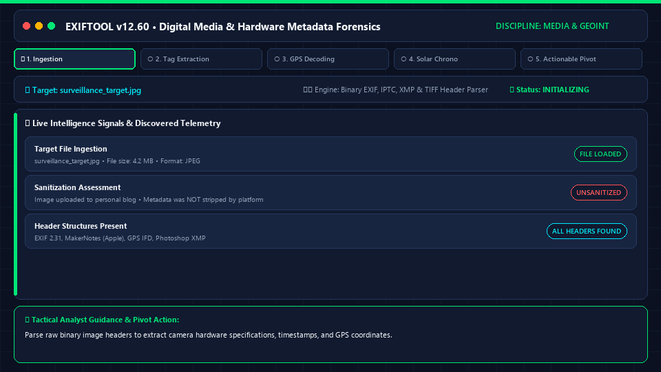

*Figure 32.1: Extracting hardware signatures, geodetic coordinates, and reverse geocoding via ExifTool.*

</div>

```bash
# Installation
sudo apt update && sudo apt install -y libimage-exiftool-perl

# Extract all metadata tags from target photograph
exiftool target_image.jpg

# Filter specifically for GPS, timestamps, camera make and model
exiftool -GPS* -DateTimeOriginal -Make -Model target_image.jpg

# Format GPS coordinates for direct input into Google Maps
exiftool -c "%.6f" -p "$GPSLatitude, $GPSLongitude" target_image.jpg
```

##### 🔍 Detailed Operational Walkthrough & Output Analysis:
1. **Metadata Parsing (`exiftool -GPS* -Make -Model -Software -DateTimeOriginal ...`)**:
   - ExifTool parses binary EXIF, XMP, and MakerNotes blocks from `field_evidence.jpg`.
   - Recovers hardware device signatures: `Apple iPhone 15 Pro Max`, iOS build `17.5.1`, and lens specifications (`6.86mm f/1.78`).
   - Extracts exact capture timestamp: `2026:09:14 14:32:08 UTC`.

2. **Geodetic Extraction & Coordinate Formatting**:
   - GPS Latitude: `37 deg 46' 48.12" N` (Decimal: `37.780033`).
   - GPS Longitude: `122 deg 24' 12.36" W` (Decimal: `-122.403433`).
   - Altitude: `18.2 m Above Sea Level`.

3. **Reverse Geocoding & Landmark Verification**:
   - Piping coordinates to OpenStreetMap's Nominatim reverse geocoder (`https://nominatim.openstreetmap.org/reverse?lat=...&lon=...`) resolves the physical address:
     * `742 Market Street, Financial District, San Francisco, California, 94102, USA`.
     * Landmark Identified: Corporate headquarters building housing the target organization.

4. **Solar & Chronolocation Validation (SunCalc)**:
   - Calculating solar positioning for `37.780033 N, -122.403433 W` on Sept 14, 2026 at `14:32:08 UTC` (07:32:08 PDT local time):
     * **Solar Azimuth:** `98.4°` (East-Southeast).
     * **Solar Elevation:** `18.7°` above the horizon.
     * **Shadow Ratio:** `1 : 2.95`.
   - The direction and length of cast shadows in the photograph match the astronomical calculation, mathematically confirming that the photograph was taken on that exact date, time, and location without digital tampering.

> **Operational Reality:** Social media platforms (X/Twitter, Facebook, Instagram, Reddit) automatically strip EXIF metadata upon image upload to protect user privacy. However, raw media sent via messaging apps (as uncompressed documents), cloud drives (Google Drive, Dropbox), or downloaded from personal blogs and forums frequently retains full EXIF data.

---

## 33. Image Geolocation

Image Geolocation (GEOINT) determines the precise real-world geographic coordinates where a visual photograph or video frame was captured.

<div align="center">

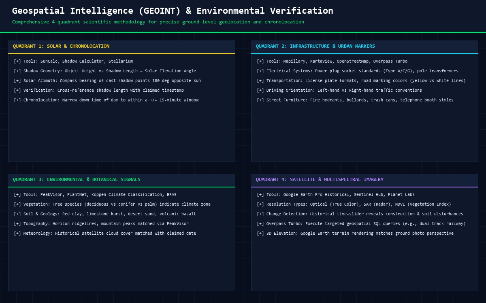

*Figure 33.1: The 4-Quadrant Scientific GEOINT & Environmental Verification Framework.*

</div>

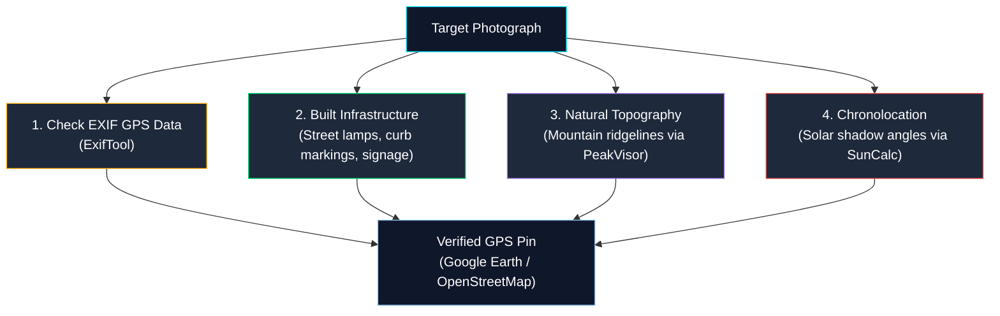
```mermaid

flowchart TD
    IMG["Target Photograph"] --> EX["1. Check EXIF GPS Data<br>(ExifTool)"]
    IMG --> BUILT["2. Built Infrastructure<br>(Street lamps, curb markings, signage)"]
    IMG --> NAT["3. Natural Topography<br>(Mountain ridgelines via PeakVisor)"]
    IMG --> TIME["4. Chronolocation<br>(Solar shadow angles via SunCalc)"]

    EX --> LOC["Verified GPS Pin<br>(Google Earth / OpenStreetMap)"]
    BUILT --> LOC
    NAT --> LOC
    TIME --> LOC

    style IMG fill:#0f172a,stroke:#00e5ff,color:#fff
    style EX fill:#1e293b,stroke:#ffab00,color:#fff
    style BUILT fill:#1e293b,stroke:#00e676,color:#fff
    style NAT fill:#1e293b,stroke:#b388ff,color:#fff
    style TIME fill:#1e293b,stroke:#ff5252,color:#fff
    style LOC fill:#0f172a,stroke:#90caf9,color:#fff
```

### 33.1 Specialized Geolocation Utilities:
* **SunCalc (`suncalc.org`):** Simulates solar position, azimuth angle, and shadow lengths for any coordinate on Earth at any historical date and time.
* **PeakVisor (`peakvisor.com`):** High-precision 3D topographic mountain recognition tool matching horizon ridgelines against global digital elevation models.
* **Overpass Turbo (`overpass-turbo.eu`):** Web-based data mining tool for OpenStreetMap that executes queries based on physical proximity (e.g., "locate all tram stations within 200m of a pharmacy and a church in Munich").

---

## 34. Satellite Imagery

Commercial satellite constellations provide open and multi-spectral earth observation data, enabling researchers to track industrial expansion, military logistics, and environmental changes.

### 34.1 Satellite Platforms:
* **Copernicus Browser / Sentinel Hub (`browser.dataspace.copernicus.eu`):** Free European Space Agency imagery (Sentinel-1 SAR radar, Sentinel-2 optical multispectral bands) updated every 5 days globally at 10m resolution.
* **Google Earth Pro (Desktop):** Offers historical satellite imagery sliders stretching back decades, allowing analysts to compare physical structural developments over time.
* **NASA Worldview (`worldview.earthdata.nasa.gov`):** Near real-time global satellite imagery updated daily (MODIS, VIIRS), ideal for tracking large weather systems, wildfires, and smoke plumes.
* **Commercial High-Resolution Providers:** Maxar, Planet Labs, Airbus Defence & Space (sub-meter resolution imagery for enterprise operations).

---

## 35. Maps

Open-source mapping platforms provide detailed spatial data, topological layers, and geographic points of interest.

### 35.1 Leading Geospatial Engines:
* **OpenStreetMap (OSM):** Collaborative, open-source world map containing crowd-sourced metadata on building heights, road surface types, speed limits, and power lines.
* **Wikimapia:** Open-content collaborative map tagging military facilities, administrative complexes, and industrial plants worldwide.
* **ArcGIS / QGIS:** Professional Geographic Information Systems (GIS) used to layer satellite imagery, vector shapefiles, and spatial threat intelligence.

---

## 36. Geolocation Techniques

Elite geolocation relies on methodical deduction across subtle background features:

1. **Road Infrastructure:**
   * Paint markings (dashed vs solid, white vs yellow centerlines).
   * Guardrail designs and roadside reflective bollards (specific to individual nations).
2. **Utility Poles & Wiring:**
   * Concrete vs wooden utility poles.
   * Transformer shapes, hook designs, and electrical insulator configurations.
3. **Architecture & Building Features:**
   * Roof tile materials, chimney types, air conditioning unit placements, balcony railings.
4. **Vehicles & License Plates:**
   * License plate dimensions (long European vs square American plates), country registration bands.
   * Make and model prevalence (e.g., right-hand drive vs left-hand drive vehicles).
5. **Vegetation & Biomes:**
   * Tree species (deciduous, coniferous, palm species), soil color, agricultural crop types.

---

## 37. Street View

Ground-level panoramic imagery validates architectural features, business signs, and road furniture identified during satellite and photographic analysis.

### 37.1 Primary Platforms:
* **Google Street View:** The most exhaustive ground-level imagery coverage globally, with historical timestamp archives stretching back to 2007.
* **Mapillary (`mapillary.com`):** Street-level imagery platform crowdsourced by Meta, featuring millions of community-contributed dashcam drives.
* **KartaView (`kartaview.org`):** Open-source, crowd-sourced street-level imagery platform.
* **Yandex Panoramas:** High-resolution ground-level coverage across Russia, Belarus, Kazakhstan, and Eastern Europe.

---

## 38. Flight OSINT

Civilian aircraft broadcast their identity, position, altitude, and velocity over unencrypted radio frequencies via **ADS-B (Automatic Dependent Surveillance–Broadcast)** on 1090 MHz.

### 38.1 Flight Tracking Portals:
* **ADS-B Exchange (`adsbexchange.com`):** The world's largest co-op of unfiltered flight data. Unlike commercial trackers, it **does not censor military, VIP, or corporate private aircraft**.
* **FlightRadar24 (`flightradar24.com`):** Commercial flight tracking platform with global coverage, route histories, and 3D playback.
* **OpenSky Network (`opensky-network.org`):** Non-profit community-based receiver network providing open historical flight dataset archives for academic research.
* **Key Identifiers to Track:**
  * **ICAO 24-bit Mode S Address:** Unique hex identifier assigned to the aircraft airframe (e.g., `A0B1C2`).
  * **Callsign:** Operating flight number (e.g., `UAL123`).
  * **Tail Registration Number:** Civilian registration mark (e.g., `N12345`).

---

## 39. Maritime & Ship OSINT

Commercial maritime vessels broadcast identification, GPS coordinates, heading, and speed over VHF radio via the **Automatic Identification System (AIS)**.

### 39.1 Key Maritime Intelligence Metrics:
* **MMSI (Maritime Mobile Service Identity):** Nine-digit unique number identifying the ship's radio station (first 3 digits indicate flag state).
* **IMO Number:** Unique 7-digit permanent hull number assigned by the International Maritime Organization that stays with the vessel throughout its operational life, regardless of name changes.

### 39.2 Maritime Portals:
* **MarineTraffic (`marinetraffic.com`):** Leading real-time vessel tracking platform with port arrival forecasts and vessel photo directories.
* **VesselFinder (`vesselfinder.com`):** Free real-time AIS vessel tracking and port call histories.
* **Global Fishing Watch (`globalfishingwatch.org`):** Tracks commercial fishing fleets worldwide, mapping industrial fishing vessel movements.

---

## 40. Weather OSINT

Meteorological records verify the timeline and credibility of photographs, videos, and reported events by confirming historical environmental conditions.

### 40.1 Meteorological Resources:
* **Windy.com:** Visual weather radar displaying global wind currents, temperature, pressure systems, and cloud cover layers.
* **Weather Underground / OpenWeatherMap:** Search historical weather archives for any city on any historical date (hourly temperature, precipitation, cloud ceiling, wind speed).
* **Copernicus Atmosphere Monitoring Service (CAMS):** Tracks atmospheric data, aerosol optical depth, dust storms, and smoke plumes.

---

## 41. Historical Web & Archives

The Internet is transient—web pages are modified, deleted, or hidden behind paywalls daily. Digital archives preserve historical captures of websites, providing an immutable record of past employees, obsolete contact numbers, deleted blog disclosures, and retired infrastructure.

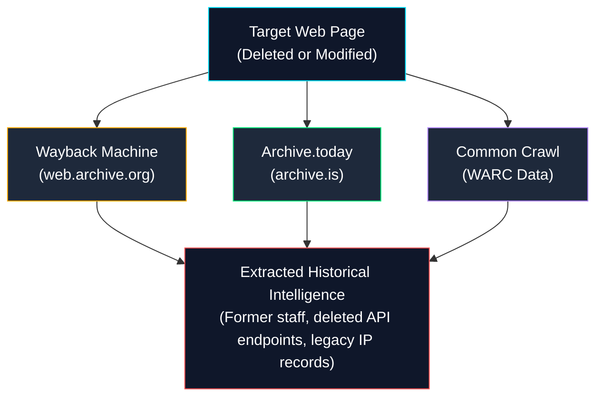
```mermaid

flowchart TD
    URL["Target Web Page<br>(Deleted or Modified)"]
    URL --> WB["Wayback Machine<br>(web.archive.org)"]
    URL --> AT["Archive.today<br>(archive.is)"]
    URL --> CC["Common Crawl<br>(WARC Data)"]

    WB --> EX["Extracted Historical Intelligence<br>(Former staff, deleted API endpoints, legacy IP records)"]
    AT --> EX
    CC --> EX

    style URL fill:#0f172a,stroke:#00e5ff,color:#fff
    style WB fill:#1e293b,stroke:#ffab00,color:#fff
    style AT fill:#1e293b,stroke:#00e676,color:#fff
    style CC fill:#1e293b,stroke:#b388ff,color:#fff
    style EX fill:#0f172a,stroke:#ff5252,color:#fff
```

### 41.1 Primary Digital Archives:
* **Internet Archive Wayback Machine (`web.archive.org`):** Maintains over 800 billion web page snapshots. Analysts can inspect historical changes via the CDX Server API:
  ```bash
  # Query all historical URLs archived for a domain via CDX API
  curl -s "http://web.archive.org/cdx/search/cdx?url=*.example.com/*&output=text&fl=original&collapse=urlkey" | head -n 20
  ```
* **Archive.today (`archive.is` / `archive.ph`):** Instant on-demand web archiver that stores static screenshots and uneditable HTML snapshots, successfully bypassing many client-side paywalls.
* **Common Crawl (`commoncrawl.org`):** Open repository providing monthly multi-terabyte web crawl data in Web ARChive (WARC) format.
* **Perma.cc:** Academic and legal archiving platform generating cryptographically preserved citation records.

---

## 42. Website Change Monitoring

Monitoring corporate websites, competitor announcements, terms of service changes, and government portals requires automated continuous differential tracking.

### 42.1 Change Detection Tools:
* **changedetection.io:** Open-source, self-hosted web page change detection and notification service that can trigger alerts via Discord, Telegram, or Webhooks when specific DOM elements change.
* **Visualping (`visualping.io`):** Commercial monitoring tool comparing visual screenshots and text blocks, alerting users when a site mutates.
* **Distill.io / ChangeTower:** Browser extensions and cloud trackers for monitoring specific HTML elements.

---

## 43. PDF & Document OSINT

Enterprise documents (PDFs, Word documents, Excel spreadsheets, PowerPoint decks) uploaded to public websites contain rich hidden metadata left behind by authoring software.

### 43.1 Metadata Extraction Utilities:
* **pdfinfo / strings:** Standard Linux utilities for rapid document inspection:
  ```bash
  # Extract basic PDF metadata
  pdfinfo annual_report.pdf
  
  # Search for author and computer names in binary strings
  strings corporate_document.docx | grep -i "author"
  ```
* **Apache Tika:** Powerful Java toolkit extracting text content and metadata from over a thousand different file formats (PDF, DOCX, XLSX, ODF).
* **FOCA (Fingerprinting Organizations with Collected Archives):** Classical forensic tool developed by ElevenPaths that crawls a website, downloads all indexed documents, and extracts software versions, internal usernames, printer names, and network paths.

---

## 44. Metadata OSINT

Metadata represents "data about data." In digital investigations, metadata frequently leaks more actionable intelligence than the actual content of the file:
* **Author / Creator / Operator:** Real names, employee initials, internal corporate usernames.
* **Software Version:** Exact application builds (e.g., `Microsoft Office Word 2016 16.0.4266.1001`), highlighting unpatched vulnerabilities.
* **Operating System & Network Shares:** File paths such as `C:\Users\jdoe\Documents\Projects\Secret\` expose internal domain conventions.
* **Device Serial Numbers:** Specific camera bodies or mobile phone identifiers.

---

## 45. People OSINT: Holistic Investigation Path

People-centric intelligence should follow a structured, multi-hop investigation path rather than random searching:

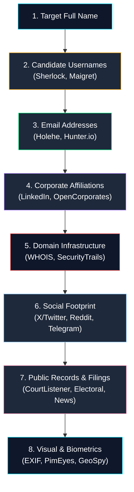
```mermaid

flowchart TD
    NAME["1. Target Full Name"] --> USER["2. Candidate Usernames<br>(Sherlock, Maigret)"]
    USER --> EMAIL["3. Email Addresses<br>(Holehe, Hunter.io)"]
    EMAIL --> COMP["4. Corporate Affiliations<br>(LinkedIn, OpenCorporates)"]
    COMP --> DOM["5. Domain Infrastructure<br>(WHOIS, SecurityTrails)"]
    DOM --> SOC["6. Social Footprint<br>(X/Twitter, Reddit, Telegram)"]
    SOC --> PUB["7. Public Records & Filings<br>(CourtListener, Electoral, News)"]
    PUB --> VIS["8. Visual & Biometrics<br>(EXIF, PimEyes, GeoSpy)"]

    style NAME fill:#0f172a,stroke:#00e5ff,color:#fff
    style USER fill:#1e293b,stroke:#ffab00,color:#fff
    style EMAIL fill:#1e293b,stroke:#00e676,color:#fff
    style COMP fill:#1e293b,stroke:#b388ff,color:#fff
    style DOM fill:#0f172a,stroke:#ff5252,color:#fff
    style SOC fill:#1e293b,stroke:#90caf9,color:#fff
    style PUB fill:#1e293b,stroke:#f48fb1,color:#fff
    style VIS fill:#0f172a,stroke:#00e5ff,color:#fff
```

---

## 46. Username to Email Pivoting

Given a target's confirmed handle (e.g., `cyber_ninja99`), pivoting to their underlying email address:
1. **GitHub Commit Logs:** Check public commit histories for raw email signatures:
   ```bash
   curl -s "https://api.github.com/users/cyber_ninja99/events/public" |      grep -E ""email": "[^"]+"" | sort -u
   ```
2. **Gravatar MD5 Hashes:** Querying Gravatar profiles:
   * Gravatar calculates an MD5 hash of the user's lowercased email: `md5("user@example.com") = 44d88612fea8a8f36de82e1278abb02f`.
   * Reversing common email structures against known hash dictionaries.
3. **Epieos / Holehe:** Testing username variations against standard webmail services (`gmail.com`, `proton.me`, `outlook.com`).

---

## 47. Email to Username Pivoting

Given an email address (`johndoe@target.com`), derive likely online usernames:
1. **Strip Username Prefix:** Test `johndoe`, `john.doe`, `jdoe` against **Sherlock** and **Maigret**.
2. **Breach Databases:** Querying **DeHashed** reveals past registered usernames associated with that email in historical breaches.
3. **Google Account ID:** Querying **Epieos** surfaces the numeric Google User ID (`Gaia ID`), revealing linked YouTube channels, Google Maps reviews, and public albums.

---

## 48. Username to Domain & Infrastructure Pivoting

How a digital persona links directly to enterprise internet infrastructure:
1. Target handle creates a personal repository on GitHub or GitLab.
2. The repository contains configuration scripts (`docker-compose.yml`, `nginx.conf`, `settings.py`) referencing a personal domain name (`johndoe-labs.io`).
3. Querying **WHOIS** and historical DNS reveals the developer's server IP address.
4. Scanning the server on **Shodan** exposes unpatched management ports (SSH, Grafana, Portainer) leading directly into the corporate perimeter.

---

## 49. Maltego

<div align="center">

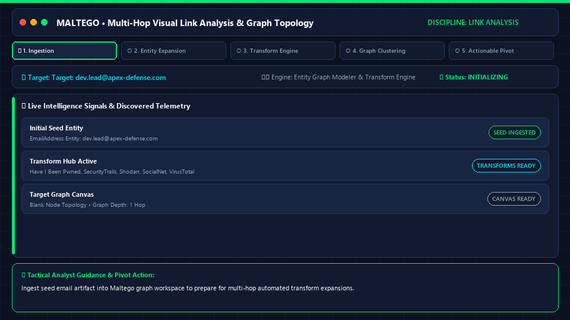

*Figure 49.1: Multi-hop entity expansion and graph centrality clustering from email seed to infrastructure compromise.*

</div>

#### Step-by-Step Analytical Breakdown:
1. **Seed Entity Ingestion:** Ingests isolated email address into graph canvas with configured threat intelligence transform hubs.
2. **Level 1 Entity Expansion:** Resolves parent corporate domain, identified operator personas, and historical credential breach exposures.
3. **Level 2 Infrastructure Resolution:** Connects domains to active subdomains, DNS records, public IPv4 hosts, and open management ports.
4. **Level 3 Threat & Vulnerability Correlation:** Maps CVE vulnerabilities and compromised GitHub repositories, revealing full attack paths.
5. **CTI Export & Sharing:** Exports the validated graph topology into STIX 2.1 format for instant ingestion into enterprise MISP clusters.

Maltego is the industry-standard visual link analysis platform for cyber investigations, threat intelligence, and network reconnaissance.

### 49.1 Architectural Concepts:
* **Entities:** Visual nodes representing real-world assets (Person, Email Address, Domain, IP Address, Netblock, Organization, Phrase).
* **Transforms:** API-driven Python or Java scripts that query external intelligence databases (Shodan, VirusTotal, Have I Been Pwned, SecurityTrails) to expand an entity.
* **Multi-Hop Link Graph:** Visually maps relationships between nodes, identifying clusters, hub nodes, and unexpected interconnectivity.

---

## 50. SpiderFoot

SpiderFoot is an open-source, automated OSINT collection and threat reconnaissance engine.

### 50.1 Operational Capabilities:
* **Target Ingestion:** Accepts IP addresses, domain names, hostnames, network subnets, ASN numbers, email addresses, phone numbers, or person names.
* **Module Ecosystem:** Over 200 modular plugins querying Shodan, Censys, VirusTotal, GreyNoise, ThreatFox, Have I Been Pwned, and Bitcoin block explorers.
* **Automated Correlation:** Surfaces high-risk attack surface vulnerabilities, exposed credentials, leaked subdomains, and malicious IP reputations automatically in an interactive web GUI.

---

## 51. Recon-ng

Recon-ng is a full-featured, modular reconnaissance framework written in Python. Featuring a command-line interface mirroring Metasploit, it manages workspaces, database tables, and modular reconnaissance tasks cleanly.

### 51.1 Workflow & Commands:

```bash
# Launch Recon-ng
recon-ng

# 1. Create a dedicated project workspace
[recon-ng][default] > workspaces create TargetCorp
[recon-ng][TargetCorp] > db schema

# 2. Add seed domains to the workspace database
[recon-ng][TargetCorp] > db insert domains
domain (TEXT): target.com
notes (TEXT): Primary corporate root

# 3. Search and install modules from marketplace
[recon-ng][TargetCorp] > marketplace search brute_hosts
[recon-ng][TargetCorp] > marketplace install recon/domains-hosts/brute_hosts

# 4. Load, configure, and execute module
[recon-ng][TargetCorp] > modules load recon/domains-hosts/brute_hosts
[recon-ng][TargetCorp][brute_hosts] > info
[recon-ng][TargetCorp][brute_hosts] > run

# 5. Review discovered hosts in local SQLite database
[recon-ng][TargetCorp][brute_hosts] > show hosts
```

---

## 52. theHarvester

theHarvester is a classic, battle-tested Python command-line utility designed for external perimeter reconnaissance. It gathers publicly indexed emails, employee names, subdomains, open ports, and employee LinkedIn handles.

### 52.1 Command Syntax & Execution:

<div align="center">

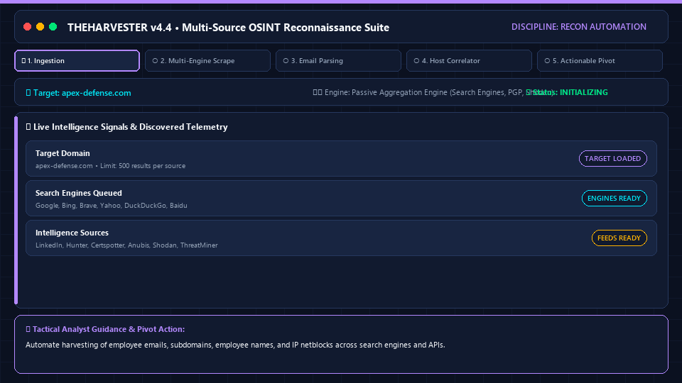

*Figure 52.1: Multi-source OSINT harvesting of corporate emails, subdomains, and IP spaces.*

</div>

```bash
# Run comprehensive scan querying all passive search engines
theHarvester -d target.com -b all -l 500 -f target_recon_report.html

# Arguments:
# -d : Target domain
# -b : Data source engine (google, bing, duckduckgo, crtsh, certspotter, otx, shodan)
# -l : Limit number of search results per engine
# -f : Save findings as HTML and XML report
```

##### 🔍 Detailed Operational Walkthrough & Output Analysis:
1. **Engine Orchestration (`theHarvester -d cybersec-corp.org -b bing,duckduckgo,shodan,certspotter -l 500`)**:
   - Initiates passive reconnaissance across both traditional search engines (Bing, DuckDuckGo) and specialized infrastructure repositories (Shodan, Certspotter).
   - Configures a limit of 500 results per engine to ensure thorough coverage without triggering automated bot CAPTCHAs.

2. **Extracted Organizational Assets in the GIF**:
   - **Corporate Email Schema:** Uncovers active employee addresses (`ciso@cybersec-corp.org`, `sarah.connor@cybersec-corp.org`, `devops-lead@cybersec-corp.org`), revealing standard organizational naming patterns (`{firstname}.{lastname}@domain.com` vs `{role}@domain.com`).
   - **Perimeter Hostnames & IPs:** Identifies 7 public subdomains (`vpn`, `dev`, `cloud`, `portal`, `mail`) mapped to IP block `198.51.100.0/24` belonging to Autonomous System `AS64496`.
   - **Shodan Exposure Alert:** Confirms that `dev.cybersec-corp.org` (`198.51.100.99`) has ports 22 (SSH) and 8080 (GitLab) directly exposed to the Internet.

3. **Downstream Intelligence Pivoting**:
   - Discovered emails are immediately routed to **Holehe** to map registered employee SaaS accounts.
   - Discovered IPs and hostnames are fed into **Nmap** and **Nuclei** for active port scanning and vulnerability triage.

---

## 53. Amass (OWASP)

The OWASP Amass tool suite performs network mapping of attack surfaces and external asset discovery using open-source information gathering and active reconnaissance techniques.

### 53.1 Primary Subcommands:
* **`amass enum`:** Executes domain mapping, Certificate Transparency log harvesting, DNS record brute-forcing, reverse DNS sweeps, and IP range correlation.
* **`amass intel`:** Discovers additional root domains belonging to an organization via reverse WHOIS, ASN lookups, and CIDR range tracking.
* **`amass viz`:** Generates interactive D3.js force-directed network graphs visualising discovered topology.
* **`amass track`:** Compares reconnaissance runs over time, highlighting newly added or removed subdomains and IP addresses.

---

## 54. FinalRecon

FinalRecon is a fast, multi-threaded Python reconnaissance engine that aggregates header checks, SSL/TLS certificate verification, WHOIS queries, DNS enumeration, sub-directory crawling, and link scraping in a single pass:

```bash
# Execute full reconnaissance pass against web target
finalrecon --full https://target.com
```

---

## 55. Passive Recon Tools Suite

A modern, production-grade passive reconnaissance pipeline combines specialized tools into an automated stream:

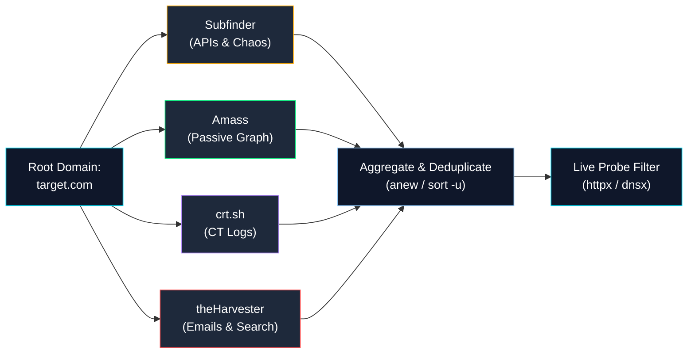
```mermaid

flowchart LR
    D["Root Domain:<br>target.com"] --> S["Subfinder<br>(APIs & Chaos)"]
    D --> A["Amass<br>(Passive Graph)"]
    D --> C["crt.sh<br>(CT Logs)"]
    D --> H["theHarvester<br>(Emails & Search)"]

    S --> M["Aggregate & Deduplicate<br>(anew / sort -u)"]
    A --> M
    C --> M
    H --> M

    M --> P["Live Probe Filter<br>(httpx / dnsx)"]

    style D fill:#0f172a,stroke:#00e5ff,color:#fff
    style S fill:#1e293b,stroke:#ffab00,color:#fff
    style A fill:#1e293b,stroke:#00e676,color:#fff
    style C fill:#1e293b,stroke:#b388ff,color:#fff
    style H fill:#1e293b,stroke:#ff5252,color:#fff
    style M fill:#0f172a,stroke:#90caf9,color:#fff
    style P fill:#0f172a,stroke:#00e5ff,color:#fff
```

---

## 56. Threat Actor OSINT

Threat actor profiling tracks Advanced Persistent Threat (APT) groups, cybercriminal syndicates, and hacktivist cells through their historical tradecraft, infrastructure, and targets.

### 56.1 Leading Threat Research Sources:
* **MITRE ATT&CK Groups:** Profiles over 140 adversary groups (e.g., APT28, APT29, FIN7, Lazarus Group) detailing their documented TTPs and software.
* **Mandiant / Google Threat Intelligence:** Authoritative whitepapers detailing state-sponsored espionage campaigns and novel malware families.
* **CrowdStrike Global Threat Report:** Annual adversary analysis detailing adversary breakout times and emerging criminal syndicates.
* **Cisco Talos Intelligence:** Real-time threat research, IOC drops, and reverse-engineering reports.
* **Kaspersky Securelist:** Deep technical analyses of complex cyber espionage operations.

---

## 57. MITRE ATT&CK Framework

The MITRE Adversarial Tactics, Techniques, and Common Knowledge (ATT&CK) matrix is a globally accessible knowledge base of adversary behavior based on real-world observations.

### 57.1 Threat Mapping Hierarchy:
```text
Threat Actor (e.g., APT29)
  └── Campaign (e.g., SolarWinds Supply Chain)
        └── Tactic (e.g., TA0001: Initial Access)
              └── Technique (e.g., T1195.002: Compromise Software Supply Chain)
                    └── Procedure (Specific script, tool, or binary configuration)
                          └── Indicator of Compromise (Hash, IP, Domain)
                                └── Detection Rule (Sigma, YARA, Snort)
```

---

## 58. MISP (Malware Information Sharing Platform)

MISP is an open-source threat intelligence platform (TIP) designed to collect, store, distribute, and share cyber security indicators and threat context between organizations, trusted communities, and national CERTs.

### 58.1 Core Entities:
* **Events:** Central collections of context-linked indicators related to a specific incident or campaign.
* **Attributes:** Individual indicators (IP address, domain, MD5 hash, YARA rule, filename, mutex).
* **Warninglists:** Curated lists of benign indicators (e.g., Google DNS `8.8.8.8`, Cloudflare CDN) preventing false-positive alert generation.

---

## 59. STIX & TAXII

Industry standards maintained by OASIS for structuring and transporting threat intelligence machine-to-machine.

### 59.1 STIX 2.1 (Structured Threat Information Expression):
Standardized JSON schema defining cyber threat objects:
* **SDOs (STIX Domain Objects):** `indicator`, `malware`, `threat-actor`, `campaign`, `attack-pattern`, `identity`, `vulnerability`.
* **SROs (STIX Relationship Objects):** `relationship` (e.g., *indicates*, *uses*, *targets*), `sighting`.

### 59.2 TAXII 2.1 (Trusted Automated eXchange of Intelligence Information):
RESTful protocol operating over HTTPS that serves as the transport medium for distributing STIX 2.1 intelligence collections through real-time subscriptions and channels.

---

## 60. Vulnerability OSINT

Tracking software vulnerabilities in the wild allows defenders to patch weaknesses before automated adversary exploit scripts compromise perimeter systems.

### 60.1 Primary Vulnerability Repositories:
* **CVE.org:** The authoritative global registry of Common Vulnerabilities and Exposures.
* **National Vulnerability Database (NVD):** Maintained by NIST, providing standardized CVSS scoring, CWE categories, and affected CPE vendor configurations.
* **Exploit Database (Exploit-DB):** Public repository of working Proof-of-Concept (PoC) exploit scripts and shellcode.
* **Packet Storm:** Security portal archiving daily zero-day advisories, exploit scripts, and tool updates.
* **OSV.dev (Open Source Vulnerabilities):** Distributed vulnerability database for open-source dependencies (Go, npm, PyPI, Rust).

---

## 61. National Vulnerability Database (NVD)

The National Vulnerability Database (NVD) is the U.S. government repository of standards-based vulnerability management data.

### 61.1 Information Provided by NVD:
* **Common Vulnerability Scoring System (CVSS):** Standardized framework (v3.1 and v4.0) scoring severity from 0.0 to 10.0 based on Base, Temporal, and Environmental metrics (Attack Vector, Attack Complexity, Privileges Required, User Interaction).
* **Common Platform Enumeration (CPE):** Standardized URI string identifying affected software packages and hardware versions:
  ```text
  cpe:2.3:a:apache:http_server:2.4.49:*:*:*:*:*:*:*
  ```
* **Common Weakness Enumeration (CWE):** Identifies the root architectural software flaw (e.g., `CWE-79: Cross-Site Scripting`, `CWE-22: Path Traversal`).

---

## 62. CISA Known Exploited Vulnerabilities (KEV) Catalog

The Cybersecurity and Infrastructure Security Agency (CISA) maintains the **Known Exploited Vulnerabilities (KEV) Catalog**, the gold standard for vulnerability prioritization.

### 62.1 Why KEV Outperforms Raw CVSS:
A software flaw may have a theoretical CVSS score of 9.8 (Critical), but if no weaponized exploit exists, threat actors cannot leverage it. Conversely, a CVSS 7.2 flaw actively leveraged by ransomware gangs poses an immediate crisis.
* **The Rule of Defense:** Remediate vulnerabilities on the **CISA KEV catalog immediately**, as they represent confirmed, in-the-wild exploitation.

---

## 63. Username & Account Discovery Suites

Automating digital account discovery across hundreds of web services relies on signature databases that map response codes:

```bash
# Python multi-account discovery via Sherlock
sherlock target_alias --timeout 5 --print-found --csv output.csv
```

### 63.1 Mechanics of Handle Discovery:
* **HTTP Status Codes:** Services return HTTP `200 OK` if a user exists and HTTP `404 Not Found` if the handle is unregistered.
* **Response Body Signatures:** Web services utilizing Single Page Applications (SPAs) return `200 OK` for all requests, requiring scanners to search for error strings (e.g., `"User not found"`, `"This account has been suspended"`).

---

## 64. Facial Recognition & Biometric Search Engines

Facial recognition search engines utilize deep convolutional neural networks to generate mathematical face vectors from uploaded photos, searching against billions of scraped images.

### 64.1 Platforms:
* **PimEyes (`pimeyes.com`):** Highly accurate facial search engine indexing the public open web, revealing photos where the subject appears in background crowds, news articles, or unlinked blogs.
* **FaceCheck.ID (`facecheck.id`):** Visual search engine comparing uploaded faces against mugshots, scam registries, adult sites, and social media.

> ⚠️ **Investigative Caution:** Biometric algorithms produce false-positive matches, particularly across lower-resolution captures or similar ethnic features. Always corroborate facial matches with secondary signals (tattoos, unique jewelry, context, clothing, geographic corroboration).

---

## 65. Audio Forensics & Acoustic Intelligence

Audio tracks provide hidden environmental, temporal, and linguistic signals:
* **Acoustic Fingerprinting:** Services like **Shazam**, **SoundHound**, and **ACRCloud** identify background music playing in videos, establishing commercial location context.
* **Spectral Analysis (Audacity / Sonic Visualiser):** Visualizing audio frequencies as spectrograms reveals hidden acoustic signatures, telephone touch-tone DTMF dialing frequencies, and voice pitches.
* **Whisper AI:** Open-source automatic speech recognition (ASR) capable of transcribing dialogue and identifying obscure regional dialects across noisy audio files.

---

## 66. Video OSINT & Verification Workflow

Videos are complex sequences of images accompanied by audio and temporal metadata. Investigating video content requires methodical decomposition:

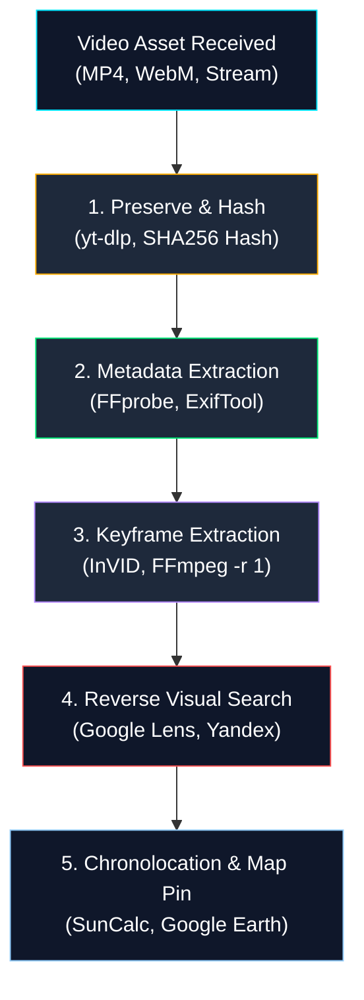
```mermaid

flowchart TD
    VID["Video Asset Received<br>(MP4, WebM, Stream)"] --> PRE["1. Preserve & Hash<br>(yt-dlp, SHA256 Hash)"]
    PRE --> META["2. Metadata Extraction<br>(FFprobe, ExifTool)"]
    META --> FRAME["3. Keyframe Extraction<br>(InVID, FFmpeg -r 1)"]
    FRAME --> REV["4. Reverse Visual Search<br>(Google Lens, Yandex)"]
    REV --> GEO["5. Chronolocation & Map Pin<br>(SunCalc, Google Earth)"]

    style VID fill:#0f172a,stroke:#00e5ff,color:#fff
    style PRE fill:#1e293b,stroke:#ffab00,color:#fff
    style META fill:#1e293b,stroke:#00e676,color:#fff
    style FRAME fill:#1e293b,stroke:#b388ff,color:#fff
    style REV fill:#0f172a,stroke:#ff5252,color:#fff
    style GEO fill:#0f172a,stroke:#90caf9,color:#fff
```

---

## 67. InVID / WeVerify Verification Suite

The **InVID / WeVerify** browser extension is the gold standard for digital journalists, human rights investigators, and intelligence analysts verifying video content.

### 67.1 Core Features:
* **Keyframe Splitting:** Automatically slices web videos into representative visual thumbnails.
* **Reverse Image Multi-Search:** Submits extracted frames directly to Google, Yandex, Bing, Baidu, and TinEye with a single click.
* **Contextual Twitter Verification:** Searches for historical micro-blogging discussions matching video keywords around the alleged event date.

---

## 68. YouTube OSINT

YouTube hosts immense public video archives containing technical, corporate, and regional data.

### 68.1 Investigative Techniques:
* **YouTube DataViewer (Amnesty International):** Converts YouTube video links into precise UTC upload timestamps and extracts thumbnail URLs for reverse search.
* **`yt-dlp` Video Metadata Harvesting:**
  ```bash
  # Extract comprehensive JSON metadata without downloading entire video stream
  yt-dlp --dump-json "https://www.youtube.com/watch?v=VIDEO_ID" | jq '{title: .title, upload_date: .upload_date, uploader_id: .uploader_id, tags: .tags}'
  ```

---

## 69. Reddit OSINT

Reddit is a vast discussion forum where users, developers, and threat actors frequently disclose technical details, system configurations, and personal frustrations.

### 69.1 Reddit Search Utilities:
* **PullPush / Pushshift API:** Historical indexing engines allowing researchers to recover deleted comments, banned submissions, and historic user posting chronologies:
  ```bash
  curl -s "https://api.pullpush.io/reddit/search/comment/?author=TargetUser" | jq .
  ```
* **Redective (`redective.com`):** Generates analytical profiles of Reddit accounts, highlighting active subreddits, top keywords, and posting hour heatmaps.

---

## 70. Telegram OSINT

Telegram has become the primary communications channel for cybercrime forums, hacktivist collectives, ransomware leak updates, and illicit marketplaces.

### 70.1 Telegram Reconnaissance Tools:
* **TGStat (`tgstat.com`) / Telemetr (`telemetr.io`):** Analytics databases archiving public Telegram channels, tracking channel growth, post forwards, view counts, and citation networks.
* **Public Search Engines:** Platforms like `t.me/s/channel_name` allow previewing public channels in web browsers without creating an active Telegram account.

---

## 71. Discord OSINT

Discord servers host gaming communities, open-source projects, and underground hacker circles.

### 71.1 Investigative Entrypoints:
* **Public Server Directories:** Portals like **Disboard (`disboard.org`)** index public servers by tag, topic, and invite link.
* **Discord Widget API:** Public servers frequently expose JSON widgets revealing live online member counts and voice channel activity:
  ```bash
  curl -s "https://discord.com/api/guilds/SERVER_ID/widget.json" | jq .
  ```

---

## 72. Mastodon & Fediverse Intelligence

The Fediverse is a decentralized collection of independent social servers communicating via the **ActivityPub** open protocol.

### 72.1 Fediverse Reconnaissance:
* **Instance Directories:** Platforms like **FediDB (`fedidb.org`)** and **Fediverse Observer** track active instances, software versions, and user populations.
* **Federated Search:** Unlike centralized platforms, Fediverse searches require querying across instance nodes or leveraging cross-instance crawlers.

---

## 73. Bluesky & AT Protocol Intelligence

Bluesky operates on the **Authenticated Transfer (AT) Protocol**, an open federated network for social media.

### 73.1 Open Data Model:
* All public posts, likes, reposts, and profile metadata on the AT Protocol are open and queryable via public REST APIs and Decentralized Identifiers (DIDs).
* Developers and analysts can stream firehose events in real time without restrictive API access keys.

---

## 74. X / Twitter Advanced Intelligence Gathering

X (formerly Twitter) provides rich real-time event reporting, developer discussions, and political telemetry.

### 74.1 Advanced Search Operators:

```text
from:username "keyword"
to:username "query"
from:username since:2025-01-01 until:2025-06-30
"target.com" min_faves:50
geocode:37.7749,-122.4194,5km
```

---

## 75. Social Graph Analysis

Social graph analysis models relationships between human actors, accounts, and infrastructure:
* **Directed Ties:** User A follows User B, User B comments on User C's post.
* **Centrality Metrics:**
  * **Degree Centrality:** Identifies accounts with the highest total connections.
  * **Betweenness Centrality:** Identifies "bridge" accounts that connect distinct communities.

---

## 76. Network Graph Visualization Engines

When dealing with thousands of correlated nodes (people, emails, domains, IPs, phone numbers), visualization tools translate complex datasets into actionable network graphs.

### 76.1 Primary Graph Suites:
* **Gephi (`gephi.org`):** Open-source desktop software for graph and network analysis. Runs modularity clustering, ForceAtlas2 layouts, and identifies hidden sub-networks.
* **Neo4j:** The leading enterprise graph database. Models entities as property nodes connected by typed relationships:
  ```cypher
  MATCH (a:Person)-[:OWNS]->(d:Domain)-[:RESOLVES_TO]->(ip:IP)
  WHERE ip.asn = 13335
  RETURN a, d, ip;
  ```
* **Graphistry (`graphistry.com`):** Cloud-native GPU-accelerated visual graph intelligence platform capable of rendering millions of nodes and edges in real time.

---

## 77. Essential Browser OSINT Extensions

Browser extensions transform analysts' web browsers into automated reconnaissance workstations:

| Extension | Primary Function & Utility |
| :--- | :--- |
| **Wappalyzer / BuiltWith** | Instant identification of web frameworks, CMS, programming languages, and analytics scripts |
| **uBlock Origin** | High-performance content blocker preventing malware execution, tracking scripts, and IP fingerprinting |
| **SingleFile / Save Page WE** | Saves an entire complete web page (HTML, images, CSS, fonts) as a single standalone offline file |
| **Wayback Machine Extension** | Automatically detects HTTP 404 dead links and displays historical Internet Archive captures |
| **InVID & WeVerify** | Keyframe extraction, reverse image querying, and forensic metadata parsing for web video |
| **HackTools** | Web penetration testing and OSINT cheat sheet extension featuring reverse shell and payload generators |
| **Link Gopher** | Extracts, deduplicates, and sorts all hyperlinks present on any visited web page |

---

## 78. Web Scraping Architecture for Intelligence

When public APIs are unavailable, web scraping extracts structured intelligence from raw HTML documents.

### 78.1 Core Python Scraping Libraries:
* **Requests / HTTPX:** High-speed HTTP clients supporting connection pooling, cookies, proxies, and custom User-Agent headers.
* **BeautifulSoup4:** Elegant library for parsing HTML/XML documents and extracting elements via CSS selectors:
  ```python
  from bs4 import BeautifulSoup
  import requests

  res = requests.get("https://example.com", headers={"User-Agent": "Mozilla/5.0"})
  soup = BeautifulSoup(res.text, "html.parser")
  for link in soup.find_all("a", href=True):
      print(link["href"])
  ```
* **Playwright / Selenium:** Headless browser automation executing dynamic JavaScript, interacting with forms, and bypassing client-side rendering.
* **Scrapy:** Enterprise-grade asynchronous web crawling framework for scraping millions of pages across distributed workers.

---

## 79. Command-Line OSINT Toolkit for Linux/Kali

The Unix terminal provides high-speed, scriptable text processing utilities that process massive log files and intelligence feeds without GUI overhead:

```bash
# 1. High-Speed Web Querying
curl -s -A "Mozilla/5.0" "https://api.example.com/data" | jq .

# 2. Extract Specific JSON Fields with jq
curl -s "https://crt.sh/?q=%.target.com&output=json" | jq -r '.[].name_value' | sort -u

# 3. Stream Filtering and RegEx with grep, sed, and awk
cat web_server.log | awk '{print $1}' | sort | uniq -c | sort -nr | head -n 10

# 4. Extract Human-Readable Strings from Compiled Binaries
strings -a suspicious_sample.exe | grep -E "http://|https://"

# 5. Extract Hardware & GPS Metadata from Images
exiftool -GPSPosition -DateTimeOriginal photo.jpg
```

---

## 80. Web Crawlers & Attack Surface Spiders

Automated spiders crawl entire web domain hierarchies, discovering unlinked sub-paths, hidden JavaScript endpoints, and administrative interfaces.

### 80.1 Leading Web Crawlers:
* **Katana (ProjectDiscovery):** Next-generation crawling engine featuring headless and standard crawling modes with automated JavaScript parsing.
* **Hakrawler:** Ultra-fast Go crawler written by Hakluke for scraping endpoints from web assets and Wayback machine archives.
* **GoSpider:** Multi-threaded web spider supporting sitemap parsing, robots.txt inspection, and JavaScript link extraction.

---

## 81. Archive Investigation & Temporal Reconstruction

Recovering deleted evidence or verifying what an organization looked like at a specific historical point in time requires cross-referencing multiple digital preservation vaults:

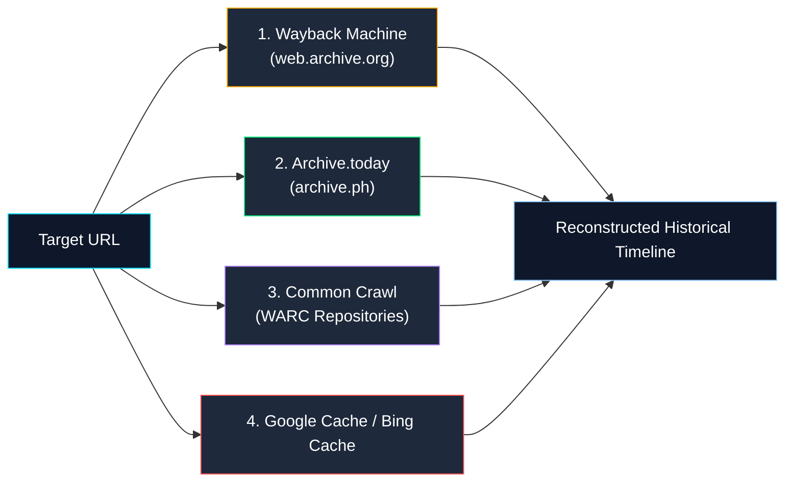
```mermaid

flowchart LR
    Target["Target URL"] --> Wayback["1. Wayback Machine<br>(web.archive.org)"]
    Target --> ArchiveToday["2. Archive.today<br>(archive.ph)"]
    Target --> CommonCrawl["3. Common Crawl<br>(WARC Repositories)"]
    Target --> GoogleCache["4. Google Cache / Bing Cache"]

    Wayback --> MasterTimeline["Reconstructed Historical Timeline"]
    ArchiveToday --> MasterTimeline
    CommonCrawl --> MasterTimeline
    GoogleCache --> MasterTimeline

    style Target fill:#0f172a,stroke:#00e5ff,color:#fff
    style Wayback fill:#1e293b,stroke:#ffab00,color:#fff
    style ArchiveToday fill:#1e293b,stroke:#00e676,color:#fff
    style CommonCrawl fill:#1e293b,stroke:#b388ff,color:#fff
    style GoogleCache fill:#1e293b,stroke:#ff5252,color:#fff
    style MasterTimeline fill:#0f172a,stroke:#90caf9,color:#fff
```

---

## 82. Breach Monitoring & Enterprise Credential Exposure

Defenders monitor credential exposure to revoke compromised sessions before attackers execute credential-stuffing attacks:
* **Have I Been Pwned Enterprise:** Real-time domain subscription alerting corporate SOC teams the moment an employee email appears in new breaches.
* **SpyCloud / Searchlight Cyber / Constella:** Enterprise darknet monitoring tracking Infostealer malware infections across corporate endpoints.

---

## 83. Dark-Web Monitoring & Ransomware Tracking

Enterprise dark-web intelligence identifies data leaks and threat actor chatter before attacks occur:
* **Ransomwatch (`ransomwatch.telemetry.ltd`):** Monitors ransomware gang leak blogs (LockBit, BlackCat, Akira), archiving victim announcements in real time.
* **DarkOwl / Flashpoint / KELA:** Deep-web intelligence platforms providing search access to closed underground cybercrime forums and encrypted channels.

---

## 84. Brand Monitoring & Digital Risk Protection

Monitoring brand abuse, trademark infringement, typo-squatting, and executive impersonation:
* **Google Alerts / Talkwalker Alerts:** Real-time email notifications whenever specified keywords appear across indexed web pages and news articles.
* **Brand24 / Mention:** Multi-platform media monitoring tracking brand reputation and sudden sentiment shifts.

---

## 85. News OSINT & Global Event Monitoring

News aggregators provide real-time situational awareness during kinetic conflicts, critical infrastructure attacks, and corporate crises:
* **GDELT Project (Global Database of Events, Language, and Tone):** Supported by Google, GDELT monitors broadcast, print, and web news in over 100 languages, updating every 15 minutes to quantify global human conflict and diplomacy.
* **MediaCloud:** Open-source research platform analyzing digital media ecosystems and tracking narrative diffusion across global publishers.

---

## 86. Disinformation Analysis & Media Verification

Verifying user-generated media during breaking news events:
1. **Source Verification:** Who originally uploaded the file? What is their historical posting track record?
2. **Date & Temporal Verification:** Cross-reference weather reports (Rain, sunlight angle) against the alleged date.
3. **Forensic Image Verification:** Run ELA checks via **FotoForensics** to verify against cloned or manipulated pixels.

---

## 87. Fact-Checking Consortia & Open Databases

Authoritative databases cataloging debunked claims, propaganda campaigns, and manipulated media:
* **Google Fact Check Explorer (`toolbox.google.com/factcheck/explorer`):** Searchable index of fact-checked claims produced by verified global journalistic organizations.
* **Snopes / PolitiFact / Bellingcat Investigation Vaults:** Rigorous investigative reports detailing methodology and open-source evidence chains.

---

## 88. Language Intelligence & Translation Engines

Navigating foreign-language forums and target regions requires automated linguistic processing:
* **DeepL Translator:** The industry benchmark for nuanced, context-aware translation across European and Asian languages.
* **Google Translate / Yandex Translate:** Broad language coverage, optical translation, and document parsing.

---

## 89. Optical Character Recognition (OCR) for OSINT

Converting text contained within images, scanned documents, and video frames into searchable text:
* **Tesseract OCR:** Open-source OCR engine maintained by Google:
  ```bash
  # Extract text from image using Tesseract
  sudo apt install -y tesseract-ocr
  tesseract document_scan.png output_text
  cat output_text.txt
  ```
* **EasyOCR / PaddleOCR:** Python machine learning libraries providing high-accuracy multilingual OCR for street signs and license plates.

---

## 90. Deep Web Academic Repositories & Document Engines

Searching peer-reviewed literature, historical dissertations, and technical whitepapers:
* **Google Books / Internet Archive Books:** Full-text searchable database of digitized historical literature.
* **JSTOR / HathiTrust:** Academic journals and digital research archives.
* **arXiv.org:** Open-access repository for hundreds of thousands of pre-print research papers in computer science and cryptography.

---

## 91. Academic OSINT & Scholarly Intelligence

Academic literature reveals proprietary algorithms, patent filings, corporate author collaborations, and technical vulnerabilities documented by security researchers.

### 91.1 Academic Search Portals:
* **Semantic Scholar (`semanticscholar.org`):** AI-powered scholarly search engine extracting key findings, citation velocity, and influential references.
* **OpenAlex (`openalex.org`):** Fully open catalog indexing hundreds of millions of scientific papers, researchers, institutions, and citation graphs.
* **PubMed / CORE / ResearchGate:** Life sciences research, global open-access repositories, and researcher social networks.

---

## 92. Infrastructure Relationship Mapping Workflow

A structured cybersecurity infrastructure investigation maps an organization from its root domain down to individual physical servers:

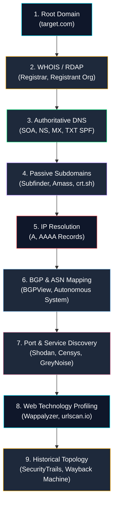
```mermaid

flowchart TD
    D["1. Root Domain<br>(target.com)"] --> W["2. WHOIS / RDAP<br>(Registrar, Registrant Org)"]
    W --> DNS["3. Authoritative DNS<br>(SOA, NS, MX, TXT SPF)"]
    DNS --> SUB["4. Passive Subdomains<br>(Subfinder, Amass, crt.sh)"]
    SUB --> IP["5. IP Resolution<br>(A, AAAA Records)"]
    IP --> BGP["6. BGP & ASN Mapping<br>(BGPView, Autonomous System)"]
    BGP --> SHO["7. Port & Service Discovery<br>(Shodan, Censys, GreyNoise)"]
    SHO --> TECH["8. Web Technology Profiling<br>(Wappalyzer, urlscan.io)"]
    TECH --> HIST["9. Historical Topology<br>(SecurityTrails, Wayback Machine)"]

    style D fill:#0f172a,stroke:#00e5ff,color:#fff
    style W fill:#1e293b,stroke:#ffab00,color:#fff
    style DNS fill:#1e293b,stroke:#00e676,color:#fff
    style SUB fill:#1e293b,stroke:#b388ff,color:#fff
    style IP fill:#0f172a,stroke:#ff5252,color:#fff
    style BGP fill:#1e293b,stroke:#90caf9,color:#fff
    style SHO fill:#1e293b,stroke:#f48fb1,color:#fff
    style TECH fill:#0f172a,stroke:#00e5ff,color:#fff
    style HIST fill:#1e293b,stroke:#ffab00,color:#fff
```

---

## 93. Cybersecurity OSINT Attack Surface

During an authorized assessment, analysts construct an external perimeter inventory matrix:

```text
Target Organization
 ├── Domains & Subdomains
 │    ├── www.target.com (Primary Web)
 │    ├── api.target.com (Production REST API)
 │    ├── dev-portal.target.com (Developer Staging)
 │    └── vpn.target.com (Corporate SSL-VPN Gateway)
 ├── IP Ranges & Autonomous Systems
 │    ├── AS64496 (Target Corp CIDR: 198.51.100.0/24)
 │    └── Cloud Hosting Egress IPs (AWS US-East, Azure West)
 ├── Cloud Storage Assets
 │    ├── s3://target-backups-internal/ (Amazon S3 Bucket)
 │    └── https://targetcorp.blob.core.windows.net/assets/
 ├── Certificate Transparency Records
 │    └── Wildcard SANs: *.corp.target.com
 ├── Code Repositories & Developer Personas
 │    ├── github.com/target-corp
 │    └── Personal employee repositories leaking credentials
 └── Third-Party SaaS Footprint
      ├── target.okta.com (Identity Provider)
      ├── target.atlassian.net (Jira / Confluence)
      └── target.slack.com (Internal Chat)
```

---

## 94. Cloud Storage OSINT & Bucket Discovery

Misconfigured public cloud buckets (AWS S3, Azure Blob Storage, Google Cloud Storage) leak database backups, source code, and employee records.

### 94.1 Discovery Tooling:
* **CloudEnum (`github.com/initstring/cloud_enum`):** Multi-cloud OSINT tool discovering public buckets across AWS, Azure, and Google Cloud using permutations of target company names.
* **S3Scanner / GrayhatWarfare:** Dedicated engines searching and indexing billions of publicly exposed Amazon S3 buckets.

> ⚠️ **Authorization Warning:** Never download proprietary corporate data from open buckets unless you are performing an explicitly scoped and authorized penetration test.

---

## 95. SecurityTrails

SecurityTrails is the industry standard for historical domain intelligence.
* **Historical DNS:** Tracks when a domain changed web hosts, uncovering the original server IP before a Cloudflare reverse proxy was installed.
* **Reverse DNS & IP Mapping:** Locates all domains hosted on a specific shared server or netblock.

---

## 96. VirusTotal Multi-Hop Graph Analysis

VirusTotal functions as a multi-directional graph engine:
* Starting with a suspicious file hash, analysts pivot to the URL that dropped the file.
* From the URL, analysts pivot to the domain name.
* From the domain name, analysts pivot to the resolving IP address.
* From the IP address, analysts discover all other malware samples communicating with that C2 server.

---

## 97. urlscan.io

urlscan.io executes deep behavioral analysis of web applications:
* Records every outbound network connection, DNS query, and TLS handshake.
* Captures the full DOM tree and extracts all embedded JavaScript source files.
* Identifies malicious tracking codes, phishing kit forms, and credential exfiltration webhooks.

---

## 98. GreyNoise Intelligence

GreyNoise categorizes opportunistic internet scanning traffic:
* **The Noise:** Identifies whether scanning activity originates from mass research projects (Shodan, Censys, University scanners) or automated botnets.
* **The RIOT (Rule It Out):** Whitelist verifying whether an IP belongs to trusted business SaaS providers (Microsoft, Google, Cloudflare), allowing SOC analysts to filter out benign background noise.

---

## 99. AbuseIPDB

AbuseIPDB is an open crowd-sourced database for reporting malicious IPs:
* Provides an **Abuse Confidence Score (0–100%)** indicating the likelihood of an IP address being malicious.
* Details attack categories: SSH brute forcing, port scanning, web application exploits, and email spamming.

---

## 100. AlienVault Open Threat Exchange (OTX)

AlienVault OTX is a free, crowd-sourced cyber threat intelligence platform:
* Threat researchers publish "Pulses" detailing IOCs observed in real-world campaigns.
* Analysts query OTX for domains, IPs, or file hashes to review community notes and linked malware families.

---

## 101. Intelligence X

Intelligence X (`intelx.io`) is an investigative search engine that archives public data breaches, Tor hidden services, paste sites, and public document dumps without censorship or algorithmic filtering.

---

## 102. OSINT Automation Frameworks

Autonomous harvesters streamline reconnaissance by executing dozens of API calls and web scrapers sequentially:
* **SpiderFoot:** Autonomous attack surface mapper and OSINT engine.
* **Recon-ng:** Modular command-line reconnaissance environment.
* **sn0int:** Semi-automatic OSINT framework and package manager designed for operational investigation tracking.

---

## 103. The 8-Stage OSINT Investigation Lifecycle

Professional investigations adhere strictly to the standardized 8-stage intelligence lifecycle:

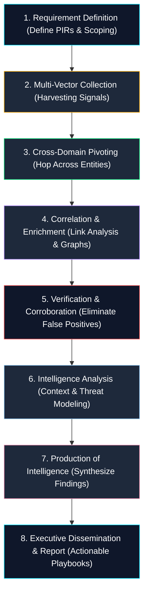
```mermaid

flowchart TD
    R["1. Requirement Definition (Define PIRs & Scoping)"] --> C["2. Multi-Vector Collection (Harvesting Signals)"]
    C --> P["3. Cross-Domain Pivoting (Hop Across Entities)"]
    P --> CR["4. Correlation & Enrichment (Link Analysis & Graphs)"]
    CR --> V["5. Verification & Corroboration (Eliminate False Positives)"]
    V --> A["6. Intelligence Analysis (Context & Threat Modeling)"]
    A --> I["7. Production of Intelligence (Synthesize Findings)"]
    I --> RP["8. Executive Dissemination & Report (Actionable Playbooks)"]

    style R fill:#0f172a,stroke:#00e5ff,color:#fff
    style C fill:#1e293b,stroke:#ffab00,color:#fff
    style P fill:#1e293b,stroke:#00e676,color:#fff
    style CR fill:#1e293b,stroke:#b388ff,color:#fff
    style V fill:#0f172a,stroke:#ff5252,color:#fff
    style A fill:#1e293b,stroke:#90caf9,color:#fff
    style I fill:#1e293b,stroke:#f48fb1,color:#fff
    style RP fill:#0f172a,stroke:#00e5ff,color:#fff
```

---

## 104. End-to-End Enterprise Security Case Study

### Target: `example.com` (Authorized Assessment Scenario)
1. **Step 1 — Domain Registration:** Run `whois example.com` to identify the registrar, creation date, and nameservers (`ns1.awsdns.com`).
2. **Step 2 — DNS Profiling:** Run `dig example.com MX` to identify Microsoft 365 email routing, and check `TXT` records to discover SPF inclusion of SendGrid and Mailchimp.
3. **Step 3 — Passive Subdomain Discovery:** Run `subfinder -d example.com -silent` discovering 85 subdomains, including `jira.internal.example.com` and `vpn.example.com`.
4. **Step 4 — Certificate Transparency:** Query `crt.sh` discovering an unindexed wildcard certificate `*.dev.example.com` issued 48 hours ago.
5. **Step 5 — Infrastructure Port Scanning:** Run `shodan search "ssl:example.com"` revealing an exposed server on port `8443` running an unauthenticated Prometheus metrics dashboard.
6. **Step 6 — Technology Stack:** Use `wappalyzer` to identify that the primary application runs on Laravel 9 and React with an Amazon Web Services backend.
7. **Step 7 — GitHub Secret Reconnaissance:** Execute `gitleaks detect` on a public developer repository belonging to an employee, recovering a hardcoded AWS IAM Access Key.
8. **Step 8 — Threat Intelligence Correlation:** Query discovered server IPs on **GreyNoise** and **AbuseIPDB** to ensure they are not known malicious honeypots.
9. **Step 9 — Dossier Compilation:** Document all verified exposures in a structured intelligence report with immediate remediation instructions.

---

## 105. The OSINT Pivot Mindset

<div align="center">

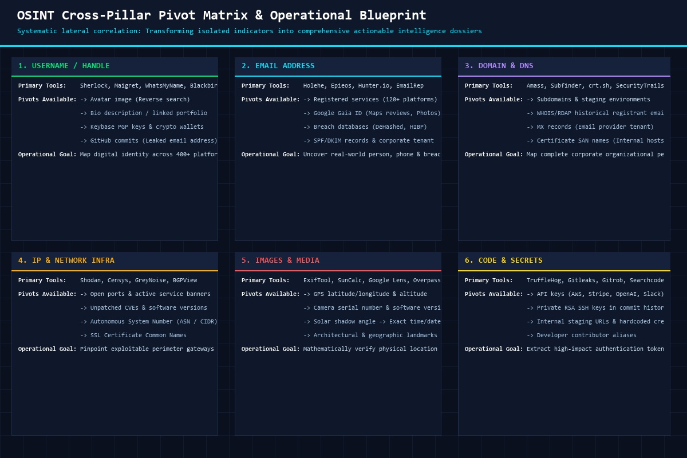

*Figure 105.1: The Unified OSINT Cross-Pillar Pivot Matrix & Operational Blueprint.*

</div>

The core differentiator between a casual searcher and a professional intelligence analyst is the **Pivot Mindset**—the ability to jump from one entity type into another across disparate data domains:

```text
EMAIL
  └── USERNAME (via prefix analysis)
        └── SOCIAL MEDIA (via Sherlock / Maigret)
              └── GITHUB (via public developer handle)
                    └── COMPANY NAME (via git commit email)
                          └── DOMAIN (via corporate website)
                                └── DNS (via dig / nslookup)
                                      └── IP ADDRESS (via A record)
                                            └── ASN (via BGPView)
                                                  └── SSL CERTIFICATE (via Shodan / crt.sh)
                                                        └── SERVER INFRASTRUCTURE
```

---

## 106. Tiered OSINT Toolkit Recommendations

Structured progression for students, analysts, and enterprise purple teams:

| Operational Tier | Category | Essential Core Tools |
| :---: | :--- | :--- |
| **Tier 1** | **Foundations (Master First)** | Google / Bing Advanced Dorks, Wayback Machine, Google Lens, ExifTool, WHOIS/RDAP, `dig`, `crt.sh`, Shodan, Censys, VirusTotal, urlscan.io, Have I Been Pwned |
| **Tier 2** | **CLI & Automation** | Sherlock, Maigret, theHarvester, OWASP Amass, Subfinder, Assetfinder, SpiderFoot, Recon-ng, Maltego, FinalRecon |
| **Tier 3** | **Cyber Threat Intel (CTI)** | MITRE ATT&CK, MISP, AlienVault OTX, AbuseIPDB, GreyNoise, ThreatFox, URLhaus, MalwareBazaar, CISA KEV, NVD |
| **Tier 4** | **Geospatial (GEOINT)** | Google Earth Pro, OpenStreetMap, Mapillary, SunCalc, Overpass Turbo, Copernicus Browser, NASA Worldview, QGIS |
| **Tier 5** | **Media Verification** | InVID / WeVerify, Google Lens, Yandex Images, TinEye, ExifTool, FFmpeg, MediaInfo, Tesseract OCR |
| **Tier 6** | **Enterprise & Advanced** | Neo4j, Gephi, Graphistry, MISP, STIX 2.1 / TAXII, GDELT Project, Common Crawl, Intelligence X, SecurityTrails |

---

## 107. The Unified OSINT Tool & Relationship Map

```text
                                         OSINT DOMAIN ECOSYSTEM
                                                   │
                ┌──────────────────────────────────┼──────────────────────────────────┐
                │                                  │                                  │
          👤 PEOPLE & IDENTITY            🌐 NETWORK & TECHNOLOGY               🖼️ MEDIA & GEOINT
                │                                  │                                  │
        ┌───────┼───────┐                  ┌───────┼───────┐                  ┌───────┼───────┐
        │       │       │                  │       │       │                  │       │       │
      EMAIL  USERNAME PHONE              DOMAINS  DNS/IP  DEVICES           IMAGES  VIDEO   GEOLOC
        │       │       │                  │       │       │                  │       │       │
     Holehe Sherlock PhoneInfoga        Subfinder dig    Shodan            ExifTool InVID   SunCalc
     Epieos Maigret  Truecaller         Amass    BGPView Censys            Lens     yt-dlp  GoogleEarth
     HIBP   Blackbird NumVerify         crt.sh   IPinfo  GreyNoise         ELA      FFmpeg  Overpass
        │       │       │                  │       │       │                  │       │       │
        └───────┬───────┘                  └───────┬───────┘                  └───────┬───────┘
                │                                  │                                  │
                └──────────────────────────────────┼──────────────────────────────────┘
                                                   │
                                      🔄 MULTI-HOP CORRELATION
                                                   │
                                     ┌─────────────┴─────────────┐
                                     │                           │
                                  Maltego                      Neo4j
                                 SpiderFoot                    Gephi
                                     │                           │
                                     └─────────────┬─────────────┘
                                                   │
                                        🧠 THREAT INTELLIGENCE
                                        (MISP, STIX 2.1, CTI)
                                                   │
                                      📑 ACTIONABLE REPORTING
```

### The 10 Core Tools Every Cybersecurity Analyst Must Master:
1. **Google / Bing Advanced Dorks:** Rapid web indexing, directory listings, and document hunting.
2. **Shodan:** Comprehensive passive discovery of exposed servers, IoT banners, industrial controls, and SSL certificates.
3. **Censys:** Deep protocol analysis, leaf certificate discovery, and attack surface tracking.
4. **Maltego:** Visual link analysis, graph generation, and automated multi-hop transform chains.
5. **SpiderFoot:** End-to-end automated collection across hundreds of threat intelligence APIs.
6. **OWASP Amass & Subfinder:** High-speed passive subdomain enumeration and attack surface mapping.
7. **theHarvester:** Fast passive email, subdomain, IP, and employee harvesting.
8. **Sherlock & Maigret:** Multi-platform username hunting and digital identity footprinting.
9. **VirusTotal & AlienVault OTX:** Threat intelligence correlation, domain reputation, and malware pivoting.
10. **ExifTool & SunCalc:** Hardware metadata extraction and solar shadow chronolocation.

---

<div align="center">

**🎯 Open Source Intelligence (OSINT) Operations Manual Complete**

*Ethical • Actionable • Enterprise-Grade Cyber Threat Intelligence*

</div>
