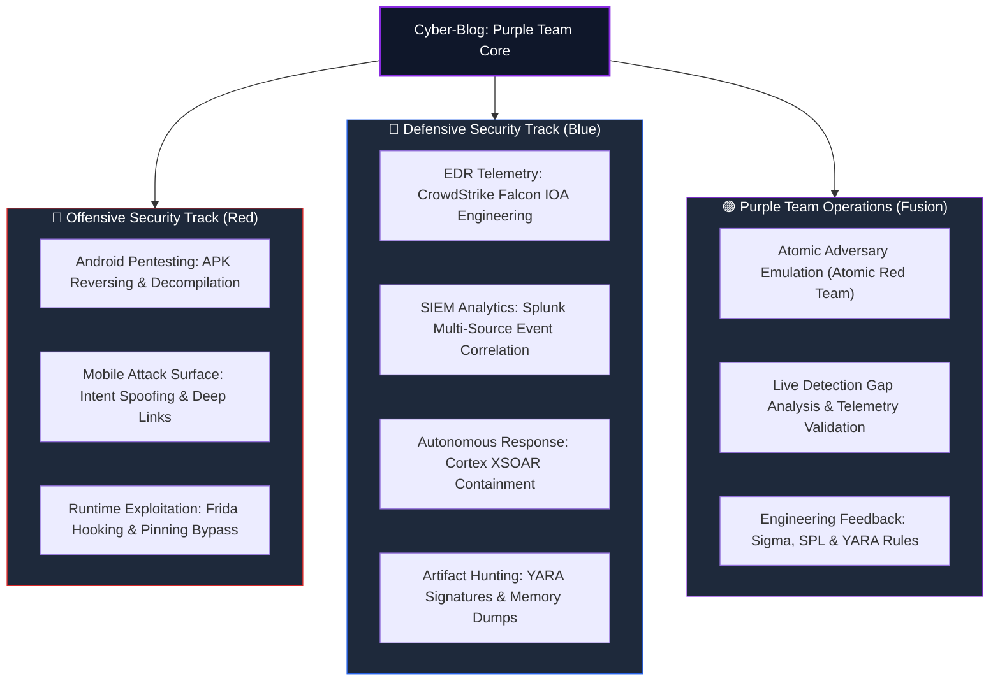
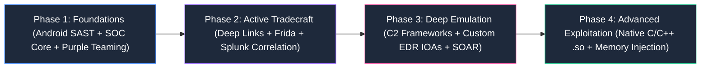

# 🛡️ Cyber-Blog: The Purple Team Nexus

<p align="center">
  <b>Offensive Tradecraft Meets Detection Engineering & Autonomous Response</b>
  <br />
  <i>"Every attack we execute builds the rule to stop it."</i>
</p>

<p align="center">
  
  
  
  
</p>

---

## 🎯 The Purple Team Manifesto

Traditional information security is broken by silos. **Red Teams** operate in isolation, exploiting vulnerabilities and presenting retrospective audit reports. **Blue Teams** defend blind, drowning in false positives and struggling to pinpoint how intrusions evade perimeter controls.

**This blog exists at the intersection of both worlds:**

```text
+-----------------------------------------------------------------------------------------------+
|                                    The Purple Team Fusion                                     |
+--------------------------+------------------------------------+-------------------------------+
|     RED TEAM (Offense)   |        PURPLE TEAM (Nexus)         |      BLUE TEAM (Defense)      |
|  - Mobile App Pentesting |  - Real-Time Adversary Emulation   |  - CrowdStrike Falcon EDR     |
|  - Reverse Engineering   |  - Telemetry & Sensor Auditing     |  - Splunk SIEM Analytics (SPL)|
|  - Intent & IPC Attacks  |  - MITRE ATT&CK Posture Scoring    |  - Cortex XSOAR Automation    |
|  - Bypass & Obfuscation  |  - Collaborative Feedback Loop     |  - YARA Byte Pattern Hunting  |
+--------------------------+------------------------------------+-------------------------------+
```

We do not simply research attacks—we engineer the detection rules, telemetry pipelines, and automated response playbooks required to detect and neutralize them.

---

## 🗺️ Knowledge Base Architecture



---

## 📚 Published Modules & Articles

### 🟣 Purple Team Operations
* [**Purple Teaming — Bridging Adversary Emulation with Detection Engineering**](Purple_Team/Adversary_Emulation_and_Detection/Purple_Team_Methodology_and_Workflow.MD)
  * *Topics:* The 6-Stage Feedback Loop, MITRE ATT&CK scoring, live atomic test of T1059.001 (Obfuscated PowerShell), custom Splunk SPL detection rules, and the Purple Team tooling ecosystem (VECTR, Atomic Red Team, Caldera).

### 🔵 Security Operations Center (Blue Team)
* [**EDR, SIEM, SOAR & YARA — Modern SOC Detection & Response Workflow**](SOC/EDR_SIEM_SOAR_YARA/EDR_SIEM_SOAR_YARA_Modern_SOC_Workflow.MD)
  * *Topics:* Process lineage tracking with CrowdStrike Falcon, multi-source log correlation with Splunk, automated playbook containment with Cortex XSOAR, and byte-level payload classification with YARA.

### 🔴 Mobile Application Security (Red Team)
* [**Android Pentesting (Part 1) — Introduction, APK Analysis, JADX & MobSF**](Android_pentest/Introduction,%20APK%20Analysis,%20JADX%20&%20MobSF/Android_pentest_part-1.MD)
  * *Topics:* Complete Android pentesting methodology, APK disassembly, JADX reverse engineering, MobSF automated SAST/DAST, AndroidManifest auditing, and component exposure logic.

---

## 🛠️ The Purple Team Arsenal

| Domain | Core Tooling Stack | Primary Focus |
| :--- | :--- | :--- |
| **Offensive Mobile** | JADX, APKTool, MobSF, Frida, Objection, ADB | APK reversing, dynamic hooking, and IPC inspection |
| **Adversary Emulation** | Atomic Red Team, MITRE Caldera, VECTR, Prelude | Controlled, repeatable adversary tradecraft execution |
| **Endpoint Telemetry** | CrowdStrike Falcon, Microsoft Defender, Sysmon | Process trees, driver hooks, and memory inspection |
| **SIEM & Correlation** | Splunk Enterprise Security, Sigma Rules, KQL | Behavioral correlation, event parsing, and alert tuning |
| **Orchestration (SOAR)**| Palo Alto Cortex XSOAR, Shuffle, Tines | Automated incident triage, enrichment, and host isolation |
| **Artifact Analysis** | YARA, Ghidra, CyberChef, PE-bear | Signature generation, binary disassembling, and file parsing |

---

## 📈 Series Roadmap



---

## ⚖️ Legal & Ethical Disclaimer

All workflows, scripts, and attack simulations documented in this repository are published strictly for educational purposes, defensive detection engineering, and authorized security assessments. Unauthorized access against systems or networks without explicit written permission is strictly prohibited and illegal.
