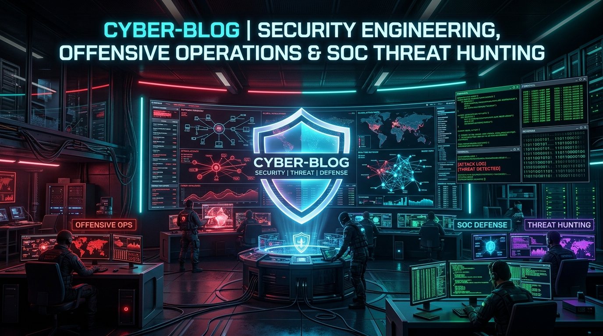

# 🛡️ CYBER-BLOG 🛡️
### Offensive Operations • Defensive Engineering • Threat Hunting • DevSecOps • Mobile Security

  <b>A comprehensive, production-grade cybersecurity knowledge base, hands-on lab walkthroughs, tool masterclasses, DevSecOps hardening guides, and detection engineering playbooks.</b>

[📚 Tool Masterclasses](#tool-masterclasses) • [🔎 OSINT Masterclass](#open-source-intelligence-osint--threat-reconnaissance) • [🔒 GitHub Security & DevSecOps](#github-security--devsecops-masterclass) • [🎯 Hands-on Lab Solutions](#hands-on-lab-walkthroughs-ine--attackdefense) • [👥 Security Teams](#security-team-operations) • [🛡️ SOC & Incident Response](#soc-detection-engineering--incident-response) • [📱 Mobile Pentesting](#android-application-penetration-testing) • [🤝 Contribute](./CONTRIBUTING.md)

---

# 📖 About This Repository

Welcome to **Cyber-Blog**! 👋

This repository is my central cybersecurity research blog and operational knowledge base. Rather than high-level summaries or basic command cheat sheets, every guide in this repository is built as an **in-depth, production-ready masterclass**—grounded in low-level protocol mechanics, source code analysis, realistic attack tradecraft, detection engineering (Sigma rules), CI/CD pipeline hardening, and enterprise defense playbooks.

Whether you are preparing for certifications (**eJPT, eCPPT, OSCP, BAP, CRTP, eCDFP, CySA+**), conducting authorized penetration testing engagements, or defending an enterprise SOC and cloud infrastructure, this repository provides deep, actionable knowledge.

---

# 🗺️ Repository Architecture & Ecosystem

```mermaid
flowchart TD
    Hub["🛡️ CYBER-BLOG ROOT"]
    
    Hub --> Tools["🧰 Tools Masterclasses\n(tools/)"]
    Hub --> Osint["🔎 OSINT & Recon\n(OSINT/)"]
    Hub --> GhSec["🔒 GitHub Security\n(GitHub_Security/)"]
    Hub --> SecTeams["👥 Security Teams\n(Security_Team/)"]
    Hub --> SOC["🛡️ SOC & Blue Team\n(SOC/)"]
    Hub --> Mobile["📱 Mobile Security\n(Android_pentest/)"]
    Hub --> Labs["🎯 Hands-on Labs\n(INE lab/)"]

    Tools --> T1["Nmap Complete Course"]
    Tools --> T2["John the Ripper Course"]
    Tools --> T3["Hashcat Complete Course"]
    Tools --> T4["Aircrack-ng Wi-Fi Course"]

    Osint --> O1["OSINT Operational Framework & Playbook"]
    Osint --> O2["Infrastructure, Shodan & Censys"]
    Osint --> O3["GEOINT, EXIF & Video Forensics"]
    Osint --> O4["CTI, MISP, Dark Web & Blockchain"]

    GhSec --> G1["Real-World Incidents (Uber, Toyota, Codecov)"]
    GhSec --> G2["Secret Prevention (Gitleaks, Push Protection)"]
    GhSec --> G3["Pipeline Hardening (OIDC, SHA Pinning, CodeQL)"]

    SecTeams --> ST1["🔴 Red Team Operations"]
    SecTeams --> ST2["🔵 Blue Team Operations"]
    SecTeams --> ST3["🟣 Purple Team Methodology"]
    SecTeams --> ST4["⚖️ Red vs Blue Mindsets"]

    SOC --> S1["EDR, SIEM, SOAR & YARA Workflow"]
    SOC --> S2["NIST SP 800-61 Incident Response"]

    Mobile --> M1["Part 1: APK Reverse Engineering & MobSF"]
    Mobile --> M2["Part 2: Lab Setup, ADB & Rooting"]

    Labs --> L1["Kibana Event Logs I (Atomic Red Team)"]
    Labs --> L2["Kibana Event Logs II (UserHunter AD)"]
    Labs --> L3["Kibana Event Logs III (IIS Webshell & AppCmd)"]
    Labs --> L4["Log Anomaly Detection Basics (Web Telemetry)"]
    Labs --> L5["Compromised Credentials (Host Forensics)"]
    Labs --> L6["Malicious User Behaviour Analysis (Insider Threat)"]
    Labs --> L7["Apache Error Log Analysis (CID 140)"]
    Labs --> L8["Apache Access Log Analysis (CID 103)"]
    Labs --> L9["False Positive Validation (Wazuh & TheHive)"]
    Labs --> L10["Account Creation & PrivEsc (Wazuh & TheHive)"]
    Labs --> L11["PCAP Analysis With Zeek (Malware Forensics)"]
    Labs --> L12["Attack Emulation on ELK (HELK & Atomic Red Team)"]

    style Hub fill:#0f172a,stroke:#3b82f6,stroke-width:2px,color:#fff
    style Tools fill:#1e293b,stroke:#06b6d4,color:#fff
    style Osint fill:#1e293b,stroke:#00e5ff,stroke-width:2px,color:#fff
    style GhSec fill:#1e293b,stroke:#10b981,stroke-width:2px,color:#fff
    style SecTeams fill:#1e293b,stroke:#a855f7,color:#fff
    style SOC fill:#1e293b,stroke:#0ea5e9,color:#fff
    style Mobile fill:#1e293b,stroke:#f59e0b,color:#fff
    style Labs fill:#1e293b,stroke:#ef4444,color:#fff
```

---

# 📑 Complete Knowledge Base Index

| Category | Module / Topic | Core Technologies | Level | Direct Link |
| :--- | :--- | :--- | :---: | :---: |
| 🔒 **Git & GitHub** | **How to Use Git & GitHub Securely** | Essential Commands, Git 4-Zones, Ed25519 SSH, `gh` CLI, Signed Commits | All Levels | [Explore](./GitHub_Security/How_to_Use_GitHub_Securely_Complete_Guide.md) |
| 🔒 **DevSecOps** | **GitHub Security & Hardening Masterclass** | Breach Case Studies (Uber/Toyota), Secret Scanning, Gitleaks, OIDC, Actions | All Levels | [Explore](./GitHub_Security/GitHub_Security_and_Hardening_Masterclass.md) |
| 🔎 **OSINT** | **Open Source Intelligence & Threat Reconnaissance** | Complete 20-Domain Framework: Shodan, Censys, Subfinder, Holehe, GEOINT, Dark Web, Crypto | Professional | [Explore](./OSINT/Over%20all%20OSINT/README.md) |
| 🧰 **Tools** | **Nmap Masterclass** | TCP/UDP Sockets, Raw Packets, NSE (Lua), Firewall Evasion | All Levels | [Explore](./tools/Nmap/README.md) |
| 🧰 **Tools** | **John the Ripper Masterclass** | Hash Cracking, Rule Mutation, Incremental, `*2john` Converters | All Levels | [Explore](./tools/John%20the%20ripper/README.md) |
| 🧰 **Tools** | **Hashcat Masterclass** | GPU Acceleration, Attack Modes (0,1,3,6,7), Cryptanalysis | All Levels | [Explore](./tools/Hashcat/README.md) |
| 🧰 **Tools** | **Aircrack-ng Wi-Fi Security** | 802.11 Frames, EAPOL 4-Way Handshake, WPA2/WPA3, PMF | All Levels | [Explore](./tools/Aircrack-ng/README.md) |
| 🎯 **Labs** | **Kibana: Event Logs I (CID 1182)** | Sysmon EID 1, Atomic Red Team, LOLBAS, `schtasks`, `sdelete` | Hands-on | [Explore](./INE%20lab/Kibana%20Windows%20Event%20Logs%20I/README.md) |
| 🎯 **Labs** | **Kibana: Event Logs II (CID 1185)** | Sysmon EID 3, Active Directory, `Invoke-UserHunter`, LDAP/SMB | Hands-on | [Explore](./INE%20lab/Kibana%20Windows%20Event%20Logs%20II/README.md) |
| 🎯 **Labs** | **Kibana: Event Logs III (CID 1186)** | Sysmon EID 1, IIS Webshell, In-Memory XOR Decryption, `appcmd` | Hands-on | [Explore](./INE%20lab/Kibana%20Windows%20Event%20Logs%20III/README.md) |
| 🎯 **Labs** | **Log Anomaly Detection (CID 141)** | Web Server Access Logs, Cardinality Profiling, RFC Violations, Outliers | Hands-on | [Explore](./INE%20lab/Log%20Anomaly%20Detection%20Basics/README.md) |
| 🎯 **Labs** | **Compromised Credentials** | Windows Security EID 4625/4624, Sysmon EID 3, SMB Password Spray | Hands-on | [Explore](./INE%20lab/Compromised%20Credentials/README.md) |
| 🎯 **Labs** | **Malicious User Behaviour** | Linux Credential Audit, ClamAV Malware Scan, Rogue Netcat Sockets | Hands-on | [Explore](./INE%20lab/Malicious%20User%20Behaviour%20Analysis/README.md) |
| 🎯 **Labs** | **Apache Error Log Analysis** | Web Server Error Telemetry, LFI Traversal, Basic Auth Spraying, 404s | Hands-on | [Explore](./INE%20lab/Apache%20Error%20Log%20Analysis%20Basics/README.md) |
| 🎯 **Labs** | **Apache Access Log Analysis** | Web Server Access Telemetry, Top Clients, User-Agents, CMS Brute Force | Hands-on | [Explore](./INE%20lab/Apache%20Log%20Analysis%20Basics/README.md) |
| 🎯 **Labs** | **False Positive Validation** | Wazuh v4.x, TheHive, Alert Triage, TLP/PAP, Case Escalation | Hands-on | [Explore](./INE%20lab/False%20Positive%20Validation%20Trusted%20Admin%20Brute-Force%20Detection/README.md) |
| 🎯 **Labs** | **Account Creation & PrivEsc** | Wazuh v4.x, TheHive, Sudoers, Multi-Stage Triage, L2 Escalation | Hands-on | [Explore](./INE%20lab/Account%20Creation%20&%20Privilege%20Escalation%20Attempt%20Detection/README.md) |
| 🎯 **Labs** | **PCAP Analysis With Zeek** | Zeek/Bro Engine, jq, Bumblebee C2, Cobalt Strike, Emotet Phishing | Hands-on | [Explore](./INE%20lab/PCAP%20Analysis%20With%20Zeek/README.md) |
| 🎯 **Labs** | **Attack Emulation & Detection on ELK** | HELK Platform, Invoke-AtomicTest, Winlogbeat→Kafka→ES, Kibana Discover | Hands-on | [Explore](./INE%20lab/Effectively%20Using%20the%20ELK%20Stack/README.md) |
| 👥 **Teams** | **🔴 Red Team Operations** | C2 Infrastructure, Evasion, Lateral Movement, AD Exploitation | Intermediate | [Explore](./Security_Team/Red_Team/README.md) |
| 👥 **Teams** | **🔵 Blue Team Operations** | Threat Hunting, EDR Telemetry, SIEM Correlation, Hardening | Intermediate | [Explore](./Security_Team/Blue_Team/README.md) |
| 👥 **Teams** | **🟣 Purple Team Methodology** | Adversary Emulation, Telemetry Validation, Sigma Rules | Intermediate | [Explore](./Security_Team/Purple_Team/README.md) |
| 👥 **Teams** | **⚖️ Red vs Blue Team Dynamics** | Asymmetric Defense, Mental Models, Feedback Loops | Fundamental | [Explore](./Security_Team/Red_Team_vs_Blue_Team/README.md) |
| 🛡️ **SOC** | **Modern SOC Workflow** | CrowdStrike EDR, Splunk SIEM, Cortex XSOAR, YARA | Intermediate | [Explore](./SOC/EDR_SIEM_SOAR_YARA/README.md) |
| 🛡️ **SOC** | **NIST SP 800-61 Incident Response** | NIST CSF 2.0 Aligned, Containment, Eradication, RCA | Intermediate | [Explore](./SOC/NIST%20800-61/README.md) |
| 📱 **Mobile** | **Android Pentest Part 1** | APK Decompilation, DEX/Smali, JADX-GUI, MobSF, Manifest Audits | Beginner → Int | [Explore](./Android_pentest/Introduction,%20APK%20Analysis,%20JADX%20&%20MobSF/README.md) |
| 📱 **Mobile** | **Android Pentest Part 2** | Android Studio, ADB Commands, Magisk Rooting, Sandboxing | Beginner → Int | [Explore](./Android_pentest/Android%20Studio,%20ADB,%20Root%20&%20Non-Root%20Lab%20Setup/README.md) |

---

# 🔒 GitHub Security & DevSecOps Masterclass

[👉 **Part 1: How to Use Git & GitHub Securely (CLI, Workflow & Commands)**](./GitHub_Security/How_to_Use_GitHub_Securely_Complete_Guide.md) • [👉 **Part 2: DevSecOps Hardening & Real-World Breaches**](./GitHub_Security/GitHub_Security_and_Hardening_Masterclass.md)

Modern organizations deploy code at unprecedented speeds, making source code repositories and CI/CD pipelines prime Tier-0 attack targets. This comprehensive curriculum covers both everyday secure usage and enterprise defense-in-depth hardening:

* **Real-World Case Studies Dissected:**
  - **Uber AWS Credential Leak (2016):** Attackers scraped hardcoded AWS IAM keys from private GitHub code commits, exfiltrating the PII of 57 million users and 600,000 drivers.
  - **Toyota 5-Year Exposed Access Key (2022):** A contractor uploaded server access keys to a public GitHub repository, remaining undetected for nearly 5 years and exposing 296,000 customers.
  - **Codecov Supply Chain Attack (2021):** Tampered bash uploaders in CI/CD pipelines silently harvested customer environment variables, GitHub tokens, and private keys.
  - **CircleCI Session Hijacking (2023):** Info-stealing malware on a developer laptop bypassed 2FA via session cookie theft, decrypting customer GitHub OAuth tokens.
* **The 5-Layer Defense Blueprint:**
  1. **IAM:** Mandatory FIDO2/WebAuthn MFA, deprecating Classic PATs in favor of Fine-Grained PATs with 30-90 day expiration.
  2. **Secret Prevention:** Local client-side **Gitleaks** pre-commit hooks, server-side **GitHub Push Protection**, and **OpenID Connect (OIDC)** passwordless cloud authentication.
  3. **Branch Protection Rulesets:** Mandatory 2-reviewer pull requests, `CODEOWNERS` signoff, and cryptographically signed commits (GPG/SSH).
  4. **CI/CD Hardening:** Workflow `permissions: read-all`, pinning actions to immutable commit SHAs, and eliminating script injection.
  5. **Supply Chain Defense:** Dependabot automated CVE patching, CodeQL SAST scanning, and Software Bill of Materials (SBOM) generation.

---

# 🔎 Open Source Intelligence (OSINT) & Threat Reconnaissance

[👉 **Explore OSINT Operational Framework**](./OSINT/Over%20all%20OSINT/README.md) • [📖 **Complete Investigation Guide**](./OSINT/Over%20all%20OSINT/OSINT_Complete_Framework_and_Investigation_Guide.md)

Open Source Intelligence is far more than simple search engine queries. This enterprise-grade operational playbook covers end-to-end reconnaissance tradecraft, pivot mechanics, toolchain automation, and blue team mitigation strategies:

* **Core Operational Capabilities:**
  - **Identity & SOCMINT:** Multi-platform username hunting with **Sherlock** and **Maigret**, email profile identification via **Holehe** and **Epieos**, and telecom routing with **PhoneInfoga**.
  - **Attack Surface & Infrastructure:** Passive subdomain discovery via **OWASP Amass**, **Subfinder**, and Certificate Transparency logs (`crt.sh`), paired with port and vulnerability auditing on **Shodan** and **Censys**.
  - **GEOINT & Media Forensics:** Camera hardware and GPS extraction using **ExifTool**, image manipulation verification via **FotoForensics** (Error Level Analysis), solar angle and shadow chronolocation using **SunCalc**, and video keyframe extraction via **InVID**.
  - **Dark Web, Breach & Cryptocurrency:** Monitoring ransomware leak showcases on **Ransomwatch**, querying breached credentials on **DeHashed** and **HIBP**, and tracing Bitcoin/Ethereum fund flows via **Mempool**, **Etherscan**, and **Arkham Intelligence**.
  - **Visual Link Analysis & CTI:** Multi-hop entity mapping using **Maltego** and **Neo4j**, sharing threat intelligence via **MISP** and **STIX 2.1**, and producing executive intelligence dossiers aligned with NIST SP 800-61.

---

# 🧰 Tool Masterclasses

Each tool course is structured as an end-to-end masterclass featuring packet diagrams, hardware breakdowns, animated command executions, and defensive telemetry detection:

### [1. Nmap Complete Course](./tools/Nmap/README.md)
* **Under The Hood:** Full TCP Connect (`-sT`) vs. SYN Half-Open Stealth (`-sS`) three-way handshake mechanics.
* **Scanning Heuristics:** Comprehensive examination of all 6 RFC-defined port states (`open`, `closed`, `filtered`, `unfiltered`, `open|filtered`, `closed|filtered`).
* **Advanced NSE & Evasion:** Writing custom Lua scripts, packet fragmentation (`-f`), MTU manipulation, decoy IP generation (`-D`), and timing template tuning (`-T0` to `-T5`).

### [2. John the Ripper Complete Course](./tools/John%20the%20ripper/README.md)
* **Cracking Modes:** Single Crack heuristic mode, Wordlist mode with custom regex mutation rules, and Incremental brute-force mode.
* **The `*2john` Toolchain:** Deep dive into format conversion utilities (`ssh2john`, `zip2john`, `keepass2john`, `bitlocker2john`, `rar2john`).
* **Session Management:** Restoring interrupted multi-day cracking sessions, managing `.pot` caches, and CPU SIMD acceleration.

### [3. Hashcat Complete Course](./tools/Hashcat/README.md)
* **GPU Compute Architecture:** Massively parallel cryptanalysis leveraging NVIDIA CUDA Tensor Cores and AMD ROCm OpenCL kernels.
* **Attack Modes Dissected:** Straight (`-a 0`), Combination (`-a 1`), Pure Mask Brute-Force (`-a 3`), Hybrid Wordlist+Mask (`-a 6`), and Hybrid Mask+Wordlist (`-a 7`).
* **Cryptographic Algorithms:** Auditing NTLM, Kerberos 5 TGS (Kerberoasting), WPA/WPA2 PMKID, and slow memory-hard hashes (bcrypt, scrypt, Argon2).

### [4. Aircrack-ng Wi-Fi Security Course](./tools/Aircrack-ng/README.md)
* **802.11 Layer 2 Mechanics:** Management, control, and data frames; RF beacon frames; and active monitor mode sniffing.
* **Handshake Auditing:** EAPOL 4-Way Handshake capture, targeted Layer 2 802.11 deauthentication attacks, and PMKID harvesting.
* **Next-Gen Standards:** WPA3 Simultaneous Authentication of Equals (SAE) Dragonfly handshake and 802.11w Protected Management Frames (PMF) defense.

---

# 🎯 Hands-on Lab Walkthroughs (INE / AttackDefense)

Real-world SOC and threat hunting challenges documented with 100% verified flag captures, animated command GIFs, and Sigma detection rules:

| Challenge | Topic & Dataset | Evidence & Flags | Walkthrough |
| :--- | :--- | :---: | :---: |
| **Kibana: Windows Event Logs I** *(CID 1182)* | Red Canary Atomic Red Team test execution emulating adversary LOLBAS actions. Ingested via Sysmon EID 1 into ELK. | 🟢 **5 of 5 Flags** `At0micStrong`, `C:\some\file.txt`, `P@ssw0rd1`, `192.168.1.0/24`, `C:\Windows\Temp\bitsadmin_flag.ps1` | [Read Walkthrough](./INE%20lab/Kibana%20Windows%20Event%20Logs%20I/README.md) |
| **Kibana: Windows Event Logs II** *(CID 1185)* | Active Directory reconnaissance via PowerView's `Invoke-UserHunter`. Ingested via Sysmon EID 3 into ELK. | 🟢 **3 of 3 Flags** `10.59.4.11`, `7`, `10.59.4.12` | [Read Walkthrough](./INE%20lab/Kibana%20Windows%20Event%20Logs%20II/README.md) |
| **Kibana: Windows Event Logs III** *(CID 1186)* | IIS web server compromise via webshell, in-memory UTF-16LE Base64 PowerShell execution, XOR decryption, and `appcmd.exe` credential dumping. | 🟢 **3 of 3 Flags** `DefaultAppPool`, `8d969eef6ecad...`, `C:\Windows\System32\inetsrv\appcmd.exe` | [Read Walkthrough](./INE%20lab/Kibana%20Windows%20Event%20Logs%20III/README.md) |
| **Log Anomaly Detection Basics** *(CID 141)* | Web access log forensics over 1M+ records (`logs.txt`). Multi-variate cardinality, temporal semantics, lexical prefix, and statistical bounds. | 🟢 **5 of 5 Anomalies** `HEADER`, `33JAN2013`, `20XYZ2019`, `8119`, `crachy` | [Read Walkthrough](./INE%20lab/Log%20Anomaly%20Detection%20Basics/README.md) |
| **Compromised Credentials** *(Incident Response)* | Windows host incident response. Triaging 3,651 failed logons (EID 4625), isolating attacker IP `13.214.192.125`, confirming Admin compromise (EID 4624), and attributing SMB service (Sysmon EID 3). | 🟢 **Breach Confirmed** `Administrator`, `13.214.192.125`, `SMB / Port 445`, `3,651 fails` | [Read Walkthrough](./INE%20lab/Compromised%20Credentials/README.md) |
| **Malicious User Behaviour** *(Insider Threat)* | Linux employee security audit across 5 users. Cracking weak password (`12345`), detecting trojan malware (`Unix.Ircbot`), and attributing rogue open port (`4444`) to `usr1`. | 🟢 **3 of 3 Tasks** `usr1`, `12345`, `Unix.Ircbot`, `Port 4444 (nc)` | [Read Walkthrough](./INE%20lab/Malicious%20User%20Behaviour%20Analysis/README.md) |
| **Apache Error Log Analysis** *(CID 140)* | Web server error log forensics (`error.log`). Path bruteforcing (229k requests), Basic Auth spraying (75 users), LFI traversal (15 attacks), and error taxonomy. | 🟢 **7 of 7 Questions** `229,112`, `75 users`, `15 LFI`, `7 error types` | [Read Walkthrough](./INE%20lab/Apache%20Error%20Log%20Analysis%20Basics/README.md) |
| **Apache Access Log Analysis** *(CID 103)* | Web server access forensics (`apache_access.log`). Traffic quantification (10k logs), top client IPs, User-Agent profiling, and Joomla admin credential stuffing. | 🟢 **7 of 7 Questions** `10000`, `91.141.1.150`, `Top 5 UAs`, `Joomla spray` | [Read Walkthrough](./INE%20lab/Apache%20Log%20Analysis%20Basics/README.md) |
| **False Positive Validation** *(SOC Incident)* | Wazuh SIEM v4.x & TheHive incident handling. Triaging SSH brute-force alert (T1110) on 7th Dec 2025, validating admin host `10.0.0.11`, assigning `Severity: LOW`, attaching observables, and escalating to SOC L2. | 🟢 **Validated & Escalated** `10.0.0.11`, `Low`, `TLP:CLEAR`, `soc2@syntrix.com` | [Read Walkthrough](./INE%20lab/False%20Positive%20Validation%20Trusted%20Admin%20Brute-Force%20Detection/README.md) |
| **Account Creation & PrivEsc** *(SOC Incident)* | Wazuh SIEM v4.x & TheHive incident handling. Triaging rogue user `eviluser` (T1136 @ 07:41), SSH login from `10.0.0.11` (T1021/T1078 @ 07:59), and sudoers modification attempt (T1548.003 @ 08:00). Classifying as True Positive (`Severity: HIGH`), registering 4 observables, and escalating to SOC L2. | 🟢 **Verified & Escalated** `eviluser`, `10.0.0.11`, `/etc/sudoers`, `High / TLP:AMBER` | [Read Walkthrough](./INE%20lab/Account%20Creation%20&%20Privilege%20Escalation%20Attempt%20Detection/README.md) |
| **PCAP Analysis With Zeek** *(Network Forensics)* | Bro/Zeek network monitoring and malware dissection. Extracting JSON logs via `jq`, isolating Cobalt Strike C2 (`ceyuvigi.com` / `23.108.57.213`), Bumblebee RAT (`139.177.146.137`), and tracing Emotet Word doc dropper and executable payload (`6169583.exe`). | 🟢 **15 of 15 Solved** `Cobalt Strike`, `Bumblebee`, `Emotet`, `429,056 bytes` | [Read Walkthrough](./INE%20lab/PCAP%20Analysis%20With%20Zeek/README.md) |
| **Attack Emulation & Detection on ELK** *(HELK Threat Hunting)* | Full red-to-blue emulation on HELK platform. Configuring Winlogbeat → Kafka → Elasticsearch pipeline, executing 3 Atomic Red Team simulations (`T1218.010` Regsvr32, `T1518.001` Sysmon Discovery, `T1053.005` Scheduled Task), and detecting all attacks in Kibana Discover. | 🟢 **3 of 3 Detected** `Regsvr32`, `fltmc 385201`, `spawn task`, `HELK/hunting` | [Read Walkthrough](./INE%20lab/Effectively%20Using%20the%20ELK%20Stack/README.md) |

---

# 👥 Security Team Operations

* [🔴 **Red Team Operations:**](./Security_Team/Red_Team/README.md) Adversary emulation, initial access vector generation, Command and Control (C2) architecture, process injection, Active Directory dominance, and defense evasion.
* [🔵 **Blue Team Operations:**](./Security_Team/Blue_Team/README.md) Security operations, continuous telemetry collection, EDR sensor deployment, baseline anomaly detection, threat hunting hypotheses, and proactive enterprise hardening.
* [🟣 **Purple Team Methodology:**](./Security_Team/Purple_Team/README.md) Bringing red and blue teams together into an active feedback loop using Atomic Red Team emulation, coverage mapping against the MITRE ATT&CK matrix, and automated rule validation.
* [⚖️ **Red vs. Blue Team Mindsets:**](./Security_Team/Red_Team_vs_Blue_Team/README.md) The operational and philosophical divergence between attackers ("thinking in graphs") and defenders ("thinking in lists"), and how to unite them.

---

# 🛡️ SOC Detection Engineering & Incident Response

* [**Modern SOC Architecture (EDR, SIEM, SOAR & YARA):**](./SOC/EDR_SIEM_SOAR_YARA/README.md) Building an interconnected SOC pipeline where CrowdStrike Falcon EDR catches endpoint anomalies, Splunk correlates enterprise logs, Cortex XSOAR executes automated containment playbooks, and YARA hunts for lingering file artifacts.
* [**NIST SP 800-61 Incident Response Playbook:**](./SOC/NIST%20800-61/README.md) Enterprise incident response lifecycle aligned with NIST CSF 2.0. Covers incident handling state machines, severity calculation matrices, forensic timeline reconstruction (4Ws), containment tactics, eradication, and lessons-learned reporting.

---

# 📱 Android Application Penetration Testing

* [**Part 1: Introduction, APK Analysis, JADX & MobSF:**](./Android_pentest/Introduction,%20APK%20Analysis,%20JADX%20&%20MobSF/README.md) Unpacking APK packages, Dalvik Executable (DEX) bytecode, Smali disassembly, decompiling with JADX-GUI, automated static analysis using Mobile Security Framework (MobSF), and hunting for vulnerable exported Android components.
* [**Part 2: Lab Setup, ADB Commands & Rooting:**](./Android_pentest/Android%20Studio,%20ADB,%20Root%20&%20Non-Root%20Lab%20Setup/README.md) Configuring Android Studio Virtual Devices (AVD), mastering Android Debug Bridge (`adb shell`, `adb push`, `pm`, `am`), Magisk root architecture, zygote hooks, and configuring non-root testing with Frida gadget injection.

---

# 🎯 MITRE ATT&CK Coverage Matrix

| ATT&CK Tactic | Technique ID | Technique Name | Covered in Module |
| **Reconnaissance** | **T1596** | Search Open Technical Databases (Shodan/Censys/crt.sh) | [OSINT Masterclass](./OSINT/Over%20all%20OSINT/README.md) |
| **Reconnaissance** | **T1589** | Gather Victim Identity Information (Sherlock/Holehe) | [OSINT Masterclass](./OSINT/Over%20all%20OSINT/README.md) |
| **Reconnaissance** | **T1590** | Gather Victim Network Information (DNS/Amass) | [OSINT Masterclass](./OSINT/Over%20all%20OSINT/README.md) |
| **Reconnaissance** | **T1591** | Gather Victim Org Information (SEC EDGAR/OpenCorp) | [OSINT Masterclass](./OSINT/Over%20all%20OSINT/README.md) |
| **Reconnaissance** | **T1593** | Search Open Websites/Domains (Google Dorks/Wayback) | [OSINT Masterclass](./OSINT/Over%20all%20OSINT/README.md) |
| **Reconnaissance** | **T1595** | Active Scanning | [Nmap Masterclass](./tools/Nmap/README.md) |
| **Initial Access** | **T1566.001** | Spearphishing Attachment (Emotet Word Doc) | [PCAP Analysis With Zeek](./INE%20lab/PCAP%20Analysis%20With%20Zeek/README.md) |
| **Execution** | **T1059.001** | PowerShell Scripting | [Kibana Event Logs III](./INE%20lab/Kibana%20Windows%20Event%20Logs%20III/README.md) |
| **Execution** | **T1059.005** | Visual Basic / Macro Execution | [PCAP Analysis With Zeek](./INE%20lab/PCAP%20Analysis%20With%20Zeek/README.md) |
| **Persistence** | **T1053.005** | Scheduled Task / Job | [Kibana Event Logs I](./INE%20lab/Kibana%20Windows%20Event%20Logs%20I/README.md) & [ELK Attack Emulation](./INE%20lab/Effectively%20Using%20the%20ELK%20Stack/README.md) |
| **Persistence** | **T1505.003** | Web Shell Execution | [Kibana Event Logs III](./INE%20lab/Kibana%20Windows%20Event%20Logs%20III/README.md) |
| **Persistence** | **T1136** | Create Account (`eviluser`) | [Account Creation & PrivEsc](./INE%20lab/Account%20Creation%20&%20Privilege%20Escalation%20Attempt%20Detection/README.md) |
| **Privilege Escalation** | **T1548.003** | Abuse Elevation via Sudo (`/etc/sudoers`) | [Account Creation & PrivEsc](./INE%20lab/Account%20Creation%20&%20Privilege%20Escalation%20Attempt%20Detection/README.md) |
| **Defense Evasion** | **T1070.004** | File Deletion (`sdelete`) | [Kibana Event Logs I](./INE%20lab/Kibana%20Windows%20Event%20Logs%20I/README.md) |
| **Defense Evasion** | **T1027** | Obfuscated Files or Information | [Kibana Event Logs III](./INE%20lab/Kibana%20Windows%20Event%20Logs%20III/README.md) |
| **Defense Evasion** | **T1218.010** | Signed Binary Proxy Execution: Regsvr32 | [ELK Attack Emulation](./INE%20lab/Effectively%20Using%20the%20ELK%20Stack/README.md) |
| **Credential Access** | **T1110** | Brute Force Password Guessing | [John the Ripper](./tools/John%20the%20ripper/README.md) & [Hashcat](./tools/Hashcat/README.md) & [Compromised Credentials](./INE%20lab/Compromised%20Credentials/README.md) |
| **Credential Access** | **T1110.003** | Password Spraying (SMB `Administrator`) | [Compromised Credentials](./INE%20lab/Compromised%20Credentials/README.md) |
| **Credential Access** | **T1552.001** | Credentials in Files / Git Trees | [GitHub Security Masterclass](./GitHub_Security/README.md) |
| **Credential Access** | **T1003** | OS Credential Dumping (`appcmd`) | [Kibana Event Logs III](./INE%20lab/Kibana%20Windows%20Event%20Logs%20III/README.md) |
| **Discovery** | **T1087** | Account Discovery (`UserHunter`) | [Kibana Event Logs II](./INE%20lab/Kibana%20Windows%20Event%20Logs%20II/README.md) |
| **Discovery** | **T1018** | Remote System Discovery (Ping / Net) | [Kibana Event Logs I](./INE%20lab/Kibana%20Windows%20Event%20Logs%20I/README.md) & [II](./INE%20lab/Kibana%20Windows%20Event%20Logs%20II/README.md) |
| **Discovery** | **T1518.001** | Security Software Discovery (Sysmon `fltmc`) | [ELK Attack Emulation](./INE%20lab/Effectively%20Using%20the%20ELK%20Stack/README.md) |
| **Lateral Movement** | **T1021.002** | SMB/Windows Admin Shares | [Kibana Event Logs I](./INE%20lab/Kibana%20Windows%20Event%20Logs%20I/README.md) |
| **Lateral Movement** | **T1021.004** | SSH Remote Service Login | [False Positive Validation](./INE%20lab/False%20Positive%20Validation%20Trusted%20Admin%20Brute-Force%20Detection/README.md) & [Account Creation & PrivEsc](./INE%20lab/Account%20Creation%20&%20Privilege%20Escalation%20Attempt%20Detection/README.md) |
| **Collection** | **T1083** | File & Directory Discovery (LFI/Traversal) | [Apache Error Log Analysis](./INE%20lab/Apache%20Error%20Log%20Analysis%20Basics/README.md) |
| **Command & Control** | **T1071.001** | Web Protocols C2 (Cobalt Strike / Bumblebee) | [PCAP Analysis With Zeek](./INE%20lab/PCAP%20Analysis%20With%20Zeek/README.md) |
| **Command & Control** | **T1105** | Ingress Tool Transfer (`bitsadmin`) | [Kibana Event Logs I](./INE%20lab/Kibana%20Windows%20Event%20Logs%20I/README.md) |
| **Supply Chain** | **T1195.001** | Compromise Dependencies (Actions/Packages) | [GitHub Security Masterclass](./GitHub_Security/README.md) |
| **Supply Chain** | **T1195.002** | Compromise Software Supply Chain (Pipeline) | [GitHub Security Masterclass](./GitHub_Security/README.md) |
| **Impact** | **T1204.002** | User Execution: Malicious File (Malware Install) | [Malicious User Behaviour](./INE%20lab/Malicious%20User%20Behaviour%20Analysis/README.md) |
| **Impact** | **T1571** | Non-Standard Port (Netcat Port 4444) | [Malicious User Behaviour](./INE%20lab/Malicious%20User%20Behaviour%20Analysis/README.md) |

---

# ⚖️ Ethical Conduct & Legal Disclaimer

All information, scripts, commands, and methodologies published in this repository are developed strictly for **educational purposes, defensive research, and authorized security assessments**.

Executing offensive actions against target systems without explicit, prior, written consent from the resource owner is illegal under the Computer Fraud and Abuse Act (CFAA), Section 43/66 of the Information Technology Act, and equivalent international cybersecurity legislations. The author assumes no liability for misuse of the techniques described herein.

---

**Crafted with ❤️ by Siva | Continuously Updated with New Research, Tools, DevSecOps & Labs**

⭐ **Star this repository if you find it valuable for your cybersecurity journey!** ⭐

