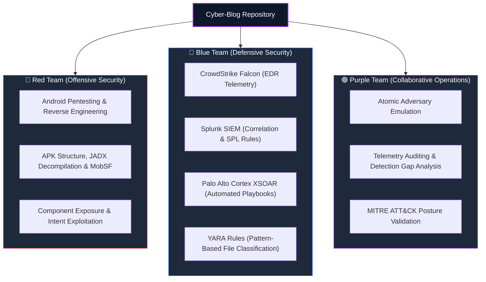

# Cyber-Blog

<p align="center">
  <b>A Hands-On Technical Knowledge Base for Offensive Security, Blue Team Defense, and Purple Team Operations</b>
</p>

<p align="center">
  
  
  
  
</p>

---

## 📖 About This Repository

Welcome to **Cyber-Blog** — a centralized repository documenting practical cybersecurity methodologies, real-world attack simulations, defensive engineering workflows, and collaborative purple team exercises.

The purpose of this repository is to bridge the gap between offensive exploitation and defensive detection engineering:

* **Offensive Research (Red Team):** Dissecting real-world vulnerabilities, reversing binaries, and analyzing modern client/mobile attack vectors.
* **Security Operations (Blue Team):** Designing detection logic, correlating enterprise logs across SIEMs, building automated SOAR playbooks, and writing byte-level YARA rules.
* **Purple Teaming (Fusion):** Testing offensive tactics transparently against defensive controls, validating telemetry in real time, and systematically eliminating detection blind spots.

---

## 🗺️ Repository Structure

```text
Cyber-Blog/
├── README.md
├── Android_pentest/
│   └── Introduction, APK Analysis, JADX & MobSF/
│       └── Android_pentest_part-1.MD
├── SOC/
│   └── EDR_SIEM_SOAR_YARA/
│       └── EDR_SIEM_SOAR_YARA_Modern_SOC_Workflow.MD
└── Purple_Team/
    └── Adversary_Emulation_and_Detection/
        └── Purple_Team_Methodology_and_Workflow.MD
```



---

## 📚 Published Modules & Articles

### 🟣 Purple Team Operations
* [Purple Teaming — Bridging Adversary Emulation with Detection Engineering](https://github.com/sivaoffl04/Cyber-Blog/blob/main/Purple_Team/Adversary_Emulation_and_Detection/Purple_Team_Methodology_and_Workflow.MD)
  * **Topics:** The 6-Stage Feedback Loop, MITRE ATT&CK scoring, live atomic test of T1059.001 (Obfuscated PowerShell), custom Splunk SPL detection rules, and the Purple Team tooling ecosystem (VECTR, Atomic Red Team, Caldera).

### 🔵 Security Operations Center (Blue Team)
* [EDR, SIEM, SOAR & YARA — Modern SOC Detection & Response Workflow](https://github.com/sivaoffl04/Cyber-Blog/blob/main/SOC/EDR_SIEM_SOAR_YARA/EDR_SIEM_SOAR_YARA_Modern_SOC_Workflow.MD)
  * **Topics:** Process lineage tracking with CrowdStrike Falcon, multi-source log correlation with Splunk, automated playbook containment with Cortex XSOAR, and byte-level payload classification with YARA.

### 🔴 Mobile Application Security (Red Team)
* [Android Pentesting (Part 1) — Introduction, APK Analysis, JADX & MobSF](https://github.com/sivaoffl04/Cyber-Blog/blob/main/Android_pentest/Introduction,%20APK%20Analysis,%20JADX%20&%20MobSF/Android_pentest_part-1.MD)
  * **Topics:** Complete Android pentesting methodology, APK disassembly, JADX reverse engineering, MobSF automated SAST/DAST, AndroidManifest auditing, and component exposure logic.

---

## 🛠️ Security Tooling Arsenal

| Discipline | Technologies & Frameworks | Focus Areas |
| :--- | :--- | :--- |
| **Offensive Security** | JADX, APKTool, MobSF, Frida, Objection, ADB | Mobile application auditing, reverse engineering, and dynamic instrumentation |
| **Defensive Security** | CrowdStrike Falcon, Splunk, Cortex XSOAR, YARA | Endpoint telemetry, log correlation, automated response, and signature scanning |
| **Purple Teaming** | Atomic Red Team, MITRE Caldera, VECTR, Sigma | Adversary emulation, telemetry verification, and detection gap analysis |

---

## ⚖️ Disclaimer

All technical articles, scripts, and methodologies published in this repository are for educational, authorized testing, and defensive engineering purposes only. Testing must only be conducted on assets and networks with explicit, written authorization.
