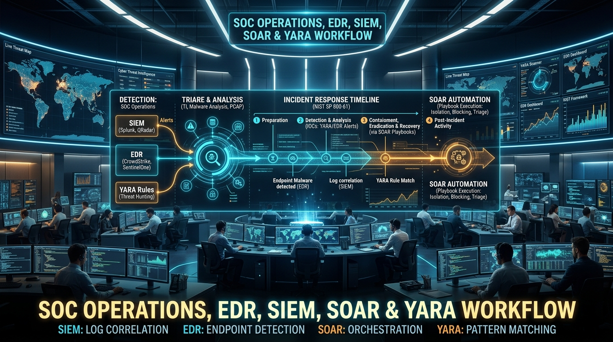
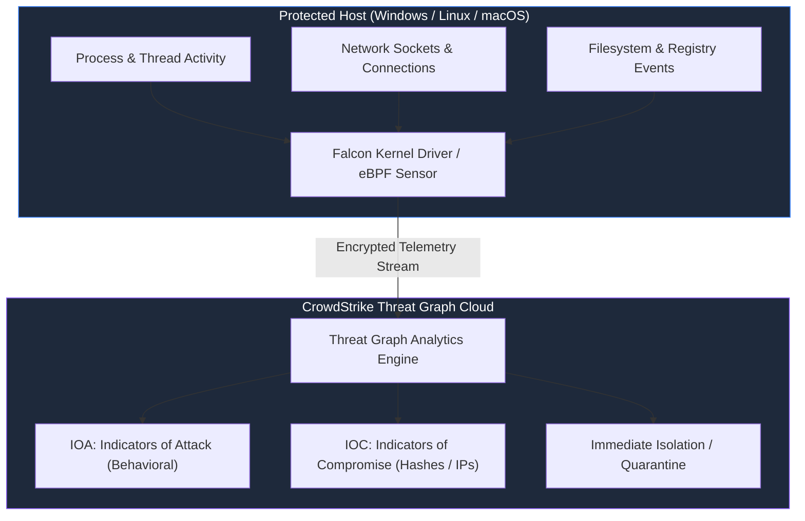
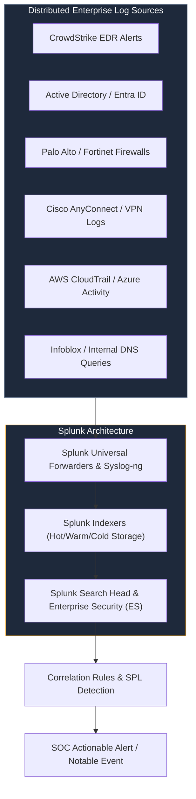
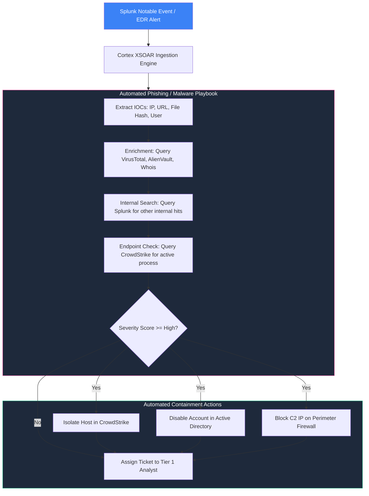
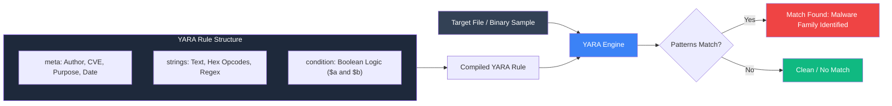
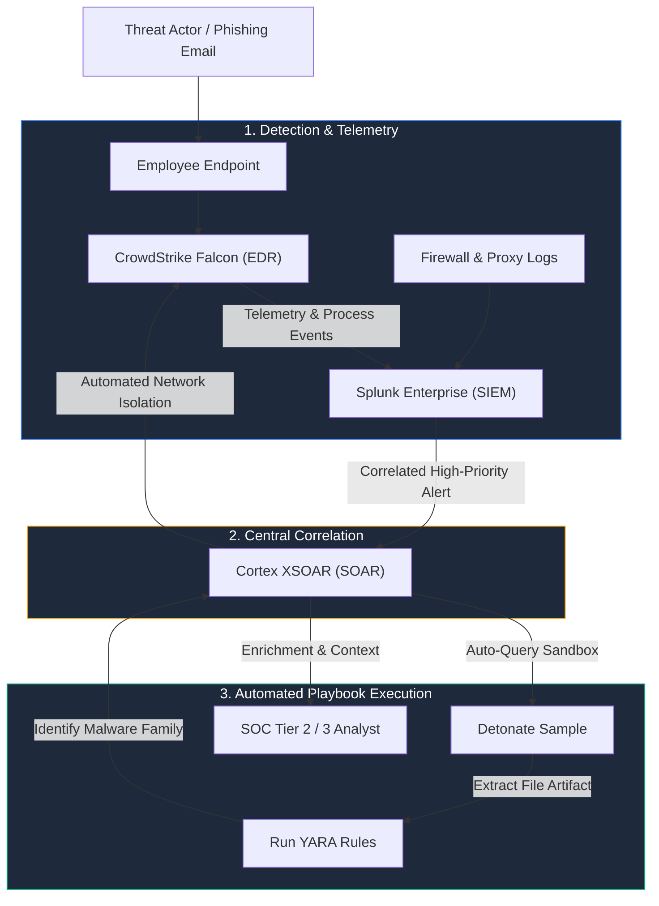
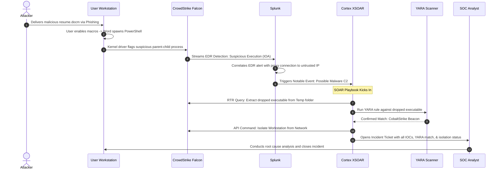
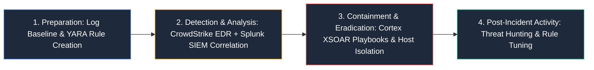

# EDR, SIEM, SOAR & YARA: Building a Modern SOC Detection and Response Workflow

> **Category:** Blue Team & Security Operations | **Series:** SOC Architecture & Engineering | **Level:** Beginner to Intermediate

---

<div align="center">



</div>

---

## Executive Overview

A resilient modern Security Operations Center (SOC) cannot function on isolated, siloed security tools. Defending an enterprise against modern threat actors requires a continuous pipeline that ingests raw telemetry, correlates disparate anomalies, automates rapid containment, and hunts down specialized file artifacts.

```text
+-----------------------------------------------------------------------------------------------+
|                                Modern SOC Defensive Matrix                                    |
+--------------------------+---------------------------+----------------------------------------+
|  Tier 1: Endpoint Depth  |  Tier 2: Enterprise Breadth| Tier 3: Autonomous Response & Hunting  |
|  - Process Lineage       |  - Centralized Logs       |  - Playbook Automation                 |
|  - Memory & Driver State |  - Cross-Source Analytics |  - Real-Time Indicator Enrichment      |
|  - Real-Time Containment |  - Alert Generation (SPL) |  - Byte-Level Pattern Hunting (YARA)   |
|  (CrowdStrike Falcon)    |  (Splunk SIEM)            |  (Cortex XSOAR & YARA)                 |
+--------------------------+---------------------------+----------------------------------------+
```

The core SOC paradigm centers around four foundational building blocks:
* **EDR (CrowdStrike Falcon):** Deep granular visibility into endpoint kernel, memory, and process events.
* **SIEM (Splunk):** Massive aggregation, cross-platform normalization, and behavioral correlation.
* **SOAR (Palo Alto Cortex XSOAR):** Orchestration engine that coordinates multi-vendor actions through automated playbooks.
* **YARA:** Signature and byte-pattern language for classifying malware and inspecting suspicious files.

> [!NOTE]
> When configured in isolation, security teams experience alert fatigue and slow mean-time-to-respond (MTTR). When unified, these technologies form an automated detection, triage, and eradication pipeline.

---

# 1. EDR — CrowdStrike Falcon

**Endpoint Detection and Response (EDR)** provides behavioral instrumentation, threat detection, and active incident response on corporate workloads, servers, and workstations (Windows, Linux, macOS).



### Telemetry Monitored by Modern EDR

Modern EDR goes far beyond traditional signature-based antivirus by recording continuous event trees:

| Telemetry Type | Specific Artifacts Captured | Security Value |
| :--- | :--- | :--- |
| **Process Lineage** | Parent-Child Relationships, Process IDs, CLI arguments | Detects abnormal execution flows (e.g. Word launching PowerShell) |
| **Authentication & Users** | Logon Sessions, Kerberos tickets, privilege changes | Identifies credential access and local privilege escalation |
| **Network Sockets** | Destination IPs, ports, initiating process, DNS lookups | Exposes command-and-control (C2) communication channels |
| **Persistence Hooks** | Scheduled Tasks, Services, Registry Run Keys, Daemons | Reveals how attackers maintain access after reboot |
| **Memory Injections** | Process Hollowing, DLL Injection, reflective loading | Exposes fileless attacks running purely in volatile memory |

### Example: Suspicious Process Execution Tree

In a phishing attack, malicious Office documents frequently weaponize macros to spawn system shells. Falcon traces this exact execution lineage:

```text
WINWORD.EXE (PID: 4120 - User opened malicious invoice.docm)
     │
     └── powershell.exe (PID: 6788 - Spawned with encoded execution flags)
              │
              └── Command: powershell.exe -enc SQBFAFgA... (Base64 Encoded)
              │
              └── Network Connection: Outbound to 198.51.100.45:443 (C2 Server)
              │
              └── rundll32.exe (PID: 7890 - Payload injected into system process)
```

### Strategic Role of CrowdStrike Falcon

* **Real-time Threat Prevention:** Blocks known malware via machine learning (pre-execution) and halts unknown threats via behavioral Indicators of Attack (IOAs).
* **Deep Forensic Visibility:** Reconstructs the complete timeline of what an attacker executed on the endpoint.
* **Network Containment:** Instantly isolates an infected machine from the network with one click or API call, keeping only the management channel active.
* **Real Time Response (RTR):** Spawns an interactive remote shell to retrieve memory dumps, kill processes, or delete malicious persistence keys.

> [!TIP]
> **Key Concept:** EDR provides deep, micro-level visibility into endpoint behavior and internal process interactions.

---

# 2. SIEM — Splunk

While an EDR provides unmatched endpoint depth, it rarely sees identity providers, VPN gateways, firewalls, and cloud access logs. A **Security Information and Event Management (SIEM)** platform centralizes and correlates these disparate logs across the entire infrastructure.



### The Power of Multi-Source Correlation

A single failed login is normal noise. A spike of failed logins followed by a successful login from an anomalous geographic IP, followed by an outbound connection to an unknown domain, indicates a compromised account.

```text
Log 1: Active Directory Event 4625 (Failed logon attempt for jsmith)
       +
Log 2: Active Directory Event 4625 (Failed logon attempt for jsmith)
       +
Log 3: Active Directory Event 4625 (Failed logon attempt for jsmith)
       +
Log 4: Active Directory Event 4624 (Successful logon for jsmith)
       +
Log 5: VPN Log (Login originated from an anomalous ASN / Tor exit node)
       +
Log 6: EDR Event (New administrative service created within 2 minutes)
```

### Detection via Search Processing Language (SPL)

SOC engineers author correlation queries using Splunk SPL:

```spl
index=wineventlog (EventCode=4625 OR EventCode=4624)
| eval Status=if(EventCode==4625, "Failed", "Success")
| stats 
    count(eval(Status=="Failed")) as FailedAttempts,
    count(eval(Status=="Success")) as SuccessAttempts,
    values(src_ip) as SourceIPs,
    earliest(_time) as FirstSeen,
    latest(_time) as LastSeen 
    by user
| where FailedAttempts >= 5 AND SuccessAttempts >= 1
| eval TimeWindowSeconds = LastSeen - FirstSeen
| where TimeWindowSeconds <= 300
```

### Strategic Role of Splunk

* **Log Centralization:** Normalizes diverse data formats into the Common Information Model (CIM).
* **Correlation Engines:** Connects network anomalies with identity behaviors and EDR telemetry.
* **Threat Hunting:** Enables analysts to search billions of historical log lines in seconds.
* **Compliance & Retention:** Retains verifiable audit trails for regulatory compliance (PCI-DSS, ISO 27001, HIPAA).

> [!TIP]
> **Key Concept:** SIEM provides wide, macro-level visibility and multi-source correlation across the entire enterprise.

---

# 3. SOAR — Palo Alto Cortex XSOAR

Tier 1 SOC analysts are frequently overwhelmed by repetitive alert triage: copying IP addresses into VirusTotal, checking if a user is active in Active Directory, or pinging the host.

A **Security Orchestration, Automation, and Response (SOAR)** platform eliminates manual overhead by executing automated **Playbooks** across heterogeneous security tools.



### Anatomy of an XSOAR Playbook

A typical playbook orchestrates actions across third-party APIs via pre-built integration packs:

```text
Input: Alert from SIEM/EDR
  │
  ├── 1. IOC Extraction: Parse string artifacts via regex
  ├── 2. Threat Intel Enrichment:
  │      - Query VirusTotal API for file hash reputation
  │      - Query AbuseIPDB for source IP reputation
  ├── 3. Internal Blast-Radius Search:
  │      - Splunk: "index=* hash=e3b0c44..." (Find other machines with file)
  ├── 4. Identity Verification:
  │      - Active Directory: Check user manager, department, and VIP status
  ├── 5. Automated Decision Branching:
  │      - IF Malicious Score >= 80:
  │          -> Call CrowdStrike API: Isolate host
  │          -> Call Firewall API: Add IP to blocklist
  │          -> Call Slack/Teams API: Notify on-call incident commander
  │      - ELSE:
  │          -> Auto-close as low-priority false positive
```

> [!IMPORTANT]
> **Human-in-the-Loop Safeguards:**
> A mature SOAR deployment utilizes interactive approval tasks for high-impact actions (e.g. isolating a core domain controller or executive laptop) to prevent accidental outages.

---

# 4. YARA: Byte-Level Pattern Matching

While EDR identifies what a file *does* (behavior) and SIEM tracks where it *went* (logs), **YARA** determines what a file *is* by analyzing its static binary contents, strings, and opcodes.



### The Three Sections of a YARA Rule

```text
rule Rule_Name {
    meta:       <-- Human-readable documentation, metadata, versions
    strings:    <-- Signatures, variables, byte sequences to search for
    condition:  <-- Boolean logic defining the exact criteria for a match
}
```

#### 1. The `meta` Section
Stores administrative metadata. It does not affect the pattern-matching engine.
```yara
meta:
    author = "SOC Threat Intelligence Team"
    description = "Detects obfuscated PowerShell download cradles"
    reference = "https://attack.mitre.org/techniques/T1059/001/"
    date = "2026-09-26"
    threat_level = "High"
```

#### 2. The `strings` Section
Defines the artifacts YARA searches for. YARA supports text strings, case-insensitive strings, hexadecimal sequences, and regular expressions.
```yara
strings:
    // Text strings
    $ps1 = "powershell.exe" nocase
    $ps2 = "pwsh.exe" nocase

    // Specific API method calls
    $method1 = "DownloadString" ascii wide
    $method2 = "DownloadFile" ascii wide
    $method3 = "Invoke-Expression" ascii wide
    $method4 = "IEX" ascii wide

    // Hexadecimal byte sequence (e.g. PE magic bytes MZ: 4D 5A)
    $mz = { 4D 5A }
```

#### 3. The `condition` Section
Defines the boolean evaluation required to trigger a detection.
```yara
condition:
    // File must be a valid PE file and smaller than 5 MB
    $mz at 0 and filesize < 5MB and
    // Must contain a PowerShell interpreter and at least one download method
    ($ps1 or $ps2) and 
    1 of ($method1, $method2, $method3, $method4)
```

---

# 5. Production YARA Example

Here is a practical detection rule designed to catch malicious macro-enabled documents dropping secondary payloads:

```yara
rule Suspicious_Office_Macro_Dropper
{
    meta:
        author = "SOC Detection Engineering"
        description = "Detects Office documents executing PowerShell or CMD via Shell/WScript"
        date = "2026-09-26"
        version = "1.2"

    strings:
        // VBA Auto-Execution functions
        $auto1 = "Document_Open" nocase
        $auto2 = "AutoOpen" nocase
        $auto3 = "Workbook_Open" nocase

        // Process creation calls
        $exec1 = "WScript.Shell" nocase
        $exec2 = "ShellExecute" nocase
        $exec3 = "CreateProcess" nocase

        // Command interpreters
        $cmd1 = "cmd.exe /c" nocase
        $cmd2 = "powershell" nocase
        $cmd3 = "-ExecutionPolicy Bypass" nocase
        $cmd4 = "-WindowStyle Hidden" nocase

    condition:
        // Must contain at least one auto-run entry point
        1 of ($auto*) and
        // Must invoke a scripting shell engine
        1 of ($exec*) and
        // Must attempt to execute a command interpreter with evasion flags
        1 of ($cmd*) and
        // Restrict scan to reasonable file sizes
        filesize < 10MB
}
```

### Condition Evaluation Logic

| File Content | Rule Condition | Result |
| :--- | :--- | :--- |
| Contains `Document_Open`, `WScript.Shell`, `powershell` | `1 of ($auto*) and 1 of ($exec*) and 1 of ($cmd*)` | **MATCH (Alert)** |
| Contains `Document_Open`, `WScript.Shell` (No `$cmd*`) | Requires all 3 conditions | **NO MATCH** |
| Matches all strings, but file size is 25 MB | `filesize < 10MB` evaluation fails | **NO MATCH** |

---

# 6. How EDR, SIEM, SOAR & YARA Interoperate

When integrated properly, these four tools form a cohesive, layered defense loop:



### Responsibility Breakdown

```text
CrowdStrike Falcon  -->  Detects process anomalies & isolates the physical host
Splunk              -->  Correlates the EDR alert with network, proxy & auth logs
Cortex XSOAR        -->  Executes automated containment playbooks in milliseconds
YARA                -->  Validates and fingerprints malicious binaries across disk & memory
```

---

# 7. End-to-End Incident Walkthrough: Phishing to Ransomware

To see how these technologies collaborate during an active intrusion, follow this real-world attack scenario:



### Step-by-Step Incident Phase Breakdown

1. **Initial Execution:** The victim opens an invoice attachment. Microsoft Word executes a hidden macro that spawns `powershell.exe`.
2. **EDR Intervention:** CrowdStrike Falcon detects an IOA (`Process Lineage: WINWORD.EXE -> powershell.exe with encoded arguments`). It blocks the process and streams telemetry to the SIEM.
3. **SIEM Correlation:** Splunk ingests the Falcon alert and correlates it with a DNS query logged by the firewall to an external dynamic DNS domain registered 2 hours ago.
4. **SOAR Orchestration:** Splunk sends a high-priority webhook to Cortex XSOAR. The `Phishing_Malware_Investigation` playbook automatically initiates:
   * Connects to the endpoint via CrowdStrike Falcon RTR and extracts `C:\Users\Target\AppData\Local\Temp\payload.bin`.
   * Executes a fleet-wide YARA rule against `payload.bin`, identifying it as **QakBot / Cobalt Strike**.
   * Calls CrowdStrike APIs to isolate the infected workstation from the internal LAN.
   * Calls Active Directory APIs to revoke active session tokens for the compromised user account.
5. **Analyst Review:** A Tier 2 analyst receives a pre-packaged ticket with all indicators enriched, timelines plotted, and host containment completed. The analyst approves permanent remediation without having to execute manual triage tasks.

---

# 8. SOC Detection & Response Lifecycle

The four technologies map directly into the standard **NIST SP 800-61 Rev. 2** Incident Handling Lifecycle:



---

# 9. Technology Comparison Matrix

| Security Layer | Technology | Primary Domain | Core Strengths | Operational Limitation |
| :--- | :--- | :--- | :--- | :--- |
| **EDR** | CrowdStrike Falcon | Workstations, Servers, Cloud VMs | Deep behavioral visibility, memory inspection, live containment | Cannot see perimeter logs, switches, or cloud IAM activity |
| **SIEM** | Splunk | Enterprise Log Lake | Universal log aggregation, multi-source SPL correlation | High data ingestion cost; requires active tuning to avoid noise |
| **SOAR** | Cortex XSOAR | Security Operations | Automates repetitive triage, drastically reduces MTTR | Reliant on quality of integrations and accurate API endpoints |
| **Artifact Scanner**| YARA | Files, Payloads, Memory Dumps | Highly accurate byte-level classification of known malware | Cannot detect pure living-off-the-land (LotL) behavioral misuse |

---

# Summary & Core Takeaways

Modern enterprise defense is not a competition between tools—it is an exercise in integration:

```text
CrowdStrike Falcon (See the process)
        +
Splunk SIEM (See the entire environment)
        +
Cortex XSOAR (Act in milliseconds)
        +
YARA (Classify the artifact)
        =
Comprehensive Security Operations
```

### Essential Rule of Thumb for SOC Engineers
1. **Never rely on EDR alone:** Adversaries utilize stolen valid credentials to authenticate without triggering malware alarms. SIEM is required to catch lateral movement.
2. **Never rely on manual analysis:** Attackers leverage automated scripts; a SOC that responds manually will always lose to machine-speed intrusion. Use SOAR playbooks for immediate triage.
3. **Use YARA for continuous threat hunting:** Feed threat intelligence hashes and byte patterns into YARA to hunt for dormant payloads across your endpoint fleet and cold storage.
