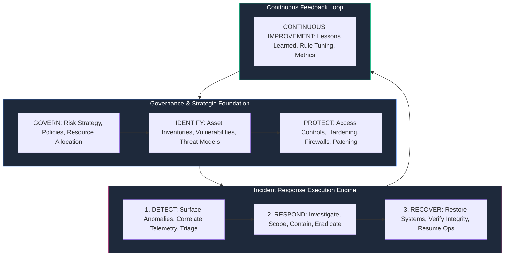
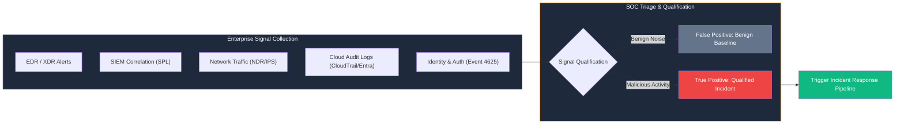
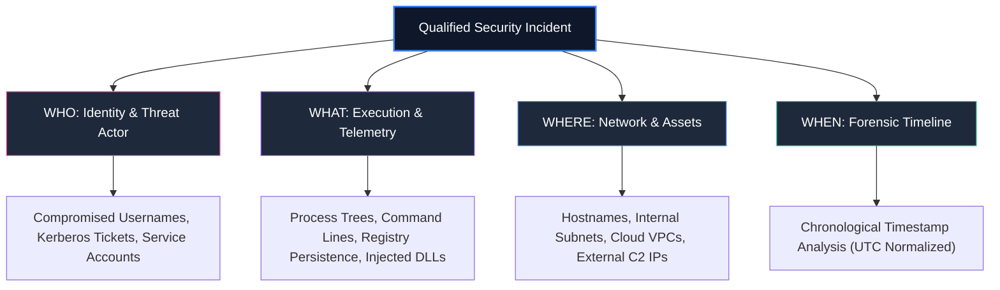
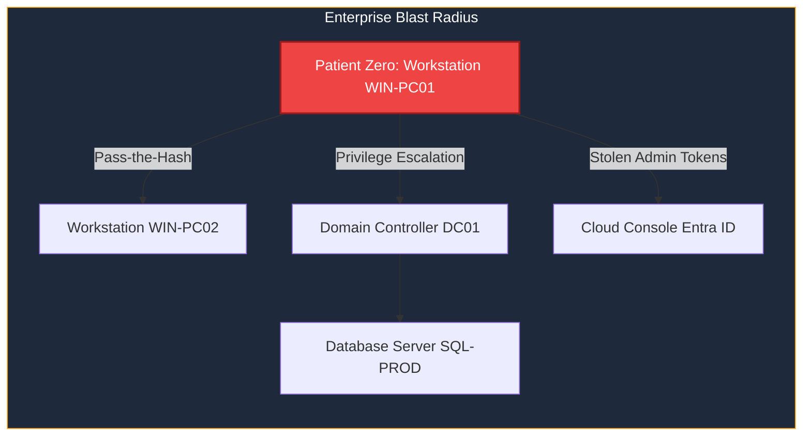
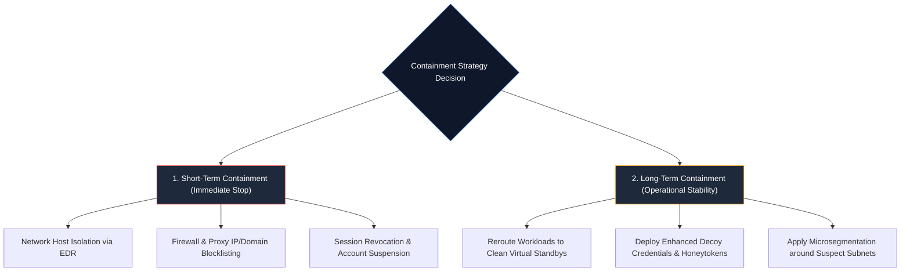
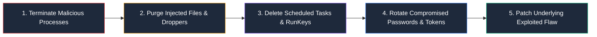
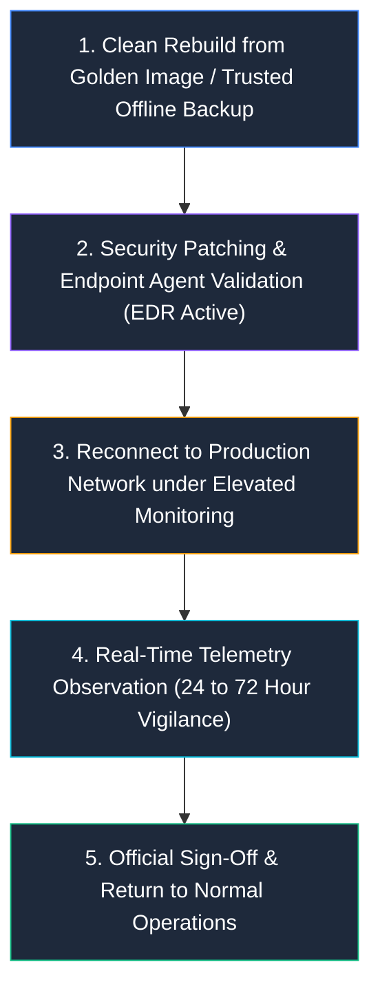
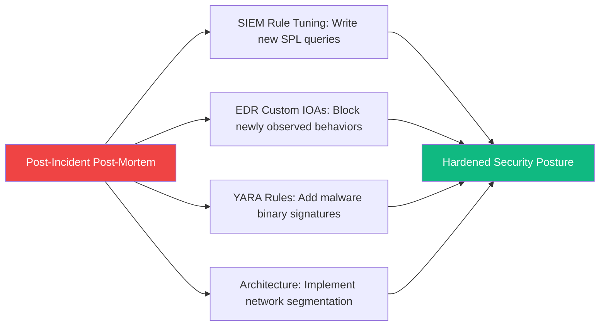
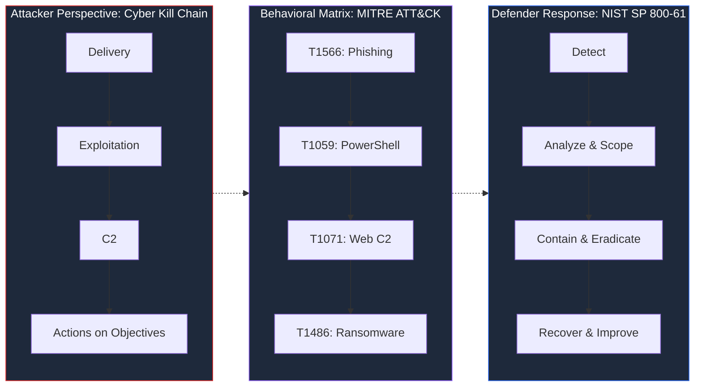

# NIST SP 800-61: Guide to Cybersecurity Incident Response

> **Category:** Security Operations & Blue Team | **Framework:** NIST SP 800-61 Rev. 3 (NIST CSF 2.0 Aligned) | **Level:** Beginner to Intermediate

---

## Executive Overview

Cybersecurity incidents are an inevitable reality for modern organizations. Whether combating credential compromise, advanced phishing payloads, lateral movement, ransomware execution, or unauthorized exfiltration, every Security Operations Center (SOC) requires a standardized, structured playbook to detect, analyze, contain, and recover from threats.

```text
+-----------------------------------------------------------------------------------------------+
|                            The Incident Response Command Center                               |
+--------------------------+------------------------------------+-------------------------------+
|  Phase 1: Detect & Scope |  Phase 2: Respond & Contain        |  Phase 3: Recover & Improve   |
|  - Multi-Sensor Telemetry|  - Short-Term Host Isolation       |  - Clean Golden Rebuilds      |
|  - 4W Forensic Timeline  |  - Credential Revocation           |  - Post-Mortem Root Cause     |
|  - Blast-Radius Scoping  |  - Persistence Mechanism Removal   |  - Rule Tuning (SIEM/EDR/YARA)|
+--------------------------+------------------------------------+-------------------------------+
```

**NIST Special Publication 800-61 (SP 800-61)** is the global standard for establishing, running, and maturing an enterprise incident response program. 

The current release, **NIST SP 800-61 Revision 3**, directly integrates with the **NIST Cybersecurity Framework (CSF) 2.0**, moving beyond isolated reaction phases into a holistic, risk-managed defense lifecycle.

---

## The Paradigm Shift: Revision 2 vs. Revision 3

Earlier versions (Revision 2) structured incident response as a standalone four-step cycle:
`Preparation -> Detection & Analysis -> Containment, Eradication & Recovery -> Post-Incident Activity`.

**Revision 3 aligns incident response directly with the NIST CSF 2.0 core functions:**



* **Govern, Identify, & Protect:** Establish the prerequisite asset inventory, defensive architectures, and security controls.
* **Detect, Respond, & Recover:** Form the active incident response execution loop.
* **Continuous Improvement:** Drives actionable post-mortem lessons back into hardening and telemetry engineering.

---

# 1. Detect: Separating Signal from Noise

Incident response begins the moment an anomaly is observed. Detection signals originate across multiple distributed enterprise vantage points:



### The Alert Triage Funnel

A single alert does not equal a verified security incident. Analysts qualify events using a standardized triage hierarchy:

```text
[ Raw Telemetry Event ]
          │
          ▼
[ Correlated Alert ]  --->  Is this an expected system administrative action?
          │
          ├── YES  -->  [ Benign / False Positive ] (Document & Tune)
          │
          └── NO   -->  [ Suspicious Anomaly ]
                              │
                              ▼
                        [ Security Incident Confirmed ] (Open Case & Assign Severity)
```

---

# 2. Analyze & Investigate: The 4W Framework

When an alert is verified as an active incident, analysts transition from alert triaging to structured digital forensics. NIST SP 800-61 utilizes the **4W Framework** to reconstruct adversary behavior:



### Reconstructing the Attack Timeline

Correlating timestamps into a normalized chronological timeline is essential for understanding attacker dwell time and progression:

```text
[ 09:01:14 UTC ] - Inbound email delivered with weaponized attachment 'invoice.docm'
[ 09:03:22 UTC ] - User clicks attachment; WINWORD.EXE process spawns
[ 09:03:25 UTC ] - VBA Macro executes; powershell.exe spawned with hidden execution flags
[ 09:04:02 UTC ] - Outbound HTTPS socket established to external C2 (198.51.100.45:443)
[ 09:05:18 UTC ] - Secondary stage payload downloaded to C:\Users\Target\AppData\Local\Temp\svchost.exe
[ 09:06:40 UTC ] - Persistence established via Registry Run Key (HKCU\Software\Microsoft\Windows\CurrentVersion\Run)
[ 09:08:12 UTC ] - Lateral movement reconnaissance initiated (net user /domain, nltest /dclist)
```

---

# 3. Determine the Scope (Blast Radius Assessment)

An attacker rarely stays on the initial machine (**Patient Zero**). Scoping establishes the total perimeter of the compromise:



### Scoping Checklist for Incident Responders

| Scoping Category | Investigative Actions | Verification Tools |
| :--- | :--- | :--- |
| **Endpoint Reach** | Identify all hosts executing the same hash or receiving inbound SMB connections from Patient Zero | CrowdStrike Falcon, Splunk |
| **Identity Reach** | Audit all login sessions originated by the compromised user account within the dwell window | Active Directory Event 4624 |
| **Network Reach** | Search firewall and proxy logs for any internal machines communicating with the identified C2 IPs | Palo Alto Firewall, Zeek |
| **Data Reach** | Identify if sensitive databases, file shares, or S3/Azure blobs were accessed or staged for exfiltration | DLP logs, CloudTrail, File Audit |

---

# 4. Respond: Structured Containment Strategy

Containment halts ongoing damage without alerting the adversary prematurely or destroying volatile forensic evidence.



> [!CAUTION]
> **The Containment Paradox:**
> Pulling the network cable or shutting down a server prematurely can cause the loss of volatile RAM contents (in-memory injection keys, active socket tables). Always capture memory forensics or leverage EDR software isolation before powering down hardware.

---

# 5. Eradication: Root-and-Stem Removal

Eradication ensures that the threat actor cannot simply reconnect using secondary backdoors or dormant persistence hooks.

```text
+-----------------------------------------------------------------------------------------------+
|                                The Eradication Blueprint                                      |
+--------------------------+------------------------------------+-------------------------------+
|  Volatile & File Assets  |  Persistence & Configurations      |  Vulnerability Remediation    |
|  - Terminate injected PID|  - Delete Malicious Registry Keys  |  - Patch exploited zero-day   |
|  - Delete dropper payload|  - Remove Rogue Scheduled Tasks    |  - Reset Kerberos KRBTGT keys |
|  - Purge temp directories|  - Remove Rogue Local/Domain Accts |  - Enforce MFA on all accounts|
+--------------------------+------------------------------------+-------------------------------+
```



---

# 6. Recovery: Returning to Production with Confidence

Recovery is not simply booting a computer back up. It is a verified, staged re-integration of sanitized systems into the production network:



### Recovery Verification Checklist
- [ ] Operating system rebuilt from known-good golden image or offline backup taken prior to initial breach timestamp.
- [ ] All security patches applied to the exploited service or vulnerability.
- [ ] Enterprise EDR sensor installed, healthy, and communicating with management cloud.
- [ ] Identity credentials rotated (user passwords, service accounts, API tokens).
- [ ] Enhanced telemetry logging enabled on the restored host for continuous auditing.

---

# 7. Post-Incident Activity: The Continuous Improvement Engine

The incident response lifecycle is incomplete without post-incident analysis. A security incident is the single most valuable source of telemetry for fortifying future defenses.



### The Post-Mortem Debrief Meeting

Within 5 to 7 days of incident closure, all stakeholders (SOC, IT engineering, legal, executive leadership) assemble for a structured review:

| Post-Mortem Question | Target Outcome | Action Item |
| :--- | :--- | :--- |
| **How did initial access occur?** | Identify technical or human entry points | Update email filtering rules or patch external gateway |
| **Why wasn't it detected sooner?** | Find logging blind spots or rule gaps | Author new SIEM correlation rules / Sysmon configurations |
| **Did containment playbooks execute cleanly?** | Audit SOAR and manual response latency | Optimize automated playbook workflows in Cortex XSOAR |
| **Were communication channels effective?** | Ensure legal and operational alignment | Update contact escalation rosters and incident playbooks |

---

# 8. SOC Tooling Ecosystem Mapped to NIST SP 800-61

Modern security platforms do not replace the NIST framework; they operationalize it:

| Security Platform | Primary NIST Phase | Operational Function |
| :--- | :--- | :--- |
| **Splunk Enterprise Security** | **Detect & Analyze** | Aggregates multi-source logs, correlates events, flags anomalous spikes |
| **CrowdStrike Falcon (EDR)** | **Detect, Respond, Contain** | Behavioral IOA detection, memory inspection, one-click network isolation |
| **Palo Alto Cortex XSOAR** | **Respond & Contain** | Automates containment playbooks (IP blocks, user account freezes) |
| **YARA Engine** | **Detect & Eradicate** | Scans filesystem and memory for malware opcodes and byte signatures |
| **Palo Alto / Fortinet Firewalls** | **Containment** | Enforces perimeter egress filtering and isolates suspicious network subnets |
| **Identity Provider (Entra ID / AD)** | **Respond & Eradicate** | Revokes compromised session tokens, enforces MFA, resets passwords |

---

# 9. Real-World Attack Scenario: Phishing to Ransomware

Follow how a complete NIST SP 800-61 response workflow unfolds during an enterprise intrusion:

```mermaid
sequenceDiagram
    autonumber
    actor Attacker as Attacker
    participant Host as Employee Workstation
    participant EDR as CrowdStrike Falcon
    participant SIEM as Splunk SIEM
    participant SOAR as Cortex XSOAR
    participant Lead as Incident Response Lead

    Note over Attacker,Host: Phase 1: Attack & Detection
    Attacker->>Host: Delivers weaponized resume.docm via Phishing
    Host->>Host: Macro spawns encoded PowerShell cradle
    EDR->>SIEM: Streams Process Alert: WINWORD spawning PowerShell
    SIEM->>SOAR: Correlates EDR alert with suspicious external outbound DNS

    Note over SOAR,Lead: Phase 2: Containment & Scoping
    SOAR->>EDR: API Command: Isolate Employee Workstation from LAN
    SOAR->>Lead: Alert Triggered: Possible C2 activity isolated
    Lead->>SIEM: Queries environment: Any other machines seen with this C2 IP?
    SIEM-->>Lead: Zero hits. Incident isolated to Patient Zero.

    Note over Lead,Host: Phase 3: Eradication & Recovery
    Lead->>Host: Extracts payload for YARA analysis; kills persistence RunKey
    Lead->>Host: Rebuilds workstation from golden image
    Lead->>EDR: Verifies sensor health; reconnects to production network

    Note over Lead,SIEM: Phase 4: Continuous Improvement
    Lead->>SIEM: Deploys new SPL detection rule for macro execution
    Lead->>Lead: Closes case ticket with full post-mortem documentation
```

---

# 10. NIST SP 800-61 vs. Cyber Kill Chain vs. MITRE ATT&CK

To understand modern cyber defense, recognize how these three industry frameworks complement one another:



* **Cyber Kill Chain (Lockheed Martin):** Outlines the linear steps an adversary must complete to achieve their objective.
* **MITRE ATT&CK:** Deconstructs the granular, non-linear techniques and procedures used during each kill chain phase.
* **NIST SP 800-61 (Incident Response):** Dictates how the defending organization methodically neutralizes and recovers from those techniques.

---

# Key Takeaways for Security Analysts

1. **Incident response is a continuous cycle, not an emergency reaction:** Mature organizations invest in Governance, Identification, and Protection long before the first alert fires.
2. **Containment must balance speed with forensic preservation:** Never pull the power plug before capturing volatile RAM and process state.
3. **Eradication requires root-and-stem elimination:** Deleting a dropper executable without identifying the persistence mechanism (scheduled tasks, WMI subscriptions) guarantees reinfection.
4. **Every incident must harden your security posture:** If an incident does not result in a new SIEM rule, an EDR custom IOA, or an architecture refinement, the response was incomplete.

---

## References

* **NIST SP 800-61 Rev. 3:** *Incident Response Recommendations and Considerations for Cybersecurity Risk Management* (April 2025)
* **NIST Cybersecurity Framework (CSF) 2.0**
* **NIST Computer Security Resource Center (CSRC)**
