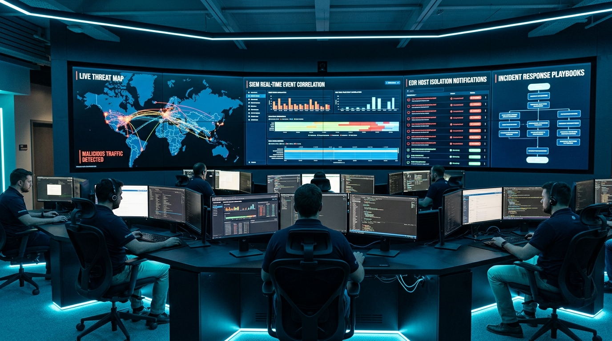
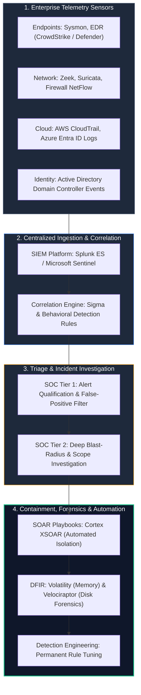
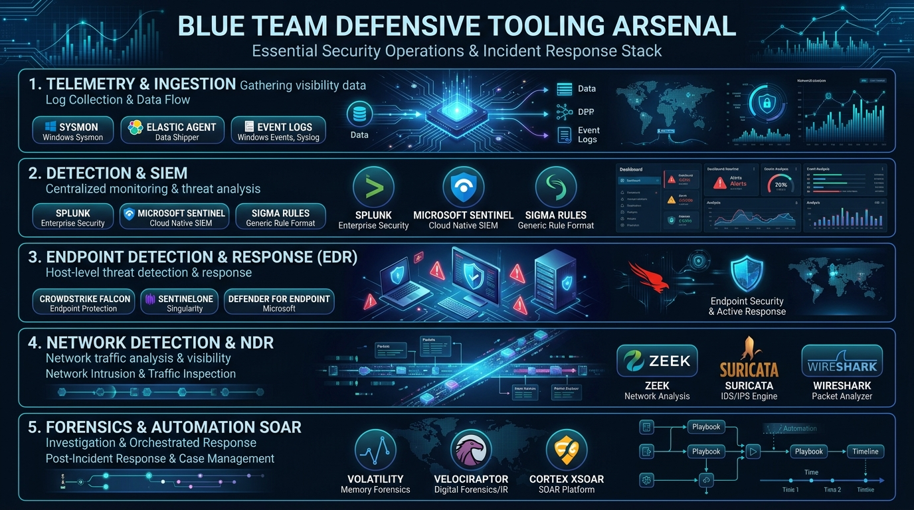
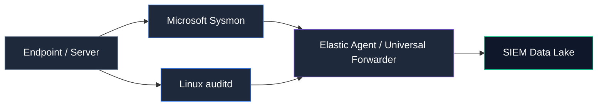
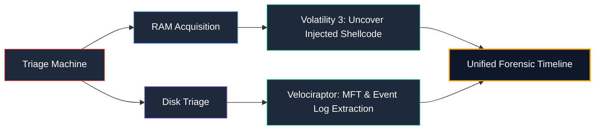

# Blue Team Operations & Defense: Security Engineering, Threat Hunting & SOC Tooling Arsenal

> **Category:** Defensive Security & SOC | **Series:** Security Team Operations | **Level:** Intermediate to Advanced

---

## Executive Overview

The **Blue Team** is the operational backbone of enterprise cyber defense. While attackers need to find only one opening, defenders are tasked with an infinitely more complex mission: maintaining continuous visibility, safeguarding critical assets, detecting subtle adversarial tradecraft, and isolating threats before data exfiltration or operational disruption occurs.

Modern defensive operations extend far beyond traditional static firewalls and antivirus scanners. A mature Blue Team functions as a synchronized, intelligence-driven ecosystem encompassing **Security Operations Center (SOC) monitoring, detection engineering, threat hunting, incident response, and digital forensics**.



```text
+-----------------------------------------------------------------------------------------------+
|                                Blue Team Defensive Framework                                  |
+--------------------------+------------------------------------+-------------------------------+
|  Telemetry & Visibility  |  Detection & Threat Hunting        |  Containment & Resilience     |
|  - EDR / XDR Sensors     |  - High-Fidelity SIEM Correlation  |  - Automated Host Quarantine  |
|  - Full-Packet NDR Logs  |  - Behavioral Anomaly Analytics    |  - Rapid Token Revocation     |
|  - Cloud Audit Trails    |  - Hypothesis-Driven Threat Hunting|  - Post-Mortem Root Cause     |
|  - Identity / IAM Feeds  |  - Sigma & YARA Signature Rules    |  - Continuous Rule Hardening  |
+--------------------------+------------------------------------+-------------------------------+
```

> [!NOTE]
> **The Defender's Advantage:** While adversaries have the element of surprise, defenders possess home-field advantage. Defenders know the network topology, legitimate baseline behaviors, critical asset locations, and internal communication patterns.

---

# 1. The Modern Blue Team Operational Pipeline

A world-class Security Operations Center processes billions of raw telemetry events daily, systematically filtering noise into high-fidelity incidents:



---

# 2. Complete Blue Team Tooling Arsenal

Defenders rely on a layered tooling stack to capture signals across endpoints, networks, identity systems, and cloud fabrics:



---

## 2.1 Category 1: Telemetry & Log Ingestion

Without high-fidelity telemetry, defenders are completely blind. Endpoint sensors and log forwarders stream structured events to the security analytics data lake.



### Essential Tools & Practical Usage

#### 1. Microsoft Sysmon (System Monitor)
* **Purpose:** Free Windows system service that logs detailed process creation, network connections, file integrity changes, and memory access directly to Windows Event Log.
* **Key Event IDs Every Defender Must Monitor:**
  * **Event ID 1:** Process Creation (Parent-Child process lineage, full command line, hashes).
  * **Event ID 3:** Network Connection (Process name, outbound destination IP/port).
  * **Event ID 7:** Image Loaded (DLL hijack and injection monitoring).
  * **Event ID 10:** ProcessAccess (Detects Mimikatz dumping LSASS memory).
  * **Event ID 22:** DNS Query (Detects C2 domain resolution and DGA algorithms).

#### 2. Elastic Agent / Beats & Fluentd
* **Purpose:** Lightweight data shippers deployed across on-premise and cloud nodes to parse, normalize, and ship logs via TLS to storage clusters.

---

## 2.2 Category 2: Detection Engineering & SIEM Platforms

SIEM platforms aggregate, index, and correlate disparate log sources in real time, alerting analysts when complex multi-source attack patterns emerge.

#### 1. Splunk Enterprise Security (ES)
* **Purpose:** Market-leading security analytics platform powered by the **Search Processing Language (SPL)**.
```spl
/* Splunk SPL: Detect encoded PowerShell commands commonly used by C2 beacons */
index=windows sourcetype="XmlWinEventLog:Microsoft-Windows-Sysmon/Operational" EventCode=1
| eval cmd=lower(CommandLine)
| where match(cmd, "powershell.*(-e|-enc|-encodedcommand)\s+[a-za-z0-9+/=]{20,}")
| table _time, host, User, ParentImage, Image, CommandLine
```

#### 2. Microsoft Sentinel
* **Purpose:** Cloud-native SIEM/SOAR platform integrated with Azure and Microsoft 365, queried using **Kusto Query Language (KQL)**.
```kql
// KQL: Detect anomalous LSASS access indicative of credential dumping
SecurityEvent
| where EventID == 4663 and ObjectType == "Process"
| where ObjectName endswith "lsass.exe" and AccessMask == "0x10"
| summarize count() by Account, Computer, ProcessName, bin(TimeGenerated, 5m)
```

#### 3. Sigma Rules
* **Purpose:** Generic, open-standard rule signature format that allows detection engineers to write a detection once and automatically translate it into Splunk SPL, Microsoft Sentinel KQL, Elastic QL, or QRadar queries.

---

## 2.3 Category 3: Endpoint Detection & Response (EDR / XDR)

EDR agents provide continuous kernel-level visibility and real-time response actions directly on workstations and servers.

| EDR Platform | Architectural Strength | Key Differentiators |
| :--- | :--- | :--- |
| **CrowdStrike Falcon** | Lightweight kernel sensor, cloud-native graph | Real-time Indicators of Attack (IOAs), instant remote containment |
| **SentinelOne Singularity** | Autonomous on-agent AI engine | Automated 1-click remediation & ransomware file rollback |
| **Microsoft Defender for Endpoint (MDE)** | Native Windows OS integration | Zero agent footprint, seamless Intune and Entra ID policy linkage |

---

## 2.4 Category 4: Network Detection & Visibility (NDR)

Adversaries can evade endpoint monitoring by disabling logs, but **packets never lie**. Network sensors provide unalterable ground truth.

#### 1. Zeek (formerly Bro)
* **Purpose:** Behavioral network analysis framework that translates raw wire traffic into compact, structured protocol logs (DNS, HTTP, SSL, SMB, SSH).
* **Key Use Case:** Identifying unencrypted internal lateral movement and suspicious TLS certificates.

#### 2. Suricata
* **Purpose:** High-performance, multi-threaded Network IDS/IPS engine capable of inspecting deep packet payloads against thousands of community rules (Emerging Threats).
```text
# Suricata Rule: Alert on Cobalt Strike default malleable C2 URI pattern
alert http $HOME_NET any -> $EXTERNAL_NET any (msg:"ET MALWARE Cobalt Strike Beaconing Detected"; \
      flow:established,to_server; content:"/pixel.gif"; http_uri; \
      content:"User-Agent|3a 20|Mozilla/5.0"; http_header; sid:2028192; rev:1;)
```

#### 3. Wireshark & TShark
* **Purpose:** Deep packet inspection and manual PCAP carving to reconstruct attacker exfiltration sessions or malware download streams.

---

## 2.5 Category 5: Digital Forensics & Incident Response (DFIR)

When an incident is confirmed, DFIR tools reconstruct exactly what occurred, when it happened, and which files were touched.



#### 1. Volatility 3
* **Purpose:** Advanced memory forensics framework used to analyze live RAM dumps (`.raw`, `.vmem`).
```bash
# Scan Windows memory image for injected or hollowed code segments
vol -f memory.raw windows.malfind

# List process tree and identify hidden or terminated processes
vol -f memory.raw windows.pstree
```

#### 2. Velociraptor
* **Purpose:** Advanced endpoint visibility and digital forensics tool that allows analysts to query thousands of endpoints simultaneously using **Velociraptor Query Language (VQL)**.
* **Key Use Case:** Rapid enterprise-wide hunting for Indicators of Compromise (IoCs).

#### 3. Palo Alto Cortex XSOAR & Tines
* **Purpose:** Security Orchestration, Automation, and Response (SOAR).
* **Key Use Case:** Automating containment workflows (e.g., automatically isolating a laptop via EDR, revoking Azure AD tokens, and opening a ServiceNow ticket in under 5 seconds).

---

# 3. Master Blue Team Tool Reference Matrix

| Tool Name | Defensive Domain | Data Source | Primary Security Function |
| :--- | :--- | :--- | :--- |
| **Sysmon** | Telemetry Ingestion | Windows Kernel / Events | Deep host-level process and network event logging |
| **Splunk ES** | SIEM Analytics | Multi-source Enterprise Logs | Real-time correlation, SPL searching, notable alerting |
| **Microsoft Sentinel** | Cloud SIEM / SOAR | Azure, AWS, M365 Logs | Scalable cloud security analytics and KQL threat queries |
| **CrowdStrike Falcon** | EDR / Endpoint | Endpoint Kernel Sensor | Continuous host monitoring, behavioral IOA blocks, containment |
| **Zeek** | Network Detection | Raw Wire Packets (TAP/SPAN) | Protocol transaction logging and behavioral anomaly detection |
| **Suricata** | Network IDS/IPS | Network Traffic | Byte-level signature inspection and malicious traffic blocking |
| **Volatility 3** | Memory Forensics | Volatile RAM Dumps | Code injection discovery, process memory carving |
| **Velociraptor** | Enterprise DFIR | Filesystems, Registries, MFT | Live distributed endpoint querying and artifact extraction |
| **Cortex XSOAR** | SOAR Automation | Alert APIs / Webhooks | Automated multi-tool incident response playbooks |
| **Wireshark** | Packet Inspection | PCAP Files | Micro-level packet protocol dissection and stream following |

---

# 4. Proactive Threat Hunting Methodology

A mature Blue Team does not rely solely on automated alerts. **Threat Hunting** is the proactive, hypothesis-driven pursuit of stealthy threats that have bypassed automated defenses:

```text
The Threat Hunting Lifecycle:

 [1. Threat Intel / TTP] ──► Formulate Hypothesis:
                             "Adversaries are abusing Scheduled Tasks for persistence."
                                    │
                                    ▼
 [2. Data Acquisition]   ──► Query Centralized Logs:
                             Extract all newly created Schtasks across all workstations.
                                    │
                                    ▼
 [3. Baseline & Outliers]──► Filter Out Routine Admin Noise:
                             Identify 1-of-1 execution patterns running out of \AppData\.
                                    │
                                    ▼
 [4. Action & Hardening] ──► Neutralize Threat & Automate Detection Rule:
                             Write permanent Sigma rule to catch future recurrences.
```

---

# 5. Key Defensive Performance Metrics (KPIs)

Blue Team performance is quantified through operational response speed and coverage:

| Metric | Full Name | Definition & Target Goal |
| :--- | :--- | :--- |
| **MTTD** | Mean Time to Detect | Average time from attacker infiltration to defensive alert. *Target: < 15 minutes.* |
| **MTTI** | Mean Time to Investigate | Average time required to triage and confirm an alert. *Target: < 30 minutes.* |
| **MTTR** | Mean Time to Respond | Average time from incident confirmation to full host containment. *Target: < 10 minutes.* |
| **Coverage** | ATT&CK Matrix Coverage | Percentage of applicable adversary techniques monitored by alerts. *Target: > 85%.* |
| **FPR** | False Positive Ratio | Percentage of benign alerts triaged. *Target: < 10% to prevent burnout.* |

By engineering robust telemetry pipelines, automating repetitive containment steps, and proactively hunting for advanced adversaries, modern Blue Teams build an enterprise defense capable of withstanding the most sophisticated cyber threats.
