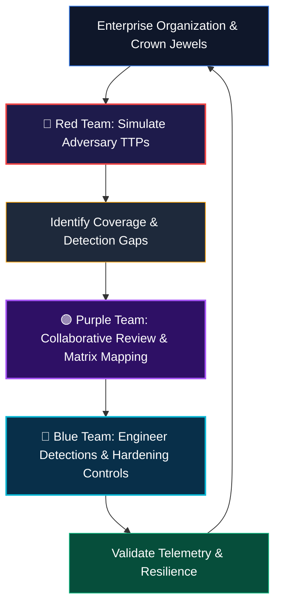

# 👥 Security Teams: Red Team, Blue Team & Purple Team Operations

Modern organizational cybersecurity relies on understanding **how attackers think, how defenders detect them, and how both teams collaborate** to build an adaptive, continuously hardening security posture.

This section covers the operations, methodologies, tools, and tactical mindsets of enterprise security teams.

---

## 🎯 Security Teams Matrix

| Team | Focus & Mandate | Operational Mindset | Key Tooling | Master Guide |
| :---: | :--- | :--- | :--- | :---: |
| 🔴 **Red Team** | Offensive Security & Adversary Emulation | Assume Breach, find hidden attack paths, evade perimeter sensors, achieve mission objectives. | Cobalt Strike, Sliver, BloodHound, Mimikatz, Metasploit, Impacket | [Red Team Operations](./Red_Team/README.md) |
| 🔵 **Blue Team** | Defensive Engineering & Security Operations | Continuous visibility, detect anomalous behavior, contain compromises, investigate root cause. | CrowdStrike Falcon, Splunk, Zeek, Suricata, Sysmon, Velociraptor | [Blue Team Operations](./Blue_Team/README.md) |
| 🟣 **Purple Team** | Collaborative Emulation & Detection Validation | Bridge offensive simulations with defensive telemetry to close coverage gaps systematically. | VECTR, Atomic Red Team, Caldera, Prelude Operator, Sigma | [Purple Team Methodology](./Purple_Team/README.md) |
| ⚖️ **Red vs Blue** | Operational Dynamics & Mindset Comparison | Compare the asymmetric nature of offense vs defense and study the continuous security loop. | MITRE ATT&CK, Cyber Kill Chain, Unified Kill Chain | [Defenders vs Attackers](./Red_Team_vs_Blue_Team/README.md) |

---

## 🔄 The Continuous Purple Team Security Cycle

---

## 📂 Detailed Directory Overview

### 1. [🔴 Red Team Operations and Tooling](./Red_Team/README.md)
* **Reconnaissance & Weaponization:** OSINT collection, external attack surface mapping, payload generation, and evasion.
* **Initial Access & Execution:** Phishing scenarios, living-off-the-land techniques, process hollowing, and direct syscalls.
* **Post-Exploitation & Lateral Movement:** Credential dumping (LSASS, SAM, DPAPI), Kerberoasting, AS-REP roasting, token impersonation, and pivoting over SOCKS proxies.

### 2. [🔵 Blue Team Operations and Tooling](./Blue_Team/README.md)
* **SOC Architecture & Telemetry Ingestion:** Endpoint event pipelines (Sysmon, Windows Event Logs), network flow analysis (Zeek, NetFlow), and SIEM correlation.
* **Threat Hunting & Incident Response:** Formulating threat hunting hypotheses, hunting without alerts, forensic memory analysis with Volatility, and endpoint triage with Velociraptor.
* **Defensive Engineering:** Deploying proactive mitigation policies (ASR, AppLocker, LAPS, PAM, and Privileged Access Workstations).

### 3. [🟣 Purple Team Methodology and Workflow](./Purple_Team/README.md)
* **Collaborative Adversary Emulation:** Planning atomic emulation exercises using the Atomic Red Team matrix.
* **Telemetry Verification:** Verifying whether EDR sensors, SIEM rules, and network taps generated expected alerts during offensive execution.
* **Gap Remediation:** Translating missed attack techniques into high-fidelity Sigma and YARA detection rules.

### 4. [⚖️ Red Team vs Blue Team: How Attackers and Defenders Think](./Red_Team_vs_Blue_Team/README.md)
* **The Asymmetric Battle:** "Attackers think in graphs; defenders think in lists."
* **Operational Comparison:** Contrasting goals, metrics (MTTD/MTTR vs Time-to-Domain-Admin), and playbooks.
