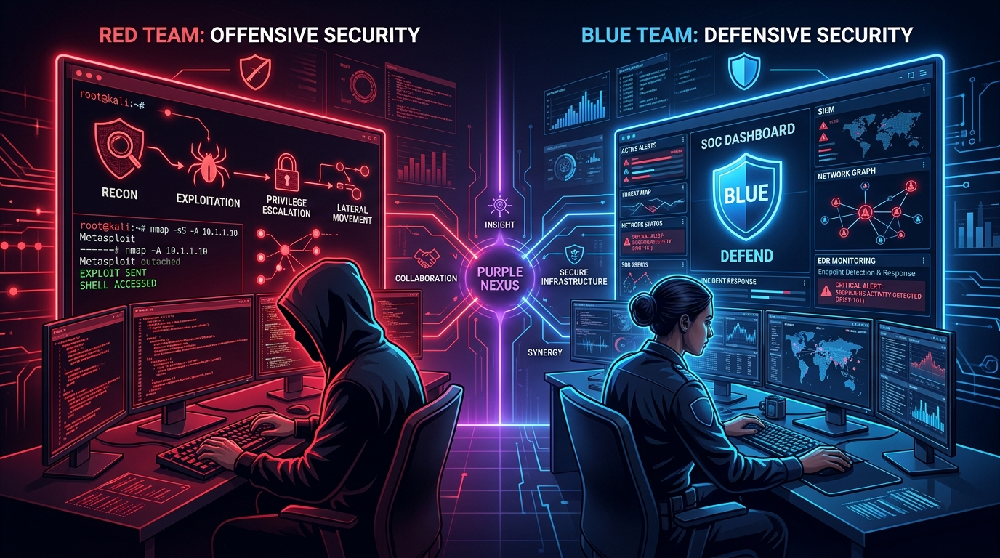
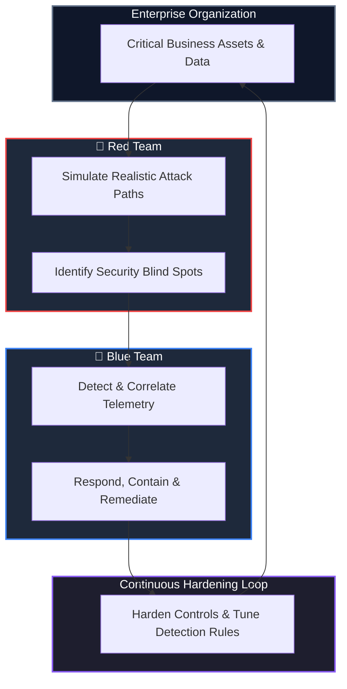
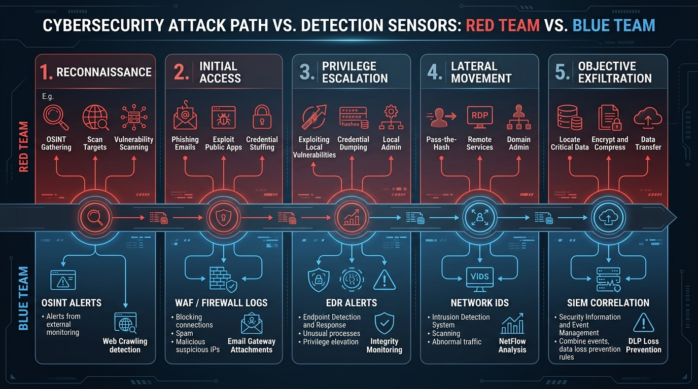
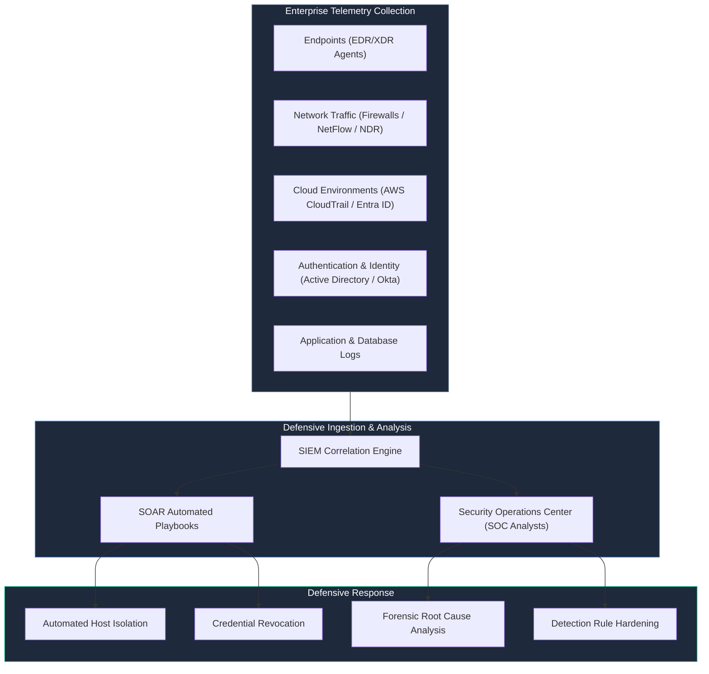
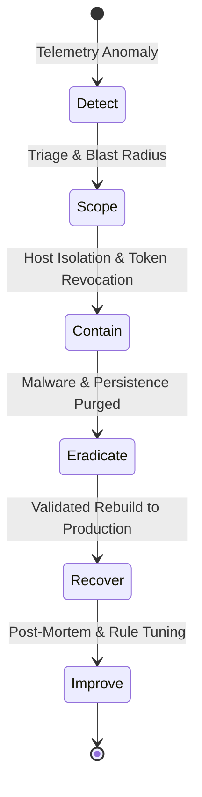
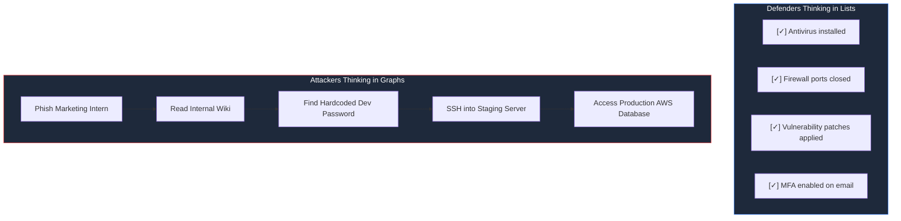
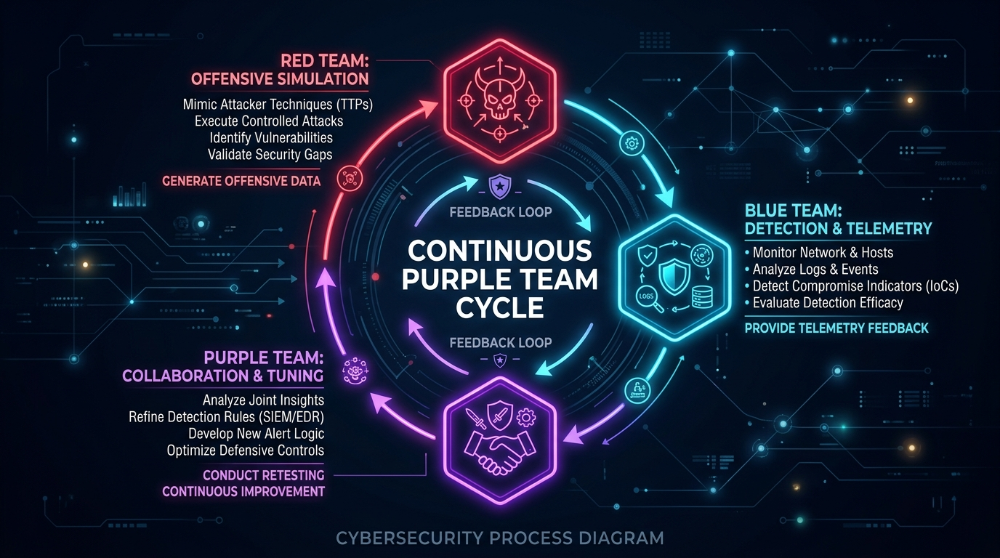
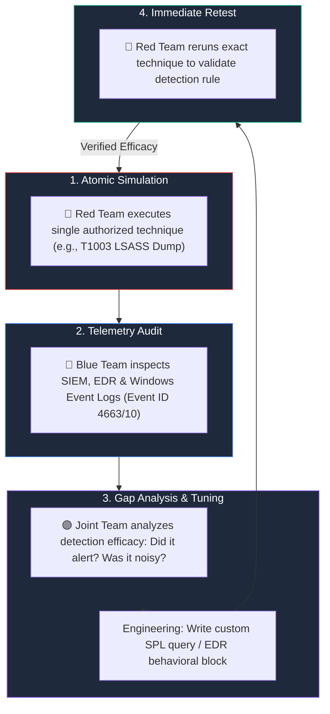
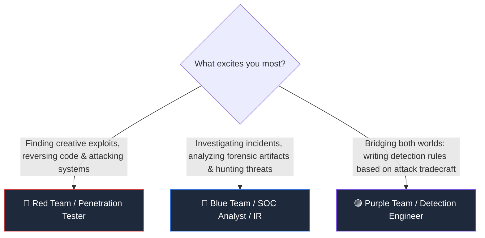

# Blue Team vs Red Team: How Cybersecurity Defenders and Attackers Think

> **Category:** Cybersecurity Operations | **Series:** Cyber Fundamentals & Mindset | **Level:** Beginner to Intermediate

---

## Executive Overview

Cybersecurity is not merely a checklist of software patches or a mechanical search for open ports. In modern enterprise environments, true resilience requires organizations to understand **how attacks unfold, how adversaries think, how defenders catch them, and how rapidly security operations can isolate and remediate incidents**.

This dynamic is driven by two specialized operational groups:

* 🔴 **Red Team (Offensive Security):** Simulates real-world adversaries, tests security assumptions, chains disparate weaknesses, and validates whether defenses hold up against realistic intrusions.
* 🔵 **Blue Team (Defensive Security):** Designs resilient architectures, monitors real-time telemetry, hunts for stealthy adversaries, investigates security alerts, and executes rapid incident containment.



```text
+-----------------------------------------------------------------------------------------------+
|                            The Unified Security Operations Spectrum                           |
+--------------------------+------------------------------------+-------------------------------+
|  🔴 Red Team (Offense)   |  🟣 Purple Team (Collaboration)    |  🔵 Blue Team (Defense)       |
|  - Adversary Emulation   |  - Joint Testing Workshops         |  - 24/7 Security Monitoring   |
|  - Exploit Chaining      |  - Telemetry Gap Analysis          |  - Threat Detection & EDR     |
|  - Privilege Escalation  |  - Collaborative Rule Tuning       |  - Incident Response (IR)     |
|  - Lateral Movement      |  - Metric-Driven Retesting         |  - Threat Hunting & Forensics |
+--------------------------+------------------------------------+-------------------------------+
```

When these teams operate in harmony, they transform organizational defense from reactive guesswork into an **adaptive, continuous security improvement cycle**:



> [!IMPORTANT]
> **Legal & Ethical Notice:** All Red Team exercises, penetration tests, and offensive simulation workflows must be conducted strictly under explicit, documented Rules of Engagement (RoE) with formal authorization from system owners.

---

# 1. 🔴 What Is a Red Team?

A **Red Team** is an offensive security unit tasked with emulating the Tactics, Techniques, and Procedures (TTPs) of real-world threat actors.

Unlike traditional vulnerability scanners that evaluate servers in isolation, a mature Red Team evaluates **systemic risk**. They answer a fundamental question:  
> *"Can an adversary chain seemingly minor configurations, exposed credentials, and software flaws to compromise the organization's crown jewels?"*



### The Red Team Attack Lifecycle

Red Team engagements typically follow a structured attack path aligned with the Cyber Kill Chain and the MITRE ATT&CK framework:

```mermaid

flowchart LR
    A["1. Reconnaissance"] --> B["2. Initial Access"]
    B --> C["3. Privilege Escalation"]
    C --> D["4. Credential Access"]
    D --> E["5. Lateral Movement"]
    E --> F["6. Objective Execution"]

    style A fill:#1e293b,stroke:#ef4444,color:#fff
    style B fill:#1e293b,stroke:#ef4444,color:#fff
    style C fill:#1e293b,stroke:#ef4444,color:#fff
    style D fill:#1e293b,stroke:#ef4444,color:#fff
    style E fill:#1e293b,stroke:#ef4444,color:#fff
    style F fill:#991b1b,stroke:#f87171,color:#fff
```



---

## Core Red Team Activities

### 1. Reconnaissance (OSINT & Target Scoping)
Before launching any active requests, Red Teams gather publicly available intelligence about the target:
* **Open Source Intelligence (OSINT):** Searching public code repositories (GitHub, GitLab) for leaked API keys, tokens, or employee email schemas.
* **Attack Surface Mapping:** Enumerating domains, subdomains, cloud storage buckets (AWS S3, Azure Blobs), and exposed management interfaces (VPN gateways, RDP, SSH).
* **Technology Profiling:** Identifying web frameworks, server versions, and third-party dependencies to discover known CVEs.

### 2. Vulnerability Discovery & Threat Modeling
Rather than running loud, automated vulnerability scanners that trigger defensive alarms, Red Teams conduct targeted analysis:
* Auditing exposed web applications, API endpoints, and authentication workflows.
* Identifying architectural flaws (e.g., lack of multi-factor authentication on legacy portals, single-factor VPNs).
* Mapping trust relationships between cloud environments, on-premise Active Directory, and third-party vendors.

### 3. Controlled Exploitation
Once an entry vector is verified, the Red Team executes a controlled exploit to establish a foothold:
* Exploit public-facing applications or unpatched vulnerabilities under strict scope.
* Execute spear-phishing or credential stuffing simulations (where authorized).
* Verify exploitability without disrupting business operations or causing unplanned outages.

### 4. Privilege Escalation
An initial compromise typically yields an unprivileged user context. Red Teams test whether local protections prevent elevation:
* **Local Kernel Exploits:** Exploiting unpatched OS vulnerabilities.
* **Service Misconfigurations:** Hijacking insecure service paths, weak file permissions, or unquoted service paths.
* **Credential Harvesting:** Dumping LSASS memory, extracting plaintext credentials from configuration files, or extracting browser session tokens.

### 5. Lateral Movement & Network Pivoting
Modern enterprise networks are rarely flat. Once inside a single workstation, the Red Team tests internal segmentation:
* Can an attacker pivot from a developer laptop into the production database environment?
* Are Kerberos tickets vulnerable to Kerberoasting or AS-REP Roasting?
* Can the attacker abuse internal remote management protocols (RDP, WinRM, SSH) using discovered administrative credentials?

### 6. Defensive Control Validation
The overarching purpose of the Red Team is **evaluating the Blue Team's detection efficacy**:
* *"Did our command execution trigger an EDR alert?"*
* *"Did the Security Operations Center (SOC) quarantine the host or investigate the anomalous login?"*
* *"How long did our presence remain undetected (Dwell Time)?"*

---

# 2. 🔵 What Is a Blue Team?

The **Blue Team** is the operational force responsible for defending an organization's digital estate—including users, identities, endpoints, networks, cloud workloads, and intellectual property.

A Blue Team does not merely configure anti-malware tools. Modern defensive security is an active, intelligence-driven discipline focused on **continuous threat detection, telemetry correlation, proactive threat hunting, and rapid incident response**.



---

## Core Blue Team Activities

### 1. 24/7 Security Monitoring & Telemetry Ingestion
Defenders aggregate massive volumes of event telemetry across the entire infrastructure into a centralized **Security Information and Event Management (SIEM)** platform:
* **Endpoint Telemetry:** Process creation trees, DLL injections, registry modifications, and PowerShell invocations via Endpoint Detection and Response (EDR) agents.
* **Network Visibility:** NetFlow records, DNS query logs, TLS handshake metadata, and firewall drops.
* **Identity Auditing:** Impossible travel logins, MFA fatigue attempts, and anomalous privilege escalations.

### 2. Threat Detection Engineering
Blue Teams write detection logic and alert rules to convert raw logs into actionable intelligence:
* Developing **Sigma**, **Splunk SPL**, and **YARA** detection rules mapped to MITRE ATT&CK techniques.
* Building behavioral anomaly baselines (e.g., alerting when a standard service account suddenly queries Active Directory via LDAP from an unexpected IP).

```text
Detection Engineering Flow:

Normal User Behavior ──────┐
                           ▼
Anomalous PowerShell ──> [Detection Rule: Suspicious Base64] ──> High-Severity SOC Alert
                           ▲
Failed Kerberos Login ─────┘
```

### 3. Incident Response (IR)
When malicious activity is confirmed, Blue Teams execute battle-tested playbooks following standard incident handling frameworks (such as **NIST SP 800-61**):



* **Containment:** Immediately severing the compromised device's network connection via EDR, revoking compromised session tokens, and blocking malicious C2 IP addresses.
* **Eradication:** Removing scheduled tasks, malicious services, backdoor accounts, and persistence mechanisms.
* **Recovery:** Restoring affected systems from trusted golden images and verifying data integrity.

### 4. Proactive Threat Hunting
Rather than passively waiting for alerts to fire, Blue Team threat hunters assume adversaries have already bypassed perimeter defenses. They formulate hypotheses based on emerging threat intelligence:
* *"Are any processes on our workstations making outbound connections to newly registered domains?"*
* *"Are any user accounts exhibiting unusual SMB or WinRM traffic after business hours?"*

### 5. Digital Forensics & Incident Reconstruction
Following an intrusion, digital forensic specialists reconstruct the adversary's actions with byte-level precision:
* Analyzing volatile system RAM to extract injected shellcode.
* Parsing NTFS Master File Tables ($MFT), shimcache, and shellbags to prove file execution.
* Correlating authentication records to determine the exact initial access timestamp and blast radius.

---

# 3. 🔴 Red Team vs 🔵 Blue Team: The Core Differences

| Operational Area | 🔴 Red Team (Offense) | 🔵 Blue Team (Defense) |
| :--- | :--- | :--- |
| **Primary Mission** | Emulate adversaries and uncover actionable attack paths | Protect infrastructure, detect intrusions, and isolate threats |
| **Core Perspective** | Thinks like an external/internal attacker | Thinks like an enterprise defender and custodian |
| **Primary Focus** | Chaining vulnerabilities to reach high-value targets | Maintaining visibility, log integrity, and system resilience |
| **Operational Philosophy** | *"Attackers only need to find one way in."* | *"Defenders must secure every single asset, every minute."* |
| **Key Metrics** | Dwell Time, Depth of Compromise, Success Rate | Mean Time to Detect (MTTD), Mean Time to Respond (MTTR) |
| **Standard Output** | Detailed attack-path narrative, PoCs, remediation advice | Hardened detection rules, incident reports, patched configs |
| **Core Tooling** | Metasploit, Cobalt Strike, Burp Suite, BloodHound, Impacket | Splunk, CrowdStrike Falcon, Suricata, Wireshark, Cortex XSOAR |

---

# 4. 🧠 How Red and Blue Think Differently

The famous security principle formulated by John Lambert (Microsoft Threat Intelligence) captures this fundamental difference:

> **"Defenders think in lists. Attackers think in graphs. As long as this is true, attackers win."**



### The Red Team Thought Process:
```text
1. What assets are visible from my current vantage point?
2. What trust relationships exist between this system and others?
3. What happens if I combine this minor misconfiguration with that weak credential?
4. How can I achieve my objective while generating the least amount of noise?
```

### The Blue Team Thought Process:
```text
1. What is the baseline 'normal' behavior for this user and server?
2. If an attacker executed this technique, what specific log artifacts would be generated?
3. How can we detect this behavior without overwhelming our analysts with false alarms?
4. How quickly can we isolate this endpoint if an anomaly is confirmed?
```

---

# 5. 🟣 Purple Team: The Collaborative Convergence

Historically, Red and Blue teams operated in silos. Red Teams would execute a secretive assessment, deliver a 200-page PDF report months later, and leave defenders frustrated and confused.

**Purple Teaming** abolishes this friction by transforming security into a transparent, cooperative partnership.



### The Purple Team Operational Loop



### Real-World Example: Purple Team Workshop
1. **The Test:** The Red Team executes an unquoted service path privilege escalation on an internal server.
2. **The Observation:** The Blue Team observes that the event was logged in raw Windows Event Logs, but no alert triggered in the SIEM because no correlation rule existed for that specific sub-event.
3. **The Collaboration:** Both teams immediately draft and test a new Splunk correlation rule.
4. **The Validation:** The Red Team executes the attack a second time. An alert immediately triggers in the SOC with rich contextual data. Detection gap closed permanently!

---

# 6. ⚔️ Red Team vs Blue Team Tooling Arsenal

Security tools are not magical solutions—they are instruments designed to solve specific operational challenges:

| Domain | 🔴 Red Team Arsenal | 🔵 Blue Team Arsenal |
| :--- | :--- | :--- |
| **Recon & Discovery** | Nmap, Amass, Shodan, Sublist3r, theHarvester | Censys, Recorded Future, Mandiant Threat Intel |
| **Web & App Auditing** | Burp Suite Professional, OWASP ZAP, SQLmap, ffuf | ModSecurity WAF, Cloudflare, AWS WAF, Snyk |
| **Active Directory** | BloodHound, Mimikatz, Rubeus, Impacket, Responder | PingCastle, Microsoft Defender for Identity, BloodHound Enterprise |
| **Command & Control / EDR** | Cobalt Strike, Sliver, Havoc, Mythic, Metasploit | CrowdStrike Falcon, SentinelOne, Microsoft Defender for Endpoint |
| **Network Visibility** | Wireshark, Bettercap, Scapy | Zeek (Bro), Suricata, Corelight, Cisco Stealthwatch |
| **Correlation & Triage** | Custom Python scripts, Sliver listeners | Splunk Enterprise Security, Elastic SIEM, Microsoft Sentinel |
| **Incident Automation** | Custom orchestration scripts | Palo Alto Cortex XSOAR, Tines, Swimlane |
| **Digital Forensics** | N/A (Focuses on evasion and cleanup) | Volatility 3, Velociraptor, FTK Imager, Autopsy |

---

# 7. 📊 Measuring Performance: Key Defensive & Offensive Metrics

A mature cybersecurity organization relies on quantitative indicators rather than subjective feelings:

```text
Defensive Efficiency Horizon:

   [Infiltration] ───────────────────────► [Detection] ──────────► [Containment]
          │                                      │                        │
          └───────────── MTTD ───────────────────┘                        │
          │             (Mean Time to Detect)                             │
          └───────────────────────────── MTTR ────────────────────────────┘
                                        (Mean Time to Respond)
```

### 1. Mean Time to Detect (MTTD)
The average duration from the moment an adversary executes an unauthorized action to the moment a security analyst or system raises an alert.  
*Goal: Reduce from days/weeks to minutes.*

### 2. Mean Time to Respond (MTTR)
The average time required from the moment an alert is confirmed to complete containment and isolation of the threat actor.  
*Goal: Automate containment playbooks to isolate endpoints within seconds.*

### 3. MITRE ATT&CK Detection Coverage
A percentage metric tracking what proportion of adversary techniques (across Initial Access, Execution, Persistence, Privilege Escalation, etc.) have verified detection logic in the SIEM/EDR.

### 4. False Positive Ratio (FPR)
The percentage of alerts investigated by analysts that turn out to be harmless operational noise. Excessive false positives cause **alert fatigue**, leading analysts to miss true intrusions.

---

# 8. 🎯 Choosing Your Career Path: Red Team vs. Blue Team

Both paths offer challenging, high-impact careers in cybersecurity. Your ideal trajectory depends on what problems you enjoy solving:



### Choose 🔴 Red Team if you:
* Love thinking outside the box to bypass security obstacles.
* Enjoy reverse engineering, exploit development, and script writing.
* Are fascinated by the psychology of social engineering and physical security.
* Thrive on deep, focused project-based engagements.

### Choose 🔵 Blue Team if you:
* Enjoy solving complex puzzles through data analysis, logs, and forensics.
* Love building resilient infrastructure, monitoring systems, and automating defenses.
* Thrive under the pressure of active incident response and live threat neutralization.
* Want to protect real organizations, critical infrastructure, and user privacy every day.

### Choose 🟣 Purple Team / Detection Engineering if you:
* Want the best of both worlds: understanding how attacks work in depth while engineering bulletproof detections.
* Enjoy collaborating across teams and turning raw technical findings into measurable security improvements.

---

# 9. 🔐 Final Takeaway

Red Team and Blue Team are not adversaries fighting against each other—they are **two sides of the same protective shield**.

* **Red Teams test security assumptions against reality.** They ensure an organization never confuses compliance with actual security.
* **Blue Teams safeguard the business every second of the day.** They build the telemetry pipelines, investigate the signals, and defend the enterprise against actual adversaries.

Organizations that foster close collaboration through **Purple Teaming** build a formidable defensive posture. In modern cybersecurity, success is not measured by winning an argument about whether an attack succeeded or failed—it is measured by how quickly the entire organization learns, adapts, and evolves.
