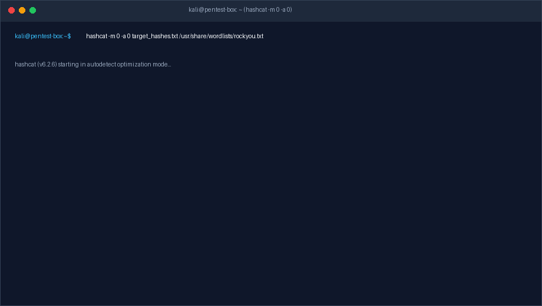
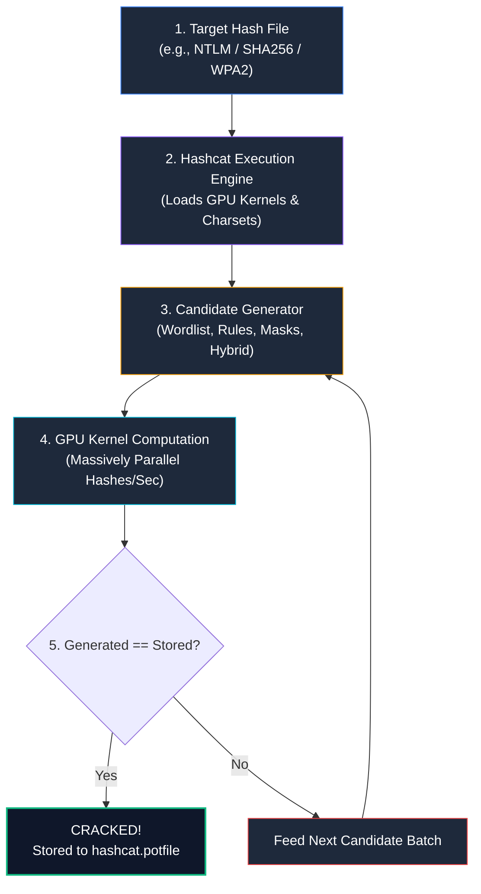
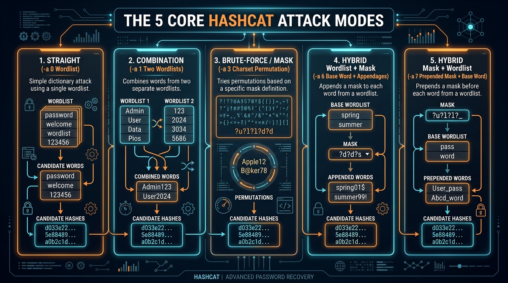
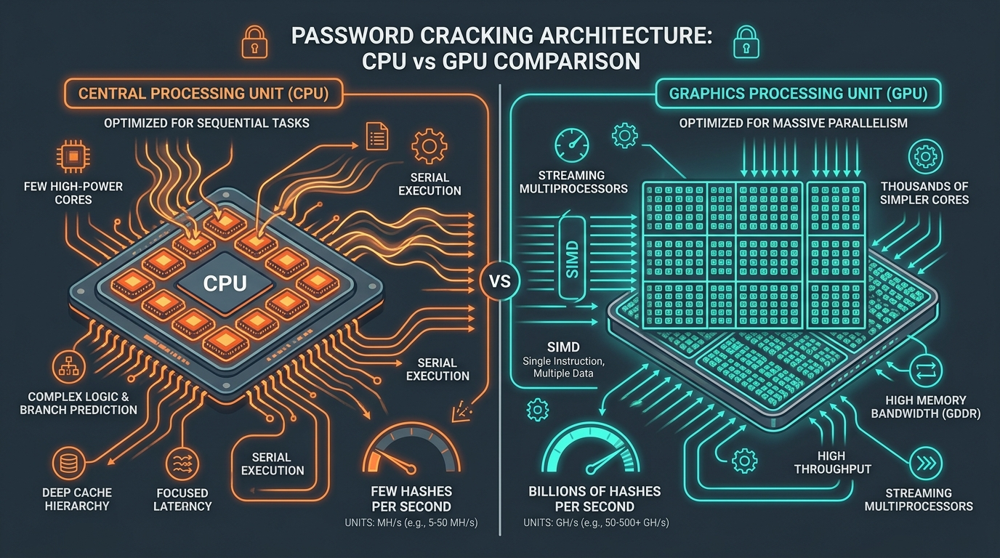
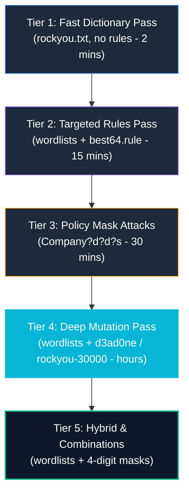
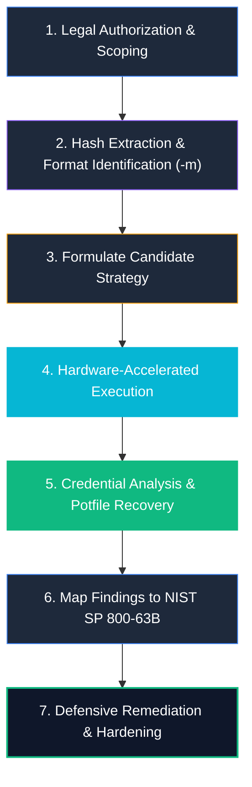

# Hashcat — Complete A–Z Cybersecurity Course

> **Scope:** Authorized password auditing, CTFs, security operations, active directory assessments, incident response, and defensive credential hardening only.
>
> **Level:** Beginner → Intermediate → Advanced → Purple Team
>
> **Goal:** Master Hashcat as an enterprise-grade password recovery and cryptanalysis engine. Learn hash identification, GPU compute optimization, attack mode selection, custom rule and mask engineering, active directory credential auditing, and purple-team remediation.

---

<div align="center">


# ⚡ Hashcat: Advanced GPU Cracking & Cryptanalysis ⚡
### High-Performance Password Auditing, Rule Engineering & Defensive Hardening

[](https://pages.nist.gov/800-63-3/sp800-63b.html)
[](https://hashcat.net/hashcat/)
[](https://github.com/sivaoffl04/Cyber-Blog)

</div>

---

### 📺 Interactive Video Demonstration & Cracking Labs

<div align="center">

| Demonstration | Target Architecture | Interactive Video Link |
| :--- | :--- | :---: |
| **Hashcat Complete GPU Masterclass** | CUDA/OpenCL Setup, Rule Mutation & Wordlists | [](https://www.youtube.com/results?search_query=hashcat+complete+course+tutorial) |
| **Active Directory NTLM & Kerberos Auditing** | Windows SAM, NTDS.dit & Kerberoasting | [](https://www.youtube.com/results?search_query=hashcat+ntlm+active+directory+auditing) |
| **Wireless WPA2/WPA3 PMKID Cracking** | 802.11 Handshakes, Mode 22000 & PBKDF2 | [](https://www.youtube.com/results?search_query=hashcat+wpa2+wpa3+pmkid+tutorial) |

</div>

---

### 💻 Real-Time Terminal Cracking Demonstration

The animated demonstration below showcases a live high-speed password auditing session running in Kali Linux with Hashcat (`hashcat -m 0 -a 0 target_hashes.txt /usr/share/wordlists/rockyou.txt`), highlighting GPU device detection, parallel kernel execution at billions of hashes per second, and immediate plaintext recovery:



---

# Table of Contents

1. [What is Hashcat?](#1-what-is-hashcat)
2. [Important Security Concept: Hashing ≠ Encryption](#2-important-security-concept-hashing--encryption)
3. [Where Hashcat Fits in Penetration Testing](#3-where-hashcat-fits-in-penetration-testing)
4. [Installing Hashcat](#4-installing-hashcat)
5. [Hashcat Architecture](#5-hashcat-architecture)
6. [Hash Modes](#6-hash-modes)
7. [Identifying an Unknown Hash](#7-identifying-an-unknown-hash)
8. [Hashcat Attack Modes](#8-hashcat-attack-modes)
9. [Attack Mode 0 — Straight Attack](#9-attack-mode-0--straight-attack)
10. [Using RockYou](#10-using-rockyou)
11. [Understanding the Output](#11-understanding-the-output)
12. [Display Recovered Passwords](#12-display-recovered-passwords)
13. [Attack Mode 3 — Mask Attack](#13-attack-mode-3--mask-attack)
14. [Example Mask Attack](#14-example-mask-attack)
15. [Mask Attack With Known Structure](#15-mask-attack-with-known-structure)
16. [Hybrid Attack](#16-hybrid-attack)
17. [Custom Character Sets](#17-custom-character-sets)
18. [Rules — Where Hashcat Becomes Much More Powerful](#18-rules--where-hashcat-becomes-much-more-powerful)
19. [Using a Rule File](#19-using-a-rule-file)
20. [Why Rules Matter](#20-why-rules-matter)
21. [Common Rule Files](#21-common-rule-files)
22. [Hashcat Workload Profiles](#22-hashcat-workload-profiles)
23. [CPU vs GPU](#23-cpu-vs-gpu)
24. [Check Available Devices](#24-check-available-devices)
25. [Benchmark Hashcat](#25-benchmark-hashcat)
26. [Understanding Hashcat Speed](#26-understanding-hashcat-speed)
27. [Fast Hashes vs Password Hashes](#27-fast-hashes-vs-password-hashes)
28. [Salt](#28-salt)
29. [Why Hashcat Can Still Attack Salted Hashes](#29-why-hashcat-can-still-attack-salted-hashes)
30. [NTLM](#30-ntlm)
31. [NetNTLMv2](#31-netntlmv2)
32. [WPA/WPA2/WPA3 Password Auditing](#32-wpawpa2wpa3-password-auditing)
33. [Hashcat Sessions](#33-hashcat-sessions)
34. [Restore After Interruption](#34-restore-after-interruption)
35. [Potfile](#35-potfile)
36. [Benchmarking Your GPU](#36-benchmarking-your-gpu)
37. [Keyspace](#37-keyspace)
38. [Why Password Length Matters](#38-why-password-length-matters)
39. [Password Entropy](#39-password-entropy)
40. [Rule-Based vs Brute Force](#40-rule-based-vs-brute-force)
41. [Attack Strategy](#41-attack-strategy)
42. [Example Lab](#42-example-lab)
43. [Debugging Common Problems](#43-debugging-common-problems)
44. [GPU Not Detected](#44-gpu-not-detected)
45. [OpenCL / CUDA / HIP](#45-opencl--cuda--hip)
46. [Hashcat Mask Files](#46-hashcat-mask-files)
47. [Incremental Mask Attacks](#47-incremental-mask-attacks)
48. [Candidate Generation](#48-candidate-generation)
49. [Combination Attack](#49-combination-attack)
50. [Why Attack Order Matters](#50-why-attack-order-matters)
51. [Professional Password Audit Workflow](#51-professional-password-audit-workflow)
52. [Blue-Team Perspective](#52-blue-team-perspective)
53. [Detecting Password Attacks](#53-detecting-password-attacks)
54. [Hashcat + Active Directory](#54-hashcat--active-directory)
55. [Hashcat + SOC](#55-hashcat--soc)
56. [Purple-Team Perspective](#56-purple-team-perspective)
57. [Important Hashcat Commands Cheat Sheet](#57-important-hashcat-commands-cheat-sheet)
58. [Hashcat A–Z Learning Roadmap](#58-hashcat-a-z-learning-roadmap)
59. [Labs I Recommend](#59-labs-i-recommend)
- [The Most Important Hashcat Mental Model](#the-most-important-hashcat-mental-model)
- [Final Takeaway](#final-takeaway)

---

# 1. What is Hashcat?

**Hashcat** is the world’s fastest and most versatile open-source password-recovery, cryptanalysis, and password-auditing tool.

It takes target password hashes and systematically attempts to identify the original plaintext passwords by computing hashes for candidate passwords at massive scale using GPU acceleration:

```text
Password
   ↓
Hash function
   ↓
Password Hash
   ↓
Hashcat
   ↓
Candidate passwords
   ↓
Hash calculation
   ↓
Compare
   ↓
Match → Password recovered
```

### Concrete Example:

```text
Plaintext Candidate:
    Password123

        ↓ SHA-256 Algorithm

Generated Hash:
    ef92b778bafe771e89245b89ecbc08a44a4e166c06659911881f383d4473e94f

Target Stored Hash:
    ef92b778bafe771e89245b89ecbc08a44a4e166c06659911881f383d4473e94f

Result:
    MATCH FOUND! -> Plaintext is 'Password123'
```



Hashcat does **not normally decrypt a hash**. Instead, it performs **candidate generation + hardware hashing + binary comparison**.

---

# 2. Important Security Concept: Hashing ≠ Encryption

This distinction is foundational to all cryptanalysis:


### Encryption (Two-Way)

Encryption is engineered to be reversible when the corresponding cryptographic key is presented:

```text
Plaintext
    ↓
Encryption + Key
    ↓
Ciphertext
    ↓
Decryption + Key
    ↓
Plaintext
```

Examples of ciphers:
* **AES-256-GCM** (Advanced Encryption Standard)
* **RSA / ECC** (Asymmetric Cryptosystems)
* **ChaCha20-Poly1305** (High-speed stream cipher)

### Hashing (One-Way)

A cryptographic hash function is a one-way mathematical function mapping data of arbitrary size to a fixed-length bit string:

```text
Password
    ↓
Hash Function
    ↓
Fixed-Length Hash Digest
```

Properties of cryptographic hash functions:
* **Preimage Resistance (One-Way):** Given a hash $H$, it is computationally infeasible to find message $M$ such that $\text{hash}(M) = H$.
* **Second Preimage Resistance:** Infeasible to find $M_2 \neq M_1$ such that $\text{hash}(M_1) = \text{hash}(M_2)$.
* **Collision Resistance:** Infeasible to find any two distinct messages that hash to the identical output.

Because hashes cannot be mathematically unwound, Hashcat attacks the **password authentication mechanism represented by the hash**, rather than "decrypting" the digest.

---

# 3. Where Hashcat Fits in Penetration Testing

In professional penetration testing, red teaming, and enterprise auditing, Hashcat forms the core of offline credential recovery:

```text
Recon
  ↓
Credential discovery
  ↓
Obtain authorized password hashes
  ↓
Identify hash type
  ↓
Prepare wordlists/rules
  ↓
Hashcat attack
  ↓
Recover weak passwords
  ↓
Analyze password policy
  ↓
Report findings
  ↓
Remediation
```

### Common Authorized Hash Sources:
* **Active Directory Domain Controllers:** Extracted `NTDS.dit` database containing domain-wide user NTLM hashes.
* **Windows Local SAM:** Local Administrator NTLM hashes extracted via Mimikatz or Volume Shadow Copy.
* **Linux Shadow Authentication:** Extracted `/etc/shadow` files ($6$ SHA-512 crypt or $y$ Yescrypt).
* **Database Tables:** Application backend databases containing customer or employee credentials.
* **Captured Wireless Handshakes:** WPA2/WPA3 4-way handshakes and PMKID captures.
* **Encrypted Archives & Containers:** ZIP, 7-Zip, BitLocker, VeraCrypt, and KeePass master vaults.

---

# 4. Installing Hashcat

### Kali Linux & Parrot OS

Hashcat is available directly in the primary package repositories:

```bash
sudo apt update
sudo apt install -y hashcat
```

Verify build and version:

```bash
hashcat --version
# Output: v6.2.6 (or higher)
```

Display built-in command documentation:

```bash
hashcat --help
```

---

# 5. Hashcat Architecture

Hashcat consists of five interconnected subsystems:

```text
                 Hashcat
                    │
       ┌────────────┼────────────┐
       │            │            │
    Hash Mode    Attack Mode   Device
       │            │            │
      -m           -a        CPU/GPU
       │            │
       └────────────┼────────────┘
                    │
              Candidate Engine
                    │
          ┌─────────┴─────────┐
          │                   │
      Wordlists             Rules
          │                   │
          └─────────┬─────────┘
                    │
                  Hash
```

### The Three Master Options:

| Parameter | Name | Function |
| :---: | :--- | :--- |
| **`-m`** | Hash Mode | Specifies target algorithm/format (e.g., `-m 0` = MD5, `-m 1000` = NTLM) |
| **`-a`** | Attack Mode | Selects candidate strategy (Straight, Combination, Mask, Hybrid) |
| **`-d`** | Compute Device | Selects which GPU/CPU execution device to harness |

---

# 6. Hash Modes

Hashcat categorizes cryptographic algorithms via numerical **hash mode numbers**:

| Protocol / Algorithm | Hashcat Mode (`-m`) | Example Use Case |
| :--- | :---: | :--- |
| **MD5** | `0` | Legacy web applications, firmware checksums |
| **SHA1** | `100` | Git commits, legacy certificates, older databases |
| **SHA-256** | `1400` | Standard modern hashing, Unix authentication |
| **SHA-512** | `1700` | High-security hashing, Linux `/etc/shadow` ($6$) |
| **NTLM** | `1000` | Windows SAM, Active Directory password hashes |
| **NetNTLMv1 / NetNTLMv2** | `5500` / `5600` | Windows challenge/response authentication over SMB |
| **Kerberos 5 TGS-REP (etype 23)** | `13100` | Kerberoasting attacks in Active Directory |
| **bcrypt (Blowfish)** | `3200` | Modern web applications, BSD Unix authentication |
| **Argon2id** | `22900` | NIST / OWASP enterprise gold standard KDF |
| **WPA-PBKDF2-PMKID + EAPOL** | `22000` | Modern 802.11 Wi-Fi security auditing |

Search the live Hashcat mode registry:

```bash
hashcat --help | grep -iE "ntlm|sha512|bcrypt|wpa"
```

Inspect built-in hash syntax examples:

```bash
hashcat --example-hashes
```

---

# 7. Identifying an Unknown Hash

Never initiate a cracking attack without identifying the cryptographic algorithm:

```text
Target String:
5f4dcc3b5aa765d61d8327deb882cf99
```

This string is exactly 32 hexadecimal characters ($128$ bits). 

> [!WARNING]
> **Length alone is not proof!** A 32-character hexadecimal string could be raw MD5 (`-m 0`), NTLM (`-m 1000`), MD4 (`-m 900`), or LM (`-m 3000`).

### Context Checklist:
* **Operating System Origin:** Extracted from Windows SAM? $\implies$ NTLM (`-m 1000`).
* **Database Origin:** Extracted from WordPress? $\implies$ phpass (`-m 400`).
* **Prefixes:** Starts with `$6$`? $\implies$ SHA-512 Unix crypt (`-m 1800`).
* **Companion Tools:**
  ```bash
  hashid -m "5f4dcc3b5aa765d61d8327deb882cf99"
  ```

---

# 8. Hashcat Attack Modes

Hashcat features 5 primary attack modes configured via `-a`:



```text
0     Straight (Wordlist / Dictionary)
1     Combination (Two Wordlists)
3     Brute-force / Mask
6     Hybrid Wordlist + Mask
7     Hybrid Mask + Wordlist
```

### Mode Summary Table:

| Mode Flag | Attack Name | Strategy Description | Example Candidate Output |
| :---: | :--- | :--- | :--- |
| **`-a 0`** | Straight Attack | Reads entries directly from wordlist(s) | `password` |
| **`-a 1`** | Combination Attack | Combines words from two separate dictionaries | `admin` + `pass` $\to$ `adminpass` |
| **`-a 3`** | Mask / Brute-force | Explores structured character permutations | `?u?l?l?l?d?d` $\to$ `Pass01` |
| **`-a 6`** | Hybrid: Wordlist + Mask | Appends mask characters to wordlist words | `Summer` + `?d?d` $\to$ `Summer26` |
| **`-a 7`** | Hybrid: Mask + Wordlist | Prepends mask characters before wordlist words | `?d?d` + `Admin` $\to$ `01Admin` |

---

# 9. Attack Mode 0 — Straight Attack

Straight dictionary attacks iterate sequentially through wordlists:

```bash
hashcat -m 0 -a 0 hash.txt wordlist.txt
```

### Flag Breakdown:
* **`-m 0`**: Algorithm is MD5.
* **`-a 0`**: Straight wordlist attack mode.
* **`hash.txt`**: Target file containing hashes.
* **`wordlist.txt`**: Dictionary containing candidate passwords.

---

# 10. Using RockYou

Kali Linux bundles the famous `rockyou.txt` dictionary containing over 14.3 million real-world passwords from credential leaks:

```bash
# Decompress rockyou.txt
sudo gzip -dk /usr/share/wordlists/rockyou.txt.gz

# Verify file size (~139 MB)
ls -lh /usr/share/wordlists/rockyou.txt
```

Run a straight attack using `rockyou.txt`:

```bash
hashcat -m 0 -a 0 hash.txt /usr/share/wordlists/rockyou.txt
```

---

# 11. Understanding the Output

During execution, press `s` (status) to display live telemetry:

```text
Session..........: hashcat
Status...........: Running
Hash.Mode........: 0 (MD5)
Hash.Target......: 5f4dcc3b5aa765d61d8327deb882cf99
Time.Started.....: Wed Sep 30 21:40:12 2026 (1 sec)
Time.Estimated...: Wed Sep 30 21:40:13 2026 (0 secs)
Kernel.Feature...: Pure Kernel
Speed.#1.........: 14852.4 MH/s (14.85 Billion H/s)
Recovered........: 1/1 (100.00%) Digests (1/1 Salts)
Progress.........: 14344384/14344384 (100.00%)
Rejected.........: 0/14344384 (0.00%)
Hardware.Mon.#1..: Temp: 58c Fan: 42% Util: 98% Core:2520MHz Mem:10501MHz
```

### Critical Metrics:
* **Status:** `Cracked`, `Running`, `Exhausted`, or `Aborted`.
* **Speed:** Rate of candidate computation (e.g., $14,852\text{ MH/s} = 14.85\text{ billion hashes/sec}$).
* **Recovered:** Number of hashes successfully cracked out of total loaded (`1/1`).
* **Hardware.Mon:** GPU core temperature, fan speed, and power draw.

---

# 12. Display Recovered Passwords

When a hash is cracked, view recovered plaintexts using `--show`:

```bash
hashcat -m 0 hash.txt --show
```

**Standard Output Format:**

```text
5f4dcc3b5aa765d61d8327deb882cf99:password
```

Display only remaining uncracked hashes:

```bash
hashcat -m 0 hash.txt --left
```

---

# 13. Attack Mode 3 — Mask Attack

Mask attacks define the exact structural layout of candidate passwords rather than testing blind random strings:

```text
Structural Mask:
?l?l?l?l?l?l?l?l
```

### Hashcat Character Classes:

| Mask Placeholder | Character Set Description | Representation |
| :---: | :--- | :--- |
| **`?l`** | Lowercase letters | `a-z` |
| **`?u`** | Uppercase letters | `A-Z` |
| **`?d`** | Decimal digits | `0-9` |
| **`?s`** | Special symbols & punctuation | ` !\"#$%&'()*+,-./:;<=>?@[\]^_`{\|}~` |
| **`?a`** | All printable ASCII characters | `?l?u?d?s` |
| **`?h`** | Hexadecimal lowercase | `0123456789abcdef` |
| **`?H`** | Hexadecimal uppercase | `0123456789ABCDEF` |
| **`?b`** | Binary byte values | `0x00 - 0xff` |

---

# 14. Example Mask Attack

Suppose an authorized lab password policy enforces **exactly 4 decimal digits** (e.g., ATM PIN codes):

```bash
hashcat -m 0 -a 3 hash.txt '?d?d?d?d'
```

### Candidates Tested:
```text
0000
0001
0002
...
9999
Total Candidates: 10^4 = 10,000 (Cracked in milliseconds!)
```

> [!TIP]
> Never deploy unrestricted brute-force searches across 10+ characters when password structural patterns can be isolated using masks.

---

# 15. Mask Attack With Known Structure

Corporate passwords commonly follow the structure:

$$\text{Base Word} + \text{2 Digits (e.g., 'dragon42')}$$

Execute a hybrid attack combining wordlists and masks:

```bash
hashcat -m 0 -a 6 hash.txt wordlist.txt '?d?d'
```

Candidates evaluated:
```text
dragon00
dragon01
...
dragon42 [MATCH!]
...
dragon99
```

---

# 16. Hybrid Attack

### Mode 6: Wordlist + Mask (Append)

```bash
hashcat -m 0 -a 6 hash.txt wordlist.txt '?d?d'
```

Appends digits/symbols to dictionary words:
```text
password + 12 -> password12
admin    + 42 -> admin42
dragon   + 99 -> dragon99
```

### Mode 7: Mask + Wordlist (Prepend)

```bash
hashcat -m 0 -a 7 hash.txt '?d?d' wordlist.txt
```

Prepends characters before dictionary words:
```text
12 + password -> 12password
42 + admin    -> 42admin
99 + dragon   -> 99dragon
```

---

# 17. Custom Character Sets

Hashcat supports up to four user-defined custom character sets (`-1`, `-2`, `-3`, `-4`):

```bash
# Define custom charset 1 as lowercase letters + digits (?l?d)
-1 '?l?d'
```

Audit 6-character passwords using only lowercase letters and digits:

```bash
hashcat -m 0 -a 3 -1 '?l?d' hash.txt '?1?1?1?1?1?1'
```

Define custom charset 2 with German or international characters:

```bash
-2 'äöüß'
```

---

# 18. Rules — Where Hashcat Becomes Much More Powerful

Real users rarely choose literal dictionary words. They mutate words with predictable patterns:

```text
Base Word: "password"
Mutated by Humans:
- Password
- Password1
- Password123!
- p@ssw0rd
- Password2026!
```

```text
Wordlist
   ↓
Rules Engine (Capitalize, Append, Leet-speak)
   ↓
Mutated Candidates
   ↓
GPU Hashing & Comparison
```

---

# 19. Using a Rule File

Apply a rule set to every word in a dictionary:

```bash
hashcat -m 0 -a 0 hash.txt wordlist.txt -r /usr/share/hashcat/rules/best64.rule
```

### Common Rule Functions:
* **`:`** Do nothing (test unchanged word).
* **`l`** Lowercase all letters.
* **`u`** Uppercase all letters.
* **`c`** Capitalize first letter.
* **`$X`** Append character `X` to end of word.
* **`^X`** Prepend character `X` to start of word.
* **`so0`** Substitute character `o` with digit `0`.

---

# 20. Why Rules Matter

If your dictionary contains:
```text
dragon
summer
admin
welcome
football
```

The `best64.rule` transformations instantly generate:
```text
Dragon
DRAGON
dragon1
dragon123
Dragon123
dragon!
Dragon!
summer1
Summer2026!
```

This matches human psychological patterns, dramatically elevating audit recovery rates.

---

# 21. Common Rule Files

Hashcat includes production rule sets located in `/usr/share/hashcat/rules/`:

```bash
ls -lah /usr/share/hashcat/rules/
```

| Rule File | Size | Transformation Strategy | Recommended Use Case |
| :--- | :---: | :--- | :--- |
| **`best64.rule`** | 64 rules | Top 64 most effective mutation rules | Fast baseline pass |
| **`rockyou-30000.rule`** | 30,000 rules | Statistical mutations derived from RockYou | Deep comprehensive audits |
| **`d3ad0ne.rule`** | ~35,000 rules | Advanced permutations, leet-speak, reversals | Second-stage password audits |
| **`OneRuleToRuleThemAll.rule`** | 50,000+ rules | Massive community rule set | Long-running dedicated cracking rigs |

---

# 22. Hashcat Workload Profiles

Control hardware execution intensity using the `-w` workload profile flag:

```bash
hashcat -w 3 ...
```

| Profile Flag | Performance Tier | Desktop Responsiveness | System Impact |
| :---: | :--- | :--- | :--- |
| **`-w 1`** | Low | Silky smooth | Low power, low fan speed |
| **`-w 2`** | Default | Responsive | Balanced desktop usage |
| **`-w 3`** | High | Noticeable lag | High GPU core utilization, elevated fan speed |
| **`-w 4`** | Nightmare | Desktop completely freezes | Maximum possible cracking speed; dedicated rigs only |

> [!CAUTION]
> Avoid `-w 4` on gaming laptops with shared cooling pipes! Thermal throttling will cause GPU driver crashes or premature hardware degradation.

---

# 23. CPU vs GPU

Hashcat is fundamentally architected for **massively parallel hardware execution**:



```text
             Hashcat
                │
       ┌────────┴────────┐
       │                 │
      CPU               GPU
       │                 │
 general purpose     massively parallel
 (8-16 cores)        (thousands of cores)
       │                 │
       └────────┬────────┘
                │
           Hash testing
```

| Architectural Feature | Central Processing Unit (CPU) | Graphics Processing Unit (GPU) |
| :--- | :--- | :--- |
| **Core Architecture** | 8 to 16 large complex cores | 3,000 to 16,000+ stream cores |
| **Optimization Focus** | Low latency, branching, serial compute | High throughput, parallel SIMD lockstep |
| **MD5 Throughput** | ~5 to 50 MH/s | **15,000 to 150,000+ MH/s (150 GH/s)** |
| **Memory Bandwidth** | DDR5 (~50-80 GB/s) | GDDR6X / HBM3 (~1,000+ GB/s) |

---

# 24. Check Available Devices

Display all recognized compute devices:

```bash
hashcat -I
```

**Expected Telemetry:**
```text
OpenCL Info:
============
Platform ID #1: NVIDIA Corporation
  * Device ID #1: NVIDIA GeForce RTX 4090, 24217/24564 MB, 128MCU
  * Device ID #2: 13th Gen Intel(R) Core(TM) i9-13900K, 32100 MB
```

Select specific devices with `-d`:
```bash
# Target only GPU Device #1
hashcat -d 1 ...
```

---

# 25. Benchmark Hashcat

Benchmark all supported hashing algorithms:

```bash
hashcat -b
```

Benchmark a specific hash format:

```bash
# Benchmark MD5 (-m 0)
hashcat -b -m 0

# Benchmark Windows NTLM (-m 1000)
hashcat -b -m 1000

# Benchmark bcrypt (-m 3200)
hashcat -b -m 3200
```

---

# 26. Understanding Hashcat Speed

Hashcat reports candidate verification rates using standard SI prefixes:

| Unit | Expansion | Operations Per Second |
| :---: | :--- | :--- |
| **H/s** | Hashes / Second | 1 hash/sec |
| **kH/s** | Kilo-Hashes / Second | $1,000\text{ hashes/sec}$ ($10^3$) |
| **MH/s** | Mega-Hashes / Second | $1,000,000\text{ hashes/sec}$ ($10^6$) |
| **GH/s** | Giga-Hashes / Second | $1,000,000,000\text{ hashes/sec}$ ($10^9$) |
| **TH/s** | Tera-Hashes / Second | $1,000,000,000,000\text{ hashes/sec}$ ($10^{12}$) |

Speed is intensely algorithm-dependent. Fast hashes (MD5, NTLM) run at tens of **GH/s**, while memory-hard hashes (bcrypt, Argon2id) run at only a few **kH/s**.

---

# 27. Fast Hashes vs Password Hashes


### Fast General-Purpose Hashes
* **Algorithms:** MD5, SHA-1, SHA-256, NTLM.
* **Original Purpose:** Fast cryptographic file integrity verification and checksums.
* **Vulnerability:** GPUs compute billions of hashes per second. Attackers can test exhaustive dictionaries within seconds.

### Modern Password KDFs
* **Algorithms:** bcrypt, scrypt, Argon2id, PBKDF2.
* **Engineering Objective:** Computationally slow and memory-intensive to penalize GPU parallelization.

---

# 28. Salt

A salt is a cryptographically secure random value appended to plaintext passwords before hashing:

```text
Unsalted Hashing:
    password -> hash digest

Salted Hashing:
    password + random_salt -> unique hash digest
```

### Impact of Salting:
* **User A:** `password` + `s@1tA` $\implies$ `9f2b84...`
* **User B:** `password` + `s@1tB` $\implies$ `4d1c9e...`

Salting completely defeats precomputed rainbow tables and prevents cross-user credential correlation.

---

# 29. Why Hashcat Can Still Attack Salted Hashes

Salting does not eliminate candidate testing. Salts are stored alongside hashes in plaintext:

```text
Candidate password
       +
Known extracted salt
       ↓
Hash function
       ↓
Compare with target stored digest
```

Because the salt is known, Hashcat feeds the salt into the GPU kernel alongside candidate words. 

> [!IMPORTANT]
> Salting neutralizes precomputation (rainbow tables), but **only work-factor slowing (cost parameters) and memory-hardness (Argon2id)** defeat high-speed GPU guessing.

---

# 30. NTLM

NTLM is the legacy password hashing algorithm utilized across Microsoft Windows operating systems and Active Directory:

```bash
# Hash Mode: -m 1000
# Target Hash: 32 hexadecimal characters (MD4 digest of UTF-16LE password)
```

Audit an NTLM hash dump:

```bash
hashcat -m 1000 -a 0 ntlm_hashes.txt /usr/share/wordlists/rockyou.txt -r /usr/share/hashcat/rules/best64.rule
```

Show cracked credentials:

```bash
hashcat -m 1000 ntlm_hashes.txt --show
```

---

# 31. NetNTLMv2

NetNTLMv2 is the challenge-response protocol used when Windows systems authenticate over SMB or HTTP:

```bash
# Hash Mode: -m 5600
# Captured via Responder or Inveigh during internal penetration testing
```

**NetNTLMv2 Format Structure:**
```text
username::domain:challenge:HMAC-MD5:blob
```

Audit NetNTLMv2 captures:

```bash
hashcat -m 5600 -a 0 netntlmv2_captures.txt /usr/share/wordlists/rockyou.txt
```

> [!NOTE]
> NetNTLMv2 hashes cannot be used in Pass-the-Hash attacks. They must either be cracked into plaintext using Hashcat or relayed to other network hosts (NTLM Relay).

---

# 32. WPA/WPA2/WPA3 Password Auditing

Hashcat audits 802.11 Wi-Fi authentication captures:

```bash
# Hash Mode: -m 22000 (WPA-PBKDF2-PMKID + EAPOL)
```

### Wireless Audit Workflow:
1. Capture EAPOL 4-way handshake or PMKID using `hcxdumptool`.
2. Convert `.pcapng` capture to Hashcat format using `hcxpcapngtool`:
   ```bash
   hcxpcapngtool -o hash.hc22000 capture.pcapng
   ```
3. Audit using Hashcat:
   ```bash
   hashcat -m 22000 -a 0 hash.hc22000 /usr/share/wordlists/rockyou.txt
   ```

---

# 33. Hashcat Sessions

Manage multi-day audit jobs using named sessions:

```bash
# Start named session
hashcat --session=q3_audit -m 1000 -a 0 ntlm.txt rockyou.txt
```

Check live status of the running session:

```bash
hashcat --session=q3_audit --status
```

---

# 34. Restore After Interruption

If an audit is interrupted by a system reboot, thermal threshold, or terminal crash:

```bash
# Restore specific named session
hashcat --session=q3_audit --restore

# Restore default interrupted session
hashcat --restore
```

---

# 35. Potfile

Hashcat stores all successfully recovered credentials in its central flat-file potfile:

```text
Location: ~/.local/share/hashcat/hashcat.potfile (or /root/.hashcat/hashcat.potfile)
```

Whenever Hashcat runs, it cross-references the potfile to immediately skip hashes that were already cracked.

Inspect recovered entries:

```bash
cat ~/.local/share/hashcat/hashcat.potfile
```

---

# 36. Benchmarking Your GPU

Execute hardware benchmarking and monitor thermals:

```bash
hashcat -b
```

Monitor GPU thermals in real time in a secondary terminal:

```bash
watch -n 1 nvidia-smi
```

---

# 37. Keyspace

Keyspace defines the total theoretical search space of all possible candidates:

$$\text{Keyspace} = N^L$$

Where $N$ is character set size and $L$ is password length.

* **6 Lowercase Letters ($N=26$):** $26^6 = 308,915,776$ candidates (Cracked in $0.02$ seconds at 15 GH/s).
* **8 Lowercase Letters ($N=26$):** $26^8 = 208,827,064,576$ candidates (Cracked in $14$ seconds at 15 GH/s).
* **8 Complex Characters ($N=94$):** $94^8 = 6,095,689,385,410,816$ candidates (~$4.7$ days at 15 GH/s).

---

# 38. Why Password Length Matters

```text
Password123 (11 characters, predictable dictionary root)
vs.
x9#kL2!vQ8@m (12 characters, cryptographically random entropy)
```

Predictable constructions are easily compromised via rules and masks. Truly random, long passwords force exhaustive combinatorial keyspace exploration.

---

# 39. Password Entropy

Entropy measures the cryptographic uncertainty of a password in bits:

$$E = L \times \log_2(N)$$

For an 8-character password sampled randomly from lowercase letters ($N=26$):

$$E = 8 \times \log_2(26) \approx 37.6 \text{ bits}$$

For a 16-character passphrase sampled from a 7,776-word dictionary (Diceware):

$$E = 5 \times \log_2(7776) \approx 64.6 \text{ bits}$$

---

# 40. Rule-Based vs Brute Force

| Attack Style | Mechanism | Search Space | Practical Viability |
| :--- | :--- | :--- | :--- |
| **Pure Brute Force** | Exhaustive iteration (`aaaa`, `aaab`...) | Enormous ($N^L$) | Impractical beyond 8 characters |
| **Dictionary Attack** | Tests literal wordlist words | Constrained | Fast, misses variations |
| **Rule-Based Mutation** | Applies human mutation rules to words | Targeted | **Gold standard of auditing** |
| **Mask Attack** | Constrains structure (e.g., `?u?l?l?d?d`) | Highly focused | Ideal for policy-enforced passwords |

---

# 41. Attack Strategy

Follow a tiered escalation methodology during authorized password audits:



---

# 42. Example Lab

Execute a complete end-to-end local lab verification:

```bash
# 1. Generate target MD5 hash for candidate "dragon123"
echo -n 'dragon123' | md5sum | awk '{print $1}' > test_hash.txt

# 2. Inspect hash
cat test_hash.txt

# 3. Create lab dictionary
cat > lab_words.txt << 'EOF'
admin
password
dragon
welcome
security
EOF

# 4. Attempt straight attack (will fail because dragon != dragon123)
hashcat -m 0 -a 0 test_hash.txt lab_words.txt

# 5. Execute rule-based attack using best64.rule (will succeed!)
hashcat -m 0 -a 0 test_hash.txt lab_words.txt -r /usr/share/hashcat/rules/best64.rule

# 6. Verify recovered plaintext
hashcat -m 0 test_hash.txt --show
```

---

# 43. Debugging Common Problems

### 1. "Hashfile is empty"
* **Fix:** Ensure target file contains actual hash strings without leading/trailing whitespace.

### 2. "Separator unmatched"
* **Fix:** Occurs when format contains `username:hash` but mode expects raw hash. Use `--username` flag:
  ```bash
  hashcat -m 1000 --username user_hashes.txt wordlist.txt
  ```

### 3. "Token length exception"
* **Fix:** Hash length does not match specified mode `-m`. Verify format using `hashcat --example-hashes | grep -B 2 -A 5 "Mode: <NUM>"`.

---

# 44. GPU Not Detected

When Hashcat falls back to CPU compute:

```bash
# 1. Inspect OpenCL devices
hashcat -I

# 2. Verify PCI hardware detection
lspci | grep -Ei 'vga|3d|nvidia|amd'

# 3. Verify NVIDIA proprietary drivers
nvidia-smi
```

Install missing OpenCL runtime libraries in Debian/Kali:
```bash
sudo apt install -y ocl-icd-libopencl1 opencl-headers clinfo nvidia-opencl-icd
```

---

# 45. OpenCL / CUDA / HIP

Hashcat supports three native GPU acceleration APIs:

* **NVIDIA CUDA:** Native backend providing optimal kernel execution speeds on NVIDIA hardware.
* **OpenCL:** Cross-platform compute standard supported on Intel, AMD, and Apple Silicon.
* **AMD HIP:** Native ROCm acceleration for AMD Radeon GPUs.

---

# 46. Hashcat Mask Files

Consolidate multiple structural masks into a single `.hcmask` file:

```bash
# Create custom mask file
cat > audit_masks.hcmask << 'EOF'
?d?d?d?d
?d?d?d?d?d
?u?l?l?l?d?d
?u?l?l?l?l?d?d?s
EOF
```

Execute all masks sequentially:

```bash
hashcat -m 1000 -a 3 ntlm.txt audit_masks.hcmask
```

---

# 47. Incremental Mask Attacks

Instruct Hashcat to automatically increment mask length:

```bash
hashcat -m 0 -a 3 hash.txt '?d?d?d?d?d?d?d?d' --increment --increment-min=4 --increment-max=8
```

Tests PIN lengths 4, then 5, 6, 7, and 8 digits sequentially.

---

# 48. Candidate Generation

Think of Hashcat as two decoupled pipeline components:


---

# 49. Combination Attack

Attack Mode 1 (`-a 1`) concatenates words from two separate dictionaries:

```bash
hashcat -m 0 -a 1 hash.txt adjectives.txt nouns.txt
```

```text
List 1: "red", "blue"
List 2: "car", "house"
Outputs: "redcar", "redhouse", "bluecar", "bluehouse"
```

---

# 50. Why Attack Order Matters

Never execute 10 billion blind permutations. Professional audits maximize coverage efficiency:

$$\text{Company Keywords} \implies \text{Common Wordlists} \implies \text{Rules} \implies \text{Targeted Masks} \implies \text{Exhaustive Brute Force}$$

---

# 51. Professional Password Audit Workflow



---

# 52. Blue-Team Perspective

Defenders must study Hashcat to understand how real-world adversaries exploit weak credential storage:

### Defensive Audit Questions:
* Are we utilizing legacy unsalted algorithms (NTLM, raw MD5)?
* Can service accounts be kerberoasted and cracked offline within hours?
* Does our password policy force predictable seasonal patterns (`Winter2026!`)?
* Is Multi-Factor Authentication (MFA) universally enforced on all external endpoints?

---

# 53. Detecting Password Attacks

| Environment | Online Login Attacks | Offline Hashcat Cracking |
| :--- | :--- | :--- |
| **Visibility** | High (Failed logins, Event ID 4625) | **Zero (Operates completely offline)** |
| **Detection Opportunity** | SIEM / SOC alert thresholds | Detect hash dump attempt (SAM, NTDS.dit) |
| **Defensive Mitigation** | Account lockout, IP rate limiting | **Argon2id, bcrypt (cost 12+), Kerberos AES** |

---

# 54. Hashcat + Active Directory

In enterprise Active Directory environments, password audits reveal:
* Privileged Domain Admin accounts sharing passwords with standard users.
* Service Accounts with Kerberos SPNs using weak passwords (Kerberoasting).
* Stale accounts with passwords unchanged for over 5 years.

---

# 55. Hashcat + SOC

During Incident Response investigations, the SOC utilizes Hashcat to:
* Validate whether credentials recovered on dark web dump forums match internal enterprise hashes.
* Gauge whether an adversary possessing stolen database dumps can crack user passwords before forced resets complete.

---

# 56. Purple-Team Perspective

```text
[RED TEAM AUDIT]                          [BLUE TEAM HARDENING]
Dump Active Directory Hashes              Enforce Phishing-Resistant MFA
         │                                          │
Identify Weak / Reused Passwords  ────────>  Implement Password Screening
         │                                          │
Kerberoast Service Accounts       ────────>  Enforce 25+ Character Passphrases
```

---

# 57. Important Hashcat Commands Cheat Sheet

```bash
# ==============================================================================
# 🎯 CORE INVOCATION & BENCHMARKS
# ==============================================================================
hashcat --version                         # Display build version
hashcat -I                                # List compute devices (CPU/GPU)
hashcat -b -m 1000                        # Benchmark NTLM hash mode
hashcat --example-hashes                  # Inspect hash syntax examples

# ==============================================================================
# ⚡ THE 5 ATTACK MODES
# ==============================================================================
hashcat -m 0 -a 0 hash.txt words.txt      # Straight Wordlist Attack
hashcat -m 0 -a 1 hash.txt list1.txt l2   # Combination Attack (two dictionaries)
hashcat -m 0 -a 3 hash.txt '?d?d?d?d'     # Mask Attack (4 digits)
hashcat -m 0 -a 6 hash.txt words.txt '?d' # Hybrid: Wordlist + Mask (Append)
hashcat -m 0 -a 7 hash.txt '?d' words.txt # Hybrid: Mask + Wordlist (Prepend)

# ==============================================================================
# 🛠️ RULES & SESSIONS
# ==============================================================================
hashcat -m 0 -a 0 hash.txt words -r best64.rule # Mutate wordlist using rules
hashcat --session=audit01 -m 0 hash.txt words   # Initiate named session
hashcat --session=audit01 --restore             # Restore interrupted session
hashcat -m 0 hash.txt --show                    # Display cracked plaintext credentials
```

---

# 58. Hashcat A-Z Learning Roadmap

```text
Level 1: Fundamentals (Hashing vs Encryption, Salts, Entropy, Modes -m and -a)
Level 2: Hashcat Basics (Installation, rockyou.txt, --show, --status, -w workload)
Level 3: Attack Techniques (Masks ?u?l?d, Hybrid modes -a 6/-a 7, Custom charsets -1)
Level 4: Rule Engineering (best64.rule, d3ad0ne, RockYou-30000, custom mutations)
Level 5: Hardware Optimization (CUDA, OpenCL, GPU benchmarking, thermals)
Level 6: Enterprise Hash Formats (NTLM -m 1000, NetNTLMv2 -m 5600, WPA2/3 -m 22000)
Level 7: Purple Team (Active Directory audits, NIST SP 800-63B policy, defensive hardening)
```

---

# 59. Labs I Recommend

```bash
# Lab 1: MD5 Straight Wordlist Recovery
hashcat -m 0 -a 0 md5_test.txt /usr/share/wordlists/rockyou.txt

# Lab 2: Rule-Based Dictionary Mutation
hashcat -m 0 -a 0 md5_test.txt words.txt -r /usr/share/hashcat/rules/best64.rule

# Lab 3: Constrained Mask Attack (Pattern: Upper + 3 Lower + 2 Digits)
hashcat -m 0 -a 3 md5_test.txt '?u?l?l?l?d?d'

# Lab 4: Hybrid Append Attack
hashcat -m 0 -a 6 md5_test.txt words.txt '?d?d?s'

# Lab 5: Windows NTLM Active Directory Auditing
hashcat -m 1000 -a 0 ntlm_dump.txt rockyou.txt -r best64.rule

# Lab 6: WPA2/WPA3 PMKID Wireless Auditing
hashcat -m 22000 -a 0 capture.hc22000 rockyou.txt

# Lab 7: GPU vs CPU Benchmark Comparison
hashcat -b -m 1000

# Lab 8: Purple Team Policy Hardening Exercise
# Audit corporate hash dump -> Identify predictable mutations -> Formulate NIST SP 800-63B policy
```

---

# The Most Important Hashcat Mental Model

Don't memorize hundreds of detached command options. Grasp the **central processing pipeline**:

```text
                  TARGET
                    │
                    ▼
                 HASH
                    │
             Identify -m
                    │
                    ▼
           Choose attack -a
                    │
          ┌─────────┼─────────┐
          ▼         ▼         ▼
      Wordlist    Rules      Mask
          │         │         │
          └─────────┼─────────┘
                    ▼
              CANDIDATES
                    │
                    ▼
              HASH EACH ONE (GPU Kernels)
                    │
                    ▼
                COMPARE
                    │
             ┌──────┴──────┐
             ▼             ▼
           Match        No Match
             │             │
             ▼             └──→ Next candidate
         Recovered (hashcat.potfile)
```

---

# Final Takeaway

Hashcat is not simply a cracking utility—it is a **cryptanalytic stress-testing engine**. True mastery lies in understanding the full defensive equation:

$$\text{Entropy} + \text{Slow KDFs (Argon2id)} + \text{Unique Salts} + \text{Phishing-Resistant MFA} = \text{Resilient Identity Security}$$
