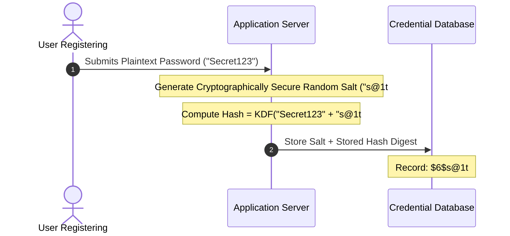
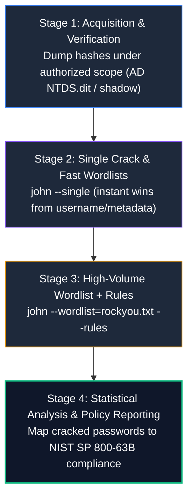

# John the Ripper: The Complete A-Z Password Auditing & Hash Recovery Masterclass

> **Category:** Password Security & Cryptanalysis | **Series:** Tooling Masterclass | **Level:** Beginner to Advanced

---

## Executive Overview

**John the Ripper (JtR)** is the industry standard open-source password security auditing, cryptanalysis, and hash recovery tool. Maintained by Solar Designer and the Openwall Project, JtR is engineered to identify weak passwords, audit enterprise password compliance, recover encrypted forensic artifacts, and stress-test credential security across enterprise environments.

Unlike naive brute-force utilities, John the Ripper leverages an advanced statistical candidate-generation engine. It combines intelligent dictionary permutation rules, Markov chain character frequency models, mask-based constraints, and native hardware optimization (AVX2, AVX-512, OpenCL, and CUDA) to test millions of password candidates per second against target hashes.


```text
+-----------------------------------------------------------------------------------------------+
|                            John the Ripper (JtR) Auditing Matrix                              |
+--------------------------+------------------------------------+-------------------------------+
|  1. Candidate Generation |  2. Hash Format Support            |  3. Extraction Ecosystem      |
|  - Wordlist Dictionaries |  - Linux crypt(3) ($1$, $5$, $6$)  |  - unshadow (/etc/shadow)     |
|  - Single Crack (GECOS)  |  - Windows NTLM / Kerberos TGS     |  - zip2john & 7z2john         |
|  - Incremental (Charset) |  - BSD bcrypt ($2a$, $2b$, $2y$)   |  - ssh2john (RSA/ED25519)     |
|  - Rule-Based Mutation   |  - Argon2id & PBKDF2               |  - keepass2john (KDBX vaults) |
|  - Mask & Hybrid Modes   |  - Raw Hashes (MD5, SHA1, SHA256)  |  - office2john & pdf2john     |
+--------------------------+------------------------------------+-------------------------------+
```

> [!IMPORTANT]
> **Legal & Ethical Notice:** Password cracking and credential recovery tools must only be used within an authorized security scope—such as authorized enterprise password strength audits, authorized penetration testing engagements, forensic investigations with proper legal chain of custody, and dedicated Capture the Flag (CTF) security labs. Never execute cracking tools against real-world systems, accounts, or hashes without explicit, written authorization.

---

### 📺 Interactive Video Demonstration & Cracking Labs

<div align="center">

| Demonstration | Target Architecture | Interactive Video Link |
| :--- | :--- | :---: |
| **John the Ripper Complete Masterclass** | Dictionary, Rules & Linux Shadow Cracking | [](https://www.youtube.com/results?search_query=john+the+ripper+complete+course+tutorial) |
| **Hash Identification & Password Auditing** | Hashid, Hashcat vs John, Formats | [](https://www.youtube.com/results?search_query=password+hash+identification+tutorial) |
| **Cracking Encrypted Files with *2john** | ZIP, KeePass, SSH Keys & PDF Forensics | [](https://www.youtube.com/results?search_query=zip2john+ssh2john+cracking+tutorial) |

</div>

---

### 💻 Real-Time Terminal Cracking Demonstration

The following animated recording demonstrates a live password audit using John the Ripper (`john --wordlist=/usr/share/wordlists/rockyou.txt unshadowed.txt`), highlighting hash loading, multi-threaded cracking, and viewing recovered credentials via `john --show`:


---

## Course Roadmap

| Part | Topic Domain | Key Concepts |
| :--- | :--- | :--- |
| **1 – 3** | **Fundamentals & Mental Model** | Hashing vs Encryption, Precomputation, JtR Architecture, Salt mechanics |
| **4 – 6** | **Installation & Hash Identification** | JtR Community Jumbo build, CLI flags, format discovery, Hashid tools |
| **7 – 13** | **The 5 JtR Attack Modes** | Wordlist, Single Crack, Incremental, Mask-based, Rule-based mutations |
| **14 – 16** | **Session Control & Hash Formats** | `--session` restore, `john.pot` management, format specification (`--format`) |
| **17 – 22** | **The `*2john` Extraction Ecosystem** | `unshadow`, `zip2john`, `ssh2john`, `keepass2john`, `pdf2john`, `office2john` |
| **23 – 25** | **Wordlist Engineering & Hardware** | Custom dictionaries (CeWL, crunch), OpenMP threading, CPU vs GPU hashing |
| **26 – 28** | **Enterprise Auditing & Methodology** | NIST SP 800-63B guidelines, credential auditing, remediation workflows |
| **29 – 30** | **Purple-Team Perspective & Defense** | Hash security hierarchy, bcrypt/Argon2id, Active Directory fine-grained policies |
| **31 – 34** | **Cheat Sheet & Practical Labs** | 10 hands-on cracking labs, master command cheat sheet, final mental model |

---

# 1. What Is John the Ripper?

**John the Ripper (JtR)** is a password-security auditing and password-recovery tool.

A foundational principle of cryptanalysis is that cryptographic hashes are **one-way mathematical functions**. You cannot "decrypt" a cryptographic hash back into its plaintext password. 

Instead, John operates by **candidate verification**:


When an auditor generates candidate words and computes their hash using the identical algorithm and salt, a matching digest proves that the original password has been identified.

---

# 2. Password Security Fundamentals & Salting

Understanding the difference between hashing, salting, and encryption is essential for every security professional:


### 2.1 Hashing vs. Encryption

* **Encryption (Two-Way):** Converts plaintext into ciphertext using an encryption key. The data is meant to be decrypted back to plaintext using the corresponding decryption key (e.g., AES-GCM, RSA).
* **Hashing (One-Way):** Maps an input of arbitrary length to a fixed-length string of bytes (digest). It is computationally irreversible; there is no secret decryption key.

---

### 2.2 Why Cryptographic Salting is Mandatory

A **Salt** is a unique, cryptographically random string generated and appended to a password *before* hashing:



### The Two Critical Roles of Salting:
1. **Neutralizes Rainbow Tables:** A rainbow table is a precomputed lookup table mapping billions of plaintext words to their hashes. Because every user has a unique random salt, precomputation tables cannot be reused across different users or systems.
2. **Defeats Duplicate Password Correlation:** If two users choose the same password (e.g., `Welcome1`), unsalted hashes would look identical in the database. Salting ensures that identical passwords produce completely different hash digests.

---

# 3. John Architecture & The Jumbo Build

When working with John the Ripper, always use the **Community-Enhanced "Jumbo" build**.

* **Core JtR:** The minimal, official release focused on classic Unix crypt algorithms (DES, BSDI, MD5).
* **JtR Jumbo:** The modern, community-enhanced distribution containing support for hundreds of additional formats (NTLM, Kerberos, SSH, KeePass, WPA/WPA2, BitLocker, ZIP, PDF, Office) and OpenCL/CUDA hardware acceleration.

```text
John Directory Structure (Jumbo):
/etc/john/ or ~/.john/
├── john.conf           # Master configuration (rule sets, charsets, external filters)
├── john.pot            # Stored database of cracked plaintext passwords
├── john.log            # Execution logfile with microsecond timestamps
├── default.chr         # Markov character distribution statistics file
└── wordlist/           # Default dictionary candidates
```

---

# 4 & 5. Installation & Verification

The Jumbo version is pre-installed on Kali Linux and Parrot OS:

```bash
# Verify installation and Jumbo capabilities
john --version
# Output: John the Ripper 1.9.0-jumbo-1 (or higher)

# List all supported hash formats
john --list=formats

# Filter formats matching specific protocols
john --list=formats | grep -iE "ntlm|sha512|bcrypt|zip"

# Execute internal hardware benchmark test
john --test
```

---

# 6. Hash Identification

Never blindly run cracking attacks without identifying the target hash format:

```text
Hash Syntax Anatomy (Linux /etc/shadow):
 $id$salt$encrypted_hash
  │    │       └─ Cryptographic Hash Digest
  │    └───────── Randomly generated per-user salt
  └────────────── Algorithm Identifier:
                   $1$  = MD5-based crypt
                   $2a$ = Blowfish-based bcrypt
                   $5$  = SHA-256 crypt
                   $6$  = SHA-512 crypt
                   $y$  = Yescrypt (Modern Linux standard)
```

### Identification Companion Tools:

```bash
# 1. Using hash-identifier
hash-identifier "5f4dcc3b5aa765d61d8327deb882cf99"

# 2. Using hashid
hashid -m "5f4dcc3b5aa765d61d8327deb882cf99"
# Output: [!] MD5 (Hashcat mode 0, JtR format: raw-md5)
```

---

# 7 – 13. The 5 Core JtR Attack Modes

John the Ripper provides five distinct attack strategies to balance speed against search-space coverage:


---

### Mode 1: Wordlist Mode (`--wordlist`)
Iterates sequentially through a dictionary file of known common passwords. Fast, effective against weak passwords, but limited to words already in the list:
```bash
# Wordlist attack using rockyou.txt
john --wordlist=/usr/share/wordlists/rockyou.txt hashes.txt
```

---

### Mode 2: Single Crack Mode (`--single`)
Abuses account metadata (usernames, real names, and GECOS information in `/etc/passwd`) by mutating those fields using hundreds of built-in variations (e.g., user `john` ➔ `john123`, `J0hn!`, `nhoj`):
```bash
# Execute single crack mode against unshadowed user files
john --single unshadowed.txt
```
> [!TIP]
> Always run `--single` **first** during an audit! It is blazing fast and frequently cracks 10%–20% of enterprise accounts that choose passwords based on their own username or department name.

---

### Mode 3: Incremental Mode (`--incremental`)
Exhaustive brute-force exploration across character set permutations. It leverages Markov statistical models to try the most probable character combinations first:
```bash
# Pure incremental brute-force attack
john --incremental hashes.txt

# Constrain incremental to digits only (e.g., PIN codes)
john --incremental:Digits hashes.txt
```

---

### Mode 4: Mask Mode (`--mask`)
Constrains candidate generation to structured patterns, drastically reducing the search space:

| Mask Symbol | Character Set |
| :---: | :--- |
| **`?l`** | Lowercase letters (`a-z`) |
| **`?u`** | Uppercase letters (`A-Z`) |
| **`?d`** | Digits (`0-9`) |
| **`?s`** | Special characters / symbols (``!@#$%^&*()-_...``) |
| **`?a`** | All printable characters |

```bash
# Crack passwords matching pattern: Upper + 3 Lower + 2 Digits + Symbol (e.g., Pass12!)
john --mask='?u?l?l?l?d?d?s' hashes.txt

# Hybrid mask: Base word + 2 digits + 1 symbol (e.g., Winter26!)
john --wordlist=company_words.txt --mask='?w?d?d?s' hashes.txt
```

---

### Mode 5: Rule-Based Mutation (`--rules`)
Applies algorithmic transformations to every entry in a dictionary, simulating how human users alter passwords:

```bash
# Execute wordlist attack with standard mutation rules
john --wordlist=/usr/share/wordlists/rockyou.txt --rules hashes.txt

# Use specific rule sets from john.conf (e.g., Jumbo, KoreLogic)
john --wordlist=rockyou.txt --rules=Jumbo hashes.txt
```

#### How Rules Mutate Candidates:
* **Capitalization:** `password` ➔ `Password`, `pAssword`
* **Append Digits & Years:** `password` ➔ `password2026`, `password123`
* **Leet-Speak Substitution:** `password` ➔ `p@ssw0rd`
* **Prepend/Append Symbols:** `password` ➔ `!Password!`

---

# 14 & 15. Sessions & The Pot File

### Session Management for Long-Running Audits:
Large password audits can run for hours or days. JtR provides robust session pause and resume controls:

```bash
# Start a named session
john --session=q3_audit --wordlist=rockyou.txt hashes.txt

# Check live progress of a running session
john --status=q3_audit

# Resume an interrupted session after system reboot
john --restore=q3_audit
```

---

### The Pot File (`john.pot`):
When John cracks a password, it immediately appends the hash and plaintext candidate to `~/.john/john.pot`. This prevents John from ever wasting CPU cycles re-cracking a password it has already recovered:

```bash
# View all previously cracked passwords for a hash list
john --show hashes.txt

# Inspect raw potfile contents
cat ~/.john/john.pot
```

---

# 17 & 18. Linux Authentication & `unshadow`

On modern Linux systems, user account metadata is stored in `/etc/passwd` (world-readable), while cryptographic password hashes are restricted to `/etc/shadow` (root-readable only).

John requires both files to correlate usernames with hashes:

```bash
# 1. Combine passwd and shadow into a single JtR-compatible format
sudo unshadow /etc/passwd /etc/shadow > unshadowed.txt

# 2. Run Single Crack mode first
john --single unshadowed.txt

# 3. Run Wordlist + Mutation Rules
john --wordlist=/usr/share/wordlists/rockyou.txt --rules unshadowed.txt

# 4. Display all recovered account credentials
john --show unshadowed.txt
```

---

# 19 – 22. The `*2john` Extraction Ecosystem

John the Ripper includes an extensive suite of pre-processing scripts that extract hash representations from encrypted containers, keys, and documents:


### The 6 Core Extraction Utilities

#### 1. `zip2john` (Encrypted ZIP Archives)
```bash
# Extract hash from password-protected ZIP archive
zip2john confidential.zip > zip.hash

# Crack the extracted ZIP hash
john --wordlist=/usr/share/wordlists/rockyou.txt zip.hash
```

#### 2. `ssh2john` (Encrypted SSH Private Keys)
```bash
# Extract hash from passphrase-protected RSA or ED25519 private key
ssh2john ~/.ssh/id_rsa > id_rsa.hash

# Audit the passphrase
john --wordlist=rockyou.txt id_rsa.hash
```

#### 3. `keepass2john` (KeePass Password Vaults)
```bash
# Extract master password hash from KeePass (.kdbx) database
keepass2john enterprise_vault.kdbx > keepass.hash

# Recover master passphrase
john --wordlist=rockyou.txt keepass.hash
```

#### 4. `pdf2john.py` (Password-Protected PDFs)
```bash
# Extract encryption hash from encrypted PDF document
pdf2john confidential_report.pdf > pdf.hash

# Crack PDF master/user password
john --wordlist=rockyou.txt pdf.hash
```

#### 5. `office2john.py` (Microsoft Word / Excel / PowerPoint)
```bash
# Extract hash from password-protected Word or Excel document
office2john payroll_2026.xlsx > office.hash

# Audit Office document password
john --wordlist=rockyou.txt office.hash
```

---

# 26 – 28. Professional Password Auditing Workflow

In professional enterprise assessments, follow a **four-stage structured methodology**:



---

# 29 & 30. Purple-Team Perspective: Password Hashing Hierarchy

From a defensive engineering perspective, the output of a password audit is not just a list of compromised passwords—it is **a roadmap for cryptographic hardening**:


### Cryptographic Hashing Security Tiers

| Security Tier | Algorithms | Resilience Properties | Status |
| :--- | :--- | :--- | :--- |
| **Insecure (Broken)** | MD5, SHA1 | Unsalted, vulnerable to instant collision and rainbow tables. | ❌ Prohibited |
| **Vulnerable** | NTLM, raw SHA256/512 | Fast execution; modern GPU rigs test **billions** of hashes/sec. | ⚠️ Deprecated |
| **Acceptable** | PBKDF2 (600,000+ rounds), bcrypt (cost 12+) | Computationally expensive; slows down GPU cracking clusters. | ✅ Standard |
| **Enterprise Gold Standard** | **Argon2id** | **Memory-hard**, side-channel resistant; defeats GPU & ASIC acceleration. | 🏆 NIST & OWASP Gold |

---

### Modern Defensive Policies (NIST SP 800-63B Aligned)

1. **Eliminate Arbitrary Complexity Rules:** Requiring upper, lower, numbers, and symbols leads directly to predictable patterns (e.g., `Spring2026!`). Focus instead on **minimum length (15+ characters)**.
2. **Stop Forced 90-Day Rotations:** Frequent forced changes cause users to increment numbers (`Password1!` ➔ `Password2!`). Enforce rotations only upon suspected breach.
3. **Screen Against Known Compromised Passwords:** Reject passwords present in breach corpuses (e.g., HaveIBeenPwned API).

---

# 31. Authorized Hands-On Labs

Execute these 10 structured lab exercises in your Kali Linux testing environment:

```bash
# ------------------------------------------------------------------------------
# Lab 1: Linux /etc/shadow Auditing
# ------------------------------------------------------------------------------
sudo unshadow /etc/passwd /etc/shadow > lab_unshadow.txt
john --single lab_unshadow.txt
john --wordlist=/usr/share/wordlists/rockyou.txt lab_unshadow.txt
john --show lab_unshadow.txt

# ------------------------------------------------------------------------------
# Lab 2: Encrypted ZIP Archive Recovery
# ------------------------------------------------------------------------------
zip2john lab_archive.zip > zip.hash
john --wordlist=/usr/share/wordlists/rockyou.txt zip.hash
john --show zip.hash

# ------------------------------------------------------------------------------
# Lab 3: SSH Key Passphrase Recovery
# ------------------------------------------------------------------------------
ssh2john test_id_rsa > ssh.hash
john --wordlist=/usr/share/wordlists/rockyou.txt ssh.hash

# ------------------------------------------------------------------------------
# Lab 4: KeePass Database Auditing
# ------------------------------------------------------------------------------
keepass2john vault.kdbx > keepass.hash
john --wordlist=/usr/share/wordlists/rockyou.txt keepass.hash

# ------------------------------------------------------------------------------
# Lab 5: Mask-Based Pattern Cracking
# ------------------------------------------------------------------------------
# Target pattern: Capital Letter + 4 digits (e.g. A1234)
john --format=raw-md5 --mask='?u?d?d?d?d' target_md5.txt
```

---

# 32. Master John the Ripper Command Cheat Sheet

```bash
# ==============================================================================
# 🎯 BASIC SCANNING & FORMAT SPECIFICATION
# ==============================================================================
john hashes.txt                           # Autodetect format and crack using default modes
john --format=raw-md5 hashes.txt          # Explicitly specify format as MD5
john --format=NT hashes.txt               # Crack Windows NTLM hashes
john --format=sha512crypt hashes.txt      # Crack Linux SHA-512 ($6$) shadow hashes
john --list=formats                       # List all supported hash algorithms

# ==============================================================================
# ⚡ THE 5 ATTACK MODES
# ==============================================================================
john --wordlist=rockyou.txt hashes.txt    # Wordlist / Dictionary attack
john --single unshadowed.txt              # Single crack mode (abuses usernames & GECOS)
john --incremental hashes.txt             # Pure brute-force character iteration
john --mask='?u?l?l?l?d?d?s' hashes.txt  # Mask attack matching custom structure
john --wordlist=words.txt --rules hashes  # Mutate wordlist using JtR transformation rules

# ==============================================================================
# 🗃️ *2JOHN EXTRACTION UTILITIES
# ==============================================================================
unshadow /etc/passwd /etc/shadow > un.txt # Combine Linux passwd and shadow files
zip2john encrypted.zip > zip.hash         # Extract hash from protected ZIP archive
ssh2john id_rsa > rsa.hash                # Extract hash from encrypted SSH private key
keepass2john database.kdbx > kdbx.hash    # Extract hash from KeePass password vault
pdf2john document.pdf > pdf.hash          # Extract hash from encrypted PDF document
office2john report.docx > office.hash     # Extract hash from encrypted Microsoft Office doc

# ==============================================================================
# ⏱️ SESSIONS & SHOWING CREDENTIALS
# ==============================================================================
john --session=audit01 hashes.txt         # Start named session for persistent jobs
john --status=audit01                     # Check live progress of background session
john --restore=audit01                    # Resume interrupted session
john --show hashes.txt                    # Display all cracked passwords from john.pot
```

---

# Summary & Core Philosophy

John the Ripper is much more than a password recovery tool—it is a **mirror reflecting an organization's identity security posture**.

1. **Weak Hashes Compromise Strong Passwords:** A 20-character password hashed with unsalted MD5 or NTLM can still be vulnerable to fast GPU cracking or pass-the-hash attacks.
2. **Predictable Policies Breed Predictable Passwords:** Complex password rules force humans into algorithmic patterns that JtR's `--rules` and `--mask` modes exploit instantly.
3. **The Ultimate Defense:** Implement **Argon2id** or **bcrypt (cost 12+)**, eliminate periodic rotation mandates, and enforce phishing-resistant Multi-Factor Authentication (FIDO2 / WebAuthn).
