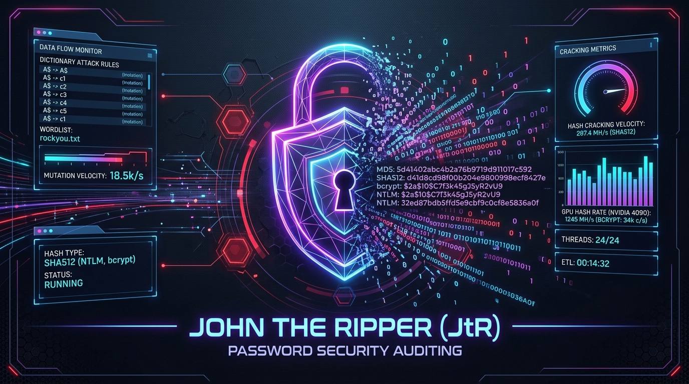
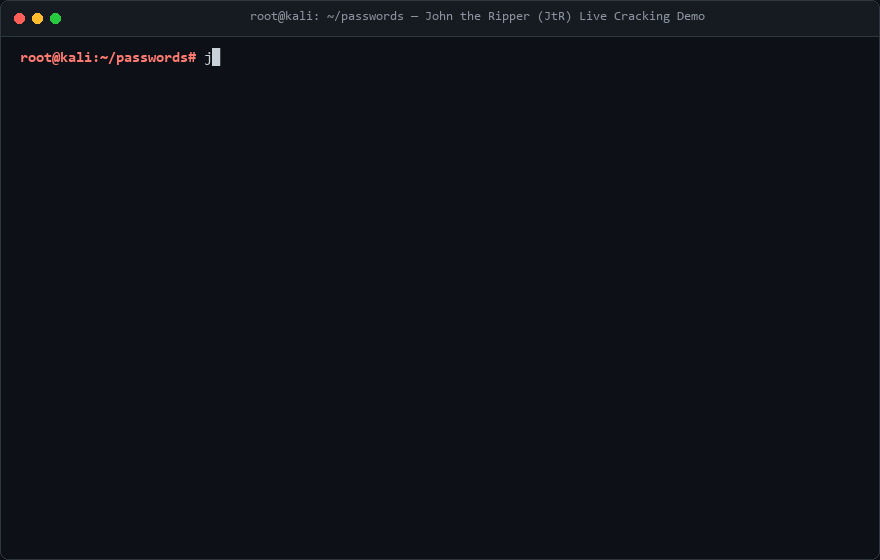
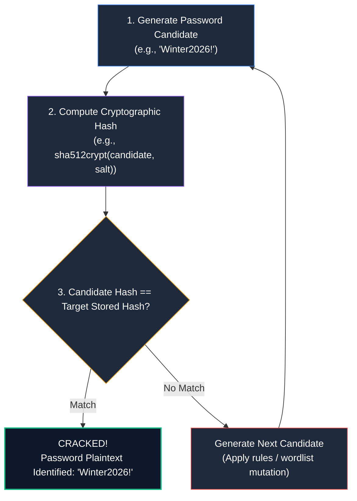
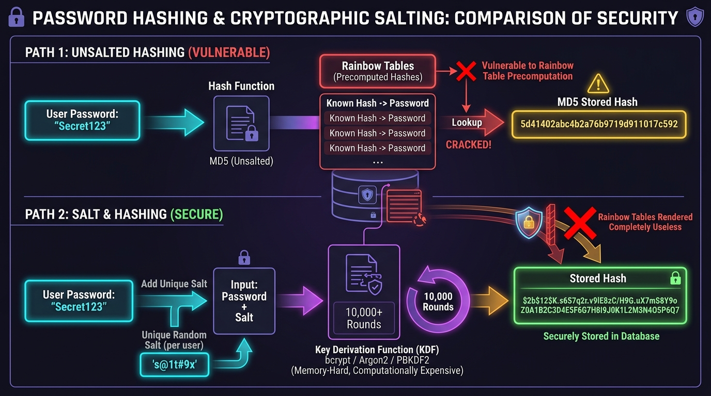
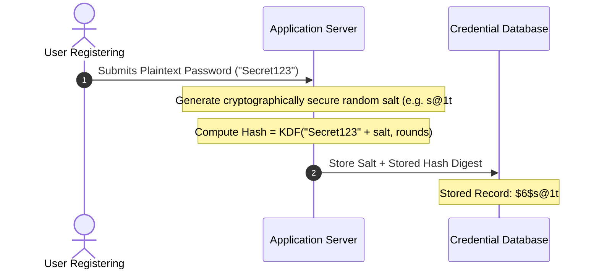
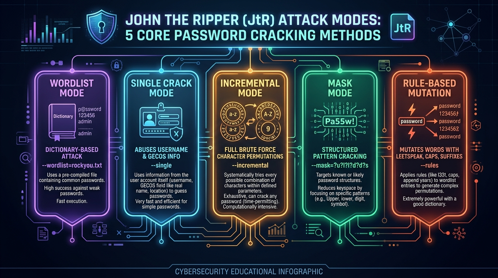
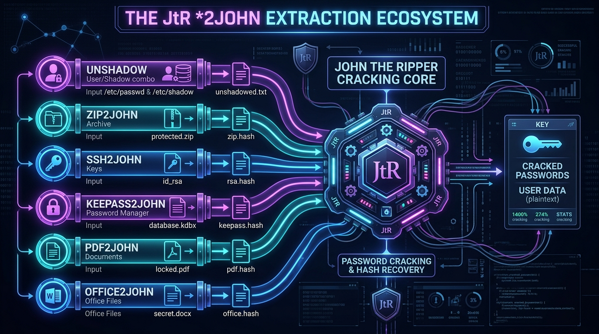
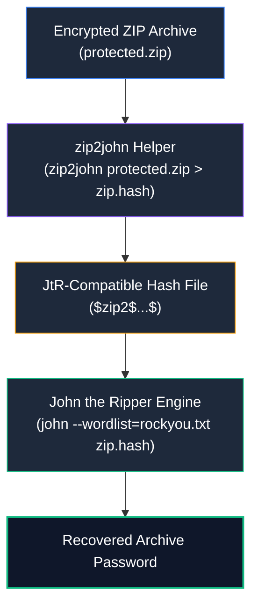
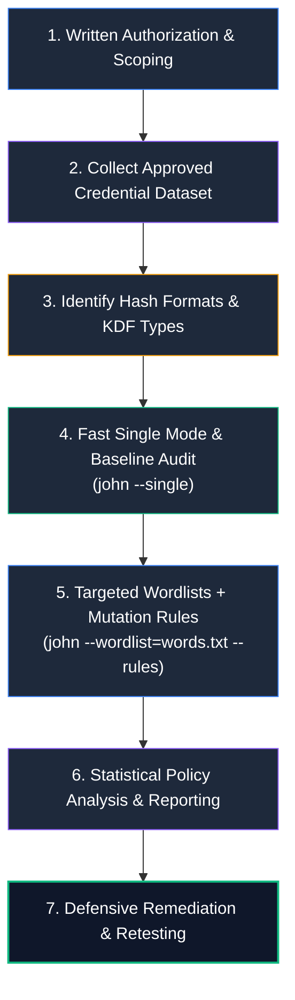
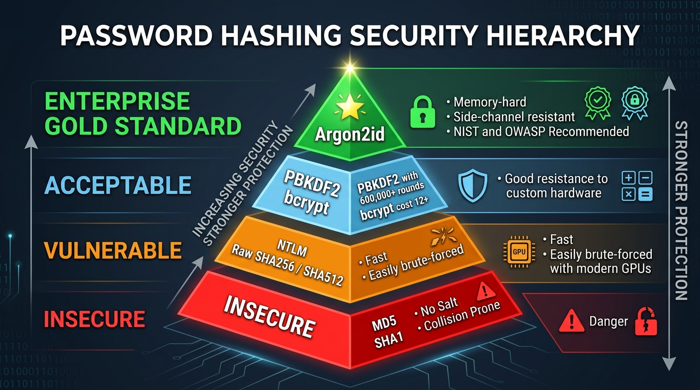

# John the Ripper — A–Z Complete Cybersecurity Course

> **Scope:** Authorized password auditing, CTFs, security labs, incident response, and defensive password-strength testing only.
>
> **Level:** Beginner → Intermediate → Advanced → Purple Team
>
> **Goal:** Learn John the Ripper (JtR) deeply enough to identify password hashes, select the correct attack strategy, build controlled wordlists, use rules and incremental cracking, audit password policies, analyze results, and translate findings into defensive controls.

---

<div align="center">



# ⚔️ John the Ripper (JtR) Masterclass ⚔️
### The Definitive Guide to Password Cryptanalysis, Hash Auditing & Defensive Hardening

[](https://pages.nist.gov/800-63-3/sp800-63b.html)
[](https://www.openwall.com/john/)
[](https://github.com/sivaoffl04/Cyber-Blog)

</div>

---

### 📺 Interactive Video Demonstration & Cracking Labs

<div align="center">

| Demonstration | Target Architecture | Interactive Video Link |
| :--- | :--- | :---: |
| **John the Ripper Complete Masterclass** | Dictionary, Rules & Linux Shadow Cracking | [](https://www.youtube.com/results?search_query=john+the+ripper+complete+course+tutorial) |
| **Hash Identification & Password Auditing** | Hashid, Hashcat vs John, Formats | [](https://www.youtube.com/results?search_query=password+hash+identification+tutorial) |
| **Cracking Encrypted Files with \*2john** | ZIP, KeePass, SSH Keys & PDF Forensics | [](https://www.youtube.com/results?search_query=zip2john+ssh2john+cracking+tutorial) |

</div>

---

### 💻 Real-Time Terminal Cracking Demonstration

The animated demonstration below showcases a live password auditing session in Kali Linux utilizing John the Ripper (`john --wordlist=/usr/share/wordlists/rockyou.txt unshadowed.txt`), highlighting hash loading, multi-threaded candidate verification, and instant plaintext recovery via `john --show`:



---

# Table of Contents

1. [What Is John the Ripper?](#1-what-is-john-the-ripper)
2. [Password Security Fundamentals](#2-password-security-fundamentals)
   - [2.1 Hashing vs Encryption](#21-hashing-vs-encryption)
   - [2.2 Example](#22-example)
   - [2.3 Why Cryptographic Salting is Mandatory](#23-why-cryptographic-salting-is-mandatory)
3. [John Architecture and Mental Model](#3-john-architecture-and-mental-model)
4. [Installation](#4-installation)
   - [Kali Linux](#kali-linux)
   - [Ubuntu / Debian](#ubuntu--debian)
   - [Check Help](#check-help)
5. [First Commands](#5-first-commands)
   - [Basic syntax](#basic-syntax)
   - [Show recovered passwords](#show-recovered-passwords)
   - [Show John status](#show-john-status)
   - [List formats](#list-formats)
   - [Test benchmark](#test-benchmark)
6. [Hash Identification](#6-hash-identification)
   - [6.1 Hash Identifier Tools](#61-hash-identifier-tools)
   - [6.2 John Format Detection](#62-john-format-detection)
   - [6.3 Format Discovery](#63-format-discovery)
7. [John Modes](#7-john-modes)
8. [Wordlist Attacks](#8-wordlist-attacks)
   - [8.1 Common Kali Wordlists](#81-common-kali-wordlists)
   - [8.2 Custom Wordlist](#82-custom-wordlist)
9. [Single Crack Mode](#9-single-crack-mode)
10. [Incremental Mode](#10-incremental-mode)
11. [Rules and Wordlist Mutation](#11-rules-and-wordlist-mutation)
    - [11.1 Basic Rules Attack](#111-basic-rules-attack)
    - [11.2 List Rules](#112-list-rules)
    - [11.3 Why Rules Matter](#113-why-rules-matter)
12. [Mask-Based and Structured Password Attacks](#12-mask-based-and-structured-password-attacks)
13. [Hybrid Strategies](#13-hybrid-strategies)
14. [Sessions and Long-Running Jobs](#14-sessions-and-long-running-jobs)
    - [14.1 Restore](#141-restore)
    - [14.2 Status](#142-status)
    - [14.3 Why Sessions Matter](#143-why-sessions-matter)
15. [The Pot File and Cracked Passwords](#15-the-pot-file-and-cracked-passwords)
16. [Password Hash Formats](#16-password-hash-formats)
17. [Linux `/etc/passwd` and `/etc/shadow`](#17-linux-etcpasswd-and-etcshadow)
18. [`unshadow`](#18-unshadow)
19. [Windows / NTLM Password Auditing](#19-windows--ntlm-password-auditing)
20. [ZIP Password Auditing](#20-zip-password-auditing)
21. [PDF Password Auditing](#21-pdf-password-auditing)
22. [Office Document Password Auditing](#22-office-document-password-auditing)
23. [Custom Wordlists](#23-custom-wordlists)
    - [23.1 Simple Custom List](#231-simple-custom-list)
    - [23.2 Password Policy Modeling](#232-password-policy-modeling)
    - [23.3 Wordlist Quality](#233-wordlist-quality)
24. [Performance and Optimization](#24-performance-and-optimization)
    - [24.1 Benchmark](#241-benchmark)
    - [24.2 Avoid Blind Brute Force](#242-avoid-blind-brute-force)
    - [24.3 Fast Hash vs Slow Password Hash](#243-fast-hash-vs-slow-password-hash)
25. [CPU vs GPU](#25-cpu-vs-gpu)
26. [Password Policy Auditing](#26-password-policy-auditing)
    - [Example Finding](#example-finding)
27. [Common Errors](#27-common-errors)
28. [Professional Password-Audit Workflow](#28-professional-password-audit-workflow)
29. [Purple-Team Perspective](#29-purple-team-perspective)
30. [Detection and Hardening](#30-detection-and-hardening)
31. [Authorized Practical Labs](#31-authorized-practical-labs)
32. [Command Cheat Sheet](#32-command-cheat-sheet)
33. [Mastery Roadmap](#33-mastery-roadmap)
34. [Final Mental Model](#34-final-mental-model)
- [Professional Checklist](#professional-checklist)
- [Recommended Lab Stack](#recommended-lab-stack)
- [Final Takeaway](#final-takeaway)

---

# 1. What Is John the Ripper?

**John the Ripper**, commonly called **John** or **JtR**, is an open-source password-security auditing and password-recovery tool designed by Solar Designer and maintained by the Openwall Project.

Its fundamental mechanism is based on **candidate verification**:

```text
Candidate password
       |
       v
   Hash function
       |
       v
Candidate hash
       |
       v
Compare with target hash
       |
   +---+---+
   |       |
 match   no match
   |       |
   v       v
password  next candidate
```



John does not normally "decrypt" a password hash. Cryptographic hashes are designed mathematically to be strictly one-way.

Instead, John repeatedly:

1. **Generates** a password candidate.
2. **Applies** the appropriate hashing algorithm and cryptographic salt.
3. **Compares** the resulting digest against the target hash.
4. **Reports a match** when an identical digest is produced.

### Example Walkthrough

```text
Password to audit:
Winter2026!

Stored Target Hash:
$6$s@1t$Yk0f9hN3pWq1... (SHA-512 crypt)

John's Iteration Stream:
Candidate 1: Winter2025  --> Hash: $6$s@1t$9A3z... [NO MATCH]
Candidate 2: Winter2026  --> Hash: $6$s@1t$4F1c... [NO MATCH]
Candidate 3: Winter2026! --> Hash: $6$s@1t$Yk0f... [MATCH! -> CRACKED]
Candidate 4: Winter2027  --> Skipped
```

When the generated candidate produces the target hash, the password has been successfully recovered.

---

# 2. Password Security Fundamentals

Understanding the theoretical distinction between hashing, salting, and encryption is essential for every security practitioner:



## 2.1 Hashing vs Encryption

### Hashing (One-Way)

Hashing is designed to be mathematically irreversible:

```text
password -> hash digest
```

There is no secret key that lets you reverse a secure password hash back into plaintext. It maps arbitrary data into a fixed-length string of bytes (e.g., MD5 produces 128 bits, SHA-256 produces 256 bits).

### Encryption (Two-Way)

Encryption is reversible when the correct secret key is available:

```text
plaintext + key -> ciphertext
ciphertext + key -> plaintext
```

Common encryption ciphers include symmetric algorithms (AES-256-GCM, ChaCha20) and asymmetric cryptosystems (RSA, ECC).

### Why John Works

Because password hashes cannot be reversed mathematically, John attacks the **password space** rather than attempting to decrypt the hash directly:

```text
Candidate
   |
   v
Hash candidate
   |
   v
Compare
```

---

## 2.2 Example

Suppose an authorized lab gives you the following hex digest:

```text
5f4dcc3b5aa765d61d8327deb882cf99
```

If the hash format is identified as unsalted MD5 (`raw-md5`), John tests candidates until the generated MD5 digest matches:

```bash
# Compute MD5 of candidate "password"
echo -n "password" | md5sum
# Result: 5f4dcc3b5aa765d61d8327deb882cf99
```

When John hashes `password`, it produces an identical 32-character hexadecimal string, proving the plaintext password is `password`.

---

## 2.3 Why Cryptographic Salting is Mandatory

A **salt** is a cryptographically random string generated uniquely for each user and appended to the password before hashing:



### The Two Critical Roles of Salting:
1. **Neutralizes Rainbow Tables:** Rainbow tables are massive precomputed lookup tables mapping billions of plaintext words to their hashes. Because every user has a unique random salt, precomputation tables cannot be reused across different users or systems.
2. **Defeats Duplicate Password Correlation:** If two users select the exact same password (e.g., `Welcome1`), unsalted hashes would look identical in the database. Salting ensures that identical passwords produce completely distinct hash digests.

---

# 3. John Architecture and Mental Model

Think of John as five interconnected core components:

```text
                 +----------------+
                 | Target Hashes  |
                 +-------+--------+
                         |
                         v
+-------------+    +-----------+    +----------------+
| Wordlists   | -> | John Core | -> | Hash Algorithm |
+-------------+    +-----------+    +----------------+
                         |
                         v
                 +----------------+
                 | Result / Pot   |
                 +----------------+
```

### Important Architectural Concepts:

| Component | Function & Role |
| :--- | :--- |
| **Target File** | File containing password hashes, usernames, and cryptographic metadata being audited. |
| **Format (`--format`)** | Instructs John which cryptographic parser and algorithm engine to execute (e.g., `raw-md5`, `nt`, `sha512crypt`). |
| **Wordlist (`--wordlist`)** | Baseline dictionary file of candidate passwords fed into the cracking engine. |
| **Rules (`--rules`)** | Algorithmic mutation engine that capitalizes, appends numbers, or permutes dictionary words. |
| **Mode** | Mathematical strategy determining how candidates are created (Wordlist, Single Crack, Incremental, Mask). |
| **Session (`--session`)** | State preservation mechanism allowing multi-day audit jobs to be paused, monitored, and resumed. |
| **Pot File (`john.pot`)** | Stored flat-file database of all previously recovered plaintext credentials. |
| **Jumbo Build** | Community-enhanced JtR distribution supporting hundreds of algorithms, OpenCL/CUDA, and extraction tools. |

---

# 4. Installation

## Kali Linux

The community-enhanced Jumbo version comes pre-installed in Kali Linux. To verify or update:

```bash
sudo apt update
sudo apt install john
```

Check build version:

```bash
john --version
```

List supported formats:

```bash
john --list=formats
```

You can paginate and search through the output:

```bash
john --list=formats | less
```

---

## Ubuntu / Debian

On vanilla Ubuntu or Debian installations:

```bash
sudo apt update
sudo apt install john
```

Verify installation:

```bash
john --version
```

> [!TIP]
> On Debian/Ubuntu servers, installing `john` via apt provides the core or standard Jumbo package. For cutting-edge GPU OpenCL/CUDA acceleration, consider building the latest Jumbo branch from source: `git clone https://github.com/openwall/john.git && cd john/src && ./configure && make -sj4`.

---

## Check Help

Display standard command line flags:

```bash
john --help
```

Display detailed internal parameters and sub-options:

```bash
john --list=help
```

---

# 5. First Commands

## Basic syntax

```bash
john [options] [password-file]
```

Example basic invocation:

```bash
john hashes.txt
```

---

## Show recovered passwords

Display all credentials recovered from a specific target file:

```bash
john --show hashes.txt
```

Display only hashes that have not yet been cracked:

```bash
john --show=LEFT hashes.txt
```

---

## Show John status

While John is running actively in your terminal, press any key (or specifically `Space` or `Enter`) to display the live cracking status:

```text
guesses: 142  time: 0:00:01:24 15.23% (ETA: 21:45:10)  c/s: 1420K  trying: summer2026 - winter2026
```

To safely terminate the process without corrupting session states, press:

```text
q
```

or send an interrupt signal (`Ctrl + C`).

---

## List formats

View all supported algorithms and format strings:

```bash
john --list=formats
```

---

## Test benchmark

Execute an internal speed benchmark across supported hashing algorithms:

```bash
john --test
```

Benchmark a specific format (e.g., Linux SHA-512 crypt):

```bash
john --test --format=sha512crypt
```

This reveals the maximum candidate tests per second (`c/s`) your CPU or GPU can achieve.

---

# 6. Hash Identification

Correct hash identification is one of the most vital skills in cryptanalysis. Never blindly run a huge cracking attack without knowing what you are testing.

First ask:

```text
What is this hash?
Where was it extracted from?
What is its character length and encoding?
```

---

## 6.1 Hash Identifier Tools

Use companion command-line utilities to inspect unknown strings:

```bash
# Using hashid
hashid '5f4dcc3b5aa765d61d8327deb882cf99'

# Using hashid with JtR format mapping
hashid -m '5f4dcc3b5aa765d61d8327deb882cf99'
```

Alternatively, use `hash-identifier`:

```bash
hash-identifier
```

> [!IMPORTANT]
> **Context is King:** Automated hash identifiers provide probabilistic guesses based on string length and character set. A 32-character hex string could be unsalted MD5, NTLM, MD4, or LM. Always correlate tools with system context (e.g., extracted from Windows SAM = NTLM; extracted from Linux `/etc/shadow` with `$6$` = SHA-512).

---

## 6.2 John Format Detection

John features built-in signature detection. When executed without `--format`, it attempts to identify the hash automatically:

```bash
john hashes.txt
```

If John detects multiple candidate algorithms or fails to auto-detect, explicitly declare the format:

```bash
john --format=FORMAT hashes.txt
```

Example syntax:

```bash
john --format=raw-md5 hashes.txt
john --format=NT hashes.txt
john --format=sha512crypt hashes.txt
```

---

## 6.3 Format Discovery

List all supported formats filtered by algorithm family:

```bash
# Find all MD5 variations
john --list=formats | grep -i md5

# Find Windows NT / NTLM formats
john --list=formats | grep -i nt

# Find archive and document formats
john --list=formats | grep -iE "zip|rar|pdf|office"
```

---

# 7. John Modes

John the Ripper provides distinct attack modes balancing candidate coverage against computational execution time:



```text
                 John
                   |
       +-----------+-----------+
       |           |           |
   Wordlist     Single     Incremental
       |
     Rules
```

### Overview of Core Modes:

| Mode | Command Flag | Ideal Use Case | Speed / Search Space |
| :--- | :--- | :--- | :--- |
| **Wordlist Mode** | `--wordlist=file.txt` | Dictionary attacks testing common passwords | Fast, bounded by list size |
| **Single Crack Mode** | `--single` | Targets account names & GECOS info | Ultra-fast, tests user metadata |
| **Incremental Mode** | `--incremental` | Exhaustive brute-force character permutations | Slow, mathematically complete |
| **Rule-Based Mutation** | `--rules` | Mutates base dictionary words algorithmically | Moderate, highly realistic |
| **Mask Mode** | `--mask='?u?l?l?d'` | Constrained structural pattern attacks | Fast, limits brute force |

The choice of mode depends directly on the target password policy and available intelligence.

---

# 8. Wordlist Attacks

Wordlist attacks represent the primary baseline strategy in any password audit.

```bash
john --wordlist=wordlist.txt hashes.txt
```

---

## 8.1 Common Kali Wordlists

On Kali Linux, industry-standard wordlists are located in:

```bash
/usr/share/wordlists/
```

List installed dictionaries:

```bash
ls -lah /usr/share/wordlists/
```

Decompress the standard `rockyou.txt` dictionary if compressed:

```bash
sudo gzip -d /usr/share/wordlists/rockyou.txt.gz
```

For introductory lab exercises, small targeted wordlists are far faster than testing 14 million entries immediately.

---

## 8.2 Custom Wordlist

Create a targeted wordlist for your testing environment:

```bash
nano passwords.txt
```

Populate with sample lab candidates:

```text
password
Password1
Winter2026
Security123
Admin123
```

Execute the attack:

```bash
john --wordlist=passwords.txt hashes.txt
```

Show cracked results:

```bash
john --show hashes.txt
```

---

# 9. Single Crack Mode

Single crack mode is JtR’s specialized attack mode for password files containing account metadata (such as usernames, real names, and GECOS fields in Linux `/etc/passwd`).

```bash
john --single hashes.txt
```

### Conceptual Architecture

```text
Username (e.g., 'johnson')
Real Name (e.g., 'Bob Johnson')
Home Directory (e.g., '/home/johnson')
Account GECOS metadata
        |
        v
Mutation Engine:
johnson -> Johnson1, J0hnson!, nosnhoj, Johnson2026...
        |
        v
Candidate Generation
```

> [!TIP]
> **Always run `--single` first!** In corporate audits, employees frequently choose passwords containing their first name, last name, department, or username. Single mode runs in seconds and often cracks 10%–20% of corporate credentials.

---

# 10. Incremental Mode

Incremental mode generates candidate passwords through exhaustive combinatorial exploration across character sets:

```bash
john --incremental hashes.txt
```

Constrain incremental mode to digits (e.g., 4-digit or 6-digit PIN codes):

```bash
john --incremental:Digits hashes.txt
```

Constrain incremental mode to alphanumeric characters:

```bash
john --incremental:Alpha hashes.txt
```

### Search Space Combinatorics

The search space grows exponentially with password length:

$$\text{Search Space} = |\text{Charset}|^{\text{Length}}$$

For an 8-character password using only lowercase letters ($26$ characters):

$$26^8 = 208,827,064,576 \text{ candidates}$$

Adding uppercase letters ($26$), digits ($10$), and special symbols ($32$) expands the charset to $94$:

$$94^8 = 6,095,689,385,410,816 \text{ candidates}$$

This mathematical reality demonstrates why password length and entropy are critical defensive barriers.

---

# 11. Rules and Wordlist Mutation

Rules are among John the Ripper’s most powerful features. Instead of testing only literal dictionary words, rules algorithmically transform baseline candidates into common human variations.

```text
Dictionary Base: "summer"
Mutated by Rules:
- Summer
- summer1
- Summer2026!
- sUmm3r
- !summer!
```

---

## 11.1 Basic Rules Attack

Combine a dictionary with John's default rule set:

```bash
john --wordlist=wordlist.txt --rules hashes.txt
```

Specify a specific rule configuration block from `john.conf`:

```bash
john --wordlist=wordlist.txt --rules=Jumbo hashes.txt
john --wordlist=wordlist.txt --rules=KoreLogic hashes.txt
```

---

## 11.2 List Rules

Inspect your local John configuration file:

```bash
john --config
```

Locate rule definitions in `john.conf`:

```bash
grep -n "List.Rules" /etc/john/john.conf
```

### Rule Syntax Reference Table

| Rule Character | Transformation Meaning | Example Input | Output |
| :---: | :--- | :---: | :---: |
| **`c`** | Capitalize first letter | `secret` | `Secret` |
| **`u`** | Uppercase all letters | `secret` | `SECRET` |
| **`l`** | Lowercase all letters | `SECRET` | `secret` |
| **`$`** | Append character | `$` `1` | `secret1` |
| **`^`** | Prepend character | `^` `!` | `!secret` |
| **`r`** | Reverse string | `secret` | `terces` |
| **`s`** | Substitute character | `s` `o` `0` | `secret0` |

---

## 11.3 Why Rules Matter

A raw dictionary containing:

```text
summer
dragon
security
```

will fail completely against:

```text
Summer1
Summer2026
Dragon!
Security123
```

Wordlist mutation rules bridge this gap by simulating psychological password patterns.

---

# 12. Mask-Based and Structured Password Attacks

Mask mode constrains candidate generation to predefined structural patterns, drastically cutting the search space compared to blind brute-force:

```text
Structured Pattern:
[Uppercase Letter] + [3 Lowercase Letters] + [2 Digits] + [Symbol]
Example: Pass12!
```

### Supported Mask Symbols:

| Mask Placeholder | Character Set Covered |
| :---: | :--- |
| **`?l`** | Lowercase characters (`a-z`) |
| **`?u`** | Uppercase characters (`A-Z`) |
| **`?d`** | Decimal digits (`0-9`) |
| **`?s`** | Special characters and punctuation |
| **`?a`** | All printable ASCII characters |

### Execution Syntax:

```bash
# Match pattern: 1 Upper, 3 Lower, 2 Digits, 1 Symbol (e.g., Pass12!)
john --mask='?u?l?l?l?d?d?s' hashes.txt

# Hybrid mask: Base dictionary word + 2 digits + 1 symbol
john --wordlist=company_words.txt --mask='?w?d?d?s' hashes.txt
```

The core principle:

$$\text{Tighter Candidate Model} \implies \text{Smaller Search Space} \implies \text{Faster Audit}$$

---

# 13. Hybrid Strategies

Hybrid attacks combine multiple candidate generation methodologies (e.g., combining fixed wordlists with mask-based character appendages):

```text
Base Word  +  Digits  +  Special Symbol
"Security" +   "123"   +       "!"
```

```bash
# Hybrid: Append 4 digits to wordlist entries
john --wordlist=words.txt --mask='?w?d?d?d?d' hashes.txt
```

### Purple-Team Insight
If 30% of audited enterprise accounts succumb to the pattern:

$$\text{BaseWord} + \text{Year} + \text{Symbol (e.g., 'Company2026!')}$$

This is not simply a cracking success—it is proof of an **inherently flawed password policy** requiring immediate defensive redesign.

---

# 14. Sessions and Long-Running Jobs

Large-scale enterprise password audits can run for hours, days, or weeks. JtR includes robust session management to prevent lost progress:

```bash
# Initiate a named session
john --session=audit01 --wordlist=wordlist.txt hashes.txt
```

---

## 14.1 Restore

Resume an interrupted session after a system reboot or SSH disconnection:

```bash
john --restore=audit01
```

---

## 14.2 Status

Check the live progress of an active background session:

```bash
john --status=audit01
```

---

## 14.3 Why Sessions Matter

Professional password assessments must survive terminal crashes, network disconnections, and routine server reboots. Sessions guarantee auditing repeatability and audit integrity.

---

# 15. The Pot File and Cracked Passwords

Whenever John recovers a plaintext password, it immediately appends the hash and cracked candidate to its **pot file**:

```text
Location: ~/.john/john.pot (or /etc/john/john.pot)
```

```text
Hash input
   |
   v
Cracking Engine
   |
   v
Recovered Plaintext Credential
   |
   v
john.pot Storage
```

### Key Operations:

```bash
# Display cracked credentials for target file
john --show hashes.txt

# Display uncracked hashes remaining
john --show=LEFT hashes.txt

# Inspect raw pot file
cat ~/.john/john.pot
```

> [!CAUTION]
> **Protect `john.pot`:** The pot file contains sensitive plaintext credentials. Ensure proper file permissions (`chmod 600 ~/.john/john.pot`) and sanitize after completing an authorized engagement.

---

# 16. Password Hash Formats

JtR supports hundreds of cryptographic algorithms:

```text
Hash Syntax Anatomy (Linux /etc/shadow):
 $id$salt$encrypted_hash
  │    │       └─ Cryptographic Hash Digest
  │    └───────── Randomly generated per-user salt
  └────────────── Algorithm Identifier:
                   $1$  = MD5-based crypt
                   $2a$ = Blowfish-based bcrypt
                   $5$  = SHA-256 crypt
                   $6$  = SHA-512 crypt
                   $y$  = Yescrypt (Modern Linux standard)
```

### Listing Supported Formats:

```bash
# View all formats
john --list=formats

# Search specific algorithms
john --list=formats | grep -i bcrypt
john --list=formats | grep -i nt
```

---

# 17. Linux `/etc/passwd` and `/etc/shadow`

Modern Unix/Linux architectures separate account metadata from password hashes for security:

### `/etc/passwd` (World-Readable)
Contains account metadata:

```bash
cat /etc/passwd
# Example: bob:x:1001:1001:Bob Smith:/home/bob:/bin/bash
```

The `x` indicates that the password hash is protected in `/etc/shadow`.

### `/etc/shadow` (Root-Readable Only)
Contains cryptographic authentication digests:

```bash
sudo cat /etc/shadow
# Example: bob:$6$randomsalt$encryptedhash...:19700:0:99999:7:::
```

---

# 18. `unshadow`

John requires both `/etc/passwd` (for usernames and metadata) and `/etc/shadow` (for hashes). The `unshadow` utility merges them into a single file:

```bash
# Combine passwd and shadow
sudo unshadow /etc/passwd /etc/shadow > unshadowed.txt

# Run single crack mode first
john --single unshadowed.txt

# Run dictionary attack with rules
john --wordlist=/usr/share/wordlists/rockyou.txt --rules unshadowed.txt

# Display recovered passwords
john --show unshadowed.txt
```

---

# 19. Windows / NTLM Password Auditing

Windows Active Directory and local SAM databases store passwords as NTLM hashes:

```bash
# NTLM Hash Format: 32 hex characters (MD4 digest of UTF-16LE password)
# Example NTLM hash: b4b9b02e6f09a9bd760f388b67351e2b
```

```bash
# Verify NT format support
john --list=formats | grep -i nt

# Audit Windows NTLM hashes
john --format=NT --wordlist=rockyou.txt ntlm_hashes.txt

# Display cracked credentials
john --show --format=NT ntlm_hashes.txt
```

---

# 20. ZIP Password Auditing

John includes helper utilities (`*2john`) to extract hashes from encrypted containers and files:





### Execution Steps:

```bash
# 1. Extract hash from encrypted ZIP
zip2john protected.zip > zip_hash.txt

# 2. Audit using wordlist
john --wordlist=rockyou.txt zip_hash.txt

# 3. View recovered password
john --show zip_hash.txt
```

---

# 21. PDF Password Auditing

Extract hashes from password-protected PDF documents:

```bash
# 1. Extract PDF encryption metadata
pdf2john protected.pdf > pdf_hash.txt

# 2. Audit hash using wordlist
john --wordlist=rockyou.txt pdf_hash.txt

# 3. View cracked password
john --show pdf_hash.txt
```

---

# 22. Office Document Password Auditing

Audit password-protected Microsoft Word, Excel, and PowerPoint files:

```bash
# Check availability of Office helper
which office2john || ls /usr/share/john/office2john*

# 1. Extract hash from Excel spreadsheet
office2john payroll_2026.xlsx > office_hash.txt

# 2. Audit using wordlist and rules
john --wordlist=rockyou.txt --rules office_hash.txt

# 3. View recovered password
john --show office_hash.txt
```

---

# 23. Custom Wordlists

Targeted custom wordlists regularly outperform multi-gigabyte generic dictionaries because they align with organizational context.

---

## 23.1 Simple Custom List

Generate a targeted lab dictionary:

```bash
cat > lab_words.txt <<'EOF'
password
Password1
security
Security123
Winter2026
Admin123
EOF
```

Execute:

```bash
john --wordlist=lab_words.txt hashes.txt
```

---

## 23.2 Password Policy Modeling

When organizations enforce complexity rules, users naturally conform to predictable models:

$$\text{Base Word} + \text{4 Digits} + \text{Punctuation Symbol}$$

By constructing candidate lists representing this structural behavior, audits run orders of magnitude faster.

---

## 23.3 Wordlist Quality

Sanitize and optimize wordlists:

```bash
# Count lines
wc -l lab_words.txt

# Sort, deduplicate, and remove empty lines
sort -u lab_words.txt > clean_words.txt

# Scrape corporate keywords using CeWL (Custom Word List generator)
cewl https://example-company.com -d 2 -m 5 -w custom_company.txt
```

---

# 24. Performance and Optimization

Password auditing performance is governed by mathematical and hardware constraints:

$$\text{Audit Duration} = \frac{\text{Candidate Space Size}}{\text{Candidate Tests Per Second (c/s)} \times \text{Core Count}}$$

---

## 24.1 Benchmark

Measure raw execution speed across all algorithms:

```bash
john --test
```

---

## 24.2 Avoid Blind Brute Force

Never execute unrestricted incremental brute-force on passwords longer than 8 characters without mask constraints. The candidate space renders computation impractical.

---

## 24.3 Fast Hash vs Slow Password Hash

| Algorithm Class | Examples | Hash Rate on Modern GPU | Defensive Security Posture |
| :--- | :--- | :--- | :--- |
| **Fast Hashes** | MD5, SHA-1, NTLM | **Billions** of hashes/sec | ❌ Insecure for password storage |
| **Slow Key Derivation** | PBKDF2, bcrypt, Argon2id | **Thousands** of hashes/sec | ✅ Secure, mitigates mass offline cracking |

---

# 25. CPU vs GPU

John the Ripper Jumbo supports both multi-threaded CPU architectures (via OpenMP, AVX-512) and GPU acceleration (via OpenCL and CUDA).

```bash
# List available hardware compute devices
john --list=opencl-devices

# Benchmark specific OpenCL GPU format
john --test --format=raw-md5-opencl
```

> [!NOTE]
> GPU acceleration provides massive speedups for **fast hashes** (NTLM, MD5), but provides diminished returns against **memory-hard hashes** (Argon2id, scrypt) specifically engineered to exhaust GPU register memory.

---

# 26. Password Policy Auditing

A professional security assessment must never conclude with "10 passwords cracked." The output must be translated into **actionable policy metrics**:

- Distribution of password lengths
- Password reuse across accounts
- Preponderance of predictable seasonal suffixes (`Summer2026!`)
- Company or department name utilization
- Default vendor password presence
- MFA adoption across audited user accounts

## Example Finding

```text
Finding: Controlled password audit cracked 34% of hashes within 15 minutes.
Root Cause: Overly complex password rotation requirements forced users into predictable mutations (e.g., 'Spring2026!').
Remediation: Transition to NIST SP 800-63B standards (15+ character passphrases, no forced 90-day rotations, credential screening).
```

---

# 27. Common Errors

### Error 1: "No password hashes loaded"
* **Causes:** Malformed hash syntax, unrecognized format string, or missing salt.
* **Fix:** Verify supported format with `john --list=formats` and explicitly pass `--format=FORMAT`.

### Error 2: "Wordlist not found"
* **Fix:** Use full absolute path: `john --wordlist=/usr/share/wordlists/rockyou.txt hashes.txt`.

### Error 3: "Hash looks right but does not crack"
* **Causes:** Hash is salted, candidate is absent from wordlist, or incorrect algorithm subtype (e.g., MD5-crypt vs raw-md5).

---

# 28. Professional Password-Audit Workflow



### Phase Details:
- **Phase 1 (Authorization):** Establish rules of engagement, permitted formats, and data protection boundaries.
- **Phase 2 (Identification):** Determine exact cryptographic formats and salts.
- **Phase 3 (Controlled Testing):** Progress from Single Crack ➔ Wordlists ➔ Rules ➔ Masks.
- **Phase 4 (Analysis):** Correlate cracked credentials with privileged accounts and policy compliance.

---

# 29. Purple-Team Perspective



### Offensive (Red Team) Objectives:
- Measure time-to-compromise for service accounts.
- Identify lateral movement paths enabled by password reuse.

### Defensive (Blue Team) Objectives:
- Detect unauthorized extraction of `/etc/shadow` or NTDS.dit.
- Validate that slow, memory-hard KDFs prevent offline cracking.

### Purple-Team Collaboration:
Run joint exercises to validate whether password auditing findings are remediated and verified through automated policy screening.

---

# 30. Detection and Hardening

Because John operates completely **offline**, cracking activity generates **zero network traffic or failed login logs** on domain controllers.

Defenders must therefore focus on **protecting credential stores** and **enforcing modern KDFs**:

### Core Defensive Measures:
1. **Implement Memory-Hard Hashing:** Enforce **Argon2id** or **bcrypt (cost 12+)** across all systems.
2. **Mandate Phishing-Resistant MFA:** Deploy FIDO2 / WebAuthn security keys for all privileged access.
3. **Screen Passwords Against Breaches:** Prevent users from selecting compromised passwords (e.g., HaveIBeenPwned API).
4. **Harden Credential Stores:** Restrict access to `/etc/shadow`, Windows SAM, and Active Directory `NTDS.dit`.
5. **Abolish Forced 90-Day Rotations:** Comply with NIST SP 800-63B to prevent predictable increment patterns.

---

# 31. Authorized Practical Labs

Execute these structured labs inside an isolated Kali Linux environment:

```bash
# Lab 1: Linux Shadow File Merging & Cracking
sudo unshadow /etc/passwd /etc/shadow > lab_unshadow.txt
john --single lab_unshadow.txt
john --wordlist=/usr/share/wordlists/rockyou.txt lab_unshadow.txt
john --show lab_unshadow.txt

# Lab 2: Explicit Format Specification
john --format=raw-md5 --wordlist=passwords.txt md5_hashes.txt

# Lab 3: Rule-Based Dictionary Mutation
john --wordlist=passwords.txt --rules lab_unshadow.txt

# Lab 4: Persistent Session Management
john --session=lab01 --wordlist=rockyou.txt target_hashes.txt
john --status=lab01
john --restore=lab01

# Lab 5: Encrypted ZIP Archive Auditing
zip2john secret.zip > zip.hash
john --wordlist=rockyou.txt zip.hash
john --show zip.hash

# Lab 6: PDF Security Auditing
pdf2john report.pdf > pdf.hash
john --wordlist=rockyou.txt pdf.hash
john --show pdf.hash

# Lab 7: KeePass Database Recovery
keepass2john vault.kdbx > keepass.hash
john --wordlist=rockyou.txt keepass.hash

# Lab 8: Constrained Mask Attack (Pattern: Uppercase + 4 Digits)
john --format=raw-md5 --mask='?u?d?d?d?d' target_md5.txt

# Lab 9: Benchmark Performance Profiling
john --test --format=bcrypt
```

---

# 32. Command Cheat Sheet

```bash
# ==============================================================================
# 🎯 CORE INVOCATION & FORMATS
# ==============================================================================
john hashes.txt                           # Autodetect format and crack using default modes
john --format=raw-md5 hashes.txt          # Explicitly specify format as MD5
john --format=NT hashes.txt               # Crack Windows NTLM hashes
john --format=sha512crypt hashes.txt      # Crack Linux SHA-512 ($6$) shadow hashes
john --list=formats                       # List all supported hash algorithms

# ==============================================================================
# ⚡ THE 5 ATTACK MODES
# ==============================================================================
john --wordlist=rockyou.txt hashes.txt    # Wordlist / Dictionary attack
john --single unshadowed.txt              # Single crack mode (abuses usernames & GECOS)
john --incremental hashes.txt             # Pure brute-force character iteration
john --mask='?u?l?l?l?d?d?s' hashes.txt  # Mask attack matching custom structure
john --wordlist=words.txt --rules hashes  # Mutate wordlist using JtR transformation rules

# ==============================================================================
# 🗃️ *2JOHN EXTRACTION UTILITIES
# ==============================================================================
unshadow /etc/passwd /etc/shadow > un.txt # Combine Linux passwd and shadow files
zip2john encrypted.zip > zip.hash         # Extract hash from protected ZIP archive
ssh2john id_rsa > rsa.hash                # Extract hash from encrypted SSH private key
keepass2john database.kdbx > kdbx.hash    # Extract hash from KeePass password vault
pdf2john document.pdf > pdf.hash          # Extract hash from encrypted PDF document
office2john report.docx > office.hash     # Extract hash from encrypted Microsoft Office doc

# ==============================================================================
# ⏱️ SESSIONS & SHOWING CREDENTIALS
# ==============================================================================
john --session=audit01 hashes.txt         # Start named session for persistent jobs
john --status=audit01                     # Check live progress of background session
john --restore=audit01                    # Resume interrupted session
john --show hashes.txt                    # Display all cracked passwords from john.pot
```

---

# 33. Mastery Roadmap

```text
Level 1: Beginner
└── Learn hashing vs encryption, salting, basic syntax, --show, and --list=formats.
    Goal: Given a lab hash -> Identify -> Wordlist crack -> Interpret results.

Level 2: Intermediate
└── Master rules, session recovery, unshadow, incremental mode, and custom wordlists.
    Goal: Build efficient, multi-stage password audits.

Level 3: Advanced
└── Master mask attacks, *2john extraction, performance profiling, and GPU OpenCL tuning.
    Goal: Optimize attack pipelines against complex encrypted containers.

Level 4: Purple Team
└── Bridge offensive audits with NIST SP 800-63B policy engineering and Argon2id migration.
    Goal: Attack -> Measure -> Detect -> Harden -> Retest.
```

---

# 34. Final Mental Model

Do not view John the Ripper as simply a "tool that guesses passwords." View it as an **Enterprise Identity Testing Engine**:

```text
                 AUTHORIZATION
                       |
                       v
                HASH COLLECTION
                       |
                       v
                HASH IDENTIFICATION
                       |
                       v
              CANDIDATE STRATEGY
                       |
          +------------+------------+
          |            |            |
      Wordlist       Rules      Incremental
          |            |            |
          +------------+------------+
                       |
                       v
                 HASH COMPUTATION
                       |
                       v
                    MATCH?
                   /      \
                 YES       NO
                  |         |
                  v         v
              Record     Continue
                  |
                  v
              ANALYSIS
                  |
                  v
             REMEDIATION
                  |
                  v
                RETEST
```

---

# Professional Checklist

Before executing an authorized password audit:

- [ ] Written authorization and scope documentation is signed.
- [ ] Credential data is stored in encrypted, isolated environments.
- [ ] Hash formats and salts are accurately identified.
- [ ] Wordlists and rules are structured to avoid pointless brute force.
- [ ] Computational resource limits are defined.
- [ ] `john.pot` and output files are protected with strict access controls.
- [ ] Findings are translated into architectural remediation recommendations.
- [ ] Retest schedule is planned to verify hardening measures.

---

# Recommended Lab Stack

```text
Kali Linux
   |
   +-- John the Ripper (Jumbo Build)
   |
   +-- Hash identification tools (hashid, hash-identifier)
   |
   +-- Custom wordlists (rockyou.txt, CeWL, crunch)
   |
   +-- Disposable Linux Virtual Machine (/etc/shadow testing)
   |
   +-- Active Directory Lab / CTF challenges
   |
   +-- Wireshark & Sysmon / Auditd logging
```

---

# Final Takeaway

John the Ripper is invaluable because password security extends far beyond arbitrary complexity requirements. A true security assessment evaluates the full spectrum:

$$\text{Password} + \text{Hash Algorithm} + \text{Salt Storage} + \text{Candidate Space} + \text{Policy Structure} + \text{MFA} + \text{Detection}$$

That is the difference between simply running a tool and conducting an enterprise-grade password security audit.
