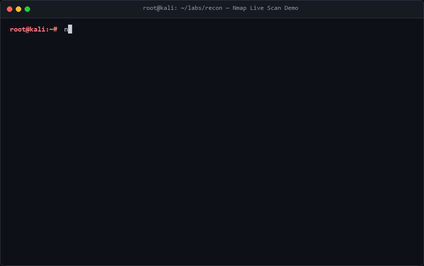
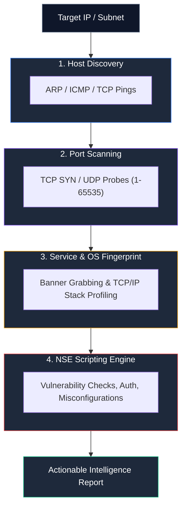
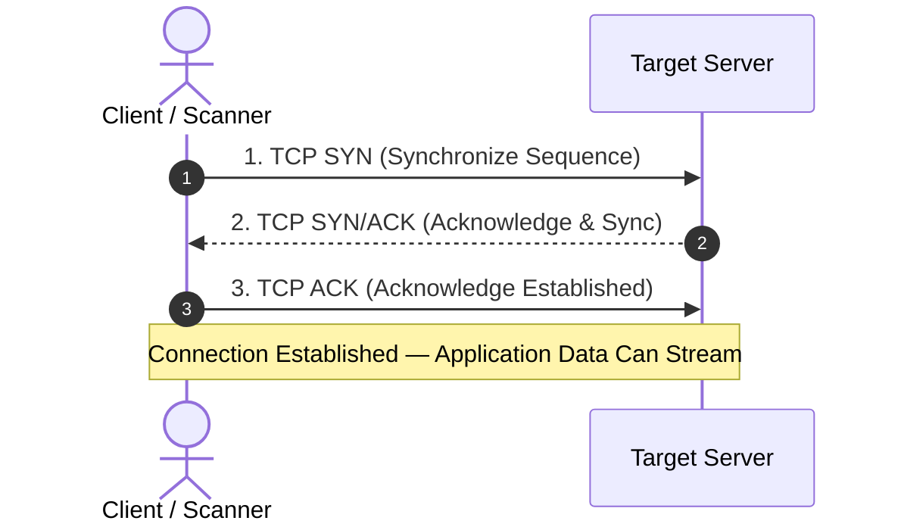
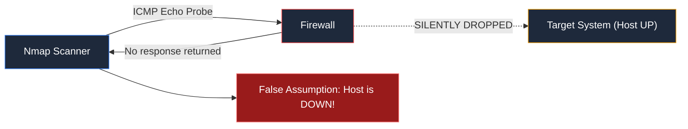
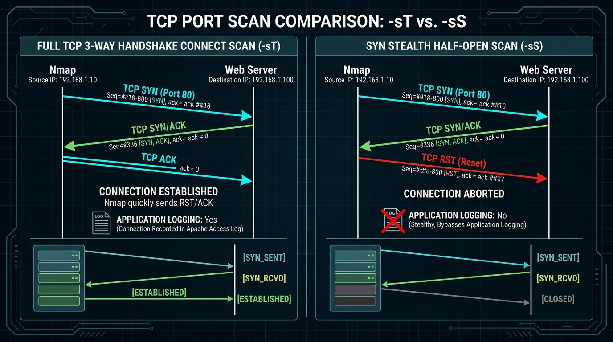
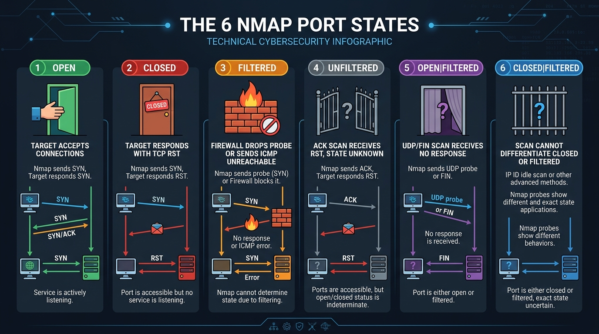
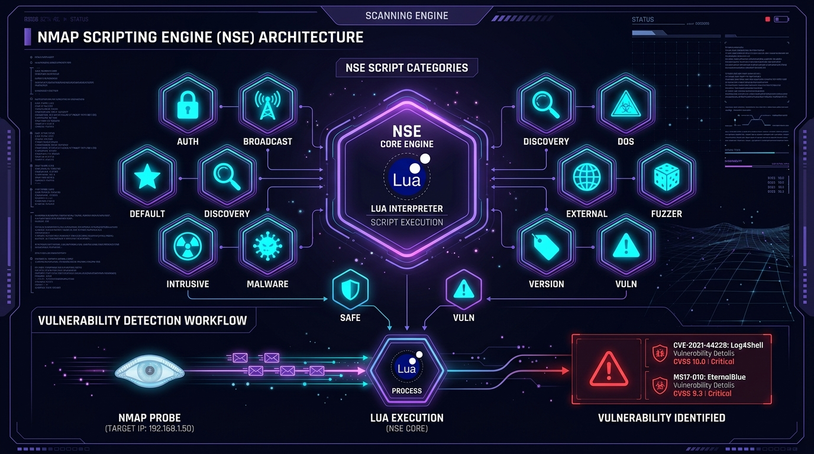
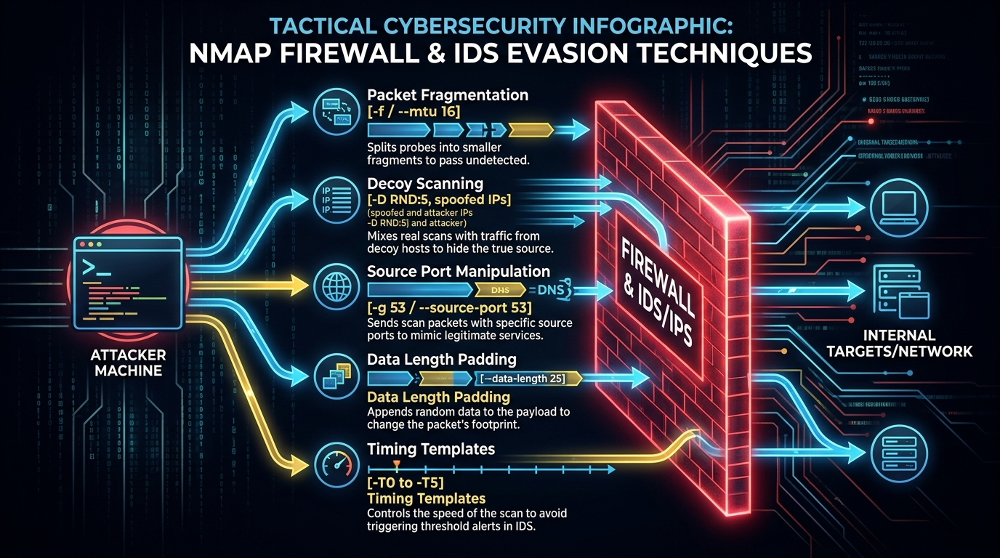
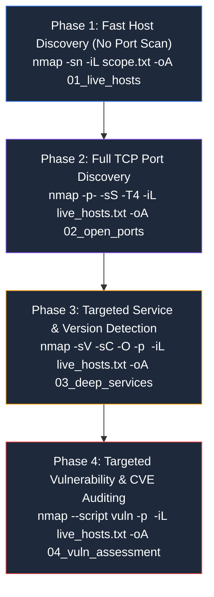
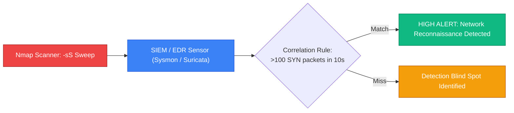

# Nmap: The Complete A-Z Network Discovery & Vulnerability Auditing Masterclass

> **Category:** Network Security & Reconnaissance | **Series:** Tooling Masterclass | **Level:** Beginner to Advanced

---

## Executive Overview

**Nmap (Network Mapper)** is the open-source industry standard for network discovery, port scanning, service fingerprinting, and automated vulnerability auditing. Whether conducting adversary emulation, perimeter penetration testing, red team reconnaissance, or internal SOC threat hunting, mastering Nmap at the packet level is a non-negotiable prerequisite for any cybersecurity professional.

Nmap does not rely on operating system assumptions; it transmits customized raw network probes (TCP, UDP, SCTP, ICMP, and ARP) and analyzes microsecond-level flag responses, TCP window sizes, IP ID sequences, and protocol handshakes to reconstruct target environments with forensic precision.


```text
+-----------------------------------------------------------------------------------------------+
|                               Nmap Reconnaissance & Auditing Matrix                           |
+--------------------------+------------------------------------+-------------------------------+
|  1. Host Discovery       |  2. Port & Protocol Scanning       |  3. Intelligence & Auditing   |
|  - ARP Discovery (L2)    |  - SYN Stealth Scan (-sS)          |  - Service Fingerprinting(-sV)|
|  - ICMP Echo & TS (-PE)  |  - TCP Connect Scan (-sT)          |  - OS TCP/IP Profiling (-O)   |
|  - TCP SYN/ACK Ping (-PS)|  - UDP Port Scanning (-sU)         |  - Lua Scripting Engine (NSE) |
|  - UDP Ping Probes (-PU) |  - Evasion Scans (-sN, -sF, -sX)   |  - CVE Vulnerability Auditing |
+--------------------------+------------------------------------+-------------------------------+
```

> [!IMPORTANT]
> **Legal & Ethical Notice:** Scanning systems without explicit, documented authorization from the network or asset owner is illegal and may trigger automated intrusion defense systems (IDS/IPS), resulting in immediate IP blacklisting and potential legal liability. Always scan within an authorized scope of work or dedicated lab environment.

---

### 📺 Interactive Video Demonstration & Live Scan Walkthrough

<div align="center">

| Demonstration | Target Architecture | Interactive Video Link |
| :--- | :--- | :---: |
| **Nmap Complete Masterclass: 0 to Hero** | Full TCP/UDP Discovery & NSE | [](https://www.youtube.com/results?search_query=nmap+complete+course+cybersecurity) |
| **Deep Packet Analysis with Wireshark & Nmap** | Packet Scans, TCP Handshake, RST Teardowns | [](https://www.youtube.com/results?search_query=nmap+packet+analysis+wireshark) |
| **NSE Scripting & Vulnerability Exploitation** | Log4j, EternalBlue & CVE Auditing | [](https://www.youtube.com/results?search_query=nmap+scripting+engine+vulnerability+scan) |

</div>

---

### 💻 Real-Time Terminal Scanning Demonstration

The following animated recording demonstrates a full reconnaissance scan (`nmap -sS -sV -sC -Pn -T4 10.10.10.50`), highlighting port discovery, banner grabbing, and NSE script execution:



---

## Course Roadmap

| Part | Topic Domain | Key Concepts |
| :--- | :--- | :--- |
| **1 – 4** | **Nmap Fundamentals & First Scan** | How Nmap works, packet mechanics, CLI flags, terminal output anatomy |
| **5 – 8** | **Target Scoping & Host Discovery** | CIDRs, exclusion lists, ARP vs ICMP, bypassing ping blocks (`-Pn`) |
| **9 – 15** | **TCP Scan Mechanics & Handshakes** | SYN Stealth (`-sS`) vs Connect (`-sT`), FIN, NULL, Xmas, and ACK filtering |
| **16 – 20** | **Port States & UDP Auditing** | The 6 port states, UDP latency reasoning (`-sU`), full port coverage (`-p-`) |
| **21 – 24** | **Service Fingerprinting & OS Profiling** | Banner grabbing (`-sV`), aggressive mode (`-A`), TCP/IP stack OS detection (`-O`) |
| **25 – 33** | **Nmap Scripting Engine (NSE)** | 14 script categories, vulnerability scanning (Log4j, MS17-010), HTTP/SMB |
| **34 – 35** | **Timing & Engine Optimization** | Timing templates (`-T0` to `-T5`), parallel host groups, min-rate tuning |
| **36 – 41** | **Firewall & IDS/IPS Evasion** | Packet fragmentation (`-f`), decoys (`-D`), source port spoofing (`-g 53`), IPv6 |
| **42 – 47** | **Pentest Integration & Tool Ecosystem** | Nmap + Burp Suite, Metasploit db_nmap, Wireshark packet dissection |
| **48 – 50** | **Purple-Team Perspective & SOC Logging** | Telemetry artifacts, firewall drops, SIEM correlation, mastery ladder |
| **51 – 57** | **Master Cheat Sheet & Lab Blueprints** | 15 hands-on lab exercises, command reference matrices, and methodology |

---

# 1. What Is Nmap?

**Nmap = Network Mapper**

Nmap is primarily a network discovery and security auditing tool. It is designed to rapidly evaluate both single hosts and massive enterprise networks consisting of tens of thousands of devices.

Nmap systematically answers eight fundamental security questions:
1. **Host State:** Which endpoints are currently alive and active?
2. **Attack Surface:** Which ports (TCP and UDP) are open and accepting traffic?
3. **Service Identity:** What specific software applications are running on those open ports?
4. **Version Precision:** What exact patch levels and software versions are exposed?
5. **Operating System:** What OS family, kernel version, and hardware architecture is the host running?
6. **Network Controls:** Are there stateful firewalls, packet filters, or WAFs filtering probes?
7. **Security Vulnerabilities:** Do exposed services exhibit known CVE vulnerabilities or insecure configurations?
8. **Compliance Verification:** Are unauthorized services (e.g., Telnet, cleartext FTP, SMBv1) active?

```bash
# Basic Nmap scan against a single IP address
nmap 192.168.1.10
```



---

# 2. How Nmap Actually Works

Nmap does not magically "look inside" a target operating system. It operates strictly by **emitting crafted raw network packets and observing the precise response characteristics**:

```text
Nmap Scanner                                 Target Host
     │                                            │
     ├─── Probe Packet (e.g. TCP SYN to port 80) ─►│
     │                                            │
     │◄── Response Packet (e.g. TCP SYN/ACK) ─────┤
     │                                            │
  [Analyze response: Flags, TTL, Window Size]
     │
  [Determine State: OPEN / CLOSED / FILTERED]
```

### The Foundations: The TCP 3-Way Handshake

In standard TCP communications, two endpoints establish a session via a 3-way handshake:



Nmap leverages variations of this handshake to determine whether an application is listening, whether a firewall is blocking packets, or whether a port is completely closed—all without necessarily completing a full connection.

---

# 3. Installing & Verifying Nmap

Nmap runs natively across Linux, macOS, and Windows.

```bash
# Ubuntu / Debian / Kali Linux
sudo apt update && sudo apt install -y nmap

# Fedora / Red Hat / CentOS
sudo dnf install -y nmap

# Arch Linux
sudo pacman -S nmap

# macOS (via Homebrew)
brew install nmap

# Verify installation and build version
nmap --version
```

**Expected Standard Output:**
```text
Nmap version 7.94SVN ( https://nmap.org )
Platform: x86_64-pc-linux-gnu
Compiled with: liblua-5.3.6 openssl-3.0.11 libssh2-1.11.0 libz-1.2.13 libpcre2-10.42 libpcap-1.10.4 nmap-libdnet-1.12
```

---

# 4. Your First Scan & Anatomy of Scan Output

Execute a basic scan against a local target:

```bash
nmap 192.168.1.10
```

**Annotated Scan Output:**

```text
Starting Nmap 7.94 ( https://nmap.org ) at 2026-09-30 21:15 UTC
Nmap scan report for 192.168.1.10
Host is up (0.00045s latency).
Not shown: 997 closed tcp ports (reset)

PORT     STATE SERVICE
22/tcp   open  ssh
80/tcp   open  http
443/tcp  open  https

Nmap done: 1 IP address (1 host up) scanned in 0.18 seconds
```

### Dissecting the Output Fields

* **`PORT` (`22/tcp`):** The transport-layer port number (1-65535) and protocol family (TCP or UDP).
* **`STATE` (`open`):** Nmap's verdict regarding accessibility. An `open` port indicates an application is actively accepting connections.
* **`SERVICE` (`ssh`, `http`):** Nmap's lookup of the port against its internal `nmap-services` database.

> [!WARNING]
> The `SERVICE` column reflects the **standard port assignment**, not necessarily proof of what software is actually running! For example, an attacker or administrator can run an SSH server on port 80. Always use `-sV` (Version Detection) to confirm the true software identity.

---

# 5. Target Specification & Scope Definition

Nmap offers unmatched flexibility when declaring scanning targets:

```bash
# 1. Single IP address
nmap 192.168.1.10

# 2. Space-separated list of multiple IPs
nmap 192.168.1.10 192.168.1.20 10.0.0.5

# 3. Octet Range (Scans 192.168.1.1 through 192.168.1.50)
nmap 192.168.1.1-50

# 4. CIDR Subnet (Scans entire /24 subnet = 256 IPs)
nmap 192.168.1.0/24

# 5. Multiple subnets simultaneously
nmap 192.168.1.0/24 10.10.0.0/16

# 6. Domain names / FQDNs
nmap scanme.nmap.org

# 7. Loading target list from an external text file (-iL)
nmap -iL scope_targets.txt
```

---

# 6. Excluding Sensitive Targets (`--exclude`)

During authorized enterprise penetration tests, critical systems (such as medical devices, legacy industrial controllers, or production domain controllers) may be explicitly out-of-scope:

```bash
# Exclude a single default gateway from a subnet scan
nmap 192.168.1.0/24 --exclude 192.168.1.1

# Exclude multiple individual IPs and ranges
nmap 192.168.1.0/24 --exclude 192.168.1.1,192.168.1.254,192.168.1.100-110

# Exclude targets listed in an external file (--excludefile)
nmap 192.168.1.0/24 --excludefile out_of_scope.txt
```

---

# 7. Host Discovery (`-sn`)

Before spending hours performing comprehensive port scans on dead IP addresses, execute **Host Discovery** (also called a "Ping Sweep"):

```bash
# Discover live hosts without scanning any ports (-sn)
nmap -sn 192.168.1.0/24
```

### How Nmap Discovers Hosts Behind the Scenes:
* **When run as `root` on a Local Ethernet / Wi-Fi Subnet:** Nmap emits **raw ARP requests** (`Who has 192.168.1.X?`). This is 100% reliable because local devices cannot hide from ARP.
* **When run across a Remote Router / Internet:** Nmap emits a 4-probe discovery packet sequence:
  1. ICMP Echo Request (`ping`)
  2. TCP SYN probe to port `443`
  3. TCP ACK probe to port `80`
  4. ICMP Timestamp Request

---

# 8. Why Ping Can Be Misleading (`-Pn`)

A classic beginner mistake:
```text
"The target doesn't respond to ping, so the server must be offline."
```

In modern enterprise networks, border firewalls and Windows Defender Firewall **silently discard ICMP Echo requests by default**:



### The Solution: `-Pn` (Treat All Hosts as Online)

```bash
# Skip ICMP ping discovery and force Nmap to scan ports directly
nmap -Pn 192.168.1.10
```

> [!TIP]
> Always include `-Pn` when scanning external internet perimeters, cloud environments (AWS, Azure), or hardened Windows hosts to prevent Nmap from skipping active targets.

---

# 9 & 10. TCP SYN Stealth Scan (`-sS`) vs. Full Connect Scan (`-sT`)

The **SYN Stealth Scan (`-sS`)** is Nmap's default privileged scan type. It is termed "stealth" or "half-open" because it **never completes the full TCP three-way handshake**:



```bash
# SYN Stealth Scan (Requires sudo / raw packet privileges)
sudo nmap -sS 192.168.1.10

# TCP Full Connect Scan (Unprivileged fallback)
nmap -sT 192.168.1.10
```

### Packet-Level Mechanics Comparison

```mermaid
sequenceDiagram
    autonumber
    actor Nmap as Nmap Scanner
    participant Target as Target Port 80 (Web Server)

    Note over Nmap,Target: Full TCP Connect Scan (-sT)
    Nmap->>Target: 1. TCP SYN
    Target-->>Nmap: 2. TCP SYN/ACK
    Nmap->>Target: 3. TCP ACK (Connection Established)
    Nmap->>Target: 4. TCP RST/ACK (Immediate Teardown)
    Note over Target: Application logs connection (e.g., Apache access.log)

    Note over Nmap,Target: SYN Stealth Scan (-sS)
    Nmap->>Target: 1. TCP SYN
    Target-->>Nmap: 2. TCP SYN/ACK
    Nmap->>Target: 3. TCP RST (Reset - Connection Aborted)
    Note over Target: Kernel resets socket; application NEVER sees connection!
```

### Feature Comparison Matrix

| Feature | SYN Stealth Scan (`-sS`) | TCP Connect Scan (`-sT`) |
| :--- | :---: | :---: |
| **Connection Established?** | ❌ No (Half-open) | ✅ Yes (Full 3-way handshake) |
| **Requires Root / Sudo?** | ✅ Yes (Raw socket injection) | ❌ No (Uses standard OS `connect()`) |
| **Application Layer Logged?** | ❌ No (Bypasses web/app logs) | ✅ Yes (Logged by target daemon) |
| **IDS / Firewall Detectable?** | ✅ Yes (Modern firewalls catch SYN spikes) | ✅ Yes |
| **Scanning Speed** | ⚡ Extremely Fast | 🐢 Slower (OS socket overhead) |

---

# 11 – 15. Advanced TCP Scans: FIN, NULL, Xmas & ACK

RFC 793 states that if a closed port receives a TCP packet lacking a SYN, ACK, or RST flag, the system **must respond with a TCP RST**. If the port is open, the packet must be **silently discarded**.

Nmap exploits this subtle RFC behavior through specialized scans:

```bash
# 1. TCP FIN Scan (-sF) — Sets only the FIN flag
sudo nmap -sF 192.168.1.10

# 2. TCP NULL Scan (-sN) — Clears all flags (Flags = 0)
sudo nmap -sN 192.168.1.10

# 3. TCP Xmas Scan (-sX) — Sets FIN, PSH, and URG (lit up like a Christmas tree)
sudo nmap -sX 192.168.1.10

# 4. TCP ACK Scan (-sA) — Used strictly to map firewall rule sets
sudo nmap -sA 192.168.1.10
```

> [!NOTE]
> Microsoft Windows, Cisco devices, and BSD-derived stacks violate RFC 793 by sending RST packets regardless of whether the port is open or closed. Therefore, FIN, NULL, and Xmas scans are effective primarily against standard Unix/Linux targets.

---

# 16. The 6 Nmap Port States Demystified

Nmap classifies ports into six distinct states based on the received packet telemetry:



### State Definitions & Response Packet Behavior

| Port State | Visual Meaning | Exact Packet Response from Target | Security Interpretation |
| :--- | :--- | :--- | :--- |
| **`open`** | Door is wide open | Target responds with `SYN/ACK` | Application is actively listening and accepting traffic. |
| **`closed`** | Door is locked | Target responds with `TCP RST` | Host is reachable, but no application is bound to that port. |
| **`filtered`** | Brick wall blocks door | Probe is silently dropped, or returns ICMP Type 3 error | A stateful firewall or packet filter is blocking probe transit. |
| **`unfiltered`** | Door is accessible | Target responds with `RST` to an ACK scan (`-sA`) | Port is reachable, but open vs. closed status cannot be determined. |
| **`open\|filtered`**| Curtain covers door | No response packet received (typical for UDP / FIN / NULL) | Nmap cannot tell if port is open or dropped by a filter. |
| **`closed\|filtered`**| Ambiguous | Observed only during specialized IP ID Idle scans (`-sI`) | State cannot be resolved between closed or filtered. |

---

# 17 & 18. Port Range Selection & Why `-p-` Is Mandatory

By default, Nmap scans only the **top 1,000 most common ports** defined in `nmap-services`. In security auditing, scanning only default ports leaves massive blind spots:

```bash
# 1. Scan a single specific port
nmap -p 80 192.168.1.10

# 2. Scan multiple discrete ports
nmap -p 22,80,443,8080,8443 192.168.1.10

# 3. Scan a numeric port range
nmap -p 1-1024 192.168.1.10

# 4. Fast scan top 100 ports (-F)
nmap -F 192.168.1.10

# 5. Scan the top 500 ports
nmap --top-ports 500 192.168.1.10

# 6. SCAN ALL 65,535 TCP PORTS (-p-)
nmap -p- 192.168.1.10
```

> [!CRITICAL]
> Adversaries and developers frequently bind high-value administrative interfaces, debug backdoors, and C2 listeners to non-standard high ports (e.g., `8080`, `8888`, `9001`, `31337`, `65432`). **A penetration test is incomplete without scanning all 65,535 ports (`-p-`)**.

---

# 19 & 20. UDP Port Scanning (`-sU`)

Unlike TCP, UDP is a connectionless protocol. It has no 3-way handshake, no sequence numbers, and applications are not required to respond to arbitrary probes:

```bash
# Scan common UDP services
sudo nmap -sU 192.168.1.10

# Scan specific high-value UDP ports
sudo nmap -sU -p 53,67,68,69,123,161,500,4500 192.168.1.10

# Scan both TCP and UDP simultaneously
sudo nmap -sS -sU -p T:22,80,443,U:53,161 192.168.1.10
```

### Why UDP Scanning is Slow & Difficult:
1. **Open UDP Ports Rarely Respond:** Unless Nmap sends a service-specific application payload (e.g., a DNS query to port 53 or an SNMP request to port 161), an open UDP port simply drops the packet, resulting in an ambiguous `open|filtered` verdict.
2. **ICMP Rate Limiting:** When a UDP port is closed, the Linux kernel returns an `ICMP Destination Unreachable (Port unreachable)` packet. However, modern kernels rate-limit ICMP error generation to **1 packet per second**. Scanning 1,000 UDP ports can therefore take over 15 minutes per host.

---

# 21 & 22. Service Version Detection (`-sV`) & Aggressive Mode (`-A`)

Once open ports are confirmed, determine the **exact software daemon and version**:

```bash
# Service Version Detection
nmap -sV 192.168.1.10

# Tune Version Detection Intensity (0 to 9, default is 7)
nmap -sV --version-intensity 9 192.168.1.10

# Aggressive Mode (-A): Version + OS + Default NSE + Traceroute
nmap -A 192.168.1.10
```

**Sample Output from `-sV`:**
```text
PORT     STATE SERVICE       VERSION
22/tcp   open  ssh           OpenSSH 8.9p1 Ubuntu 3ubuntu0.4 (Ubuntu Linux; protocol 2.0)
80/tcp   open  http          Apache httpd 2.4.52 ((Ubuntu))
445/tcp  open  microsoft-ds  Samba smbd 4.15.13-Ubuntu
```

---

# 23 & 24. Remote OS Fingerprinting (`-O`)

Nmap determines the target's operating system by measuring subtle TCP/IP stack implementation differences (known as TCP/IP fingerprinting):

```bash
# Enable OS Detection
sudo nmap -O 192.168.1.10

# Guess OS aggressively when exact match fails
sudo nmap -O --osscan-guess 192.168.1.10

# Combine OS Detection with Service Detection
sudo nmap -O -sV 192.168.1.10
```

### Metrics Analyzed for OS Fingerprinting:
* Initial Sequence Number (ISN) predictability
* TCP options ordering (MSS, Window Scale, SACK-permitted, Timestamps)
* IP Header Don't Fragment (DF) bit behavior
* TCP initial window size
* ICMP error message quoting behavior

---

# 25 – 33. The Nmap Scripting Engine (NSE) & Vulnerability Auditing

The **Nmap Scripting Engine (NSE)** transforms Nmap from a port scanner into an automated vulnerability assessment and exploitation platform powered by the **Lua** programming language:



### The 14 NSE Script Categories

| Category | Operational Purpose | Example Script |
| :--- | :--- | :--- |
| **`default`** | Fast, high-value, safe scripts executed by `-sC` | `ssl-cert`, `http-title` |
| **`vuln`** | Scans for specific known CVE vulnerabilities | `smb-vuln-ms17-010`, `http-vuln-cve2021-44228` |
| **`auth`** | Audits authentication schemes and bypasses | `ssh-auth-methods`, `http-auth` |
| **`safe`** | Low-noise scripts guaranteed not to crash services | `ssh2-enum-algos`, `dns-recursion` |
| **`intrusive`** | High-risk scripts that may crash legacy daemons | `snmp-brute`, `http-sql-injection` |
| **`exploit`** | Actively attempts to trigger and exploit flaws | `smb-vuln-ms08-067` |
| **`discovery`** | Queries directory trees, SNMP databases, DNS records | `http-enum`, `smb-enum-shares` |
| **`malware`** | Hunts for backdoor signatures and botnet listeners | `smtp-strangeport`, `auth-spoof` |

---

### High-Impact NSE Commands for Security Assessments

```bash
# 1. Execute safe, default enumeration scripts (-sC)
nmap -sC 192.168.1.10

# 2. Run all vulnerability scripts against a target
nmap --script vuln 192.168.1.10

# 3. Audit for MS17-010 (EternalBlue SMB Remote Code Execution)
nmap -p 445 --script smb-vuln-ms17-010 192.168.1.50

# 4. Audit Web Server for Log4Shell (CVE-2021-44228)
nmap -p 80,443,8080 --script http-vuln-cve2021-44228 192.168.1.50

# 5. Extract SSL/TLS Certificate Metadata & Supported Ciphers
nmap -p 443 --script ssl-cert,ssl-enum-ciphers 192.168.1.10

# 6. Enumerate SMB Shares & Null Session Access
nmap -p 445 --script smb-enum-shares,smb-enum-users 192.168.1.10

# 7. Discover Web Server Directories and Backup Files
nmap -p 80 --script http-enum 192.168.1.10
```

---

# 34 & 35. Timing Templates & Scan Optimization

Nmap provides six predefined **Timing Templates (`-T0` through `-T5`)** to control probe pacing and timeout calculations:

| Flag | Template Name | Probe Delay | Primary Tactical Use Case |
| :---: | :--- | :--- | :--- |
| **`-T0`** | **Paranoid** | 5 minutes | Evading strict, threshold-based Intrusion Detection Systems (IDS). |
| **`-T1`** | **Sneaky** | 15 seconds | Evading SIEM correlation rules across extended engagements. |
| **`-T2`** | **Polite** | 0.4 seconds | Minimizing target bandwidth consumption and avoiding rate-limits. |
| **`-T3`** | **Normal** | Dynamic | Default Nmap timing; dynamic adaptive timing based on latency. |
| **`-T4`** | **Aggressive** | Dynamic (Fast) | **Industry Standard:** Optimized for reliable, modern high-speed networks. |
| **`-T5`** | **Insane** | Dynamic (Ultra-Fast) | Blazing fast; sacrifices accuracy on lossy connections. |

```bash
# High-speed enterprise subnet scan with minimum packet rate
sudo nmap -sS -p- --min-rate 2000 -T4 10.10.10.0/24
```

---

# 36 – 39. Firewall & IDS/IPS Evasion Techniques

When evaluating security architectures, Red Teams test whether defensive controls detect or block probe traffic:



### Evasion Techniques Breakdown

#### 1. Packet Fragmentation (`-f`, `--mtu`)
Splits the TCP header across multiple small 8-byte or 16-byte IP fragments to prevent legacy inspection engines from analyzing complete packet flags:
```bash
# Fragment packets into 16-byte chunks
sudo nmap -f 192.168.1.10

# Specify custom MTU (Must be a multiple of 8)
sudo nmap --mtu 24 192.168.1.10
```

#### 2. Decoy Scanning (`-D`)
Blends the attacker's real IP address among multiple spoofed decoy addresses. The target's firewall and SIEM log alerts from all IPs simultaneously, making attribution nearly impossible:
```bash
# Mix 5 random decoy IPs with the real scanner IP (ME)
sudo nmap -D RND:5,ME 192.168.1.10
```

#### 3. Source Port Manipulation (`-g`, `--source-port`)
Many legacy firewall rules permit inbound traffic originating from trusted service ports (such as DNS port 53 or NTP port 123) without inspection:
```bash
# Force scan probes to originate from source port 53 (DNS)
sudo nmap -g 53 192.168.1.10
```

#### 4. Random Data Length Padding (`--data-length`)
Default Nmap probes have distinct, identifiable payload lengths. Appending random bytes disguises packets as benign application traffic:
```bash
# Append 25 random bytes to every probe
sudo nmap --data-length 25 192.168.1.10
```

---

# 40 & 41. IPv6 Scanning & Output Formats

```bash
# Scan an IPv6 target (-6)
nmap -6 2001:db8:85a3::8a2e:370:7334
```

### The 4 Major Output Formats

Always archive raw scan data for reporting and automated script processing:

```bash
# 1. Normal human-readable text (-oN)
nmap -oN client_scan.txt 192.168.1.10

# 2. Machine-readable XML format (-oX) — Required for Metasploit & Burp import
nmap -oX client_scan.xml 192.168.1.10

# 3. Grepable format (-oG) — Optimized for grep, awk, and cut pipelines
nmap -oG client_scan.gnmap 192.168.1.10

# 4. MASTER COMBO (-oA) — Outputs all 3 formats simultaneously
nmap -oA client_assessment_report 192.168.1.10
```

---

# 42 & 43. Professional Penetration Testing Workflow

In professional engagements, follow a **structured, phased methodology** to maximize discovery while minimizing target network strain:



### The "Go-To" Single-Command Penetration Testing Scan

When assessing an individual target server, this single command delivers maximum actionable intelligence:

```bash
sudo nmap -sS -sV -sC -O -p- --min-rate 1000 -T4 -Pn -oA target_audit 10.10.10.50
```

* **`-sS`:** Fast, half-open SYN stealth scanning.
* **`-sV`:** High-confidence service version fingerprinting.
* **`-sC`:** Executes safe, standard default NSE enumeration scripts.
* **`-O`:** Profiles the remote operating system.
* **`-p-`:** Evaluates all 65,535 TCP ports.
* **`--min-rate 1000`:** Enforces high probe speed.
* **`-Pn`:** Skips ping discovery to prevent firewall suppression.
* **`-oA`:** Saves logs in all output formats simultaneously.

---

# 44. Nmap + Wireshark Packet Inspection

Validating Nmap behavior in Wireshark provides deep insight into how firewalls and endpoints process traffic.

### Wireshark Display Filters for Nmap Analysis:

```text
# Filter only TCP SYN packets originating from the scanner
ip.src == 192.168.1.100 && tcp.flags.syn == 1 && tcp.flags.ack == 0

# Filter target RST responses indicating closed ports
ip.dst == 192.168.1.100 && tcp.flags.reset == 1

# Filter ICMP Destination Unreachable error packets
icmp.type == 3

# Filter specific HTTP banner probe requests
http.request.method == "GET" || http.request.method == "HEAD"
```

---

# 45. Nmap + Metasploit Integration

Metasploit includes a built-in PostgreSQL database to automatically parse, store, and correlate Nmap scan findings:

```bash
# Launch Metasploit Framework
msfconsole -q

# Check database connection status
msf6 > db_status

# Execute Nmap directly within Metasploit (Stores results in database automatically)
msf6 > db_nmap -sS -sV -p 22,80,443,445 10.10.10.50

# List all discovered hosts
msf6 > hosts

# List all discovered services, ports, and versions
msf6 > services

# Search for matching exploit modules for an identified service version
msf6 > vulns
```

---

# 48 – 50. The Purple-Team Perspective & SOC Detection

A purple-team mindset evaluates **both what the scanner sees and what the Security Operations Center (SOC) logs**:



### Detecting Nmap in Splunk & SIEM Platforms:

```spl
/* Splunk SPL: Detect port scan reconnaissance by tracking distinct destination ports */
index=firewall action=blocked OR action=teardown
| bin _time span=1m
| stats dc(dest_port) as PortCount, values(dest_port) as ScannedPorts by src_ip, dest_ip, _time
| where PortCount > 50
| eval Severity="High", AlertName="Nmap Port Scan Detected"
```

---

# 51 – 57. Master Nmap Command Cheat Sheet

```bash
# ==============================================================================
# 🎯 HOST DISCOVERY & TARGET SCOPING
# ==============================================================================
nmap -sn 192.168.1.0/24                   # Host discovery / ping sweep (no port scan)
nmap -Pn 192.168.1.10                     # Treat host as online (bypass ping blocks)
nmap -iL targets.txt                      # Scan list of targets from file
nmap 192.168.1.0/24 --exclude 192.168.1.1 # Exclude specific IP from subnet scan

# ==============================================================================
# ⚡ PORT SCANNING TECHNIQUES
# ==============================================================================
sudo nmap -sS 192.168.1.10                # TCP SYN Stealth Scan (Privileged default)
nmap -sT 192.168.1.10                     # Full TCP Connect Scan (Unprivileged)
sudo nmap -sU 192.168.1.10                # UDP Port Scan
nmap -p 80,443,8080 192.168.1.10          # Scan specific comma-separated ports
nmap -p 1-1000 192.168.1.10               # Scan port range
nmap -p- 192.168.1.10                     # Scan ALL 65,535 TCP ports
nmap -F 192.168.1.10                      # Fast scan top 100 ports

# ==============================================================================
# 🔍 FINGERPRINTING & AUDITING
# ==============================================================================
nmap -sV 192.168.1.10                     # Probe service software & version banners
sudo nmap -O 192.168.1.10                 # Profile remote operating system
nmap -A 192.168.1.10                      # Aggressive scan: Version + OS + Scripts + Trace
nmap -sC 192.168.1.10                     # Execute default safe NSE scripts

# ==============================================================================
# 🛡️ NMAP SCRIPTING ENGINE (NSE)
# ==============================================================================
nmap --script vuln 192.168.1.10           # Audit target against all CVE vulnerability scripts
nmap -p 445 --script smb-vuln-ms17-010    # Audit for MS17-010 EternalBlue
nmap -p 80 --script http-enum             # Enumerate hidden directories and endpoints
nmap -p 443 --script ssl-cert,ssl-ciphers # Audit TLS certificates and supported ciphers

# ==============================================================================
# 🥷 FIREWALL / IDS EVASION
# ==============================================================================
sudo nmap -f 192.168.1.10                 # Fragment packets into 8-byte chunks
sudo nmap --mtu 16 192.168.1.10           # Custom MTU packet fragmentation
sudo nmap -D RND:5,ME 192.168.1.10        # Decoy scan with 5 spoofed IP addresses
sudo nmap -g 53 192.168.1.10              # Spoof source port as DNS (port 53)
nmap -T1 192.168.1.10                     # Sneaky timing template to evade thresholds

# ==============================================================================
# 💾 OUTPUT & LOGGING
# ==============================================================================
nmap -oN scan.txt 192.168.1.10            # Save human-readable text output
nmap -oX scan.xml 192.168.1.10            # Save machine-readable XML output
nmap -oG scan.gnmap 192.168.1.10          # Save grepable output
nmap -oA assessment_output 192.168.1.10   # Save ALL three major formats simultaneously
```

---

# Summary & The Road to Mastery

Nmap is far more than a port scanner—it is a **complete network diagnostics and security engineering instrument**.

True mastery is not measured by memorizing flags; it is measured by understanding **the packets on the wire**:
1. When you type `-sS`, visualize the `SYN` traveling out, the `SYN/ACK` returning, and your kernel emitting `RST` to tear down the socket before an application log can record it.
2. When you receive `filtered`, recognize that a firewall dropped your packet or emitted an ICMP Type 3 error.
3. When you run NSE scripts, understand the Lua networking calls probing the application layer.

By combining low-level packet awareness, structured methodology, and purple-team telemetry verification, you elevate Nmap from a basic scanning utility into an elite cybersecurity capability.
